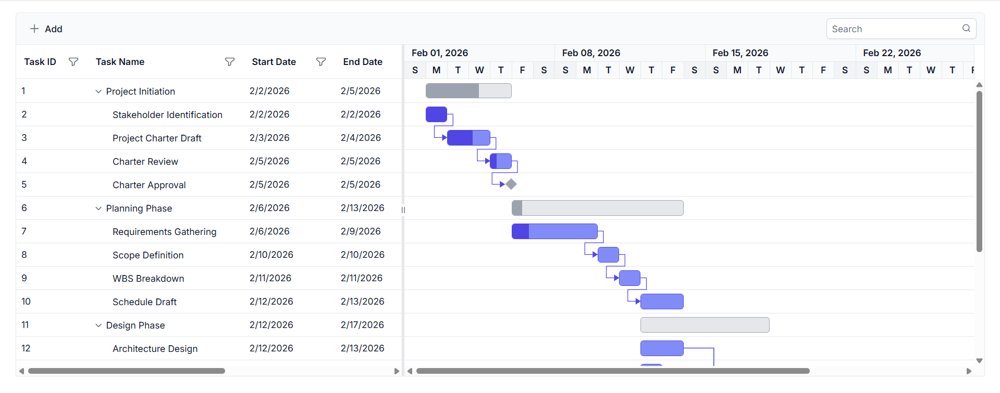

# Connect Syncfusion Blazor Gantt Chart with GraphQL using Hot Chocolate

GraphQL is a query language that allows applications to request exactly the data needed, nothing more and nothing less. Unlike traditional REST APIs that return fixed data structures, GraphQL enables the client to specify the shape and content of the response.

**Traditional REST APIs** and **GraphQL** differ mainly in how data is requested and returned: **REST APIs expose** multiple endpoints that return fixed data structures, often including unnecessary fields and requiring several requests to fetch related data, while **GraphQL** uses a single endpoint where queries define the exact fields needed, enabling precise responses and allowing related data to be retrieved efficiently in one request. This makes **GraphQL** especially useful for **Blazor Gantt Chart integration**, the **reason** is data‑centric UI components require well‑structured and selective datasets to support efficient filtering, reduce network calls, and improve overall performance.

**Key GraphQL Concepts**

- **Queries**: A query is a request to read data. Queries do not modify data; they only retrieve it.
- **Mutations**: A mutation is a request to modify data. Mutations create, update, or delete records.
- **Resolvers**: Each query or mutation is handled by a resolver, which is a function responsible for fetching data or executing an operation. **Query resolvers** handle **read operations**, while **mutation resolvers** handle **write operations**.
- **Schema**: Defines the structure of the API. The schema describes available data types, the fields within those types, and the operations that can be executed. Query definitions specify how data can be retrieved, and mutation definitions specify how data can be modified. 

[Hot Chocolate](https://chillicream.com/docs/hotchocolate/v15) is an open‑source GraphQL server framework for .NET. Hot Chocolate enables the creation of GraphQL APIs using ASP.NET Core and integrates seamlessly with modern .NET applications, including Blazor.

## Prerequisites

Install the following software and packages before starting the process:

| Software/Package | Version | Purpose |
|-----------------|---------|---------|
| Visual Studio 2026 | 18.0 or later | Development IDE with Blazor workload |
| .NET SDK | net10.0 or compatible | Runtime and build tools |
| SQLite | Latest stable version | Core framework for database operations |
| Microsoft.EntityFrameworkCore | 9.0.0 or later | Core framework for database operations |
| Microsoft.EntityFrameworkCore.Tools | 9.0.0 or later | Tools for managing database migrations |
| Microsoft.EntityFrameworkCore.Sqlite | 9.0.0 or later | SQLite provider for Entity Framework Core |
| HotChocolate.AspNetCore | 15.1 or later | GraphQL server framework |
| Syncfusion.Blazor.Gantt | {{site.blazorversion}} | Gantt Chart component |
| Syncfusion.Blazor.Themes | {{site.blazorversion}} | Styling for Gantt Chart |

## Setting up the SQLite environment for Entity Framework Core

### Create the database and table in SQLite

First, the **SQLite database** structure must be created to store task records. Unlike server-based databases, a SQLite database is a single file on disk.

**Instructions:**
1. To view or edit the database, use **DB Browser for SQLite** or the `sqlite3` command-line tool.
2. Create a new database file named `GanttDB.db`.
3. Define a `TaskData` table with the specified schema.
4. Insert sample data for testing.

Run the following SQL script:

```sql
-- Create Database GanttDB.db
-- Create the TaskData table 
CREATE TABLE IF NOT EXISTS TaskData (
    TaskID       INTEGER PRIMARY KEY,
    TaskName     TEXT NOT NULL,
    StartDate    DATETIME,     
    EndDate      DATETIME,     
    Duration     TEXT,
    Progress     INTEGER,
    Predecessor  TEXT,         
    ParentID     INTEGER
   );

INSERT INTO TaskData (TaskName, StartDate, EndDate, Duration, Progress, Predecessor, ParentID)
VALUES
  ("Project Planning", "2026-02-01", "2026-02-03", "2", 80, NULL, NULL),
  ("Design Phase", "2026-02-04", "2026-02-07", "3", 40, "1FS", 1);

```
**Update the connection string**

   SQLite uses a **file‑based database**, so to connect to the database, simply point to the location of the .db file.
   The key **GanttDb** refers to the database name used by the application and it can be renamed as needed.
   
   Open `appsettings.json` and configure the SQLite connection:
   ```json
   {
     "ConnectionStrings": {
         "GanttDb": "Data Source=D:..\\GanttDB.db"
      },
     "AllowedHosts": "*"
   }
   ```  

## Setting up the GraphQL Backend

### Step 1: Install required NuGet Packages and configure launch Settings

Before installing NuGet packages, a new Blazor Web Application must be created using the default template. The template automatically generates essential starter files such as **Program.cs, appsettings.json, launchSettings.json, the wwwroot folder, and the Components folder**.

For this guide, a Blazor application named **GanttGraphQLAdaptor** has been created.

**Install NuGet Packages**

NuGet packages are software libraries that add functionality to applications. The following packages enable GraphQL server functionality+ and Syncfusion Gantt Chart components.

**Required Packages:**

- **HotChocolate.AspNetCore** (version 15.1 or later) - GraphQL server framework
- **Syncfusion.Blazor.Gantt** (version {{site.blazorversion}}) - Gantt Chart component
- **Syncfusion.Blazor.Themes** (version {{site.blazorversion}}) - Styling for Gantt Chart

**Method 1: Using Package Manager Console**

1. Open Visual Studio 2026.
2. Navigate to **Tools → NuGet Package Manager → Package Manager Console**.
3. Run the following commands:

```powershell
Install-Package HotChocolate.AspNetCore -Version 15.1.12
Install-Package Syncfusion.Blazor.Gantt -Version {{site.blazorversion}}
Install-Package Syncfusion.Blazor.Themes -Version {{site.blazorversion}}
```

**Method 2: Using NuGet Package Manager UI**

1. Open **Visual Studio 2026 → Tools → NuGet Package Manager → Manage NuGet Packages for Solution**.
2. Search for and install each package individually:
   - **HotChocolate.AspNetCore** (version 15.1.12 or later)   
   - **[Syncfusion.Blazor.Gantt](https://www.nuget.org/packages/Syncfusion.Blazor.Gantt)** (version {{site.blazorversion}})
   - **[Syncfusion.Blazor.Themes](https://www.nuget.org/packages/Syncfusion.Blazor.Themes/)** (version {{site.blazorversion}})

All required packages are now installed.

---

### Step 2: Register Hot Chocolate Services in Program.cs

The `Program.cs` file configures and registers the GraphQL services.

**Instructions:**

1. Open the `Program.cs` file at the project root.
2. Add the following code after `var builder = WebApplication.CreateBuilder(args);`:

```csharp
[Program.cs]

using GanttGraphQLAdaptor.Models;
using HotChocolate.Execution.Configuration;

var builder = WebApplication.CreateBuilder(args);

// Register Hot Chocolate GraphQL services
builder.Services
    .AddGraphQLServer()
    .AddQueryType<GraphQLQuery>()
    .AddMutationType<GraphQLMutation>();

var app = builder.Build();

// Map the GraphQL endpoint (default: /graphql)
app.MapGraphQL();

app.Run();
```

**Details:**

- `AddGraphQLServer()` - Initializes the Hot Chocolate GraphQL server
- `AddQueryType<GraphQLQuery>()` - Registers query resolvers for read operations
- `AddMutationType<GraphQLMutation>()` - Registers mutation resolvers for write operations
- `MapGraphQL()` - Exposes the GraphQL endpoint at `/graphql`

The GraphQL backend is now configured and ready. The GraphQL endpoint is accessible at `https://localhost:70xx/graphql`(Replace `70xx` with the port number shown in the **launchSettings.json**).

---

### Step 3: Configure launch settings (port configuration)

The **launchsettings.json** file controls the port number where the application runs. This file is located in the **Properties** folder at **Properties/launchsettings.json**.

**Instructions to Change the Port:**

1. Open the **Properties** folder in the project root.
2. Double-click **launchsettings.json** to open the file.
3. Locate the `https` profile section:

```json
"https": {
  "commandName": "Project",
  "dotnetRunMessages": true,
  "launchBrowser": true,
  "applicationUrl": "https://localhost:7000;http://localhost:5167",
  "environmentVariables": {
    "ASPNETCORE_ENVIRONMENT": "Development"
  }
}
```

4. Modify the `applicationUrl` property to change the port numbers:
   - `https://localhost:7000` - HTTPS port (change 7000 to desired port)
   - `http://localhost:5167` - HTTP port (change 5167 to desired port)

5. Example configuration with custom ports:

```json
"https": {
  "commandName": "Project",
  "dotnetRunMessages": true,
  "launchBrowser": true,
  "applicationUrl": "https://localhost:7777;http://localhost:5555",
  "environmentVariables": {
    "ASPNETCORE_ENVIRONMENT": "Development"
  }
}
```

6. Save the file and restart the application for the changes to take effect.

**Important Notes:**

- Port numbers must be between 1024 and 65535.
- Avoid using ports already in use by other applications.
- The GraphQL endpoint will be accessible at the configured HTTPS URL (e.g., `https://localhost:7777/graphql`).

All configuration steps are now complete.

---

### Step 4: Create the data model

The data model represents the structure of data that the application stores. It defines the properties (fields) that make up a record. Each property corresponds to a column in the database table. The data model acts as the blueprint for how data is organized and accessed throughout the application.

**Instructions**:

1. Create a new folder named **Models** in the project root directory.
2. Inside the **Models** folder, create a new file named **TaskDataModel.cs**.
3. Define the **TaskDataModel** class with the following code:

**File Location:** `Models/TaskDataModel.cs`

```csharp
namespace GanttGraphQLAdaptor.Models
{
    /// <summary>
    /// Represents a single record stored in the database.
    /// Each property corresponds to a database column.
    /// </summary>
    public class TaskDataModel
    {       
        [JsonPropertyName("taskID")]
        public int? TaskID { get; set; }
    
        [JsonPropertyName("taskName")]
        public string? TaskName { get; set; }
    
        [JsonPropertyName("startDate")]
        public DateTime? StartDate { get; set; }
    
        [JsonPropertyName("endDate")]
        public DateTime? EndDate { get; set; }
    
        [JsonPropertyName("duration")]
        public string? Duration { get; set; }
    
        [JsonPropertyName("progress")]
        public int? Progress { get; set; }
    
        [JsonPropertyName("predecessor")]
        public string? Predecessor { get; set; }
    
        [JsonPropertyName("parentID")]
        public int? ParentID { get; set; }
    }
}
```
**Property Mapping Reference**

The following table shows how C# properties map to database columns and GraphQL field names:

| Property Name (C#) | Database Column | GraphQL Field Name | Data Type | Purpose |
|---|---|---|---|---|
| `TaskID` | `TaskID` | `taskID` | `Integer` | Unique identifier for each Gantt Chart task |
| `TaskName` | `TaskName` | `taskName` | `String` | Name or title of the task displayed in the Gantt Chart |
| `StartDate` | `StartDate` | `startDate` | `DateTime` | Start date of the task |
| `EndDate` | `EndDate` | `endDate` | `DateTime` | End date of the task; used to calculate task duration |
| `Duration` | `Duration` | `duration` | `String` | Task duration value in days (string format for compatibility) |
| `Progress` | `Progress` | `progress` | `Integer` | Task completion percentage shown in the Gantt Chart progress bar |
| `Predecessor` | `Predecessor` | `predecessor` | `String` | Dependency link (e.g., 2FS, 3SS+2d) defining task relationship |

**Important Convention: Camel Case Conversion**

**Hot Chocolate GraphQL** automatically converts C# property names (**PascalCase**) to GraphQL field names (**camelCase**). This convention ensures consistent naming in the GraphQL schema:

- C# Property: `TaskName` → GraphQL Field: `taskName`
- C# Property: `TaskID` → GraphQL Field: `taskID`
- C# Property: `StartDate` → GraphQL Field: `startDate`

**Explanation**:

- Each property represents a column in the database table.
- The model provides the data structure that GraphQL uses to process queries and mutations.

The Task data model has been successfully created.

---

### Step 5: GraphQL query resolvers

A query resolver is a method in the backend that handles read requests from the client. When the Gantt Chart needs to fetch data, it sends a GraphQL query to the server. The query resolver receives this request, processes it, and returns the appropriate data. Query resolvers do not modify data; they only retrieve and return it.

In simple terms, a **GraphQL query** asks a question,
and a **resolver** is the one who answers it.

**Instructions:**

1. Inside the **Models** folder, create a new file named **GraphQLQuery.cs**.
2. Add the following code to define the query resolver:

```csharp
[Models/GraphQLQuery.cs]

namespace GanttGraphQL.Models
{
    /// <summary>
    /// GraphQL query resolver for the Syncfusion GraphQLAdaptor used by the Gantt Chart.
    /// Exposes a field named <c>taskData</c> that accepts DataManager request parameters
    /// and returns a payload containing the result set and total record count.
    /// </summary>
    public class GraphQLQuery
    {
        /// <summary>
        /// Retrieves Gantt Chart task data and returns it along with the total record count.
        /// Applies searching, filtering, sorting, skip, and take based on the incoming DataManager request parameters from the GraphQLAdaptor.
        /// </summary>
        /// <param name="dataManager">
        /// The data manager request input containing query parameters such as search, where (filters), sorted (multi-column sort), skip, take</c>.
        /// </param>
        /// <param name="db">The EF Core database context used to query task records.</param>
        /// <returns>
        /// An instance of <see cref="TaskDataResponse"/> containing the filtered task list
        /// and the corresponding record count (total count when <c>RequiresCounts</c> is true).
        /// </returns>
        [GraphQLName("taskData")]
        public async Task<TaskDataResponse> GetTaskData([GraphQLName("dataManager")] DataManagerRequestInput dataManagerInput, [Service] GanttDbContext db)
        {
            DataManagerRequestInput dm = dataManagerInput ?? new DataManagerRequestInput
            {
                Skip = 0,
                Take = 0,
                RequiresCounts = false
            };
            
            List<TaskDataModel> dataSource = await db.Tasks
                                     .AsNoTracking()
                                     .OrderBy(t => t.TaskID)
                                     .ToListAsync();

            IEnumerable<TaskDataModel> query = dataSource;

            // 1) Searching
            if (dm.Search is { Count: > 0 })
            {
                query = DataOperations.PerformSearching(query, dm.Search);
            }

            // 2) Filtering
            if (dm.Where is { Count: > 0 })
            {
                // Base condition "and"/"or" (default to "and" if missing)
                string? baseCondition = dm.Where[0].Condition ?? dm.Where[0].Operator;
                if (string.IsNullOrWhiteSpace(baseCondition)) baseCondition = "and";

                query = DataOperations.PerformFiltering(query, dm.Where, baseCondition);
            }

            // 3) Sorting (multi-column supported)
            if (dm.Sorted is { Count: > 0 })
            {
                query = DataOperations.PerformSorting(query, dm.Sorted);
            }

            int totalCount = query.Count();
            
            if (dm.Skip > 0) query = DataOperations.PerformSkip(query, dm.Skip);
            if (dm.Take > 0) query = DataOperations.PerformTake(query, dm.Take);

            return new TaskDataResponse
            {
                Count = dm.RequiresCounts ? totalCount : query.Count(), // return total only if asked
                Result = query.ToList()
            };
        }
    }

    /// <summary>
    /// Response payload expected by the Syncfusion GraphQLAdaptor for list queries.
    /// Must expose <c>count</c> and <c>result</c> fields to enable paging and total count.
    /// </summary>
    public class TaskDataResponse
    {
        /// <summary>
        /// Total number of records for the current query.
        /// When <c>RequiresCounts</c> is true in the request, this should reflect the total
        /// count before paging; otherwise it may be the count of the returned page.
        /// </summary>
        [GraphQLName("count")]
        public int Count { get; set; }

        /// <summary>
        /// The collection of task records returned for the current request.
        /// </summary>
        [GraphQLName("result")]
        public List<TaskDataModel> Result { get; set; } = new List<TaskDataModel>();
    }
}
```

**Details:**

- The `GetTaskData` method receives `DataManagerRequestInput`, which contains filter, sort, and search parameters from the Gantt Chart
- Hot Chocolate automatically converts the method name `GetTaskData` to camelCase: `getTaskData` in the GraphQL schema
- The response must contain `Count` (total records) and `Result` (current page data) for the Gantt Chart

The query resolver has been created successfully.

---

### Step 6: Create the DataManagerRequestInput class

A **DataManagerRequestInput** class is a GraphQL input type that represents all the parameters of Gantt Chart sends to the backend when requesting data. This class acts as a container for filtering, sorting, searching, and other data operation parameters.

**Purpose**
When the Gantt Chart performs operations like sorting, filtering, or searching, it packages all these parameters into a `DataManagerRequestInput` object and sends it to the GraphQL backend. The backend then uses these parameters to fetch and return only the data that needs.

**Instructions**:

1. Inside the **Models** folder, create a new file named **DataManagerRequestInput.cs**.
2. Define the **DataManagerRequestInput** class and supporting classes with the following code:

```csharp
namespace GanttGraphQLAdaptor.Models;

/// <summary>
/// Represents the input structure for data manager requests from the Gantt Chart.
/// Contains all parameters needed for data operations like filtering, sorting, and searching.
/// </summary>
public class DataManagerRequestInput
{
    /// <summary>
    /// Number of records to skip from the beginning.
    /// Example: Skip=10 means start from the 11th record.
    /// </summary>
    [GraphQLName("Skip")]
    public int Skip { get; set; }

    /// <summary>
    /// Number of records to retrieve.
    /// Example: Take=10 means retrieve 10 records per page.
    /// </summary>
    [GraphQLName("Take")]
    public int Take { get; set; }

    /// <summary>
    /// Indicates whether the total record count should be calculated.
    /// Set to true when pagination requires knowing the total number of records.
    /// </summary>
    [GraphQLName("RequiresCounts")]
    public bool RequiresCounts { get; set; } = false;

    /// <summary>
    /// Additional custom parameters sent from the client.
    /// Used for advanced scenarios requiring extra metadata.
    /// </summary>
    [GraphQLName("Params")]
    [GraphQLType(typeof(AnyType))]
    public IDictionary<string, object> Params { get; set; }

    /// <summary>
    /// Collection of search expressions used for keyword matching.
    /// Example: searching across task name, duration, or other fields.
    /// </summary>
    [GraphQLName("Search")]
    public List<SearchFilter>? Search { get; set; }

    /// <summary>
    /// Collection of sorting instructions.
    /// Supports multi-column sorting (e.g., sort by StartDate, then by TaskID).
    /// </summary>
    [GraphQLName("Sorted")]
    public List<Sort>? Sorted { get; set; }

    /// <summary>
    /// Collection of filtering conditions (where clauses).
    /// Supports operators like equals, contains, greater-than, etc.
    /// </summary>
    [GraphQLName("Where")]
    [GraphQLType(typeof(AnyType))]
    public List<WhereFilter>? Where { get; set; }

    /// <summary>
    /// Table name associated with the request.
    /// Commonly unused but included for DataManager compatibility.
    /// </summary>
    [GraphQLName("Table")]
    public string? Table { get; set; }

    /// <summary>
    /// List of field names to select from the dataset.
    /// Useful when projecting only selected columns.
    /// </summary>
    [GraphQLName("Select")]
    public List<string>? Select { get; set; }

    /// <summary>
    /// Indicates whether server‑side grouping is enabled.
    /// Required for hierarchical data scenarios.
    /// </summary>
    [GraphQLName("ServerSideGroup")]
    public bool? ServerSideGroup { get; set; }

    /// <summary>
    /// Indicates whether lazy loading is enabled for hierarchical data.
    /// Used mainly by Gantt to load child records on demand.
    /// </summary>
    [GraphQLName("LazyLoad")]
    public bool? LazyLoad { get; set; }

    /// <summary>
    /// Indicates whether all groups should be expanded during lazy loading.
    /// Used when the UI expands grouped records automatically.
    /// </summary>
    [GraphQLName("LazyExpandAllGroup")]
    public bool? LazyExpandAllGroup { get; set; }

    // Add other properties
}

// Add other classes

```

**Understanding the DataManagerRequestInput Class**

**Example Scenario:** A sequence of operations is performed on the Gantt Chart as follows:

- Searches for **"Design"** in the TaskName column.
- Filters for Progress greater than 50.
- Sorts by StartDate in descending order.
- Resulting **DataManagerRequestInput** Parameters:

```json
{
    "dataManager": {
        "Skip": 10,
        "Take": 10,
        "RequiresCounts": true,
        "Search": [
            {
                "Fields": ["TaskName"],
                "Key": "Design",
                "Operator": "contains",
                "IgnoreCase": true,
                "IgnoreAccent": true
            }
        ],
        "Where": [
            {
                "Condition": "and",
                "Predicates": [
                    {
                        "Field": "Progress",
                        "Operator": "greaterThan",
                        "Value": 50,
                        "Predicates": []
                    }
                ]
            }
        ],
        "Sorted": [
            {
                "Name": "StartDate",
                "Direction": "Ascending"
            }
        ]
    }
}
```


**DataManagerRequestInput Properties:**

| Property | Purpose | Type | Example |
|----------|---------|------|---------|
| `Skip` | Number of records to skip | `int` | `10` (skip first 10 records) |
| `Take` | Number of records to retrieve | `int` | `20` (fetch next 20 records) |
| `Search` | Search filter configuration | `List<SearchFilter>` | Search term and target fields |
| `Where` | Filter conditions for column filtering | `List<WhereFilter>` | Field name, operator, and value |
| `Sorted` | Sort specifications for ordering records | `List<Sort>` | Field name and direction (asc/desc) |

**Key Attributes Explained**
[GraphQLName]: Maps C# property names to GraphQL schema field names. **Hot Chocolate** automatically converts PascalCase to camelCase.

Example: **RequiresCounts → requiresCounts**
[GraphQLType(typeof(AnyType))]: Allows flexible typing for complex nested structures that can contain various data types.

### Step 7: GraphQL mutation resolvers

A **GraphQL mutation resolver** is a method in the backend that handles write requests (data modifications) from the client. While queries only read data, mutations create, update, or delete records. When the Gantt Chart performs add, edit, or delete operations, it sends a GraphQL mutation to the server. The mutation resolver receives this request, processes it, and persists the changes to the data source.

In simple terms, a **GraphQL mutation** asks for a change, and a **resolver** is the one who makes it.

**Instructions:**
1. Inside the Models folder, create a new file named **GraphQLMutation.cs**.
2. Define the **GraphQLMutation** class with the following code:

```csharp
using GanttGraphQLAdaptor.Models;
using HotChocolate.Types;

namespace GanttGraphQLAdaptor.Models
{
    /// <summary>
    /// GraphQL Mutation class that handles all write operations (Create, Update, Delete).
    /// Each method is a resolver that processes data modification requests from the Gantt Chart.
    /// </summary>
    public class GraphQLMutation
    {
        /// <summary>
        /// Mutation resolver for creating a new task record.
        /// Called when a user clicks the "Add" button in the Gantt Chart and submits a new record.
        /// </summary>
        public TaskDataModel CreateTask(
            TaskDataModel record,
            int index,
            string action,
            [GraphQLType(typeof(AnyType))] IDictionary<string, object> additionalParameters)
        {
            // Add logic to create new task record        
            return record;
        }

        /// <summary>
        /// Mutation resolver for updating an existing task record.
        /// Called when a user clicks the "Edit" button, modifies values, and save the changes.
        /// </summary>
        public TaskDataModel UpdateTask(
            TaskDataModel record,
            string action,
            string primaryColumnName,
            string primaryColumnValue,
            [GraphQLType(typeof(AnyType))] IDictionary<string, object> additionalParameters)
        {
            // Add logic to update existing task record        
            
            return record;
        }

        /// <summary>
        /// Mutation resolver for deleting an task record.
        /// Called when a user clicks the "Delete" button and confirms the deletion.
        /// </summary>
        public bool DeleteTask(
            string primaryColumnValue,
            [GraphQLType(typeof(AnyType))] IDictionary<string, object> additionalParameters)
        {
            // Add logic to delete existing task record       
            
            return true;
        }
    }
}
```

A mutation resolver is a C# method decorated with GraphQL attributes that:

- **Receives input parameters** from the Gantt Chart (record data, primary keys, etc.).
- **Processes the operation** (validation, calculation, data modification).
- **Persists changes** to the data source (database, file, memory).
- **Returns results** to the client (modified record or success/failure status).

The GraphQL Mutation class has been successfully created and is ready to handle all data modification operations from the Gantt Chart.

---

## Integrating Syncfusion Blazor Gantt Chart

### Step 1: Install and Configure Blazor Gantt Chart Components with GraphQL

Syncfusion is a library that provides pre-built UI components like Gantt Chart, which visualizes project schedules, task hierarchies, dependencies, baselines, and progress on a timeline.

**Instructions:** Install Required NuGet Packages and Configure Launch Settings

* The Syncfusion.Blazor.Gantt package was installed in [**Step 1**](#step-1-install-required-nuGet-packages-and-configure-launch-settings) of the previous heading.
* Import the required namespaces in the `Components/_Imports.razor` file:

```csharp
@using Syncfusion.Blazor
@using Syncfusion.Blazor.Gantt
@using Syncfusion.Blazor.Data
@using GanttGraphQLAdaptor.Models
```

* Add the Syncfusion stylesheet and scripts in the `Components/App.razor` file. Find the `<head>` section and add:

```html
<!-- Syncfusion Blazor Stylesheet -->
<link href="_content/Syncfusion.Blazor.Themes/tailwind3.css" rel="stylesheet" />

<!-- Syncfusion Blazor Scripts -->
<script src="_content/Syncfusion.Blazor.Core/scripts/syncfusion-blazor.min.js" type="text/javascript"></script>
```
For this project, the tailwind3 theme is used. A different theme can be selected or the existing theme can be customized based on project requirements. Refer to the [Syncfusion Blazor Components Appearance](https://blazor.syncfusion.com/documentation/appearance/themes) documentation to learn more about theming and customization options.

Syncfusion components are now configured and ready to use. For additional guidance, refer to the Gantt Chart component [getting‑started](https://blazor.syncfusion.com/documentation/gantt-chart/getting-started-with-web-app) documentation.

### Step 2: Update the Blazor Gantt Chart

The `Home.razor` component will display the task data in a Gantt Chart with search, filter, sort, and editing capabilities.

**Instructions:**

1. Open the file named `Home.razor` in the `Components/Pages` folder.
2. Add the following code to create a basic Gantt Chart:

```cshtml

@using Syncfusion.Blazor
@using Syncfusion.Blazor.Data
@using Syncfusion.Blazor.Gantt
@using GanttGraphQL.Models

<SfGantt TValue="TaskDataModel"
         Height="560px"
         Width="100%"
         AllowFiltering="true"
         AllowSorting="true"
         Toolbar="@ToolbarItems">

    <SfDataManager Url="https://localhost:7000/graphql"
                   Adaptor="Adaptors.GraphQLAdaptor"
                   GraphQLAdaptorOptions="@AdaptorOptions">
    </SfDataManager>

    <GanttTaskFields Id="@nameof(TaskDataModel.TaskID)" Name="@nameof(TaskDataModel.TaskName)" StartDate="@nameof(TaskDataModel.StartDate)"
                     EndDate="@nameof(TaskDataModel.EndDate)" Duration="@nameof(TaskDataModel.Duration)" Progress="@nameof(TaskDataModel.Progress)"  Dependency="@nameof(TaskDataModel.Predecessor)" ParentID="@nameof(TaskDataModel.ParentID)">
    </GanttTaskFields>
    <GanttColumns>
                <!-- Columns configuration -->
    </GanttColumns>    
    <GanttEditSettings AllowEditing="true" AllowTaskbarEditing="true" AllowAdding="true" AllowDeleting="true" />
</SfGantt>

@code {
    // GraphQLAdaptorOptions will be added in the next step
}
```

**Component Explanation:**

- **`<SfGantt>`**: The Gantt Chart component displays hierarchical tasks, dependencies, baselines, durations, and progress on an interactive timeline for scheduling.
- **`<GanttColumns>`**: Defines individual columns in the Gantt Chart.
- **`<GanttEditSettings>`**: Enable editing functionality directly within the Gantt Chart by setting the AllowEditing, AllowTaskbarEditing, AllowAdding, and AllowDeleting properties within the GanttEditSettings to **true**.

The `SfDataManager` component connects the Gantt Chart to the GraphQL backend using the adaptor options configured below:

```cshtml
<SfDataManager Url="https://localhost:7000/graphql" 
               GraphQLAdaptorOptions="@adaptorOptions" 
               Adaptor="Adaptors.GraphQLAdaptor">
</SfDataManager>
```

**Component Attributes Explained:**

| Attribute | Purpose | Value |
|-----------|---------|-------|
| `Url` | GraphQL endpoint location | `https://localhost:7000/graphql` (must match backend port) |
| `GraphQLAdaptorOptions` | References the adaptor configuration object | `@adaptorOptions` (defined in next heading) |
| `Adaptor` | Specifies adaptor type to use | `Adaptors.GraphQLAdaptor` (tells Syncfusion to use GraphQL adaptor) |

**Important Notes:**

- The `Url` must match the port configured in `launchSettings.json`.
- If backend runs on port 7000, then URL must be `https://localhost:7000/graphql`.
- The `/graphql` path is set by `app.MapGraphQL()` in Program.cs.

---

### Step 3: Configure GraphQL Adaptor and Data Binding

The GraphQL adaptor is a bridge that connects the Gantt Chart with the GraphQL backend. The adaptor translates Gantt chart operations (filtering, sorting, searching) into GraphQL queries and mutations. When the user interacts with the Gantt Chart, the adaptor automatically sends the appropriate GraphQL request to the backend, receives the response, and updates the Gantt Chart display.

**What is a GraphQL Adaptor?**

An adaptor is a translator between two different systems. The GraphQL adaptor specifically:

- Receives interaction events generated by the Gantt Chart, including Add, Edit, Delete actions, as well as sorting and filtering operations.
- Converts these actions into GraphQL query or mutation syntax.
- Sends the **GraphQL request** to the backend **GraphQL endpoint**.
- Receives the response data from the backend.
- Formats the response back into a structure the Gantt Chart understands.
- Updates the Gantt Chart display with the new data.

The adaptor enables bidirectional communication between the frontend (Gantt Chart) and backend (GraphQL server).

---

**GraphQL Adaptor Configuration**

The `@code` block in `Home.razor` contains C# code that configures how the adaptor behaves. This configuration is critical because it defines:

- Which GraphQL query to use for reading data.
- Which GraphQL mutations to use for creating, updating, and deleting data.
- How to connect to the GraphQL backend endpoint.

**Instructions:**

1. Open the `Home.razor` file located at `Components/Pages/Home.razor`.
2. Scroll to the `@code` block at the bottom of the file.
3. Add the following complete configuration:

```csharp
@code {
    /// <summary>
    /// GraphQLAdaptorOptions configures how the Gantt Chart communicates with the GraphQL backend.
    /// This object contains the query, mutation operations, and endpoint URL.
    /// </summary>
    private Syncfusion.Blazor.Data.GraphQLAdaptorOptions AdaptorOptions => new()
    {
         ResolverName = "TaskData",
         Query = @"query TaskData($dataManager: DataManagerRequestInput!) {
                taskData(dataManager: $dataManager) {
                count
                result {
                  taskID
                  taskName
                  startDate
                  endDate
                  duration
                  progress
                  predecessor
                  parentID
                }
            }",

        Mutation = new Syncfusion.Blazor.Data.GraphQLMutation
        {
             // INSERT  (matches CreateTask parameters)
             Insert = @"mutation create($record: TaskDataModelInput!, $index: Int!, $action: String!, $additionalParameters: Any) {
                        createTask(record: $record, index: $index, action: $action, additionalParameters: $additionalParameters) {
                            taskID
        	                taskName
        	                startDate
        	                endDate
        	                duration
        	                progress
        	                predecessor
        	                parentID
                        }
                }",
                // UPDATE
             Update = @"mutation update($record: TaskDataModelInput!, $action: String!, $primaryColumnName: String!, $primaryColumnValue: Int!, $additionalParameters: Any) {
                 updateTask(record: $record, action: $action, primaryColumnName: $primaryColumnName, primaryColumnValue: $primaryColumnValue, additionalParameters: $additionalParameters) {
                     taskID taskName startDate endDate duration progress predecessor parentID
                 }
             }",

             // DELETE  (matches DeleteTask parameters)
             Delete = @"mutation delete($primaryColumnValue: ID!, $additionalParameters: Any) {
                deleteTask(key: $primaryColumnValue, additionalParameters: $additionalParameters)
            }",

             Batch = @"mutation batch($changed: [TaskDataModelInput!], $added: [TaskDataModelInput!], $deleted: [TaskDataModelInput!], $action: String!, $primaryColumnName: String!, $additionalParameters: Any, $dropIndex: Int) {
                 batchUpdate(changed: $changed, added: $added, deleted: $deleted, action: $action, primaryColumnName: $primaryColumnName, additionalParameters: $additionalParameters, dropIndex: $dropIndex) {
                    taskID
        	        taskName
        	        startDate
        	        endDate
        	        duration
        	        progress
        	        predecessor
        	        parentID
                 }
             }"
         }
    };
}
```

**GraphQL Query Structure Explained in Detail**

The Query property is critical for understanding how data flows. Let's break down each component:

```
query taskData($dataManager: DataManagerRequestInput!) {}
```

**Line Breakdown:**
- `query` - GraphQL keyword indicating a read operation
- `taskData` - Name of the query (must match resolver name with camelCase)
- `($dataManager: DataManagerRequestInput!)` - Parameter declaration
  - `$dataManager` - Variable name (referenced as $dataManager throughout the query)
  - `: DataManagerRequestInput!` - Type specification
  - `!` - Exclamation mark means this parameter is **required** (not optional)

```
taskData(dataManager: $dataManager) {}
```

**Line Breakdown:**
- `taskData(...)` - Calls the resolver method in backend
- `dataManager: $dataManager` - Passes the $dataManager variable to the resolver
- The resolver receives this object and uses it to apply filters, sorts, and searches

```
count
result {
    taskID
    taskName
    ...
}
```
- `count` - Returns total number of records
  - Example: If 500 total task records exist, count = 500
- `result` - Contains the array of task records
  - `{ ... }` - List of fields to return for each record
  - Each field must exist in the TaskDataModel class
  - Only requested fields are returned (no over-fetching)

---

**Response Structure Example**

When the backend executes the query, it returns a **JSON response** in this exact structure:

```json
{
  "data": {
    "taskData": {
      "count": 2,
      "result": [
        {
          "taskID": 1,
          "taskName": "Project Planning",
          "startDate": "2024-01-10T00:00:00",
          "endDate": "2024-01-12T00:00:00",
          "duration": "2",
          "progress": 80,
          "predecessor": null,
          "parentID": null
        },
        {
          "taskID": 2,
          "taskName": "Design Phase",
          "startDate": "2024-01-13T00:00:00",
          "endDate": "2024-01-16T00:00:00",
          "duration": "3",
          "progress": 45,
          "predecessor": "1FS",
          "parentID": 1
        }
      ]
    }
  }
}
```

**Response Structure Explanation:**

| Part | Purpose | Example |
|------|---------|---------|
| `data` | Root object containing the query result | Always present in successful response |
| `taskData` | Matches the query name (camelCase) | Contains count and result |
| `count` | Total number of records available | 2 (in this example) |
| `result` | Array of TaskData objects | [ {...}, {...} ] |
| Each field in result | Matches GraphQL query field names | Field values from database |

---

### Step 4: Add toolbar with CRUD and search options

The toolbar provides buttons for adding, editing, deleting records, and searching the data.

**Instructions:**

* Open the `Components/Pages/Home.razor` file.
* Update the `<SfGantt>` component to include the [Toolbar](https://help.syncfusion.com/cr/blazor/Syncfusion.Blazor.Gantt.SfGantt-1.html#Syncfusion_Blazor_Gantt_SfGantt_1_Toolbar) property with CRUD and search options:

```cshtml
<SfGantt TValue="TaskDataModel" 
        AllowSorting="true" 
        AllowFiltering="true" 
        Toolbar="@ToolbarItems">
    <SfDataManager Url="https://localhost:7000/graphql" GraphQLAdaptorOptions="@adaptorOptions" Adaptor="Adaptors.GraphQLAdaptor"></SfDataManager>    
    <!-- Gantt columns configuration -->
    <GanttEditSettings AllowEditing="true" AllowTaskbarEditing="true" AllowAdding="true" AllowDeleting="true" />
</SfGantt>
```

* Add the toolbar items list in the `@code` block:

```csharp
@code {
    public List<string> ToolbarItems = new List<string> { "Add", "Edit", "Delete", "Update", "Cancel", "Search"};
}
```

### Step 5: Running the Application

**Build the Application**

1. Open the terminal or Package Manager Console.
2. Navigate to the project directory.
3. Run the following command:

```powershell
dotnet build
```

**Run the Application**

Execute the following command:

```powershell
dotnet run
```

**Access the Application**

1. Open a web browser.
2. Navigate to `https://localhost:70xx` (Replace `70xx` with the port number shown in the **launchSettings.json**).
3. The Gantt Chart is now running and ready to use.



---


### Step 6: Implement searching feature

Searching provides the capability to find specific records by entering keywords into the search box.

**Instructions:**

* Ensure the toolbar includes the "Search" item.

```cshtml
<SfGantt TValue="TaskDataModel"
        Toolbar="@(new List<string>() { "Search" })">
    <SfDataManager Url="https://localhost:7000/graphql" GraphQLAdaptorOptions="@adaptorOptions" Adaptor="Adaptors.GraphQLAdaptor">
    </SfDataManager>
    <!-- Gantt columns configuration -->
</SfGantt>
```

* Update the `GetTaskData` method in the `GraphQLQuery` class to handle searching:

```csharp
namespace GanttGraphQL.Models
{
    public class GraphQLQuery
    {       
        [GraphQLName("taskData")]
        public async Task<TaskDataResponse> GetTaskData([GraphQLName("dataManager")] DataManagerRequestInput dataManagerInput, [Service] GanttDbContext db)
        {
            DataManagerRequestInput dm = dataManagerInput ?? new DataManagerRequestInput
            {
                Skip = 0,
                Take = 0,
                RequiresCounts = false
            };
            
            List<TaskDataModel> dataSource = await db.Tasks
                                     .AsNoTracking()
                                     .OrderBy(t => t.TaskID)
                                     .ToListAsync();

            IEnumerable<TaskDataModel> query = dataSource;

            // Searching
            if (dm.Search is { Count: > 0 })
            {
                query = DataOperations.PerformSearching(query, dm.Search);
            }

            int totalCount = query.Count();
            
            if (dm.Skip > 0) query = DataOperations.PerformSkip(query, dm.Skip);
            if (dm.Take > 0) query = DataOperations.PerformTake(query, dm.Take);

            return new TaskDataResponse
            {
                Count = dm.RequiresCounts ? totalCount : query.Count(), // return total only if asked
                Result = query.ToList()
            };
        }
    }

    public class TaskDataResponse
    {        
        [GraphQLName("count")]
        public int Count { get; set; }

        [GraphQLName("result")]
        public List<TaskDataModel> Result { get; set; } = new List<TaskDataModel>();
    }
}
```

**How search variables are passed:**

When search text is entered, the Gantt Chart automatically sends:
```json
{
  "dataManager": {
    "Search": [
      {
        "Fields": [],
        "Key": "design",
        "Operator": "contains",
        "IgnoreCase": true,
        "IgnoreAccent": true
      }
    ],
    "Skip": 0,
    "Take": 10,
    "RequiresCounts": true
  }
}

```
The backend resolver receives this and processes the search filter in the `GetTaskData` method. Searching feature is now active.

---

### Step 7: Implement sorting feature

Sorting enables organizing records by selecting column headers, arranging the data in ascending or descending order.

**Instructions:**

* Ensure the `<SfGantt>` component has [AllowSorting="true"](https://help.syncfusion.com/cr/blazor/Syncfusion.Blazor.Gantt.SfGantt-1.html#Syncfusion_Blazor_Gantt_SfGantt_1_AllowSorting).

```cshtml
<SfGantt TValue="TaskDataModel"
        AllowSorting="true">
    <SfDataManager Url="https://localhost:7000/graphql" GraphQLAdaptorOptions="@adaptorOptions" Adaptor="Adaptors.GraphQLAdaptor"></SfDataManager>
    <!-- Gantt columns configuration -->
</SfGantt>
```

* Update the `GetTaskData` method in the `GraphQLQuery` class to handle sorting:

```csharp
namespace GanttGraphQL.Models
{
    public class GraphQLQuery
    {       
        [GraphQLName("taskData")]
        public async Task<TaskDataResponse> GetTaskData([GraphQLName("dataManager")] DataManagerRequestInput dataManagerInput, [Service] GanttDbContext db)
        {
            DataManagerRequestInput dm = dataManagerInput ?? new DataManagerRequestInput
            {
                Skip = 0,
                Take = 0,
                RequiresCounts = false
            };
            
            List<TaskDataModel> dataSource = await db.Tasks
                                     .AsNoTracking()
                                     .OrderBy(t => t.TaskID)
                                     .ToListAsync();

            IEnumerable<TaskDataModel> query = dataSource;

            // Sorting
            if (dm.Sorted is { Count: > 0 })
            {
                query = DataOperations.PerformSorting(query, dm.Sorted);
            }

            int totalCount = query.Count();
            
            if (dm.Skip > 0) query = DataOperations.PerformSkip(query, dm.Skip);
            if (dm.Take > 0) query = DataOperations.PerformTake(query, dm.Take);

            return new TaskDataResponse
            {
                Count = dm.RequiresCounts ? totalCount : query.Count(), // return total only if asked
                Result = query.ToList()
            };
        }
    }

    public class TaskDataResponse
    {        
        [GraphQLName("count")]
        public int Count { get; set; }

        [GraphQLName("result")]
        public List<TaskDataModel> Result { get; set; } = new List<TaskDataModel>();
    }
}
```

**How sort variables are passed:**

When a column header is selected for sorting, the Gantt Chart automatically sends:
```json
{
  "dataManager": {
      "Sorted": [
        {
          "Name": "TaskID",
          "Direction": "Descending"
        }
      ],
      "Skip": 0,
      "Take": 10,
      "RequiresCounts": true
    }
}
```

The backend resolver receives this and processes the sort specification in the `GetTaskData` method. Multiple sorting conditions can be applied sequentially by holding the **Ctrl** key and selecting additional column headers. Sorting feature is now active.

---

### Step 8: Implement filtering feature
 
Filtering allows the user to restrict data based on column values using a menu interface.
 
 **Instructions:**
 
 * Ensure the ``<SfGantt>`` component has [AllowFiltering="true"](https://help.syncfusion.com/cr/blazor/Syncfusion.Blazor.Gantt.SfGantt-1.html#Syncfusion_Blazor_Gantt_SfGantt_1_AllowFiltering).
 
 ```cshtml
 <SfGantt TValue="TaskDataModel"
         AllowFiltering="true">
     <SfDataManager Url="https://localhost:7000/graphql" GraphQLAdaptorOptions="@adaptorOptions" Adaptor="Adaptors.GraphQLAdaptor"></SfDataManager>
     <!-- Gantt columns configuration -->
 </SfGantt>
 ```

 * Update the ``GetTaskData`` method in the ``GraphQLQuery`` class to handle filtering:

 ```csharp
namespace GanttGraphQL.Models
{
    public class GraphQLQuery
    {       
        [GraphQLName("taskData")]
        public async Task<TaskDataResponse> GetTaskData([GraphQLName("dataManager")] DataManagerRequestInput dataManagerInput, [Service] GanttDbContext db)
        {
            DataManagerRequestInput dm = dataManagerInput ?? new DataManagerRequestInput
            {
                Skip = 0,
                Take = 0,
                RequiresCounts = false
            };
            
            List<TaskDataModel> dataSource = await db.Tasks
                                     .AsNoTracking()
                                     .OrderBy(t => t.TaskID)
                                     .ToListAsync();

            IEnumerable<TaskDataModel> query = dataSource;

            // Filtering
            if (dm.Where != null && dm.Where.Count > 0)
            {
                if (dm.Where[0].Field != null && dm.Where[0].Field == nameof(TaskDataModel.ParentID)) { }
                else
                {
                    query = DataOperations.PerformFiltering(query, dm.Where, dm.Where[0].Operator);
                }
            }

            int totalCount = query.Count();
            
            if (dm.Skip > 0) query = DataOperations.PerformSkip(query, dm.Skip);
            if (dm.Take > 0) query = DataOperations.PerformTake(query, dm.Take);

            return new TaskDataResponse
            {
                Count = dm.RequiresCounts ? totalCount : query.Count(), // return total only if asked
                Result = query.ToList()
            };
        }
    }

    public class TaskDataResponse
    {        
        [GraphQLName("count")]
        public int Count { get; set; }

        [GraphQLName("result")]
        public List<TaskDataModel> Result { get; set; } = new List<TaskDataModel>();
    }
}
 ```

 **How filter variables are Passed:**

 When filter conditions are applied, the Gantt Chart automatically sends:
 ```json
{
  "dataManager": {
    "Where": [
      {
        "Condition": "and",
        "Predicates": [
          {
            "Operator": "or",
            "Predicates": [
              {
                "Field": "TaskName",
                "Value": "Design",
                "Operator": "equal"
              },
              {
                "Field": "TaskName",
                "Value": "Planning",
                "Operator": "equal"
              }
            ]
          }
        ]
      }
    ],
    "Skip": 0,
    "Take": 10,
    "RequiresCounts": true
  }
}
 ```

### Perform CRUD operations
 
 CRUD operations (Create, Read, Update, Delete) provide complete data‑management capabilities within the Gantt Chart. The Gantt Chart offers built‑in dialogs and action buttons to perform these operations, while backend resolvers execute the corresponding data modifications.

 Add the [GanttEditSettings](https://help.syncfusion.com/cr/blazor/Syncfusion.Blazor.Gantt.GanttEditSettings.html) and `Toolbar` configuration to enable create, read, update, and delete (CRUD) operations.
 
 ```cshtml
 <SfGantt TValue="TaskDataModel"
         AllowSorting="true"
         AllowFiltering="true"
         Toolbar="@ToolbarItems">
     <SfDataManager Url="https://localhost:7000/graphql" GraphQLAdaptorOptions="@adaptorOptions" Adaptor="Adaptors.GraphQLAdaptor"></SfDataManager>
     <GanttEditSettings AllowEditing="true" AllowTaskbarEditing="true" AllowAdding="true" AllowDeleting="true" />
     <!-- Gantt columns configuration -->
 </SfGantt>
 ```
 
Add the toolbar items list in the `@code` block:

```csharp
@code {
    public List<string> ToolbarItems = new List<string> { "Add", "Edit", "Delete", "Update", "Cancel", "Search"};

    // GraphQLAdaptorOptions code...
}
```

**Insert**
 
 The Insert operation enables adding new task records to the Gantt Chart. When the Add button in the toolbar is selected, the Gantt Chart displays a dialog containing the required input fields. After the data is entered and submitted, a GraphQL mutation transmits the new record to the backend for creation.
 
 **Instructions:**
 
 * Update the ``GraphQLAdaptorOptions`` in the ``@code`` block to include the Insert mutation:

 ```csharp
 @code {
     private GraphQLAdaptorOptions adaptorOptions = new GraphQLAdaptorOptions
     {
         Query = @"query TaskData($dataManager: DataManagerRequestInput!) { ... }",
         ResolverName = "TaskData",
         Mutation = new Syncfusion.Blazor.Data.GraphQLMutation
         {
            Insert = @"mutation create($record: TaskDataModelInput!, $index: Int!, $action: String!, $additionalParameters: Any) {
                    createTask(record: $record, index: $index, action: $action, additionalParameters: $additionalParameters) {
                        taskID
		                taskName
		                startDate
		                endDate
		                duration
		                progress
		                predecessor
		                parentID
                    }
                }"
         }
     };
 }
 ```

 * Implement the ``CreateTask`` method in the ``GraphQLMutation`` class:

 ```csharp
namespace GanttGraphQL.Models
{
    /// <summary>
    /// GraphQL mutation resolvers for Syncfusion Blazor Gantt.
    /// Provides create, update, delete, and batch-update operations for tasks.
    /// </summary>
    public class GraphQLMutation
    {
        /// <summary>
        /// Creates a new task record and persists it to the database.
        /// Applies defaults for missing values (TaskName, StartDate, Duration, Progress).
        /// </summary>
        /// <param name="record">The task payload received from the client.</param>
        /// <param name="index">The target insertion index (unused for EF set ordering).</param>
        /// <param name="action">The action name sent by the client (e.g., "insert").</param>
        /// <param name="additionalParameters">Additional custom parameters sent from the client.</param>
        /// <param name="db">The EF Core database context.</param>
        /// <returns>The created <see cref="TaskDataModel"/> entity.</returns>
        public TaskDataModel CreateTask(TaskDataModel record, int index, string action, [GraphQLType(typeof(AnyType))] IDictionary<string, object> additionalParameters, [Service] GanttDbContext db)
        {
            TaskDataModel? task = new TaskDataModel
            {
                TaskName = string.IsNullOrWhiteSpace(record.TaskName) ? "New Task" : record.TaskName!,
                StartDate = record.StartDate ?? DateTime.Now,
                EndDate = record.EndDate,
                Duration = record.Duration ?? "1",
                Progress = record.Progress ?? 0,
                Predecessor = record.Predecessor,
                ParentID = record.ParentID
            };

            db.Tasks.Add(task);
            db.SaveChangesAsync();
            return task;
        }
    }
}
 ```

 **Insert Operation Logic Breakdown:**

 | Step | Purpose | Implementation |
 |------|---------|-----------------|
 | **1. Receive Input** | Backend receives new task details from the Gantt Chart | ``CreateTask`` method parameter ``record`` contains task fields sent from the client |
 | **2. Assign Default Values** | Ensure required fields are always populated | If TaskName is empty → "New Task"; if StartDate is null → DateTime.Now; if Duration is null → "1"; if Progress is null → 0 |
 | **3. Prepare Entity** | Map the incoming data to a new TaskDataModel instance | Create a new TaskDataModel object and set fields (TaskName, StartDate, EndDate, Duration, Progress, Predecessor, ParentID) |
 | **4. Insert Record** | Add new record to database |db.Tasks.Add(task); then db.SaveChangesAsync(); — EF auto-generates TaskID|
 | **5. Return Created** | Send back the created record to the client | Return the created TaskDataModel instance including the generated TaskID|

 **How Insert Mutation Parameters are Passed:**

 Unlike data operations such as searching, filtering, and sorting—which rely on the **DataManagerRequestInput** structure—CRUD operations pass values directly to the corresponding **GraphQL mutation**. When the Add action is triggered, the dialog is completed, and the form is submitted, the GraphQL adaptor constructs the mutation using the provided field values and sends the following parameters:

 **GraphQL Mutation Request:**

 ```
mutation create($record: TaskDataModelInput!, $index: Int!, $action: String!, $additionalParameters: Any) {
  createTask(record: $record, index: $index, action: $action, additionalParameters: $additionalParameters) {
    taskID
		  taskName
		  startDate
		  endDate
		  duration
		  progress
		  predecessor
		  parentID
  }
}
 ```

 **Variables Sent with the Request:**

 ```json
 {   
    record": {
       "taskID": null,
       "taskName": "Design Phase",
       "startDate": "2026-01-20T00:00:00Z",
       "endDate": "2026-01-22T00:00:00Z",
       "duration": "2",
       "progress": 0,
       "predecessor": null,
       "parentID": null
    },
   "index": 0,
   "action": "add",
   "additionalParameters": {}
 }
 ```

 **Parameter Explanation:**

 | Parameter | Type | Purpose | Example |
 |-----------|------|---------|---------|
 | `record` | `TaskDataModel` | The new task record object with all field values | Task data filled in the dialog |
 | `index` | `int` | The position where the new record should be inserted (0 = top) | `0` for insert at beginning, `-1` or higher than count for append |
 | `action` | `string` | Type of action being performed (usually "add" for insert) | `"add"` |
 | `additionalParameters` | `Any` | Extra context or custom parameters from the Gantt Chart | Empty object `{}` or additional metadata |

 **Backend Response:**

 The mutation returns the created record directly:

 ```json
{
  "data": {
    "createTask": {
      "taskID": 1,
      "taskName": "Design Phase",
      "startDate": "2026-01-20T00:00:00.000Z",
      "endDate": "2026-01-22T00:00:00.000Z",
      "duration": "2",
      "progress": 0,
      "predecessor": null,
      "parentID": null
    }
  }
}
 ```

**Update**
The Update operation enables modifying existing task records. When the task is selected and the Edit action is clicked from the toolbar, the Gantt Chart displays a dialog populated with the current record values. After the data is updated and the form is saved, a GraphQL mutation transmits the modified record to the backend for processing.

**Instructions:**

* Update the `GraphQLAdaptorOptions` in the `@code` block to include the Update mutation:

```csharp
@code {
    private GraphQLAdaptorOptions adaptorOptions = new GraphQLAdaptorOptions
    {
        Query = @"query TaskData($dataManager: DataManagerRequestInput!) { ... }",
        ResolverName = "TaskData",
        Mutation = new Syncfusion.Blazor.Data.GraphQLMutation
        {
            Update = @"mutation update($record: TaskDataModelInput!, $action: String!, $primaryColumnName: String!, $primaryColumnValue: Int!, $additionalParameters: Any) {
                updateTask(record: $record, action: $action, primaryColumnName: $primaryColumnName, primaryColumnValue: $primaryColumnValue, additionalParameters: $additionalParameters) {
                    taskID taskName startDate endDate duration progress predecessor parentID
                }
            }"
        }
    };
}
```

* Implement the `UpdateTask` method in the `GraphQLMutation` class:

```csharp
namespace GanttGraphQLAdaptor.Models;

public class GraphQLMutation
{
    /// <summary>
    /// Updates an existing task by primary key and persists the changes.
    /// </summary>
    /// <param name="record">The incoming task payload with updated values.</param>
    /// <param name="action">The action name sent by the client (e.g., "update").</param>
    /// <param name="primaryColumnName">The primary key column name (e.g., "TaskID").</param>
    /// <param name="primaryColumnValue">The primary key value of the task to update.</param>
    /// <param name="additionalParameters">Additional custom parameters sent from the client.</param>
    /// <param name="db">The EF Core database context.</param>
    /// <returns>The updated <see cref="TaskDataModel"/> entity.</returns>    
    public TaskDataModel UpdateTask(TaskDataModel record, string action, string primaryColumnName, int primaryColumnValue, [GraphQLType(typeof  (AnyType))] IDictionary<string, object> additionalParameters, [Service] GanttDbContext db)
    {
        if (record == null)
            throw new ArgumentNullException(nameof(record), "Task cannot be null");

        TaskDataModel? previousRecord = db.Tasks.FirstOrDefault(x => x.TaskID == primaryColumnValue);

        previousRecord.TaskName = record.TaskName;
        previousRecord.StartDate = record.StartDate;
        previousRecord.EndDate = record.EndDate;
        previousRecord.Duration = record.Duration;
        previousRecord.Progress = record.Progress;
        previousRecord.Predecessor = record.Predecessor;
        previousRecord.ParentID = record.ParentID;

        db.SaveChangesAsync();
        return previousRecord;
    }
}
```

**Update Operation Logic Breakdown:**

| Step | Purpose | Implementation |
|------|---------|-----------------|
| **1. Find Record** | Locate the existing record using primary key value | `FirstOrDefault(x => x.TaskID == primaryColumnValue)` |
| **2. Validate Existence** | Ensure the record exists before updating | `if (record == null)` check |
| **3. Update Properties** | Replace all property values with modified data | Assign each property from `record` parameter to `previousRecord` |
| **4. Preserve ID** | Keep original TaskID unchanged | TaskID is not updated, only retrieved for lookup |
| **5. Return Updated** | Send back the modified record with new values | Return `previousRecord` object with all updates applied |

**How Update Mutation Parameters are Passed:**

When the Edit action is invoked, the dialog is modified, and the changes are submitted, the **GraphQL adaptor** constructs the **mutation** using the following parameters:

**GraphQL Mutation Request:**

```
mutation update($record: TaskDataModelInput!, $action: String!, $primaryColumnName: String!, $primaryColumnValue: Int!,     $additionalParameters: Any) {
    updateTask(record: $record, action: $action, primaryColumnName: $primaryColumnName, primaryColumnValue: $primaryColumnValue,additionalParameters: $additionalParameters) {
        taskID 
        taskName 
        startDate 
        endDate 
        duration 
        progress 
        predecessor 
        parentID
    }
}
```

**Variables Sent with the Request:**

```json
{
  "record": {
    "taskID": 1,
    "taskName": "Design Phase - Updated",
    "startDate": "2026-01-20T00:00:00Z",
    "endDate": "2026-01-23T00:00:00Z",
    "duration": "3",
    "progress": 60,
    "predecessor": "1FS",
    "parentID": 1
  },
  "action": "save",
  "primaryColumnName": "TaskID",
  "primaryColumnValue": 1,
  "additionalParameters": {}
}
```

**Parameter Explanation:**

| Parameter | Type | Purpose | Example |
|-----------|------|---------|---------|
| `record` | `TaskDataModel` | The modified task record object with updated field values | Task data with changes made in the dialog |
| `action` | `string` | Type of action being performed (usually "save" for update) | `"save"` |
| `primaryColumnName` | `string` | Name of the primary key column used to identify the record | `"TaskID"` |
| `primaryColumnValue` | `Integer` | Value of the primary key to locate which record to update | `"1"` |
| `additionalParameters` | `Any` | Extra context or custom parameters from the Gantt Chart | Empty object `{}` or additional metadata |

**Backend Response:**

The mutation returns the updated record with all changes applied:

```json
{
  "data": {
    "updateTask": {
        "taskID": 1,
        "taskName": "Design Phase - Updated",
        "startDate": "2026-01-20T00:00:00Z",
        "endDate": "2026-01-23T00:00:00Z",
        "duration": "3",
        "progress": 60,
        "predecessor": "1FS",
        "parentID": 1
    }
  }
}
```

---

**Delete**

The Delete operation enables removing task records from the database. When the Delete action is selected from the toolbar, a GraphQL mutation issues a delete request to the backend using only the primary key value.

**Instructions:**

* Update the `GraphQLAdaptorOptions` in the `@code` block to include the Delete mutation:

```csharp
@code {
    private GraphQLAdaptorOptions adaptorOptions = new GraphQLAdaptorOptions
    {
        Query = @"query TaskData($dataManager: DataManagerRequestInput!) { ... }",
        ResolverName = "TaskData",
        Mutation = new Syncfusion.Blazor.Data.GraphQLMutation
        {
            Delete = @"mutation delete($primaryColumnValue: ID!, $additionalParameters: Any) {
            deleteTask(key: $primaryColumnValue, additionalParameters: $additionalParameters)
          }"
        }
    };
}
```

* Implement the `DeleteTask` method in the `GraphQLMutation` class:

```csharp
namespace GanttGraphQLAdaptor.Models;

public class GraphQLMutation
{
    public bool DeleteTask([ID][GraphQLName("key")] int key, [GraphQLType(typeof(AnyType))] IDictionary<string, object> additionalParameters, [Service] GanttDbContext db)
    {
        TaskDataModel record = db.Tasks.FirstOrDefault(t => t.TaskID == key);
        if (record == null) return false;

        db.Tasks.Remove(record);
        db.SaveChangesAsync();
        return true;
    }
}
```

**Delete Operation Logic Breakdown:**

| Step | Purpose | Implementation |
|------|---------|-----------------|
| **1. Receive Key** | Backend receives only the primary key value from client | `DeleteTask` method parameter `primaryColumnValue` contains the record ID |
| **2. Find Record** | Locate the record to delete using the primary key | `FirstOrDefault(t => t.TaskID == key);` |
| **3. Validate Existence** | Ensure the record exists before attempting deletion | `if (record == null)` check |
| **4. Remove Record** | Delete the record from the database | `db.Tasks.Remove(record);` |
| **5. Return Status** | Send success/failure confirmation to client | Return `true` if deleted, `false` if not found |

**GraphQL Mutation Request:**

```
mutation delete($primaryColumnValue: ID!, $additionalParameters: Any) {
    deleteTask(key: $primaryColumnValue, additionalParameters: $additionalParameters)
}
```

**Variables Sent with the Request:**

```json
{
  "primaryColumnValue": 2,
  "additionalParameters": {}
}
```

**Parameter Explanation:**

| Parameter | Type | Purpose | Example |
|-----------|------|---------|---------|
| `primaryColumnValue` | `string` | Value of the primary key identifying which record to delete | `"EXP1001"` |
| `additionalParameters` | `Any` | Extra context or custom parameters from the Gantt Chart | Empty object `{}` or additional metadata |

**Backend Response:**

The mutation returns a boolean success/failure indicator:

```json
{
  "data": {
    "deleteTask": true
  }
}
```

If the record doesn't exist:

```json
{
  "data": {
    "deleteTask": false
  }
}
```

**Batch Update**

Batch operations receive the newly added records along with a set of updated records and deleted records in a single request so every change is applied consistently.

**Instructions**:

* Update the `GraphQLAdaptorOptions` in the `@code` block to include the Batch mutation:

```csharp
@code {
    private GraphQLAdaptorOptions adaptorOptions = new GraphQLAdaptorOptions
    {
        Query = @"query TaskData($dataManager: DataManagerRequestInput!) { ... }",
        ResolverName = "TaskData",
        Mutation = new Syncfusion.Blazor.Data.GraphQLMutation
        {
            Batch = @"mutation batch($changed: [TaskDataModelInput!], $added: [TaskDataModelInput!], $deleted: [TaskDataModelInput!], $action: String!, $primaryColumnName: String!, $additionalParameters: Any, $dropIndex: Int) {
                batchUpdate(changed: $changed, added: $added, deleted: $deleted, action: $action, primaryColumnName: $primaryColumnName, additionalParameters: $additionalParameters, dropIndex: $dropIndex) {
                    taskID
			        taskName
			        startDate
			        endDate
			        duration
			        progress
			        predecessor
			        parentID
                }
            }"
        }
    };
}
```

* Implement the `BatchUpdate` method in the `GraphQLMutation` class:

```csharp
namespace GanttGraphQLAdaptor.Models;

using HotChocolate.Types;

public class GraphQLMutation
{
    public List<TaskDataModel> BatchUpdate(List<TaskDataModel>? changed, List<TaskDataModel>? added, List<TaskDataModel>? deleted, string action, string primaryColumnName, [GraphQLType(typeof(AnyType))] IDictionary<string, object> additionalParameters, int? dropIndex, [Service] GanttDbContext db)
    {
        // Update existing tasks
        if (changed != null)
        {
            foreach (TaskDataModel task in changed)
            {
                TaskDataModel record = db.Tasks.FirstOrDefault(t => t.TaskID == task.TaskID);
                if (record != null)
                {
                    record.TaskName = string.IsNullOrWhiteSpace(task.TaskName) ? record.TaskName : task.TaskName!;
                    record.StartDate = task.StartDate ?? record.StartDate;
                    record.EndDate = task.EndDate;
                    record.Duration = task.Duration ?? record.Duration;
                    record.Progress = task.Progress ?? record.Progress;
                    record.Predecessor = task.Predecessor;
                    record.ParentID = task.ParentID;
                }
            }
        }

        // Add new tasks
        if (added != null)
        {
            foreach (TaskDataModel task in added)
            {
                TaskDataModel record = new TaskDataModel
                {
                    // TaskID is assumed to be identity; do not set it
                    TaskName = string.IsNullOrWhiteSpace(task.TaskName) ? "New Task" : task.TaskName!,
                    StartDate = task.StartDate ?? DateTime.Now,
                    EndDate = task.EndDate,
                    Duration = task.Duration ?? "1",
                    Progress = task.Progress ?? 0,
                    Predecessor = task.Predecessor,
                    ParentID = task.ParentID
                };
                db.Tasks.Add(record);
            }
        }

        // Delete tasks
        if (deleted != null)
        {
            foreach (TaskDataModel task in deleted)
            {
                TaskDataModel record = db.Tasks.FirstOrDefault(t => t.TaskID == task.TaskID);
                if (record != null)
                {
                    db.Tasks.Remove(record);
                }
            }
        }

        db.SaveChanges();
        return db.Tasks.ToList();
    }
}
```

**How Batch Mutation Parameters are Passed:**

GraphQL Mutation Request:

```
mutation batch($changed: [TaskDataModelInput!], $added: [TaskDataModelInput!], $deleted: [TaskDataModelInput!], $action: String!, $primaryColumnName: String!, $additionalParameters: Any, $dropIndex: Int) {
    batchUpdate(changed: $changed, added: $added, deleted: $deleted, action: $action, primaryColumnName: $primaryColumnNamadditionalParameters: $additionalParameters, dropIndex: $dropIndex) {
        taskID
	    taskName
	    startDate
	    endDate
	    duration
	    progress
	    predecessor
	    parentID
    }
}
```


**Parameter Explanation:**

| Parameter | Type | Purpose | Example |
|-----------|------|---------|---------|
| **changed** | [TaskDataModel] | Records to update | Modified tasks with existing TaskID |
| **added** | [TaskDataModel] | Records to insert | New Task date |
| **deleted** | [TaskDataModel] | Records to delete | Objects with TaskID only |
| **action** | string | Batch action indicator | "batch" |
| **primaryColumnName** | string | Name of primary key column | "TaskID" |
| **additionalParameters** | Any | Extra context from Gantt Chart | {} |
| **dropIndex** | Int | Target index for insertion/reorder | 0 |

## Summary

This guide demonstrates how to:

1. Install required NuGet packages for Hot Chocolate and Syncfusion Blazor. [🔗](#step-1-install-required-nuget-packages-and-configure-launch-settings)
2. Register Hot Chocolate services and expose the GraphQL endpoint. [🔗](#step-2-register-hot-chocolate-services-in-programcs)
3. Configure launch settings and ports for the GraphQL endpoint. [🔗](#step-3-configure-launch-settings-port-configuration)
4. Create the TaskDataModel data model used across the GraphQL schema. [🔗](#step-4-create-the-data-model)
5. Implement GraphQL query resolvers to read data. [🔗](#step-5-graphql-query-resolvers)
6. Create the DataManagerRequestInput input type to carry Gantt Chart operations. [🔗](#step-6-create-the-datamanagerrequestinput-class)
7. Define GraphQL mutation resolvers for Create, Update, and Delete. [🔗](#step-7-graphql-mutation-resolvers)
8. Integrate Syncfusion Blazor Gantt Chart and configure the GraphQL adaptor. [🔗](#step-3-configure-graphql-adaptor-and-data-binding)
9. Perform CRUD operations from the Gantt using GraphQL mutations. [🔗](#perform-crud-operations)

The application now provides a complete solution for managing tasks with a modern, user-friendly interface integrated with with a Hot Chocolate GraphQL backend.
