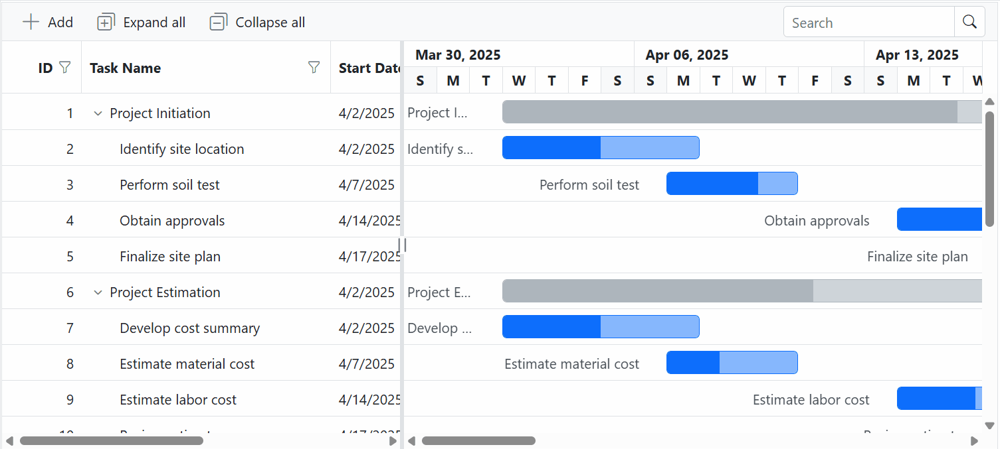
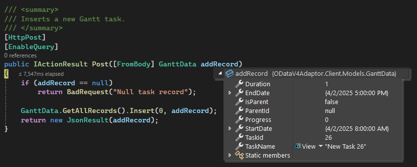
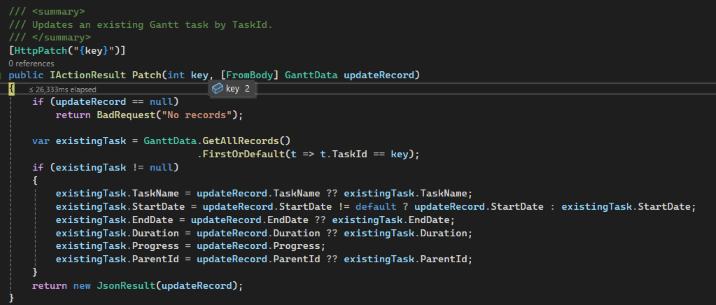
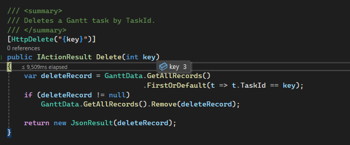

# OData Remote Data Binding in Blazor Gantt Chart

The [Blazor Gantt Chart](https://www.syncfusion.com/blazor-components/blazor-gantt-chart) uses the [ODataV4Adaptor](https://blazor.syncfusion.com/documentation/data/adaptors#odatav4-adaptor) to connect with remote OData V4 services, allowing it to load hierarchical task data, display project schedules on the timeline, and send changes back to the server as tasks are added, edited, or removed. This guide covers everything needed to set up the OData V4 service, bind project task data to the Gantt Chart, and perform CRUD (Create, Read, Update, and Delete) operations using the `ODataV4Adaptor`.

Unlike vendor specific adaptor patterns, the `ODataV4Adaptor` works with any backend that exposes an OData V4 endpoint, so the Gantt is never locked into a particular server technology or platform.

## Configuring an OData V4 Service

To configure a server with the Blazor Gantt Chart, follow these steps:

**1. Create a Blazor web app**

You can create a **Blazor Web App** named **ODataV4Adaptor** using Visual Studio 2022, either via [Microsoft Templates](https://learn.microsoft.com/en-us/aspnet/core/blazor/tooling?view=aspnetcore-8.0) or the [Blazor Extension](https://blazor.syncfusion.com/documentation/visual-studio-integration/template-studio). Make sure to configure the appropriate [interactive render mode](https://learn.microsoft.com/en-us/aspnet/core/blazor/components/render-modes?view=aspnetcore-8.0#render-modes) and [interactivity location](https://learn.microsoft.com/en-us/aspnet/core/blazor/tooling?view=aspnetcore-8.0&pivots=windows).

**2. Install NuGet packages**

Using the NuGet package manager in Visual Studio (Tools → NuGet Package Manager → Manage NuGet Packages for Solution), install the `Microsoft.AspNetCore.OData` NuGet package.

**3. Create a model class**

Create a new folder named **Models**. Then, add a model class named **GanttData.cs** to the **Models** folder under `ODataV4Adaptor.Client` to represent the task data. The model uses a `ParentId` field that the Gantt's `GanttTaskFields` mapping will turn into the tree hierarchy.

```csharp
using System.ComponentModel.DataAnnotations;

namespace ODataV4Adaptor.Client.Models
{
    public class GanttData
    {
        public static List<GanttData> ganttRecords = new List<GanttData>();

        public GanttData() { }

        public GanttData(int taskId, string taskName, DateTime startDate, DateTime? endDate,
            int? duration, int progress, int? parentId, bool isParent)
        {
            TaskId = taskId;
            TaskName = taskName;
            StartDate = startDate;
            EndDate = endDate;
            Duration = duration;
            Progress = progress;
            ParentId = parentId;
            IsParent = isParent;
        }

        public static List<GanttData> GetAllRecords()
        {
            if (ganttRecords.Count == 0)
            {
                ganttRecords = new List<GanttData>
                {
                    new GanttData(1,  "Project Initiation",     new DateTime(2025, 4, 2),  new DateTime(2025, 4, 21), null, 0,   null, true),
                    new GanttData(2,  "Identify site location",  new DateTime(2025, 4, 2),  new DateTime(2025, 4, 6),  4,    50,  1,    false),
                    new GanttData(3,  "Perform soil test",       new DateTime(2025, 4, 7),  new DateTime(2025, 4, 11), 4,    70,  1,    false),
                    new GanttData(4,  "Obtain approvals",        new DateTime(2025, 4, 12), new DateTime(2025, 4, 16), 4,    80,  1,    false),
                    new GanttData(5,  "Finalize site plan",      new DateTime(2025, 4, 17), new DateTime(2025, 4, 21), 4,    65,  1,    false),
                    new GanttData(6,  "Project Estimation",      new DateTime(2025, 4, 2),  new DateTime(2025, 4, 21), null, 0,   null, true)
                };
            }
            return ganttRecords;
        }

        [Key]
        public int TaskId { get; set; }
        public string? TaskName { get; set; }
        public DateTime StartDate { get; set; }
        public DateTime? EndDate { get; set; }
        public int? Duration { get; set; }
        public int Progress { get; set; }
        public int? ParentId { get; set; }
        public bool IsParent { get; set; }
    }
}
```

**4. Build the Entity Data Model**

To construct the Entity Data Model for your OData service, use the `ODataConventionModelBuilder` to define the model's structure in the `Program.cs` file of the `ODataV4Adaptor` project. Create an instance of the `ODataConventionModelBuilder`, then register the entity set **Gantt** using the `EntitySet<T>` method, where `GanttData` represents the CLR type containing the task details.

```csharp
// Create an ODataConventionModelBuilder to build the OData model.
var modelBuilder = new ODataConventionModelBuilder();

// Register the "Gantt" entity set with the OData model builder.
modelBuilder.EntitySet<GanttData>("Gantt");
```

**5. Register the OData services**

After building the Entity Data Model, register the OData services in the `Program.cs` file of your application. Follow these steps:

```csharp
// Add controllers with OData support to the service collection.
builder.Services.AddControllers().AddOData(
    options => options
    .Count()
    .AddRouteComponents("odata", modelBuilder.GetEdmModel())
);
```

**6. Create an API controller**

Create an API controller (for example, **GanttController.cs**) under the **Controllers** folder within the `ODataV4Adaptor` project. This controller handles the HTTP requests for CRUD operations, including `GET`, `POST`, `PATCH`, and `DELETE`, used by the Gantt Chart.

```csharp
using Microsoft.AspNetCore.Mvc;
using Microsoft.AspNetCore.OData.Query;
using ODataV4Adaptor.Client.Models;

namespace ODataV4Adaptor.Controllers
{
    [ApiController]
    [Route("[controller]")]
    public class GanttController : ControllerBase
    {
        /// <summary>
        /// Retrieves all Gantt task records.
        /// Supports OData query options: $filter, $orderby, $top, $skip, $count.
        /// </summary>
        [HttpGet]
        [EnableQuery]
        public IActionResult Get()
        {
            var data = GanttData.GetAllRecords().AsQueryable();
            return Ok(data);
        }

        /// <summary>
        /// Inserts a new Gantt task.
        /// </summary>
        [HttpPost]
        [EnableQuery]
        public IActionResult Post([FromBody] GanttData addRecord)
        {
            if (addRecord == null)
                return BadRequest("Null task record");

            GanttData.GetAllRecords().Insert(0, addRecord);
            return new JsonResult(addRecord);
        }

        /// <summary>
        /// Updates an existing Gantt task by TaskId.
        /// </summary>
        [HttpPatch("{key}")]
        public IActionResult Patch(int key, [FromBody] GanttData updateRecord)
        {
            if (updateRecord == null)
                return BadRequest("No records");

            var existingTask = GanttData.GetAllRecords()
                                        .FirstOrDefault(t => t.TaskId == key);
            if (existingTask != null)
            {
                existingTask.TaskName = updateRecord.TaskName ?? existingTask.TaskName;
                existingTask.StartDate = updateRecord.StartDate != default ? updateRecord.StartDate : existingTask.StartDate;
                existingTask.EndDate = updateRecord.EndDate ?? existingTask.EndDate;
                existingTask.Duration = updateRecord.Duration ?? existingTask.Duration;
                existingTask.Progress = updateRecord.Progress;
                existingTask.ParentId = updateRecord.ParentId ?? existingTask.ParentId;
            }
            return new JsonResult(updateRecord);
        }

        /// <summary>
        /// Deletes a Gantt task by TaskId.
        /// </summary>
        [HttpDelete("{key}")]
        public IActionResult Delete(int key)
        {
            var deleteRecord = GanttData.GetAllRecords()
                                        .FirstOrDefault(t => t.TaskId == key);
            if (deleteRecord != null)
                GanttData.GetAllRecords().Remove(deleteRecord);

            return new JsonResult(deleteRecord);
        }
    }
}
```

**7. Register controllers in `Program.cs`**

Add the following lines in the `Program.cs` file under the `ODataV4Adaptor` project to register controllers:

```csharp
// Register controllers in the service container.
builder.Services.AddControllers();

// Map controller routes.
app.MapControllers();
```

**8. Run the application:**

Run the application in Visual Studio. It will be hosted at the URL **https://localhost:xxxx**.

After running the application, you can verify that the server-side API controller successfully returns the task data at the URL **https://localhost:xxxx/odata/gantt** (where **xxxx** represents the port number).

## Connecting Blazor Gantt Chart to an OData V4 Service

To integrate the Blazor Gantt Chart into your project, follow the steps below.

**1. Install Blazor Gantt and Themes NuGet packages**

Open the NuGet Package Manager in Visual Studio (*Tools → NuGet Package Manager → Manage NuGet Packages for Solution*) for the `ODataV4Adaptor.Client` project, and install [Syncfusion.Blazor.Gantt](https://www.nuget.org/packages/Syncfusion.Blazor.Gantt/) and [Syncfusion.Blazor.Themes](https://www.nuget.org/packages/Syncfusion.Blazor.Themes/).

Alternatively, use the following Package Manager commands:

```powershell
Install-Package Syncfusion.Blazor.Gantt -Version {{ site.releaseversion }}
Install-Package Syncfusion.Blazor.Themes -Version {{ site.releaseversion }}
```

> Blazor components are available on [nuget.org](https://www.nuget.org/packages?q=syncfusion.blazor). Refer to the [NuGet packages](https://blazor.syncfusion.com/documentation/nuget-packages) topic for a complete list of available packages.

**2. Register Blazor service**

- Open the **~/_Imports.razor** file and import the required namespaces.

```cs
@using Syncfusion.Blazor
@using Syncfusion.Blazor.Gantt
```

- Register the Blazor service in the **~/Program.cs** file of `ODataV4Adaptor.Client` project.

```csharp
using Syncfusion.Blazor;

builder.Services.AddSyncfusionBlazor();
```

**3. Add stylesheet and script resources**

Include the theme stylesheet and script references in the **~/Components/App.razor** file.

```html
<head>
    ....
    <link href="_content/Syncfusion.Blazor.Themes/bootstrap5.css" rel="stylesheet" />
</head>
....
<body>
    ....
    <script src="_content/Syncfusion.Blazor.Gantt/scripts/sf-gantt.min.js" type="text/javascript"></script>
</body>
```

> * Refer to the [Blazor Themes](https://blazor.syncfusion.com/documentation/appearance/themes) topic for various methods to include themes (e.g., Static Web Assets, CDN, or CRG).
> * Set the render mode to **InteractiveServer** or **InteractiveAuto** in your Blazor Web App configuration.

**4. Add the Blazor Gantt Chart and configure it with the server**

To connect the Blazor Gantt Chart to an OData V4 service, use the [Url](https://help.syncfusion.com/cr/blazor/Syncfusion.Blazor.DataManager.html#Syncfusion_Blazor_DataManager_Url) property of [SfDataManager](https://help.syncfusion.com/cr/blazor/Syncfusion.Blazor.DataManager.html) and set the [Adaptor](https://help.syncfusion.com/cr/blazor/Syncfusion.Blazor.DataManager.html#Syncfusion_Blazor_DataManager_Adaptor) property to `Adaptors.ODataV4Adaptor`. The `SfDataManager` offers multiple adaptor options to connect with remote services based on an API; the `ODataV4Adaptor` works with any OData V4 API that returns data in the expected `value` and `@odata.context` format.

Map the flat response to the Gantt's hierarchical view through [GanttTaskFields](https://help.syncfusion.com/cr/blazor/Syncfusion.Blazor.Gantt.GanttTaskFields.html), using `Id`, `ParentID`, `StartDate`, `EndDate`, and `Progress` to wire the data to the chart, grid, and taskbar.




@using Syncfusion.Blazor
@using Syncfusion.Blazor.Gantt
@using Syncfusion.Blazor.Data
@using ODataV4Adaptor.Client.Models

<SfGantt TValue="GanttData"
         Height="450px"
         Width="1000px"
         AllowFiltering="true"
         AllowSorting="true"
         AllowResizing="true"
         Toolbar="@(new List<string>() { "Add", "Edit", "Delete", "Update", "Cancel", "Search", "ExpandAll", "CollapseAll" })"
         TreeColumnIndex="1">

    <SfDataManager Url="https://localhost:xxxx/odata/gantt"
                   Adaptor="Adaptors.ODataV4Adaptor">
    </SfDataManager>

    <GanttTaskFields Id="TaskId"
                     Name="TaskName"
                     StartDate="StartDate"
                     EndDate="EndDate"
                     Duration="Duration"
                     Progress="Progress"
                     ParentID="ParentId">
    </GanttTaskFields>

    <GanttEditSettings AllowAdding="true"
                       AllowEditing="true"
                       AllowDeleting="true"
                       AllowTaskbarEditing="true"
                       Mode="Syncfusion.Blazor.Gantt.EditMode.Auto">
    </GanttEditSettings>

    <GanttColumns>
        <GanttColumn Field="TaskId" HeaderText="ID" Width="80" TextAlign="Syncfusion.Blazor.Grids.TextAlign.Right"></GanttColumn>
        <GanttColumn Field="TaskName" HeaderText="Task Name" Width="250" ClipMode="Syncfusion.Blazor.Grids.ClipMode.EllipsisWithTooltip"></GanttColumn>
        <GanttColumn Field="StartDate" HeaderText="Start Date" Width="130"></GanttColumn>
        <GanttColumn Field="EndDate" HeaderText="End Date" Width="130"></GanttColumn>
        <GanttColumn Field="Duration" HeaderText="Duration" Width="100" TextAlign="Syncfusion.Blazor.Grids.TextAlign.Right"></GanttColumn>
        <GanttColumn Field="Progress" HeaderText="Progress" Width="100" TextAlign="Syncfusion.Blazor.Grids.TextAlign.Right"></GanttColumn>
    </GanttColumns>

    <GanttLabelSettings LeftLabel="TaskName" TValue="GanttData"></GanttLabelSettings>

    <GanttSplitterSettings Position="40%"></GanttSplitterSettings>

</SfGantt>




> Replace `https://localhost:xxxx/odata/gantt` with the actual URL of your API endpoint that provides the data in a consumable format (e.g., JSON).

**5. Run the application**

When you run the application, the Blazor Gantt Chart loads the task hierarchy directly from the OData V4 service, with the chart, grid, and taskbar all driven by the same data source.



## Handling searching operation

OData V4 does not support global search by default. To overcome this limitation, Syncfusion provides a search fallback mechanism that allows a global search experience through the `EnableODataSearchFallback` option. Enable it in the same way as for the Grid – first add the `Filter` option to the OData setup, then flip `EnableODataSearchFallback` on after the Gantt renders.




// Create a new instance of the web application builder.
var builder = WebApplication.CreateBuilder(args);

// Create an ODataConventionModelBuilder to build the OData model.
var modelBuilder = new ODataConventionModelBuilder();

// Register the "Gantt" entity set with the OData model builder.
modelBuilder.EntitySet<GanttData>("Gantt");

// Add services to the container.
// Add controllers with OData support to the service collection.
builder.Services.AddControllers().AddOData(
    options => options
    // Enables $count query option to retrieve total record count.
    .Count()
    // Enables $filter query option to allow searching based on field values.
    .Filter()
    .AddRouteComponents("odata", modelBuilder.GetEdmModel())
);




@using Syncfusion.Blazor
@using Syncfusion.Blazor.Gantt
@using Syncfusion.Blazor.Data
@using ODataV4Adaptor.Client.Models

<SfGantt TValue="GanttData"
         Toolbar="@(new List<string>() { "Search" })"
         Height="450px"
         Width="1000px">
    <SfDataManager @ref="DataManager" Url="https://localhost:xxxx/odata/gantt" Adaptor="Adaptors.ODataV4Adaptor"></SfDataManager>
    <GanttTaskFields Id="TaskId"
                     Name="TaskName"
                     StartDate="StartDate"
                     EndDate="EndDate"
                     Duration="Duration"
                     Progress="Progress"
                     ParentID="ParentId">
    </GanttTaskFields>
</SfGantt>

@code {
    public SfDataManager? DataManager { get; set; }
    protected override void OnAfterRender(bool firstRender)
    {
        base.OnAfterRender(firstRender);
        if (DataManager?.DataAdaptor is ODataV4Adaptor odataAdaptor)
        {
            RemoteOptions options = odataAdaptor.Options;
            options.EnableODataSearchFallback = true;
            odataAdaptor.Options = options;
        }
    }
}




## Handling filtering operation

To enable filtering operations in your web application using OData, add the `Filter` method within the OData setup. Once enabled, clients can use the **$filter** query option in their requests to retrieve specific data entries – including hierarchical filters where only the matching branch of the Gantt tree needs to be returned.




// Create a new instance of the web application builder.
var builder = WebApplication.CreateBuilder(args);

// Create an ODataConventionModelBuilder to build the OData model.
var modelBuilder = new ODataConventionModelBuilder();

// Register the "Gantt" entity set with the OData model builder.
modelBuilder.EntitySet<GanttData>("Gantt");

// Add services to the container.

// Add controllers with OData support to the service collection.
builder.Services.AddControllers().AddOData(
    options => options
    // Enables $count query option to retrieve total record count.
    .Count()
    // Enables $filter query option to allow filtering based on field values.
    .Filter()
    .AddRouteComponents("odata", modelBuilder.GetEdmModel())
);




@using Syncfusion.Blazor
@using Syncfusion.Blazor.Gantt
@using Syncfusion.Blazor.Data
@using ODataV4Adaptor.Client.Models

<SfGantt TValue="GanttData"
         AllowFiltering="true"
         Height="450px"
         Width="1000px">
    <SfDataManager Url="https://localhost:xxxx/odata/gantt" Adaptor="Adaptors.ODataV4Adaptor"></SfDataManager>
    <GanttTaskFields Id="TaskId"
                     Name="TaskName"
                     StartDate="StartDate"
                     EndDate="EndDate"
                     Duration="Duration"
                     Progress="Progress"
                     ParentID="ParentId">
    </GanttTaskFields>
    <GanttColumns>
        <GanttColumn Field="TaskId" HeaderText="ID" Width="80"></GanttColumn>
        <GanttColumn Field="TaskName" HeaderText="Task Name" Width="250"></GanttColumn>
        <GanttColumn Field="StartDate" HeaderText="Start Date" Width="130"></GanttColumn>
        <GanttColumn Field="EndDate" HeaderText="End Date" Width="130"></GanttColumn>
        <GanttColumn Field="Duration" HeaderText="Duration" Width="100"></GanttColumn>
        <GanttColumn Field="Progress" HeaderText="Progress" Width="100"></GanttColumn>
    </GanttColumns>
</SfGantt>




## Handling sorting operation

To enable sorting operations in your web application using OData, add the `OrderBy` method within the OData setup. Once enabled, clients can use the **$orderby** query option to sort tasks on the grid side. The chart portion continues to honor the `StartDate`/`EndDate` ordering from the data; sorting applies to the grid columns and to the order in which siblings are rendered.




// Create a new instance of the web application builder.
var builder = WebApplication.CreateBuilder(args);

// Create an ODataConventionModelBuilder to build the OData model.
var modelBuilder = new ODataConventionModelBuilder();

// Register the "Gantt" entity set with the OData model builder.
modelBuilder.EntitySet<GanttData>("Gantt");

// Add services to the container.

// Add controllers with OData support to the service collection.
builder.Services.AddControllers().AddOData(
    options => options
    // Enables $count query option to retrieve total record count.
    .Count()
    // Enables $orderby query option to allow sorting based on field values.
    .OrderBy()
    .AddRouteComponents("odata", modelBuilder.GetEdmModel())
);




@using Syncfusion.Blazor
@using Syncfusion.Blazor.Gantt
@using Syncfusion.Blazor.Data
@using ODataV4Adaptor.Client.Models

<SfGantt TValue="GanttData"
         AllowSorting="true"
         Height="450px"
         Width="1000px">
    <SfDataManager Url="https://localhost:xxxx/odata/gantt" Adaptor="Adaptors.ODataV4Adaptor"></SfDataManager>
    <GanttTaskFields Id="TaskId"
                     Name="TaskName"
                     StartDate="StartDate"
                     EndDate="EndDate"
                     Duration="Duration"
                     Progress="Progress"
                     ParentID="ParentId">
    </GanttTaskFields>
    <GanttColumns>
        <GanttColumn Field="TaskId" HeaderText="ID" Width="80"></GanttColumn>
        <GanttColumn Field="TaskName" HeaderText="Task Name" Width="250"></GanttColumn>
        <GanttColumn Field="StartDate" HeaderText="Start Date" Width="130"></GanttColumn>
        <GanttColumn Field="EndDate" HeaderText="End Date" Width="130"></GanttColumn>
        <GanttColumn Field="Duration" HeaderText="Duration" Width="100"></GanttColumn>
        <GanttColumn Field="Progress" HeaderText="Progress" Width="100"></GanttColumn>
    </GanttColumns>
</SfGantt>




## Handling CRUD operations

To manage CRUD (Create, Read, Update, and Delete) operations using the `ODataV4Adaptor`, configure the Gantt for [editing](https://blazor.syncfusion.com/documentation/gantt-chart/editing-tasks). The controller handles `GET`, `POST`, `PATCH`, and `DELETE` for tasks. With taskbar editing enabled [AllowTaskbarEditing](https://help.syncfusion.com/cr/blazor/Syncfusion.Blazor.Gantt.GanttEditSettings.html#Syncfusion_Blazor_Gantt_GanttEditSettings_AllowTaskbarEditing) to `true`, drag/resize operations on the timeline also round-trip to the same `PATCH` endpoint.

In the example below, [Auto](https://help.syncfusion.com/cr/blazor/Syncfusion.Blazor.Gantt.GanttEditSettings.html#Syncfusion_Blazor_Gantt_GanttEditSettings_Mode) edit mode is enabled, and the [Toolbar](https://help.syncfusion.com/cr/blazor/Syncfusion.Blazor.Gantt.SfGantt-1.html#Syncfusion_Blazor_Gantt_SfGantt_1_Toolbar) property is configured to display toolbar items for editing.




@using Syncfusion.Blazor
@using Syncfusion.Blazor.Gantt
@using Syncfusion.Blazor.Data
@using ODataV4Adaptor.Client.Models

<SfGantt TValue="GanttData"
         Height="450px"
         Width="1000px"
         Toolbar="@(new List<string>() { "Add", "Edit", "Delete", "Update", "Cancel" })"
         TreeColumnIndex="1">

    <SfDataManager Url="https://localhost:xxxx/odata/gantt"
                   Adaptor="Adaptors.ODataV4Adaptor">
    </SfDataManager>

    <GanttTaskFields Id="TaskId"
                     Name="TaskName"
                     StartDate="StartDate"
                     EndDate="EndDate"
                     Duration="Duration"
                     Progress="Progress"
                     ParentID="ParentId">
    </GanttTaskFields>

    <GanttEditSettings AllowAdding="true"
                       AllowEditing="true"
                       AllowDeleting="true"
                       AllowTaskbarEditing="true"
                       Mode="Syncfusion.Blazor.Gantt.EditMode.Auto">
    </GanttEditSettings>

    <GanttColumns>
        <GanttColumn Field="TaskId" HeaderText="ID" Width="80" TextAlign="Syncfusion.Blazor.Grids.TextAlign.Right"></GanttColumn>
        <GanttColumn Field="TaskName" HeaderText="Task Name" Width="250"></GanttColumn>
        <GanttColumn Field="StartDate" HeaderText="Start Date" Width="130"></GanttColumn>
        <GanttColumn Field="EndDate" HeaderText="End Date" Width="130"></GanttColumn>
        <GanttColumn Field="Duration" HeaderText="Duration" Width="100" TextAlign="Syncfusion.Blazor.Grids.TextAlign.Right"></GanttColumn>
        <GanttColumn Field="Progress" HeaderText="Progress" Width="100" TextAlign="Syncfusion.Blazor.Grids.TextAlign.Right"></GanttColumn>
    </GanttColumns>

</SfGantt>




**Insert Record:**

To insert a new record into the Gantt, use the `HttpPost` method on the server. The sample implementation in the `GanttController` inserts the new task at the beginning of the in-memory list and returns it as JSON.






/// <summary>
/// Inserts a new Gantt task.
/// </summary>
/// <param name="addRecord">The task record to be inserted.</param>
/// <returns>Returns the inserted record if successful; otherwise, a bad request response.</returns>
[HttpPost]
[EnableQuery]
public IActionResult Post([FromBody] GanttData addRecord)
{
    // Validate the input and return a 400 Bad Request if the record is null.
    if (addRecord == null)
        return BadRequest("Null task record");

    // Insert the new task record at the beginning of the data collection.
    GanttData.GetAllRecords().Insert(0, addRecord);

    // Return the inserted record as a JSON result.
    return new JsonResult(addRecord);
}




**Update Record:**

Updating a record in the Gantt – including changes from inline edit, dialog edit, **and** taskbar drag/resize – is handled by the `HttpPatch` method in your controller. The sample performs a partial update, only replacing fields that are not null in the update record. The same `PATCH` endpoint is used for taskbar edits; the Gantt sends the modified `StartDate`, `EndDate`, and/or `Duration` and the controller applies them to the matching task.






/// <summary>
/// Updates an existing Gantt task by TaskId.
/// </summary>
/// <param name="key">The unique identifier of the task to be updated.</param>
/// <param name="updateRecord">The object containing the updated task values.</param>
/// <returns>Returns the updated task details.</returns>
[HttpPatch("{key}")]
public IActionResult Patch(int key, [FromBody] GanttData updateRecord)
{
    // Validate the input data. Return a 400 Bad Request if the update record is null.
    if (updateRecord == null)
        return BadRequest("No records");

    // Retrieve the existing task by its key.
    var existingTask = GanttData.GetAllRecords()
                                .FirstOrDefault(t => t.TaskId == key);

    // If the task is found, perform a partial update on non-null fields.
    if (existingTask != null)
    {
        existingTask.TaskName = updateRecord.TaskName ?? existingTask.TaskName;
        existingTask.StartDate = updateRecord.StartDate != default ? updateRecord.StartDate : existingTask.StartDate;
        existingTask.EndDate = updateRecord.EndDate ?? existingTask.EndDate;
        existingTask.Duration = updateRecord.Duration ?? existingTask.Duration;
        existingTask.Progress = updateRecord.Progress;
        existingTask.ParentId = updateRecord.ParentId ?? existingTask.ParentId;
    }

    // Return the updated task in JSON format.
    return new JsonResult(updateRecord);
}




**Delete Record:**

To delete a record from the Gantt, use the `HttpDelete` method in your controller. The sample looks up the task by its `TaskId`, removes it from the data source, and returns the deleted record as JSON.






/// <summary>
/// Deletes an existing Gantt task based on the provided key.
/// </summary>
/// <param name="key">The unique identifier of the task to be deleted.</param>
/// <returns>Returns the details of the deleted record.</returns>
[HttpDelete("{key}")]
public IActionResult Delete(int key)
{
    // Retrieve the task to be deleted by its unique identifier.
    var deleteRecord = GanttData.GetAllRecords()
                                .FirstOrDefault(t => t.TaskId == key);

    // If the task is found, remove it from the data source.
    if (deleteRecord != null)
        GanttData.GetAllRecords().Remove(deleteRecord);

    // Return the deleted task in JSON format.
    return new JsonResult(deleteRecord);
}




## Real-world use cases

The `ODataV4Adaptor` is a strong fit for Gantt scenarios where the task list is large, shared, or backed by an enterprise data service. Typical use cases include:

- **Enterprise project portfolios** – Centralized OData services that already expose project/task data to other tools (reporting, mobile, integrations) can be reused by the Gantt without a separate API layer.
- **Construction and engineering schedules** – Multi-level work breakdown structures (Phase → Stage → Activity → Task) where the same task records are read by Gantt, Grid, and reporting views.
- **Resource planning** – HR or production planning tools that need to surface dependency-heavy timelines from an existing OData feed and let users drag taskbars to reassign dates.
- **Cross-team editing** – When multiple users edit the same project plan concurrently, the server-driven `PATCH` round-trip keeps the database as the source of truth and the Gantt in sync after each save.
- **Hybrid data sources** – A single OData endpoint that joins tasks, resources, and calendars allows the Gantt to pull only the fields it needs via `$select` while still being able to drill into related entities.

## Benefits of using the ODataV4Adaptor with the Gantt Chart

- **Standardized wire format** – OData V4 responses (`value` + `@odata.context`) are predictable, so the Gantt can hydrate its tree, grid, and chart from a single payload.
- **Server-driven shaping** – `$filter`, `$orderby`, `$top`, `$skip`, and `$count` keep large project datasets performant by pushing slicing, sorting, and counting to the server.
- **Reduced client footprint** – Because filtering, sorting, and counting happen on the server, the Gantt only renders the rows it needs, which is critical for schedules with thousands of tasks.
- **Reusable backend** – The same OData endpoint that powers the Gantt can power the DataGrid, charts, mobile apps, and third-party integrations, eliminating duplicate controller code.
- **Full editing lifecycle** – Built-in `GET`, `POST`, `PATCH`, and `DELETE` conventions cover every Gantt editing surface (inline, dialog, toolbar Add/Delete, and taskbar drag/resize).
- **Type-safe contracts** – The `ODataConventionModelBuilder` generates an EDM from the model class, giving you a typed contract that documents which fields and operations are exposed.
