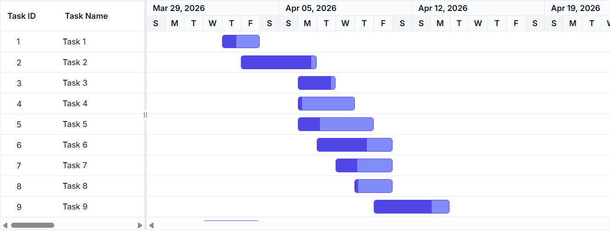
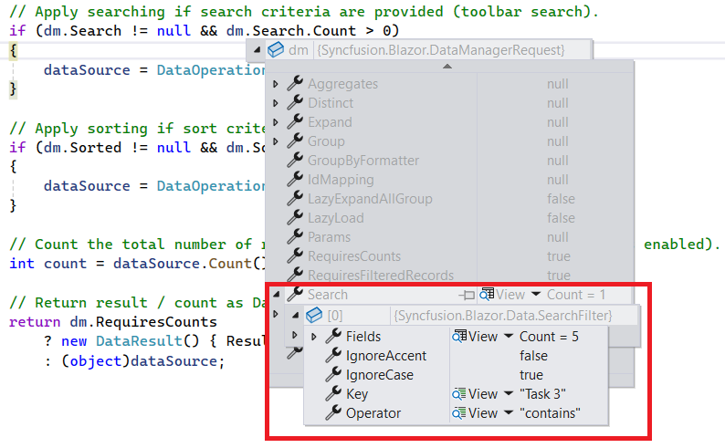
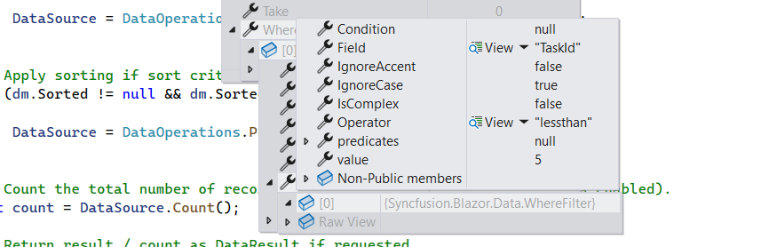
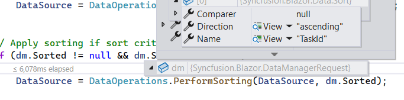
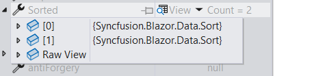
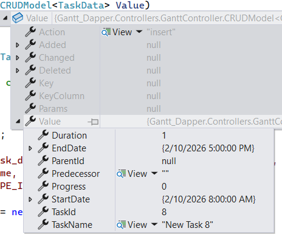
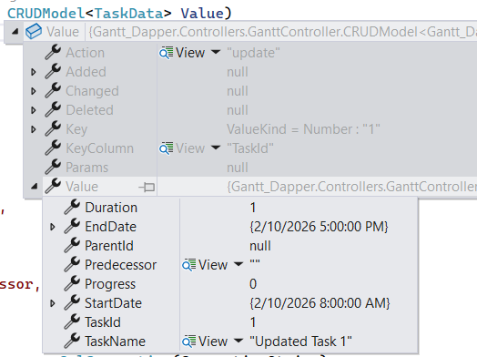
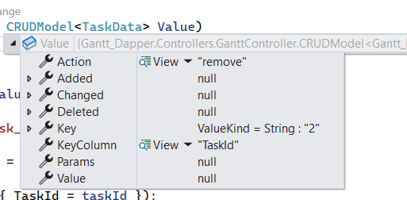

# UrlAdaptor in Syncfusion Blazor Gantt Chart

The [UrlAdaptor](https://blazor.syncfusion.com/documentation/data/adaptors#url-adaptor) serves as the base adaptor that enables communication between remote data services and a UI component. It supports seamless data binding and interaction with custom API services or any remote endpoint via URLs. The `UrlAdaptor` is particularly useful in scenarios where a custom API service with unique logic for handling data and CRUD operations is in place.

This section provides a step-by-step guide to retrieving data using the `UrlAdaptor` and binding it to the [Syncfusion<sup style="font-size:70%">&reg;</sup> Blazor Gantt Chart](https://www.syncfusion.com/blazor-components/blazor-gantt-chart), including server‑side data operations and CRUD actions.

## Creating an API service
 
To configure a server with the Blazor Gantt Chart, follow these steps:
 
**1. Create a Blazor web app**
 
You can create a **Blazor Web App** named **URLAdaptor** using Visual Studio, either via [Microsoft Templates](https://learn.microsoft.com/en-us/aspnet/core/blazor/tooling?view=aspnetcore-8.0) or the [Syncfusion<sup style="font-size:70%">&reg;</sup> Blazor Extension](https://blazor.syncfusion.com/documentation/visual-studio-integration/template-studio). Make sure to configure the appropriate [interactive render mode](https://learn.microsoft.com/en-us/aspnet/core/blazor/components/render-modes?view=aspnetcore-8.0#render-modes) and [interactivity location](https://learn.microsoft.com/en-us/aspnet/core/blazor/tooling?view=aspnetcore-8.0&pivots=windows).

**2. Create a model class**
 
Add a new folder named **Models**. Then, add a model class named **TaskData.cs** to represent the Gantt Chart task data.
 
```csharp
namespace URLAdaptor.Models
{
    public class TaskData
    {
        public int TaskID { get; set; }
        public string TaskName { get; set; }
        public DateTime? StartDate { get; set; }
        public DateTime? EndDate { get; set; }
        public int? ParentID { get; set; }
        public int Progress { get; set; }
        public string? Predecessor { get; set; }
        public string Duration { get; set; }

        public static List<TaskData> GetAllRecords()
        {
            List<TaskData> DataCollection = new List<TaskData>();

            int x = 0;
            int duration = 0;

            // Base start date (change if needed)
            DateTime startDate = new DateTime(2026, 04, 02);

            for (int i = 1; i <= 2; i++)
            {
                // Create parent task (no separate variable name like parent1/parent2)
                int parentID = ++x;

                DataCollection.Add(new TaskData()
                {
                    TaskID = parentID,
                    TaskName = "Task " + parentID,          // Parent
                    StartDate = startDate,
                    EndDate = startDate.AddDays(26),
                    Duration = "20",
                    Progress = 0,
                    ParentID = null,
                    Predecessor = null
                });

                // Reset child start for each parent
                DateTime childStart = startDate;

                for (int j = 1; j <= 4; j++)
                {
                    // Move start like your sample: first child same date, next children based on duration+2
                    childStart = childStart.AddDays(j == 1 ? 0 : duration + 2);
                    duration = 5;

                    int childId = ++x;

                    DataCollection.Add(new TaskData()
                    {
                        TaskID = childId,
                        TaskName = "Task " + childId,        // Child
                        StartDate = childStart,
                        EndDate = childStart.AddDays(duration),
                        Duration = duration.ToString(),
                        Progress = 0,
                        ParentID = parentID,
                        Predecessor = j > 1 ? (childId - 1) + "FS" : null
                    });
                }

                // Move next parent start date after current parent ends (+2 days gap)
                startDate = startDate.AddDays(28);
                duration = 0;
            }
            return DataCollection;
        }
    }
}
```
 
**3. Create an API controller**
 
Create an API controller file named **GanttController.cs** under **Controllers** folder to establish data communication with the Blazor Gantt Chart.
 
```csharp
 
using Microsoft.AspNetCore.Mvc;
using Syncfusion.Blazor;
using Syncfusion.Blazor.Data;
using URLAdaptor.Models;
 
namespace URLAdaptor.Controllers
{
    [ApiController]
    public class GanttController : ControllerBase
    {
        /// <summary>
        /// Retrieves the list of tasks.
        /// </summary>
        /// <returns>Retrieve data from the data source.</returns>
        [HttpGet]
        [Route("api/[controller]/GetTaskData")]
        public List<TaskData> GetTaskData()
        {
            return TaskData.GetAllRecords().ToList();
        }

        /// <summary>
        /// Handles server-side data operations and returns the processed data.
        /// </summary>
        /// <param name="DataManagerRequest">
        /// The request object contains parameters for searching, filtering, sorting, skip, and take.
        /// </param>
        /// <returns>Returns the data and total count in result and count format.</returns>
        [HttpPost]
        [Route("api/[controller]")]
        public object Post([FromBody] DataManagerRequest DataManagerRequest)
        {
            // Retrieve data source and convert to queryable.
            IQueryable<TaskData> DataSource = GetTaskData().AsQueryable();        

            // Get total records count.
            int totalRecordsCount = DataSource.Count();

            // Return data and count.
            return new { result = DataSource, count = totalRecordsCount };
        }
    }
}
 
```
 
> The **GetTaskData** method returns sample Task data. Replace it with your custom logic to fetch data from a database or other sources.

**4. Register controllers in `Program.cs`**
 
Add the following lines in the `Program.cs` file to register controllers:
 
```csharp
// Register controllers in the service container.
builder.Services.AddControllers();
 
// Map controller routes.
app.MapControllers();
```
 
**5. Run the application**
 
Run the application in Visual Studio. The API will be accessible at a URL like `https://localhost:71xx/api/gantt` (where `71xx` represents the port number in the launchSettings.json). Please verify that the API returns the task data.

## Connecting Syncfusion<sup style="font-size:70%">&reg;</sup> Blazor Gantt Chart to an API service
 
To integrate the Blazor Gantt Chart into your project using Visual Studio 2026, follow the below steps:
 
**1. Install Syncfusion<sup style="font-size:70%">&reg;</sup> Blazor Gantt and Themes NuGet packages**
 
To add the Blazor Gantt Chart in the app, open the NuGet Package Manager in Visual Studio (*Tools → NuGet Package Manager → Manage NuGet Packages for Solution*), search and install [Syncfusion.Blazor.Gantt](https://www.nuget.org/packages/Syncfusion.Blazor.Gantt/) and [Syncfusion.Blazor.Themes](https://www.nuget.org/packages/Syncfusion.Blazor.Themes/).
 
If your Blazor Web App uses `WebAssembly` or `Auto` render modes, install the Syncfusion<sup style="font-size:70%">&reg;</sup> Blazor NuGet packages in the client project.
 
Alternatively, use the following Package Manager commands:
 
```powershell
Install-Package Syncfusion.Blazor.Gantt -Version {{ site.releaseversion }}
Install-Package Syncfusion.Blazor.Themes -Version {{ site.releaseversion }}
```
 
> Syncfusion<sup style="font-size:70%">&reg;</sup> Blazor components are available on [nuget.org](https://www.nuget.org/packages?q=syncfusion.blazor). Refer to the [NuGet packages](https://blazor.syncfusion.com/documentation/nuget-packages) topic for a complete list of available packages.
 
**2. Register Syncfusion<sup style="font-size:70%">&reg;</sup> Blazor service**
 
- Open the **~/_Imports.razor** file and import the required namespaces.
 
```cs
@using Syncfusion.Blazor
@using Syncfusion.Blazor.Gantt
@using Syncfusion.Blazor.Data
```
 
- Register the Syncfusion<sup style="font-size:70%">&reg;</sup> Blazor service in the **~/Program.cs** file.
 
```csharp
using Syncfusion.Blazor;
 
builder.Services.AddSyncfusionBlazor();
```
 
For apps using `WebAssembly` or `Auto (Server and WebAssembly)` render modes, register the service in both **~/Program.cs** files.
 
**3. Add stylesheet and script resources**
 
Include the theme stylesheet and script references in the **~/Components/App.razor** file.
 
```html
<head>
    ....
    <link href="_content/Syncfusion.Blazor.Themes/bootstrap5.css" rel="stylesheet" />
</head>
....
<body>
    ....
    <script src="_content/Syncfusion.Blazor.Core/scripts/syncfusion-blazor.min.js" type="text/javascript"></script>
</body>
```
 
> * Refer to the [Blazor Themes](https://blazor.syncfusion.com/documentation/appearance/themes) topic for various methods to include themes (e.g., Static Web Assets, CDN, or CRG).
> * Set the render mode to **InteractiveServer** or **InteractiveAuto** in your Blazor Web App configuration.
 
**4. Add Blazor Gantt Chart and configure with server**
 
To connect the Blazor Gantt chart to a hosted API, use the [Url](https://help.syncfusion.com/cr/blazor/Syncfusion.Blazor.DataManager.html#Syncfusion_Blazor_DataManager_Url) property of [SfDataManager](https://help.syncfusion.com/cr/blazor/Syncfusion.Blazor.DataManager.html). Update the **Index.razor** file as follows.

The `SfDataManager` offers multiple adaptor options to connect with remote database based on an API service. Below is an example of the [UrlAdaptor](https://blazor.syncfusion.com/documentation/data/adaptors#url-adaptor) configuration where an API service are set up to return the resulting data in the result and count format.
 



@using Syncfusion.Blazor.Gantt
@using Syncfusion.Blazor.Data
@using Syncfusion.Blazor
@using URLAdaptor.Models

<SfGantt TValue="TaskData" Height="450px">
    <SfDataManager Url="/api/gantt" Adaptor="Adaptors.UrlAdaptor"></SfDataManager>
    <GanttTaskFields Id="TaskID" Name="TaskName" StartDate="StartDate" EndDate="EndDate" Duration="Duration" Progress="Progress"
                     ParentID="ParentID" Dependency="Predecessor">
    </GanttTaskFields>    
    <GanttColumns>
        <GanttColumn Field="TaskID" HeaderText="Task ID" Width="90"></GanttColumn>
        <GanttColumn Field="TaskName" HeaderText="Task Name" Width="220"></GanttColumn>
        <GanttColumn Field="StartDate" HeaderText="Start Date" Width="140" Format="d"></GanttColumn>
        <GanttColumn Field="EndDate" HeaderText="End Date" Width="140" Format="d"></GanttColumn>
        <GanttColumn Field="Duration" HeaderText="Duration" Width="110"></GanttColumn>
        <GanttColumn Field="Predecessor" HeaderText="Predecessor" Width="140"></GanttColumn>
        <GanttColumn Field="Progress" HeaderText="Progress" Width="110"></GanttColumn>
    </GanttColumns>
</SfGantt>
 

 

 
using Microsoft.AspNetCore.Mvc;
using Syncfusion.Blazor.Data;
using Syncfusion.Blazor;
using URLAdaptor.Models;
 
namespace URLAdaptor.Controllers
{
    [ApiController]
    public class GanttController : ControllerBase
    {
        /// <summary>
        /// Retrieves the list of tasks.
        /// </summary>
        /// <returns>Retrieve data from the data source.</returns>
        [HttpGet]
        [Route("api/[controller]/GetTaskData")]
        public List<TaskData> GetTaskData()
        {
            return TaskData.GetAllRecords().ToList();
        }

        /// <summary>
        /// Handles server-side data operations and returns the processed data.
        /// </summary>
        /// <param name="DataManagerRequest">
        /// The request object contains parameters for searching, filtering, sorting, skip, and take.
        /// </param>
        /// <returns>Returns the data and total count in result and count format.</returns>
        [HttpPost]
        [Route("api/[controller]")]
        public object Post([FromBody] DataManagerRequest DataManagerRequest)
        {
            // Retrieve data source and convert to queryable.
            IQueryable<TaskData> DataSource = GetTaskData().AsQueryable();        

            // Get total records count.
            int totalRecordsCount = DataSource.Count();

            // Return data and count.
            return new { result = DataSource, count = totalRecordsCount };
        }
    }
}
 


 
> Replace `https://localhost:71xx/api/gantt`(Replace `71xx` with the port number shown in the **launchSettings.json**) with the actual URL of your API endpoint that provides the data in a consumable format (e.g., JSON).
 
**5. Run the application**
 
When you run the application, the Blazor Gantt Chart  will display data fetched from the API.
 

 
> * The Gantt Chart supports server-side operations such as **searching**, **sorting** and **filtering**. These can be handled using methods like [PerformSearching](https://help.syncfusion.com/cr/blazor/Syncfusion.Blazor.DataOperations.html#Syncfusion_Blazor_DataOperations_PerformSearching__1_System_Linq_IQueryable___0__System_Collections_Generic_List_Syncfusion_Blazor_Data_SearchFilter__), [PerformFiltering](https://help.syncfusion.com/cr/blazor/Syncfusion.Blazor.DataOperations.html#Syncfusion_Blazor_DataOperations_PerformFiltering__1_System_Linq_IQueryable___0__System_Collections_Generic_List_Syncfusion_Blazor_Data_WhereFilter__System_String_), [PerformSorting](https://help.syncfusion.com/cr/blazor/Syncfusion.Blazor.DataOperations.html#Syncfusion_Blazor_DataOperations_PerformSorting__1_System_Linq_IQueryable___0__System_Collections_Generic_List_Syncfusion_Blazor_Data_Sort__), [PerformTake](https://help.syncfusion.com/cr/blazor/Syncfusion.Blazor.DataOperations.html#Syncfusion_Blazor_DataOperations_PerformTake__1_System_Linq_IQueryable___0__System_Int32_), and [PerformSkip](https://help.syncfusion.com/cr/blazor/Syncfusion.Blazor.DataOperations.html#Syncfusion_Blazor_DataOperations_PerformSkip__1_System_Linq_IQueryable___0__System_Int32_) from the **Syncfusion.Blazor.Data** package. Let's explore how to manage these data operations using the `UrlAdaptor`.
> * In an API service project, add **Syncfusion.Blazor.Data** by opening the NuGet package manager in Visual Studio (Tools → NuGet Package Manager → Manage NuGet Packages for Solution), search and install it.

## Handling searching operation

To handle the searching operation, ensure that your API endpoint supports custom searching criteria. Implement the searching logic on the server side using the `PerformSearching` method from the [DataOperations](https://help.syncfusion.com/cr/blazor/Syncfusion.Blazor.DataOperations.html) class. This allows the custom data source to undergo searching based on the criteria specified in the incoming [DataManagerRequest](https://help.syncfusion.com/cr/blazor/Syncfusion.Blazor.DataManagerRequest.html) object.






/// <summary>
/// Handles server-side data operations such as searching and returns the processed data.
/// </summary>
/// <param name="DataManagerRequest">The request object contains searched details.</param>
/// <returns>Returns a response containing the processed data and the total record count.</returns>
[HttpPost]
[Route("api/[controller]")]
public object Post([FromBody] DataManagerRequest DataManagerRequest)
{
    // Retrieve data from the data source.
    IQueryable<TaskData> DataSource = GetTaskData().AsQueryable();

    // Handling searching operation.
    if (DataManagerRequest.Search != null && DataManagerRequest.Search.Count > 0)
    {
        DataSource = DataOperations.PerformSearching(DataSource, DataManagerRequest.Search);
        // Add custom logic here if needed and remove above method.
    }

    // Get the total records count.
    int totalRecordsCount = DataSource.Count();

    // Return data based on the request.
    return new { result = DataSource, count = totalRecordsCount };
}





@using Syncfusion.Blazor.Gantt
@using Syncfusion.Blazor.Data  
@using URLAdaptor.Models

<SfGantt TValue="TaskData" Height="450px" Toolbar="@(new List<string>() { "Search" })">
    <SfDataManager Url="/api/gantt" Adaptor="Adaptors.UrlAdaptor"></SfDataManager>
    <GanttTaskFields Id="TaskID" Name="TaskName" StartDate="StartDate" EndDate="EndDate" Duration="Duration" Progress="Progress"
                     ParentID="ParentID" Dependency="Predecessor">
    </GanttTaskFields>    
    <GanttColumns>
        <GanttColumn Field="TaskID" HeaderText="Task ID" Width="90"></GanttColumn>
        <GanttColumn Field="TaskName" HeaderText="Task Name" Width="220"></GanttColumn>
        <GanttColumn Field="StartDate" HeaderText="Start Date" Width="140" Format="d"></GanttColumn>
        <GanttColumn Field="EndDate" HeaderText="End Date" Width="140" Format="d"></GanttColumn>
        <GanttColumn Field="Duration" HeaderText="Duration" Width="110"></GanttColumn>
        <GanttColumn Field="Predecessor" HeaderText="Predecessor" Width="140"></GanttColumn>
        <GanttColumn Field="Progress" HeaderText="Progress" Width="110"></GanttColumn>
    </GanttColumns>
</SfGantt>




## Handling filtering operation

To handle the filtering operation, ensure that your API endpoint supports custom filtering criteria. Implement the filtering logic on the server side using the `PerformFiltering` method from the `DataOperations` class. This allows the custom data source to undergo filtering based on the criteria specified in the incoming `DataManagerRequest` object.

**Column filtering**





/// <summary>
/// Handles server-side data operations such as filtering and returns the processed data.
/// </summary>
/// <param name="DataManagerRequest">The request object contains filtered details.</param>
/// <returns>Returns a response containing the processed data and the total record count.</returns>
[HttpPost]
[Route("api/[controller]")]
public object Post([FromBody] DataManagerRequest DataManagerRequest)
{
    // Retrieve data from the data source.
    IQueryable<TaskData> DataSource = GetTaskData().AsQueryable();

    if (DataManagerRequest.Where != null && DataManagerRequest.Where.Count > 0)
    {
        // Filtering
        if (DataManagerRequest.Where[0].Field != null && DataManagerRequest.Where[0].Field == @nameof(TaskData.ParentID)){}
        else
        {
            DataSource = DataOperations.PerformFiltering(DataSource, DataManagerRequest.Where, DataManagerRequest.Where[0].Operator);
        }
    }

    // Get the total records count.
    int totalRecordsCount = DataSource.Count();

    // Return data based on the request.
    return new { result = DataSource, count = totalRecordsCount };
}





@using Syncfusion.Blazor.Gantt
@using Syncfusion.Blazor.Data
@using Syncfusion.Blazor
@using URLAdaptor.Models

<SfGantt TValue="TaskData" Height="450px" AllowFiltering="true">
    <SfDataManager Url="/api/gantt" Adaptor="Adaptors.UrlAdaptor"></SfDataManager>
    <GanttTaskFields Id="TaskID" Name="TaskName" StartDate="StartDate" EndDate="EndDate" Duration="Duration" Progress="Progress"
                     ParentID="ParentID" Dependency="Predecessor">
    </GanttTaskFields>   
    <GanttColumns>
        <GanttColumn Field="TaskID" HeaderText="Task ID" Width="90"></GanttColumn>
        <GanttColumn Field="TaskName" HeaderText="Task Name" Width="220"></GanttColumn>
        <GanttColumn Field="StartDate" HeaderText="Start Date" Width="140" Format="d"></GanttColumn>
        <GanttColumn Field="EndDate" HeaderText="End Date" Width="140" Format="d"></GanttColumn>
        <GanttColumn Field="Duration" HeaderText="Duration" Width="110"></GanttColumn>
        <GanttColumn Field="Predecessor" HeaderText="Predecessor" Width="140"></GanttColumn>
        <GanttColumn Field="Progress" HeaderText="Progress" Width="110"></GanttColumn>
    </GanttColumns>
</SfGantt>




## Handling sorting operation

To handle the sorting operation, ensure that your API endpoint supports custom sorting criteria. Implement the sorting logic on the server side using the `PerformSorting` method from the `DataOperations` class. This allows the custom data source to undergo sorting based on the criteria specified in the incoming `DataManagerRequest` object.

**Single column sorting**


**Multi column sorting**





/// <summary>
/// Handles server-side data operations such as sorting and returns the processed data.
/// </summary>
/// <param name="DataManagerRequest">The request object contains sorted details.</param>
/// <returns>Returns a response containing the processed data and the total record count.</returns>
[HttpPost]
[Route("api/[controller]")]
public object Post([FromBody] DataManagerRequest DataManagerRequest)
{
    // Retrieve data from the data source.
    IQueryable<TaskData> DataSource = GetTaskData().AsQueryable();

    // Handling sorting operation.
    if (DataManagerRequest.Sorted != null && DataManagerRequest.Sorted.Count > 0)
    {
        DataSource = DataOperations.PerformSorting(DataSource, DataManagerRequest.Sorted);
        // Add custom logic here if needed and remove above method.
    }

    // Get the total count of records.
    int totalRecordsCount = DataSource.Count();

    // Return data based on the request.
    return new { result = DataSource, count = totalRecordsCount };
}





@using Syncfusion.Blazor.Gantt
@using Syncfusion.Blazor.Data
@using Syncfusion.Blazor
@using URLAdaptor.Models

<SfGantt TValue="TaskData" Height="450px" AllowSorting="true">
    <SfDataManager Url="/api/gantt" Adaptor="Adaptors.UrlAdaptor"></SfDataManager>
    <GanttTaskFields Id="TaskID" Name="TaskName" StartDate="StartDate" EndDate="EndDate" Duration="Duration" Progress="Progress"
                     ParentID="ParentID" Dependency="Predecessor">
    </GanttTaskFields>    
    <GanttColumns>
        <GanttColumn Field="TaskID" HeaderText="Task ID" Width="90"></GanttColumn>
        <GanttColumn Field="TaskName" HeaderText="Task Name" Width="220"></GanttColumn>
        <GanttColumn Field="StartDate" HeaderText="Start Date" Width="140" Format="d"></GanttColumn>
        <GanttColumn Field="EndDate" HeaderText="End Date" Width="140" Format="d"></GanttColumn>
        <GanttColumn Field="Duration" HeaderText="Duration" Width="110"></GanttColumn>
        <GanttColumn Field="Predecessor" HeaderText="Predecessor" Width="140"></GanttColumn>
        <GanttColumn Field="Progress" HeaderText="Progress" Width="110"></GanttColumn>
    </GanttColumns>
</SfGantt>




## Handling CRUD operations

The Syncfusion<sup style="font-size:70%">&reg;</sup> Blazor Gantt Chart seamlessly integrates CRUD (Create, Read, Update, and Delete) operations with server-side controller actions through specific properties: [InsertUrl](https://help.syncfusion.com/cr/blazor/Syncfusion.Blazor.DataManager.html#Syncfusion_Blazor_DataManager_InsertUrl), [RemoveUrl](https://help.syncfusion.com/cr/blazor/Syncfusion.Blazor.DataManager.html#Syncfusion_Blazor_DataManager_RemoveUrl), [UpdateUrl](https://help.syncfusion.com/cr/blazor/Syncfusion.Blazor.DataManager.html#Syncfusion_Blazor_DataManager_UpdateUrl) and [BatchUrl](https://help.syncfusion.com/cr/blazor/Syncfusion.Blazor.DataManager.html#Syncfusion_Blazor_DataManager_BatchUrl). These properties enable the Gantt Chart to communicate with the data service for every action, facilitating server-side operations.

**CRUD operations mapping**

CRUD operations within the Gantt Chart can be mapped to server-side controller actions using specific properties:

1. **InsertUrl**: Specifies the URL for inserting new data.
2. **RemoveUrl**: Specifies the URL for removing existing data.
3. **UpdateUrl**: Specifies the URL for updating existing data.
4. **BatchUrl**: Specifies the URL for batch editing.

To enable editing in Blazor Gantt Chart, refer to the editing [documentation](https://blazor.syncfusion.com/documentation/gantt-chart/editing-tasks). In the example below, the [Toolbar](https://help.syncfusion.com/cr/blazor/Syncfusion.Blazor.Gantt.SfGantt-1.html#Syncfusion_Blazor_Gantt_SfGantt_1_Toolbar) property is configured to display toolbar items for editing purposes.




@using Syncfusion.Blazor.Gantt
@using Syncfusion.Blazor.Data
@using Syncfusion.Blazor
@using URLAdaptor.Models

<SfGantt TValue="TaskData" Height="450px" AllowFiltering="true" AllowSorting="true" Toolbar="@(new List<string>() { "Add", "Edit", "Delete", "Update", "Cancel", "Search" })">
    <SfDataManager Url="/api/gantt" InsertUrl="/api/gantt/Insert" UpdateUrl="/api/gantt/Update" RemoveUrl="/api/gantt/Remove" Adaptor="Adaptors.UrlAdaptor"></SfDataManager>
    <GanttTaskFields Id="TaskID" Name="TaskName" StartDate="StartDate" EndDate="EndDate" Duration="Duration" Progress="Progress"
                     ParentID="ParentID" Dependency="Predecessor">
    </GanttTaskFields>
    <GanttEditSettings AllowAdding="true" AllowEditing="true" AllowTaskbarEditing="true" AllowDeleting="true" />
    <GanttColumns>
        <GanttColumn Field="TaskID" HeaderText="Task ID" Width="90"></GanttColumn>
        <GanttColumn Field="TaskName" HeaderText="Task Name" Width="220"></GanttColumn>
        <GanttColumn Field="StartDate" HeaderText="Start Date" Width="140" Format="d"></GanttColumn>
        <GanttColumn Field="EndDate" HeaderText="End Date" Width="140" Format="d"></GanttColumn>
        <GanttColumn Field="Duration" HeaderText="Duration" Width="110"></GanttColumn>
        <GanttColumn Field="Predecessor" HeaderText="Predecessor" Width="140"></GanttColumn>
        <GanttColumn Field="Progress" HeaderText="Progress" Width="110"></GanttColumn>
    </GanttColumns>
</SfGantt>




> Normal/Inline editing is the default edit [Mode](https://help.syncfusion.com/cr/blazor/Syncfusion.Blazor.Gantt.GanttEditSettings.html#Syncfusion_Blazor_Gantt_GanttEditSettings_Mode) for the Gantt. To enable CRUD operations, ensure that the [IsPrimaryKey](https://help.syncfusion.com/cr/blazor/Syncfusion.Blazor.Gantt.GanttColumn.html#Syncfusion_Blazor_Gantt_GanttColumn_IsPrimaryKey) property is set to **true** for a specific Gantt Chart column, ensuring that its value is unique.

The below class is used to structure data sent during CRUD operations.

```cs
public class CRUDModel<T> where T : class
{
    /// <summary>The action type (for example: "insert", "update", "remove", "batch").</summary>
    [JsonPropertyName("action")]
    public string? Action { get; set; }

    /// <summary>The name of the key column used by the client.</summary>
    [JsonPropertyName("keyColumn")]
    public string? KeyColumn { get; set; }

    /// <summary>The key value identifying a single record (for single operations).</summary>
    [JsonPropertyName("key")]
    public object? Key { get; set; }

    /// <summary>The single entity payload for insert/update operations.</summary>
    [JsonPropertyName("value")]
    public T? Value { get; set; }

    /// <summary>Collection of added records for batch operations.</summary>
    [JsonPropertyName("added")]
    public List<T>? Added { get; set; }

    /// <summary>Collection of changed records for batch operations.</summary>
    [JsonPropertyName("changed")]
    public List<T>? Changed { get; set; }

    /// <summary>Collection of deleted records for batch operations.</summary>
    [JsonPropertyName("deleted")]
    public List<T>? Deleted { get; set; }

    /// <summary>Additional parameters sent by the client.</summary>
    [JsonPropertyName("params")]
    public IDictionary<string, object>? Params { get; set; }
}
```

**Insert operation:**

To insert a new record, use the `InsertUrl` property to specify the controller action mapping URL for the insert operation. The details of the newly added record are passed to the **newRecord** parameter.






/// <summary>
/// Inserts a new data item into the data collection.
/// </summary>
/// <param name="value">It contains the new record detail which is need to be inserted.</param>
/// <returns>Returns void.</returns>
[HttpPost]
[Route("api/[controller]/Insert")]
public void Insert([FromBody] CRUDModel<TaskData> newRecord)
{
    if (newRecord.value != null)
    {
        // Add the new record to the data collection.
        TaskData.GetAllRecords().Insert(0, newRecord.value);
    }
}




**Update operation:**

For updating existing records, use the `UpdateUrl` property to specify the controller action mapping URL for the update operation. The details of the updated record are passed to the **updatedRecord** parameter.






/// <summary>
/// Update a existing data item from the data collection.
/// </summary>
/// <param name="updatedRecord">It contains the updated record detail which is need to be updated.</param>
/// <returns>Returns void.</returns>
[HttpPost]
[Route("api/[controller]/Update")]
public void Update([FromBody] CRUDModel<TaskData> updatedRecord)
{
    var updatedTask = updatedRecord.value;
    if (updatedTask != null)
    {
        var data = TaskData.GetAllRecords().FirstOrDefault(or => or.TaskID == updatedTask.TaskID);
        if (data != null)
        {
            // Update the existing record.
            data.TaskID = updatedTask.TaskID;
            data.TaskName = updatedTask.TaskName;
            data.StartDate = updatedTask.StartDate;
            data.EndDate = updatedTask.EndDate;
            // Update other properties similarly.
        }
    }
}




**Delete operation:**

To delete existing records, use the `RemoveUrl` property to specify the controller action mapping URL for the delete operation. The primary key value of the deleted record is passed to the **deletedRecord** parameter.






/// <summary>
/// Remove a specific data item from the data collection.
/// </summary>
/// <param name="deletedRecord">It contains the specific record detail which is need to be removed.</param>
/// <returns>Returns void.</returns>
[HttpPost]
[Route("api/[controller]/Remove")]
public void Remove([FromBody] CRUDModel<TaskData> deletedRecord)
{
    // Get the key value from the deletedRecord.
    int taskID = int.Parse(deletedRecord.key.ToString()); 
    var data = TaskData.GetAllRecords().FirstOrDefault(task => task.TaskID == taskID);
    if (data != null)
    {
        // Remove the record from the data collection.
        TaskData.GetAllRecords().Remove(data);
    }
}





