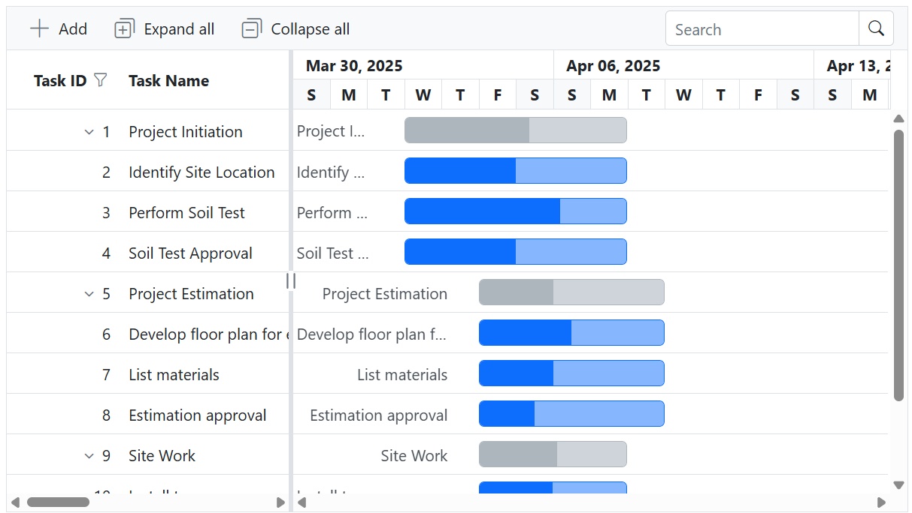

# WebApiAdaptor in Blazor Gantt Chart

The [WebApiAdaptor](https://blazor.syncfusion.com/documentation/data/adaptors#web-api-adaptor) extends the capabilities of the [ODataAdaptor](https://blazor.syncfusion.com/documentation/data/adaptors#odata-adaptor) and is intended for use with Web APIs that expose OData-compatible endpoints. It enables the [Blazor Gantt Chart](https://www.syncfusion.com/blazor-components/blazor-gantt-chart) to send OData-formatted requests for seamless data access and updates.

For proper functionality, the target Web API must support and interpret OData query options included in the request. To learn how to enable OData query support in ASP.NET Web APIs, refer to the official [documentation](https://learn.microsoft.com/en-us/aspnet/web-api/overview/odata-support-in-aspnet-web-api/supporting-odata-query-options).

The following examples demonstrate how to use the `WebApiAdaptor` to connect an OData-enabled Web API with the Blazor Gantt Chart and perform data binding and CRUD operations.
 
Operations such as filtering (`$filter`), sorting (`$orderby`), and record counting (`$count`) are transmitted to the server as query string parameters, reducing client workload and improving responsiveness for large project datasets.

> **Prerequisites:** Ensure that .NET 8 or later is installed and a valid Syncfusion license is available.

## Creating an API service

To configure a server with the Blazor Gantt Chart, follow these steps:

**1. Create a Blazor web app**

You can create a **Blazor Web App** named **WebApiAdaptor** using Visual Studio 2022, either via [Microsoft Templates](https://learn.microsoft.com/en-us/aspnet/core/blazor/tooling?view=aspnetcore-8.0) or the [Syncfusion® Blazor Extension](https://blazor.syncfusion.com/documentation/visual-studio-integration/template-studio). Make sure to configure the appropriate [interactive render mode](https://learn.microsoft.com/en-us/aspnet/core/blazor/components/render-modes?view=aspnetcore-8.0#render-modes) and [interactivity location](https://learn.microsoft.com/en-us/aspnet/core/blazor/tooling?view=aspnetcore-8.0&pivots=windows).

**2. Create a model class**

Add a new folder named **Models**. Then, add a model class named **GanttData.cs** to represent the Gantt Chart task data. The model uses a `ParentId` field that maps to the `GanttTaskFields.ParentID` property on the client to establish the parent-child relationship between tasks and build the task hierarchy.

```csharp
namespace WebApiAdaptor.Models
{
    public class GanttData
    {
        public static List<GanttData> ganttData = new List<GanttData>();

        public GanttData() { }

        public static List<GanttData> GetAllRecords()
        {
            if (ganttData.Count == 0)
            {
                ganttData = new List<GanttData>
                {
                    new GanttData { TaskId = 1, TaskName = "Project Initiation", StartDate = new DateTime(2025, 04, 02), EndDate = new DateTime(2025, 04, 21), ParentId = null, Progress = 40, Duration = 20, Priority = "High" },
                    new GanttData { TaskId = 2, TaskName = "Identify Site Location", StartDate = new DateTime(2025, 04, 02), Duration = 4, Progress = 50, ParentId = 1, Priority = "High" },
                    new GanttData { TaskId = 3, TaskName = "Perform Soil Test", StartDate = new DateTime(2025, 04, 02), Duration = 4, Progress = 70, ParentId = 1, Priority = "Medium" },
                    new GanttData { TaskId = 4, TaskName = "Soil Test Approval", StartDate = new DateTime(2025, 04, 02), Duration = 4, Progress = 50, ParentId = 1, Priority = "High" },
                    new GanttData { TaskId = 5, TaskName = "Project Estimation", StartDate = new DateTime(2025, 04, 02), EndDate = new DateTime(2025, 04, 21), ParentId = null, Progress = 30, Duration = 20, Priority = "Low" },
                    new GanttData { TaskId = 6, TaskName = "Develop floor plan for estimation", StartDate = new DateTime(2025, 04, 04), Duration = 3, Progress = 50, ParentId = 5, Priority = "Medium" },
                    new GanttData { TaskId = 7, TaskName = "List materials", StartDate = new DateTime(2025, 04, 04), Duration = 3, Progress = 40, ParentId = 5, Priority = "High" },
                    new GanttData { TaskId = 8, TaskName = "Estimation approval", StartDate = new DateTime(2025, 04, 04), Duration = 3, Progress = 30, ParentId = 5, Priority = "Medium" },
                    new GanttData { TaskId = 9, TaskName = "Site Work", StartDate = new DateTime(2025, 04, 04), EndDate = new DateTime(2025, 04, 21), ParentId = null, Progress = 60, Duration = 18, Priority = "High" },
                    new GanttData { TaskId = 10, TaskName = "Install temporary power", StartDate = new DateTime(2025, 04, 04), Duration = 2, Progress = 50, ParentId = 9, Priority = "Low" },
                    new GanttData { TaskId = 11, TaskName = "Clear the land", StartDate = new DateTime(2025, 04, 04), Duration = 2, Progress = 40, ParentId = 9, Priority = "Medium" },
                    new GanttData { TaskId = 12, TaskName = "Sign contract", StartDate = new DateTime(2025, 04, 04), Duration = 2, Progress = 70, ParentId = 9, Priority = "High" },
                };
            }
            return ganttData;
        }

        public int TaskId { get; set; }
        public string? TaskName { get; set; }
        public DateTime StartDate { get; set; }
        public DateTime? EndDate { get; set; }
        public int? ParentId { get; set; }
        public int Progress { get; set; }
        public int? Duration { get; set; }
        public string? Priority { get; set; }
    }
}

```

**3. Create an API controller**

Create an API controller file named **GanttController.cs** under the **Controllers** folder to handle data communication with the Blazor Gantt Chart. Implement the `Get` method to return data in JSON format, including the `Items` and `Count` properties as required by the `WebApiAdaptor`.

The sample response object should look like this:

```
{
    Items: [{..}, {..}, {..}, ...],
    Count: 12
}
```

```csharp
using Microsoft.AspNetCore.Mvc;
using WebApiAdaptor.Models;

namespace WebApiAdaptor.Controllers
{
    [ApiController]
    [Route("api/[controller]")]
    public class GanttController : ControllerBase
    {
        /// <summary>
        /// Retrieve data from the data source.
        /// </summary>
        /// <returns>Returns a JSON object with the list of tasks and the total count.</returns>
        [HttpGet]
        public object GetTaskData()
        {
            var data = GanttData.GetAllRecords();
            return new { Items = data, Count = data.Count };
        }

        /// <summary>
        /// Inserts a new task into the data source.
        /// </summary>
        /// <param name="newTask">The task to insert.</param>
        [HttpPost]
        public IActionResult AddTask([FromBody] GanttData newTask)
        {
            if (newTask == null) return BadRequest();
            var data = GanttData.GetAllRecords();
            newTask.TaskId = data.Any() ? data.Max(t => t.TaskId) + 1 : 1;
            data.Add(newTask);
            return Ok(newTask);
        }

        /// <summary>
        /// Updates an existing task in the data source.
        /// </summary>
        /// <param name="updatedTask">The task with updated values.</param>
        [HttpPut]
        public IActionResult UpdateTask([FromBody] GanttData updatedTask)
        {
            if (updatedTask == null) return BadRequest();
            var data = GanttData.GetAllRecords();
            var existingTask = data.FirstOrDefault(t => t.TaskId == updatedTask.TaskId);
            if (existingTask == null) return NotFound();

            existingTask.TaskName = updatedTask.TaskName;
            existingTask.StartDate = updatedTask.StartDate;
            existingTask.EndDate = updatedTask.EndDate;
            existingTask.Duration = updatedTask.Duration;
            existingTask.Progress = updatedTask.Progress;
            existingTask.Priority = updatedTask.Priority;
            existingTask.SubtaskOf = updatedTask.SubtaskOf;
            return Ok(existingTask);
        }

        /// <summary>
        /// Deletes a task from the data source.
        /// </summary>
        /// <param name="taskId">The id of the task to delete.</param>
        [HttpDelete]
        public IActionResult DeleteTask(int taskId)
        {
            var data = GanttData.GetAllRecords();
            var task = data.FirstOrDefault(t => t.TaskId == taskId);
            if (task == null) return NotFound();
            data.Remove(task);
            return Ok(task);
        }
    }
}
```

> When using the `WebApiAdaptor`, the data source is returned as a pair of `Items` and `Count`. If the `Offline` property of `SfDataManager` is enabled, the entire data source is returned from the server as a collection of objects. In that case `$inlinecount` is not included and only a single request is made to fetch all the data from the server.

**4. Register controllers in `Program.cs`**

Add the following lines in the `Program.cs` file to register controllers:

```csharp
// Register controllers in the service container.
builder.Services.AddControllers();

// Map controller routes.
app.MapControllers();
```

**5. Run the application**

Run the application in Visual Studio. The API will be accessible at a URL like **https://localhost:xxxx/api/Gantt** (where **xxxx** represents the port number from **launchSettings.json**). Verify that the API returns the task data before proceeding.



## Connecting Blazor Gantt Chart to an API service

To integrate the Blazor Gantt Chart into your project, follow these steps:

**1. Install Blazor Gantt and Themes NuGet packages**

To add the Blazor Gantt Chart in the app, open the NuGet Package Manager in Visual Studio (*Tools → NuGet Package Manager → Manage NuGet Packages for Solution*), search and install [Syncfusion.Blazor.Gantt](https://www.nuget.org/packages/Syncfusion.Blazor.Gantt/) and [Syncfusion.Blazor.Themes](https://www.nuget.org/packages/Syncfusion.Blazor.Themes/).

If your Blazor Web App uses `WebAssembly` or `Auto` render modes, install the Blazor NuGet packages in the client project.

Alternatively, use the following Package Manager commands:

```powershell
Install-Package Syncfusion.Blazor.Gantt -Version {{ site.releaseversion }}
Install-Package Syncfusion.Blazor.Themes -Version {{ site.releaseversion }}
```

> Blazor components are available on [nuget.org](https://www.nuget.org/packages?q=syncfusion.blazor). Refer to the [NuGet packages](https://blazor.syncfusion.com/documentation/nuget-packages) topic for a complete list of available packages.

**2. Register Blazor service**

- Open the **~/_Imports.razor** file and import the required namespaces.

```cs
@using Syncfusion.Blazor
@using Syncfusion.Blazor.Gantt
@using Syncfusion.Blazor.Data
```

- Register the Blazor service in the **~/Program.cs** file.

```csharp
using Syncfusion.Blazor;

builder.Services.AddSyncfusionBlazor();
```

For apps using `WebAssembly` or `Auto (Server and WebAssembly)` render modes, register the service in both **~/Program.cs** files.

**3. Add stylesheet and script resources**

Include the theme stylesheet and script references in the **~/Components/App.razor** file.

```html
<head>
    ....
    <link href="_content/Syncfusion.Blazor.Themes/bootstrap5.css" rel="stylesheet" />
</head>
....
<body>
    ....
    <script src="_content/Syncfusion.Blazor.Gantt/scripts/sf-gantt.min.js" type="text/javascript"></script>
</body>
```

> * Refer to the [Blazor Themes](https://blazor.syncfusion.com/documentation/appearance/themes) topic for various methods to include themes (e.g., Static Web Assets, CDN, or CRG).
> * Set the render mode to **InteractiveServer** or **InteractiveAuto** in your Blazor Web App configuration.

**4. Add Blazor Gantt Chart and configure with server**

To connect the Blazor Gantt Chart to a hosted API, use the [Url](https://help.syncfusion.com/cr/blazor/Syncfusion.Blazor.DataManager.html#Syncfusion_Blazor_DataManager_Url) property of [SfDataManager](https://help.syncfusion.com/cr/blazor/Syncfusion.Blazor.Data.SfDataManager.html). The `SfDataManager` offers multiple adaptor options to connect with remote services through an API; the `WebApiAdaptor` works with any Web API endpoint that returns data in the **Items** and **Count** format and understands OData-formatted query strings.

The following example shows a `WebApiAdaptor` configuration where the API is set up to return the resulting data in the **Items** and **Count** format. The `SubtaskOf` field on each task is mapped to `GanttTaskFields.ParentID` so the flat response is rendered as a parent/child hierarchy in the Gantt Chart.




@using Syncfusion.Blazor.Gantt
@using Syncfusion.Blazor.Data
@using Syncfusion.Blazor
@using WebApiAdaptor.Models

<SfGantt TValue="GanttData"
         Height="450px"
         Width="100%"
         AllowSorting="true"
         AllowFiltering="true"
         Toolbar="@(new List<string>() { "Add", "Edit", "Delete", "Update", "Cancel", "ExpandAll", "CollapseAll" })">

    <SfDataManager Url="https://localhost:xxxx/api/Gantt"
                   Adaptor="Adaptors.WebApiAdaptor">
    </SfDataManager>

    <GanttTaskFields Id="TaskId"
                     Name="TaskName"
                     StartDate="StartDate"
                     EndDate="EndDate"
                     Duration="Duration"
                     Progress="Progress"
                     ParentID="SubtaskOf">
    </GanttTaskFields>

    <GanttEditSettings AllowAdding="true"
                       AllowEditing="true"
                       AllowDeleting="true"
                       AllowTaskbarEditing="true"
                       Mode="Syncfusion.Blazor.Gantt.EditMode.Auto">
    </GanttEditSettings>

    <GanttColumns>
        <GanttColumn Field="TaskId" HeaderText="Task ID" Width="100" TextAlign="Syncfusion.Blazor.Grids.TextAlign.Right"></GanttColumn>
        <GanttColumn Field="TaskName" HeaderText="Task Name" Width="250"></GanttColumn>
        <GanttColumn Field="StartDate" HeaderText="Start Date" Width="150"></GanttColumn>
        <GanttColumn Field="EndDate" HeaderText="End Date" Width="150"></GanttColumn>
        <GanttColumn Field="Duration" HeaderText="Duration" Width="100"></GanttColumn>
        <GanttColumn Field="Progress" HeaderText="Progress" Width="100"></GanttColumn>
        <GanttColumn Field="Priority" HeaderText="Priority" Width="100"></GanttColumn>
    </GanttColumns>

    <GanttLabelSettings LeftLabel="TaskName" TValue="GanttData"></GanttLabelSettings>

</SfGantt>




> Replace `https://localhost:xxx/api/Gantt` with the actual URL of your API endpoint that provides the data in a consumable format (e.g., JSON).

**5. Run the application**

When you run the application, the Blazor Gantt Chart displays the task hierarchy fetched from the API, with the chart, grid, and taskbar all driven by the same data source.

## Performing data operations in a Web API service

When using the `WebApiAdaptor` with the `SfDataManager`, data operations such as **searching**, **sorting**, and **filtering** are executed on the server side. These operations are sent from the client to the server as query string parameters, which can be accessed in your API controller using `Request.Query`.

**Query parameters for data operations**

The following table lists the query parameters used by the Blazor Gantt Chart for various data operations:

| Key           | Description                                                                 |
|---------------|-----------------------------------------------------------------------------|
| `$filter`      | Specifies the query parameter for performing filtering and searching operations on the server side. |
| `$orderby`     | Specifies the query parameter for performing sorting operations on the server side.   |

> These parameters are automatically sent when the `WebApiAdaptor` is used. You can access and process them in your Web API Controller to perform the corresponding operations. You can also handle them using your own logic based on the query string format or use dynamic expression evaluation libraries for a more generic approach.

## Handling search operations

When a search operation is triggered, the `$filter` parameter is sent to the server. The `$filter` parameter specifies the query conditions that are applied to the data to perform the search.

The following example demonstrates how to extract the `$filter` parameter and apply search logic across multiple fields:




/// <summary>
/// Retrieves task data and handles search operations based on the provided filter query.
/// </summary>
/// <returns>Returns a JSON object containing the searched list of tasks and the total count.</returns>
[HttpGet]
[Route("api/[controller]")]
public object GetTaskData()
{
    // Retrieve all task records from the data source.
    var queryString = Request.Query;
    var data = GanttData.GetAllRecords().ToList();

    // Enable nullable reference types for handling filter queries.
    #nullable enable
    string? filterQuery = queryString["$filter"];
    #nullable disable

    // Check if a filter query is provided.
    if (!string.IsNullOrEmpty(filterQuery))
    {
        // Split the filter query into individual conditions using "and" as a delimiter.
        var filterConditions = filterQuery.Split(new[] { " and " }, StringSplitOptions.RemoveEmptyEntries);

        foreach (var condition in filterConditions)
        {
            // Check if the condition involves a substring search.
            if (condition.Contains("substringof"))
            {
                // Extract the search value from the substring condition.
                var conditionParts = condition.Split('(', ')', '\'');
                var searchValue = conditionParts[3]?.ToLower() ?? "";

                // Filter the data based on the search value across multiple fields.
                data = data.Where(task =>
                    task != null &&
                    (task.TaskId.ToString().Contains(searchValue) ||
                    (task.TaskName?.ToLower().Contains(searchValue, StringComparison.CurrentCultureIgnoreCase) ?? false) ||
                    (task.Priority?.ToLower().Contains(searchValue, StringComparison.CurrentCultureIgnoreCase) ?? false))
                ).ToList();
            }
            else
            {
                // Handle other filtering operations here.
            }
        }
    }

    // Calculate the total count of records.
    int totalRecordsCount = data.Count();

    // Return the filtered data and the total count as a JSON object.
    return new { Items = data, count = totalRecordsCount };
}





@using Syncfusion.Blazor.Gantt
@using Syncfusion.Blazor.Data
@using Syncfusion.Blazor

<SfGantt TValue="GanttData"
         Height="450px"
         Width="100%"
         AllowSorting="true"
         Toolbar="@(new List<string>() { "Add", "Edit", "Delete", "Update", "Cancel", "ExpandAll", "CollapseAll", "Search" })">

    <SfDataManager Url="https://localhost:xxxx/api/Gantt"
                   Adaptor="Adaptors.WebApiAdaptor">
    </SfDataManager>

    <GanttTaskFields Id="TaskId"
                     Name="TaskName"
                     StartDate="StartDate"
                     EndDate="EndDate"
                     Duration="Duration"
                     Progress="Progress"
                     ParentID="SubtaskOf">
    </GanttTaskFields>

    <GanttEditSettings AllowAdding="true"
                       AllowEditing="true"
                       AllowDeleting="true"
                       AllowTaskbarEditing="true"
                       Mode="Syncfusion.Blazor.Gantt.EditMode.Auto">
    </GanttEditSettings>

    <GanttColumns>
        <GanttColumn Field="TaskId" HeaderText="Task ID" Width="100" TextAlign="Syncfusion.Blazor.Grids.TextAlign.Right"></GanttColumn>
        <GanttColumn Field="TaskName" HeaderText="Task Name" Width="250"></GanttColumn>
        <GanttColumn Field="StartDate" HeaderText="Start Date" Width="150"></GanttColumn>
        <GanttColumn Field="EndDate" HeaderText="End Date" Width="150"></GanttColumn>
        <GanttColumn Field="Duration" HeaderText="Duration" Width="100"></GanttColumn>
        <GanttColumn Field="Progress" HeaderText="Progress" Width="100"></GanttColumn>
        <GanttColumn Field="Priority" HeaderText="Priority" Width="100"></GanttColumn>
    </GanttColumns>

    <GanttLabelSettings LeftLabel="TaskName" TValue="GanttData"></GanttLabelSettings>

</SfGantt>




> This example demonstrates a custom way of handling the `$filter` query sent by the Gantt Chart. You can also handle it using your own logic based on the query string format or use dynamic expression evaluation libraries for a more generic approach.

## Handling filtering operation

When filtering is applied, the `$filter` parameter is sent to the server. The `$filter` parameter specifies the conditions for filtering the data based on the provided criteria.

The following example demonstrates how to extract the `$filter` parameter and apply filtering logic based on custom conditions:





/// <summary>
/// Retrieves task data and processes filtering operations based on the provided query parameters.
/// </summary>
/// <returns>Returns a JSON object containing the filtered list of tasks and the total count.</returns>
[HttpGet]
[Route("api/[controller]")]
public object GetTaskData()
{
    // Retrieve all task records from the data source.
    var queryString = Request.Query;
    var data = GanttData.GetAllRecords().ToList();

    // Enable nullable reference types for handling filter queries.
    #nullable enable
    string? filterQuery = queryString["$filter"];
    #nullable disable

    // Check if a filter query is provided.
    if (!string.IsNullOrEmpty(filterQuery))
    {
        // Split the filter query into individual conditions using "and" as a delimiter.
        var filterConditions = filterQuery.Split(new[] { " and " }, StringSplitOptions.RemoveEmptyEntries);

        foreach (var condition in filterConditions)
        {
            // Check if the condition involves a substring search.
            if (condition.Contains("substringof"))
            {
                // Handle substring search operation here.
            }
            else
            {
                // Initialize variables to hold the filter field and value.
                string filterField = "";
                string filterValue = "";

                // Split the condition into parts to extract the field and value.
                var filterParts = condition.Split('(', ')', '\'');

                // Handle cases where the filter condition has fewer parts.
                if (filterParts.Length < 6)
                {
                    var filterValueParts = filterParts[1].Split();
                    filterField = filterValueParts[0];
                    filterValue = filterValueParts.Length > 2 ? filterValueParts[2].Trim('\'') : "";
                }
                else
                {
                    filterField = filterParts[3];
                    filterValue = filterParts[5];
                }

                // Apply filtering based on the extracted field and value.
                switch (filterField)
                {
                    case "TaskId":
                        data = data.Where(item => item != null && item.TaskId.ToString() == filterValue).ToList();
                        break;
                    case "TaskName":
                        data = data.Where(item => item != null && item.TaskName?.ToLower().StartsWith(filterValue.ToLower()) == true).ToList();
                        break;
                    case "Priority":
                        data = data.Where(item => item != null && item.Priority?.ToLower().StartsWith(filterValue.ToLower()) == true).ToList();
                        break;
                    case "Progress":
                        if (int.TryParse(filterValue, out int prog))
                            data = data.Where(item => item.Progress == prog).ToList();
                        break;
                    case "Duration":
                        if (int.TryParse(filterValue, out int dur))
                            data = data.Where(item => item.Duration == dur).ToList();
                        break;
                }
            }
        }
    }

    // Calculate the total count of records after filtering.
    int totalRecordsCount = data.Count();

    // Return the filtered data and the total count as a JSON object.
    return new { Items = data, count = totalRecordsCount };
}





@using Syncfusion.Blazor.Gantt
@using Syncfusion.Blazor.Data
@using Syncfusion.Blazor

<SfGantt TValue="GanttData"
         Height="450px"
         Width="100%"
         AllowFiltering="true"
         Toolbar="@(new List<string>() { "Add", "Edit", "Delete", "Update", "Cancel", "ExpandAll", "CollapseAll" })">

    <SfDataManager Url="https://localhost:xxxx/api/Gantt"
                   Adaptor="Adaptors.WebApiAdaptor">
    </SfDataManager>

    <GanttTaskFields Id="TaskId"
                     Name="TaskName"
                     StartDate="StartDate"
                     EndDate="EndDate"
                     Duration="Duration"
                     Progress="Progress"
                     ParentID="SubtaskOf">
    </GanttTaskFields>

    <GanttEditSettings AllowAdding="true"
                       AllowEditing="true"
                       AllowDeleting="true"
                       AllowTaskbarEditing="true"
                       Mode="Syncfusion.Blazor.Gantt.EditMode.Auto">
    </GanttEditSettings>

    <GanttColumns>
        <GanttColumn Field="TaskId" HeaderText="Task ID" Width="100" TextAlign="Syncfusion.Blazor.Grids.TextAlign.Right"></GanttColumn>
        <GanttColumn Field="TaskName" HeaderText="Task Name" Width="250"></GanttColumn>
        <GanttColumn Field="StartDate" HeaderText="Start Date" Width="150"></GanttColumn>
        <GanttColumn Field="EndDate" HeaderText="End Date" Width="150"></GanttColumn>
        <GanttColumn Field="Duration" HeaderText="Duration" Width="100"></GanttColumn>
        <GanttColumn Field="Progress" HeaderText="Progress" Width="100"></GanttColumn>
        <GanttColumn Field="Priority" HeaderText="Priority" Width="100"></GanttColumn>
    </GanttColumns>

    <GanttLabelSettings LeftLabel="TaskName" TValue="GanttData"></GanttLabelSettings>

</SfGantt>




> The `$filter` parameter can include various conditions, such as **substringof**, **eq** (equals), **gt** (greater than), and more. You can customize the filtering logic based on your specific data structure and requirements.

## Handling sorting operation

When sorting is triggered, the `$orderby` parameter is sent to the server. The `$orderby` parameter specifies the fields to sort by, along with the sort direction (ascending or descending).

The following example demonstrates how to extract the `$orderby` parameter and apply sorting logic:





/// <summary>
/// Retrieves task data and processes sorting operations based on the provided query parameters.
/// </summary>
/// <returns>Returns a JSON object containing the sorted list of tasks and the total count.</returns>
[HttpGet]
[Route("api/[controller]")]
public object GetTaskData()
{
    // Retrieve all task records from the data source.
    var queryString = Request.Query;
    var data = GanttData.GetAllRecords().ToList();

    // Enable nullable reference types for handling sorting queries.
    #nullable enable
    string? sort = queryString["$orderby"];
    #nullable disable

    // Check if a sorting query is provided.
    if (!string.IsNullOrEmpty(sort))
    {
        // Split the sorting query into individual conditions using commas as delimiters.
        var sortConditions = sort.Split(',');
        IOrderedEnumerable<GanttData>? orderedData = null;

        foreach (var sortCondition in sortConditions)
        {
            // Split each sorting condition into field and direction (asc/desc).
            var sortParts = sortCondition.Trim().Split(' ');
            var sortBy = sortParts[0];
            var descending = sortParts.Length > 1 && sortParts[1].ToLower() == "desc";

            // Define a key selector function to dynamically access the property to sort by.
            Func<GanttData, object?> keySelector = item =>
                item.GetType().GetProperty(sortBy)?.GetValue(item, null);

            // Apply sorting based on the field and direction.
            orderedData = orderedData == null
                ? (descending ? data.OrderByDescending(keySelector) : data.OrderBy(keySelector))
                : (descending ? orderedData.ThenByDescending(keySelector) : orderedData.ThenBy(keySelector));
        }

        // Update the data with the sorted result.
        if (orderedData != null)
        {
            data = orderedData.ToList();
        }
    }

    // Calculate the total count of records after sorting.
    int totalRecordsCount = data.Count();

    // Return the sorted data and the total count as a JSON object.
    return new { Items = data, count = totalRecordsCount };
}





@using Syncfusion.Blazor.Gantt
@using Syncfusion.Blazor.Data
@using Syncfusion.Blazor

<SfGantt TValue="GanttData"
         Height="450px"
         Width="100%"
         AllowSorting="true"
         Toolbar="@(new List<string>() { "Add", "Edit", "Delete", "Update", "Cancel", "ExpandAll", "CollapseAll" })">

    <SfDataManager Url="https://localhost:xxxx/api/Gantt"
                   Adaptor="Adaptors.WebApiAdaptor">
    </SfDataManager>

    <GanttTaskFields Id="TaskId"
                     Name="TaskName"
                     StartDate="StartDate"
                     EndDate="EndDate"
                     Duration="Duration"
                     Progress="Progress"
                     ParentID="SubtaskOf">
    </GanttTaskFields>

    <GanttEditSettings AllowAdding="true"
                       AllowEditing="true"
                       AllowDeleting="true"
                       AllowTaskbarEditing="true"
                       Mode="Syncfusion.Blazor.Gantt.EditMode.Auto">
    </GanttEditSettings>

    <GanttColumns>
        <GanttColumn Field="TaskId" HeaderText="Task ID" Width="100" TextAlign="Syncfusion.Blazor.Grids.TextAlign.Right"></GanttColumn>
        <GanttColumn Field="TaskName" HeaderText="Task Name" Width="250"></GanttColumn>
        <GanttColumn Field="StartDate" HeaderText="Start Date" Width="150"></GanttColumn>
        <GanttColumn Field="EndDate" HeaderText="End Date" Width="150"></GanttColumn>
        <GanttColumn Field="Duration" HeaderText="Duration" Width="100"></GanttColumn>
        <GanttColumn Field="Progress" HeaderText="Progress" Width="100"></GanttColumn>
        <GanttColumn Field="Priority" HeaderText="Priority" Width="100"></GanttColumn>
    </GanttColumns>

    <GanttLabelSettings LeftLabel="TaskName" TValue="GanttData"></GanttLabelSettings>

</SfGantt>




> You can parse the `$orderby` parameter to dynamically apply sorting on one or more fields in either ascending or descending order.

## Handling CRUD operations

The Blazor Gantt Chart uses `WebApiAdaptor` CRUD conventions that map directly to the HTTP verbs on your controller. When a user adds, edits (cell, row, dialog, or taskbar), or deletes a record, the `SfDataManager` automatically issues the corresponding `POST`, `PUT`, or `DELETE` request to the base URL. Each action sends the task payload as JSON to the same controller, so a single endpoint per HTTP verb is enough to handle the full edit lifecycle.

To enable editing in the Gantt Chart, configure [GanttEditSettings](https://help.syncfusion.com/cr/blazor/Syncfusion.Blazor.Gantt.GanttEditSettings.html) with `AllowAdding`, `AllowEditing`, `AllowTaskbarEditing`, and `AllowDeleting` set to **true**, and include the `Add`, `Edit`, `Delete`, `Update`, and `Cancel` toolbar items.

**CRUD mapping with `WebApiAdaptor`**

| Action | HTTP verb | Controller method | Body |
|--------|-----------|-------------------|------|
| Insert | `POST`    | `[HttpPost]`      | Newly added task (`GanttData`) |
| Update | `PUT`     | `[HttpPut]`       | Updated task (`GanttData`) |
| Delete | `DELETE`  | `[HttpDelete]`    | Query string `?taskId=<id>` |


**Insert operation**

To insert a new record into the Gantt Chart, the `WebApiAdaptor` issues an `HTTP POST` to the base URL. The new record is sent to the `AddTask` parameter of the controller. Below is a sample implementation that generates the next `TaskId` and appends the task to the in-memory collection:


```csharp
/// <summary>
/// Inserts a new data item into the data collection.
/// </summary>
/// <param name="newTask">Holds the details of the new task to be inserted.</param>
[HttpPost]
public IActionResult AddTask([FromBody] GanttData newTask)
{
    if (newTask == null) return BadRequest();
    var data = GanttData.GetAllRecords();
    newTask.TaskId = data.Any() ? data.Max(t => t.TaskId) + 1 : 1;
    data.Add(newTask);
    return Ok(newTask);
}
```

**Update operation**

Updating a record in the Gantt Chart — whether it is a cell edit, dialog edit, or a taskbar drag that changes the start date, end date, duration, progress, or parent — is performed through an `HTTP PUT` to the base URL. The updated record is sent to the `UpdateTask` parameter. Below is a sample implementation that finds the existing task by `TaskId` and applies the changes:


```csharp
/// <summary>
/// Updates an existing data item in the data collection.
/// </summary>
/// <param name="updatedTask">It contains the updated record detail that needs to be updated.</param>
[HttpPut]
public IActionResult UpdateTask([FromBody] GanttData updatedTask)
{
    if (updatedTask == null) return BadRequest();
    var data = GanttData.GetAllRecords();
    var existingTask = data.FirstOrDefault(t => t.TaskId == updatedTask.TaskId);
    if (existingTask == null) return NotFound();

    existingTask.TaskName = updatedTask.TaskName;
    existingTask.StartDate = updatedTask.StartDate;
    existingTask.EndDate = updatedTask.EndDate;
    existingTask.Duration = updatedTask.Duration;
    existingTask.Progress = updatedTask.Progress;
    existingTask.Priority = updatedTask.Priority;
    existingTask.SubtaskOf = updatedTask.SubtaskOf;
    return Ok(existingTask);
}
```

**Delete operation**

To delete a record from the Gantt Chart, the `WebApiAdaptor` issues an `HTTP DELETE` to the base URL with the task id passed as a query string parameter (`?taskId=<id>`). Below is a sample implementation that removes the task from the in-memory collection:


```csharp
/// <summary>
/// Deletes a specific task record from the data collection.
/// </summary>
/// <param name="taskId">The id of the task to delete.</param>
[HttpDelete]
public IActionResult DeleteTask(int taskId)
{
    var data = GanttData.GetAllRecords();
    var task = data.FirstOrDefault(t => t.TaskId == taskId);
    if (task == null) return NotFound();
    data.Remove(task);
    return Ok(task);
}
```

## Benefits of using the WebApiAdaptor with the Gantt Chart
- **Server-side data processing** – Operations filtering (`$filter`), sorting (`$orderby`), and record counting (`$count`) are transmitted to the server as query string parameters, reducing client workload and improving responsiveness for large project datasets.
- **Minimal server-side requirements** – The API endpoint only needs to parse OData query strings from `Request.Query` and return a `{ Items, Count }` response object. There is no dependency on a full OData stack, `Microsoft.AspNetCore.OData`, or an EDM model, making it suitable for scenarios where a complete OData service is not an option.
- **Built-in CRUD support** – All editing modes supported by the Gantt — adding tasks, editing via cell, row, dialog, or taskbar drag, and deleting — translate to standard `POST`, `PUT`, and `DELETE` HTTP requests on the Web API without any additional configuration.
- **Flat payload with hierarchical rendering** – The server returns a flat list of tasks, each carrying a `SubtaskOf` parent identifier. Mapping this field to `GanttTaskFields.ParentID` instructs the Gantt Chart to reconstruct the full parent/child hierarchy in both the grid and the taskbar view.

## Real-world use cases

- **Enterprise project management** – Serving multi-level project structures from relational databases such as SQL Server or PostgreSQL, where scheduling constraints and business rules are evaluated on the server before tasks are delivered to the client.
- **Construction and engineering schedules** – Managing Gantt views with large numbers of activities where only the visible page and relevant children are loaded at a time, with additional data fetched on demand from the server.
- **Manufacturing and production planning** – Handling work order hierarchies that require filtering by production line or shift, sorting by priority, and frequent updates through taskbar drag interactions.
- **Multi-tenant SaaS platforms** – Enforcing tenant-level data isolation at the server before sorting are applied, ensuring each request returns only the data belonging to the authenticated tenant.
- **Existing Web API integrations** – Connecting the Gantt Chart to already-maintained ASP.NET Core Web APIs without the need to migrate or rebuild the backend as a full OData service.

> ASP.NET Core (Blazor) Web API with batch handling is not yet supported by ASP.NET Core v3+. Therefore, it is currently not feasible to support **Batch** mode CRUD operations until ASP.NET Core provides support for batch handling. For more details, refer to [this GitHub issue](https://github.com/dotnet/aspnetcore/issues/14722).