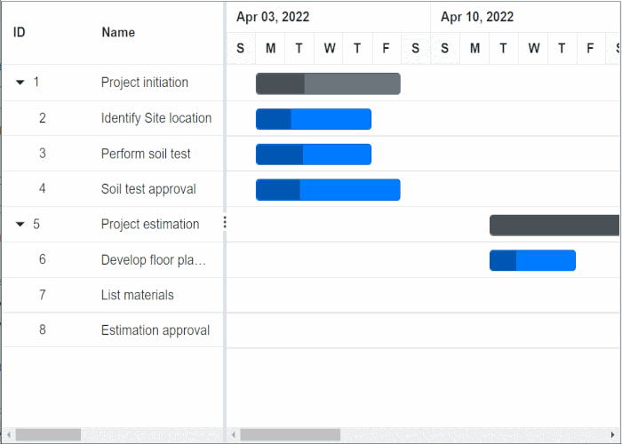

# Context Menu in Blazor Gantt Chart Component

The [Blazor Gantt Chart](https://www.syncfusion.com/blazor-components/blazor-gantt-chart) component allows you to perform quick actions by using the context menu. When right-clicking the context menu, the context menu options will be shown. To enable this feature, set the [EnableContextMenu](https://help.syncfusion.com/cr/blazor/Syncfusion.Blazor.Gantt.SfGantt-1.html#Syncfusion_Blazor_Gantt_SfGantt_1_EnableContextMenu) to “true”. The default context menu options are enabled using the [GanttEditSettings](https://help.syncfusion.com/cr/blazor/Syncfusion.Blazor.Gantt.GanttEditSettings.html) property. The context menu options can be customized using the [ContextMenuItems](https://help.syncfusion.com/cr/blazor/Syncfusion.Blazor.Gantt.SfGantt-1.html#Syncfusion_Blazor_Gantt_SfGantt_1_ContextMenuItems) property.

The default items are listed in the following table:

Items| Description
----|----
`AutoFit`| Auto-fits the current column.
`AutoFitAll` | Auto-fits all columns.
`SortAscending` | Sorts the current column in ascending order.
`SortDescending` | Sorts the current column in descending order.
`TaskInformation`| Edits the current task.
`Add` | Adds a new row to the Gantt.
`Indent` | Indent the selected record to one level.
`Outdent` | Outdent the selected record to one level.
`DeleteTask` | Deletes the current task.
`Save` | Saves the edited task.
`Cancel` | Cancels the edited task.
`DeleteDependency` | Deletes the current dependency task link.
`Convert` | Converts current task to a milestone or vice-versa.




@using Syncfusion.Blazor.Gantt
<SfGantt DataSource="@TaskCollection" Height="450px" EnableContextMenu="true" AllowSorting="true" AllowResizing="true" Width="900px" HighlightWeekends="true">
    <GanttTaskFields Id="TaskID" Name="TaskName" StartDate="StartDate" EndDate="EndDate" Duration="Duration" Progress="Progress"
        Dependency="Predecessor" ParentID="ParentID"></GanttTaskFields>
    <GanttEditSettings AllowAdding="true" AllowDeleting="true" AllowEditing="true"></GanttEditSettings>
</SfGantt>

@code {
    private List<TaskData> TaskCollection { get; set; }
    protected override void OnInitialized()
    {
        this.TaskCollection = GetTaskCollection();
    }
    public class TaskData
    {
        public int TaskID { get; set; }
        public string TaskName { get; set; }
        public DateTime StartDate { get; set; }
        public DateTime? EndDate { get; set; }
        public string Duration { get; set; }
        public double Progress { get; set; }
        public string Predecessor { get; set; }
        public int? ParentID { get; set; }
    }

    public static List<TaskData> GetTaskCollection()
    {
        List<TaskData> Tasks = new List<TaskData>() {
            new TaskData() { TaskID = 1, TaskName = "Project initiation", StartDate = new DateTime(2022, 04, 05), EndDate = new DateTime(2022, 04, 21) },
            new TaskData() { TaskID = 2, TaskName = "Identify Site location", StartDate = new DateTime(2022, 04, 05), Duration = "0", Progress = 30, ParentID = 1 },
            new TaskData() { TaskID = 3, TaskName = "Perform soil test", StartDate = new DateTime(2022, 04, 05), Duration = "4", Progress = 40, ParentID = 1 },
            new TaskData() { TaskID = 4, TaskName = "Soil test approval", StartDate = new DateTime(2022, 04, 05), Duration = "3", Progress = 30, Predecessor = "2", ParentID = 1 },
            new TaskData() { TaskID = 5, TaskName = "Project estimation", StartDate = new DateTime(2022, 04, 06), EndDate = new DateTime(2022, 04, 21) },
            new TaskData() { TaskID = 6, TaskName = "Develop floor plan for estimation", StartDate = new DateTime(2022, 04, 06), Duration = "3", Progress = 30, ParentID = 5 },
            new TaskData() { TaskID = 7, TaskName = "List materials", StartDate = new DateTime(2022, 04, 07), Duration = "3", Progress = 40, ParentID = 5 },
            new TaskData() { TaskID = 8, TaskName = "Estimation approval", StartDate = new DateTime(2022, 04, 07), Duration = "0", Progress = 30, Predecessor = "6", ParentID = 5 }
        };
        return Tasks;
    }
}






## Custom context menu items

The custom context menu items can be added by defining the [ContextMenuItems](https://help.syncfusion.com/cr/blazor/Syncfusion.Blazor.Gantt.SfGantt-1.html#Syncfusion_Blazor_Gantt_SfGantt_1_ContextMenuItems) as a collection of [ContextMenuItemModel](https://help.syncfusion.com/cr/blazor/Syncfusion.Blazor.Grids.ContextMenuItemModel.html). Actions for these customized items can be defined in the [ContextMenuItemClicked](https://help.syncfusion.com/cr/blazor/Syncfusion.Blazor.Gantt.GanttEvents-1.html#Syncfusion_Blazor_Gantt_GanttEvents_1_ContextMenuItemClicked) event.

The following sample code demonstrates defining a custom context menu item and its corresponding action in the [ContextMenuItemClicked](https://help.syncfusion.com/cr/blazor/Syncfusion.Blazor.Gantt.GanttEvents-1.html#Syncfusion_Blazor_Gantt_GanttEvents_1_ContextMenuItemClicked) event.




@using Syncfusion.Blazor.Gantt
@using Syncfusion.Blazor.Grids
<SfGantt @ref="Gantt" DataSource="@TaskCollection" Height="450px" Width="700px" ContextMenuItems="@contextMenuItems">
    <GanttTaskFields Id="TaskID" Name="TaskName" StartDate="StartDate" EndDate="EndDate" Duration="Duration" Progress="Progress" ParentID="ParentID">
    </GanttTaskFields>
    <GanttEvents ContextMenuItemClicked=ContextMenuItemClickedHandler TValue="TaskData"></GanttEvents>
</SfGantt>

@code {
    public List<TaskData> TaskCollection { get; set; }
    private SfGantt<TaskData> Gantt;
    private List<ContextMenuItemModel> contextMenuItems = new List<ContextMenuItemModel>()
    {
        new ContextMenuItemModel(){Text="Refresh", Target=".e-content",Id="refresh"}
    };
    protected override void OnInitialized()
    {
        this.TaskCollection = GetTaskCollection();
    }
    private async void ContextMenuItemClickedHandler(ContextMenuClickEventArgs<TaskData> args)
    {
        if(args.Item.Id == "Refresh")
        {
            await Gantt.RefreshAsync();
        }
    }

    public class TaskData
    {
        public int TaskID { get; set; }
        public string TaskName { get; set; }
        public DateTime StartDate { get; set; }
        public DateTime? EndDate { get; set; }
        public string Duration { get; set; }
        public int Progress { get; set; }
        public int? ParentID { get; set; }
    }

    public static List<TaskData> GetTaskCollection()
    {
        List<TaskData> Tasks = new List<TaskData>() {
        new TaskData() { TaskID = 1, TaskName = "Project initiation", StartDate = new DateTime(2022, 04, 02), EndDate = new DateTime(2022, 04, 12)},
        new TaskData() { TaskID = 2, TaskName = "Identify Site location", StartDate = new DateTime(2022, 04, 02), Duration = "4", Progress = 30, ParentID = 1 },
        new TaskData() { TaskID = 3, TaskName = "Perform soil test", StartDate = new DateTime(2022, 04, 02), Duration = "4", Progress = 40, ParentID = 1 },
        new TaskData() { TaskID = 4, TaskName = "Soil test approval", StartDate = new DateTime(2022, 04, 02), Duration = "5", Progress = 30, ParentID = 1 },
        new TaskData() { TaskID = 5, TaskName = "Project estimation", StartDate = new DateTime(2022, 04, 12), EndDate = new DateTime(2022, 04, 21) },
        new TaskData() { TaskID = 6, TaskName = "Develop floor plan for estimation", StartDate = new DateTime(2022, 04, 12), Duration = "3", Progress = 30, ParentID = 5 },
        new TaskData() { TaskID = 7, TaskName = "List materials", StartDate = new DateTime(2022, 05, 13), Duration = "3", Progress = 40, ParentID = 5 },
        new TaskData() { TaskID = 8, TaskName = "Estimation approval", StartDate = new DateTime(2022, 05, 16), Duration = "0", Progress = 30, ParentID = 5 }
    };
        return Tasks;
    }
}






## Built-in and custom context menu items

Gantt Chart has an option to use both built-in and custom context menu items at the same time.

The following sample code demonstrates defining built-in and custom context menu items and custom context menu item corresponding action in the [ContextMenuItemClicked](https://help.syncfusion.com/cr/blazor/Syncfusion.Blazor.Gantt.GanttEvents-1.html#Syncfusion_Blazor_Gantt_GanttEvents_1_ContextMenuItemClicked) event,




@using Syncfusion.Blazor.Gantt
@using Syncfusion.Blazor.Grids
<SfGantt @ref="Gantt" DataSource="@TaskCollection" Height="450px" Width="700px" 
    ContextMenuItems="@(new List<Object>() { "Add", new ContextMenuItemModel { Text = "Refresh", Target = ".e-content", Id =     "Refresh" } })">
    <GanttTaskFields Id="TaskID" Name="TaskName" StartDate="StartDate" EndDate="EndDate"
        Duration="Duration" Progress="Progress" ParentID="ParentID">
    </GanttTaskFields>
    <GanttEditSettings AllowAdding="true"></GanttEditSettings>
    <GanttEvents ContextMenuItemClicked=ContextMenuItemClickedHandler TValue="TaskData">
    </GanttEvents>
</SfGantt>
@code {
    public List<TaskData> TaskCollection { get; set; }
    private SfGantt<TaskData> Gantt;
    protected override void OnInitialized()
    {
        this.TaskCollection = GetTaskCollection();
    }
    private async void ContextMenuItemClickedHandler(ContextMenuClickEventArgs<TaskData> args)
    {
        if (args.Item.Id == "Refresh")
        {
          await Gantt.RefreshAsync();
        }
    }
    public class TaskData
    {
    public int TaskID { get; set; }
    public string TaskName { get; set; }
    public DateTime StartDate { get; set; }
    public DateTime? EndDate { get; set; }
    public string Duration { get; set; }
    public int Progress { get; set; }
    public int? ParentID { get; set; }
    }
    public static List<TaskData> GetTaskCollection()
    {
    List<TaskData> Tasks = new List<TaskData>() {
    new TaskData() { TaskID = 1, TaskName = "Project initiation", StartDate = new DateTime(2022, 04, 02), EndDate = new DateTime(2022, 04, 12)},
    new TaskData() { TaskID = 2, TaskName = "Identify Site location", StartDate = new DateTime(2022, 04, 02), Duration = "4", Progress = 30, ParentID = 1 },
    new TaskData() { TaskID = 3, TaskName = "Perform soil test", StartDate = new DateTime(2022, 04, 02), Duration = "4", Progress = 40, ParentID = 1 },
    new TaskData() { TaskID = 4, TaskName = "Soil test approval", StartDate = new DateTime(2022, 04, 02), Duration = "5", Progress = 30, ParentID = 1 },
    new TaskData() { TaskID = 5, TaskName = "Project estimation", StartDate = new DateTime(2022, 04, 12), EndDate = new DateTime(2022, 04, 21) },
    new TaskData() { TaskID = 6, TaskName = "Develop floor plan for estimation", StartDate = new DateTime(2022, 04, 12), Duration = "3", Progress = 30, ParentID = 5 },
    new TaskData() { TaskID = 7, TaskName = "List materials", StartDate = new DateTime(2022, 05, 13), Duration = "3", Progress = 40, ParentID = 5 },
    new TaskData() { TaskID = 8, TaskName = "Estimation approval", StartDate = new DateTime(2022, 05, 16), Duration = "0", Progress = 30, ParentID = 5 }
    };
    return Tasks;
    }
    }






## Sub context menu items

The sub-context menu items can be added by defining the collection of **MenuItems** for **Items** Property in [ContextMenuItems](https://help.syncfusion.com/cr/blazor/Syncfusion.Blazor.Gantt.SfGantt-1.html#Syncfusion_Blazor_Gantt_SfGantt_1_ContextMenuItems). Actions for these customized items can be defined in the [ContextMenuItemClicked](https://help.syncfusion.com/cr/blazor/Syncfusion.Blazor.Gantt.GanttEvents-1.html#Syncfusion_Blazor_Gantt_GanttEvents_1_ContextMenuItemClicked) event.

The following sample code demonstrates defining the sub-context menu item and its corresponding action in the [ContextMenuItemClicked](https://help.syncfusion.com/cr/blazor/Syncfusion.Blazor.Gantt.GanttEvents-1.html#Syncfusion_Blazor_Gantt_GanttEvents_1_ContextMenuItemClicked) event,




@using Syncfusion.Blazor.Gantt
@using Syncfusion.Blazor.Grids
@using Syncfusion.Blazor.Navigations

<SfGantt @ref="Gantt" DataSource="@TaskCollection" Height="450px" Width="700px" ContextMenuItems="@contextMenuItems">
    <GanttTaskFields Id="TaskID" Name="TaskName" StartDate="StartDate" EndDate="EndDate" Duration="Duration" Progress="Progress" ParentID="ParentID">
    </GanttTaskFields>
    <GanttEditSettings AllowEditing="true"></GanttEditSettings>
    <GanttEvents ContextMenuItemClicked=ContextMenuItemClickedHandler TValue="TaskData"></GanttEvents>
</SfGantt>

@code {
    public List<TaskData> TaskCollection { get; set; }
    private SfGantt<TaskData> Gantt;
    private List<ContextMenuItemModel> contextMenuItems = new List<ContextMenuItemModel>()
    {
        new ContextMenuItemModel{Text="GanttAction",Target=".e-content",Id="GanttAction",
            Items=new List<MenuItem>(){new MenuItem {Text="Refresh",Id= "Refresh"},new MenuItem {Text="Edit",Id= "Edit"} } }
    };

    protected override void OnInitialized()
    {
        this.TaskCollection = GetTaskCollection();
    }
    public async void ContextMenuItemClickedHandler(ContextMenuClickEventArgs<TaskData> args)
    {
        if (args.Item.Id == "Refresh")
        {
            await Gantt.RefreshAsync();
        }
        if (args.Item.Id == "Edit")
        {
            await Gantt.OpenEditDialogAsync();
        }
    }

    public class TaskData
    {
        public int TaskID { get; set; }
        public string TaskName { get; set; }
        public DateTime StartDate { get; set; }
        public DateTime? EndDate { get; set; }
        public string Duration { get; set; }
        public int Progress { get; set; }
        public int? ParentID { get; set; }
    }

    public static List<TaskData> GetTaskCollection()
    {
        List<TaskData> Tasks = new List<TaskData>() {
        new TaskData() { TaskID = 1, TaskName = "Project initiation", StartDate = new DateTime(2022, 04, 02), EndDate = new DateTime(2022, 04, 12)},
        new TaskData() { TaskID = 2, TaskName = "Identify Site location", StartDate = new DateTime(2022, 04, 02), Duration = "4", Progress = 30, ParentID = 1 },
        new TaskData() { TaskID = 3, TaskName = "Perform soil test", StartDate = new DateTime(2022, 04, 02), Duration = "4", Progress = 40, ParentID = 1 },
        new TaskData() { TaskID = 4, TaskName = "Soil test approval", StartDate = new DateTime(2022, 04, 02), Duration = "5", Progress = 30, ParentID = 1 },
        new TaskData() { TaskID = 5, TaskName = "Project estimation", StartDate = new DateTime(2022, 04, 12), EndDate = new DateTime(2022, 04, 21) },
        new TaskData() { TaskID = 6, TaskName = "Develop floor plan for estimation", StartDate = new DateTime(2022, 04, 12), Duration = "3", Progress = 30, ParentID = 5 },
        new TaskData() { TaskID = 7, TaskName = "List materials", StartDate = new DateTime(2022, 05, 13), Duration = "3", Progress = 40, ParentID = 5 },
        new TaskData() { TaskID = 8, TaskName = "Estimation approval", StartDate = new DateTime(2022, 05, 16), Duration = "0", Progress = 30, ParentID = 5 }
    };
        return Tasks;
    }
}






## Disable the context menu for specific columns

Context Menu can be prevented for specific columns using [ContextMenuOpen](https://blazor.syncfusion.com/documentation/gantt-chart/events#contextmenuopen) event of Gantt. This event will be triggered before opening the ContextMenu. You can prevent the context menu from opening by defining the **Cancel** arguments of ContextMenuOpen to **false**.

The following sample code demonstrates how to disable the context for specific column using event arguments of ContextMenuOpen event,




@using Syncfusion.Blazor.Gantt
@using Syncfusion.Blazor.Grids

<SfGantt @ref="Gantt" DataSource="@TaskCollection" Height="450px" Width="700px" ContextMenuItems="@contextMenuItems">
    <GanttTaskFields Id="TaskID" Name="TaskName" StartDate="StartDate" EndDate="EndDate" Duration="Duration" Progress="Progress" ParentID="ParentID">
    </GanttTaskFields>
    <GanttEvents ContextMenuOpen="OnContextMenuOpen" ContextMenuItemClicked=ContextMenuItemClickedHandler TValue="TaskData"></GanttEvents>
</SfGantt>

@code {
    public List<TaskData> TaskCollection { get; set; }
    private SfGantt<TaskData> Gantt;

    protected override void OnInitialized()
    {
        this.TaskCollection = GetTaskCollection();
    }
    private List<ContextMenuItemModel> contextMenuItems = new List<ContextMenuItemModel>()
    {
        new ContextMenuItemModel(){Text="Refresh", Target=".e-content",Id="refresh"}
    };
    public void OnContextMenuOpen(ContextMenuOpenEventArgs<TaskData> Args)
    {
        if (Args.Column != null && Args.Column.Field == "Duration")
        {
            Args.Cancel = true; // To prevent the context menu from opening
        }
    }
    private async void ContextMenuItemClickedHandler(ContextMenuClickEventArgs<TaskData> args)
    {
        if (args.Item.Id == "refresh")
        {
            await Gantt.RefreshAsync();
        }
    }

    public class TaskData
    {
        public int TaskID { get; set; }
        public string TaskName { get; set; }
        public DateTime StartDate { get; set; }
        public DateTime? EndDate { get; set; }
        public string Duration { get; set; }
        public int Progress { get; set; }
        public int? ParentID { get; set; }
    }

    public static List<TaskData> GetTaskCollection()
    {
        List<TaskData> Tasks = new List<TaskData>() {
        new TaskData() { TaskID = 1, TaskName = "Project initiation", StartDate = new DateTime(2022, 04, 02), EndDate = new DateTime(2022, 04, 12)},
        new TaskData() { TaskID = 2, TaskName = "Identify Site location", StartDate = new DateTime(2022, 04, 02), Duration = "4", Progress = 30, ParentID = 1 },
        new TaskData() { TaskID = 3, TaskName = "Perform soil test", StartDate = new DateTime(2022, 04, 02), Duration = "4", Progress = 40, ParentID = 1 },
        new TaskData() { TaskID = 4, TaskName = "Soil test approval", StartDate = new DateTime(2022, 04, 02), Duration = "5", Progress = 30, ParentID = 1 },
        new TaskData() { TaskID = 5, TaskName = "Project estimation", StartDate = new DateTime(2022, 04, 12), EndDate = new DateTime(2022, 04, 21) },
        new TaskData() { TaskID = 6, TaskName = "Develop floor plan for estimation", StartDate = new DateTime(2022, 04, 12), Duration = "3", Progress = 30, ParentID = 5 },
        new TaskData() { TaskID = 7, TaskName = "List materials", StartDate = new DateTime(2022, 05, 13), Duration = "3", Progress = 40, ParentID = 5 },
        new TaskData() { TaskID = 8, TaskName = "Estimation approval", StartDate = new DateTime(2022, 05, 16), Duration = "0", Progress = 30, ParentID = 5 }
    };
        return Tasks;
    }
}






## Disable context menu items dynamically 

You can enable or disable the context menu items using the **Disabled** property. Here, you can enable and disable the **Edit** context menu items in [ContextMenuOpen](https://help.syncfusion.com/cr/blazor/Syncfusion.Blazor.Gantt.GanttEvents-1.html#Syncfusion_Blazor_Gantt_GanttEvents_1_ContextMenuOpen) event of Gantt. This event will be triggered before opening the ContextMenu. You can disable the context menu item by defining the corresponding context menu items **Disabled** property as **true**.

The following sample code demonstrates how to enable or disable context menu items dynamically in Gantt using event arguments of [ContextMenuOpen](https://help.syncfusion.com/cr/blazor/Syncfusion.Blazor.Gantt.GanttEvents-1.html#Syncfusion_Blazor_Gantt_GanttEvents_1_ContextMenuOpen) event,




@using Syncfusion.Blazor.Gantt
@using Syncfusion.Blazor.Grids
@using Syncfusion.Blazor.Navigations

<SfGantt @ref="Gantt" DataSource="@TaskCollection" Height="450px" Width="700px" ContextMenuItems="@contextMenuItems">
    <GanttTaskFields Id="TaskID" Name="TaskName" StartDate="StartDate" EndDate="EndDate" Duration="Duration" Progress="Progress" ParentID="ParentID">
    </GanttTaskFields>
    <GanttEditSettings AllowEditing="true"></GanttEditSettings>
    <GanttEvents ContextMenuOpen="OnContextMenuOpen" ContextMenuItemClicked=ContextMenuItemClickedHandler TValue="TaskData"></GanttEvents>
</SfGantt>

@code {
    public List<TaskData> TaskCollection { get; set; }
    private SfGantt<TaskData> Gantt;
    private List<ContextMenuItemModel> contextMenuItems = new List<ContextMenuItemModel>()
    {
        new ContextMenuItemModel{Text="GanttAction",Target=".e-content",Id="GanttAction",
            Items=new List<MenuItem>(){new MenuItem{Text="Refresh",Id="Refresh"},new MenuItem{Text="Edit",Id= "Edit"}}}
    };

    protected override void OnInitialized()
    {
        this.TaskCollection = GetTaskCollection();
    }
    public async void ContextMenuItemClickedHandler(ContextMenuClickEventArgs<TaskData> args)
    {
        if (args.Item.Id == "Refresh")
        {
            await Gantt.RefreshAsync();
        }
        if (args.Item.Id == "Edit")
        {
            await Gantt.OpenEditDialogAsync();
        }
    }
    public void OnContextMenuOpen(ContextMenuOpenEventArgs<TaskData> Args)
    {
#pragma warning disable BL0005
        if (Args.Column != null && Args.Column.Field == "Duration")  // You can check condition based on your requirement
        {
            Args.ContextMenu.Items[0].Disabled = true; // To disable edit context menu item
        }
        else
        {
            Args.ContextMenu.Items[0].Disabled = false; // To enable edit context menu item
        }
#pragma warning restore BL0005
    }

    public class TaskData
    {
        public int TaskID { get; set; }
        public string TaskName { get; set; }
        public DateTime StartDate { get; set; }
        public DateTime? EndDate { get; set; }
        public string Duration { get; set; }
        public int Progress { get; set; }
        public int? ParentID { get; set; }
    }

    public static List<TaskData> GetTaskCollection()
    {
        List<TaskData> Tasks = new List<TaskData>() {
        new TaskData() { TaskID = 1, TaskName = "Project initiation", StartDate = new DateTime(2022, 04, 02), EndDate = new DateTime(2022, 04, 12)},
        new TaskData() { TaskID = 2, TaskName = "Identify Site location", StartDate = new DateTime(2022, 04, 02), Duration = "4", Progress = 30, ParentID = 1 },
        new TaskData() { TaskID = 3, TaskName = "Perform soil test", StartDate = new DateTime(2022, 04, 02), Duration = "4", Progress = 40, ParentID = 1 },
        new TaskData() { TaskID = 4, TaskName = "Soil test approval", StartDate = new DateTime(2022, 04, 02), Duration = "5", Progress = 30, ParentID = 1 },
        new TaskData() { TaskID = 5, TaskName = "Project estimation", StartDate = new DateTime(2022, 04, 12), EndDate = new DateTime(2022, 04, 21) },
        new TaskData() { TaskID = 6, TaskName = "Develop floor plan for estimation", StartDate = new DateTime(2022, 04, 12), Duration = "3", Progress = 30, ParentID = 5 },
        new TaskData() { TaskID = 7, TaskName = "List materials", StartDate = new DateTime(2022, 05, 13), Duration = "3", Progress = 40, ParentID = 5 },
        new TaskData() { TaskID = 8, TaskName = "Estimation approval", StartDate = new DateTime(2022, 05, 16), Duration = "0", Progress = 30, ParentID = 5 }
    };
        return Tasks;
    }
}




