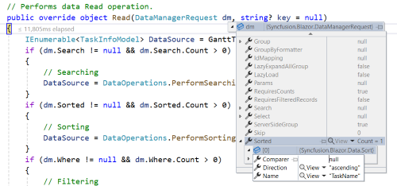

# Custom Binding in Blazor Gantt Chart Component

The [SfDataManager](https://help.syncfusion.com/cr/blazor/Syncfusion.Blazor.Data.SfDataManager.html) provides support for custom adaptor, which enable manual operations on data. This feature can be used to implement custom data binding and editing functionalities in the Gantt component, offering more flexibility in managing and interacting with the data.

To implement custom data binding in the Gantt component, the [DataAdaptor](https://help.syncfusion.com/cr/blazor/Syncfusion.Blazor.DataAdaptor.html) class is used. This abstract class serves as the foundation for creating a custom adaptor.

The `DataAdaptor`  abstract class includes both synchronous and asynchronous methods that can be overridden in a custom adaptor. Below are the key method signatures available in this class:

```csharp
public abstract class DataAdaptor
{
    /// <summary>
    /// Performs data Read operation synchronously.
    /// </summary>
    public virtual object Read(DataManagerRequest dataManagerRequest, string key = null)

    /// <summary>
    /// Performs data Read operation asynchronously.
    /// </summary>
    public virtual Task<object> ReadAsync(DataManagerRequest dataManagerRequest, string key = null)

    /// <summary>
    /// Performs Insert operation synchronously.
    /// </summary>
    public virtual object Insert(DataManager dataManager, object data, string key)
    /// <summary>
    /// Performs Insert operation asynchronously.
    /// </summary>
    public virtual Task<object> InsertAsync(DataManager dataManager, object data, string key)

    /// <summary>
    /// Performs Remove operation synchronously.
    /// </summary>
    public virtual object Remove(DataManager dataManager, object data, string keyField, string key)

    /// <summary>
    /// Performs Remove operation asynchronously.
    /// </summary>
    public virtual Task<object> RemoveAsync(DataManager dataManager, object data, string keyField, string key)

    /// <summary>
    /// Performs Update operation synchronously.
    /// </summary>
    public virtual object Update (DataManager dataManager, object data, string keyField, string key)

    /// <summary>
    /// Performs Update operation asynchronously.
    /// </summary>
    public virtual Task<object> UpdateAsync(DataManager dataManager, object data, string keyField, string key)

    /// <summary>
    /// Performs Batch CRUD operations synchronously.
    /// </summary>
    public virtual object BatchUpdate(DataManager dataManager, object changedRecords, object addedRecords, object deletedRecords, string keyField, string key, int? dropIndex)

    /// <summary>
    /// Performs Batch CRUD operations asynchronously.
    /// </summary>
    public virtual Task<object> BatchUpdateAsync(DataManager dataManager, object changedRecords, object addedRecords, object deletedRecords, string keyField, string key, int? dropIndex)
}
```

## Data binding

Custom data binding can be performed in the Gantt component by providing a custom adaptor class and overriding the [`Read`](https://help.syncfusion.com/cr/blazor/Syncfusion.Blazor.DataAdaptor.html#Syncfusion_Blazor_DataAdaptor_Read_Syncfusion_Blazor_DataManagerRequest_System_String_) or [`ReadAsync`](https://help.syncfusion.com/cr/blazor/Syncfusion.Blazor.DataAdaptor.html#Syncfusion_Blazor_DataAdaptor_ReadAsync_Syncfusion_Blazor_DataManagerRequest_System_String_) method of the `DataAdaptor` abstract class.

The code snippet below demonstrates how to implement custom data binding using a custom adaptor:

```cshtml
@using Syncfusion.Blazor.Gantt;
@using Syncfusion.Blazor.Data;
@using Syncfusion.Blazor;

<SfGantt TValue="TaskInfoModel" Height="450px" Width="1000px">
    <SfDataManager AdaptorInstance="@typeof(CustomAdaptor)" Adaptor="Adaptors.CustomAdaptor"></SfDataManager>
    <GanttTaskFields Id="TaskID" Name="TaskName" StartDate="StartDate" EndDate="EndDate" Progress="Progress" Duration="Duration" ParentID="ParentID">
    </GanttTaskFields>
</SfGantt>

@code {
    public static List<TaskInfoModel> GanttTaskCollection { get; set; } = new List<TaskInfoModel>();
    protected override void OnInitialized()
    {
        GanttTaskCollection = GetGantt().ToList();
    }
    public class TaskInfoModel
    {
        public int? TaskID { get; set; }
        public string? TaskName { get; set; }
        public DateTime StartDate { get; set; }
        public DateTime EndDate { get; set; }
        public int Progress { get; set; }
        public int Duration { get; set; }
        public int? ParentID { get; set; }
    }
    public static List<TaskInfoModel> GetGantt()
    {
        List<TaskInfoModel> TaskCollection = new List<TaskInfoModel>();
        int recordCount = 1;
        for (var parentRecordCount = 1; parentRecordCount <= 8; parentRecordCount++)
        {
            int rootParentRecordCount = recordCount;
            TaskCollection.Add(new TaskInfoModel() { TaskID = rootParentRecordCount, TaskName = "Parent Task " + rootParentRecordCount.ToString(), StartDate = new DateTime(2022, 06, 07), EndDate = new DateTime(2022, 08, 25), Progress = 70, ParentID = null, Duration = 20 });
            recordCount++;
            int parent = TaskCollection.Count;
            for (var childRecordCount = 1; childRecordCount < 4; childRecordCount++)
            {
                int iD = recordCount;
                TaskCollection.Add(new TaskInfoModel() { TaskID = iD, TaskName = "Child Task " + iD.ToString(), StartDate = new DateTime(2022, 06, 07), EndDate = new DateTime(2022, 08, 25), Progress = 30, ParentID = rootParentRecordCount, Duration = 5 });
                recordCount++;
                if ((((parent + childRecordCount + 1) % 3) == 0))
                {
                    for (var subChildRecordCount = 1; subChildRecordCount <= 2; subChildRecordCount++)
                    {
                        TaskCollection.Add(new TaskInfoModel() { TaskID = recordCount, TaskName = "Sub Task " + recordCount.ToString(), StartDate = new DateTime(2022, 06, 07), EndDate = new DateTime(2022, 08, 25), Progress = 50, ParentID = iD, Duration = 8 });
                        recordCount++;
                    }
                }
            }
        }
        return TaskCollection;
    }

    // Implementing custom adaptor by extending the DataAdaptor class.
    public class CustomAdaptor : DataAdaptor
    {
        // Performs data Read operation.
        public override object Read(DataManagerRequest dm, string? key = null)
        {
            IEnumerable<TaskInfoModel> DataSource = GanttTaskCollection;
            if (dm.Search != null && dm.Search.Count > 0)
            {
                // Searching
                DataSource = DataOperations.PerformSearching(DataSource, dm.Search);
            }
            if (dm.Sorted != null && dm.Sorted.Count > 0)
            {
                // Sorting
                DataSource = DataOperations.PerformSorting(DataSource, dm.Sorted);
            }
            if (dm.Where != null && dm.Where.Count > 0)
            {
                // Filtering
                if (dm.Where[0].Field != null && dm.Where[0].Field == nameof(TaskInfoModel.ParentID)) { }
                else
                {
                    DataSource = DataOperations.PerformFiltering(DataSource, dm.Where, dm.Where[0].Operator);
                }
            }
            int count = DataSource.Cast<TaskInfoModel>().Count();
            if (dm.Skip != 0)
            {
                //Paging
                DataSource = DataOperations.PerformSkip(DataSource, dm.Skip);
            }
            if (dm.Take != 0)
            {
                DataSource = DataOperations.PerformTake(DataSource, dm.Take);
            }
            return dm.RequiresCounts ? new DataResult() { Result = DataSource, Count = count } : (object)DataSource;
        }
    }
}
```

>If the [DataManagerRequest.RequiresCounts](https://help.syncfusion.com/cr/blazor/Syncfusion.Blazor.DataManagerRequest.html#Syncfusion_Blazor_DataManagerRequest_RequiresCounts) value is **true**, the `Read`/`ReadAsync` methods must return a [DataResult](https://help.syncfusion.com/cr/blazor/Syncfusion.Blazor.Data.DataResult.html) with a [Result](https://help.syncfusion.com/cr/blazor/Syncfusion.Blazor.Data.DataResult-1.html#Syncfusion_Blazor_Data_DataResult_1_Result) collection of records and a [Count](https://help.syncfusion.com/cr/blazor/Syncfusion.Blazor.Data.DataResult-1.html#Syncfusion_Blazor_Data_DataResult_1_Count) value representing the total number of records. <br/><br/>If `DataManagerRequest.RequiresCounts` is **false**, return only the collection of records. <br/><br/>If the `Read/ReadAsync` method is not overridden in the custom adaptor, the default read handler will manage the request.

## Inject service into custom adaptor

To inject a service into the custom adaptor and use it, the requirement can be achieved as shown below.

Initially, the CustomAdaptor class needs to be added as AddScoped in the Program.cs (or Startup.cs) file.

```csharp
builder.Services.AddSingleton<TaskModel>();
builder.Services.AddSingleton<CustomAdaptor>();
```

The following sample code demonstrates injecting a service into the Custom Adaptor:





@using Syncfusion.Blazor.Gantt;
@using Syncfusion.Blazor.Data;
@using Syncfusion.Blazor;
@using BlazorGanttApp.Data

<SfGantt TValue="TaskModel.TaskInfoModel" Height="450px" Width="1000px" Toolbar="@(new List<string>() { "Add", "Edit", "Delete", "Update", "Cancel" })">
    <SfDataManager AdaptorInstance="@typeof(CustomAdaptor)" Adaptor="Adaptors.CustomAdaptor"></SfDataManager>
    <GanttTaskFields Id="TaskID" Name="TaskName" StartDate="StartDate" EndDate="EndDate" Progress="Progress" Duration="Duration" ParentID="ParentID">
    </GanttTaskFields>
    <GanttEditSettings AllowEditing="true" AllowAdding="true" AllowDeleting="true"></GanttEditSettings>
</SfGantt>





namespace BlazorGanttApp.Data
{
    public class TaskModel
    {
        public class TaskInfoModel
        {
            public int? TaskID { get; set; }
            public string? TaskName { get; set; }
            public DateTime StartDate { get; set; }
            public DateTime EndDate { get; set; }
            public int Progress { get; set; }
            public int Duration { get; set; }
            public int? ParentID { get; set; }
        }
        public List<TaskInfoModel> GetGantt()
        {
            List<TaskInfoModel> TaskCollection = new List<TaskInfoModel>();
            int recordCount = 1;
            for (var parentRecordCount = 1; parentRecordCount <= 8; parentRecordCount++)
            {
                int rootParentRecordCount = recordCount;
                TaskCollection.Add(new TaskInfoModel() { TaskID = rootParentRecordCount, TaskName = "Parent Task " + rootParentRecordCount.ToString(), StartDate = new DateTime(2022, 06, 07), EndDate = new DateTime(2022, 08, 25), Progress = 70, ParentID = null, Duration = 20 });
                recordCount++;
                int parent = TaskCollection.Count;
                for (var childRecordCount = 1; childRecordCount < 4; childRecordCount++)
                {
                    int iD = recordCount;
                    TaskCollection.Add(new TaskInfoModel() { TaskID = iD, TaskName = "Child Task " + iD.ToString(), StartDate = new DateTime(2022, 06, 07), EndDate = new DateTime(2022, 08, 25), Progress = 30, ParentID = rootParentRecordCount, Duration = 5 });
                    recordCount++;
                    if ((((parent + childRecordCount + 1) % 3) == 0))
                    {
                        for (var subChildRecordCount = 1; subChildRecordCount <= 2; subChildRecordCount++)
                        {
                            TaskCollection.Add(new TaskInfoModel() { TaskID = recordCount, TaskName = "Sub Task " + recordCount.ToString(), StartDate = new DateTime(2022, 06, 07), EndDate = new DateTime(2022, 08, 25), Progress = 50, ParentID = iD, Duration = 8 });
                            recordCount++;
                        }
                    }
                }
            }
            return TaskCollection;
        }
    }
}





using Syncfusion.Blazor;
using Syncfusion.Blazor.Data;

namespace BlazorGanttApp.Data
{
    public class CustomAdaptor : DataAdaptor
    {
        private readonly TaskModel taskModel;

        public CustomAdaptor(TaskModel _context)
        {
            taskModel = _context;
        }
        // Performs data Read operation.
        public override object Read(DataManagerRequest dm, string? key = null)
        {
            IEnumerable<TaskModel.TaskInfoModel> DataSource = taskModel.GetGantt();
            if (dm.Search != null && dm.Search.Count > 0)
            {
                // Searching
                DataSource = DataOperations.PerformSearching(DataSource, dm.Search);
            }
            if (dm.Sorted != null && dm.Sorted.Count > 0)
            {
                // Sorting
                DataSource = DataOperations.PerformSorting(DataSource, dm.Sorted);
            }
            if (dm.Where != null && dm.Where.Count > 0)
            {
                // Filtering
                if (dm.Where[0].Field != null && dm.Where[0].Field == nameof(TaskModel.TaskInfoModel.ParentID)) { }
                else
                {
                    DataSource = DataOperations.PerformFiltering(DataSource, dm.Where, dm.Where[0].Operator);
                }
            }
            int count = DataSource.Cast<TaskModel.TaskInfoModel>().Count();
            if (dm.Skip != 0)
            {
                //Paging
                DataSource = DataOperations.PerformSkip(DataSource, dm.Skip);
            }
            if (dm.Take != 0)
            {
                DataSource = DataOperations.PerformTake(DataSource, dm.Take);
            }
            return dm.RequiresCounts ? new DataResult() { Result = DataSource, Count = count } : (object)DataSource;
        }
    }
}






## CRUD operation

The CRUD operations for the custom adaptor in the Gantt component can be implemented by overriding the following CRUD methods of the `DataAdaptor` abstract class:

* [Insert](https://help.syncfusion.com/cr/blazor/Syncfusion.Blazor.DataAdaptor.html#Syncfusion_Blazor_DataAdaptor_Insert_Syncfusion_Blazor_DataManager_System_Object_System_String_)/[InsertAsync](https://help.syncfusion.com/cr/blazor/Syncfusion.Blazor.DataAdaptor.html#Syncfusion_Blazor_DataAdaptor_InsertAsync_Syncfusion_Blazor_DataManager_System_Object_System_String_)
* [Remove](https://help.syncfusion.com/cr/blazor/Syncfusion.Blazor.DataAdaptor.html#Syncfusion_Blazor_DataAdaptor_Remove_Syncfusion_Blazor_DataManager_System_Object_System_String_System_String_)/[RemoveAsync](https://help.syncfusion.com/cr/blazor/Syncfusion.Blazor.DataAdaptor.html#Syncfusion_Blazor_DataAdaptor_RemoveAsync_Syncfusion_Blazor_DataManager_System_Object_System_String_System_String_)
* [Update](https://help.syncfusion.com/cr/blazor/Syncfusion.Blazor.DataAdaptor.html#Syncfusion_Blazor_DataAdaptor_Update_Syncfusion_Blazor_DataManager_System_Object_System_String_System_String_)/[UpdateAsync](https://help.syncfusion.com/cr/blazor/Syncfusion.Blazor.DataAdaptor.html#Syncfusion_Blazor_DataAdaptor_UpdateAsync_Syncfusion_Blazor_DataManager_System_Object_System_String_System_String_)
* [BatchUpdate](https://help.syncfusion.com/cr/blazor/Syncfusion.Blazor.DataAdaptor.html#Syncfusion_Blazor_DataAdaptor_BatchUpdate_Syncfusion_Blazor_DataManager_System_Object_System_Object_System_Object_System_String_System_String_System_Nullable_System_Int32__)/[BatchUpdateAsync](https://help.syncfusion.com/cr/blazor/Syncfusion.Blazor.DataAdaptor.html#Syncfusion_Blazor_DataAdaptor_BatchUpdateAsync_Syncfusion_Blazor_DataManager_System_Object_System_Object_System_Object_System_String_System_String_System_Nullable_System_Int32__)

The following sample code snippet demonstrates implementing CRUD operations for the custom adaptor:

```cshtml
@using Syncfusion.Blazor.Gantt;
@using Syncfusion.Blazor.Data;
@using Syncfusion.Blazor;

<SfGantt TValue="TaskInfoModel" Height="450px" Width="1000px" Toolbar="@(new List<string>() { "Add", "Edit", "Delete", "Update", "Cancel" })">
    <SfDataManager AdaptorInstance="@typeof(CustomAdaptor)" Adaptor="Adaptors.CustomAdaptor"></SfDataManager>
    <GanttTaskFields Id="TaskID" Name="TaskName" StartDate="StartDate" EndDate="EndDate" Progress="Progress" Duration="Duration" ParentID="ParentID">
    </GanttTaskFields>
    <GanttEditSettings AllowEditing="true" AllowAdding="true" AllowDeleting="true"></GanttEditSettings>
    <GanttEvents RowUpdating="RowUpdatingHandler" TValue="TaskInfoModel"></GanttEvents>
</SfGantt>

@code {
    public static List<TaskInfoModel> GanttTaskCollection { get; set; }
    public static int index = 0;

    public void RowUpdatingHandler(GanttRowUpdatingEventArgs<TaskInfoModel> args)
    {
        index = args.Index;
    }

    public class TaskInfoModel
    {
        public int? TaskID { get; set; }
        public string? TaskName { get; set; }
        public DateTime StartDate { get; set; }
        public DateTime EndDate { get; set; }
        public int Progress { get; set; }
        public int Duration { get; set; }
        public int? ParentID { get; set; }
    }

    protected override void OnInitialized()
    {
        GanttTaskCollection = GetGantt().ToList();
    }
    public static List<TaskInfoModel> GetGantt()
    {
        List<TaskInfoModel> TaskCollection = new List<TaskInfoModel>();
        int recordCount = 1;
        for (var parentRecordCount = 1; parentRecordCount <= 8; parentRecordCount++)
        {
            int rootParentRecordCount = recordCount;
            TaskCollection.Add(new TaskInfoModel() { TaskID = rootParentRecordCount, TaskName = "Parent Task " + rootParentRecordCount.ToString(), StartDate = new DateTime(2022, 06, 07), EndDate = new DateTime(2022, 08, 25), Progress = 70, ParentID = null, Duration = 20 });
            recordCount++;
            int parent = TaskCollection.Count;
            for (var childRecordCount = 1; childRecordCount < 4; childRecordCount++)
            {
                int childTaskId = recordCount;
                TaskCollection.Add(new TaskInfoModel() { TaskID = childTaskId, TaskName = "Child Task " + childTaskId.ToString(), StartDate = new DateTime(2022, 06, 07), EndDate = new DateTime(2022, 08, 25), Progress = 30, ParentID = rootParentRecordCount, Duration = 5 });
                recordCount++;
                if ((((parent + childRecordCount + 1) % 3) == 0))
                {
                    for (var subChildRecordCount = 1; subChildRecordCount <= 2; subChildRecordCount++)
                    {
                        TaskCollection.Add(new TaskInfoModel() { TaskID = recordCount, TaskName = "Sub Task " + recordCount.ToString(), StartDate = new DateTime(2022, 06, 07), EndDate = new DateTime(2022, 08, 25), Progress = 50, ParentID = childTaskId, Duration = 8 });
                        recordCount++;
                    }
                }
            }
        }
        return TaskCollection;
    }

    // Implementing custom adaptor by extending the DataAdaptor class.
    public class CustomAdaptor : DataAdaptor
    {
        // Performs data Read operation.
        public override object Read(DataManagerRequest dm, string? key = null)
        {
            IEnumerable<TaskInfoModel> DataSource = GanttTaskCollection;
            if (dm.Search != null && dm.Search.Count > 0)
            {
                // Searching
                DataSource = DataOperations.PerformSearching(DataSource, dm.Search);
            }
            if (dm.Sorted != null && dm.Sorted.Count > 0)
            {
                // Sorting
                DataSource = DataOperations.PerformSorting(DataSource, dm.Sorted);
            }
            if (dm.Where != null && dm.Where.Count > 0)
            {
                // Filtering
                if (dm.Where[0].Field != null && dm.Where[0].Field == nameof(TaskInfoModel.ParentID)) { }
                else
                {
                    DataSource = DataOperations.PerformFiltering(DataSource, dm.Where, dm.Where[0].Operator);
                }
            }
            int count = DataSource.Cast<TaskInfoModel>().Count();
            if (dm.Skip != 0)
            {
                //Paging
                DataSource = DataOperations.PerformSkip(DataSource, dm.Skip);
            }
            if (dm.Take != 0)
            {
                DataSource = DataOperations.PerformTake(DataSource, dm.Take);
            }
            return dm.RequiresCounts ? new DataResult() { Result = DataSource, Count = count } : (object)DataSource;
        }
        public override object Insert(DataManager dm, object value, string key)
        {
            if(GanttTaskCollection != null && GanttTaskCollection.Any() && GanttTaskCollection.Any(s=>s.TaskID == (value as TaskInfoModel).TaskID))
            {
                return value;
            }
            GanttTaskCollection.Insert(index, value as TaskInfoModel);
            return value;
        }

        // Performs Remove operation.
        public override object Remove(DataManager dm, object value, string keyField, string key)
        {
            var record = GanttTaskCollection.Where(s => s.TaskID == int.Parse(value.ToString())).FirstOrDefault();
            if (record == null)
            {
                return value;
            }
            GanttTaskCollection.Remove(record);
            return value;
        }

        // Performs Update operation.
        public override object Update(DataManager dm, object value, string keyField, string key)
        {
            var data = GanttTaskCollection.Where(s =>
            {
                int? taskID = s.TaskID;
                return taskID == (value as TaskInfoModel).TaskID;
            }).FirstOrDefault();
            if (data != null)
            {
                TaskInfoModel taskInfoModel = value as TaskInfoModel;
                data.TaskID = taskInfoModel.TaskID;
                data.TaskName = taskInfoModel.TaskName;
                data.StartDate = taskInfoModel.StartDate;
                data.EndDate = taskInfoModel.EndDate;
                data.Duration = taskInfoModel.Duration;
                data.Progress = taskInfoModel.Progress;
            }
            return value;
        }

        // Performs BatchUpdate operation
        public override object BatchUpdate(DataManager dm, object Changed, object Added, object Deleted, string KeyField, string Key, int? dropIndex)
        {
            if (Changed != null)
            {
                foreach (var record in (IEnumerable<TaskInfoModel>)Changed)
                {
                    var data = GanttTaskCollection.Where(s =>
                    {
                        int? taskID = s.TaskID;
                        return taskID == (record as TaskInfoModel).TaskID;
                    }).FirstOrDefault();
                    if (data != null)
                    {
                        TaskInfoModel taskInfoModel = record as TaskInfoModel;
                        data.TaskID = taskInfoModel.TaskID;
                        data.TaskName = taskInfoModel.TaskName;
                        data.StartDate = taskInfoModel.StartDate;
                        data.EndDate = taskInfoModel.EndDate;
                        data.Duration = taskInfoModel.Duration;
                        data.Progress = taskInfoModel.Progress;
                    }
                }

            }
            if (Added != null)
            {
                foreach (var record in (IEnumerable<TaskInfoModel>)Added)
                {
                    GanttTaskCollection.Add(record);
                }

            }
            if (Deleted != null)
            {
                foreach (var record in (IEnumerable<TaskInfoModel>)Deleted)
                {
                    GanttTaskCollection.Remove(GanttTaskCollection.Where(s => s.TaskID == record.TaskID).FirstOrDefault());
                }

            }
            return GanttTaskCollection;
        }
    }
}
```

## Handling Filtering in Custom Adaptor

When using a custom adaptor, handle the filtering operation by overriding the `Read`/`ReadAsync` method of the `DataAdaptor` abstract class. The filter action details can be obtained from the `DataManagerRequest` class, as shown in the image below.


> Filter records are displayed based on setting the filtered records in the `Read`/`ReadAsync` method. When filtering child records, the parent records should be included in the filtered datasource.

``` cshtml
@using Syncfusion.Blazor.Gantt;
@using Syncfusion.Blazor.Data;
@using Syncfusion.Blazor;

<SfGantt TValue="TaskInfoModel" AllowFiltering="true" Height="450px" Width="1000px" Toolbar="@(new List<string>() { "Add", "Edit", "Delete", "Update", "Cancel" })">
    <SfDataManager AdaptorInstance="@typeof(CustomAdaptor)" Adaptor="Adaptors.CustomAdaptor"></SfDataManager>
    <GanttTaskFields Id="TaskID" Name="TaskName" StartDate="StartDate" EndDate="EndDate" Progress="Progress" Duration="Duration" ParentID="ParentID">
    </GanttTaskFields>
    <GanttFilterSettings HierarchyMode="FilterHierarchyMode.Both"></GanttFilterSettings>
    <GanttEditSettings AllowEditing="true" AllowAdding="true" AllowDeleting="true"></GanttEditSettings>
    <GanttEvents RowUpdating="RowUpdatingHandler" TValue="TaskInfoModel"></GanttEvents>
</SfGantt>

@code {
    public static List<TaskInfoModel> GanttTaskCollection { get; set; }
    public static int index = 0;

    public void RowUpdatingHandler(GanttRowUpdatingEventArgs<TaskInfoModel> args)
    {
        index = args.Index;
    }

    public class TaskInfoModel
    {
        public int? TaskID { get; set; }
        public string? TaskName { get; set; }
        public DateTime StartDate { get; set; }
        public DateTime EndDate { get; set; }
        public int Progress { get; set; }
        public int Duration { get; set; }
        public int? ParentID { get; set; }
    }

    protected override void OnInitialized()
    {
        GanttTaskCollection = GetGantt().ToList();
    }
    public static List<TaskInfoModel> GetGantt()
    {
        List<TaskInfoModel> TaskCollection = new List<TaskInfoModel>();
        int recordCount = 1;
        for (var parentRecordCount = 1; parentRecordCount <= 8; parentRecordCount++)
        {
            int rootParentRecordCount = recordCount;
            TaskCollection.Add(new TaskInfoModel() { TaskID = rootParentRecordCount, TaskName = "Parent Task " + rootParentRecordCount.ToString(), StartDate = new DateTime(2022, 06, 07), EndDate = new DateTime(2022, 08, 25), Progress = 70, ParentID = null, Duration = 20 });
            recordCount++;
            int parent = TaskCollection.Count;
            for (var childRecordCount = 1; childRecordCount < 4; childRecordCount++)
            {
                int childTaskId = recordCount;
                TaskCollection.Add(new TaskInfoModel() { TaskID = childTaskId, TaskName = "Child Task " + childTaskId.ToString(), StartDate = new DateTime(2022, 06, 07), EndDate = new DateTime(2022, 08, 25), Progress = 30, ParentID = rootParentRecordCount, Duration = 5 });
                recordCount++;
                if ((((parent + childRecordCount + 1) % 3) == 0))
                {
                    for (var subChildRecordCount = 1; subChildRecordCount <= 2; subChildRecordCount++)
                    {
                        TaskCollection.Add(new TaskInfoModel() { TaskID = recordCount, TaskName = "Sub Task " + recordCount.ToString(), StartDate = new DateTime(2022, 06, 07), EndDate = new DateTime(2022, 08, 25), Progress = 50, ParentID = childTaskId, Duration = 8 });
                        recordCount++;
                    }
                }
            }
        }
        return TaskCollection;
    }

    // Implementing custom adaptor by extending the DataAdaptor class.
    public class CustomAdaptor : DataAdaptor
    {
        // Performs data Read operation.
        public override object Read(DataManagerRequest dm, string? key = null)
        {
            IEnumerable<TaskInfoModel> DataSource = GanttTaskCollection;
            if (dm.Search != null && dm.Search.Count > 0)
            {
                // Searching
                DataSource = DataOperations.PerformSearching(DataSource, dm.Search);
            }
            if (dm.Sorted != null && dm.Sorted.Count > 0)
            {
                // Sorting
                DataSource = DataOperations.PerformSorting(DataSource, dm.Sorted);
            }
            if (dm.Where != null && dm.Where.Count > 0)
            {
                // Filtering
                if (dm.Where[0].Field != null && dm.Where[0].Field == nameof(TaskInfoModel.ParentID)) { }
                else
                {
                    DataSource = DataOperations.PerformFiltering(DataSource, dm.Where, dm.Where[0].Operator);
                    if (dm.Where[0].predicates != null && dm.Where[0].predicates[0].Field == "TaskName")
                    {
                        if (DataSource != null && DataSource.Any())
                        {
                            DataSource = DataSource.OfType<TaskInfoModel>().ToList();
                            List<TaskInfoModel> filteredData = new List<TaskInfoModel>();
                            filteredData.AddRange(DataSource);
                            foreach (var item in DataSource)
                            {
                                if (item.ParentID != null && !DataSource.Any(s => s.TaskID == item.ParentID))
                                {
                                    filteredData.Add(GanttTaskCollection.Where(s => s.TaskID == item.ParentID).FirstOrDefault());
                                }
                                else if (item.ParentID == null)
                                {
                                    var records = GanttTaskCollection.Where(s => s.ParentID == item.TaskID);
                                    if (records != null && records.Any())
                                    {
                                        filteredData.AddRange(records);
                                    }
                                }
                            }
                            DataSource = filteredData;
                        }
                    }
                }
            }
            int count = DataSource.Cast<TaskInfoModel>().Count();
            if (dm.Skip != 0)
            {
                //Paging
                DataSource = DataOperations.PerformSkip(DataSource, dm.Skip);
            }
            if (dm.Take != 0)
            {
                DataSource = DataOperations.PerformTake(DataSource, dm.Take);
            }

            return dm.RequiresCounts ? new DataResult() { Result = DataSource, Count = count } : (object)DataSource;
        }
    }
}
```

## Handling Sorting in Custom Adaptor

When using a custom adaptor, the sorting operation must be handled by overriding the `Read`/`ReadAsync` method of the `DataAdaptor` abstract class. The sort action details can be obtained from the `DataManagerRequest` class, as shown in the image below.



``` cshtml
@using Syncfusion.Blazor.Gantt;
@using Syncfusion.Blazor.Data;
@using Syncfusion.Blazor;

<SfGantt TValue="TaskInfoModel" AllowSorting="true" Height="450px" Width="1000px" Toolbar="@(new List<string>() { "Add", "Edit", "Delete", "Update", "Cancel" })">
    <SfDataManager AdaptorInstance="@typeof(CustomAdaptor)" Adaptor="Adaptors.CustomAdaptor"></SfDataManager>
    <GanttTaskFields Id="TaskID" Name="TaskName" StartDate="StartDate" EndDate="EndDate" Progress="Progress" Duration="Duration" ParentID="ParentID">
    </GanttTaskFields>
    <GanttEditSettings AllowEditing="true" AllowAdding="true" AllowDeleting="true"></GanttEditSettings>
    <GanttEvents RowUpdating="RowUpdatingHandler" TValue="TaskInfoModel"></GanttEvents>
</SfGantt>

@code {
    public static List<TaskInfoModel> GanttTaskCollection { get; set; }
    public static int index = 0;

    public void RowUpdatingHandler(GanttRowUpdatingEventArgs<TaskInfoModel> args)
    {
        index = args.Index;
    }

    public class TaskInfoModel
    {
        public int? TaskID { get; set; }
        public string? TaskName { get; set; }
        public DateTime StartDate { get; set; }
        public DateTime EndDate { get; set; }
        public int Progress { get; set; }
        public int Duration { get; set; }
        public int? ParentID { get; set; }
    }

    protected override void OnInitialized()
    {
        GanttTaskCollection = GetGantt().ToList();
    }
    public static List<TaskInfoModel> GetGantt()
    {
        List<TaskInfoModel> TaskCollection = new List<TaskInfoModel>();
        int recordCount = 1;
        for (var parentRecordCount = 1; parentRecordCount <= 8; parentRecordCount++)
        {
            int rootParentRecordCount = recordCount;
            TaskCollection.Add(new TaskInfoModel() { TaskID = rootParentRecordCount, TaskName = "Parent Task " + rootParentRecordCount.ToString(), StartDate = new DateTime(2022, 06, 07), EndDate = new DateTime(2022, 08, 25), Progress = 70, ParentID = null, Duration = 20 });
            recordCount++;
            int parent = TaskCollection.Count;
            for (var childRecordCount = 1; childRecordCount < 4; childRecordCount++)
            {
                int childTaskId = recordCount;
                TaskCollection.Add(new TaskInfoModel() { TaskID = childTaskId, TaskName = "Child Task " + childTaskId.ToString(), StartDate = new DateTime(2022, 06, 07), EndDate = new DateTime(2022, 08, 25), Progress = 30, ParentID = rootParentRecordCount, Duration = 5 });
                recordCount++;
                if ((((parent + childRecordCount + 1) % 3) == 0))
                {
                    for (var subChildRecordCount = 1; subChildRecordCount <= 2; subChildRecordCount++)
                    {
                        TaskCollection.Add(new TaskInfoModel() { TaskID = recordCount, TaskName = "Sub Task " + recordCount.ToString(), StartDate = new DateTime(2022, 06, 07), EndDate = new DateTime(2022, 08, 25), Progress = 50, ParentID = childTaskId, Duration = 8 });
                        recordCount++;
                    }
                }
            }
        }
        return TaskCollection;
    }

    // Implementing custom adaptor by extending the DataAdaptor class.
    public class CustomAdaptor : DataAdaptor
    {
        // Performs data Read operation.
        public override object Read(DataManagerRequest dm, string? key = null)
        {
            IEnumerable<TaskInfoModel> DataSource = GanttTaskCollection;
            if (dm.Search != null && dm.Search.Count > 0)
            {
                // Searching
                DataSource = DataOperations.PerformSearching(DataSource, dm.Search);
            }
            if (dm.Sorted != null && dm.Sorted.Count > 0)
            {
                // Sorting
                DataSource = DataOperations.PerformSorting(DataSource, dm.Sorted);
            }
            if (dm.Where != null && dm.Where.Count > 0)
            {
                // Filtering
                if (dm.Where[0].Field != null && dm.Where[0].Field == nameof(TaskInfoModel.ParentID)) { }
                else
                {
                    DataSource = DataOperations.PerformFiltering(DataSource, dm.Where, dm.Where[0].Operator);
                }
            }
            int count = DataSource.Cast<TaskInfoModel>().Count();
            if (dm.Skip != 0)
            {
                //Paging
                DataSource = DataOperations.PerformSkip(DataSource, dm.Skip);
            }
            if (dm.Take != 0)
            {
                DataSource = DataOperations.PerformTake(DataSource, dm.Take);
            }
            
            return dm.RequiresCounts ? new DataResult() { Result = DataSource, Count = count } : (object)DataSource;
        }
        public override object Insert(DataManager dm, object value, string key)
        {
            GanttTaskCollection.Insert(index, value as TaskInfoModel);
            return value;
        }

        // Performs Remove operation.
        public override object Remove(DataManager dm, object value, string keyField, string key)
        {
            var record = GanttTaskCollection.Where(s => s.TaskID == int.Parse(value.ToString())).FirstOrDefault();
            if(record == null)
            {
                return value;
            }
            GanttTaskCollection.Remove(record);
            return value;
        }

        // Performs Update operation.
        public override object Update(DataManager dm, object value, string keyField, string key)
        {
            var data = GanttTaskCollection.Where(s =>
            {
                int? taskID = s.TaskID;
                return taskID == (value as TaskInfoModel).TaskID;
            }).FirstOrDefault();
            if (data != null)
            {
                TaskInfoModel taskInfoModel = value as TaskInfoModel;
                data.TaskID = taskInfoModel.TaskID;
                data.TaskName = taskInfoModel.TaskName;
                data.StartDate = taskInfoModel.StartDate;
                data.EndDate = taskInfoModel.EndDate;
                data.Duration = taskInfoModel.Duration;
                data.Progress = taskInfoModel.Progress;
            }
            return value;
        }
    }
}
```

>The sample for the custom adaptor can be found [here](https://github.com/SyncfusionExamples/Gantt-Chart-Custom-Adaptor-sample-using-Blazor-server-application).