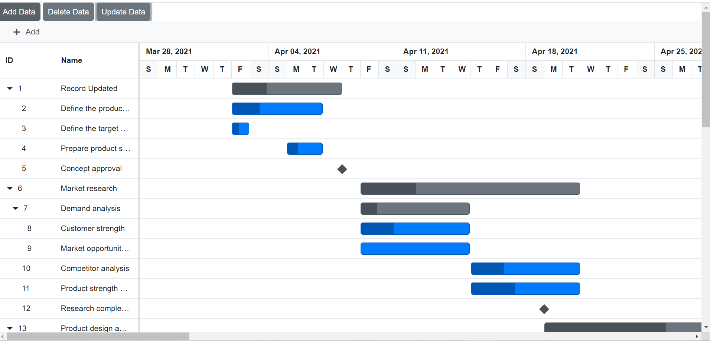
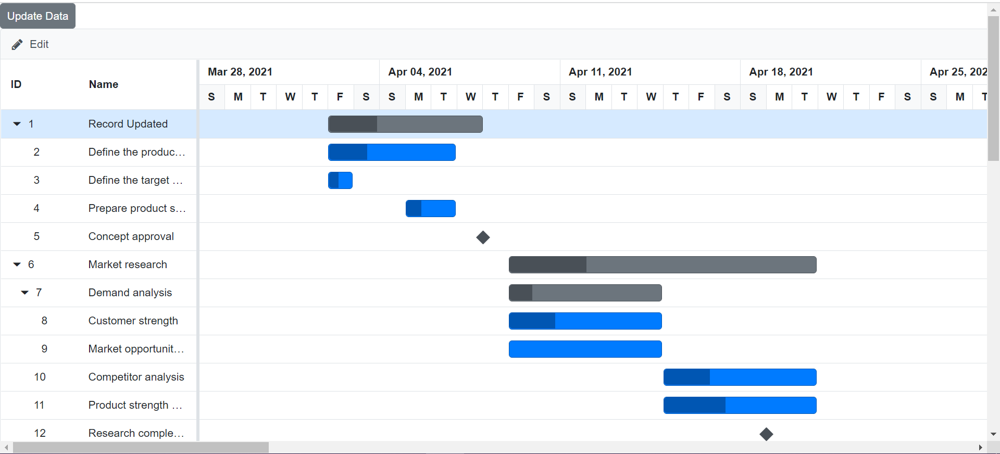
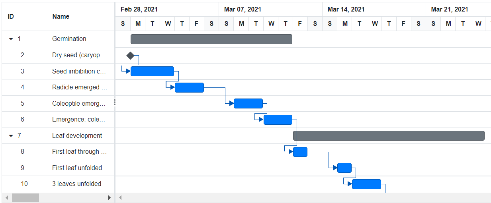

# Data Binding in Blazor Gantt Chart Component

The [Blazor Gantt Chart](https://www.syncfusion.com/blazor-components/blazor-gantt-chart) uses [SfDataManager](https://help.syncfusion.com/cr/aspnetcore-blazor/Syncfusion.Blazor.Data.SfDataManager.html), which supports both RESTful JSON data services binding and IEnumerable binding. The `DataSource` value can be assigned either with the property values from `SfDataManager` or list of business objects.
It supports the following kinds of data binding method:

* List binding
* Remote data

> When using `DataSource` as `IEnumerable<T>`, component type(TValue) will be inferred from its value. When using [SfDataManager](https://help.syncfusion.com/cr/aspnetcore-blazor/Syncfusion.Blazor.Data.SfDataManager.html) for data binding, the **TValue** must be provided explicitly in the Gantt component.

## List binding

To bind list binding to the Gantt component, you can assign a IEnumerable object to the `DataSource` property. The list data source can also be provided as an instance of the [SfDataManager](https://help.syncfusion.com/cr/aspnetcore-blazor/Syncfusion.Blazor.Data.SfDataManager.html) or by using `SfDataManager` component.

### Hierarchical data Binding

The `Child` property is used to map the child records in hierarchical data. The following code example shows how to bind the hierarchical list data into the Gantt Chart component.

```cshtml
@using Syncfusion.Blazor.Gantt
<SfGantt DataSource="@TaskCollection" Height="450px" Width="700px">
    <GanttTaskFields Id="TaskId" Name="TaskName" StartDate="StartDate" EndDate="EndDate" Duration="Duration" Progress="Progress" Child="SubTasks">
    </GanttTaskFields>
</SfGantt>

@code{
private List<TaskData> TaskCollection { get; set; }
protected override void OnInitialized()
{
    this.TaskCollection = GetTaskCollection();
}

public class TaskData
{
    public int TaskId { get; set; }
    public string TaskName { get; set; }
    public DateTime StartDate { get; set; }
    public DateTime EndDate { get; set; }
    public string Duration { get; set; }
    public int Progress { get; set; }
    public List<TaskData> SubTasks { get; set; }
}

public static List<TaskData> GetTaskCollection()
{
    List<TaskData> Tasks = new List<TaskData>() {
        new TaskData() { TaskId = 1, TaskName = "Project initiation", StartDate = new DateTime(2022, 04, 05), EndDate = new DateTime(2022, 04, 21), SubTasks = (new List <TaskData> () { new TaskData() { TaskId = 2, TaskName = "Identify Site location", StartDate = new DateTime(2022, 04, 05), Duration = "0", Progress = 30, }, new TaskData() { TaskId = 3, TaskName = "Perform soil test", StartDate = new DateTime(2022, 04, 05), Duration = "4", Progress = 40, }, new TaskData() { TaskId = 4, TaskName = "Soil test approval", StartDate = new DateTime(2022, 04, 05), Duration = "0", Progress = 30 }, }) },
        new TaskData() { TaskId = 5, TaskName = "Project estimation", StartDate = new DateTime(2022, 04, 06), EndDate = new DateTime(2022, 04, 21), SubTasks = (new List <TaskData> () { new TaskData() { TaskId = 6, TaskName = "Develop floor plan for estimation", StartDate = new DateTime(2022, 04, 06), Duration = "3", Progress = 30, }, new TaskData() { TaskId = 7, TaskName = "List materials", StartDate = new DateTime(2022, 04, 06), Duration = "3", Progress = 40 }, new TaskData() { TaskId = 8, TaskName = "Estimation approval", StartDate = new DateTime(2022, 04, 06), Duration = "0", Progress = 30, } }) }
    };
    return Tasks;
}
}
```

> * Indent/Outdent is not supported for Hierarchy Data.
> * ExpandCollapse State maintenance is not supported for Hierarchy Data.
> * Row Drag and Drop feature is not supported for Hierarchy Data.

### Self-Referential / Flat Data Binding

The Gantt Chart component can be bound with self-referential data by mapping the data source field values to the `Id` and `ParentID` properties.

* ID field: This field contains unique values used to identify each individual task and it is mapped to the `Id` property.
* Parent ID field: This field contains values that indicate parent tasks and it is mapped to the `ParentID` property.

```cshtml
@using Syncfusion.Blazor.Gantt
<SfGantt DataSource="@TaskCollection" Height="450px" Width="700px">
    <GanttTaskFields Id="TaskId" Name="TaskName" StartDate="StartDate" EndDate="EndDate" Duration="Duration" Progress="Progress" ParentID="ParentId">
    </GanttTaskFields>
</SfGantt>

@code{
    private List<TaskData> TaskCollection { get; set; }
    protected override void OnInitialized()
    {
        this.TaskCollection = GetTaskCollection();
    }

    public class TaskData
    {
        public int TaskId { get; set; }
        public string TaskName { get; set; }
        public DateTime StartDate { get; set; }
        public DateTime EndDate { get; set; }
        public string Duration { get; set; }
        public int Progress { get; set; }
        public int? ParentId { get; set; }
    }

    public static List <TaskData> GetTaskCollection() {
    List <TaskData> Tasks = new List <TaskData> () {
        new TaskData() { TaskId = 1, TaskName = "Project initiation", StartDate = new DateTime(2022, 04, 05), EndDate = new DateTime(2022, 04, 21) },
        new TaskData() { TaskId = 2, TaskName = "Identify Site location", StartDate = new DateTime(2022, 04, 05), Duration = "0", Progress = 30, ParentId = 1 },
        new TaskData() { TaskId = 3, TaskName = "Perform soil test", StartDate = new DateTime(2022, 04, 05), Duration = "4", Progress = 40, ParentId = 1 },
        new TaskData() { TaskId = 4, TaskName = "Soil test approval", StartDate = new DateTime(2022, 04, 05), Duration = "0", Progress = 30, ParentId = 1 },
        new TaskData() { TaskId = 5, TaskName = "Project estimation", StartDate = new DateTime(2022, 04, 06), EndDate = new DateTime(2022, 04, 21) },
        new TaskData() { TaskId = 6, TaskName = "Develop floor plan for estimation", StartDate = new DateTime(2022, 04, 06), Duration = "3", Progress = 30, ParentId = 5 },
        new TaskData() { TaskId = 7, TaskName = "List materials", StartDate = new DateTime(2022, 04, 06), Duration = "3", Progress = 40, ParentId = 5 },
        new TaskData() { TaskId = 8, TaskName = "Estimation approval", StartDate = new DateTime(2022, 04, 06), Duration = "0", Progress = 30, ParentId = 5 }
    };
    return Tasks;
}
}
```

### DynamicObject binding

Gantt Chart is a generic component which is strongly bound to a model type. There are cases when the model type is unknown during compile type. In such cases you can bind data to the gantt chart as list of  **DynamicObject**.

**DynamicObject** can be bound to gantt chart by assigning to the [DataSource](https://help.syncfusion.com/cr/blazor/Syncfusion.Blazor.Gantt.SfGantt-1.html#Syncfusion_Blazor_Gantt_SfGantt_1_DataSource) property. Gantt Chart can also perform all kind of supported data operations and editing in DynamicObject.

> The [GetDynamicMemberNames](https://docs.microsoft.com/en-us/dotnet/api/system.dynamic.dynamicobject.getdynamicmembernames?view=netcore-3.1) method of DynamicObject class must be overridden and return the property names to render and perform data operations, editing etc., while using DynamicObject.

```cshtml
@using Syncfusion.Blazor.Gantt
@using System.Dynamic

<SfGantt DataSource="@GanttDynamicData" Height="500px" Width="100%" HighlightWeekends="true">
    <GanttTaskFields Id="TaskId" Name="TaskName" StartDate="StartDate" Progress="Progress" Duration="Duration" ParentID="ParentId"></GanttTaskFields>
    <GanttColumns>
        <GanttColumn Field="TaskId" HeaderText="Task ID" TextAlign="Syncfusion.Blazor.Grids.TextAlign.Right" Width="100"></GanttColumn>
        <GanttColumn Field="TaskName" HeaderText="Task Name" Width="250"></GanttColumn>
        <GanttColumn Field="StartDate" HeaderText="Start Date" Width="250"></GanttColumn>
        <GanttColumn Field="Duration" HeaderText="Duration" Width="250"></GanttColumn>
        <GanttColumn Field="Progress" HeaderText="Progress" Format="@NumberFormat" Width="250"></GanttColumn>
    </GanttColumns>
    <GanttEditSettings AllowAdding="true" AllowEditing="true" AllowDeleting="true" AllowTaskbarEditing="true" ShowDeleteConfirmDialog="true"></GanttEditSettings>
</SfGantt>

@code {
    SfGantt<DynamicDictionary> GanttChart;
    private string NumberFormat = "C";
    private static List<DynamicDictionary> Data = new List<DynamicDictionary>();
    private List<DynamicDictionary> GanttDynamicData { get; set; }
    private static int ParentRecordID { get; set; }
    private static int ChildRecordID { get; set; }

    protected override void OnInitialized()
    {
        this.GanttDynamicData = GetData().ToList();
    }

    public static List<DynamicDictionary> GetData()
    {
        Data.Clear();
        ParentRecordID = 0;
        ChildRecordID = 0;
        for (var i = 1; i <= 10; i++)
        {
            Random ran = new Random();
            DateTime start = new DateTime(2022, 01, 07);
            int range = (DateTime.Today - start).Days;
            DateTime startingDate = start.AddDays(ran.Next(range));
            dynamic ParentRecord = new DynamicDictionary();
            ParentRecord.TaskId = ++ParentRecordID;
            ParentRecord.TaskName = "Parent Task " + i;
            ParentRecord.StartDate = startingDate;
            ParentRecord.Progress = ran.Next(10, 100);
            ParentRecord.Duration = ParentRecordID % 2 == 0 ? (32).ToString() : (76).ToString();
            ParentRecord.ParentId = null;
            Data.Add(ParentRecord);
            AddChildRecords(ParentRecordID);
        }
        return Data;
    }

    public static void AddChildRecords(int ParentId)
    {
        for (var i = 1; i < 4; i++)
        {
            Random ran = new Random();
            DateTime start = new DateTime(2022, 01, 07);
            int range = (DateTime.Today - start).Days;
            DateTime startingDate = start.AddDays(ran.Next(range));
            dynamic ChildRecord = new DynamicDictionary();
            ChildRecord.TaskId = ++ParentRecordID;
            ChildRecord.TaskName = "Child Task " + ++ChildRecordID;
            ChildRecord.StartDate = startingDate;
            ChildRecord.Progress = ran.Next(10, 100);
            ChildRecord.Duration = ParentRecordID % 3 == 0 ? (64).ToString() : (98).ToString();
            ChildRecord.ParentId = ParentId;
            Data.Add(ChildRecord);
        }
    }

    public class DynamicDictionary : DynamicObject
    {
        Dictionary<string, object> dictionary = new Dictionary<string, object>();
        public override bool TryGetMember(GetMemberBinder binder, out object result)
        {
            string name = binder.Name;
            return dictionary.TryGetValue(name, out result);
        }

        public override bool TrySetMember(SetMemberBinder binder, object value)
        {
            dictionary[binder.Name] = value;
            return true;
        }

        public override System.Collections.Generic.IEnumerable<string> GetDynamicMemberNames()
        {
            return this.dictionary?.Keys;
        }
    }
}
```

### ExpandoObject Binding

Gantt is a generic component which is strongly bound to a model type. There are cases when the model type is unknown during compile type. In such cases you can bound data to the Gantt as list of ExpandoObject.

ExpandoObject can be bound to Gantt by assigning to the `DataSource` property. Gantt can also perform all kind of supported data operations and editing in ExpandoObject.

```cshtml

@using Syncfusion.Blazor.Gantt

<SfGantt TValue="ExpandoObject" DataSource="@TreeData" @ref="Gantt" Height="450px" Width="700px">
    <GanttTaskFields Id="TaskID" Name="TaskName" StartDate="StartDate" Duration="Duration"
        Progress="Progress" ParentID="ParentID">
    </GanttTaskFields>
    <GanttEditSettings AllowAdding="true" AllowDeleting="true" AllowEditing="true" AllowTaskbarEditing="true"></GanttEditSettings>
</SfGantt>

@code {
    SfGantt<ExpandoObject> Gantt;
    private List<ExpandoObject> TreeData { get; set; }
    protected override void OnInitialized()
    {
        this.TreeData = GetData().ToList();
    }
    private static List<ExpandoObject> Data = new List<ExpandoObject>();
    private static int ParentRecordID { get; set; }
    private static int ChildRecordID { get; set; }
    public static List<ExpandoObject> GetData()
    {
        Data.Clear();
        ParentRecordID = 0;
        ChildRecordID = 0;
        for (var i = 1; i <= 60; i++)
        {
            Random ran = new Random();
            DateTime start = new DateTime(2022, 03, 07);
            int range = (DateTime.Today - start).Days;
            DateTime startingDate = start.AddDays(ran.Next(range));
            dynamic ParentRecord = new ExpandoObject();
            ParentRecord.TaskID = ++ParentRecordID;
            ParentRecord.TaskName = "Parent Task " + i;
            ParentRecord.StartDate = startingDate;
            ParentRecord.Progress = ran.Next(10, 100);
            ParentRecord.Duration = ParentRecordID % 2 == 0 ? (32).ToString() : (76).ToString();
            ParentRecord.ParentID = null;
            Data.Add(ParentRecord);
            AddChildRecords(ParentRecordID);
        }
        return Data;
    }
    public static void AddChildRecords(int ParentId)
    {
        for (var i = 1; i < 4; i++)
        {
            Random ran = new Random();
            DateTime start = new DateTime(2022, 03, 07);
            int range = (DateTime.Today - start).Days;
            DateTime startingDate = start.AddDays(ran.Next(range));
            dynamic ChildRecord = new ExpandoObject();
            ChildRecord.TaskID = ++ParentRecordID;
            ChildRecord.TaskName = "Child Task " + ++ChildRecordID;
            ChildRecord.StartDate = startingDate;
            ChildRecord.Progress = ran.Next(10, 100);
            ChildRecord.Duration = ParentRecordID % 3 == 0 ? (64).ToString() : (98).ToString();
            ChildRecord.ParentID = ParentId;
            Data.Add(ChildRecord);
        }
    }
    public class ExpandoObject
    {
        public int TaskID { get; set; }
        public string TaskName { get; set; }
        public DateTime? StartDate { get; set; }
        public DateTime? EndDate { get; set; }
        public int Progress { get; set; }
        public string Duration { get; set; }
        public int? ParentID { get; set; }
    }
}
```

> Here, we have provided list of reserved properties and the purpose used in Gantt Chart. We recommend to avoid these reserved properties for Internal purpose(To get rid of conflicts).

Reserved keywords | Purpose
-----|-----
ganttProperties | Specifies the task data details
TaskMode | Specifies the mode of task
childRecords | Specifies the childRecords of a parentData
hasChildRecords | Specifies whether the record contains child records
expanded | Specifies whether the child records are expanded
parentRecord | Specifies the parentItem of childRecords
index | Specifies the index of current record
level | Specifies the hierarchy level of record
uniqueID | Specifies the unique ID of a record
parentUniqueID | Specifies the parent Unique ID of a record
checkboxState | Specifies the checkbox state of a record

## Observable collection and INotifyPropertyChanged

The Gantt chart supports to automatically update data based on `INotifyCollectionChanged` and `INotifyPropertyChanged` interface.

### Observable Collection

The [ObservableCollection](https://docs.microsoft.com/en-us/dotnet/api/system.collections.objectmodel.observablecollection-1?view=net-6.0) (dynamic data collection) provides notifications when items are added, removed, and moved. The implemented [INotifyCollectionChanged](https://docs.microsoft.com/en-us/dotnet/api/system.collections.specialized.inotifycollectionchanged?view=net-6.0) provides notification when the dynamic changes of adding, removing, moving, and clearing the collection occur.

```cshtml
@using Syncfusion.Blazor.Gantt
@using Syncfusion.Blazor.Buttons
@using System.Collections.ObjectModel;
@using System.ComponentModel;
@using System.Collections.Specialized
<div >
     <div >
       <SfButton ID="add" @onclick="AddRecord">Add Data</SfButton>
       <SfButton ID="del" @onclick="DeleteRecord">Delete Data</SfButton>
     </div>
     <SfGantt DataSource="@ObservableData" Toolbar="@(new List<string>() { "Add", "Delete"})">
         <GanttTaskFields Id="TaskId" Name="TaskName" StartDate="StartDate" EndDate="EndDate" Duration="Duration" Progress="Progress" ParentID="ParentId">
         </GanttTaskFields>
         <GanttEditSettings AllowAdding="true" AllowDeleting="true"></GanttEditSettings> </SfGantt> </div>
@code {
    public ObservableCollection<TaskData> ObservableData { get; set; }

    protected override void OnInitialized()
    {
        ObservableData = ProjectNewData();
    }
    public void AddRecord()
    {
        ObservableData.Add(new TaskData() { TaskId=41,TaskName="New Task",StartDate= new DateTime(2021,04,04),Duration="4" });
    }
    public void DeleteRecord()
    {
        if (ObservableData.Count() != 0)
        {
            int deleteRecordTaskId = ObservableData.First().TaskId;
            ObservableData.Remove(ObservableData.First());
            RemoveChild(deleteRecordTaskId);
        }
    }

    public void RemoveChild(int id){
        ObservableCollection<TaskData> childRecords = new ObservableCollection<TaskData>();
        for(int j= 0 ; j< ObservableData.Count();j++)
        {
            if(id == ObservableData[j].ParentId )
                childRecords.Add(ObservableData[j]);
        }

        for(int i= childRecords.Count()-1 ; i >= 0 ;i--)
        {
             int deleteRcordid = childRecords[i].TaskId;
             RemoveChild(deleteRcordid);
             ObservableData.Remove(childRecords[i]);
        }
    }
    public static ObservableCollection<TaskData> ProjectNewData()
    {
        ObservableCollection<TaskData> Tasks = new ObservableCollection<TaskData>() {
        new TaskData() { TaskId = 1, TaskName = "Product concept ", StartDate = new DateTime(2021, 04, 02), EndDate = new DateTime(2021, 04, 08), Duration = "5days" },
        new TaskData() { TaskId = 2, TaskName = "Define the product usage", StartDate = new DateTime(2021, 04, 02), EndDate = new DateTime(2021, 04, 08), Duration = "3", Progress = 30, ParentId = 1 },
        new TaskData() { TaskId = 3, TaskName = "Define the target audience", EndDate = new DateTime(2021, 04, 04), Progress = 40, ParentId = 1 },
        new TaskData() { TaskId = 4, TaskName = "Prepare product sketch and notes", StartDate = new DateTime(2021, 04, 05), Duration = "2", Progress = 30, ParentId = 1 },
        new TaskData() { TaskId = 5, TaskName = "Concept approval", StartDate = new DateTime(2021, 04, 08), EndDate = new DateTime(2021, 04, 08), Duration="0", ParentId = 1 },
        new TaskData() { TaskId = 6, TaskName = "Market research", StartDate = new DateTime(2021, 04, 09), EndDate = new DateTime(2021, 04, 18), Duration = "4", Progress = 30 },
        new TaskData() { TaskId = 7, TaskName = "Demand analysis", Duration = "4", Progress = 40, ParentId = 6 },
        new TaskData() { TaskId = 8, TaskName = "Customer strength", StartDate = new DateTime(2021, 04, 09), EndDate = new DateTime(2021, 04, 12), Duration = "4", Progress = 30, ParentId = 7 },
        new TaskData() { TaskId = 9, TaskName = "Market opportunity analysis", StartDate = new DateTime(2021, 04, 09), EndDate = new DateTime(2021, 04, 012), Duration="4", ParentId= 7 },
        new TaskData() { TaskId = 10, TaskName = "Competitor analysis", StartDate = new DateTime(2021, 04, 15), EndDate = new DateTime(2021, 04, 18), Duration = "4", Progress = 30, ParentId= 6 },
        new TaskData() { TaskId = 11, TaskName = "Product strength analysis", StartDate = new DateTime(2021, 04, 15), EndDate = new DateTime(2021, 04, 18), Duration = "4", Progress = 40, ParentId = 6 },
        new TaskData() { TaskId = 12, TaskName = "Research completed", StartDate = new DateTime(2021, 04, 18), EndDate = new DateTime(2021, 04, 18), Duration = "0", Progress = 30, ParentId = 6 },
        new TaskData() { TaskId = 13, TaskName = "Product design and development", StartDate = new DateTime(2021, 04, 19), EndDate = new DateTime(2021, 05, 16), Duration="20" },
        new TaskData() { TaskId = 14, TaskName = "Functionality design", StartDate = new DateTime(2021, 04, 19), EndDate = new DateTime(2021, 04, 23), Duration = "3", Progress = 30, ParentId = 13 },
        new TaskData() { TaskId = 15, TaskName = "Quality design", StartDate = new DateTime(2021, 04, 19), EndDate = new DateTime(2021, 04, 23), Duration = "3", Progress = 40, ParentId = 13 },
        new TaskData() { TaskId = 16, TaskName = "Define reliability", StartDate = new DateTime(2021, 04, 24), EndDate = new DateTime(2021, 04, 25), Duration = "2", Progress = 30, ParentId = 13 },
        new TaskData() { TaskId = 17, TaskName = "Identifying raw materials", StartDate = new DateTime(2021, 04, 24), EndDate = new DateTime(2021, 04, 25), Duration="2", ParentId=13 },
        new TaskData() { TaskId = 18, TaskName = "Define cost plan", StartDate = new DateTime(2021, 04, 26), EndDate = new DateTime(2021, 04, 29), Duration = "2", Progress = 30, ParentId=13 },
        new TaskData() { TaskId = 19, TaskName = "Estimate manufacturing cost", StartDate = new DateTime(2021, 04, 26), EndDate = new DateTime(2021, 04, 29), Duration = "2", Progress = 40, ParentId = 18 },
        new TaskData() { TaskId = 20, TaskName = "Estimate selling cost", StartDate = new DateTime(2021, 04, 26), EndDate = new DateTime(2021, 04, 29), Duration = "2", Progress = 30, ParentId = 18 },
        new TaskData() { TaskId = 21, TaskName = "Development of final design", StartDate = new DateTime(2021, 04, 30), EndDate = new DateTime(2021, 05, 08), Duration="7", ParentId=13 },
        new TaskData() { TaskId = 22, TaskName = "Develop dimensions and design", StartDate = new DateTime(2021, 04, 30), EndDate = new DateTime(2021, 05, 01), Duration = "2", Progress = 30, ParentId=21 },
        new TaskData() { TaskId = 23, TaskName = "Develop designs to meet industry", StartDate = new DateTime(2021, 05, 02), EndDate = new DateTime(2021, 05, 03), Duration = "2", Progress = 40, ParentId = 21 },
        new TaskData() { TaskId = 24, TaskName = "Include all the details", StartDate = new DateTime(2021, 05, 06), EndDate = new DateTime(2021, 05, 08), Duration = "3", Progress = 30, ParentId = 21 },
        new TaskData() { TaskId = 25, TaskName = "CAD - Computer Aided Design", StartDate = new DateTime(2021, 05, 09), EndDate = new DateTime(2021, 05, 13), Duration="3" },
        new TaskData() { TaskId = 26, TaskName = "CAM - Computer Aided Manufacturing", StartDate = new DateTime(2021, 05, 14), EndDate = new DateTime(2021, 05, 16), Duration = "3", Progress = 30 },
        new TaskData() { TaskId = 27, TaskName = "Finalize the design", StartDate = new DateTime(2021, 04, 16), EndDate = new DateTime(2021, 04, 16), Duration = "0", Progress = 40 },
        new TaskData() { TaskId = 28, TaskName = "Prototype testing", StartDate = new DateTime(2021, 05, 17), EndDate = new DateTime(2021, 05, 22), Duration = "4", Progress = 30 },
        new TaskData() { TaskId = 29, TaskName = "Include feedback", StartDate = new DateTime(2021, 05, 17), EndDate = new DateTime(2021, 05, 22), Duration="4" },
        new TaskData() { TaskId = 30, TaskName = "Manufacturing", StartDate = new DateTime(2021, 05, 23), EndDate = new DateTime(2021, 05, 29), Duration = "5", Progress = 30 },
        new TaskData() { TaskId = 31, TaskName = "Assembling material into finished goods", StartDate = new DateTime(2021, 05, 30), EndDate = new DateTime(2021, 06, 05), Duration = "5", Progress = 40 },
        new TaskData() { TaskId = 32, TaskName = "Final product development", StartDate = new DateTime(2021, 06, 06), EndDate = new DateTime(2021, 06, 13), Duration = "6", Progress = 30 },
        new TaskData() { TaskId =33, TaskName = "Important improvement", StartDate = new DateTime(2021, 06, 06), EndDate = new DateTime(2021, 06, 10), Duration="3", ParentId=32 },
        new TaskData() { TaskId = 34, TaskName = "Customer testing and feedback", StartDate = new DateTime(2021, 06, 11), EndDate = new DateTime(2021, 06, 13), Duration = "3", Progress = 30, ParentId=32 },
        new TaskData() { TaskId = 35, TaskName = "Final product development", StartDate = new DateTime(2021, 06, 14), EndDate = new DateTime(2021, 06, 19), Duration = "4", Progress = 40 },
        new TaskData() { TaskId = 36, TaskName = "Important improvement", StartDate = new DateTime(2021, 06, 14), EndDate = new DateTime(2021, 06, 19), Duration = "4", Progress = 30, ParentId = 35 },
        new TaskData() { TaskId = 37, TaskName = "Address any unforeseen issues", StartDate = new DateTime(2021, 06, 14), EndDate = new DateTime(2021, 06, 19), Duration = "4", Progress = 30, ParentId=35 },
        new TaskData() { TaskId = 38, TaskName = "Finalize the product ", StartDate = new DateTime(2021, 06, 20), EndDate = new DateTime(2021, 07, 01), Duration = "8", Progress = 40 },
        new TaskData() { TaskId = 39, TaskName = "Branding the product", StartDate = new DateTime(2021, 06, 20), EndDate = new DateTime(2021, 06, 25), Duration = "4", Progress = 30, ParentId = 38 },
        new TaskData() { TaskId=40, TaskName="Marketing and presales", StartDate=new DateTime(2021,06,26), EndDate=new DateTime(2021,07,01), ParentId=38, Duration="4" }
    };
    Tasks.CollectionChanged += records_CollectionChanged;
        return Tasks;
    }

    public static void records_CollectionChanged(object sender, NotifyCollectionChangedEventArgs e)
    {
        // Triggers when collection changed
    }

   
    public class TaskData 
    {
        public int TaskId { get; set; }
        public string TaskName{get;set;}
        public DateTime StartDate { get; set; }
        public DateTime? EndDate { get; set; }
        public string? Duration { get; set; }
        public int Progress { get; set; }
        public int? ParentId { get; set; }
        
    }
}
```



### INotifyPropertyChanged

The Gantt chart provides support to update its data without any additional refresh call when changing property value of item if an item implements [INotifyPropertyChanged](https://docs.microsoft.com/en-us/dotnet/api/system.componentmodel.inotifypropertychanged?view=net-6.0) interface. `INotifyPropertyChanged` interface is used to notify, that a property value has changed.

In the below example, `TaskData` implements `INotifyPropertyChanged` and it raises the event when the TaskName property value was changed. Gantt chart automatically updates its property values are changed in data object by listening to `PropertyChanged` event.

```cshtml
@using Syncfusion.Blazor.Gantt
@using Syncfusion.Blazor.Buttons
@using System.Collections.ObjectModel;
@using System.ComponentModel;
<div >
     <div >
       <SfButton ID="update" @onclick="UpdateRecord">Update Data</SfButton>
     </div>
     <SfGantt DataSource="@ObservableData" Toolbar="@(new List<string>() { "Cancel", "Edit","Update" })">
         <GanttTaskFields Id="TaskId" Name="TaskName" StartDate="StartDate" EndDate="EndDate" Duration="Duration" Progress="Progress" ParentID="ParentId">
         </GanttTaskFields>
         <GanttEditSettings AllowEditing="true"></GanttEditSettings> </SfGantt> </div>
@code {
    public ObservableCollection<TaskData> ObservableData { get; set; }

    protected override void OnInitialized()
    {
        ObservableData = ProjectNewData();
    }
   
    public void UpdateRecord()
    {
        if (ObservableData.Count() != 0)
        {
            var name = ObservableData.First();
            name.TaskName = "Record Updated";
        }
    }

    public static ObservableCollection<TaskData> ProjectNewData()
    {
        ObservableCollection<TaskData> Tasks = new ObservableCollection<TaskData>() {
        new TaskData() { TaskId = 1, TaskName = "Product concept ", StartDate = new DateTime(2021, 04, 02), EndDate = new DateTime(2021, 04, 08), Duration = "5days" },
        new TaskData() { TaskId = 2, TaskName = "Define the product usage", StartDate = new DateTime(2021, 04, 02), EndDate = new DateTime(2021, 04, 08), Duration = "3", Progress = 30, ParentId = 1 },
        new TaskData() { TaskId = 3, TaskName = "Define the target audience", EndDate = new DateTime(2021, 04, 04), Progress = 40, ParentId = 1 },
        new TaskData() { TaskId = 4, TaskName = "Prepare product sketch and notes", StartDate = new DateTime(2021, 04, 05), Duration = "2", Progress = 30, ParentId = 1 },
        new TaskData() { TaskId = 5, TaskName = "Concept approval", StartDate = new DateTime(2021, 04, 08), EndDate = new DateTime(2021, 04, 08), Duration="0", ParentId = 1 },
        new TaskData() { TaskId = 6, TaskName = "Market research", StartDate = new DateTime(2021, 04, 09), EndDate = new DateTime(2021, 04, 18), Duration = "4", Progress = 30 },
        new TaskData() { TaskId = 7, TaskName = "Demand analysis", Duration = "4", Progress = 40, ParentId = 6 },
        new TaskData() { TaskId = 8, TaskName = "Customer strength", StartDate = new DateTime(2021, 04, 09), EndDate = new DateTime(2021, 04, 12), Duration = "4", Progress = 30, ParentId = 7 },
        new TaskData() { TaskId = 9, TaskName = "Market opportunity analysis", StartDate = new DateTime(2021, 04, 09), EndDate = new DateTime(2021, 04, 012), Duration="4", ParentId= 7 },
        new TaskData() { TaskId = 10, TaskName = "Competitor analysis", StartDate = new DateTime(2021, 04, 15), EndDate = new DateTime(2021, 04, 18), Duration = "4", Progress = 30, ParentId= 6 },
        new TaskData() { TaskId = 11, TaskName = "Product strength analysis", StartDate = new DateTime(2021, 04, 15), EndDate = new DateTime(2021, 04, 18), Duration = "4", Progress = 40, ParentId = 6 },
        new TaskData() { TaskId = 12, TaskName = "Research completed", StartDate = new DateTime(2021, 04, 18), EndDate = new DateTime(2021, 04, 18), Duration = "0", Progress = 30, ParentId = 6 },
        new TaskData() { TaskId = 13, TaskName = "Product design and development", StartDate = new DateTime(2021, 04, 19), EndDate = new DateTime(2021, 05, 16), Duration="20" },
        new TaskData() { TaskId = 14, TaskName = "Functionality design", StartDate = new DateTime(2021, 04, 19), EndDate = new DateTime(2021, 04, 23), Duration = "3", Progress = 30, ParentId = 13 },
        new TaskData() { TaskId = 15, TaskName = "Quality design", StartDate = new DateTime(2021, 04, 19), EndDate = new DateTime(2021, 04, 23), Duration = "3", Progress = 40, ParentId = 13 },
        new TaskData() { TaskId = 16, TaskName = "Define reliability", StartDate = new DateTime(2021, 04, 24), EndDate = new DateTime(2021, 04, 25), Duration = "2", Progress = 30, ParentId = 13 },
        new TaskData() { TaskId = 17, TaskName = "Identifying raw materials", StartDate = new DateTime(2021, 04, 24), EndDate = new DateTime(2021, 04, 25), Duration="2", ParentId=13 },
        new TaskData() { TaskId = 18, TaskName = "Define cost plan", StartDate = new DateTime(2021, 04, 26), EndDate = new DateTime(2021, 04, 29), Duration = "2", Progress = 30, ParentId=13 },
        new TaskData() { TaskId = 19, TaskName = "Estimate manufacturing cost", StartDate = new DateTime(2021, 04, 26), EndDate = new DateTime(2021, 04, 29), Duration = "2", Progress = 40, ParentId = 18 },
        new TaskData() { TaskId = 20, TaskName = "Estimate selling cost", StartDate = new DateTime(2021, 04, 26), EndDate = new DateTime(2021, 04, 29), Duration = "2", Progress = 30, ParentId = 18 },
        new TaskData() { TaskId = 21, TaskName = "Development of final design", StartDate = new DateTime(2021, 04, 30), EndDate = new DateTime(2021, 05, 08), Duration="7", ParentId=13 },
        new TaskData() { TaskId = 22, TaskName = "Develop dimensions and design", StartDate = new DateTime(2021, 04, 30), EndDate = new DateTime(2021, 05, 01), Duration = "2", Progress = 30, ParentId=21 },
        new TaskData() { TaskId = 23, TaskName = "Develop designs to meet industry", StartDate = new DateTime(2021, 05, 02), EndDate = new DateTime(2021, 05, 03), Duration = "2", Progress = 40, ParentId = 21 },
        new TaskData() { TaskId = 24, TaskName = "Include all the details", StartDate = new DateTime(2021, 05, 06), EndDate = new DateTime(2021, 05, 08), Duration = "3", Progress = 30, ParentId = 21 },
        new TaskData() { TaskId = 25, TaskName = "CAD - Computer Aided Design", StartDate = new DateTime(2021, 05, 09), EndDate = new DateTime(2021, 05, 13), Duration="3" },
        new TaskData() { TaskId = 26, TaskName = "CAM - Computer Aided Manufacturing", StartDate = new DateTime(2021, 05, 14), EndDate = new DateTime(2021, 05, 16), Duration = "3", Progress = 30 },
        new TaskData() { TaskId = 27, TaskName = "Finalize the design", StartDate = new DateTime(2021, 04, 16), EndDate = new DateTime(2021, 04, 16), Duration = "0", Progress = 40 },
        new TaskData() { TaskId = 28, TaskName = "Prototype testing", StartDate = new DateTime(2021, 05, 17), EndDate = new DateTime(2021, 05, 22), Duration = "4", Progress = 30 },
        new TaskData() { TaskId = 29, TaskName = "Include feedback", StartDate = new DateTime(2021, 05, 17), EndDate = new DateTime(2021, 05, 22), Duration="4" },
        new TaskData() { TaskId = 30, TaskName = "Manufacturing", StartDate = new DateTime(2021, 05, 23), EndDate = new DateTime(2021, 05, 29), Duration = "5", Progress = 30 },
        new TaskData() { TaskId = 31, TaskName = "Assembling material into finished goods", StartDate = new DateTime(2021, 05, 30), EndDate = new DateTime(2021, 06, 05), Duration = "5", Progress = 40 },
        new TaskData() { TaskId = 32, TaskName = "Final product development", StartDate = new DateTime(2021, 06, 06), EndDate = new DateTime(2021, 06, 13), Duration = "6", Progress = 30 },
        new TaskData() { TaskId =33, TaskName = "Important improvement", StartDate = new DateTime(2021, 06, 06), EndDate = new DateTime(2021, 06, 10), Duration="3", ParentId=32 },
        new TaskData() { TaskId = 34, TaskName = "Customer testing and feedback", StartDate = new DateTime(2021, 06, 11), EndDate = new DateTime(2021, 06, 13), Duration = "3", Progress = 30, ParentId=32 },
        new TaskData() { TaskId = 35, TaskName = "Final product development", StartDate = new DateTime(2021, 06, 14), EndDate = new DateTime(2021, 06, 19), Duration = "4", Progress = 40 },
        new TaskData() { TaskId = 36, TaskName = "Important improvement", StartDate = new DateTime(2021, 06, 14), EndDate = new DateTime(2021, 06, 19), Duration = "4", Progress = 30, ParentId = 35 },
        new TaskData() { TaskId = 37, TaskName = "Address any unforeseen issues", StartDate = new DateTime(2021, 06, 14), EndDate = new DateTime(2021, 06, 19), Duration = "4", Progress = 30, ParentId=35 },
        new TaskData() { TaskId = 38, TaskName = "Finalize the product ", StartDate = new DateTime(2021, 06, 20), EndDate = new DateTime(2021, 07, 01), Duration = "8", Progress = 40 },
        new TaskData() { TaskId = 39, TaskName = "Branding the product", StartDate = new DateTime(2021, 06, 20), EndDate = new DateTime(2021, 06, 25), Duration = "4", Progress = 30, ParentId = 38 },
        new TaskData() { TaskId=40, TaskName="Marketing and presales", StartDate=new DateTime(2021,06,26), EndDate=new DateTime(2021,07,01), ParentId=38, Duration="4" }
    };
        return Tasks;
    }

    public class TaskData : INotifyPropertyChanged
    {
        public int TaskId { get; set; }
        public string taskName { get; set; }
        public string TaskName
        {
            get { return taskName; }
            set
            {
                taskName = value;
                NotifyPropertyChanged("TaskName");
            }
        }

        public DateTime StartDate { get; set; }
        public DateTime? EndDate { get; set; }
        public string? Duration { get; set; }
        public int Progress { get; set; }
        public int? ParentId { get; set; }

        public event PropertyChangedEventHandler PropertyChanged;

        private void NotifyPropertyChanged(String propertyName)
        {
            if (PropertyChanged != null)
            {
                PropertyChanged(this, new PropertyChangedEventArgs(propertyName));
            }
        }
    }
}
```


### Load Child on Demand

To render child records on demand, assign service data as an instance of **SfDataManager** to the [DataSource](https://help.syncfusion.com/cr/blazor/Syncfusion.Blazor.Gantt.SfGantt-1.html#Syncfusion_Blazor_Gantt_SfGantt_1_DataSource) property. To interact with remote data source,  provide the endpoint **url** and define the [GanttTaskFields.HasChildMapping](https://help.syncfusion.com/cr/blazor/Syncfusion.Blazor.Gantt.GanttTaskFields.html#Syncfusion_Blazor_Gantt_GanttTaskFields_HasChildMapping) property of Gantt Chart.

The `GanttTaskFields.HasChildMapping` property maps the field name in data source, that denotes whether current record holds any child records. This is useful internally to show expand icon while binding child data on demand.

When [LoadChildOnDemand](https://help.syncfusion.com/cr/blazor/Syncfusion.Blazor.Gantt.SfGantt-1.html#Syncfusion_Blazor_Gantt_SfGantt_1_LoadChildOnDemand) is disabled, all the root nodes are rendered in collapsed state at initial load. On expanding the root node, the child nodes will be loaded from the remote server.

When a root node is expanded, its child nodes are rendered and maintained in a collection locally, such that on consecutive expand/collapse actions on root node, the child nodes are loaded locally instead from the remote server.

When the `LoadChildOnDemand` is enabled parent records are rendered in expanded state.




@using TreeGridComponent.Data;
@using Syncfusion.Blazor.TreeGrid;

<SfTreeGrid @ref="grid" TValue="SelfReferenceData" LoadChildOnDemand="true" HasChildMapping="isParent" Height="315" IdMapping="TaskID" ParentIdMapping="ParentID" TreeColumnIndex="1" AllowPaging="true">
    <SfDataManager Url="api/Default" Adaptor="Adaptors.WebApiAdaptor" CrossDomain="true"></SfDataManager>
    <TreeGridPageSettings PageSize="2"></TreeGridPageSettings>
    <TreeGridColumns>
        <TreeGridColumn Field="TaskID" HeaderText="Task ID" IsPrimaryKey="true" Width="80" TextAlign="TextAlign.Right"></TreeGridColumn>
        <TreeGridColumn Field="TaskName" HeaderText="Task Name" Width="145"></TreeGridColumn>
        <TreeGridColumn Field="Duration" HeaderText="Duration" Width="100" TextAlign="TextAlign.Right"></TreeGridColumn>
        <TreeGridColumn Field="Progress" HeaderText="Progress" Width="100"></TreeGridColumn>
        <TreeGridColumn Field="Priority" HeaderText="Priority" Width="100"></TreeGridColumn>
    </TreeGridColumns>
</SfTreeGrid>





namespace TreeGridComponent.Data {

public class SelfReferenceData
    {
        public static List<SelfReferenceData> tree = new List<SelfReferenceData>();
        public int? TaskID { get; set; }
        public string TaskName { get; set; }
        public DateTime StartDate { get; set; }
        public DateTime EndDate { get; set; }
        public String Progress { get; set; }
        public String Priority { get; set; }
        public int Duration { get; set; }
        public int? ParentID { get; set; }
        public bool? isParent { get; set; }
        public SelfReferenceData() { }
        public static List<SelfReferenceData> GetTree()
        {
            tree.Clear();
            if (tree.Count == 0)
            {
                int root = -1;
                for (var t = 1; t <= 10; t++)
                {
                    Random ran = new Random();
                    string math = (ran.Next() % 3) == 0 ? "High" : (ran.Next() % 2) == 0 ? "Release Breaker" : "Critical";
                    string progr = (ran.Next() % 3) == 0 ? "Started" : (ran.Next() % 2) == 0 ? "Open" : "In Progress";
                    root++;
                    int rootItem = tree.Count + root + 1;
                    tree.Add(new SelfReferenceData() { TaskID = rootItem, TaskName = "Parent Task " + rootItem.ToString(), StartDate = new DateTime(1992, 06, 07), EndDate = new DateTime(1994, 08, 25), isParent = true, Progress = progr, Priority = math, Duration = ran.Next(1, 50) });
                    int parent = tree.Count;
                    for (var c = 0; c < 3; c++)
                    {
                        root++;
                        string val = ((parent + c + 1) % 3 == 0) ? "Low" : "Critical";
                        int parn = parent + c + 1;
                        progr = (ran.Next() % 3) == 0 ? "In Progress" : (ran.Next() % 2) == 0 ? "Open" : "Validated";
                        int iD = tree.Count + root + 1;
                        tree.Add(new SelfReferenceData() { TaskID = iD, TaskName = "Child Task " + iD.ToString(), StartDate = new DateTime(1992, 06, 07), EndDate = new DateTime(1994, 08, 25), isParent = (((parent + c + 1) % 3) == 0), ParentID = rootItem, Progress = progr, Priority = val, Duration = ran.Next(1, 50) });
                        if ((((parent + c + 1) % 3) == 0))
                        {
                            int immParent = tree.Count;
                            for (var s = 0; s <= 1; s++)
                            {
                                root++;
                                string Prior = (immParent % 2 == 0) ? "Validated" : "Normal";
                                tree.Add(new SelfReferenceData() { TaskID = tree.Count + root + 1, TaskName = "Sub Task " + (tree.Count + root + 1).ToString(), StartDate = new DateTime(1992, 06, 07), EndDate = new DateTime(1994, 08, 25), isParent = false, ParentID = iD, Progress = (immParent % 2 == 0) ? "On Progress" : "Closed", Priority = Prior, Duration = ran.Next(1, 50) });
                            }
                        }
                    }
                }
            }
            return tree;
        }
}





using System;
using System.Collections;
using System.Collections.Generic;
using System.Linq;
using System.Threading.Tasks;
using Microsoft.AspNetCore.Http;
using Microsoft.AspNetCore.Mvc;
using Microsoft.Extensions.Primitives;
using Syncfusion.Blazor;
using Syncfusion.Blazor.Data;
using WebAPI.Data;

namespace WebAPI.Controller
{
    [Route("api/[controller]")]
    [ApiController]
    public class DefaultController : ControllerBase
    {
        public static List<SelfReferenceData> FlatData = new List<SelfReferenceData>();
        // GET: api/Default
        [HttpGet]
        public async Task<object> Get(int? code)
        {
            var queryString = Request.Query;
            FlatData.Clear();
            if (SelfReferenceData.tree.Count == 0)
                SelfReferenceData.GetTree();
            List<SelfReferenceData> data = SelfReferenceData.tree.ToList();
            bool isFiltered = false;
            if (queryString.Keys.Contains("$filter"))
            {
                StringValues filter;
                isFiltered = true;
                queryString.TryGetValue("$filter", out filter);
                string[] filterQuery = null;
                if (filter[0].IndexOf('(') != -1 && filter[0].IndexOf(')') != -1)
                {
                    filterQuery = filter[0].Split('(', ')')[1].Split(" eq ");
                }
                else
                {
                    filterQuery = filter[0].Split(" eq ");
                }
                var field = filterQuery[0];
                var value = filterQuery[1];
                if (field == "ParentID" && value == "null")
                {
                    data = data.Where(p => p.ParentID == null).ToList();
                }
            }
            if (queryString.Keys.Contains("$orderby"))
            {
                StringValues srt;
                queryString.TryGetValue("$orderby", out srt);
                srt = srt.ToString().Replace("desc", "descending");
                IQueryable<SelfReferenceData> data1 = SortingExtend.Sort(data.AsQueryable(), srt);
                data = data1.ToList();
            }
            int count = data.Count;
            if (queryString.Keys.Contains("$inlinecount"))
            {
                StringValues Skip;
                StringValues Take;
                int skip = (queryString.TryGetValue("$skip", out Skip)) ? Convert.ToInt32(Skip[0]) : 0;
                int top = (queryString.TryGetValue("$top", out Take)) ? Convert.ToInt32(Take[0]) : data.Count();
                FlatData = data.Skip(skip).Take(top).ToList();
                var GroupData = SelfReferenceData.tree.ToList().GroupBy(rec => rec.ParentID)
                                .Where(g => g.Key != null).ToDictionary(g => g.Key?.ToString(), g => g.ToList());
                foreach (var Record in FlatData.ToList())
                {
                    if (GroupData.ContainsKey(Record.TaskID.ToString()))
                    {
                        var ChildGroup = GroupData[Record.TaskID.ToString()];
                        if (ChildGroup?.Count > 0)
                            AppendChildren(ChildGroup, Record, GroupData);   /////   appending the child records for the respective parent records
                    }
                }
                return new { Items = FlatData, FlatData.Count };
            }
            else
            {
                return SelfReferenceData.GetTree();
            }
        }

        private void AppendChildren(List<SelfReferenceData> ChildRecords, SelfReferenceData ParentItem, Dictionary<string, List<SelfReferenceData>> GroupData)
        {
            var queryString = Request.Query;
            string TaskId = ParentItem.TaskID.ToString();
            if (queryString.Keys.Contains("$orderby"))
            {
                StringValues srt;
                queryString.TryGetValue("$orderby", out srt);
                srt = srt.ToString().Replace("desc", "descending");
                List<SelfReferenceData> SortedChildRecords = SortingExtend.Sort(ChildRecords.AsQueryable(), srt).ToList();
                var index = FlatData.IndexOf(ParentItem);
                foreach (var Child in SortedChildRecords)
                {
                    string ParentId = Child.ParentID.ToString();
                    if (TaskId == ParentId)
                    {
                        if (FlatData.IndexOf(Child) == -1)
                            ((IList)FlatData).Insert(++index, Child);
                        if (GroupData.ContainsKey(Child.TaskID.ToString()))
                        {
                            var DeepChildRecords = GroupData[Child.TaskID.ToString()];
                            if (DeepChildRecords?.Count > 0)
                                AppendChildren(DeepChildRecords, Child, GroupData);
                        }
                    }
                }
            }
            else
            {
                var index = FlatData.IndexOf(ParentItem);
                foreach (var Child in ChildRecords)
                {
                    string ParentId = Child.ParentID.ToString();
                    if (TaskId == ParentId)
                    {
                        if (FlatData.IndexOf(Child) == -1)
                            ((IList)FlatData).Insert(++index, Child);
                        if (GroupData.ContainsKey(Child.TaskID.ToString()))
                        {
                            var DeepChildRecords = GroupData[Child.TaskID.ToString()];
                            if (DeepChildRecords?.Count > 0)
                                AppendChildren(DeepChildRecords, Child, GroupData);
                        }
                    }
                }
            }
        }

    }
    public static class SortingExtend
    {    
        public static IQueryable<T> Sort<T>(this IQueryable<T> source, string sortBy)    
        {        
            if (source == null)            
                    throw new ArgumentNullException("source");

            if (string.IsNullOrEmpty(sortBy))            
                    throw new ArgumentNullException("sortBy");

            source = (IQueryable<T>)source.OrderBy(sortBy);

            return source;    
        }
    }
}




> * Filtering and searching server-side data operations are not supported in load on demand.
> * Only Self-Referential type data is supported with remote data binding in Gantt Chart.

## Remote Data

To bind remote data to Gantt component, assign service data as an instance of [SfDataManager](https://help.syncfusion.com/cr/aspnetcore-blazor/Syncfusion.Blazor.Data.SfDataManager.html) to the `DataSource` property or by using `SfDataManager` component. To interact with remote data source, provide the endpoint **Url**.

 > When using [SfDataManager](https://help.syncfusion.com/cr/aspnetcore-blazor/Syncfusion.Blazor.Data.SfDataManager.html) for data binding,  the **TValue** must be provided explicitly in the Gantt component.
> By default, [SfDataManager](https://help.syncfusion.com/cr/aspnetcore-blazor/Syncfusion.Blazor.Data.SfDataManager.html) uses **ODataAdaptor** for remote data-binding.

### Web API

You can use **WebApiAdaptor** to bind datagrid with Web API created using **OData** endpoint.

```cshtml
@using Syncfusion.Blazor
@using Syncfusion.Blazor.Gantt
@using Syncfusion.Blazor.Data
<SfGantt TValue="GanttRemoteData" Height="450px">
    <SfDataManager Url="https://ej2services.syncfusion.com/production/web-services/api/GanttData" Adaptor="Adaptors.WebApiAdaptor" CrossDomain="true"></SfDataManager>
    <GanttTaskFields Id="TaskId" Name="TaskName" StartDate="StartDate" Duration="Duration" Progress="Progress" Dependency="Predecessor" Child="SubTasks">
    </GanttTaskFields>
</SfGantt>

@code{
    public class GanttRemoteData
    {
        public int TaskId { get; set; }
        public string TaskName { get; set; }
        public DateTime StartDate { get; set; }
        public int Duration { get; set; }
        public int Progress { get; set; }
        public string Predecessor { get; set; }
        public List<GanttRemoteData>SubTasks { get; set; }
    }
}
```



### Sending additional parameters to the server

To add a custom parameter to the data request, use the addParams method of Query class. Assign the Query object with additional parameters to the datagrid's [Query](https://help.syncfusion.com/cr/blazor/Syncfusion.Blazor.Data.Query.html) property.

The following sample code demonstrates sending additional paramaters using the Query property,

```cshtml
@using Syncfusion.Blazor
@using Syncfusion.Blazor.Data
@using Syncfusion.Blazor.Gantt

<SfGantt TValue="TaskData" Height="450px" Width="700px" Query=@GanttQuery>
     <SfDataManager Url="/Home/UrlDatasource" Adaptor="Adaptors.UrlAdaptor"></SfDataManager>
    <GanttTaskFields Id="TaskId" Name="TaskName" StartDate="StartDate" EndDate="EndDate" Duration="Duration"
        Progress="Progress" ParentID="ParentId">
    </GanttTaskFields>
    <GanttEditSettings AllowAdding="true" AllowDeleting="true" AllowEditing="true" AllowTaskbarEditing="true"></GanttEditSettings>
</SfGantt>

@code{
    private string ParamValue = "true";
    private Query GanttQuery { get; set; }

    protected override void OnInitialized() {
        GanttQuery = new Query().AddParams("ej2gantt", ParamValue);
    }

    public class TaskData
    {
        public int TaskId { get; set; }
        public string TaskName { get; set; }
        public DateTime? StartDate { get; set; }
        public DateTime? EndDate { get; set; }
        public string Duration { get; set; }
        public int Progress { get; set; }
        public int? ParentId { get; set; }
    }
}
```

### Handling HTTP error

During server interaction from the datagrid, sometimes server-side exceptions might occur. These error messages or exception details can be acquired in client-side using the `OnActionFailure` event.

The argument passed to the `OnActionFailure` event contains the error details returned from the server.

The following sample code demonstrates notifying user when server-side exception has occurred,

```cshtml
@using Syncfusion.Blazor
@using Syncfusion.Blazor.Data
@using Syncfusion.Blazor.Gantt

<span class="error">@ErrorDetails</span>
<SfGantt TValue="TaskData" Height="450px" Width="700px">
     <SfDataManager Url="https://some.com/invalidUrl" Adaptor="Adaptors.UrlAdaptor"></SfDataManager>
    <GanttTaskFields Id="TaskId" Name="TaskName" StartDate="StartDate" EndDate="EndDate" Duration="Duration"
        Progress="Progress" ParentID="ParentId">
    </GanttTaskFields>
    <GanttEvents TValue="TaskData" OnActionFailure="ActionFailure"></GanttEvents>
</SfGantt>

<style>
    .error {
        color: red;
    }
</style>

@code{
    private string ErrorDetails = "";
    public class TaskData
    {
        public int TaskId { get; set; }
        public string TaskName { get; set; }
        public DateTime? StartDate { get; set; }
        public DateTime? EndDate { get; set; }
        public string Duration { get; set; }
        public int Progress { get; set; }
        public int? ParentId { get; set; }
    }

    public void ActionFailure(FailureEventArgs args)
    {
        this.ErrorDetails = "Server exception: 404 Not found";
        StateHasChanged();
    }
}
```