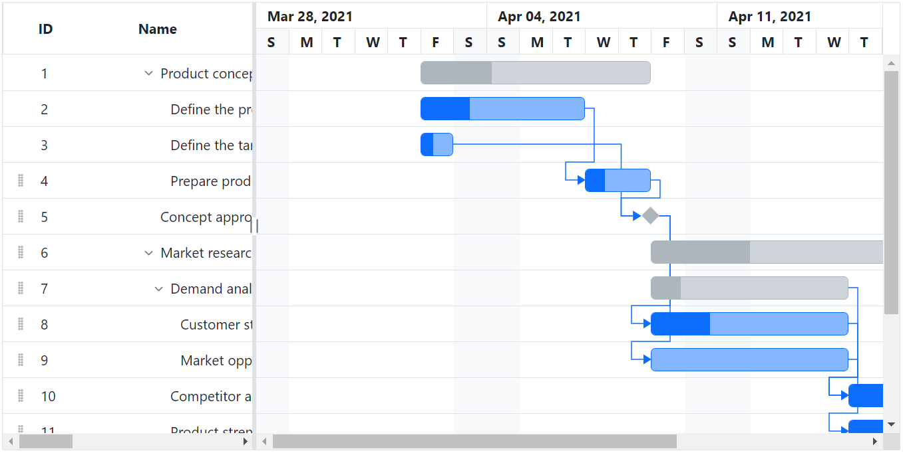

# Row Drag and Drop in Blazor Gantt Chart Component

You can dynamically rearrange the rows in the Gantt Chart component by using the [AllowRowDragAndDrop](https://help.syncfusion.com/cr/blazor/Syncfusion.Blazor.Gantt.SfGantt-1.html#Syncfusion_Blazor_Gantt_SfGantt_1_AllowRowDragAndDrop) property. Using this property, row drag and drop can be enabled or disabled in Gantt. Using this feature, rows can be dropped above and below as a sibling or child to the existing rows.

```cshtml
@using Syncfusion.Blazor.Gantt
<SfGantt DataSource="@TaskCollection" Height="450px" Width="900px" TreeColumnIndex="1" AllowRowDragAndDrop="true">
    <GanttTaskFields Id="TaskId" Name="TaskName" StartDate="StartDate" EndDate="EndDate" Duration="Duration" Progress="Progress"
                     ParentID="ParentId">
    </GanttTaskFields>
</SfGantt>

@code{

    public void Collapsing(Syncfusion.Blazor.TreeGrid.RowCollapsingEventArgs<TaskData> args)
    {
        if (args.Data.TaskId == 1)
        {
            args.Cancel = true;
        }
    }
    public void Expanding(Syncfusion.Blazor.TreeGrid.RowExpandingEventArgs<TaskData> args)
    {
        if (args.Data.TaskId == 5)
        {
            args.Cancel = true;
        }
    }

    private List<TaskData> TaskCollection { get; set; }

    protected override void OnInitialized()
    {
        this.TaskCollection = GetTaskCollection();
    }

    public class TaskData
    {
        public int TaskId { get; set; }
        public string TaskName { get; set; }
        public DateTime StartDate { get; set; }
        public DateTime EndDate { get; set; }
        public string Duration { get; set; }
        public int Progress { get; set; }
        public int? ParentId { get; set; }
    }


    private static List<TaskData> GetTaskCollection()
    {
        List<TaskData> Tasks = new List<TaskData>()
        {
            new TaskData() { TaskId = 1, TaskName = "Project initiation", StartDate = new DateTime(2022, 01, 04), EndDate = new DateTime(2022, 01, 17), },
            new TaskData() { TaskId = 2, TaskName = "Identify Site location", StartDate = new DateTime(2022, 01, 04), Duration = "0", Progress = 30, ParentId = 1, },
            new TaskData() { TaskId = 3, TaskName = "Perform soil test", StartDate = new DateTime(2022, 01, 04), Duration = "4", Progress = 40, ParentId = 1, },
            new TaskData() { TaskId = 4, TaskName = "Soil test approval", StartDate = new DateTime(2022, 01, 04), Duration = "0", Progress = 30, ParentId = 1, },
            new TaskData() { TaskId = 5, TaskName = "Project estimation", StartDate = new DateTime(2022, 01, 04), EndDate = new DateTime(2022, 01, 17), },
            new TaskData() { TaskId = 6, TaskName = "Develop floor plan for estimation", StartDate = new DateTime(2022, 01, 06), Duration = "3", Progress = 30, ParentId = 5, },
            new TaskData() { TaskId = 7, TaskName = "List materials", StartDate = new DateTime(2022, 01, 06), Duration = "3", Progress = 40, ParentId = 5, },
            new TaskData() { TaskId = 8, TaskName = "Estimation approval", StartDate = new DateTime(2022, 01, 06), Duration = "0", Progress = 30, ParentId = 5, }
        };
        return Tasks;
    }
}
```

## Multiple row drag and drop

Gantt also supports dragging multiple rows at a time and dropping them on any rows above, below, or at child positions. In Gantt, you can enable the multiple drag and drop by setting the [GanttSelectionSettings.Type](https://help.syncfusion.com/cr/blazor/Syncfusion.Blazor.Gantt.GanttSelectionSettings.html) to `Multiple` and you should enable the [AllowRowDragAndDrop](https://help.syncfusion.com/cr/blazor/Syncfusion.Blazor.Gantt.SfGantt-1.html#Syncfusion_Blazor_Gantt_SfGantt_1_AllowRowDragAndDrop) property.

```cshtml
@using Syncfusion.Blazor.Gantt
<SfGantt DataSource="@TaskCollection" Height="450px" Width="900px" TreeColumnIndex="1" AllowRowDragAndDrop="true">
    <GanttTaskFields Id="TaskId" Name="TaskName" StartDate="StartDate" EndDate="EndDate" Duration="Duration" Progress="Progress"
                     ParentID="ParentId">
    </GanttTaskFields>
    <GanttSelectionSettings Type="Syncfusion.Blazor.Grids.SelectionType.Multiple"></GanttSelectionSettings>
</SfGantt>

@code{

    public void Collapsing(Syncfusion.Blazor.TreeGrid.RowCollapsingEventArgs<TaskData> args)
    {
        if (args.Data.TaskId == 1)
        {
            args.Cancel = true;
        }
    }
    public void Expanding(Syncfusion.Blazor.TreeGrid.RowExpandingEventArgs<TaskData> args)
    {
        if (args.Data.TaskId == 5)
        {
            args.Cancel = true;
        }
    }

    private List<TaskData> TaskCollection { get; set; }

    protected override void OnInitialized()
    {
        this.TaskCollection = GetTaskCollection();
    }

    public class TaskData
    {
        public int TaskId { get; set; }
        public string TaskName { get; set; }
        public DateTime StartDate { get; set; }
        public DateTime EndDate { get; set; }
        public string Duration { get; set; }
        public int Progress { get; set; }
        public int? ParentId { get; set; }
    }


    private static List<TaskData> GetTaskCollection()
    {
        List<TaskData> Tasks = new List<TaskData>()
        {
            new TaskData() { TaskId = 1, TaskName = "Project initiation", StartDate = new DateTime(2022, 01, 04), EndDate = new DateTime(2022, 01, 17), },
            new TaskData() { TaskId = 2, TaskName = "Identify Site location", StartDate = new DateTime(2022, 01, 04), Duration = "0", Progress = 30, ParentId = 1, },
            new TaskData() { TaskId = 3, TaskName = "Perform soil test", StartDate = new DateTime(2022, 01, 04), Duration = "4", Progress = 40, ParentId = 1, },
            new TaskData() { TaskId = 4, TaskName = "Soil test approval", StartDate = new DateTime(2022, 01, 04), Duration = "0", Progress = 30, ParentId = 1, },
            new TaskData() { TaskId = 5, TaskName = "Project estimation", StartDate = new DateTime(2022, 01, 04), EndDate = new DateTime(2022, 01, 17), },
            new TaskData() { TaskId = 6, TaskName = "Develop floor plan for estimation", StartDate = new DateTime(2022, 01, 06), Duration = "3", Progress = 30, ParentId = 5, },
            new TaskData() { TaskId = 7, TaskName = "List materials", StartDate = new DateTime(2022, 01, 06), Duration = "3", Progress = 40, ParentId = 5, },
            new TaskData() { TaskId = 8, TaskName = "Estimation approval", StartDate = new DateTime(2022, 01, 06), Duration = "0", Progress = 30, ParentId = 5, }
        };
        return Tasks;
    }
}
```

## Drag and drop events

Several events are available to customize the row drag and drop action. The following table explains about the available events and their details.

Event Name |Description
-----|-----
`OnRowDragStart`  |Triggers when drag action starts in Gantt.
`RowDropped`  |Triggers when a drag row was dropped on the target row.

<!-- Customize row drag and drop action

In Gantt, the `OnRowDragStart` and `RowDropped` events are triggered on row drag and drop action. Using this event, you can prevent dragging of particular record, validate the drop position, and cancel the drop action based on the target record and dragged record. The following topics explains about this.

 Prevent dragging of particular record

You can prevent drag action of the particular record by setting the `Cancel` property to `true`, which is available in the `OnRowDragStart` event argument based on our requirement. In the following sample, drag action was restricted for first parent record and its child records.

```cshtml
@using Syncfusion.Blazor.Gantt
<SfGantt DataSource="@TaskCollection" Height="450px" Width="900px" TreeColumnIndex="1" AllowRowDragAndDrop="true">
    <GanttTaskFields Id="TaskId" Name="TaskName" StartDate="StartDate" EndDate="EndDate" Duration="Duration" Progress="Progress"
            ParentID="ParentId">
    </GanttTaskFields>
    <GanttEvents OnRowDragStart="rowDrag" TValue="TaskData"></GanttEvents>
</SfGantt>

@code{
    public List<TaskData> TaskCollection { get; set; }
    protected override void OnInitialized()
    {
        this.TaskCollection = GetTaskCollection();
    }
    public void rowDrag(RowDragEventArgs<TaskData> args) {
        if(args.Data[0].TaskId == 4) {
            args.Cancel = true;
        }
    }
    public class TaskData
    {
        public int TaskId { get; set; }
        public string TaskName { get; set; }
        public DateTime StartDate { get; set; }
        public DateTime EndDate { get; set; }
        public string Duration { get; set; }
        public int Progress { get; set; }
        public int? ParentId { get; set; }
    }
    public static List <TaskData> GetTaskCollection() {
        List <TaskData> Tasks = new List <TaskData> () {
            new TaskData() {
                TaskId = 1,
                TaskName = "Project initiation",
                StartDate = new DateTime(2019, 03, 28),
                EndDate = new DateTime(2019, 07, 28),
                Duration="4"
            },
            new TaskData() {
                TaskId = 2,
                TaskName = "Identify Site location",
                StartDate = new DateTime(2019, 03, 29),
                Progress = 30,
                ParentId = 1,
                Duration="2",
            },
            new TaskData() {
                TaskId = 3,
                TaskName = "Perform soil test",
                StartDate = new DateTime(2019, 03, 29),
                ParentId = 1,
                Duration="4"
            },
            new TaskData() {
                TaskId = 4,
                TaskName = "Soil test approval",
                StartDate = new DateTime(2019, 03, 29),
                Duration = "4",
                Progress = 30,
                ParentId = 1
            },
            new TaskData() {
                TaskId = 5,
                TaskName = "Project estimation",
                StartDate = new DateTime(2019, 03, 29),
                EndDate = new DateTime(2019, 04, 2),
                Duration="4",
            },
            new TaskData() {
                TaskId = 6,
                TaskName = "Develop floor plan for estimation",
                StartDate = new DateTime(2019, 03, 29),
                Duration = "3",
                Progress = 30,
                ParentId = 5
            },
            new TaskData() {
                TaskId = 7,
                TaskName = "List materials",
                StartDate = new DateTime(2019, 04, 01),
                Duration = "3",
                Progress = 30,
                ParentId = 5
            },
            new TaskData() {
                TaskId = 8,
                TaskName = "Estimation approval",
                StartDate = new DateTime(2019, 04, 01),
                Duration = "2",
                ParentId = 5
            }
        };
        return Tasks;
    }
}
``` -->

## Perform row drag and drop action programmatically

Gantt provides option to perform row drag and drop action programmatically by using the [ReorderRowsAsync](https://help.syncfusion.com/cr/blazor/Syncfusion.Blazor.Gantt.SfGantt-1.html#Syncfusion_Blazor_Gantt_SfGantt_1_ReorderRowAsync_System_Double_System_Double_System_String_) method. This method can be used for any external actions like button click.
The following arguments are used to specify the positions to drag and drop a row:

* `FromIndexes`: Index value of source(dragging) row.
* `ToIndex`: Value of target index.
* `Position`: Drop positions such as above, below, or child.

The following code example shows how to drag and drop a row on button click action.

```cshtml
@using Syncfusion.Blazor.Gantt
<button @onclick="drag">Dynamic drag and drop</button>
<SfGantt @ref="Gantt" DataSource="@TaskCollection" Height="450px" Width="900px" TreeColumnIndex="1" AllowRowDragAndDrop="true">
    <GanttTaskFields Id="TaskId" Name="TaskName" StartDate="StartDate" EndDate="EndDate" Duration="Duration" Progress="Progress"
                     ParentID="ParentId">
    </GanttTaskFields>
</SfGantt>

@code{
    public SfGantt<TaskData> Gantt;
    private List<TaskData> TaskCollection { get; set; }
    protected override void OnInitialized()
    {
        this.TaskCollection = GetTaskCollection();
    }
    public void drag()
    {
        this.Gantt.ReorderRowAsync(2, 6, "Below");
    }
    public class TaskData
    {
        public int TaskId { get; set; }
        public string TaskName { get; set; }
        public DateTime StartDate { get; set; }
        public DateTime EndDate { get; set; }
        public string Duration { get; set; }
        public int Progress { get; set; }
        public int? ParentId { get; set; }
    }

    private static List<TaskData> GetTaskCollection()
    {
        List<TaskData> Tasks = new List<TaskData>()
        {
            new TaskData() { TaskId = 1, TaskName = "Project initiation", StartDate = new DateTime(2022, 01, 04), EndDate = new DateTime(2022, 01, 17), },
            new TaskData() { TaskId = 2, TaskName = "Identify Site location", StartDate = new DateTime(2022, 01, 04), Duration = "0", Progress = 30, ParentId = 1, },
            new TaskData() { TaskId = 3, TaskName = "Perform soil test", StartDate = new DateTime(2022, 01, 04), Duration = "4", Progress = 40, ParentId = 1, },
            new TaskData() { TaskId = 4, TaskName = "Soil test approval", StartDate = new DateTime(2022, 01, 04), Duration = "0", Progress = 30, ParentId = 1, },
            new TaskData() { TaskId = 5, TaskName = "Project estimation", StartDate = new DateTime(2022, 01, 04), EndDate = new DateTime(2022, 01, 17), },
            new TaskData() { TaskId = 6, TaskName = "Develop floor plan for estimation", StartDate = new DateTime(2022, 01, 06), Duration = "3", Progress = 30, ParentId = 5, },
            new TaskData() { TaskId = 7, TaskName = "List materials", StartDate = new DateTime(2022, 01, 06), Duration = "3", Progress = 40, ParentId = 5, },
            new TaskData() { TaskId = 8, TaskName = "Estimation approval", StartDate = new DateTime(2022, 01, 06), Duration = "0", Progress = 30, ParentId = 5, }
        };
        return Tasks;
    }
}
```

## Dynamically hide row drag and drop icons

By default, Gantt Chart renders all records with a row drag and drop icon. This can be dynamically modified to hide the row drag and drop icon based on specific conditions using the [`RowDataBound`](https://blazor.syncfusion.com/documentation/gantt-chart/events#rowdatabound) event.

**Step 1**:

You can dynamically hide the row drag and drop icon based on specific conditions using `RowDataBound` event handling. Here's how you can achieve this:

```csharp

private async void RowDataBoundHandler(Syncfusion.Blazor.Grids.RowDataBoundEventArgs<TaskData> args)
{
    if (args.Data.TaskId >= 1 && args.Data.TaskId <= 3)
    {
        args.Row.AddClass(new string[] { "e-notdraggable" });
    }
}

```

**Step 2**:

To visually hide the row drag and drop icon, you can apply CSS styles:

```html

<style>
    .e-gantt .e-notdraggable .e-rowcelldrag {
        display: none;
    }
    .e-gantt .e-notdraggable .e-rowdragdrop {
        pointer-events: none;
    }
</style>

```

The following code snippet dynamically row hide drag and drop icons in a Gantt Chart control.

```cshtml
@using Syncfusion.Blazor.Gantt
<SfGantt @ref="Gantt" DataSource="@TaskCollection" Height="450px" Width="900px" HighlightWeekends="true"
          TreeColumnIndex="1" AllowRowDragAndDrop="true">
    <GanttTaskFields Id="TaskId" Name="TaskName" StartDate="StartDate" EndDate="EndDate" Duration="Duration" Progress="Progress"
         ParentID="ParentId" Dependency="Predecessor"></GanttTaskFields>
    <GanttEvents RowDataBound="RowDataBoundHandler" TValue="TaskData"></GanttEvents>
</SfGantt>
   
<style>
    .e-gantt .e-notdraggable .e-rowcelldrag {
        display: none;
    }
    .e-gantt .e-notdraggable .e-rowdragdrop {
        pointer-events: none;
    }
</style>
@code {
    SfGantt<TaskData> Gantt;
    private List<TaskData> TaskCollection { get; set; }
    
    private async void RowDataBoundHandler(Syncfusion.Blazor.Grids.RowDataBoundEventArgs<TaskData> args)
    {
        if (args.Data.TaskId >= 1 && args.Data.TaskId <= 3)
        {
            args.Row.AddClass(new string[] { "e-notdraggable" });
        }
    }
    protected override void OnInitialized()
    {
        this.TaskCollection = ProjectNewData();
    }
    public class TaskData
    {
        public int TaskId { get; set; }
        public string TaskName { get; set; }
        public DateTime? StartDate { get; set; }
        public DateTime? EndDate { get; set; }
        public string Duration { get; set; }
        public int Progress { get; set; }
        public string Predecessor { get; set; }
        public int? ParentId { get; set; }
    }
    public static List<TaskData> ProjectNewData()
    {
        List<TaskData> Tasks = new List<TaskData>() 
        {
            new TaskData() { TaskId = 1, TaskName = "Product concept ", StartDate = new DateTime(2021, 04, 02), EndDate = new DateTime(2021, 04, 08), Duration = "5days" },
            new TaskData() { TaskId = 2, TaskName = "Define the product usage", StartDate = new DateTime(2021, 04, 02), EndDate = new DateTime(2021, 04, 08), Duration = "3", Progress = 30, ParentId = 1 },
            new TaskData() { TaskId = 3, TaskName = "Define the target audience", EndDate = new DateTime(2021, 04, 04), Progress = 40, ParentId = 1 },
            new TaskData() { TaskId = 4, TaskName = "Prepare product sketch and notes", StartDate = new DateTime(2021, 04, 05), Duration = "2", Progress = 30, ParentId = 1, Predecessor="2" },
            new TaskData() { TaskId = 5, TaskName = "Concept approval", StartDate = new DateTime(2021, 04, 08), EndDate = new DateTime(2021, 04, 08), Duration="0", Predecessor="3,4" },
            new TaskData() { TaskId = 6, TaskName = "Market research", StartDate = new DateTime(2021, 04, 09), EndDate = new DateTime(2021, 04, 18), Duration = "4", Progress = 30 },
            new TaskData() { TaskId = 7, TaskName = "Demand analysis", Duration = "4", Progress = 40, ParentId = 6 },
            new TaskData() { TaskId = 8, TaskName = "Customer strength", StartDate = new DateTime(2021, 04, 09), EndDate = new DateTime(2021, 04, 12), Duration = "4", Progress = 30, ParentId = 7, Predecessor="5", },
            new TaskData() { TaskId = 9, TaskName = "Market opportunity analysis", StartDate = new DateTime(2021, 04, 09), EndDate = new DateTime(2021, 04, 012), Duration="4", ParentId= 7, Predecessor="5" },
            new TaskData() { TaskId = 10, TaskName = "Competitor analysis", StartDate = new DateTime(2021, 04, 15), EndDate = new DateTime(2021, 04, 18), Duration = "4", Progress = 30, ParentId= 6, Predecessor="7,8" },
            new TaskData() { TaskId = 11, TaskName = "Product strength analysis", StartDate = new DateTime(2021, 04, 15), EndDate = new DateTime(2021, 04, 18), Duration = "4", Progress = 40, ParentId = 6, Predecessor="9" },
            new TaskData() { TaskId = 12, TaskName = "Research completed", StartDate = new DateTime(2021, 04, 18), EndDate = new DateTime(2021, 04, 18), Duration = "0", Progress = 30, ParentId = 6, Predecessor="10" },
            new TaskData() { TaskId = 13, TaskName = "Product design and development", StartDate = new DateTime(2021, 04, 19), EndDate = new DateTime(2021, 05, 16), Duration="20" },
            new TaskData() { TaskId = 14, TaskName = "Functionality design", StartDate = new DateTime(2021, 04, 19), EndDate = new DateTime(2021, 04, 23), Duration = "3", Progress = 30, ParentId = 13, Predecessor="12" },
            new TaskData() { TaskId = 15, TaskName = "Quality design", StartDate = new DateTime(2021, 04, 19), EndDate = new DateTime(2021, 04, 23), Duration = "3", Progress = 40, ParentId = 13, Predecessor="12" }
        };
        return Tasks;
    }
}
```

The following screenshot shows the output of the above code snippet.

