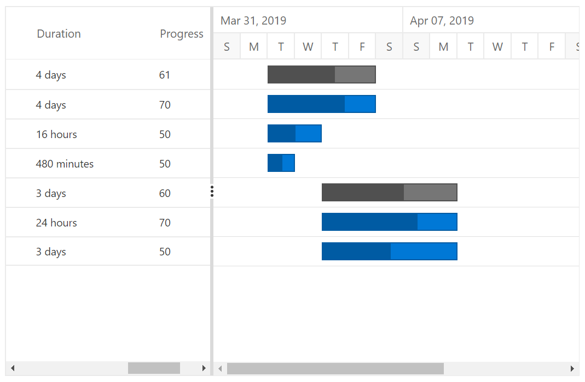

# Duration Unit in Blazor Gantt Chart Component

In Gantt Chart, the tasks’ duration value can be measured by the following duration units,

* Day
* Hour
* Minute

In Gantt Chart, we can define duration unit for whole project by using `GanttTaskFields.DurationUnit` property, when we defines the value for this property, this unit will be applied for all task which don't has duration unit value.
And each task in the project can be defined with different duration units and the duration unit of a task can be defined by the following ways,

* Using `GanttTaskFields.DurationUnit` property, to map the duration unit data source field.
* Defining the duration unit value along with the duration field in the data source.

## Mapping the Duration Unit Field

The below code snippet explains the mapping of duration unit data source field to the Gantt Chart component using the `GanttTaskFields.DurationUnit` property.

```cshtml
@using Syncfusion.Blazor.Gantt
<SfGantt DataSource="@TaskCollection" Height="450px" Width="700px">
    <GanttTaskFields Id="TaskId" Name="TaskName" StartDate="StartDate" EndDate="EndDate"
              Duration="Duration" DurationUnit="DurationUnit" Progress="Progress" Child="SubTasks">
    </GanttTaskFields>
</SfGantt>

@code{
    public List<TaskData> TaskCollection { get; set; }
    protected override void OnInitialized()
    {
        this.TaskCollection = GetTaskCollection();
    }

    public class TaskData
    {
        public int TaskId { get; set; }
        public string TaskName { get; set; }
        public DateTime StartDate { get; set; }
        public DateTime EndDate { get; set; }
        public string Duration { get; set; }
        public int Progress { get; set; }
        public string DurationUnit { get; set; }
        public List<TaskData> SubTasks { get; set; }
    }

    public static List <TaskData> GetTaskCollection() {
    List <TaskData> Tasks = new List <TaskData> () {
        new TaskData() {
            TaskId = 1,
            TaskName = "Project initiation",
            StartDate = new DateTime(2019, 04, 02),
            EndDate = new DateTime(2019, 04, 21),
            SubTasks = (new List <TaskData> () {
                new TaskData() {
                    TaskId = 2,
                    TaskName = "Identify site location",
                    StartDate = new DateTime(2019, 04, 02),
                    Duration = "4",
                    Progress = 70,
                    DurationUnit = "day"
                },
                new TaskData() {
                    TaskId = 3,
                    TaskName = "Perform soil test",
                    StartDate = new DateTime(2019, 04, 02),
                    Duration = "16",
                    Progress = 50,
                    DurationUnit = "hour"
                },
                new TaskData() {
                    TaskId = 4,
                    TaskName = "Soil test approval",
                    StartDate = new DateTime(2019, 04, 02),
                    Duration = "480",
                    Progress = 50,
                    DurationUnit = "minute"
                },
            })
        },
        new TaskData() {
            TaskId = 5,
            TaskName = "Project estimation",
            StartDate = new DateTime(2019, 04, 02),
            EndDate = new DateTime(2019, 04, 21),
            SubTasks = (new List <TaskData> () {
                new TaskData() {
                    TaskId = 6,
                    TaskName = "Develop floor plan for estimation",
                    StartDate = new DateTime(2019, 04, 04),
                    Duration = "24",
                    Progress = 70,
                    DurationUnit = "hour"
                },
                new TaskData() {
                    TaskId = 7,
                    TaskName = "List materials",
                    StartDate = new DateTime(2019, 04, 04),
                    Duration = "3",
                    Progress = 50,
                    DurationUnit = "day"
                },
            })
        }
    };

    return Tasks;
}
}
```



> NOTE
The default value of the `DurationUnit` property is `day`.

## Defining Duration Unit along With Duration Field

Duration units for the tasks can also be defined along with the duration values, the below code snippet explains the duration unit for a task along with duration value,

```cshtml
@using Syncfusion.Blazor.Gantt
<SfGantt DataSource="@TaskCollection" Height="450px" Width="700px">
    <GanttTaskFields Id="TaskId" Name="TaskName" StartDate="StartDate" EndDate="EndDate"
            Duration="Duration" Progress="Progress" Child="SubTasks">
    </GanttTaskFields>
</SfGantt>

@code{
    public List<TaskData> TaskCollection { get; set; }
    protected override void OnInitialized()
    {
        this.TaskCollection = GetTaskCollection();
    }

    public class TaskData
    {
        public int TaskId { get; set; }
        public string TaskName { get; set; }
        public DateTime StartDate { get; set; }
        public DateTime EndDate { get; set; }
        public string Duration { get; set; }
        public int Progress { get; set; }
        public List<TaskData> SubTasks { get; set; }
    }

    public static List <TaskData> GetTaskCollection() {
    List <TaskData> Tasks = new List <TaskData> () {
        new TaskData() {
            TaskId = 1,
            TaskName = "Project initiation",
            StartDate = new DateTime(2019, 04, 02),
            EndDate = new DateTime(2019, 04, 21),
            SubTasks = (new List <TaskData> () {
                new TaskData() {
                    TaskId = 2,
                    TaskName = "Identify site location",
                    StartDate = new DateTime(2019, 04, 02),
                    Duration = "3days",
                    Progress = 70,
                },
                new TaskData() {
                    TaskId = 3,
                    TaskName = "Perform soil test",
                    StartDate = new DateTime(2019, 04, 02),
                    Duration = "12hours",
                    Progress = 50
                },
                new TaskData() {
                    TaskId = 4,
                    TaskName = "Soil test approval",
                    StartDate = new DateTime(2019, 04, 02),
                    Duration = "1800minutes",
                    Progress = 50
                },
            })
        },
        new TaskData() {
            TaskId = 5,
            TaskName = "Project estimation",
            StartDate = new DateTime(2019, 04, 02),
            EndDate = new DateTime(2019, 04, 21),
            SubTasks = (new List <TaskData> () {
                new TaskData() {
                    TaskId = 6,
                    TaskName = "Develop floor plan for estimation",
                    StartDate = new DateTime(2019, 04, 04),
                    Duration = "480minutes",
                    Progress = 70
                },
                new TaskData() {
                    TaskId = 7,
                    TaskName = "List materials",
                    StartDate = new DateTime(2019, 04, 04),
                    Duration = "3days",
                    Progress = 50
                },
            })
        }
    };

    return Tasks;
}
}
```


>NOTE:
The edit type of the duration column in Gantt Chart is string, to support editing the duration field along with duration units.
 >`Note:` You can refer to our [Blazor Gantt Chart](https://www.syncfusion.com/blazor-components/blazor-gantt-chart) feature tour page for its groundbreaking feature representations. You can also explore our [`Blazor Gantt Chart`](https://blazor.syncfusion.com/demos/gantt-chart/default-functionalities?theme=bootstrap4) to knows how to render and configure the gantt.