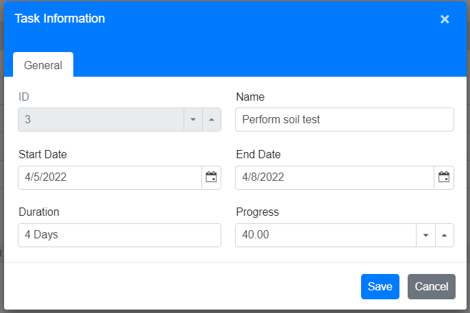
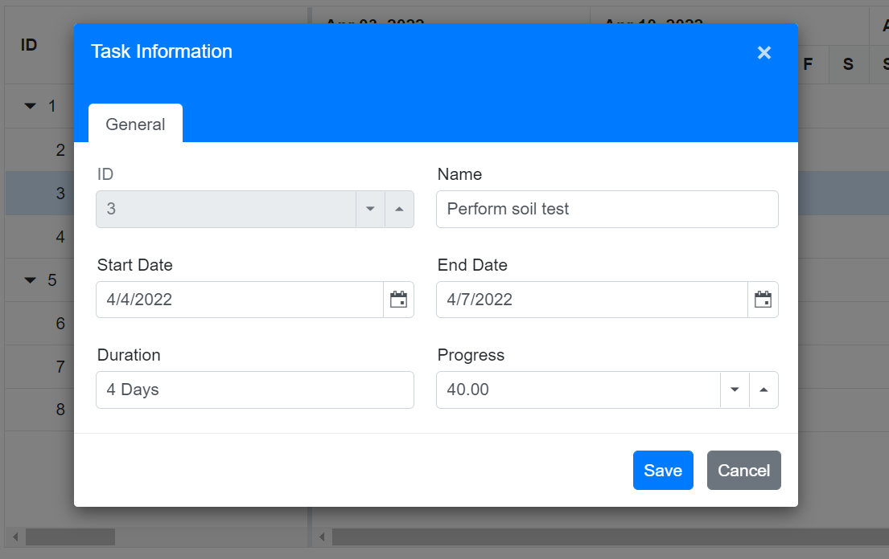
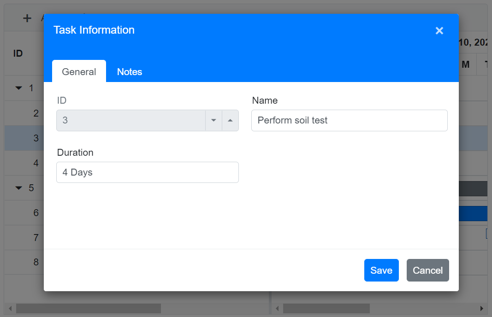
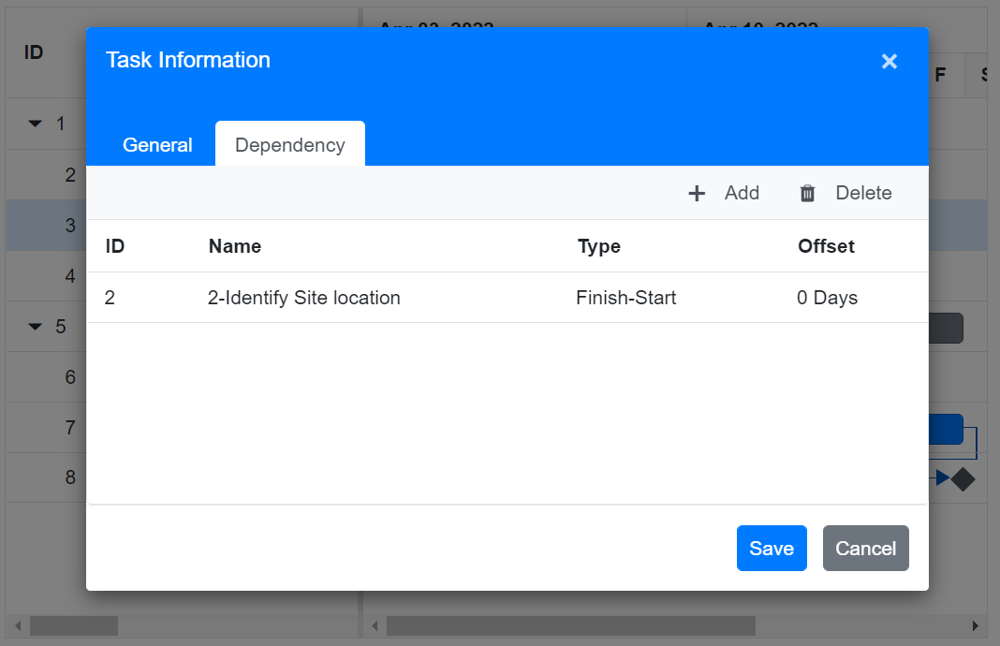
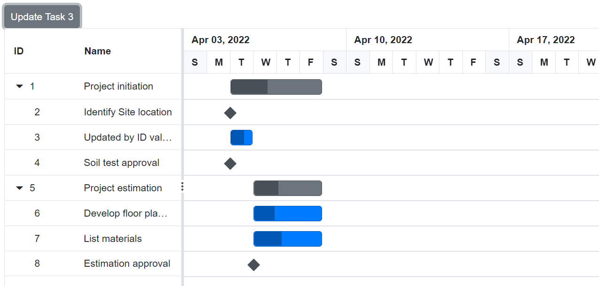

# Editing tasks in Blazor Gantt Chart Component

The editing feature can be enabled in the Gantt Chart component by enabling the [GanttEditSettings.AllowEditing](https://help.syncfusion.com/cr/blazor/Syncfusion.Blazor.Gantt.GanttEditSettings.html#Syncfusion_Blazor_Gantt_GanttEditSettings_AllowEditing) and [GanttEditSettings.AllowTaskbarEditing](https://help.syncfusion.com/cr/blazor/Syncfusion.Blazor.Gantt.GanttEditSettings.html#Syncfusion_Blazor_Gantt_GanttEditSettings_AllowTaskbarEditing) properties.

The following editing options are available to update the tasks in the Gantt chart:
* Cell
* Dialog
* Taskbar

To know more about editing feature in Blazor Gantt chart component, you can check on this video.



## Cell editing

By setting the edit mode to auto using the [GanttEditSettings.Mode](https://help.syncfusion.com/cr/blazor/Syncfusion.Blazor.Gantt.GanttEditSettings.html#Syncfusion_Blazor_Gantt_GanttEditSettings_Mode) property, the tasks can be edited by double-clicking the Tree Grid cells.

The following code example shows you how to enable the cell editing in Gantt Chart component.

```cshtml
@using Syncfusion.Blazor.Gantt
<SfGantt DataSource="@TaskCollection" Height="450px" Width="900px">
    <GanttTaskFields Id="TaskId" Name="TaskName" StartDate="StartDate" EndDate="EndDate" Duration="Duration" Progress="Progress" ParentID="ParentId">
    </GanttTaskFields>
    <GanttEditSettings AllowEditing="true" Mode="EditMode.Auto"></GanttEditSettings>
</SfGantt>

@code{
    private List<TaskData> TaskCollection { get; set; }
    protected override void OnInitialized()
    {
        this.TaskCollection = GetTaskCollection();
    }

    public class TaskData
    {
        public int TaskId { get; set; }
        public string TaskName { get; set; }
        public DateTime StartDate { get; set; }
        public DateTime? EndDate { get; set; }
        public string Duration { get; set; }
        public int Progress { get; set; }
        public int? ParentId { get; set; }
    }

    public static List<TaskData> GetTaskCollection()
    {
        List<TaskData> Tasks = new List<TaskData>()
        {
            new TaskData() { TaskId = 1, TaskName = "Project initiation", StartDate = new DateTime(2022, 04, 05), EndDate = new DateTime(2022, 04, 21), },
            new TaskData() { TaskId = 2, TaskName = "Identify Site location", StartDate = new DateTime(2022, 04, 05), Duration = "0", Progress = 30, ParentId = 1 },
            new TaskData() { TaskId = 3, TaskName = "Perform soil test", StartDate = new DateTime(2022, 04, 05), Duration = "4", Progress = 40, ParentId = 1 },
            new TaskData() { TaskId = 4, TaskName = "Soil test approval", StartDate = new DateTime(2022, 04, 05), Duration = "0", Progress = 30, ParentId = 1 },
            new TaskData() { TaskId = 5, TaskName = "Project estimation", StartDate = new DateTime(2022, 04, 06), EndDate = new DateTime(2022, 04, 21), },
            new TaskData() { TaskId = 6, TaskName = "Develop floor plan for estimation", StartDate = new DateTime(2022, 04, 06), Duration = "3", Progress = 30, ParentId = 5 },
            new TaskData() { TaskId = 7, TaskName = "List materials", StartDate = new DateTime(2022, 04, 06), Duration = "3", Progress = 40, ParentId = 5 },
            new TaskData() { TaskId = 8, TaskName = "Estimation approval", StartDate = new DateTime(2022, 04, 06), Duration = "0", Progress = 30, ParentId = 5 }
        };
        return Tasks;
    }
}
```

N> When the edit mode is set to `Auto`, double-clicking on the Tree Grid side changes the cells to editable mode. Double-clicking on the chart side opens the edit dialog for editing the task details.

double click action on Tree Grid or chart side





## Dialog editing

Modify the task details through the edit dialog by setting the `GanttEditSettings.Mode` as `Dialog`.

```cshtml
@using Syncfusion.Blazor.Gantt
<SfGantt DataSource="@TaskCollection" Height="450px" Width="900px">
    <GanttTaskFields Id="TaskId" Name="TaskName" StartDate="StartDate" EndDate="EndDate" Duration="Duration" Progress="Progress" ParentID="ParentId">
    </GanttTaskFields>
    <GanttEditSettings AllowEditing="true" Mode="Syncfusion.Blazor.Gantt.EditMode.Dialog"></GanttEditSettings>
</SfGantt>

@code{
    private List<TaskData> TaskCollection { get; set; }
    protected override void OnInitialized()
    {
        this.TaskCollection = GetTaskCollection();
    }

    public class TaskData
    {
        public int TaskId { get; set; }
        public string TaskName { get; set; }
        public DateTime StartDate { get; set; }
        public DateTime? EndDate { get; set; }
        public string Duration { get; set; }
        public int Progress { get; set; }
        public int? ParentId { get; set; }
    }

    public static List<TaskData> GetTaskCollection()
    {
        List<TaskData> Tasks = new List<TaskData>()
        {
            new TaskData() { TaskId = 1, TaskName = "Project initiation", StartDate = new DateTime(2022, 04, 05), EndDate = new DateTime(2022, 04, 21), },
            new TaskData() { TaskId = 2, TaskName = "Identify Site location", StartDate = new DateTime(2022, 04, 05), Duration = "0", Progress = 30, ParentId = 1 },
            new TaskData() { TaskId = 3, TaskName = "Perform soil test", StartDate = new DateTime(2022, 04, 05), Duration = "4", Progress = 40, ParentId = 1 },
            new TaskData() { TaskId = 4, TaskName = "Soil test approval", StartDate = new DateTime(2022, 04, 05), Duration = "0", Progress = 30, ParentId = 1 },
            new TaskData() { TaskId = 5, TaskName = "Project estimation", StartDate = new DateTime(2022, 04, 06), EndDate = new DateTime(2022, 04, 21), },
            new TaskData() { TaskId = 6, TaskName = "Develop floor plan for estimation", StartDate = new DateTime(2022, 04, 06), Duration = "3", Progress = 30, ParentId = 5 },
            new TaskData() { TaskId = 7, TaskName = "List materials", StartDate = new DateTime(2022, 04, 06), Duration = "3", Progress = 40, ParentId = 5 },
            new TaskData() { TaskId = 8, TaskName = "Estimation approval", StartDate = new DateTime(2022, 04, 06), Duration = "0", Progress = 30, ParentId = 5 }
        };
        return Tasks;
    }
}
```

N> In dialog editing mode, the edit dialog appears when the Tree Grid or Gantt chart sides are double-clicked.



### Sections or tabs in Dialog

In the Gantt Chart dialog, you can define the required tabs or editing sections using the [GanttAddDialogFields](https://help.syncfusion.com/cr/blazor/Syncfusion.Blazor.Gantt.GanttAddDialogFields.html) and [GanttEditDialogFields](https://help.syncfusion.com/cr/blazor/Syncfusion.Blazor.Gantt.GanttEditDialogFields.html) properties. Every tab is defined using the `GanttAddDialogField.Type` or `GanttEditDialogField.Type` property.

```cshtml
 @using Syncfusion.Blazor.Gantt
<SfGantt DataSource="@TaskCollection" Toolbar="@(new List<string>() { "Add", "Edit" })" Height="450px" Width="700px">
    <GanttTaskFields Id="TaskId" Name="TaskName" StartDate="StartDate" EndDate="EndDate"
                     Duration="Duration" Progress="Progress" ParentID="ParentId" Notes="Notes"
                     Dependency="Predecessor">
    </GanttTaskFields>
    <GanttResource DataSource="ResourceCollection" Id="Id" Name="Name" TValue="TaskInfoModel" TResources="ResourceInfoModel"></GanttResource>
    <GanttAssignmentFields DataSource="AssignmentCollection" PrimaryKey="PrimaryId" TaskID="TaskId" ResourceID="ResourceId" TValue="TaskInfoModel" TAssignment="AssignmentModel">
    </GanttAssignmentFields>
    <GanttEditSettings AllowAdding="true" AllowEditing="true" Mode="Syncfusion.Blazor.Gantt.EditMode.Dialog">
    </GanttEditSettings>
    <GanttEditDialogFields>
        <GanttEditDialogField Type="GanttDialogFieldType.General" HeaderText="General">
        </GanttEditDialogField>
        <GanttEditDialogField Type="GanttDialogFieldType.Dependency"></GanttEditDialogField>
        <GanttEditDialogField Type="GanttDialogFieldType.Resources"></GanttEditDialogField>
        <GanttEditDialogField Type="GanttDialogFieldType.Notes"></GanttEditDialogField>
    </GanttEditDialogFields>
    <GanttAddDialogFields>
        <GanttAddDialogField Type="GanttDialogFieldType.General" HeaderText="General Tab"></GanttAddDialogField>
        <GanttAddDialogField Type="GanttDialogFieldType.Dependency"></GanttAddDialogField>
    </GanttAddDialogFields>
</SfGantt>

@code {
    private List<TaskInfoModel> TaskCollection { get; set; }
    private List<ResourceInfoModel> ResourceCollection { get; set; }
    private static List<AssignmentModel> AssignmentCollection { get; set; } = new();
    protected override void OnInitialized()
    {
        TaskCollection = GetTaskCollection();
        ResourceCollection = GetResourceCollections();
        AssignmentCollection = GetAssignmentCollection();
    }

    public class TaskInfoModel
    {
        public int TaskId { get; set; }
        public string TaskName { get; set; }
        public DateTime StartDate { get; set; }
        public DateTime? EndDate { get; set; }
        public string Duration { get; set; }
        public int Progress { get; set; }
        public int? ParentId { get; set; }
        public string Notes { get; set; }
        public string Predecessor { get; set; }
    }
    public class ResourceInfoModel
    {
        public int Id { get; set; }
        public string? Name { get; set; }
    }
    public class AssignmentModel
    {
        public int PrimaryId { get; set; }
        public int TaskId { get; set; }
        public int ResourceId { get; set; }
    }

    public static List<ResourceInfoModel> GetResourceCollections()
    {
        List<ResourceInfoModel> Resources = new List<ResourceInfoModel>() {
        new ResourceInfoModel() { Id = 1, Name = "Martin Tamer" },
        new ResourceInfoModel() { Id = 2, Name = "Rose Fuller" },
        new ResourceInfoModel() { Id = 3, Name = "Margaret Buchanan" },
        new ResourceInfoModel() { Id = 4, Name = "Fuller King" },
        new ResourceInfoModel() { Id= 5, Name= "Davolio Fuller" },
        };
        return Resources;
    }

    public static List<AssignmentModel> GetAssignmentCollection()
    {
        List<AssignmentModel> assignments = new List<AssignmentModel>()
        {
            new AssignmentModel(){ PrimaryId=1, TaskId = 2, ResourceId=1},
            new AssignmentModel(){ PrimaryId=2, TaskId = 3, ResourceId=2},
            new AssignmentModel(){ PrimaryId=3, TaskId = 3, ResourceId=3},
            new AssignmentModel(){ PrimaryId=4, TaskId = 6, ResourceId=4},
            new AssignmentModel(){ PrimaryId=5, TaskId = 8, ResourceId=1},
            new AssignmentModel(){ PrimaryId=6, TaskId = 8, ResourceId=5}
        };
        return assignments;
    }

    public static List<TaskInfoModel> GetTaskCollection()
    {
        List<TaskInfoModel> Tasks = new List<TaskInfoModel>()
        {
            new TaskInfoModel() { TaskId = 1, TaskName = "Project initiation", StartDate = new DateTime(2022, 04, 05), EndDate = new DateTime(2022, 04, 21), },
            new TaskInfoModel() { TaskId = 2, TaskName = "Identify Site location", StartDate = new DateTime(2022, 04, 05), Duration = "0", Progress = 30, Notes = "Measure the total property area alloted for construction", ParentId = 1 },
            new TaskInfoModel() { TaskId = 3, TaskName = "Perform soil test", StartDate = new DateTime(2022, 04, 05), Duration = "4", Predecessor = "2", Notes = "Obtain an engineered soil test of a plot where construction is planned from an engineer or company specializing in soil testing", ParentId = 1 },
            new TaskInfoModel() { TaskId = 4, TaskName = "Soil test approval", StartDate = new DateTime(2022, 04, 05), Duration = "0", Progress = 30, Predecessor = "3", ParentId = 1 },
            new TaskInfoModel() { TaskId = 5, TaskName = "Project estimation", StartDate = new DateTime(2022, 04, 06), EndDate = new DateTime(2022, 04, 21), },
            new TaskInfoModel() { TaskId = 6, TaskName = "Develop floor plan for estimation", StartDate = new DateTime(2022, 04, 06), Duration = "3", Progress = 30, Predecessor = "4", Notes = "Develop floor plans and obtain a materials list for estimations", ParentId = 5 },
            new TaskInfoModel() { TaskId = 7, TaskName = "List materials", StartDate = new DateTime(2022, 04, 06), Duration = "3", Predecessor = "6", Notes = "", ParentId = 5 },
            new TaskInfoModel() { TaskId = 8, TaskName = "Estimation approval", StartDate = new DateTime(2022, 04, 06), Duration = "0", Predecessor = "7", Notes = "", ParentId = 5 }
        };
        return Tasks;
    }
}
```

Tabs in Edit or Add Dialog


<!--  -->

### Limiting data fields in general tab

In the Gantt Chart dialog, you can make only specific data source fields visible for editing by using the `GanttAddDialogFields` and `GanttEditDialogFields` properties. The data fields are defined with `GanttEditDialogField.Type` and `GanttEditDialogField.Fields` properties.

`Note:` You can also define the custom fields in the add/edit dialog General tab using the `Fields` property.

```cshtml
 @using Syncfusion.Blazor.Gantt
<SfGantt DataSource="@TaskCollection" Toolbar="@(new List<string>() { "Add", "Edit" })" Height="450px" Width="700px">
    <GanttTaskFields Id="TaskId" Name="TaskName" StartDate="StartDate" EndDate="EndDate"
                     Duration="Duration" Progress="Progress" ParentID="ParentId" Notes="Notes"
                     Dependency="Predecessor">
    </GanttTaskFields>
    <GanttEditSettings AllowAdding="true" AllowEditing="true" Mode="Syncfusion.Blazor.Gantt.EditMode.Dialog">
    </GanttEditSettings>
    <GanttColumns>
        <GanttColumn Field="TaskId" Width="100"></GanttColumn>
        <GanttColumn Field="TaskName"></GanttColumn>
        <GanttColumn Field="StartDate"></GanttColumn>
        <GanttColumn Field="Duration"></GanttColumn>
        <GanttColumn Field="Progress"></GanttColumn>
    </GanttColumns>
    <GanttEditDialogFields>
        <GanttEditDialogField Type="GanttDialogFieldType.General" HeaderText="General"
                              Fields="@(new string[]{ "TaskId", "TaskName", "Duration" })"></GanttEditDialogField>
        <GanttEditDialogField Type="GanttDialogFieldType.Notes"></GanttEditDialogField>
    </GanttEditDialogFields>
    <GanttAddDialogFields>
        <GanttAddDialogField Type="GanttDialogFieldType.General" HeaderText="General Tab"
                             Fields="@(new string[]{ "TaskId", "TaskName", "Duration" })"></GanttAddDialogField>
        <GanttAddDialogField Type="GanttDialogFieldType.Dependency"></GanttAddDialogField>
    </GanttAddDialogFields>
</SfGantt>

@code {
    private List<TaskInfoModel> TaskCollection { get; set; }
    protected override void OnInitialized()
    {
        TaskCollection = GetTaskCollection();
    }

    public class TaskInfoModel
    {
        public int TaskId { get; set; }
        public string TaskName { get; set; }
        public DateTime StartDate { get; set; }
        public DateTime? EndDate { get; set; }
        public string Duration { get; set; }
        public int Progress { get; set; }
        public int? ParentId { get; set; }
        public string Notes { get; set; }
        public string Predecessor { get; set; }
    }
    
    public static List<TaskInfoModel> GetTaskCollection()
    {
        List<TaskInfoModel> Tasks = new List<TaskInfoModel>()
        {
            new TaskInfoModel() { TaskId = 1, TaskName = "Project initiation", StartDate = new DateTime(2022, 04, 05), EndDate = new DateTime(2022, 04, 21), },
            new TaskInfoModel() { TaskId = 2, TaskName = "Identify Site location", StartDate = new DateTime(2022, 04, 05), Duration = "0", Progress = 30, Notes = "Measure the total property area alloted for construction", ParentId = 1 },
            new TaskInfoModel() { TaskId = 3, TaskName = "Perform soil test", StartDate = new DateTime(2022, 04, 05), Duration = "4", Predecessor = "2", Notes = "Obtain an engineered soil test of a plot where construction is planned from an engineer or company specializing in soil testing", ParentId = 1 },
            new TaskInfoModel() { TaskId = 4, TaskName = "Soil test approval", StartDate = new DateTime(2022, 04, 05), Duration = "0", Progress = 30, Predecessor = "3", ParentId = 1 },
            new TaskInfoModel() { TaskId = 5, TaskName = "Project estimation", StartDate = new DateTime(2022, 04, 06), EndDate = new DateTime(2022, 04, 21), },
            new TaskInfoModel() { TaskId = 6, TaskName = "Develop floor plan for estimation", StartDate = new DateTime(2022, 04, 06), Duration = "3", Progress = 30, Predecessor = "4", Notes = "Develop floor plans and obtain a materials list for estimations", ParentId = 5 },
            new TaskInfoModel() { TaskId = 7, TaskName = "List materials", StartDate = new DateTime(2022, 04, 06), Duration = "3", Predecessor = "6", Notes = "", ParentId = 5 },
            new TaskInfoModel() { TaskId = 8, TaskName = "Estimation approval", StartDate = new DateTime(2022, 04, 06), Duration = "0", Predecessor = "7", Notes = "", ParentId = 5 }
        };
        return Tasks;
    }
}
```

The following screenshot show the output of above code example.




## Task dependencies

In the Gantt Chart component, you can update the dependencies between tasks and link the tasks interactively. The task dependencies can be mapped from the data source using the [GanttTaskFields.Dependency](https://help.syncfusion.com/cr/blazor/Syncfusion.Blazor.Gantt.GanttTaskFields.html#Syncfusion_Blazor_Gantt_GanttTaskFields_Dependency) property.

You can update the task dependencies using the following ways:

* Edit dialog: Create or remove the task dependencies using the `Dependency` tab in the edit dialog.
* Cell editing: Create or remove the task links using cell editing.

The following code example demonstrates how to enable task dependency editing in the Gantt chart using the `EditSettings` property.

```cshtml
@using Syncfusion.Blazor.Gantt
<SfGantt DataSource="@TaskCollection" Height="450px" Width="700px">
    <GanttTaskFields Id="TaskId" Name="TaskName" StartDate="StartDate" EndDate="EndDate" Duration="Duration" Progress="Progress" ParentID="ParentId" Dependency="Predecessor">
    </GanttTaskFields>
    <GanttEditSettings AllowTaskbarEditing="true" AllowEditing="true" Mode="Syncfusion.Blazor.Gantt.EditMode.Auto"></GanttEditSettings>
</SfGantt>

@code{
    private List<TaskData> TaskCollection { get; set; }
    protected override void OnInitialized()
    {
        this.TaskCollection = GetTaskCollection();
    }

    public class TaskData
    {
        public int TaskId { get; set; }
        public string TaskName { get; set; }
        public DateTime StartDate { get; set; }
        public DateTime? EndDate { get; set; }
        public string Duration { get; set; }
        public int Progress { get; set; }
        public string Predecessor { get; set; }
        public int? ParentId { get; set; }
    }

    public static List<TaskData> GetTaskCollection()
    {
        List<TaskData> Tasks = new List<TaskData>();
        Tasks.Add(new TaskData() { TaskId = 1, TaskName = "Project initiation", StartDate = new DateTime(2022, 04, 05), EndDate = new DateTime(2022, 04, 21), });
        Tasks.Add(new TaskData() { TaskId = 2, TaskName = "Identify Site location", StartDate = new DateTime(2022, 04, 05), Duration = "0", Progress = 30, ParentId = 1 });
        Tasks.Add(new TaskData() { TaskId = 3, TaskName = "Perform soil test", StartDate = new DateTime(2022, 04, 05), Duration = "4", Progress = 40, Predecessor = "2", ParentId = 1 });
        Tasks.Add(new TaskData() { TaskId = 4, TaskName = "Soil test approval", StartDate = new DateTime(2022, 04, 05), Duration = "0", Progress = 30, Predecessor = "3", ParentId = 1 });
        Tasks.Add(new TaskData() { TaskId = 5, TaskName = "Project estimation", StartDate = new DateTime(2022, 04, 06), EndDate = new DateTime(2022, 04, 21), });
        Tasks.Add(new TaskData() { TaskId = 6, TaskName = "Develop floor plan for estimation", StartDate = new DateTime(2022, 04, 06), Duration = "3", Progress = 30, Predecessor = "4", ParentId = 5 });
        Tasks.Add(new TaskData() { TaskId = 7, TaskName = "List materials", StartDate = new DateTime(2022, 04, 06), Duration = "3", Progress = 40, Predecessor = "6", ParentId = 5 });
        Tasks.Add(new TaskData() { TaskId = 8, TaskName = "Estimation approval", StartDate = new DateTime(2022, 04, 06), Duration = "0", Progress = 30, Predecessor = "7", ParentId = 5 });
        return Tasks;
    }
}
```

Updating with cell Edit or Dialog



<!--  -->

## Update task values using method

Tasks' value can be dynamically updated by using the [UpdateRecordByIDAsync](https://help.syncfusion.com/cr/blazor/Syncfusion.Blazor.Gantt.SfGantt-1.html#Syncfusion_Blazor_Gantt_SfGantt_1_UpdateRecordByIDAsync__0_) method. You can call this method on any custom action. The following code example shows how to use this method to update a task.

N> Using the `UpdateRecordByIDAsync` method, you cannot update the task ID value.

```cshtml
@using Syncfusion.Blazor.Gantt
<button @onclick="UpdateRecord">Update Task 3</button>
<SfGantt @ref="Gantt" DataSource="@TaskCollection" Height="450px" Width="900px">
    <GanttTaskFields Id="TaskId" Name="TaskName" StartDate="StartDate" EndDate="EndDate" Duration="Duration" Progress="Progress" ParentID="ParentId">
    </GanttTaskFields>
    <GanttEditSettings AllowEditing="true"></GanttEditSettings>
</SfGantt>

@code{
    public SfGantt<TaskData> Gantt;
    public void UpdateRecord()
    {
        this.Gantt.UpdateRecordByIDAsync(new TaskData() { TaskId = 3, TaskName = "Updated by ID value", Progress = 60});
    }
    private List<TaskData> TaskCollection { get; set; }
    protected override void OnInitialized()
    {
        this.TaskCollection = GetTaskCollection();
    }

    public class TaskData
    {
        public int TaskId { get; set; }
        public string TaskName { get; set; }
        public DateTime StartDate { get; set; }
        public DateTime? EndDate { get; set; }
        public string Duration { get; set; }
        public int Progress { get; set; }
        public int? ParentId { get; set; }
    }

    public static List<TaskData> GetTaskCollection()
    {
        List<TaskData> Tasks = new List<TaskData>() {
            new TaskData() { TaskId = 1, TaskName = "Project initiation", StartDate = new DateTime(2022, 04, 05), EndDate = new DateTime(2022, 04, 21), },
            new TaskData() { TaskId = 2, TaskName = "Identify Site location", StartDate = new DateTime(2022, 04, 05), Duration = "0", Progress = 30, ParentId = 1 },
            new TaskData() { TaskId = 3, TaskName = "Perform soil test", StartDate = new DateTime(2022, 04, 05), Duration = "4", Progress = 40, ParentId = 1 },
            new TaskData() { TaskId = 4, TaskName = "Soil test approval", StartDate = new DateTime(2022, 04, 05), Duration = "0", Progress = 30, ParentId = 1 },
            new TaskData() { TaskId = 5, TaskName = "Project estimation", StartDate = new DateTime(2022, 04, 06), EndDate = new DateTime(2022, 04, 21), },
            new TaskData() { TaskId = 6, TaskName = "Develop floor plan for estimation", StartDate = new DateTime(2022, 04, 06), Duration = "3", Progress = 30, ParentId = 5 },
            new TaskData() { TaskId = 7, TaskName = "List materials", StartDate = new DateTime(2022, 04, 06), Duration = "3", Progress = 40, ParentId = 5 },
            new TaskData() { TaskId = 8, TaskName = "Estimation approval", StartDate = new DateTime(2022, 04, 06), Duration = "0", Progress = 30, ParentId = 5 }
        };
        return Tasks;
    }
}
```


