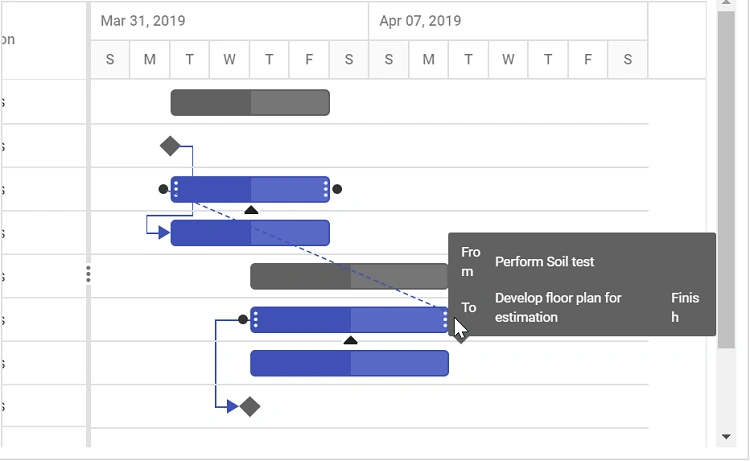
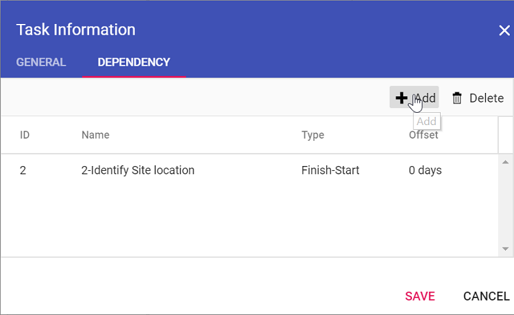
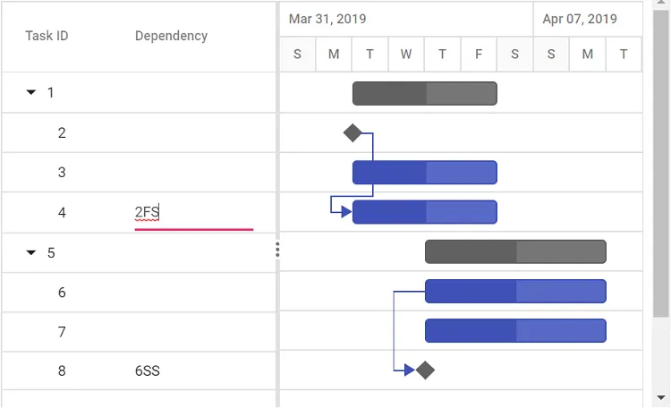

# Editing tasks in Blazor Gantt Chart Component

Editing tasks in the Blazor Gantt Chart component enables dynamic project updates, such as modifying task durations, names, or dependencies, using cell editing, dialog, taskbar interactions, or programmatic methods. Enable editing by setting [GanttEditSettings.AllowEditing](https://help.syncfusion.com/cr/blazor/Syncfusion.Blazor.Gantt.GanttEditSettings.html#Syncfusion_Blazor_Gantt_GanttEditSettings_AllowEditing) and [GanttEditSettings.AllowTaskbarEditing](https://help.syncfusion.com/cr/blazor/Syncfusion.Blazor.Gantt.GanttEditSettings.html#Syncfusion_Blazor_Gantt_GanttEditSettings_AllowTaskbarEditing) to **true**, ensuring task data aligns with [TaskFields](https://help.syncfusion.com/cr/blazor/Syncfusion.Blazor.Gantt.GanttTaskFields.html) mappings (e.g., id, name, startDate). Cell editing allows direct updates in the TreeGrid pane, dialog editing provides a comprehensive interface, taskbar dragging adjusts durations or dates, and connector lines manage dependencies via drag-and-drop. Use the [GanttEditSettings.Mode](https://help.syncfusion.com/cr/blazor/Syncfusion.Blazor.Gantt.GanttEditSettings.html#Syncfusion_Blazor_Gantt_GanttEditSettings_Mode) property to control editing behavior (**Auto** or **Dialog**). Customize dialog fields with [AddDialogFields](https://help.syncfusion.com/cr/blazor/Syncfusion.Blazor.Gantt.GanttAddDialogFields.html#Syncfusion_Blazor_Gantt_GanttAddDialogFields_AddDialogFields) and [EditDialogFields](https://help.syncfusion.com/cr/blazor/Syncfusion.Blazor.Gantt.GanttEditDialogFields.html#Syncfusion_Blazor_Gantt_GanttEditDialogFields_EditDialogFields) for tailored forms. The [UpdateRecordByIDAsync](https://help.syncfusion.com/cr/blazor/Syncfusion.Blazor.Gantt.SfGantt-1.html#Syncfusion_Blazor_Gantt_SfGantt_1_UpdateRecordByIDAsync__0_) method enables programmatic updates, except for task IDs. Ensure valid data to prevent issues and maintain dependency integrity.

## Edit tasks via cell editing

Enable cell editing by setting [GanttEditSettings.AllowEditing](https://help.syncfusion.com/cr/blazor/Syncfusion.Blazor.Gantt.GanttEditSettings.html#Syncfusion_Blazor_Gantt_GanttEditSettings_AllowEditing) to **true**, [GanttEditSettings.Mode](https://help.syncfusion.com/cr/blazor/Syncfusion.Blazor.Gantt.GanttEditSettings.html#Syncfusion_Blazor_Gantt_GanttEditSettings_Mode) to **Auto**. Double-click a TreeGrid cell to edit fields like task name or duration directly, ideal for quick updates. Ensure `GanttTaskFields` mappings are valid for seamless editing.




@using Syncfusion.Blazor.Gantt
<SfGantt DataSource="@TaskCollection" Height="450px" Width="900px">
    <GanttTaskFields Id="TaskId" Name="TaskName" StartDate="StartDate" EndDate="EndDate" Duration="Duration" Progress="Progress" ParentID="ParentId">
    </GanttTaskFields>
    <GanttEditSettings AllowEditing="true" Mode="Syncfusion.Blazor.Gantt.EditMode.Auto"></GanttEditSettings>
</SfGantt>

@code {
    public List<TaskData>? TaskCollection { get; set; }
    protected override void OnInitialized()
    {
        TaskCollection = GetTaskCollection();
    }

    public class TaskData
    {
        public int TaskId { get; set; }
        public string? TaskName { get; set; }
        public DateTime StartDate { get; set; }
        public DateTime? EndDate { get; set; }
        public string? Duration { get; set; }
        public int Progress { get; set; }
        public int? ParentId { get; set; }
    }

    public static List<TaskData> GetTaskCollection()
    {
        List<TaskData> Tasks = new List<TaskData>()
        {
            new TaskData() { TaskId = 1, TaskName = "Project initiation", StartDate = new DateTime(2026, 04, 06), EndDate = new DateTime(2026, 04, 09), },
            new TaskData() { TaskId = 2, TaskName = "Identify Site location", StartDate = new DateTime(2026, 04, 06), Duration = "0", Progress = 30, ParentId = 1 },
            new TaskData() { TaskId = 3, TaskName = "Perform soil test", StartDate = new DateTime(2026, 04, 06), EndDate = new DateTime(2026, 04, 09), Progress = 40, ParentId = 1 },
            new TaskData() { TaskId = 4, TaskName = "Soil test approval", StartDate = new DateTime(2026, 04, 06), Duration = "0", Progress = 30, ParentId = 1 },
            new TaskData() { TaskId = 5, TaskName = "Project estimation", StartDate = new DateTime(2026, 04, 07), EndDate = new DateTime(2026, 04, 08), },
            new TaskData() { TaskId = 6, TaskName = "Develop floor plan for estimation", StartDate = new DateTime(2026, 04, 07), EndDate = new DateTime(2026, 04, 09), Progress = 30, ParentId = 5 },
            new TaskData() { TaskId = 7, TaskName = "List materials", StartDate = new DateTime(2026, 04, 07), EndDate = new DateTime(2026, 04, 09), Progress = 40, ParentId = 5 },
            new TaskData() { TaskId = 8, TaskName = "Estimation approval", StartDate = new DateTime(2026, 04, 07), Duration = "0", Progress = 30, ParentId = 5 }
        };
        return Tasks;
    }
}






N> When the edit mode is set to `Auto`, double-clicking on the Tree Grid side changes the cells to editable mode. Double-clicking on the chart side opens the edit dialog for editing the task details.

## Edit tasks via dialog

Enable dialog editing by setting [GanttEditSettings.AllowEditing](https://help.syncfusion.com/cr/blazor/Syncfusion.Blazor.Gantt.GanttEditSettings.html#Syncfusion_Blazor_Gantt_GanttEditSettings_AllowEditing) to **true** and [GanttEditSettings.Mode](https://help.syncfusion.com/cr/blazor/Syncfusion.Blazor.Gantt.GanttEditSettings.html#Syncfusion_Blazor_Gantt_GanttEditSettings_Mode) to **Dialog**. Double-click a row on the TreeGrid or chart side to open a dialog for editing task details, such as start date or dependencies, suitable for comprehensive updates. In **Auto** mode, double-clicking the chart side opens the dialog, while the TreeGrid side enables cell editing.




@using Syncfusion.Blazor.Gantt
<SfGantt DataSource="@TaskCollection" Height="450px" Width="900px">
    <GanttTaskFields Id="TaskId" Name="TaskName" StartDate="StartDate" EndDate="EndDate" Duration="Duration" Progress="Progress" ParentID="ParentId">
    </GanttTaskFields>
    <GanttEditSettings AllowEditing="true" Mode="Syncfusion.Blazor.Gantt.EditMode.Dialog"></GanttEditSettings>
</SfGantt>

@code {
    public List<TaskData>? TaskCollection { get; set; }
    protected override void OnInitialized()
    {
        TaskCollection = GetTaskCollection();
    }

    public class TaskData
    {
        public int TaskId { get; set; }
        public string? TaskName { get; set; }
        public DateTime StartDate { get; set; }
        public DateTime? EndDate { get; set; }
        public string? Duration { get; set; }
        public int Progress { get; set; }
        public int? ParentId { get; set; }
    }

    public static List<TaskData> GetTaskCollection()
    {
        List<TaskData> Tasks = new List<TaskData>()
        {
            new TaskData() { TaskId = 1, TaskName = "Project initiation", StartDate = new DateTime(2026, 04, 06), EndDate = new DateTime(2026, 04, 09), },
            new TaskData() { TaskId = 2, TaskName = "Identify Site location", StartDate = new DateTime(2026, 04, 06), Duration = "0", Progress = 30, ParentId = 1 },
            new TaskData() { TaskId = 3, TaskName = "Perform soil test", StartDate = new DateTime(2026, 04, 06), EndDate = new DateTime(2026, 04, 09), Progress = 40, ParentId = 1 },
            new TaskData() { TaskId = 4, TaskName = "Soil test approval", StartDate = new DateTime(2026, 04, 06), Duration = "0", Progress = 30, ParentId = 1 },
            new TaskData() { TaskId = 5, TaskName = "Project estimation", StartDate = new DateTime(2026, 04, 07), EndDate = new DateTime(2026, 04, 08), },
            new TaskData() { TaskId = 6, TaskName = "Develop floor plan for estimation", StartDate = new DateTime(2026, 04, 07), EndDate = new DateTime(2026, 04, 09), Progress = 30, ParentId = 5 },
            new TaskData() { TaskId = 7, TaskName = "List materials", StartDate = new DateTime(2026, 04, 07), EndDate = new DateTime(2026, 04, 09), Progress = 40, ParentId = 5 },
            new TaskData() { TaskId = 8, TaskName = "Estimation approval", StartDate = new DateTime(2026, 04, 07), Duration = "0", Progress = 30, ParentId = 5 }
        };
        return Tasks;
    }
}






N> In dialog editing mode, the edit dialog appears when the Tree Grid or Gantt chart sides are double-clicked.

## Sections or tabs in Dialog

Customize the edit dialog by defining tabs with [GanttAddDialogFields](https://help.syncfusion.com/cr/blazor/Syncfusion.Blazor.Gantt.GanttAddDialogFields.html) and [GanttEditDialogFields](https://help.syncfusion.com/cr/blazor/Syncfusion.Blazor.Gantt.GanttEditDialogFields.html), using the [GanttAddDialogField.Type](https://help.syncfusion.com/cr/blazor/Syncfusion.Blazor.Gantt.GanttAddDialogField.html#Syncfusion_Blazor_Gantt_GanttAddDialogField_Type) and [GanttEditDialogField.Type](https://help.syncfusion.com/cr/blazor/Syncfusion.Blazor.Gantt.GanttEditDialogField.html#Syncfusion_Blazor_Gantt_GanttEditDialogField_Type) property (e.g., General, Dependency). This organizes fields into tabs for focused editing, such as task details or dependencies.




@using Syncfusion.Blazor.Gantt
<SfGantt DataSource="@TaskCollection" Toolbar="@(new List<string>() { "Add", "Edit" })" Height="450px" Width="700px">
    <GanttTaskFields Id="TaskId" Name="TaskName" StartDate="StartDate" EndDate="EndDate"
                     Duration="Duration" Progress="Progress" ParentID="ParentId" Notes="Notes"
                     Dependency="Predecessor">
    </GanttTaskFields>
    <GanttResource DataSource="ResourceCollection" Id="Id" Name="Name" TValue="TaskData" TResources="ResourceInfoModel"></GanttResource>
    <GanttAssignmentFields DataSource="AssignmentCollection" PrimaryKey="PrimaryId" TaskID="TaskId" ResourceID="ResourceID" TValue="TaskData" TAssignment="AssignmentModel">
    </GanttAssignmentFields>
    <GanttEditSettings AllowAdding="true" AllowEditing="true" Mode="Syncfusion.Blazor.Gantt.EditMode.Dialog">
    </GanttEditSettings>
    <GanttEditDialogFields>
        <GanttEditDialogField Type="GanttDialogFieldType.General" HeaderText="General">
        </GanttEditDialogField>
        <GanttEditDialogField Type="GanttDialogFieldType.Dependency"></GanttEditDialogField>
        <GanttEditDialogField Type="GanttDialogFieldType.Resources"></GanttEditDialogField>
        <GanttEditDialogField Type="GanttDialogFieldType.Notes"></GanttEditDialogField>
    </GanttEditDialogFields>
    <GanttAddDialogFields>
        <GanttAddDialogField Type="GanttDialogFieldType.General" HeaderText="General Tab"></GanttAddDialogField>
        <GanttAddDialogField Type="GanttDialogFieldType.Dependency"></GanttAddDialogField>
    </GanttAddDialogFields>
</SfGantt>

@code {
    public List<TaskData>? TaskCollection { get; set; }
    public List<ResourceInfoModel>? ResourceCollection { get; set; }
    public static List<AssignmentModel> AssignmentCollection { get; set; } = new();
    protected override void OnInitialized()
    {
        TaskCollection = GetTaskCollection();
        ResourceCollection = GetResourceCollections();
        AssignmentCollection = GetAssignmentCollection();
    }

    public class TaskData
    {
        public int TaskId { get; set; }
        public string? TaskName { get; set; }
        public DateTime StartDate { get; set; }
        public DateTime? EndDate { get; set; }
        public string? Duration { get; set; }
        public int Progress { get; set; }
        public int? ParentId { get; set; }
        public string? Notes { get; set; }
        public string? Predecessor { get; set; }
    }
    public class ResourceInfoModel
    {
        public int Id { get; set; }
        public string? Name { get; set; }
    }
    public class AssignmentModel
    {
        public int PrimaryId { get; set; }
        public int TaskId { get; set; }
        public int ResourceID { get; set; }
    }

    public static List<ResourceInfoModel> GetResourceCollections()
    {
        List<ResourceInfoModel> Resources = new List<ResourceInfoModel>() {
        new ResourceInfoModel() { Id = 1, Name = "Martin Tamer" },
        new ResourceInfoModel() { Id = 2, Name = "Rose Fuller" },
        new ResourceInfoModel() { Id = 3, Name = "Margaret Buchanan" },
        new ResourceInfoModel() { Id = 4, Name = "Fuller King" },
        new ResourceInfoModel() { Id= 5, Name= "Davolio Fuller" },
        };
        return Resources;
    }

    public static List<AssignmentModel> GetAssignmentCollection()
    {
        List<AssignmentModel> assignments = new List<AssignmentModel>()
        {
            new AssignmentModel(){ PrimaryId=1, TaskId = 2, ResourceID=1},
            new AssignmentModel(){ PrimaryId=2, TaskId = 3, ResourceID=2},
            new AssignmentModel(){ PrimaryId=3, TaskId = 3, ResourceID=3},
            new AssignmentModel(){ PrimaryId=4, TaskId = 6, ResourceID=4},
            new AssignmentModel(){ PrimaryId=5, TaskId = 8, ResourceID=1},
            new AssignmentModel(){ PrimaryId=6, TaskId = 8, ResourceID=5}
        };
        return assignments;
    }

    public static List<TaskData> GetTaskCollection()
    {
        List<TaskData> Tasks = new List<TaskData>()
        {
            new TaskData() { TaskId = 1, TaskName = "Project initiation", StartDate = new DateTime(2026, 04, 06), EndDate = new DateTime(2026, 04, 09), },
            new TaskData() { TaskId = 2, TaskName = "Identify Site location", StartDate = new DateTime(2026, 04, 06), Duration = "0", Progress = 30, Notes = "Measure the total property area alloted for construction", ParentId = 1 },
            new TaskData() { TaskId = 3, TaskName = "Perform soil test", StartDate = new DateTime(2026, 04, 06), EndDate = new DateTime(2026, 04, 09), Predecessor = "2", Notes = "Obtain an engineered soil test of a plot where construction is planned from an engineer or company specializing in soil testing", ParentId = 1 },
            new TaskData() { TaskId = 4, TaskName = "Soil test approval", StartDate = new DateTime(2026, 04, 06), Duration = "0", Progress = 30, Predecessor = "3", ParentId = 1 },
            new TaskData() { TaskId = 5, TaskName = "Project estimation", StartDate = new DateTime(2026, 04, 11), EndDate = new DateTime(2026, 04, 18), },
            new TaskData() { TaskId = 6, TaskName = "Develop floor plan for estimation", StartDate = new DateTime(2026, 04, 11), EndDate = new DateTime(2026, 04, 14), Progress = 30, Predecessor = "4", Notes = "Develop floor plans and obtain a materials list for estimations", ParentId = 5 },
            new TaskData() { TaskId = 7, TaskName = "List materials", StartDate = new DateTime(2026, 04, 14), EndDate = new DateTime(2026, 04, 17), Predecessor = "6", Notes = "", ParentId = 5 },
            new TaskData() { TaskId = 8, TaskName = "Estimation approval", StartDate = new DateTime(2026, 04, 18), Duration = "0", Predecessor = "7", Notes = "", ParentId = 5 }
        };
        return Tasks;
    }
}






### Limit fields in general tab

Restrict fields in the dialog’s General tab using [GanttAddDialogFields](https://help.syncfusion.com/cr/blazor/Syncfusion.Blazor.Gantt.GanttAddDialogFields.html) and [GanttEditDialogFields](https://help.syncfusion.com/cr/blazor/Syncfusion.Blazor.Gantt.GanttEditDialogFields.html) with the [GanttAddDialogField.Type](https://help.syncfusion.com/cr/blazor/Syncfusion.Blazor.Gantt.GanttAddDialogField.html#Syncfusion_Blazor_Gantt_GanttAddDialogField_Type) and [GanttEditDialogField.Type](https://help.syncfusion.com/cr/blazor/Syncfusion.Blazor.Gantt.GanttEditDialogField.html#Syncfusion_Blazor_Gantt_GanttEditDialogField_Type) properties set to **General** and [Fields](https://help.syncfusion.com/cr/blazor/Syncfusion.Blazor.Gantt.GanttEditDialogField.html#Syncfusion_Blazor_Gantt_GanttEditDialogField_Fields) specifying visible fields (e.g., TaskName, Duration). This streamlines editing by showing only relevant fields.

> You can also define custom fields in the add/edit dialog General tab using the `Fields` property.




@using Syncfusion.Blazor.Gantt
<SfGantt DataSource="@TaskCollection" Toolbar="@(new List<string>() { "Add", "Edit" })" Height="450px" Width="700px">
    <GanttTaskFields Id="TaskId" Name="TaskName" StartDate="StartDate" EndDate="EndDate"
                     Duration="Duration" Progress="Progress" ParentID="ParentId" Notes="Notes"
                     Dependency="Predecessor">
    </GanttTaskFields>
    <GanttEditSettings AllowAdding="true" AllowEditing="true" Mode="Syncfusion.Blazor.Gantt.EditMode.Dialog">
    </GanttEditSettings>
    <GanttColumns>
        <GanttColumn Field="TaskId" Width="100"></GanttColumn>
        <GanttColumn Field="TaskName"></GanttColumn>
        <GanttColumn Field="StartDate"></GanttColumn>
        <GanttColumn Field="Duration"></GanttColumn>
        <GanttColumn Field="Progress"></GanttColumn>
    </GanttColumns>
    <GanttEditDialogFields>
        <GanttEditDialogField Type="GanttDialogFieldType.General" HeaderText="General"
                              Fields="@(new string[]{ "TaskID", "TaskName", "Duration" })"></GanttEditDialogField>
        <GanttEditDialogField Type="GanttDialogFieldType.Notes"></GanttEditDialogField>
    </GanttEditDialogFields>
    <GanttAddDialogFields>
        <GanttAddDialogField Type="GanttDialogFieldType.General" HeaderText="General Tab"
                             Fields="@(new string[]{ "TaskID", "TaskName", "Duration" })"></GanttAddDialogField>
        <GanttAddDialogField Type="GanttDialogFieldType.Dependency"></GanttAddDialogField>
    </GanttAddDialogFields>
</SfGantt>

@code {
    public List<TaskData>? TaskCollection { get; set; }
    protected override void OnInitialized()
    {
        TaskCollection = GetTaskCollection();
    }

    public class TaskData
    {
        public int TaskId { get; set; }
        public string? TaskName { get; set; }
        public DateTime StartDate { get; set; }
        public DateTime? EndDate { get; set; }
        public string? Duration { get; set; }
        public int Progress { get; set; }
        public int? ParentId { get; set; }
        public string? Notes { get; set; }
        public string? Predecessor { get; set; }
    }

    public static List<TaskData> GetTaskCollection()
    {
        List<TaskData> Tasks = new List<TaskData>()
        {
            new TaskData() { TaskId = 1, TaskName = "Project initiation", StartDate = new DateTime(2026, 04, 06), EndDate = new DateTime(2026, 04, 09), },
            new TaskData() { TaskId = 2, TaskName = "Identify Site location", StartDate = new DateTime(2026, 04, 06), Duration = "0", Progress = 30, Notes = "Measure the total property area alloted for construction", ParentId = 1 },
            new TaskData() { TaskId = 3, TaskName = "Perform soil test", StartDate = new DateTime(2026, 04, 06), EndDate = new DateTime(2026, 04, 09), Predecessor = "2", Notes = "Obtain an engineered soil test of a plot where construction is planned from an engineer or company specializing in soil testing", ParentId = 1 },
            new TaskData() { TaskId = 4, TaskName = "Soil test approval", StartDate = new DateTime(2026, 04, 06), Duration = "0", Progress = 30, Predecessor = "3", ParentId = 1 },
            new TaskData() { TaskId = 5, TaskName = "Project estimation", StartDate = new DateTime(2026, 04, 13), EndDate = new DateTime(2026, 04, 21), },
            new TaskData() { TaskId = 6, TaskName = "Develop floor plan for estimation", StartDate = new DateTime(2026, 04, 07), EndDate = new DateTime(2026, 04, 09), Progress = 30, Predecessor = "4", Notes = "Develop floor plans and obtain a materials list for estimations", ParentId = 5 },
            new TaskData() { TaskId = 7, TaskName = "List materials", StartDate = new DateTime(2026, 04, 07), EndDate = new DateTime(2026, 04, 09), Predecessor = "6", Notes = "", ParentId = 5 },
            new TaskData() { TaskId = 8, TaskName = "Estimation approval", StartDate = new DateTime(2026, 04, 07), Duration = "0", Predecessor = "7", Notes = "", ParentId = 5 }
        };
        return Tasks;
    }
}






## Edit task dependencies

Enable dependency editing by mapping the [GanttTaskFields.Dependency](https://help.syncfusion.com/cr/blazor/Syncfusion.Blazor.Gantt.GanttTaskFields.html#Syncfusion_Blazor_Gantt_GanttTaskFields_Dependency)  property in `GanttTaskFields`, setting [GanttEditSettings.AllowEditing](https://help.syncfusion.com/cr/blazor/Syncfusion.Blazor.Gantt.GanttEditSettings.html#Syncfusion_Blazor_Gantt_GanttEditSettings_AllowEditing) and [GanttEditSettings.AllowTaskbarEditing](https://help.syncfusion.com/cr/blazor/Syncfusion.Blazor.Gantt.GanttEditSettings.html#Syncfusion_Blazor_Gantt_GanttEditSettings_AllowTaskbarEditing) to **true**. Update dependencies via:

- **Mouse interactions**: Drag connector points on taskbars to create or modify links.

    

- **Dialog**: Edit the Dependency tab in the edit dialog.

    

- **Cell editing**: Update the dependency field in the TreeGrid. Ensure valid dependency strings to avoid circular references.

    




@using Syncfusion.Blazor.Gantt
<SfGantt DataSource="@TaskCollection" Height="450px" Width="700px">
    <GanttTaskFields Id="TaskId" Name="TaskName" StartDate="StartDate" EndDate="EndDate" Duration="Duration" Progress="Progress" ParentID="ParentId" Dependency="Predecessor">
    </GanttTaskFields>
    <GanttEditSettings AllowTaskbarEditing="true" AllowEditing="true" Mode="Syncfusion.Blazor.Gantt.EditMode.Auto"></GanttEditSettings>
</SfGantt>

@code {
    private List<TaskData>? TaskCollection { get; set; }
    protected override void OnInitialized()
    {
        TaskCollection = GetTaskCollection();
    }

    public class TaskData
    {
        public int TaskId { get; set; }
        public string? TaskName { get; set; }
        public DateTime StartDate { get; set; }
        public DateTime? EndDate { get; set; }
        public string? Duration { get; set; }
        public int Progress { get; set; }
        public string? Predecessor { get; set; }
        public int? ParentId { get; set; }
    }

    public static List<TaskData> GetTaskCollection()
    {
        List<TaskData> Tasks = new List<TaskData>();
        Tasks.Add(new TaskData() { TaskId = 1, TaskName = "Project initiation", StartDate = new DateTime(2026, 04, 06), EndDate = new DateTime(2026, 04, 09), });
        Tasks.Add(new TaskData() { TaskId = 2, TaskName = "Identify Site location", StartDate = new DateTime(2026, 04, 06), Duration = "0", Progress = 30, ParentId = 1 });
        Tasks.Add(new TaskData() { TaskId = 3, TaskName = "Perform soil test", StartDate = new DateTime(2026, 04, 06), EndDate = new DateTime(2026, 04, 09), Progress = 40, Predecessor = "2", ParentId = 1 });
        Tasks.Add(new TaskData() { TaskId = 4, TaskName = "Soil test approval", StartDate = new DateTime(2026, 04, 06), Duration = "0", Progress = 30, Predecessor = "3", ParentId = 1 });
        Tasks.Add(new TaskData() { TaskId = 5, TaskName = "Project estimation", StartDate = new DateTime(2026, 04, 13), EndDate = new DateTime(2026, 04, 21), });
        Tasks.Add(new TaskData() { TaskId = 6, TaskName = "Develop floor plan for estimation", StartDate = new DateTime(2026, 04, 07), EndDate = new DateTime(2026, 04, 09), Progress = 30, Predecessor = "4", ParentId = 5 });
        Tasks.Add(new TaskData() { TaskId = 7, TaskName = "List materials", StartDate = new DateTime(2026, 04, 07), EndDate = new DateTime(2026, 04, 09), Progress = 40, Predecessor = "6", ParentId = 5 });
        Tasks.Add(new TaskData() { TaskId = 8, TaskName = "Estimation approval", StartDate = new DateTime(2026, 04, 07), Duration = "0", Progress = 30, Predecessor = "7", ParentId = 5 });
        return Tasks;
    }
}






## Edit tasks programmatically

Update tasks programmatically using the [UpdateRecordByIDAsync](https://help.syncfusion.com/cr/blazor/Syncfusion.Blazor.Gantt.SfGantt-1.html#Syncfusion_Blazor_Gantt_SfGantt_1_UpdateRecordByIDAsync__0_) method, specifying the task ID and updated data. This method supports automation, such as updating durations via a button, but cannot modify the task ID. Ensure `GanttTaskFields` mappings are valid for successful updates.

> Using the `UpdateRecordByIDAsync` method, you cannot update the task ID value.




@using Syncfusion.Blazor.Gantt
<button @onclick="UpdateRecord">Update Task 3</button>
<SfGantt @ref="Gantt" DataSource="@TaskCollection" Height="450px" Width="900px">
    <GanttTaskFields Id="TaskId" Name="TaskName" StartDate="StartDate" EndDate="EndDate" Duration="Duration" Progress="Progress" ParentID="ParentId">
    </GanttTaskFields>
    <GanttEditSettings AllowEditing="true"></GanttEditSettings>
</SfGantt>

@code {
    public SfGantt<TaskData>? Gantt;
    public void UpdateRecord()
    {
        Gantt?.UpdateRecordByIDAsync(new TaskData() { TaskId = 3, TaskName = "Updated by ID value", Progress = 60 });
    }
    public List<TaskData>? TaskCollection { get; set; }
    protected override void OnInitialized()
    {
        TaskCollection = GetTaskCollection();
    }

    public class TaskData
    {
        public int TaskId { get; set; }
        public string? TaskName { get; set; }
        public DateTime StartDate { get; set; }
        public DateTime? EndDate { get; set; }
        public string? Duration { get; set; }
        public int Progress { get; set; }
        public int? ParentId { get; set; }
    }

    public static List<TaskData> GetTaskCollection()
    {
        List<TaskData> Tasks = new List<TaskData>() {
            new TaskData() { TaskId = 1, TaskName = "Project initiation", StartDate = new DateTime(2026, 04, 06), EndDate = new DateTime(2026, 04, 09), },
            new TaskData() { TaskId = 2, TaskName = "Identify Site location", StartDate = new DateTime(2026, 04, 06), Duration = "0", Progress = 30,  ParentId = 1 },
            new TaskData() { TaskId = 3, TaskName = "Perform soil test", StartDate = new DateTime(2026, 04, 06), EndDate = new DateTime(2026, 04, 09), ParentId = 1 },
            new TaskData() { TaskId = 4, TaskName = "Soil test approval", StartDate = new DateTime(2026, 04, 06), Duration = "0", Progress = 30, ParentId = 1 },
            new TaskData() { TaskId = 5, TaskName = "Project estimation", StartDate = new DateTime(2026, 04, 13), EndDate = new DateTime(2026, 04, 21), },
            new TaskData() { TaskId = 6, TaskName = "Develop floor plan for estimation", StartDate = new DateTime(2026, 04, 07), EndDate = new DateTime(2026, 04, 09), Progress = 30,ParentId = 5 },
            new TaskData() { TaskId = 7, TaskName = "List materials", StartDate = new DateTime(2026, 04, 07), EndDate = new DateTime(2026, 04, 09), ParentId = 5 },
            new TaskData() { TaskId = 8, TaskName = "Estimation approval", StartDate = new DateTime(2026, 04, 07), Duration = "0", ParentId = 5 }
        };
        return Tasks;
    }
}






## See also
- [How to add new tasks?](https://blazor.syncfusion.com/documentation/gantt-chart/adding-new-tasks)
- [How to manage task dependencies?](https://blazor.syncfusion.com/documentation/gantt-chart/task-dependencies)
- [How to configure critical path?](https://blazor.syncfusion.com/documentation/gantt-chart/criticalpath)
