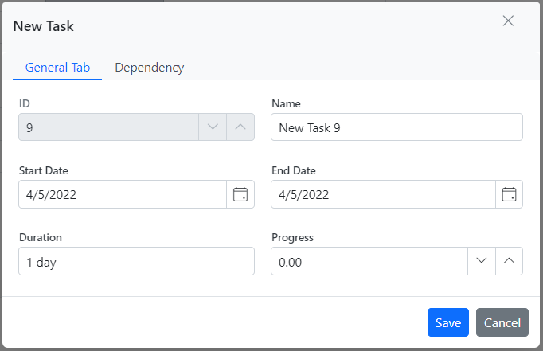

# Editing tasks in Blazor Gantt Chart Component

The editing feature in the Blazor Gantt Chart component can be enabled by setting the [GanttEditSettings.AllowEditing](https://help.syncfusion.com/cr/blazor/Syncfusion.Blazor.Gantt.GanttEditSettings.html#Syncfusion_Blazor_Gantt_GanttEditSettings_AllowEditing) and [GanttEditSettings.AllowTaskbarEditing](https://help.syncfusion.com/cr/blazor/Syncfusion.Blazor.Gantt.GanttEditSettings.html#Syncfusion_Blazor_Gantt_GanttEditSettings_AllowTaskbarEditing) properties to true in the [GanttEditSettings](https://help.syncfusion.com/cr/blazor/Syncfusion.Blazor.Gantt.GanttEditSettings.html) component. This allows task details to be modified directly within the Gantt chart, enhancing flexibility and usability for project management. Real-time updates help maintain the accuracy of the project timeline, ensuring the schedule stays up-to-date.

**Available Editing Options:**
* [Cell](https://blazor.syncfusion.com/documentation/gantt-chart/editing-tasks#cell-editing)
* [Dialog](https://blazor.syncfusion.com/documentation/gantt-chart/editing-tasks#dialog-editing)
* [Taskbar](https://blazor.syncfusion.com/documentation/gantt-chart/taskbar-editing)

## Cell editing

In the Gantt Chart component, cell editing can be enabled by setting the [GanttEditSettings.Mode](https://help.syncfusion.com/cr/blazor/Syncfusion.Blazor.Gantt.GanttEditSettings.html#Syncfusion_Blazor_Gantt_GanttEditSettings_Mode)  property to [EditMode.Auto](https://help.syncfusion.com/cr/blazor/Syncfusion.Blazor.Gantt.EditMode.html#Syncfusion_Blazor_Gantt_EditMode_Auto). This configuration allows tasks to be edited by double-clicking on the TreeGrid cells.
By default, the [GanttEditSettings.Mode](https://help.syncfusion.com/cr/blazor/Syncfusion.Blazor.Gantt.GanttEditSettings.html#Syncfusion_Blazor_Gantt_GanttEditSettings_Mode) property value is [EditMode.Auto](https://help.syncfusion.com/cr/blazor/Syncfusion.Blazor.Gantt.EditMode.html#Syncfusion_Blazor_Gantt_EditMode_Auto), ensuring that cell editing is enabled out of the box without additional configuration.

The following code example shows you how to enable the cell editing in Gantt Chart component.

```cshtml
@using Syncfusion.Blazor.Gantt
<SfGantt DataSource="@TaskCollection" Height="450px" Width="900px">
    <GanttTaskFields Id="TaskId" Name="TaskName" StartDate="StartDate" EndDate="EndDate" Duration="Duration" Progress="Progress" ParentID="ParentId">
    </GanttTaskFields>
    <GanttEditSettings AllowEditing="true" Mode="EditMode.Auto"></GanttEditSettings>
</SfGantt>

@code{
    private List<TaskData> TaskCollection { get; set; }
    protected override void OnInitialized()
    {
        this.TaskCollection = GetTaskCollection();
    }

    public class TaskData
    {
        public int TaskId { get; set; }
        public string TaskName { get; set; }
        public DateTime StartDate { get; set; }
        public DateTime? EndDate { get; set; }
        public string Duration { get; set; }
        public int Progress { get; set; }
        public int? ParentId { get; set; }
    }

    public static List<TaskData> GetTaskCollection()
    {
        List<TaskData> Tasks = new List<TaskData>()
        {
            new TaskData() { TaskId = 1, TaskName = "Project initiation", StartDate = new DateTime(2022, 04, 05), EndDate = new DateTime(2022, 04, 21), },
            new TaskData() { TaskId = 2, TaskName = "Identify Site location", StartDate = new DateTime(2022, 04, 05), Duration = "0", Progress = 30, ParentId = 1 },
            new TaskData() { TaskId = 3, TaskName = "Perform soil test", StartDate = new DateTime(2022, 04, 05), Duration = "4", Progress = 40, ParentId = 1 },
            new TaskData() { TaskId = 4, TaskName = "Soil test approval", StartDate = new DateTime(2022, 04, 05), Duration = "0", Progress = 30, ParentId = 1 },
            new TaskData() { TaskId = 5, TaskName = "Project estimation", StartDate = new DateTime(2022, 04, 06), EndDate = new DateTime(2022, 04, 21), },
            new TaskData() { TaskId = 6, TaskName = "Develop floor plan for estimation", StartDate = new DateTime(2022, 04, 06), Duration = "3", Progress = 30, ParentId = 5 },
            new TaskData() { TaskId = 7, TaskName = "List materials", StartDate = new DateTime(2022, 04, 06), Duration = "3", Progress = 40, ParentId = 5 },
            new TaskData() { TaskId = 8, TaskName = "Estimation approval", StartDate = new DateTime(2022, 04, 06), Duration = "0", Progress = 30, ParentId = 5 }
        };
        return Tasks;
    }
}
```

N> When the GanttEditSettings.Mode property is set to EditMode.Auto, performing a double-click action on the TreeGrid side changes the cells to editable mode, allowing task details to be modified directly. Performing a double-click action on the chart side opens the edit dialog, enabling detailed task editing.

double click action on Tree Grid or chart side




### Cell edit type and its params

The `GanttColumn.EditType` property in the Gantt Chart component customizes the editing behavior of a specific column based on its data type.

To configure the EditType based on the data type, use the following settings:

* [NumericTextBox](https://blazor.syncfusion.com/documentation/numeric-textbox/getting-started) component for integers, double, and decimal data types.

* [TextBox](https://blazor.syncfusion.com/documentation/textbox/getting-started) component for string data type.

* [DropDownList](https://blazor.syncfusion.com/documentation/dropdown-list/getting-started) component for list data type.

* [DatePicker](https://blazor.syncfusion.com/documentation/datepicker/getting-started) component for date values.

* [DateTimePicker](https://blazor.syncfusion.com/documentation/datetime-picker/getting-started) component for datetime type.

* [Checkbox](https://blazor.syncfusion.com/documentation/check-box/getting-started) component for boolean type.

You can also customize the behavior of the editor component using `GanttColumn.EditorSettings`.

The following table describes cell edit type component and their corresponding edit params of the column.

Component |Example
-----|-----
[NumericTextBox](https://blazor.syncfusion.com/documentation/numeric-textbox/getting-started) | @(new { @params = new { format = "n"} })
[TextBox](https://blazor.syncfusion.com/documentation/textbox/getting-started) | -
[DropDownList](https://blazor.syncfusion.com/documentation/dropdown-list/getting-started) | @(new { @params = new { value = "Germany"} })
[DatePicker](https://blazor.syncfusion.com/documentation/datepicker/getting-started) | @(new { @params = new { format = "yyyy-MM-dd"} })
[DateTimePicker](https://blazor.syncfusion.com/documentation/datetime-picker/getting-started) | @(new { @params = new { strictMode = true} })
[Checkbox](https://blazor.syncfusion.com/documentation/check-box/getting-started) | @(new { @params = new { checked = true} })

```cshtml
@using Syncfusion.Blazor.Gantt
<SfGantt @ref="Gantt" DataSource="@TaskCollection" Height="450px" Width="900px" Toolbar="@(new List<string>() { "Add", "Edit", "Delete", "Update", "Cancel" })">
    <GanttTaskFields Id="TaskId" Name="TaskName" StartDate="StartDate" EndDate="EndDate" Duration="Duration" Progress="Progress" ParentID="ParentId">
    </GanttTaskFields>
    <GanttColumns>
        <GanttColumn Field="TaskId" Width="100"></GanttColumn>
        <GanttColumn Field="TaskName" Width="250"></GanttColumn>
        <GanttColumn Field="StartDate" EditorSettings="DateParams" Type="Syncfusion.Blazor.Grids.ColumnType.DateTime" EditType="Syncfusion.Blazor.Grids.EditType.DateTimePickerEdit"></GanttColumn>
        <GanttColumn Field="Duration"></GanttColumn>
        <GanttColumn Field="Progress" EditorSettings="NumericParams" EditType="Syncfusion.Blazor.Grids.EditType.NumericEdit"></GanttColumn>
    </GanttColumns>
    <GanttEditSettings AllowEditing="true" AllowAdding="true"></GanttEditSettings>
</SfGantt>

@code{
    public SfGantt<TaskData> Gantt;
    private List<TaskData> TaskCollection { get; set; }
    public Syncfusion.Blazor.Grids.NumericEditCellParams NumericParams = new Syncfusion.Blazor.Grids.NumericEditCellParams()
    {
        Params = new Syncfusion.Blazor.Inputs.NumericTextBoxModel<object>() { Format = "N2" }
    };

    public Syncfusion.Blazor.Grids.DateEditCellParams DateParams = new Syncfusion.Blazor.Grids.DateEditCellParams()
    {
        Params = new Syncfusion.Blazor.Calendars.DatePickerModel() { Format = "d" }
    };
    protected override void OnInitialized()
    {
        this.TaskCollection = GetTaskCollection();
    }
    public class TaskData
    {
        public int TaskId { get; set; }
        public string TaskName { get; set; }
        public DateTime StartDate { get; set; }
        public DateTime? EndDate { get; set; }
        public string Duration { get; set; }
        public int Progress { get; set; }
        public int? ParentId { get; set; }
    }

    public static List<TaskData> GetTaskCollection()
    {
        List<TaskData> Tasks = new List<TaskData>()
        {
            new TaskData() { TaskId = 1, TaskName = "Project initiation", StartDate = new DateTime(2022, 04, 05), EndDate = new DateTime(2022, 04, 21) },
            new TaskData() { TaskId = 2, TaskName = "Identify Site location", StartDate = new DateTime(2022, 04, 05), Duration = "0", Progress = 30, ParentId = 1 },
            new TaskData() { TaskId = 3, TaskName = "Perform soil test", StartDate = new DateTime(2022, 04, 05), Duration = "4", Progress = 40, ParentId = 1 },
            new TaskData() { TaskId = 4, TaskName = "Soil test approval", StartDate = new DateTime(2022, 04, 05), Duration = "0", Progress = 30, ParentId = 1 },
            new TaskData() { TaskId = 5, TaskName = "Project estimation", StartDate = new DateTime(2022, 04, 06), EndDate = new DateTime(2022, 04, 21), },
            new TaskData() { TaskId = 6, TaskName = "Develop floor plan for estimation", StartDate = new DateTime(2022, 04, 06), Duration = "3", Progress = 30, ParentId = 5 },
            new TaskData() { TaskId = 7, TaskName = "List materials", StartDate = new DateTime(2022, 04, 06), Duration = "3", Progress = 40, ParentId = 5 },
            new TaskData() { TaskId = 8, TaskName = "Estimation approval", StartDate = new DateTime(2022, 04, 06), Duration = "0", Progress = 30, ParentId = 5 },
        };
        return Tasks;
    }
}
```

N> If the edit type is not defined for a column, it will default to the **StringEdit** type, which uses the Textbox component.

### Cell edit template

The cell edit template is used to add a custom component for a particular column when the column is edited.

The following code example describes, how to define the Edit template for a particular column.

```cshtml
@using Syncfusion.Blazor.Gantt
@using Syncfusion.Blazor.DropDowns;
<SfGantt DataSource="@TaskCollection" Height="450px" Width="700px" Toolbar="@(new List<string>() { "Add", "Cancel", "Edit", "Update", })">
    <GanttTaskFields Id="TaskId" Name="TaskName" StartDate="StartDate" EndDate="EndDate" Duration="Duration" Progress="Progress" ParentID="ParentId">
    </GanttTaskFields>
    <GanttColumns>
        <GanttColumn Field="TaskId" IsPrimaryKey=true></GanttColumn>
        <GanttColumn Field="TaskName">
            <EditTemplate>
                @{
                    var task = (context as TaskData);
                }
                <SfDropDownList @ref="dropdown" Placeholder="Name" FloatLabelType="Syncfusion.Blazor.Inputs.FloatLabelType.Always" ID="TaskName" @bind-Value="task.TaskName" TItem="string" TValue="string" DataSource="@DropDownData">
                </SfDropDownList>
            </EditTemplate>
        </GanttColumn>
        <GanttColumn Field="Duration"></GanttColumn>
        <GanttColumn Field="StartDate"></GanttColumn>
        <GanttColumn Field="Progress"></GanttColumn>
    </GanttColumns>
    <GanttEditSettings AllowAdding="true" AllowEditing=true AllowTaskbarEditing=true></GanttEditSettings>
    <GanttEvents OnCellSave="CellSaveHandler" TValue="TaskData"></GanttEvents>
</SfGantt>

@code{
    SfDropDownList<string, string> dropdown;

    private void CellSaveHandler(CellSaveArgs<TaskData> args)
    {
        if (args.ColumnName == "TaskName")
        {
            args.Value = dropdown.Value;
        }
    }
    private List<TaskData> TaskCollection { get; set; }
    private List<string> DropDownData { get; set; }
    protected override void OnInitialized()
    {
        this.TaskCollection = GetTaskCollection();
        this.DropDownData = TaskCollection.Select(s => s.TaskName).Distinct().ToList();
    }

    public class TaskData
    {
        public int TaskId { get; set; }
        public string TaskName { get; set; }
        public DateTime StartDate { get; set; }
        public DateTime? EndDate { get; set; }
        public string Duration { get; set; }
        public int Progress { get; set; }
        public int? ParentId { get; set; }
    }

    public static List<TaskData> GetTaskCollection()
    {
        List<TaskData> Tasks = new List<TaskData>() 
        {
            new TaskData() { TaskId = 1, TaskName = "Project initiation", StartDate = new DateTime(2022, 04, 05), EndDate = new DateTime(2022, 04, 21) },
            new TaskData() { TaskId = 2, TaskName = "Identify Site location", StartDate = new DateTime(2022, 04, 05), Duration = "4", Progress = 30, ParentId = 1 },
            new TaskData() { TaskId = 3, TaskName = "Perform soil test", StartDate = new DateTime(2022, 04, 05), Duration = "4", Progress = 40, ParentId = 1 },
            new TaskData() { TaskId = 4, TaskName = "Soil test approval", StartDate = new DateTime(2022, 04, 05), Duration = "4", Progress = 30, ParentId = 1 },
            new TaskData() { TaskId = 5, TaskName = "Project estimation", StartDate = new DateTime(2022, 04, 06), EndDate = new DateTime(2022, 04, 21) },
            new TaskData() { TaskId = 6, TaskName = "Develop floor plan for estimation", StartDate = new DateTime(2022, 04, 06), Duration = "3", Progress = 30, ParentId = 5 },
            new TaskData() { TaskId = 7, TaskName = "List materials", StartDate = new DateTime(2022, 04, 06), Duration = "3", Progress = 40, ParentId = 5 },
            new TaskData() { TaskId = 8, TaskName = "Estimation approval", StartDate = new DateTime(2022, 04, 06), Duration = "3", Progress = 30, ParentId = 5 }
        };
        return Tasks;
    }
}
```

### Disable editing for particular column

To disable editing for a particular column in the Gantt Chart component, you can set the [GanttColumn.AllowEditing](https://help.syncfusion.com/cr/blazor/Syncfusion.Blazor.Gantt.GanttColumn.html#Syncfusion_Blazor_Gantt_GanttColumn_AllowEditing) property to false. This prevents modification of the column values.

In the following demo, editing is disabled for the `TaskName` column.

```cshtml
@using Syncfusion.Blazor.Gantt
<SfGantt @ref="Gantt" DataSource="@TaskCollection" Height="450px" Width="900px" Toolbar="@(new List<string>() { "Edit" })">
    <GanttTaskFields Id="TaskId" Name="TaskName" StartDate="StartDate" EndDate="EndDate" Duration="Duration" Progress="Progress" ParentID="ParentId">
    </GanttTaskFields>
    <GanttColumns>
        <GanttColumn Field="TaskId" Width="100"></GanttColumn>
        <GanttColumn Field="TaskName" Width="250" AllowEditing="false"></GanttColumn>
        <GanttColumn Field="StartDate"></GanttColumn>
        <GanttColumn Field="Duration"></GanttColumn>
        <GanttColumn Field="Progress"></GanttColumn>
    </GanttColumns>
    <GanttEditSettings AllowEditing="true"></GanttEditSettings>
</SfGantt>

@code{
    public SfGantt<TaskData> Gantt;
    private List<TaskData> TaskCollection { get; set; }
    protected override void OnInitialized()
    {
        this.TaskCollection = GetTaskCollection();
    }
    public class TaskData
    {
        public int TaskId { get; set; }
        public string TaskName { get; set; }
        public DateTime StartDate { get; set; }
        public DateTime? EndDate { get; set; }
        public string Duration { get; set; }
        public int Progress { get; set; }
        public int? ParentId { get; set; }
    }

    public static List<TaskData> GetTaskCollection()
        {
            List<TaskData> Tasks = new List<TaskData>()
            {
                new TaskData() { TaskId = 1, TaskName = "Project initiation", StartDate = new DateTime(2022, 04, 05), EndDate = new DateTime(2022, 04, 21), },
                new TaskData() { TaskId = 2, TaskName = "Identify Site location", StartDate = new DateTime(2022, 04, 05), Duration = "0", Progress = 30, ParentId = 1 },
                new TaskData() { TaskId = 3, TaskName = "Perform soil test", StartDate = new DateTime(2022, 04, 05), Duration = "4", Progress = 40, ParentId = 1 },
                new TaskData() { TaskId = 4, TaskName = "Soil test approval", StartDate = new DateTime(2022, 04, 05), Duration = "0", Progress = 30, ParentId = 1 },
                new TaskData() { TaskId = 5, TaskName = "Project estimation", StartDate = new DateTime(2022, 04, 06), EndDate = new DateTime(2022, 04, 21), },
                new TaskData() { TaskId = 6, TaskName = "Develop floor plan for estimation", StartDate = new DateTime(2022, 04, 06), Duration = "3", Progress = 30, ParentId = 5 },
                new TaskData() { TaskId = 7, TaskName = "List materials", StartDate = new DateTime(2022, 04, 06), Duration = "3", Progress = 40, ParentId = 5 },
                new TaskData() { TaskId = 8, TaskName = "Estimation approval", StartDate = new DateTime(2022, 04, 06), Duration = "0", Progress = 30, ParentId = 5 },
            };
            return Tasks;
        }
}
```
### Prevent editing for particular column

In the Gantt Chart component, the [OnCellSave](https://help.syncfusion.com/cr/blazor/Syncfusion.Blazor.Gantt.GanttEvents-1.html#Syncfusion_Blazor_Gantt_GanttEvents_1_OnCellSave) event is triggered before a cell is saved. This event provides the flexibility to prevent cell editing dynamically by setting the [Cancel](https://help.syncfusion.com/cr/blazor/Syncfusion.Blazor.Grids.CellSaveArgs-1.html#Syncfusion_Blazor_Grids_CellSaveArgs_1_Cancel) property of the event argument to true.

For more information, refer to the following:

```cshtml
@using Syncfusion.Blazor.Gantt
@using Syncfusion.Blazor.Grids
<SfGantt DataSource="@TaskCollection" Height="450px" Width="900px">
    <GanttTaskFields Id="TaskId" Name="TaskName" StartDate="StartDate" EndDate="EndDate"
                     Duration="Duration" Progress="Progress" ParentID="ParentId">
    </GanttTaskFields>
    <GanttEditSettings AllowAdding="true" AllowEditing="true" AllowDeleting="true" AllowTaskbarEditing="true"></GanttEditSettings>
    <GanttEvents TValue="TaskData" OnCellSave="@SaveHandler"></GanttEvents>
</SfGantt>

    @code{
        public SfGantt<TaskData> Gantt;
        private List<TaskData> TaskCollection { get; set; }

        protected override void OnInitialized()
        {
            this.TaskCollection = GetTaskCollection();
        }

        public void SaveHandler(CellSaveArgs<TaskData> args)
        {
            args.Cancel = true;
        }

        public class TaskData
        {
            public int TaskId { get; set; }
            public string TaskName { get; set; }
            public DateTime StartDate { get; set; }
            public DateTime? EndDate { get; set; }
            public string Duration { get; set; }
            public int Progress { get; set; }
            public int? ParentId { get; set; }
        }

        private static List<TaskData> GetTaskCollection()
        {
            List<TaskData> Tasks = new List<TaskData>()
        {
            new TaskData() { TaskId = 1, TaskName = "Project initiation", StartDate = new DateTime(2022, 01, 04), EndDate = new DateTime(2022, 01, 23), },
            new TaskData() { TaskId = 2, TaskName = "Identify Site location", StartDate = new DateTime(2022, 01, 04), Duration = "0", Progress = 30, ParentId = 1, },
            new TaskData() { TaskId = 3, TaskName = "Perform soil test", StartDate = new DateTime(2022, 01, 04), Duration = "4", Progress = 40, ParentId = 1, },
            new TaskData() { TaskId = 4, TaskName = "Soil test approval", StartDate = new DateTime(2022, 01, 04), Duration = "0", Progress = 30, ParentId = 1, },
            new TaskData() { TaskId = 5, TaskName = "Project estimation", StartDate = new DateTime(2022, 01, 04), EndDate = new DateTime(2022, 01, 23), },
            new TaskData() { TaskId = 6, TaskName = "Develop floor plan for estimation", StartDate = new DateTime(2022, 01, 06), Duration = "3", Progress = 30, ParentId = 5, },
            new TaskData() { TaskId = 7, TaskName = "List materials", StartDate = new DateTime(2022, 01, 06), Duration = "3", Progress = 40, ParentId = 5, },
            new TaskData() { TaskId = 8, TaskName = "Estimation approval", StartDate = new DateTime(2022, 01, 06), Duration = "0", Progress = 30, ParentId = 5, }
        };
            return Tasks;
        }
    }
```

## Dialog editing

To Modify task details through the edit dialog in the Gantt Chart component, set the [GanttEditSettings.Mode](https://help.syncfusion.com/cr/blazor/Syncfusion.Blazor.Gantt.GanttEditSettings.html#Syncfusion_Blazor_Gantt_GanttEditSettings_Mode) property to [Dialog](https://help.syncfusion.com/cr/blazor/Syncfusion.Blazor.Gantt.EditMode.html#Syncfusion_Blazor_Gantt_EditMode_Dialog).

```cshtml
@using Syncfusion.Blazor.Gantt
<SfGantt DataSource="@TaskCollection" Height="450px" Width="900px">
    <GanttTaskFields Id="TaskId" Name="TaskName" StartDate="StartDate" EndDate="EndDate" Duration="Duration" Progress="Progress" ParentID="ParentId">
    </GanttTaskFields>
    <GanttEditSettings AllowEditing="true" Mode="Syncfusion.Blazor.Gantt.EditMode.Dialog"></GanttEditSettings>
</SfGantt>

@code{
    private List<TaskData> TaskCollection { get; set; }
    protected override void OnInitialized()
    {
        this.TaskCollection = GetTaskCollection();
    }

    public class TaskData
    {
        public int TaskId { get; set; }
        public string TaskName { get; set; }
        public DateTime StartDate { get; set; }
        public DateTime? EndDate { get; set; }
        public string Duration { get; set; }
        public int Progress { get; set; }
        public int? ParentId { get; set; }
    }

    public static List<TaskData> GetTaskCollection()
    {
        List<TaskData> Tasks = new List<TaskData>()
        {
            new TaskData() { TaskId = 1, TaskName = "Project initiation", StartDate = new DateTime(2022, 04, 05), EndDate = new DateTime(2022, 04, 21), },
            new TaskData() { TaskId = 2, TaskName = "Identify Site location", StartDate = new DateTime(2022, 04, 05), Duration = "0", Progress = 30, ParentId = 1 },
            new TaskData() { TaskId = 3, TaskName = "Perform soil test", StartDate = new DateTime(2022, 04, 05), Duration = "4", Progress = 40, ParentId = 1 },
            new TaskData() { TaskId = 4, TaskName = "Soil test approval", StartDate = new DateTime(2022, 04, 05), Duration = "0", Progress = 30, ParentId = 1 },
            new TaskData() { TaskId = 5, TaskName = "Project estimation", StartDate = new DateTime(2022, 04, 06), EndDate = new DateTime(2022, 04, 21), },
            new TaskData() { TaskId = 6, TaskName = "Develop floor plan for estimation", StartDate = new DateTime(2022, 04, 06), Duration = "3", Progress = 30, ParentId = 5 },
            new TaskData() { TaskId = 7, TaskName = "List materials", StartDate = new DateTime(2022, 04, 06), Duration = "3", Progress = 40, ParentId = 5 },
            new TaskData() { TaskId = 8, TaskName = "Estimation approval", StartDate = new DateTime(2022, 04, 06), Duration = "0", Progress = 30, ParentId = 5 }
        };
        return Tasks;
    }
}
```

N> In dialog editing mode, the edit dialog appears when performing a double-click action on either the TreeGrid or Gantt chart sides.


### Sections or tabs in Dialog

In the Gantt Chart component, the layout of the dialog for adding or editing tasks can be customized using the [GanttAddDialogFields](https://help.syncfusion.com/cr/blazor/Syncfusion.Blazor.Gantt.GanttAddDialogFields.html) and [GanttEditDialogFields](https://help.syncfusion.com/cr/blazor/Syncfusion.Blazor.Gantt.GanttEditDialogFields.html) properties. Each tab is specified using the `GanttAddDialogField.Type` or `GanttEditDialogField.Type` property, which specifies the type of field to display within the tab.

**Dialog Sections:**

* The [GanttAddDialogFields](https://help.syncfusion.com/cr/blazor/Syncfusion.Blazor.Gantt.GanttAddDialogFields.html) property defines the fields displayed in the Edit Dialog when modifying an existing task.
* The [GanttEditDialogFields](https://help.syncfusion.com/cr/blazor/Syncfusion.Blazor.Gantt.GanttEditDialogFields.html) property defines the fields for the Add Dialog when adding a new task.

**Tabs in Dialog:**

* General Tab: Includes general task details such as task name, start date, end date, etc.
* Dependency Tab: Includes fields for defining task dependencies (e.g., predecessor).
* Resources Tab: Includes fields related to task resources.
* Notes Tab: Includes a field for task notes.
* Custom Tab: Includes a custom field.
* Segment Tab: Includes segments details such as the start date, end date, and duration.

**Customizing Dialog Fields:**

You can define each field within a specific tab using the Type property like GanttDialogFieldType.General, GanttDialogFieldType.Dependency, etc.


```cshtml
@using Syncfusion.Blazor.Gantt
@using Syncfusion.Blazor.DropDowns
@using Syncfusion.Blazor.Grids
<SfGantt DataSource="@TaskCollection" Toolbar="@(new List<string>() { "Add", "Edit" })" Height="450px" Width="700px">
    <GanttTaskFields Id="TaskId" Name="TaskName" StartDate="StartDate" EndDate="EndDate"
    Duration="Duration" Progress="Progress" ParentID="ParentId" Notes="Notes"
    Dependency="Predecessor">
    </GanttTaskFields>
    <GanttColumns>
        <GanttColumn Field="TaskId" Width="100"></GanttColumn>
        <GanttColumn Field="TaskName" HeaderText="TsskName" Width="250" ClipMode="Syncfusion.Blazor.Grids.ClipMode.EllipsisWithTooltip"></GanttColumn>
        <GanttColumn Field="StartDate" HeaderText="Start Date"  ></GanttColumn>
        <GanttColumn Field="EndDate" HeaderText="End Date"></GanttColumn>
        <GanttColumn Field="Duration" HeaderText="Duration"></GanttColumn>
        <GanttColumn Field="Progress" HeaderText="Progress"></GanttColumn>
        <GanttColumn Field="Predecessor" HeaderText="Dependency"></GanttColumn>
        <GanttColumn Field="Status" HeaderText="Status" EditType="Syncfusion.Blazor.Grids.EditType.DropDownEdit">
            <EditTemplate>
                @{
                    var task = (context as TaskInfoModel);
                }
                <SfDropDownList ID="Status" @bind-Value="@task.Status" TItem="string" TValue="string" DataSource="@Status">
                </SfDropDownList>
            </EditTemplate>
        </GanttColumn>
    </GanttColumns>
    <GanttResource DataSource="ResourceCollection" Id="Id" Name="Name" TValue="TaskInfoModel" TResources="ResourceInfoModel"></GanttResource>
    <GanttAssignmentFields DataSource="AssignmentCollection" PrimaryKey="PrimaryId" TaskID="TaskId" ResourceID="ResourceId" TValue="TaskInfoModel" TAssignment="AssignmentModel">
    <GanttSegmentFields DataSource="SegmentCollection" PrimaryKey="id" ForeignKey="TaskId" StartDate="StartDate" EndDate="EndDate" Duration="Duration" TValue="TaskInfoModel" TSegments="SegmentModel"></GanttSegmentFields>
    </GanttAssignmentFields>
    <GanttEditSettings AllowAdding="true" AllowEditing="true" Mode="Syncfusion.Blazor.Gantt.EditMode.Dialog">
    </GanttEditSettings>
    <GanttEditDialogFields>
        <GanttEditDialogField Type="GanttDialogFieldType.General" HeaderText="General">
        </GanttEditDialogField>
        <GanttEditDialogField Type="GanttDialogFieldType.Dependency"></GanttEditDialogField>
        <GanttEditDialogField Type="GanttDialogFieldType.Resources"></GanttEditDialogField>
        <GanttEditDialogField Type="GanttDialogFieldType.Notes"></GanttEditDialogField>
        <GanttEditDialogField Type="GanttDialogFieldType.Segments"></GanttEditDialogField>
        <GanttEditDialogField Type="GanttDialogFieldType.Custom"></GanttEditDialogField>
    </GanttEditDialogFields>
    <GanttAddDialogFields>
        <GanttAddDialogField Type="GanttDialogFieldType.General" HeaderText="General Tab"></GanttAddDialogField>
        <GanttAddDialogField Type="GanttDialogFieldType.Dependency"></GanttAddDialogField>
        <GanttAddDialogField Type="GanttDialogFieldType.Resources"></GanttAddDialogField>
        <GanttAddDialogField Type="GanttDialogFieldType.Notes"></GanttAddDialogField>
        <GanttAddDialogField Type="GanttDialogFieldType.Segments"></GanttAddDialogField>
        <GanttAddDialogField Type="GanttDialogFieldType.Custom"></GanttAddDialogField>
    </GanttAddDialogFields>
</SfGantt>

@code {
    private List<TaskInfoModel> TaskCollection { get; set; }
    private List<ResourceInfoModel> ResourceCollection { get; set; }
    private static List<AssignmentModel> AssignmentCollection { get; set; } = new();
    private List<SegmentModel> SegmentCollection { get; set; }
    private List<string> Status { get; set; } = new List<string>() { "Open", "In progress", "On Hold", "Completed" };
    protected override void OnInitialized()
    {
        TaskCollection = GetTaskCollection();
        ResourceCollection = GetResourceCollections();
        AssignmentCollection = GetAssignmentCollection();
        SegmentCollection = GetSegmentCollection();
    }

    public class TaskInfoModel
    {
        public int TaskId { get; set; }
        public string TaskName { get; set; }
        public DateTime StartDate { get; set; }
        public DateTime? EndDate { get; set; }
        public string Duration { get; set; }
        public int Progress { get; set; }
        public int? ParentId { get; set; }
        public string Notes { get; set; }
        public string Predecessor { get; set; }
        public string Status { get; set; }
    }
    public class ResourceInfoModel
    {
        public int Id { get; set; }
        public string? Name { get; set; }
    }
    public class AssignmentModel
    {
        public int PrimaryId { get; set; }
        public int TaskId { get; set; }
        public int ResourceId { get; set; }
    }

    public class SegmentModel
    {
        public int id { get; set; }
        public int TaskId { get; set; }
        public DateTime StartDate { get; set; }
        public DateTime EndDate { get; set; }
        public string Duration { get; set; }
    }

    public static List<ResourceInfoModel> GetResourceCollections()
    {
        List<ResourceInfoModel> Resources = new List<ResourceInfoModel>() {
        new ResourceInfoModel() { Id = 1, Name = "Martin Tamer" },
        new ResourceInfoModel() { Id = 2, Name = "Rose Fuller" },
        new ResourceInfoModel() { Id = 3, Name = "Margaret Buchanan" },
        new ResourceInfoModel() { Id = 4, Name = "Fuller King" },
        new ResourceInfoModel() { Id= 5, Name= "Davolio Fuller" },
        };
        return Resources;
    }

    public static List<AssignmentModel> GetAssignmentCollection()
    {
        List<AssignmentModel> assignments = new List<AssignmentModel>()
        {
            new AssignmentModel(){ PrimaryId=1, TaskId = 2, ResourceId=1},
            new AssignmentModel(){ PrimaryId=2, TaskId = 3, ResourceId=2},
            new AssignmentModel(){ PrimaryId=3, TaskId = 3, ResourceId=3},
            new AssignmentModel(){ PrimaryId=4, TaskId = 6, ResourceId=4},
            new AssignmentModel(){ PrimaryId=5, TaskId = 8, ResourceId=1},
            new AssignmentModel(){ PrimaryId=6, TaskId = 8, ResourceId=5}
        };
        return assignments;
    }

    public static List<SegmentModel> GetSegmentCollection()
    {
        List<SegmentModel> segments = new List<SegmentModel>();
        segments.Add(new SegmentModel() { id = 1, TaskId = 3, StartDate = new DateTime(2022, 04, 05), Duration = "4" });
        segments.Add(new SegmentModel() { id = 2, TaskId = 3, StartDate = new DateTime(2022, 04, 09), Duration = "4" });
        return segments;
    }

    public static List<TaskInfoModel> GetTaskCollection()
    {
        List<TaskInfoModel> Tasks = new List<TaskInfoModel>()
        {
            new TaskInfoModel() { TaskId = 1, TaskName = "Project initiation", StartDate = new DateTime(2022, 04, 05), EndDate = new DateTime(2022, 04, 21), Status="In Progress"},
            new TaskInfoModel() { TaskId = 2, TaskName = "Identify Site location", StartDate = new DateTime(2022, 04, 05), Duration = "0", Progress = 30, Notes = "Measure the total property area alloted for construction", ParentId = 1 ,Status="Completed",},
            new TaskInfoModel() { TaskId = 3, TaskName = "Perform soil test", StartDate = new DateTime(2022, 04, 05), Duration = "8", Predecessor = "2", Notes = "Obtain an engineered soil test of a plot where construction is planned from an engineer or company specializing in soil testing", ParentId = 1, Status="Open" },
            new TaskInfoModel() { TaskId = 4, TaskName = "Soil test approval", StartDate = new DateTime(2022, 04, 05), Duration = "0", Progress = 30, Predecessor = "3", ParentId = 1, Status="In Progress", },
            new TaskInfoModel() { TaskId = 5, TaskName = "Project estimation", StartDate = new DateTime(2022, 04, 06), EndDate = new DateTime(2022, 04, 21),},
            new TaskInfoModel() { TaskId = 6, TaskName = "Develop floor plan for estimation", StartDate = new DateTime(2022, 04, 06), Duration = "3", Progress = 30, Predecessor = "4", Notes = "Develop floor plans and obtain a materials list for estimations", ParentId = 5,},
            new TaskInfoModel() { TaskId = 7, TaskName = "List materials", StartDate = new DateTime(2022, 04, 06), Duration = "3", Predecessor = "6", Notes = "", ParentId = 5, },
            new TaskInfoModel() { TaskId = 8, TaskName = "Estimation approval", StartDate = new DateTime(2022, 04, 06), Duration = "0", Predecessor = "7", Notes = "", ParentId = 5,}
        };
        return Tasks;
    }
}
```

Tabs in Edit or Add Dialog



<!--  -->

### Limiting data fields in general tab

In the Gantt Chart component, you can make specific data source fields visible for editing within the dialog by using the `GanttAddDialogFields` and `GanttEditDialogFields` properties. The data fields are defined using the `GanttEditDialogField.Type` and `GanttEditDialogField.Fields` properties. These settings allow you to configure which fields should be displayed in the dialog when adding or editing tasks.

`Note:` You can also define custom fields in the General tab of the Add/Edit dialog using the `Fields` property, allowing additional task-specific data to be displayed and modified.

```cshtml
 @using Syncfusion.Blazor.Gantt
<SfGantt DataSource="@TaskCollection" Toolbar="@(new List<string>() { "Add", "Edit" })" Height="450px" Width="700px">
    <GanttTaskFields Id="TaskId" Name="TaskName" StartDate="StartDate" EndDate="EndDate"
                     Duration="Duration" Progress="Progress" ParentID="ParentId" Notes="Notes"
                     Dependency="Predecessor">
    </GanttTaskFields>
    <GanttEditSettings AllowAdding="true" AllowEditing="true" Mode="Syncfusion.Blazor.Gantt.EditMode.Dialog">
    </GanttEditSettings>
    <GanttColumns>
        <GanttColumn Field="TaskId" Width="100"></GanttColumn>
        <GanttColumn Field="TaskName"></GanttColumn>
        <GanttColumn Field="StartDate"></GanttColumn>
        <GanttColumn Field="Duration"></GanttColumn>
        <GanttColumn Field="Progress"></GanttColumn>
    </GanttColumns>
    <GanttEditDialogFields>
        <GanttEditDialogField Type="GanttDialogFieldType.General" HeaderText="General"
                              Fields="@(new string[]{ "TaskId", "TaskName", "Duration" })"></GanttEditDialogField>
        <GanttEditDialogField Type="GanttDialogFieldType.Notes"></GanttEditDialogField>
    </GanttEditDialogFields>
    <GanttAddDialogFields>
        <GanttAddDialogField Type="GanttDialogFieldType.General" HeaderText="General Tab"
                             Fields="@(new string[]{ "TaskId", "TaskName", "Duration" })"></GanttAddDialogField>
        <GanttAddDialogField Type="GanttDialogFieldType.Dependency"></GanttAddDialogField>
    </GanttAddDialogFields>
</SfGantt>

@code {
    private List<TaskInfoModel> TaskCollection { get; set; }
    protected override void OnInitialized()
    {
        TaskCollection = GetTaskCollection();
    }

    public class TaskInfoModel
    {
        public int TaskId { get; set; }
        public string TaskName { get; set; }
        public DateTime StartDate { get; set; }
        public DateTime? EndDate { get; set; }
        public string Duration { get; set; }
        public int Progress { get; set; }
        public int? ParentId { get; set; }
        public string Notes { get; set; }
        public string Predecessor { get; set; }
    }
    
    public static List<TaskInfoModel> GetTaskCollection()
    {
        List<TaskInfoModel> Tasks = new List<TaskInfoModel>()
        {
            new TaskInfoModel() { TaskId = 1, TaskName = "Project initiation", StartDate = new DateTime(2022, 04, 05), EndDate = new DateTime(2022, 04, 21), },
            new TaskInfoModel() { TaskId = 2, TaskName = "Identify Site location", StartDate = new DateTime(2022, 04, 05), Duration = "0", Progress = 30, Notes = "Measure the total property area alloted for construction", ParentId = 1 },
            new TaskInfoModel() { TaskId = 3, TaskName = "Perform soil test", StartDate = new DateTime(2022, 04, 05), Duration = "4", Predecessor = "2", Notes = "Obtain an engineered soil test of a plot where construction is planned from an engineer or company specializing in soil testing", ParentId = 1 },
            new TaskInfoModel() { TaskId = 4, TaskName = "Soil test approval", StartDate = new DateTime(2022, 04, 05), Duration = "0", Progress = 30, Predecessor = "3", ParentId = 1 },
            new TaskInfoModel() { TaskId = 5, TaskName = "Project estimation", StartDate = new DateTime(2022, 04, 06), EndDate = new DateTime(2022, 04, 21), },
            new TaskInfoModel() { TaskId = 6, TaskName = "Develop floor plan for estimation", StartDate = new DateTime(2022, 04, 06), Duration = "3", Progress = 30, Predecessor = "4", Notes = "Develop floor plans and obtain a materials list for estimations", ParentId = 5 },
            new TaskInfoModel() { TaskId = 7, TaskName = "List materials", StartDate = new DateTime(2022, 04, 06), Duration = "3", Predecessor = "6", Notes = "", ParentId = 5 },
            new TaskInfoModel() { TaskId = 8, TaskName = "Estimation approval", StartDate = new DateTime(2022, 04, 06), Duration = "0", Predecessor = "7", Notes = "", ParentId = 5 }
        };
        return Tasks;
    }
}
```

The following screenshot show the output of above code example.


## Task dependencies

In the Gantt Chart component, you can update the dependencies between tasks and link the tasks interactively. The task dependencies can be mapped from the data source using the [GanttTaskFields.Dependency](https://help.syncfusion.com/cr/blazor/Syncfusion.Blazor.Gantt.GanttTaskFields.html#Syncfusion_Blazor_Gantt_GanttTaskFields_Dependency) property.

You can update the task dependencies using the following ways:

* Edit dialog: Create or remove the task dependencies using the `Dependency` tab in the edit dialog.
* Cell editing: Create or remove the task links using cell editing.

The following code example demonstrates how to enable task dependency editing in the Gantt chart using the `EditSettings` property.

```cshtml
@using Syncfusion.Blazor.Gantt
<SfGantt DataSource="@TaskCollection" Height="450px" Width="700px">
    <GanttTaskFields Id="TaskId" Name="TaskName" StartDate="StartDate" EndDate="EndDate" Duration="Duration" Progress="Progress" ParentID="ParentId" Dependency="Predecessor">
    </GanttTaskFields>
    <GanttEditSettings AllowTaskbarEditing="true" AllowEditing="true" Mode="Syncfusion.Blazor.Gantt.EditMode.Auto"></GanttEditSettings>
</SfGantt>

@code{
    private List<TaskData> TaskCollection { get; set; }
    protected override void OnInitialized()
    {
        this.TaskCollection = GetTaskCollection();
    }

    public class TaskData
    {
        public int TaskId { get; set; }
        public string TaskName { get; set; }
        public DateTime StartDate { get; set; }
        public DateTime? EndDate { get; set; }
        public string Duration { get; set; }
        public int Progress { get; set; }
        public string Predecessor { get; set; }
        public int? ParentId { get; set; }
    }

    public static List<TaskData> GetTaskCollection()
    {
        List<TaskData> Tasks = new List<TaskData>();
        Tasks.Add(new TaskData() { TaskId = 1, TaskName = "Project initiation", StartDate = new DateTime(2022, 04, 05), EndDate = new DateTime(2022, 04, 21), });
        Tasks.Add(new TaskData() { TaskId = 2, TaskName = "Identify Site location", StartDate = new DateTime(2022, 04, 05), Duration = "0", Progress = 30, ParentId = 1 });
        Tasks.Add(new TaskData() { TaskId = 3, TaskName = "Perform soil test", StartDate = new DateTime(2022, 04, 05), Duration = "4", Progress = 40, Predecessor = "2", ParentId = 1 });
        Tasks.Add(new TaskData() { TaskId = 4, TaskName = "Soil test approval", StartDate = new DateTime(2022, 04, 05), Duration = "0", Progress = 30, Predecessor = "3", ParentId = 1 });
        Tasks.Add(new TaskData() { TaskId = 5, TaskName = "Project estimation", StartDate = new DateTime(2022, 04, 06), EndDate = new DateTime(2022, 04, 21), });
        Tasks.Add(new TaskData() { TaskId = 6, TaskName = "Develop floor plan for estimation", StartDate = new DateTime(2022, 04, 06), Duration = "3", Progress = 30, Predecessor = "4", ParentId = 5 });
        Tasks.Add(new TaskData() { TaskId = 7, TaskName = "List materials", StartDate = new DateTime(2022, 04, 06), Duration = "3", Progress = 40, Predecessor = "6", ParentId = 5 });
        Tasks.Add(new TaskData() { TaskId = 8, TaskName = "Estimation approval", StartDate = new DateTime(2022, 04, 06), Duration = "0", Progress = 30, Predecessor = "7", ParentId = 5 });
        return Tasks;
    }
}
```

Updating with cell Edit or Dialog


<!--  -->

## Update task values using method

To update a task's value dynamically in the Gantt Chart component, you can use the [UpdateRecordByIDAsync](https://help.syncfusion.com/cr/blazor/Syncfusion.Blazor.Gantt.SfGantt-1.html#Syncfusion_Blazor_Gantt_SfGantt_1_UpdateRecordByIDAsync__0_) method. This method allows you to update a specific task by providing its TaskId and the new values for its fields.

The following code example shows how to use this method to update a task.

N> Using the `UpdateRecordByIDAsync` method, you cannot update the task ID value.

```cshtml
@using Syncfusion.Blazor.Gantt
<button @onclick="UpdateRecord">Update Task 3</button>
<SfGantt @ref="Gantt" DataSource="@TaskCollection" Height="450px" Width="900px">
    <GanttTaskFields Id="TaskId" Name="TaskName" StartDate="StartDate" EndDate="EndDate" Duration="Duration" Progress="Progress" ParentID="ParentId">
    </GanttTaskFields>
    <GanttEditSettings AllowEditing="true"></GanttEditSettings>
</SfGantt>

@code{
    public SfGantt<TaskData> Gantt;
    public void UpdateRecord()
    {
        this.Gantt.UpdateRecordByIDAsync(new TaskData() { TaskId = 3, TaskName = "Updated by ID value", Progress = 60});
    }
    private List<TaskData> TaskCollection { get; set; }
    protected override void OnInitialized()
    {
        this.TaskCollection = GetTaskCollection();
    }

    public class TaskData
    {
        public int TaskId { get; set; }
        public string TaskName { get; set; }
        public DateTime StartDate { get; set; }
        public DateTime? EndDate { get; set; }
        public string Duration { get; set; }
        public int Progress { get; set; }
        public int? ParentId { get; set; }
    }

    public static List<TaskData> GetTaskCollection()
    {
        List<TaskData> Tasks = new List<TaskData>() {
            new TaskData() { TaskId = 1, TaskName = "Project initiation", StartDate = new DateTime(2022, 04, 05), EndDate = new DateTime(2022, 04, 21), },
            new TaskData() { TaskId = 2, TaskName = "Identify Site location", StartDate = new DateTime(2022, 04, 05), Duration = "0", Progress = 30, ParentId = 1 },
            new TaskData() { TaskId = 3, TaskName = "Perform soil test", StartDate = new DateTime(2022, 04, 05), Duration = "4", Progress = 40, ParentId = 1 },
            new TaskData() { TaskId = 4, TaskName = "Soil test approval", StartDate = new DateTime(2022, 04, 05), Duration = "0", Progress = 30, ParentId = 1 },
            new TaskData() { TaskId = 5, TaskName = "Project estimation", StartDate = new DateTime(2022, 04, 06), EndDate = new DateTime(2022, 04, 21), },
            new TaskData() { TaskId = 6, TaskName = "Develop floor plan for estimation", StartDate = new DateTime(2022, 04, 06), Duration = "3", Progress = 30, ParentId = 5 },
            new TaskData() { TaskId = 7, TaskName = "List materials", StartDate = new DateTime(2022, 04, 06), Duration = "3", Progress = 40, ParentId = 5 },
            new TaskData() { TaskId = 8, TaskName = "Estimation approval", StartDate = new DateTime(2022, 04, 06), Duration = "0", Progress = 30, ParentId = 5 }
        };
        return Tasks;
    }
}
```


## Editing tooltip

In the Gantt Chart component, you can enable or disable the tooltip during taskbar editing actions such as left resizing, right resizing, dragging, and progress resizing by using the [GanttTooltipSettings.ShowTooltipOnEditing](https://help.syncfusion.com/cr/blazor/Syncfusion.Blazor.Gantt.GanttTooltipSettings-1.html#Syncfusion_Blazor_Gantt_GanttTooltipSettings_1_ShowTooltipOnEditing) property.
By default, this property is set to `true`.

```cshtml
@using Syncfusion.Blazor.Gantt
<SfGantt DataSource="@TaskCollection" Height="450px" Width="900px" TreeColumnIndex="1"
    Toolbar="@(new List<string>() { "Add", "Cancel", "CollapseAll", "Delete", "Edit", "ExpandAll", "Search", "Update" , "Indent" , "Outdent"})">
    <GanttTaskFields Id="TaskId" Name="TaskName" StartDate="StartDate" EndDate="EndDate"
        Duration="Duration" Progress="Progress" Dependency="Predecessor" ParentID="ParentId" Notes="Notes">
    </GanttTaskFields>
    <GanttEditSettings AllowTaskbarEditing="true" AllowEditing="true" AllowAdding="true" AllowDeleting="true">
    </GanttEditSettings>
    <GanttTooltipSettings ShowTooltipOnEditing="true" TValue="TaskData"></GanttTooltipSettings>
</SfGantt>
@code {
    private List<TaskData> TaskCollection { get; set; }
    protected override void OnInitialized()
    {
        this.TaskCollection = this.TaskCollection = GetTaskCollection();
    }
    public class TaskData
    {
        public int TaskId { get; set; }
        public string TaskName { get; set; }
        public DateTime StartDate { get; set; }
        public DateTime EndDate { get; set; }
        public string Duration { get; set; }
        public int Progress { get; set; }
        public string Predecessor { get; set; }
        public string Notes { get; set; }
        public int? ParentId { get; set; }
    }

    public static List<TaskData> GetTaskCollection()
    {
        List<TaskData> Tasks = new List<TaskData>() {
            new TaskData() {TaskId = 1, TaskName = "Project initiation", StartDate = new DateTime(2019, 04, 02), EndDate = new DateTime(2019, 04, 21)},
            new TaskData() { TaskId = 2, TaskName = "Identify Site location", StartDate = new DateTime(2019, 04, 02), Duration = "3", Progress = 30, ParentId = 1 },
            new TaskData() { TaskId = 3, TaskName = "Perform soil test", StartDate = new DateTime(2019, 04, 02), Duration = "4", Progress = 40, Predecessor = "2FS", ParentId = 1 },
            new TaskData() { TaskId = 4, TaskName = "Soil test approval", StartDate = new DateTime(2019, 04, 02), Duration = "0", Progress = 30, Predecessor = "3FF", ParentId = 1 },
            new TaskData() { TaskId = 5, TaskName = "Project estimation", StartDate = new DateTime(2019, 04, 02), EndDate = new DateTime(2019, 04, 21)},
            new TaskData() { TaskId = 6, TaskName = "Develop floor plan for estimation", StartDate = new DateTime(2019, 04, 04), Duration = "3", Progress = 30, ParentId = 5 },
            new TaskData() { TaskId = 7, TaskName = "List materials", StartDate = new DateTime(2019, 04, 04), Duration = "3", Progress = 40, Predecessor = "6SS", ParentId = 5 }
        };
        return Tasks;
    }
}
```


### Editing tooltip template

The taskbar editing tooltip can be customized using the [GanttTooltipSettings.EditingTemplate](https://help.syncfusion.com/cr/blazor/Syncfusion.Blazor.Gantt.GanttTooltipSettings-1.html#Syncfusion_Blazor_Gantt_GanttTooltipSettings_1_EditingTemplate) property.

The following code example demonstrates how to customize the taskbar editing tooltip in a Gantt Chart:

```cshtml
@using Syncfusion.Blazor.Gantt
<SfGantt DataSource="@TaskCollection" Height="450px" Width="700px">
    <GanttTaskFields Id="TaskId" Name="TaskName" StartDate="StartDate" EndDate="EndDate" Duration="Duration"    Progress="Progress" ParentID="ParentId"></GanttTaskFields>
    <GanttEditSettings AllowTaskbarEditing="true" AllowEditing="true" AllowAdding="true"
        AllowDeleting="true"  ShowDeleteConfirmDialog="true">
    </GanttEditSettings>
    <GanttTooltipSettings ShowTooltip="true" TValue="TaskData">
        <EditingTemplate>
            <table>
                @{
                    var template = (context as TaskData);
                    if (TaskbarEditAction == "LeftResizing")
                    {
                        <tr> <td style="padding:3px">@(template.StartDate.ToString("MMM dd, yyyy"))</td> </tr>
                        <tr> <td style="padding:6px">@(template.Duration) days</td> </tr>
                    } 
                    else if (TaskbarEditAction == "RightResizing")
                    {
                        <tr> <td style="padding:3px">@(template.EndDate.ToString("MMM dd, yyyy"))</td> </tr>
                        <tr> <td style="padding:6px">@(template.Duration) days</td> </tr>
                    }
                    else if (TaskbarEditAction == "ChildDrag" || TaskbarEditAction == "ParentDrag" || TaskbarEditAction == "MilestoneDrag")
                    {
                        <tr> <td style="padding:3px">@(template.StartDate.ToString("MMM dd, yyyy"))</td> </tr>
                        <tr> <td style="padding:3px">@(template.EndDate.ToString("MMM dd, yyyy"))</td> </tr>
                    }
                    else if (TaskbarEditAction == "ProgressResizing")
                    {
                        <tr> <td style="padding:3px">@(template.Progress) %</td> </tr>
                    }
                }
            </table>
            </EditingTemplate>
        </GanttTooltipSettings>
        <GanttEvents TaskbarEditing="TaskbarEditingHandler" TValue="TaskData"></GanttEvents>
</SfGantt>
@code {
    private List<TaskData> TaskCollection { get; set; }
    private string TaskbarEditAction { get; set; }
    private void TaskbarEditingHandler(TaskbarEditingEventArgs<TaskData> args)
    {
        TaskbarEditAction = args.Action;
    }
    protected override void OnInitialized()
    {
        this.TaskCollection = GetTaskCollection();
    }
    public class TaskData
    {
        public int TaskId { get; set; }
        public string TaskName { get; set; }
        public DateTime StartDate { get; set; }
        public DateTime EndDate { get; set; }
        public string Duration { get; set; }
        public int Progress { get; set; }
        public int? ParentId { get; set; }
    }

    public static List<TaskData> GetTaskCollection()
    {
        List<TaskData> Tasks = new List<TaskData>() {
            new TaskData() {TaskId = 1, TaskName = "Project initiation", StartDate = new DateTime(2019, 04, 02), EndDate = new DateTime(2019, 04, 21)},
            new TaskData() { TaskId = 2, TaskName = "Identify Site location", StartDate = new DateTime(2019, 04, 02), Duration = "3", Progress = 30, ParentId = 1 },
            new TaskData() { TaskId = 3, TaskName = "Perform soil test", StartDate = new DateTime(2019, 04, 02), Duration = "4", Progress = 40, ParentId = 1 },
            new TaskData() { TaskId = 4, TaskName = "Soil test approval", StartDate = new DateTime(2019, 04, 02), Duration = "0", Progress = 30, ParentId = 1 },
            new TaskData() { TaskId = 5, TaskName = "Project estimation", StartDate = new DateTime(2019, 04, 02), EndDate = new DateTime(2019, 04, 21)},
            new TaskData() { TaskId = 6, TaskName = "Develop floor plan for estimation", StartDate = new DateTime(2019, 04, 04), Duration = "3", Progress = 30, ParentId = 5 },
            new TaskData() { TaskId = 7, TaskName = "List materials", StartDate = new DateTime(2019, 04, 04), Duration = "3", Progress = 40, ParentId = 5 }
        };
        return Tasks;
    }
}

```


## Touch interaction

The Gantt Chart component editing actions can be achieved using the double tap and tap and drag actions on an element.

The following table describes different types of editing modes available in Gantt.

Action |Description
-----|-----
[Cell editing](https://blazor.syncfusion.com/documentation/gantt-chart/editing-tasks#cell-editing) | Perform a `double-tap` on a specific cell to initiate the cell into edit mode, allowing you to modify its content (e.g., task name, start date).
[Dialog editing](https://blazor.syncfusion.com/documentation/gantt-chart/editing-tasks#dialog-editing) | Perform a `double-tap` on a specific row to open the edit dialog, where you can modify detailed task information.
[Taskbar editing](https://blazor.syncfusion.com/documentation/gantt-chart/taskbar-editing) | Taskbar editing action is initiated using the `tap` action on the taskbar. <br> **Parent taskbar** : Once you tap on the parent taskbar, it will be changed to editing state. Perform only dragging action on parent taskbar editing.<br> <br><br> **Child taskbar** : Once you tap the child taskbar, it will be changed to editing state.<br> <br> <br> **Dragging taskbar** : To drag a taskbar to the left or right in editing state. <br> <br> **Resizing taskbar** : To resize a taskbar, drag the left/right resize icon. <br> <br> **Progress resizing** : To change the progress, drag the progress resize icon to the left or right direction.

### Task dependency editing

Tap the taskbar to initiate the taskbar editing for predecessors. Once it enters the edited state, `tap` the left or right connector point to initiate the task [dependencies](https://blazor.syncfusion.com/documentation/gantt-chart/managing-tasks#task-dependency-editing) editing. The dialog will be rendered with the message `Choose another task` and `Cancel` button.


Click the `Cancel` button to cancel the edit action and to continue editing, tap another taskbar to establish the dependency line between the two taskbars.

Once the second taskbar is tapped, the dialog will display a message `Select the connector position` and `Cancel` button. A tooltip is also displayed near the second taskbar with the `Left` and `Right` buttons. Click any button to establish a dependency relationship between the two tasks.


