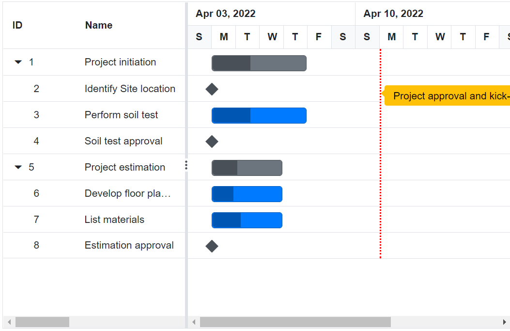

# Event Markers in Blazor Gantt Chart Component

The event markers in the Gantt Chart component is used to highlight the important events in a project. Event markers can be initialized by using the [GanttEventMarkers](https://help.syncfusion.com/cr/blazor/Syncfusion.Blazor.Gantt.GanttEventMarkers.html) property, and you can define date and label for the event markers using the `Day` and `Label` properties. You can also customize it using the `CssClass` properties. The following code example shows how to add event markers in the Gantt Chart component.

Event markers highlight significant project events by displaying vertical timeline indicators that span across the entire Gantt chart. These markers identify critical dates, milestones, deadlines, or important project events that affect multiple tasks or the overall project timeline, providing visual reference points for project-wide activities.

Understanding event markers implementation enables effective visualization of project-critical dates and enhances timeline awareness across all project phases.

Event markers utilize specific properties to define their positioning, appearance, and identification within the project timeline:

**Date positioning**: The [Day](https://help.syncfusion.com/cr/blazor/Syncfusion.Blazor.Gantt.GanttEventMarker.html#Syncfusion_Blazor_Gantt_GanttEventMarker_Day) property establishes the exact timeline date where the marker appears. This date value determines marker placement across the entire vertical timeline, ensuring accurate project event representation.

**Descriptive labeling**: The [Label](https://help.syncfusion.com/cr/blazor/Syncfusion.Blazor.Gantt.GanttEventMarker.html#Syncfusion_Blazor_Gantt_GanttEventMarker_Label) property provides descriptive text that identifies the marker's purpose or significance. Labels enhance user understanding by clearly indicating what project event the marker represents.

**Visual customization**: The [CssClass](https://help.syncfusion.com/cr/blazor/Syncfusion.Blazor.Gantt.GanttEventMarker.html#Syncfusion_Blazor_Gantt_GanttEventMarker_CssClass) property enables custom styling through CSS class applications. This property allows distinctive visual treatment for different marker types, supporting color coding, styling variations, and brand consistency.

## Event marker configuration

Event markers render as vertical lines positioned at specific dates across the entire Gantt timeline, distinguishing them from data markers which appear within individual task rows. This project-wide visibility ensures critical dates remain prominent regardless of the current view or task focus.

**Timeline integration**: Event markers integrate seamlessly with the Gantt timeline, appearing as vertical indicators that extend from the top to the bottom of the chart area. This comprehensive visibility ensures important dates remain visible during scrolling, zooming, or filtering operations.

**Multiple marker support**: The component supports multiple event markers simultaneously, allowing comprehensive tracking of various project-critical dates within the same timeline view. Each marker maintains independent configuration while sharing the common timeline space.

The following implementation demonstrates event marker integration within a Gantt chart, showcasing timeline-wide event highlighting:




@using Syncfusion.Blazor.Gantt
<SfGantt DataSource="@TaskCollection" Height="450px" Width="700px">
    <GanttTaskFields Id="TaskId" Name="TaskName" StartDate="StartDate" EndDate="EndDate"
            Duration="Duration" Progress="Progress" ParentID="ParentId">
    </GanttTaskFields>
    <GanttEventMarkers>
        <GanttEventMarker Day="@Event" Label="Project approval and kick-off"
            CssClass="e-custom-event-marker"></GanttEventMarker>
    </GanttEventMarkers>
</SfGantt>

@code{
    private DateTime Event = new DateTime(2022, 04, 11);
    private List<TaskData> TaskCollection { get; set; }
    protected override void OnInitialized()
    {
        this.TaskCollection = GetTaskCollection();
    }

    public class TaskData
    {
        public int TaskId { get; set; }
        public string TaskName { get; set; }
        public DateTime StartDate { get; set; }
        public DateTime? EndDate { get; set; }
        public string Duration { get; set; }
        public int Progress { get; set; }
        public int? ParentId { get; set; }
    }

    public static List<TaskData> GetTaskCollection()
    {
        List<TaskData> Tasks = new List<TaskData>()
        {
            new TaskData() { TaskId = 1, TaskName = "Project initiation", StartDate = new DateTime(2022, 04, 05), EndDate = new DateTime(2022, 04, 21), },
            new TaskData() { TaskId = 2, TaskName = "Identify Site location", StartDate = new DateTime(2022, 04, 05), Duration = "0", Progress = 30, ParentId = 1 },
            new TaskData() { TaskId = 3, TaskName = "Perform soil test", StartDate = new DateTime(2022, 04, 05), Duration = "4", Progress = 40, ParentId = 1 },
            new TaskData() { TaskId = 4, TaskName = "Soil test approval", StartDate = new DateTime(2022, 04, 05), Duration = "0", Progress = 30, ParentId = 1 },
            new TaskData() { TaskId = 5, TaskName = "Project estimation", StartDate = new DateTime(2022, 04, 06), EndDate = new DateTime(2022, 04, 21), },
            new TaskData() { TaskId = 6, TaskName = "Develop floor plan for estimation", StartDate = new DateTime(2022, 04, 06), Duration = "3", Progress = 30, ParentId = 5 },
            new TaskData() { TaskId = 7, TaskName = "List materials", StartDate = new DateTime(2022, 04, 06), Duration = "3", Progress = 40, ParentId = 5 },
            new TaskData() { TaskId = 8, TaskName = "Estimation approval", StartDate = new DateTime(2022, 04, 06), Duration = "0", Progress = 30, ParentId = 5 }
        };
        return Tasks;
    }
}






## See also

* [Display Striplines in Blazor Gantt](https://www.syncfusion.com/forums/175385/display-striplines-in-blazor-gantt)

N> You can refer to our [Blazor Gantt Chart](https://www.syncfusion.com/blazor-components/blazor-gantt-chart) feature tour page for its groundbreaking feature representations. You can also explore our [Blazor Gantt Chart example](https://blazor.syncfusion.com/demos/gantt-chart/default-functionalities?theme=bootstrap5) to know how to render and configure the Gantt.
