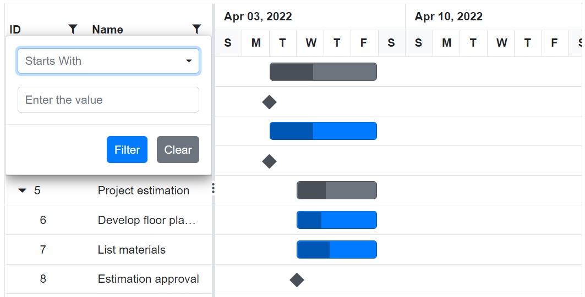
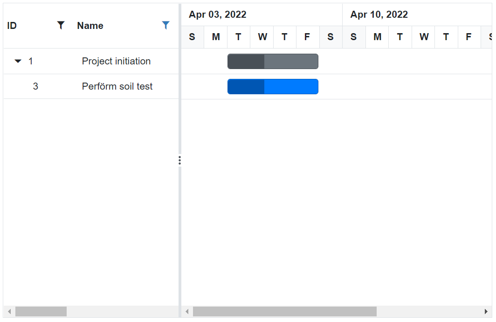
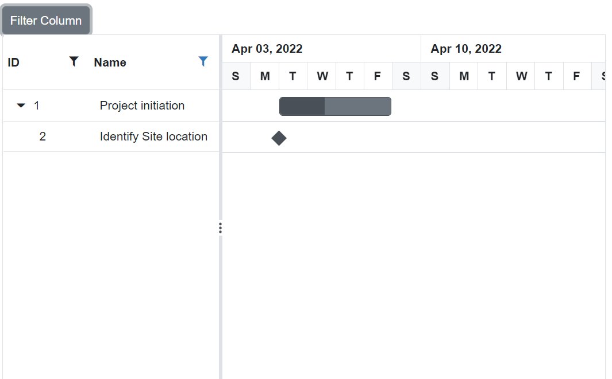

# Filtering in Blazor Gantt Chart Component

Filtering allows you to view specific or related records based on filter criteria. This can be done in the Gantt Chart component by using the filter menu and toolbar search. To enable filtering in the Gantt Chart component, set the [AllowFiltering](https://help.syncfusion.com/cr/blazor/Syncfusion.Blazor.Gantt.SfGantt-1.html#Syncfusion_Blazor_Gantt_SfGantt_1_AllowFiltering) to `true`. Menu filtering support can be configured using the `GanttFilterSettings` property and toolbar searching can be configured using the `GanttSearchSettings` property.


The [Blazor Gantt Chart](https://www.syncfusion.com/blazor-components/blazor-gantt-chart) component provides menu-filtering support for each column. You can enable the filter menu by setting the `AllowFiltering` to `true`. The filter menu UI will be rendered based on its column type, which allows you to filter data. You can filter the records with different operators.

```cshtml
@using Syncfusion.Blazor.Gantt
<SfGantt DataSource="@TaskCollection" Height="450px" Width="700px" AllowFiltering="true">
    <GanttTaskFields Id="TaskId" Name="TaskName" StartDate="StartDate" EndDate="EndDate" Duration="Duration" Progress="Progress" ParentID="ParentId">
    </GanttTaskFields>
</SfGantt>

@code{
    private List<TaskData> TaskCollection { get; set; }
    protected override void OnInitialized()
    {
        this.TaskCollection = GetTaskCollection();
    }

    public class TaskData
    {
        public int TaskId { get; set; }
        public string TaskName { get; set; }
        public DateTime StartDate { get; set; }
        public DateTime? EndDate { get; set; }
        public string Duration { get; set; }
        public int Progress { get; set; }
        public int? ParentId { get; set; }
    }

    public static List<TaskData> GetTaskCollection()
    {
        List<TaskData> Tasks = new List<TaskData>()
        {
            new TaskData() { TaskId = 1, TaskName = "Project initiation", StartDate = new DateTime(2022, 04, 05), EndDate = new DateTime(2022, 04, 21), },
            new TaskData() { TaskId = 2, TaskName = "Identify Site location", StartDate = new DateTime(2022, 04, 05), Duration = "0", Progress = 30, ParentId = 1 },
            new TaskData() { TaskId = 3, TaskName = "Perform soil test", StartDate = new DateTime(2022, 04, 05), Duration = "4", Progress = 40, ParentId = 1 },
            new TaskData() { TaskId = 4, TaskName = "Soil test approval", StartDate = new DateTime(2022, 04, 05), Duration = "0", Progress = 30, ParentId = 1 },
            new TaskData() { TaskId = 5, TaskName = "Project estimation", StartDate = new DateTime(2022, 04, 06), EndDate = new DateTime(2022, 04, 21), },
            new TaskData() { TaskId = 6, TaskName = "Develop floor plan for estimation", StartDate = new DateTime(2022, 04, 06), Duration = "3", Progress = 30, ParentId = 5 },
            new TaskData() { TaskId = 7, TaskName = "List materials", StartDate = new DateTime(2022, 04, 06), Duration = "3", Progress = 40, ParentId = 5 },
            new TaskData() { TaskId = 8, TaskName = "Estimation approval", StartDate = new DateTime(2022, 04, 06), Duration = "0", Progress = 30, ParentId = 5 },
        };
        return Tasks;
    }
}
```



N> The `AllowFiltering` property should be set to `true` to enable the filter menu. Setting the `GanttColumn.AllowFiltering` property to `false` prevents rendering the filter menu for a particular column.

## Filter hierarchy modes

The Gantt Chart supports a set of filtering modes with the [GanttFilterSettings.HierarchyMode](https://help.syncfusion.com/cr/blazor/Syncfusion.Blazor.Gantt.GanttFilterSettings.html#Syncfusion_Blazor_Gantt_GanttFilterSettings_HierarchyMode) property. The following are the types of filter hierarchy modes available in the Gantt Chart component:

* `Parent`: This is the default filter hierarchy mode in Gantt Chart. The filtered records are displayed with its parent records. If the filtered records do not have any parent record, then only the filtered records will be displayed.

* `Child`: Displays the filtered records with its child record. If the filtered records do not have any child record, then only the filtered records will be displayed.

* `Both`: Displays the filtered records with its both parent and child records. If the filtered records do not have any parent and child records, then only the filtered records will be displayed.

* `None`: Displays only the filtered records.

```cshtml
@using Syncfusion.Blazor.Gantt
<SfGantt DataSource="@TaskCollection" Height="450px" Width="700px" AllowFiltering="true">
    <GanttTaskFields Id="TaskId" Name="TaskName" StartDate="StartDate" EndDate="EndDate" Duration="Duration" Progress="Progress" ParentID="ParentId">
    </GanttTaskFields>
    <GanttFilterSettings HierarchyMode ="FilterHierarchyMode.None"></GanttFilterSettings>
</SfGantt>

@code{
    public List<TaskData> TaskCollection { get; set; }
    protected override void OnInitialized()
    {
        this.TaskCollection = GetTaskCollection();
    }

    public class TaskData
    {
        public int TaskId { get; set; }
        public string TaskName { get; set; }
        public DateTime StartDate { get; set; }
        public DateTime? EndDate { get; set; }
        public string Duration { get; set; }
        public int Progress { get; set; }
        public int? ParentId { get; set; }
    }

    public static List<TaskData> GetTaskCollection()
    {
        List<TaskData> Tasks = new List<TaskData>()
        {
            new TaskData() { TaskId = 1, TaskName = "Project initiation", StartDate = new DateTime(2022, 04, 05), EndDate = new DateTime(2022, 04, 21), },
            new TaskData() { TaskId = 2, TaskName = "Identify Site location", StartDate = new DateTime(2022, 04, 05), Duration = "0", Progress = 30, ParentId = 1 },
            new TaskData() { TaskId = 3, TaskName = "Perform soil test", StartDate = new DateTime(2022, 04, 05), Duration = "4", Progress = 40, ParentId = 1 },
            new TaskData() { TaskId = 4, TaskName = "Soil test approval", StartDate = new DateTime(2022, 04, 05), Duration = "0", Progress = 30, ParentId = 1 },
            new TaskData() { TaskId = 5, TaskName = "Project estimation", StartDate = new DateTime(2022, 04, 06), EndDate = new DateTime(2022, 04, 21), },
            new TaskData() { TaskId = 6, TaskName = "Develop floor plan for estimation", StartDate = new DateTime(2022, 04, 06), Duration = "3", Progress = 30, ParentId = 5 },
            new TaskData() { TaskId = 7, TaskName = "List materials", StartDate = new DateTime(2022, 04, 06), Duration = "3", Progress = 40, ParentId = 5 },
            new TaskData() { TaskId = 8, TaskName = "Estimation approval", StartDate = new DateTime(2022, 04, 06), Duration = "0", Progress = 30, ParentId = 5 },
        };
        return Tasks;
    }
}
```


## Initial filter

To apply the filter at initial rendering, set the filter `Predicate` collections in the [GanttFilterSettings.Columns](https://help.syncfusion.com/cr/blazor/Syncfusion.Blazor.Gantt.GanttFilterSettings.html#Syncfusion_Blazor_Gantt_GanttFilterSettings_Columns) property.

```cshtml
@using Syncfusion.Blazor
@using Syncfusion.Blazor.Gantt
@using Syncfusion.Blazor.Grids
<SfGantt DataSource="@TaskCollection" Height="450px" Width="700px" AllowFiltering="true">
    <GanttTaskFields Id="TaskId" Name="TaskName" StartDate="StartDate" EndDate="EndDate" Duration="Duration" Progress="Progress" ParentID="ParentId">
    </GanttTaskFields>
    <GanttFilterSettings Columns="@FilterColumns"></GanttFilterSettings>
</SfGantt>

@code{
    private List<TaskData> TaskCollection { get; set; }
    public List<PredicateModel> FilterColumns { get; set; } = new List<PredicateModel>
    {
        new PredicateModel() { Field = "TaskName", MatchCase=false, Operator = Operator.StartsWith, Predicate = "and", Value = "Identify" },
        new PredicateModel() { Field = "TaskId", MatchCase=false, Operator = Operator.Equal, Predicate = "and", Value = 2 }
    };
    protected override void OnInitialized()
    {
        this.TaskCollection = GetTaskCollection();
    }

    public class TaskData
    {
        public int TaskId { get; set; }
        public string TaskName { get; set; }
        public DateTime StartDate { get; set; }
        public DateTime? EndDate { get; set; }
        public string Duration { get; set; }
        public int Progress { get; set; }
        public int? ParentId { get; set; }
    }

    public static List<TaskData> GetTaskCollection()
    {
        List<TaskData> Tasks = new List<TaskData>()
        {
            new TaskData() { TaskId = 1, TaskName = "Project initiation", StartDate = new DateTime(2022, 04, 05), EndDate = new DateTime(2022, 04, 21), },
            new TaskData() { TaskId = 2, TaskName = "Identify Site location", StartDate = new DateTime(2022, 04, 05), Duration = "0", Progress = 30, ParentId = 1 },
            new TaskData() { TaskId = 3, TaskName = "Perform soil test", StartDate = new DateTime(2022, 04, 05), Duration = "4", Progress = 40, ParentId = 1 },
            new TaskData() { TaskId = 4, TaskName = "Soil test approval", StartDate = new DateTime(2022, 04, 05), Duration = "0", Progress = 30, ParentId = 1 },
            new TaskData() { TaskId = 5, TaskName = "Project estimation", StartDate = new DateTime(2022, 04, 06), EndDate = new DateTime(2022, 04, 21), },
            new TaskData() { TaskId = 6, TaskName = "Develop floor plan for estimation", StartDate = new DateTime(2022, 04, 06), Duration = "3", Progress = 30, ParentId = 5 },
            new TaskData() { TaskId = 7, TaskName = "List materials", StartDate = new DateTime(2022, 04, 06), Duration = "3", Progress = 40, ParentId = 5 },
            new TaskData() { TaskId = 8, TaskName = "Estimation approval", StartDate = new DateTime(2022, 04, 06), Duration = "0", Progress = 30, ParentId = 5 },
        };
        return Tasks;
    }
}
```


## Filter operators

The filter operator for a column can be defined in the [GanttFilterSettings.Columns.Operator](https://help.syncfusion.com/cr/blazor/Syncfusion.Blazor.Gantt.GanttFilterSettings.html#Syncfusion_Blazor_Gantt_GanttFilterSettings_Operators) property.

The available operators and their supported data types are:

Operator |Description |Supported Types
-----|-----|-----
startswith |Checks whether the value begins with the specified value. |String
endswith |Checks whether the value ends with the specified value. |String
contains |Checks whether the value contains the specified value. |String
equal |Checks whether the value is equal to the specified value. |String &#124; Number &#124; Boolean &#124; Date
notequal |Checks for the values that are not equal to the specified value. |String &#124; Number &#124; Boolean &#124; Date
greaterthan |Checks whether the value is greater than the specified value. |Number &#124; Date
greaterthanorequal|Checks whether the value is greater than or equal to the specified value. |Number &#124; Date
lessthan |Checks whether the value is less than the specified value. |Number &#124; Date
lessthanorequal |Checks whether the value is less than or equal to the specified value. |Number &#124; Date

N> By default, the `GanttFilterSettings.Columns.Operator` value is `equal`

## Diacritics

By default, the Gantt Chart component ignores the diacritic characters while filtering. To include diacritic characters, set the [GanttFilterSettings.IgnoreAccent](https://help.syncfusion.com/cr/blazor/Syncfusion.Blazor.Gantt.GanttFilterSettings.html#Syncfusion_Blazor_Gantt_GanttFilterSettings_IgnoreAccent) to true.

In the following sample, type **Perform** in the **TaskName** column to filter diacritic characters.

```cshtml
@using Syncfusion.Blazor.Gantt
<SfGantt DataSource="@TaskCollection" Height="450px" Width="700px" AllowFiltering="true">
    <GanttTaskFields Id="TaskId" Name="TaskName" StartDate="StartDate" EndDate="EndDate" Duration="Duration" Progress="Progress" ParentID="ParentId">
    </GanttTaskFields>
    <GanttFilterSettings IgnoreAccent="true"></GanttFilterSettings>
</SfGantt>

@code{
    public List<TaskData> TaskCollection { get; set; }
    protected override void OnInitialized()
    {
        this.TaskCollection = GetTaskCollection();
    }

    public class TaskData
    {
        public int TaskId { get; set; }
        public string TaskName { get; set; }
        public DateTime StartDate { get; set; }
        public DateTime? EndDate { get; set; }
        public string Duration { get; set; }
        public int Progress { get; set; }
        public int? ParentId { get; set; }
    }

    public static List<TaskData> GetTaskCollection()
    {
        List<TaskData> Tasks = new List<TaskData>()
        {
            new TaskData() { TaskId = 1, TaskName = "Project initiation", StartDate = new DateTime(2022, 04, 05), EndDate = new DateTime(2022, 04, 21), },
            new TaskData() { TaskId = 2, TaskName = "Identify site locàtion", StartDate = new DateTime(2022, 04, 05), Duration = "0", Progress = 30, ParentId = 1 },
            new TaskData() { TaskId = 3, TaskName = "Perförm soil test", StartDate = new DateTime(2022, 04, 05), Duration = "4", Progress = 40, ParentId = 1 },
            new TaskData() { TaskId = 4, TaskName = "Soil tëst appröval", StartDate = new DateTime(2022, 04, 05), Duration = "0", Progress = 30, ParentId = 1 },
            new TaskData() { TaskId = 5, TaskName = "Project estimation", StartDate = new DateTime(2022, 04, 06), EndDate = new DateTime(2022, 04, 21), },
            new TaskData() { TaskId = 6, TaskName = "Develop floor plan for estimation", StartDate = new DateTime(2022, 04, 06), Duration = "3", Progress = 30, ParentId = 5 },
            new TaskData() { TaskId = 7, TaskName = "List materials", StartDate = new DateTime(2022, 04, 06), Duration = "3", Progress = 40, ParentId = 5 },
            new TaskData() { TaskId = 8, TaskName = "Estimation approval", StartDate = new DateTime(2022, 04, 06), Duration = "0", Progress = 30, ParentId = 5 },
        };
        return Tasks;
    }
}
```



## Filtering a specific column by method

You can filter the columns dynamically by using the [FilterByColumnAsync](https://help.syncfusion.com/cr/blazor/Syncfusion.Blazor.Gantt.SfGantt-1.html#Syncfusion_Blazor_Gantt_SfGantt_1_FilterByColumnAsync_System_String_System_String_System_String_) method.

```cshtml
@using Syncfusion.Blazor.Gantt
@using Syncfusion.Blazor.Buttons

<SfButton @onclick="Filter">Filter Column</SfButton>
<SfGantt @ref="Gantt" DataSource="@TaskCollection" Height="450px" Width="700px" AllowFiltering="true">
    <GanttTaskFields Id="TaskId" Name="TaskName" StartDate="StartDate" EndDate="EndDate" Duration="Duration" Progress="Progress" ParentID="ParentId">
    </GanttTaskFields>
</SfGantt>

@code{
    public SfGantt<TaskData> Gantt;
    public async void Filter()
    {
        await this.Gantt.FilterByColumnAsync("TaskName", "startswith", "Iden", "or", true, false);
    }
    private List<TaskData> TaskCollection { get; set; }
    protected override void OnInitialized()
    {
        this.TaskCollection = GetTaskCollection();
    }

    public class TaskData
    {
        public int TaskId { get; set; }
        public string TaskName { get; set; }
        public DateTime StartDate { get; set; }
        public DateTime? EndDate { get; set; }
        public string Duration { get; set; }
        public int Progress { get; set; }
        public int? ParentId { get; set; }
    }

    public static List<TaskData> GetTaskCollection()
    {
        List<TaskData> Tasks = new List<TaskData>()
        {
            new TaskData() { TaskId = 1, TaskName = "Project initiation", StartDate = new DateTime(2022, 04, 05), EndDate = new DateTime(2022, 04, 21), },
            new TaskData() { TaskId = 2, TaskName = "Identify Site location", StartDate = new DateTime(2022, 04, 05), Duration = "0", Progress = 30, ParentId = 1 },
            new TaskData() { TaskId = 3, TaskName = "Perform soil test", StartDate = new DateTime(2022, 04, 05), Duration = "4", Progress = 40, ParentId = 1 },
            new TaskData() { TaskId = 4, TaskName = "Soil test approval", StartDate = new DateTime(2022, 04, 05), Duration = "0", Progress = 30, ParentId = 1 },
            new TaskData() { TaskId = 5, TaskName = "Project estimation", StartDate = new DateTime(2022, 04, 06), EndDate = new DateTime(2022, 04, 21), },
            new TaskData() { TaskId = 6, TaskName = "Develop floor plan for estimation", StartDate = new DateTime(2022, 04, 06), Duration = "3", Progress = 30, ParentId = 5 },
            new TaskData() { TaskId = 7, TaskName = "List materials", StartDate = new DateTime(2022, 04, 06), Duration = "3", Progress = 40, ParentId = 5 },
            new TaskData() { TaskId = 8, TaskName = "Estimation approval", StartDate = new DateTime(2022, 04, 06), Duration = "0", Progress = 30, ParentId = 5 },
        };
        return Tasks;
    }
}
```



## Clear filtered columns

You can clear all the filtering condition done in the Gantt Chart component by using the [ClearFilteringAsync](https://help.syncfusion.com/cr/blazor/Syncfusion.Blazor.Gantt.SfGantt-1.html#Syncfusion_Blazor_Gantt_SfGantt_1_ClearFilteringAsync) method.

The following code snippet explains the above behavior.

```cshtml
@using Syncfusion.Blazor
@using Syncfusion.Blazor.Gantt
@using Syncfusion.Blazor.Grids
@using Syncfusion.Blazor.Buttons

<SfButton @onclick="ClearFilter">Clear Filter</SfButton>
<SfGantt @ref="Gantt" DataSource="@TaskCollection" Height="450px" Width="700px" AllowFiltering="true">
    <GanttTaskFields Id="TaskId" Name="TaskName" StartDate="StartDate" EndDate="EndDate" Duration="Duration" Progress="Progress" ParentID="ParentId">
    </GanttTaskFields>
    <GanttFilterSettings Columns="@FilterColumns"></GanttFilterSettings>
</SfGantt>

@code{
    public List<PredicateModel> FilterColumns { get; set; } = new List<PredicateModel>
    {
        new PredicateModel() { Field = "TaskName", MatchCase=false, Operator = Operator.StartsWith, Predicate = "and",
        Value = "Identify" },
        new PredicateModel() { Field = "TaskId", MatchCase=false, Operator = Operator.Equal, Predicate = "and", Value = 2 }
    };
    public SfGantt<TaskData> Gantt;
    public void ClearFilter()
    {
        this.Gantt.ClearFilteringAsync();
    }
    private List<TaskData> TaskCollection { get; set; }
    protected override void OnInitialized()
    {
        this.TaskCollection = GetTaskCollection();
    }

    public class TaskData
    {
        public int TaskId { get; set; }
        public string TaskName { get; set; }
        public DateTime StartDate { get; set; }
        public DateTime? EndDate { get; set; }
        public string Duration { get; set; }
        public int Progress { get; set; }
        public int? ParentId { get; set; }
    }

    public static List<TaskData> GetTaskCollection()
    {
        List<TaskData> Tasks = new List<TaskData>()
        {
            new TaskData() { TaskId = 1, TaskName = "Project initiation", StartDate = new DateTime(2022, 04, 05), EndDate = new DateTime(2022, 04, 21), },
            new TaskData() { TaskId = 2, TaskName = "Identify Site location", StartDate = new DateTime(2022, 04, 05), Duration = "0", Progress = 30, ParentId = 1 },
            new TaskData() { TaskId = 3, TaskName = "Perform soil test", StartDate = new DateTime(2022, 04, 05), Duration = "4", Progress = 40, ParentId = 1 },
            new TaskData() { TaskId = 4, TaskName = "Soil test approval", StartDate = new DateTime(2022, 04, 05), Duration = "0", Progress = 30, ParentId = 1 },
            new TaskData() { TaskId = 5, TaskName = "Project estimation", StartDate = new DateTime(2022, 04, 06), EndDate = new DateTime(2022, 04, 21), },
            new TaskData() { TaskId = 6, TaskName = "Develop floor plan for estimation", StartDate = new DateTime(2022, 04, 06), Duration = "3", Progress = 30, ParentId = 5 },
            new TaskData() { TaskId = 7, TaskName = "List materials", StartDate = new DateTime(2022, 04, 06), Duration = "3", Progress = 40, ParentId = 5 },
            new TaskData() { TaskId = 8, TaskName = "Estimation approval", StartDate = new DateTime(2022, 04, 06), Duration = "0", Progress = 30, ParentId = 5 },
        };
        return Tasks;
    }
}
```


