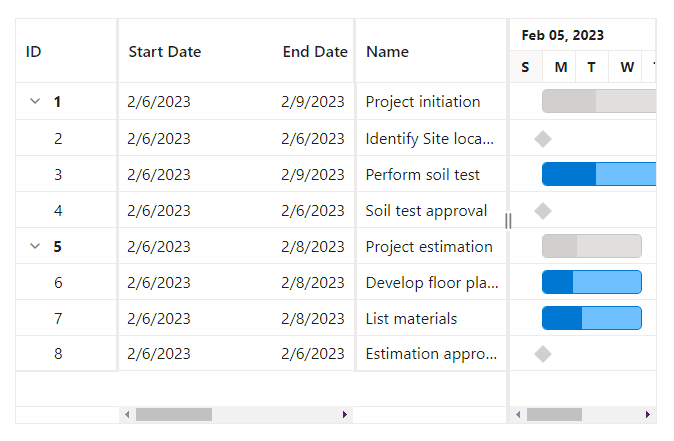

# Frozen columns in Blazor Gantt Component

The frozen columns feature in the Syncfusion&reg; Blazor Gantt Chart provides the ability to fix certain columns on the left-hand side of the grid in gantt chart while the user scrolls horizontally. This feature improves the readability and allows for easier navigation.

To enable frozen columns, use the [FrozenColumns](https://help.syncfusion.com/cr/blazor/Syncfusion.Blazor.Gantt.SfGantt-1.html#Syncfusion_Blazor_Gantt_SfGantt_1_FrozenColumns) property of the Gantt component. In the example code provided, the FrozenColumns value is set to 2, which means that the first two columns of the grid will remain fixed while the user scrolls horizontally.




@using Syncfusion.Blazor.Gantt
<SfGantt DataSource="@TaskCollection" Height="450px" Width="700px" FrozenColumns="2">
    <GanttTaskFields Id="TaskID" Name="TaskName" StartDate="StartDate" EndDate="EndDate" Duration="Duration" Progress="Progress" ParentID="ParentID">
    </GanttTaskFields>
    <GanttSplitterSettings Position ="70%"></GanttSplitterSettings>
</SfGantt>

@code {
    private List<TaskData> TaskCollection { get; set; }
    protected override void OnInitialized()
    {
        this.TaskCollection = GetTaskCollection();
    }

    public class TaskData
    {
        public int TaskID { get; set; }
        public string TaskName { get; set; }
        public DateTime StartDate { get; set; }
        public DateTime? EndDate { get; set; }
        public string Duration { get; set; }
        public int Progress { get; set; }
        public int? ParentID { get; set; }
    }

    public static List<TaskData> GetTaskCollection()
    {
        List<TaskData> Tasks = new List<TaskData>() {
        new TaskData() { TaskID = 1, TaskName = "Project initiation", StartDate = new DateTime(2023, 02, 06), EndDate = new DateTime(2022, 02, 09) },
        new TaskData() { TaskID = 2, TaskName = "Identify Site location", StartDate = new DateTime(2023, 02, 06), Duration = "0", Progress = 30, ParentID = 1 },
        new TaskData() { TaskID = 3, TaskName = "Perform soil test", StartDate = new DateTime(2023, 02, 06), Duration = "4", Progress = 40, ParentID = 1 },
        new TaskData() { TaskID = 4, TaskName = "Soil test approval", StartDate = new DateTime(2023, 02, 06), Duration = "0", Progress = 30, ParentID = 1 },
        new TaskData() { TaskID = 5, TaskName = "Project estimation", StartDate = new DateTime(2023, 02, 06), EndDate = new DateTime(2023, 02, 08) },
        new TaskData() { TaskID = 6, TaskName = "Develop floor plan for estimation", StartDate = new DateTime(2023, 02, 06), Duration = "3", Progress = 30, ParentID = 5 },
        new TaskData() { TaskID = 7, TaskName = "List materials", StartDate = new DateTime(2023, 02, 06), Duration = "3", Progress = 40, ParentID = 5 },
        new TaskData() { TaskID = 8, TaskName = "Estimation approval", StartDate = new DateTime(2023, 02, 06), Duration = "0", Progress = 30, ParentID = 5 }
    };
        return Tasks;
    }
}






## Freeze particular column

To freeze a specific column in the Gantt Chart, you can use the [IsFrozen](https://help.syncfusion.com/cr/blazor/Syncfusion.Blazor.Gantt.GanttColumn.html#Syncfusion_Blazor_Gantt_GanttColumn_IsFrozen) property of the [GanttColumn](https://help.syncfusion.com/cr/blazor/Syncfusion.Blazor.Gantt.GanttColumn.html) component.

In the following code snippet, the columns with the field names `TaskID` and `TaskName` are frozen by setting the IsFrozen property of the corresponding GanttColumn to true:




@using Syncfusion.Blazor.Gantt
<SfGantt DataSource="@TaskCollection" Height="450px" Width="700px" >
    <GanttTaskFields Id="TaskID" Name="TaskName" StartDate="StartDate" EndDate="EndDate" Duration="Duration" Progress="Progress" ParentID="ParentID">
    </GanttTaskFields>
    <GanttColumns>
        <GanttColumn Field="TaskID" IsFrozen=true></GanttColumn>
        <GanttColumn Field="TaskName" IsFrozen=true></GanttColumn>
        <GanttColumn Field="StartDate"></GanttColumn>
        <GanttColumn Field="EndDate"></GanttColumn>
        <GanttColumn Field="Duration"></GanttColumn>
        <GanttColumn Field="Progress"></GanttColumn>
    </GanttColumns>
    <GanttSplitterSettings Position="70%"></GanttSplitterSettings>
</SfGantt>

@code {
    private List<TaskData> TaskCollection { get; set; }
    protected override void OnInitialized()
    {
        this.TaskCollection = GetTaskCollection();
    }

    public class TaskData
    {
        public int TaskID { get; set; }
        public string TaskName { get; set; }
        public DateTime StartDate { get; set; }
        public DateTime? EndDate { get; set; }
        public string Duration { get; set; }
        public int Progress { get; set; }
        public int? ParentID { get; set; }
    }

    public static List<TaskData> GetTaskCollection()
    {
        List<TaskData> Tasks = new List<TaskData>() {
        new TaskData() { TaskID = 1, TaskName = "Project initiation", StartDate = new DateTime(2023, 02, 06), EndDate = new DateTime(2022, 02, 09) },
        new TaskData() { TaskID = 2, TaskName = "Identify Site location", StartDate = new DateTime(2023, 02, 06), Duration = "0", Progress = 30, ParentID = 1 },
        new TaskData() { TaskID = 3, TaskName = "Perform soil test", StartDate = new DateTime(2023, 02, 06), Duration = "4", Progress = 40, ParentID = 1 },
        new TaskData() { TaskID = 4, TaskName = "Soil test approval", StartDate = new DateTime(2023, 02, 06), Duration = "0", Progress = 30, ParentID = 1 },
        new TaskData() { TaskID = 5, TaskName = "Project estimation", StartDate = new DateTime(2023, 02, 06), EndDate = new DateTime(2023, 02, 08) },
        new TaskData() { TaskID = 6, TaskName = "Develop floor plan for estimation", StartDate = new DateTime(2023, 02, 06), Duration = "3", Progress = 30, ParentID = 5 },
        new TaskData() { TaskID = 7, TaskName = "List materials", StartDate = new DateTime(2023, 02, 06), Duration = "3", Progress = 40, ParentID = 5 },
        new TaskData() { TaskID = 8, TaskName = "Estimation approval", StartDate = new DateTime(2023, 02, 06), Duration = "0", Progress = 30, ParentID = 5 }
    };
        return Tasks;
    }
}






## Freeze direction

The [Freeze](https://help.syncfusion.com/cr/blazor/Syncfusion.Blazor.Gantt.GanttColumn.html#Syncfusion_Blazor_Gantt_GanttColumn_Freeze) property in the `GanttColumn` allows you to freeze the column either the left or right side of the grid while the remaining columns remain movable. The `IsFrozen` property should be set to true for the frozen columns.

The [FreezeDirection](https://help.syncfusion.com/cr/blazor/Syncfusion.Blazor.Grids.FreezeDirection.html) property has two values: [FreezeDirection.Left](https://help.syncfusion.com/cr/blazor/Syncfusion.Blazor.Grids.FreezeDirection.html#Syncfusion_Blazor_Grids_FreezeDirection_Left) allows you to freeze columns on the left side, while [FreezeDirection.Right](https://help.syncfusion.com/cr/blazor/Syncfusion.Blazor.Grids.FreezeDirection.html#Syncfusion_Blazor_Grids_FreezeDirection_Right) allows you to freeze columns on the right side.

To use `FreezeDirection` in the Blazor Gantt chart, you need to set `IsFrozen` property of GanttColumn in addition to the `Freeze` property. In the below code sample , the `TaskID` column is frozen on the left side of the grid, while the `TaskName` column is frozen on the right side.

The following is the sample code for using `FreezeDirection` in the Blazor Gantt chart:




@using Syncfusion.Blazor.Gantt
<SfGantt DataSource="@TaskCollection" Height="450px" Width="700px" >
    <GanttTaskFields Id="TaskID" Name="TaskName" StartDate="StartDate" EndDate="EndDate" Duration="Duration" Progress="Progress" ParentID="ParentID">
    </GanttTaskFields>
    <GanttColumns>
        <GanttColumn Field="TaskID" IsFrozen=true Freeze="Syncfusion.Blazor.Grids.FreezeDirection.Left"></GanttColumn>
        <GanttColumn Field="TaskName" IsFrozen=true Freeze="Syncfusion.Blazor.Grids.FreezeDirection.Right"></GanttColumn>
        <GanttColumn Field="StartDate"></GanttColumn>
        <GanttColumn Field="EndDate"></GanttColumn>
        <GanttColumn Field="Duration"></GanttColumn>
        <GanttColumn Field="Progress"></GanttColumn>
    </GanttColumns>
    <GanttSplitterSettings Position="50%"></GanttSplitterSettings>
</SfGantt>

@code {
    private List<TaskData> TaskCollection { get; set; }
    protected override void OnInitialized()
    {
        this.TaskCollection = GetTaskCollection();
    }

    public class TaskData
    {
        public int TaskID { get; set; }
        public string TaskName { get; set; }
        public DateTime StartDate { get; set; }
        public DateTime? EndDate { get; set; }
        public string Duration { get; set; }
        public int Progress { get; set; }
        public int? ParentID { get; set; }
    }

    public static List<TaskData> GetTaskCollection()
    {
        List<TaskData> Tasks = new List<TaskData>() {
        new TaskData() { TaskID = 1, TaskName = "Project initiation", StartDate = new DateTime(2023, 02, 06), EndDate = new DateTime(2022, 02, 09) },
        new TaskData() { TaskID = 2, TaskName = "Identify Site location", StartDate = new DateTime(2023, 02, 06), Duration = "0", Progress = 30, ParentID = 1 },
        new TaskData() { TaskID = 3, TaskName = "Perform soil test", StartDate = new DateTime(2023, 02, 06), Duration = "4", Progress = 40, ParentID = 1 },
        new TaskData() { TaskID = 4, TaskName = "Soil test approval", StartDate = new DateTime(2023, 02, 06), Duration = "0", Progress = 30, ParentID = 1 },
        new TaskData() { TaskID = 5, TaskName = "Project estimation", StartDate = new DateTime(2023, 02, 06), EndDate = new DateTime(2023, 02, 08) },
        new TaskData() { TaskID = 6, TaskName = "Develop floor plan for estimation", StartDate = new DateTime(2023, 02, 06), Duration = "3", Progress = 30, ParentID = 5 },
        new TaskData() { TaskID = 7, TaskName = "List materials", StartDate = new DateTime(2023, 02, 06), Duration = "3", Progress = 40, ParentID = 5 },
        new TaskData() { TaskID = 8, TaskName = "Estimation approval", StartDate = new DateTime(2023, 02, 06), Duration = "0", Progress = 30, ParentID = 5 }
    };
        return Tasks;
    }
}






## Add or remove frozen columns by dragging the column separator

The Gantt Chart allows users to add or remove frozen columns by dragging and dropping the column separator. The column separator is a draggable line that separates the frozen columns from the non-frozen columns in the Gantt Chart. It is displayed as a vertical line between the columns.

To enable this feature, you need to set the [AllowFreezeLineMoving](https://help.syncfusion.com/cr/blazor/Syncfusion.Blazor.Gantt.SfGantt-1.html#Syncfusion_Blazor_Gantt_SfGantt_1_AllowFreezeLineMoving) property to true. If no columns are specified as frozen, the frozen column separator will be displayed at the left and right ends of the grid in Gantt Chart.




@using Syncfusion.Blazor.Gantt
<SfGantt DataSource="@TaskCollection" Height="450px" Width="700px" AllowFreezeLineMoving=true>
    <GanttTaskFields Id="TaskID" Name="TaskName" StartDate="StartDate" EndDate="EndDate" Duration="Duration" Progress="Progress" ParentID="ParentID">
    </GanttTaskFields>
    <GanttColumns>
        <GanttColumn Field="TaskID" IsFrozen=true Freeze="Syncfusion.Blazor.Grids.FreezeDirection.Left"></GanttColumn>
        <GanttColumn Field="TaskName" IsFrozen=true Freeze="Syncfusion.Blazor.Grids.FreezeDirection.Right"></GanttColumn>
        <GanttColumn Field="StartDate"></GanttColumn>
        <GanttColumn Field="EndDate"></GanttColumn>
        <GanttColumn Field="Duration"></GanttColumn>
        <GanttColumn Field="Progress"></GanttColumn>
    </GanttColumns>
    <GanttSplitterSettings Position="70%"></GanttSplitterSettings>
</SfGantt>

@code {
    private List<TaskData> TaskCollection { get; set; }
    protected override void OnInitialized()
    {
        this.TaskCollection = GetTaskCollection();
    }

    public class TaskData
    {
        public int TaskID { get; set; }
        public string TaskName { get; set; }
        public DateTime StartDate { get; set; }
        public DateTime? EndDate { get; set; }
        public string Duration { get; set; }
        public int Progress { get; set; }
        public int? ParentID { get; set; }
    }

    public static List<TaskData> GetTaskCollection()
    {
        List<TaskData> Tasks = new List<TaskData>() {
        new TaskData() { TaskID = 1, TaskName = "Project initiation", StartDate = new DateTime(2023, 02, 06), EndDate = new DateTime(2022, 02, 09) },
        new TaskData() { TaskID = 2, TaskName = "Identify Site location", StartDate = new DateTime(2023, 02, 06), Duration = "0", Progress = 30, ParentID = 1 },
        new TaskData() { TaskID = 3, TaskName = "Perform soil test", StartDate = new DateTime(2023, 02, 06), Duration = "4", Progress = 40, ParentID = 1 },
        new TaskData() { TaskID = 4, TaskName = "Soil test approval", StartDate = new DateTime(2023, 02, 06), Duration = "0", Progress = 30, ParentID = 1 },
        new TaskData() { TaskID = 5, TaskName = "Project estimation", StartDate = new DateTime(2023, 02, 06), EndDate = new DateTime(2023, 02, 08) },
        new TaskData() { TaskID = 6, TaskName = "Develop floor plan for estimation", StartDate = new DateTime(2023, 02, 06), Duration = "3", Progress = 30, ParentID = 5 },
        new TaskData() { TaskID = 7, TaskName = "List materials", StartDate = new DateTime(2023, 02, 06), Duration = "3", Progress = 40, ParentID = 5 },
        new TaskData() { TaskID = 8, TaskName = "Estimation approval", StartDate = new DateTime(2023, 02, 06), Duration = "0", Progress = 30, ParentID = 5 }
    };
        return Tasks;
    }
}






## Change default frozen line color

The following code example shows how to change the color of the default frozen line in the Gantt Chart by customizing the CSS styles. The following demo provides an example of how to change the default frozen line color to blue.




@using Syncfusion.Blazor.Gantt
<SfGantt DataSource="@TaskCollection" Height="450px" Width="700px" FrozenColumns="2" AllowFreezeLineMoving=true>
    <GanttTaskFields Id="TaskID" Name="TaskName" StartDate="StartDate" EndDate="EndDate" Duration="Duration" Progress="Progress" ParentID="ParentID">
    </GanttTaskFields>
    <GanttSplitterSettings Position="60%"></GanttSplitterSettings>
</SfGantt>

@code {
    private List<TaskData> TaskCollection { get; set; }
    protected override void OnInitialized()
    {
        this.TaskCollection = GetTaskCollection();
    }

    public class TaskData
    {
        public int TaskID { get; set; }
        public string TaskName { get; set; }
        public DateTime StartDate { get; set; }
        public DateTime? EndDate { get; set; }
        public string Duration { get; set; }
        public int Progress { get; set; }
        public int? ParentID { get; set; }
    }

    public static List<TaskData> GetTaskCollection()
    {
        List<TaskData> Tasks = new List<TaskData>() {
        new TaskData() { TaskID = 1, TaskName = "Project initiation", StartDate = new DateTime(2023, 02, 06), EndDate = new DateTime(2022, 02, 09) },
        new TaskData() { TaskID = 2, TaskName = "Identify Site location", StartDate = new DateTime(2023, 02, 06), Duration = "0", Progress = 30, ParentID = 1 },
        new TaskData() { TaskID = 3, TaskName = "Perform soil test", StartDate = new DateTime(2023, 02, 06), Duration = "4", Progress = 40, ParentID = 1 },
        new TaskData() { TaskID = 4, TaskName = "Soil test approval", StartDate = new DateTime(2023, 02, 06), Duration = "0", Progress = 30, ParentID = 1 },
        new TaskData() { TaskID = 5, TaskName = "Project estimation", StartDate = new DateTime(2023, 02, 06), EndDate = new DateTime(2023, 02, 08) },
        new TaskData() { TaskID = 6, TaskName = "Develop floor plan for estimation", StartDate = new DateTime(2023, 02, 06), Duration = "3", Progress = 30, ParentID = 5 },
        new TaskData() { TaskID = 7, TaskName = "List materials", StartDate = new DateTime(2023, 02, 06), Duration = "3", Progress = 40, ParentID = 5 },
        new TaskData() { TaskID = 8, TaskName = "Estimation approval", StartDate = new DateTime(2023, 02, 06), Duration = "0", Progress = 30, ParentID = 5 }
    };
        return Tasks;
    }
}






## Limitations

- The [Freeze](https://help.syncfusion.com/cr/blazor/Syncfusion.Blazor.Gantt.GanttColumn.html#Syncfusion_Blazor_Gantt_GanttColumn_Freeze) and [FrozenColumns](https://help.syncfusion.com/cr/blazor/Syncfusion.Blazor.Gantt.SfGantt-1.html#Syncfusion_Blazor_Gantt_SfGantt_1_FrozenColumns) properties cannot be used together as they are incompatible.

- The Gantt Chart does not support Right-to-Left (RTL) mode when using frozen columns.