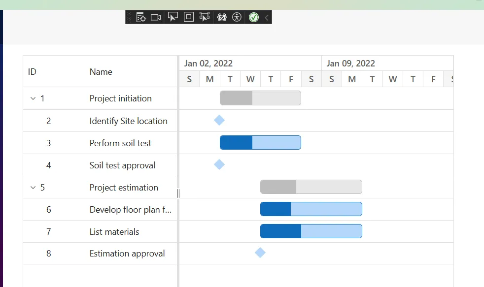

# Getting Started with Blazor GanttChart

This section explains you through the step-by-step process of integrating the [Syncfusion<sup style="font-size:70%">&reg;</sup> Blazor Gantt Chart](https://www.syncfusion.com/blazor-components/blazor-gantt-chart) component into your Blazor MAUI application using both [Visual Studio](https://visualstudio.microsoft.com/vs/) and [Visual Studio Code](https://code.visualstudio.com/).

> **Ready to streamline your Syncfusion<sup style="font-size:70%">&reg;</sup> Blazor development?** <br/>Discover the full potential of Syncfusion<sup style="font-size:70%">&reg;</sup> Blazor components with Syncfusion<sup style="font-size:70%">&reg;</sup> AI Coding Assistants. Effortlessly integrate, configure, and enhance your projects with intelligent, context-aware code suggestions, streamlined setups, and real-time insights—all seamlessly integrated into your preferred AI-powered IDEs like VS Code, Cursor, Syncfusion<sup style="font-size:70%">&reg;</sup> CodeStudio and more. [Explore Syncfusion<sup style="font-size:70%">&reg;</sup> AI Coding Assistants](https://blazor.syncfusion.com/documentation/ai-coding-assistants/overview)





## Prerequisites

To use the MAUI project templates, install the Mobile development with the .NET extension for Visual Studio. For more details, refer to [here](https://learn.microsoft.com/en-us/dotnet/MAUI/get-started/installation?tabs=vswin) or the [Syncfusion® Blazor Extension](https://blazor.syncfusion.com/documentation/visual-studio-integration/template-studio).

## Create a new Blazor MAUI app

Create a Blazor MAUI App using Visual Studio via [Microsoft Templates](https://learn.microsoft.com/en-us/dotnet/maui/get-started/first-app?pivots=devices-windows&view=net-maui-9.0&tabs=vswin). For detailed instructions, refer to the [Blazor MAUI App Getting Started](https://blazor.syncfusion.com/documentation/getting-started/maui-blazor-app) documentation.

## Install Syncfusion<sup style="font-size:70%">&reg;</sup> Blazor packages

Install [Syncfusion.Blazor.Gantt](https://www.nuget.org/packages/Syncfusion.Blazor.Gantt) and [Syncfusion.Blazor.Themes](https://www.nuget.org/packages/Syncfusion.Blazor.Themes/) NuGet packages in your project using the NuGet Package Manager.

1. Go to **Tools → NuGet Package Manager → Manage NuGet Packages for Solution**
2. Search for `Syncfusion.Blazor.Gantt` and install the latest version
3. Search for `Syncfusion.Blazor.Themes` and install the latest version

Alternatively, run the following commands in the Package Manager Console:




Install-Package Syncfusion.Blazor.Gantt -Version {{ site.releaseversion }}
Install-Package Syncfusion.Blazor.Themes -Version {{ site.releaseversion }}








## Prerequisites

To use the MAUI project templates, install the Mobile development with the .NET extension for Visual Studio Code. For more details, refer to [here](https://learn.microsoft.com/en-us/dotnet/maui/get-started/installation?view=net-maui-9.0&tabs=visual-studio-code) or the [Syncfusion® Blazor Extension](https://blazor.syncfusion.com/documentation/visual-studio-code-integration/create-project).

## Create a new Blazor MAUI app

Create a Blazor MAUI app using Visual Studio Code via [Microsoft Templates](https://learn.microsoft.com/en-us/dotnet/maui/get-started/first-app?pivots=devices-windows&view=net-maui-9.0&tabs=visual-studio-code) or the [Syncfusion® Blazor Extension](https://blazor.syncfusion.com/documentation/visual-studio-code-integration/create-project). For detailed instructions, refer to the [Blazor MAUI App Getting Started](https://blazor.syncfusion.com/documentation/getting-started/maui-blazor-app) documentation.

Alternatively, create a MAUI application by using the following command in the integrated terminal (<kbd>Ctrl</kbd>+<kbd>`</kbd>):




dotnet new maui-blazor -o MauiBlazorApp
cd MauiBlazorApp




## Install Syncfusion<sup style="font-size:70%">&reg;</sup> Blazor packages

Install [Syncfusion.Blazor.Gantt](https://www.nuget.org/packages/Syncfusion.Blazor.Gantt) and [Syncfusion.Blazor.Themes](https://www.nuget.org/packages/Syncfusion.Blazor.Themes/) NuGet packages in your project using the integrated terminal.

Run the following commands in the integrated terminal (<kbd>Ctrl</kbd>+<kbd>`</kbd>):




dotnet add package Syncfusion.Blazor.Gantt --version {{ site.releaseversion }}
dotnet add package Syncfusion.Blazor.Themes --version {{ site.releaseversion }}








N> All Syncfusion Blazor packages are available on [nuget.org](https://www.nuget.org/packages?q=syncfusion.blazor). See the [NuGet packages](https://blazor.syncfusion.com/documentation/nuget-packages) topic for details.

## Add import namespaces

After the packages are installed, open the **~/_Imports.razor** file and import the `Syncfusion.Blazor` and `Syncfusion.Blazor.Gantt` namespaces.




@using Syncfusion.Blazor 
@using Syncfusion.Blazor.Gantt




## Register Syncfusion<sup style="font-size:70%">&reg;</sup> Blazor service

Register the Syncfusion<sup style="font-size:70%">&reg;</sup> Blazor service in the **~/MauiProgram.cs** file.




....
using Syncfusion.Blazor;

....

public static class MauiProgram
{
    public static MauiApp CreateMauiApp()
    {
        ....
        builder.Services.AddSyncfusionBlazor();
        ....
    }
}




## Add stylesheet and script resources

The theme stylesheet and script can be accessed from NuGet through [Static Web Assets](https://blazor.syncfusion.com/documentation/appearance/themes#static-web-assets). Include the stylesheet and script references in the **~/index.html** file.

```html

<link href="_content/Syncfusion.Blazor.Themes/fluent2.css" rel="stylesheet" />
<script src="_content/Syncfusion.Blazor.Core/scripts/syncfusion-blazor.min.js" type="text/javascript"></script>

```

N> Check out the [Blazor Themes](https://blazor.syncfusion.com/documentation/appearance/themes) topic to discover various methods ([Static Web Assets](https://blazor.syncfusion.com/documentation/appearance/themes#static-web-assets), [CDN](https://blazor.syncfusion.com/documentation/appearance/themes#cdn-reference), and [CRG](https://blazor.syncfusion.com/documentation/common/custom-resource-generator)) for referencing themes in your Blazor application. Also, check out the [Adding Script Reference](https://blazor.syncfusion.com/documentation/common/adding-script-references) topic to learn different approaches for adding script references in your Blazor application.

## Add Syncfusion<sup style="font-size:70%">&reg;</sup> Blazor Gantt Chart component

Add the Syncfusion<sup style="font-size:70%">&reg;</sup> Blazor Gantt Chart component in the **~/Pages/Home.razor** file.




@using Syncfusion.Blazor.Gantt

<SfGantt DataSource="@TaskCollection" Height="450px" Width="700px">
    <GanttTaskFields Id="TaskID" Name="TaskName" StartDate="StartDate" EndDate="EndDate" Duration="Duration" Progress="Progress" ParentID="ParentID">
    </GanttTaskFields>
</SfGantt>

@code{
    private List<TaskData> TaskCollection { get; set; }
    protected override void OnInitialized()
    {
        this.TaskCollection = GetTaskCollection();
    }

    public class TaskData
    {
        public int TaskID { get; set; }
        public string TaskName { get; set; }
        public DateTime StartDate { get; set; }
        public DateTime EndDate { get; set; }
        public string Duration { get; set; }
        public int Progress { get; set; }
        public int? ParentID { get; set; }
    }

    private static List<TaskData> GetTaskCollection()
    {
        List<TaskData> Tasks = new List<TaskData>()
        {
            new TaskData() { TaskID = 1, TaskName = "Project initiation", StartDate = new DateTime(2022, 01, 04), EndDate = new DateTime(2022, 01, 07), },
            new TaskData() { TaskID = 2, TaskName = "Identify Site location", StartDate = new DateTime(2022, 01, 04), Duration = "0", Progress = 30, ParentID = 1, },
            new TaskData() { TaskID = 3, TaskName = "Perform soil test", StartDate = new DateTime(2022, 01, 04), Duration = "4", Progress = 40, ParentID = 1, },
            new TaskData() { TaskID = 4, TaskName = "Soil test approval", StartDate = new DateTime(2022, 01, 04), Duration = "0", Progress = 30, ParentID = 1, },
            new TaskData() { TaskID = 5, TaskName = "Project estimation", StartDate = new DateTime(2022, 01, 06), EndDate = new DateTime(2022, 01, 10), },
            new TaskData() { TaskID = 6, TaskName = "Develop floor plan for estimation", StartDate = new DateTime(2022, 01, 06), Duration = "3", Progress = 30, ParentID = 5, },
            new TaskData() { TaskID = 7, TaskName = "List materials", StartDate = new DateTime(2022, 01, 06), Duration = "3", Progress = 40, ParentID = 5, },
            new TaskData() { TaskID = 8, TaskName = "Estimation approval", StartDate = new DateTime(2022, 01, 06), Duration = "0", Progress = 30, ParentID = 5, }
        };
        return Tasks;
    }
}






### How to run the sample on Windows

Run the sample in Windows Machine mode, and it will run Blazor MAUI in Windows.



### How to run the sample on Android

To run the Blazor Gantt Chart in a Blazor Android MAUI application using the Android emulator, follow these steps:

Refer [here](https://learn.microsoft.com/en-us/dotnet/maui/android/emulator/device-manager#android-device-manager-on-windows) to install and launch Android emulator.

N> If encounter any errors while using the Android Emulator, refer to the following link for troubleshooting guidance[Troubleshooting Android Emulator](https://learn.microsoft.com/en-us/dotnet/maui/android/emulator/troubleshooting).

N> [View Sample in GitHub](https://github.com/SyncfusionExamples/Blazor-Getting-Started-Examples/tree/main/GanttChart).

## See also

* [Getting Started with Syncfusion<sup style="font-size:70%">&reg;</sup> Blazor for Client-Side in .NET Core CLI](https://blazor.syncfusion.com/documentation/getting-started/blazor-webassembly-dotnet-cli)
* [Getting Started with Syncfusion<sup style="font-size:70%">&reg;</sup> Blazor for Server-Side in Visual Studio](https://blazor.syncfusion.com/documentation/getting-started/blazor-server-side-visual-studio)
* [Getting Started with Syncfusion<sup style="font-size:70%">&reg;</sup> Blazor for Server-Side in .NET Core CLI](https://blazor.syncfusion.com/documentation/getting-started/blazor-server-side-dotnet-cli)