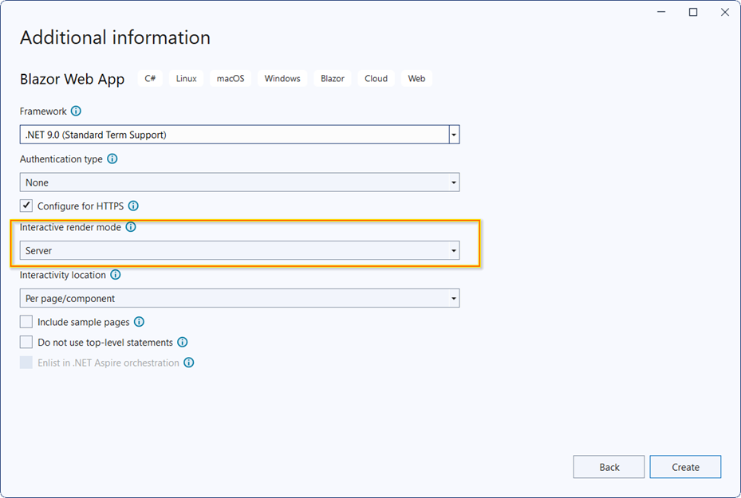

# Getting started with Blazor Gantt Chart in Blazor server app

This section briefly explains about how to include [Blazor Gantt Chart](https://www.syncfusion.com/blazor-components/blazor-gantt-chart) component in your Blazor server app using Visual Studio and Visual Studio code.

> **Ready to streamline your Syncfusion<sup style="font-size:70%">&reg;</sup> Blazor development?** <br/>Discover the full potential of Syncfusion<sup style="font-size:70%">&reg;</sup> Blazor components with Syncfusion<sup style="font-size:70%">&reg;</sup> AI Coding Assistants. Effortlessly integrate, configure, and enhance your projects with intelligent, context-aware code suggestions, streamlined setups, and real-time insights—all seamlessly integrated into your preferred AI-powered IDEs like VS Code, Cursor, Syncfusion<sup style="font-size:70%">&reg;</sup> CodeStudio and more. [Explore Syncfusion<sup style="font-size:70%">&reg;</sup> AI Coding Assistants](https://blazor.syncfusion.com/documentation/ai-coding-assistants/overview)

To get start quickly with Blazor Gantt Chart, you can check on this [GitHub](https://github.com/SyncfusionExamples/Blazor-Getting-Started-Examples/tree/main/GanttChart) sample:





## Prerequisites

* [System requirements for Blazor components](https://blazor.syncfusion.com/documentation/system-requirements)

## Create a new Blazor app in Visual Studio

You can create a **Blazor Server App** using **Blazor Web App** template in Visual Studio via [Microsoft Templates](https://learn.microsoft.com/en-us/aspnet/core/blazor/tooling?view=aspnetcore-7.0&pivots=vs) or the [Syncfusion<sup style="font-size:70%">&reg;</sup> Blazor Extension](https://blazor.syncfusion.com/documentation/visual-studio-integration/template-studio). For detailed instructions, refer to [this Blazor Server App Getting Started](https://blazor.syncfusion.com/documentation/getting-started/blazor-server-side-visual-studio) documentation.


Configure the appropriate [Interactive render mode](https://learn.microsoft.com/en-us/aspnet/core/blazor/components/render-modes?view=aspnetcore-10.0#render-modes) and [Interactivity location](https://learn.microsoft.com/en-us/aspnet/core/blazor/tooling?view=aspnetcore-10.0&pivots=vs) when creating a Blazor Server App.



## Install Syncfusion<sup style="font-size:70%">&reg;</sup> Blazor Gantt and Themes NuGet in the app

To add **Blazor Gantt Chart** component in the app, open the NuGet package manager in Visual Studio (*Tools → NuGet Package Manager → Manage NuGet Packages for Solution*), search and install [Syncfusion.Blazor.Gantt](https://www.nuget.org/packages/Syncfusion.Blazor.Gantt) and [Syncfusion.Blazor.Themes](https://www.nuget.org/packages/Syncfusion.Blazor.Themes/). Alternatively, you can utilize the following package manager command to achieve the same.




Install-Package Syncfusion.Blazor.Gantt -Version {{ site.releaseversion }}
Install-Package Syncfusion.Blazor.Themes -Version {{ site.releaseversion }}




N> Syncfusion<sup style="font-size:70%">&reg;</sup> Blazor components are available in [nuget.org](https://www.nuget.org/packages?q=syncfusion.blazor). Refer to [NuGet packages](https://blazor.syncfusion.com/documentation/nuget-packages) topic for available NuGet packages list with component details.





## Prerequisites

* [System requirements for Blazor components](https://blazor.syncfusion.com/documentation/system-requirements)

## Create a new Blazor app in Visual Studio code

You can create a **Blazor Server App** using Visual Studio code via [Microsoft Templates](https://learn.microsoft.com/en-us/aspnet/core/blazor/tooling?view=aspnetcore-7.0&pivots=vsc) or the [Syncfusion<sup style="font-size:70%">&reg;</sup> Blazor Extension](https://blazor.syncfusion.com/documentation/visual-studio-code-integration/create-project). For detailed instructions, refer to [this Blazor Server App Getting Started](https://blazor.syncfusion.com/documentation/getting-started/blazor-server-side-visual-studio?tabcontent=visual-studio-code) documentation.

Alternatively, you can create a server application using the following command in the terminal(<kbd>Ctrl</kbd>+<kbd>`</kbd>).





dotnet new blazor -o BlazorApp -int Server
cd BlazorApp





## Install Syncfusion<sup style="font-size:70%">&reg;</sup> Blazor Gantt and Themes NuGet in the App

* Press <kbd>Ctrl</kbd>+<kbd>`</kbd> to open the integrated terminal in Visual Studio code.
* Ensure you’re in the project root directory where your `.csproj` file is located.
* Run the following command to install a [Syncfusion.Blazor.Gantt](https://www.nuget.org/packages/Syncfusion.Blazor.Gantt) and [Syncfusion.Blazor.Themes](https://www.nuget.org/packages/Syncfusion.Blazor.Themes/) NuGet package and ensure all dependencies are installed.





dotnet add package Syncfusion.Blazor.Gantt -v {{ site.releaseversion }}
dotnet add package Syncfusion.Blazor.Themes -v {{ site.releaseversion }}
dotnet restore





N> Syncfusion<sup style="font-size:70%">&reg;</sup> Blazor components are available in [nuget.org](https://www.nuget.org/packages?q=syncfusion.blazor). Refer to [NuGet packages](https://blazor.syncfusion.com/documentation/nuget-packages) topic for available NuGet packages list with component details.





## Prerequisites

Latest version of the [.NET Core SDK](https://dotnet.microsoft.com/en-us/download). If you previously installed the SDK, you can determine the installed version by executing the following command in a command prompt (Windows) or terminal (macOS) or command shell (Linux).




dotnet --version




## Create a Blazor server app using .NET CLI

Run the `dotnet new blazorserver` command to create a new Blazor Server App in a command prompt (Windows) or terminal (macOS) or command shell (Linux).




dotnet new blazor -o BlazorApp -int Server
cd BlazorApp




This command creates new Blazor Server App and places it in a new directory called `BlazorApp` inside your current location. See [Create Blazor app topic](https://dotnet.microsoft.com/en-us/learn/aspnet/blazor-tutorial/create) and [dotnet new CLI command](https://learn.microsoft.com/en-us/dotnet/core/tools/dotnet-new) topics for more details.

## Install Syncfusion<sup style="font-size:70%">&reg;</sup> Blazor Gantt and Themes NuGet in the app

Here's an example of how to add **Blazor Gantt Chart** component in the application using the following command in the command prompt (Windows) or terminal (Linux and macOS) to install a [Syncfusion.Blazor.Gantt](https://www.nuget.org/packages/Syncfusion.Blazor.Gantt/) and [Syncfusion.Blazor.Themes](https://www.nuget.org/packages/Syncfusion.Blazor.Themes/) NuGet package. See [Install and manage packages using the dotnet CLI](https://learn.microsoft.com/en-us/nuget/consume-packages/install-use-packages-dotnet-cli) topics for more details.




dotnet add package Syncfusion.Blazor.Gantt -Version {{ site.releaseversion }}
dotnet add package Syncfusion.Blazor.Themes -Version {{ site.releaseversion }}
dotnet restore




N> Syncfusion<sup style="font-size:70%">&reg;</sup> Blazor components are available in [nuget.org](https://www.nuget.org/packages?q=syncfusion.blazor). Refer to [NuGet packages](https://blazor.syncfusion.com/documentation/nuget-packages) topic for available NuGet packages list with component details.





## Add import namespaces

Open the **~/_Imports.razor** file and import the `Syncfusion.Blazor` and `Syncfusion.Blazor.Gantt` namespace.

```cshtml

@using Syncfusion.Blazor
@using Syncfusion.Blazor.Gantt

```

## Register Syncfusion<sup style="font-size:70%">&reg;</sup> Blazor service

Register the Syncfusion<sup style="font-size:70%">&reg;</sup> Blazor service in the **~/Program.cs** file of your Blazor Server App.




....
....
using Syncfusion.Blazor;

var builder = WebApplication.CreateBuilder(args);

// Add services to the container.
....
....
builder.Services.AddSyncfusionBlazor();

....




## Add stylesheet and script resources

The theme stylesheet and script can be accessed from NuGet through [Static Web Assets](https://blazor.syncfusion.com/documentation/appearance/themes#static-web-assets). Include the stylesheet and script in the `<head>` and the script reference at the end of the `<body>` in the **App.razor** file as shown below:

```html
<head>
    ....
    <link href="_content/Syncfusion.Blazor.Themes/bootstrap5.css" rel="stylesheet" />
</head>

<body>
    ....
    <script src="_content/Syncfusion.Blazor.Core/scripts/syncfusion-blazor.min.js" type="text/javascript"></script>

    //Blazor GanttChart Component script reference.
    <!-- <script src="_content/Syncfusion.Blazor.Gantt/scripts/sf-gantt.min.js" type="text/javascript"></script> -->
</body>
```

N> Check out the [Blazor Themes](https://blazor.syncfusion.com/documentation/appearance/themes) topic to discover various methods ([Static Web Assets](https://blazor.syncfusion.com/documentation/appearance/themes#static-web-assets), [CDN](https://blazor.syncfusion.com/documentation/appearance/themes#cdn-reference), and [CRG](https://blazor.syncfusion.com/documentation/common/custom-resource-generator)) for referencing themes in your Blazor application. Also, check out the [Adding Script Reference](https://blazor.syncfusion.com/documentation/common/adding-script-references) topic to learn different approaches for adding script references in your Blazor application.

## Add Blazor Gantt Chart component

Add the Syncfusion<sup style="font-size:70%">&reg;</sup> Blazor Gantt Chart component in the **~/Components/Pages/Home.razor** file. If an interactivity location as `per page/component`, define a render mode at the top of the `Home.razor` page.

N> If an Interactivity Location is set to `Global` and the **Render Mode** is set to `Server`, the render mode is configured in the `App.razor` file by default.

```
@* desired render mode define here *@
@rendermode InteractiveServer
```




<SfGantt DataSource="@TaskCollection" Height="450px" Width="700px">
    <GanttTaskFields Id="TaskID" Name="TaskName" StartDate="StartDate" EndDate="EndDate" Duration="Duration" Progress="Progress" ParentID="ParentID">
    </GanttTaskFields>
</SfGantt>

@code{
    private List<TaskData> TaskCollection { get; set; }
    protected override void OnInitialized()
    {
        this.TaskCollection = GetTaskCollection();
    }

    public class TaskData
    {
        public int TaskID { get; set; }
        public string TaskName { get; set; }
        public DateTime StartDate { get; set; }
        public DateTime EndDate { get; set; }
        public string Duration { get; set; }
        public int Progress { get; set; }
        public int? ParentID { get; set; }
    }

    private static List<TaskData> GetTaskCollection()
    {
        List<TaskData> Tasks = new List<TaskData>()
        {
            new TaskData() { TaskID = 1, TaskName = "Project initiation", StartDate = new DateTime(2022, 01, 04), EndDate = new DateTime(2022, 01, 07), },
            new TaskData() { TaskID = 2, TaskName = "Identify Site location", StartDate = new DateTime(2022, 01, 04), Duration = "0", Progress = 30, ParentID = 1, },
            new TaskData() { TaskID = 3, TaskName = "Perform soil test", StartDate = new DateTime(2022, 01, 04), Duration = "4", Progress = 40, ParentID = 1, },
            new TaskData() { TaskID = 4, TaskName = "Soil test approval", StartDate = new DateTime(2022, 01, 04), Duration = "0", Progress = 30, ParentID = 1, },
            new TaskData() { TaskID = 5, TaskName = "Project estimation", StartDate = new DateTime(2022, 01, 06), EndDate = new DateTime(2022, 01, 10), },
            new TaskData() { TaskID = 6, TaskName = "Develop floor plan for estimation", StartDate = new DateTime(2022, 01, 06), Duration = "3", Progress = 30, ParentID = 5, },
            new TaskData() { TaskID = 7, TaskName = "List materials", StartDate = new DateTime(2022, 01, 06), Duration = "3", Progress = 40, ParentID = 5, },
            new TaskData() { TaskID = 8, TaskName = "Estimation approval", StartDate = new DateTime(2022, 01, 06), Duration = "0", Progress = 30, ParentID = 5, }
        };
        return Tasks;
    }
}






* Press <kbd>Ctrl</kbd>+<kbd>F5</kbd> (Windows) or <kbd>⌘</kbd>+<kbd>F5</kbd> (macOS) to launch the application. This will render the Syncfusion<sup style="font-size:70%">&reg;</sup> Blazor Gantt Chart component in your default web browser.

## See also

* [Getting Started with Syncfusion<sup style="font-size:70%">&reg;</sup> Blazor for Client-Side in .NET Core CLI](https://blazor.syncfusion.com/documentation/getting-started/blazor-webassembly-dotnet-cli)
* [Getting Started with Syncfusion<sup style="font-size:70%">&reg;</sup> Blazor for Server-Side in Visual Studio](https://blazor.syncfusion.com/documentation/getting-started/blazor-server-side-visual-studio)
* [Getting Started with Syncfusion<sup style="font-size:70%">&reg;</sup> Blazor for Server-Side in .NET Core CLI](https://blazor.syncfusion.com/documentation/getting-started/blazor-server-side-dotnet-cli)