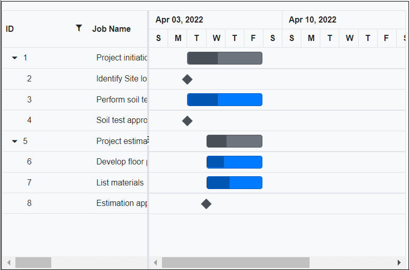

# Getting Started with Blazor Gantt Chart Component

This section briefly explains about how to include [Blazor Gantt Chart](https://www.syncfusion.com/blazor-components/blazor-gantt-chart) component in your Blazor Server App and Blazor WebAssembly App using Visual Studio.

## Prerequisites

* [System requirements for Blazor components](https://blazor.syncfusion.com/documentation/system-requirements)

## Create a new Blazor App in Visual Studio

You can create **Blazor Server App** or **Blazor WebAssembly App** using Visual Studio in one of the following ways,

* [Create a Project using Microsoft Templates](https://docs.microsoft.com/en-us/aspnet/core/blazor/tooling?pivots=windows)

* [Create a Project using Syncfusion Blazor Extension](https://blazor.syncfusion.com/documentation/visual-studio-code-integration/create-project)

## Install Syncfusion Blazor Gantt NuGet in the App

Syncfusion Blazor components are available in [nuget.org](https://www.nuget.org/packages?q=syncfusion.blazor). To use Syncfusion Blazor components in the application, add reference to the corresponding NuGet. Refer to [NuGet packages topic](https://blazor.syncfusion.com/documentation/nuget-packages) for available NuGet packages list with component details and [Benefits of using individual NuGet packages](https://blazor.syncfusion.com/documentation/nuget-packages#benefits-of-using-individual-nuget-packages).

To add Blazor Gantt Chart component in the app, open the NuGet package manager in Visual Studio (*Tools → NuGet Package Manager → Manage NuGet Packages for Solution*), search for [Syncfusion.Blazor.Gantt](https://www.nuget.org/packages/Syncfusion.Blazor.Gantt) and then install it.

## Register Syncfusion Blazor Service

Open **~/_Imports.razor** file and import the Syncfusion.Blazor namespace.




@using Syncfusion.Blazor




Now, register the Syncfusion Blazor Service in the Blazor Server App or Blazor WebAssembly App. Here, Syncfusion Blazor Service is registered by setting [IgnoreScriptIsolation](https://help.syncfusion.com/cr/blazor/Syncfusion.Blazor.GlobalOptions.html#Syncfusion_Blazor_GlobalOptions_IgnoreScriptIsolation) property as true to load the scripts externally in the [next steps](#add-script-reference).

N> From 2022 Vol-1 (20.1) version, the default value of `IgnoreScriptIsolation` is changed to `true`. It is not necessary to set the `IgnoreScriptIsolation` property to refer scripts externally, since the default value has already been changed to true, and this property is obsolete.

### Blazor Server App

* For **.NET 6 and .NET 7** app, open the **~/Program.cs** file and register the Syncfusion Blazor Service.

* For **.NET 5 and .NET 3.X** app, open the **~/Startup.cs** file and register the Syncfusion Blazor Service.




using Microsoft.AspNetCore.Components;
using Microsoft.AspNetCore.Components.Web;
using Syncfusion.Blazor;

var builder = WebApplication.CreateBuilder(args);

// Add services to the container.
builder.Services.AddRazorPages();
builder.Services.AddServerSideBlazor();
builder.Services.AddSyncfusionBlazor();

var app = builder.Build();
....





using Syncfusion.Blazor;

namespace BlazorApplication
{
    public class Startup
    {
        ...
        public void ConfigureServices(IServiceCollection services)
        {
            services.AddRazorPages();
            services.AddServerSideBlazor();
            services.AddSyncfusionBlazor();
        }
        ...
    }
}




### Blazor WebAssembly App

Open **~/Program.cs** file and register the Syncfusion Blazor Service in the client web app.




using Microsoft.AspNetCore.Components.Web;
using Microsoft.AspNetCore.Components.WebAssembly.Hosting;
using Syncfusion.Blazor;

var builder = WebAssemblyHostBuilder.CreateDefault(args);
builder.RootComponents.Add<App>("#app");
builder.RootComponents.Add<HeadOutlet>("head::after");

builder.Services.AddScoped(sp => new HttpClient { BaseAddress = new Uri(builder.HostEnvironment.BaseAddress) });

builder.Services.AddSyncfusionBlazor();
await builder.Build().RunAsync();
....





using Syncfusion.Blazor;

namespace WebApplication1
{
    public class Program
    {
        public static async Task Main(string[] args)
        {
            ....
            builder.Services.AddSyncfusionBlazor();
            await builder.Build().RunAsync();
        }
    }
}




## Add Style Sheet

Checkout the [Blazor Themes topic](https://blazor.syncfusion.com/documentation/appearance/themes) to learn different ways ([Static Web Assets](https://blazor.syncfusion.com/documentation/appearance/themes#static-web-assets), [CDN](https://blazor.syncfusion.com/documentation/appearance/themes#cdn-reference) and [CRG](https://blazor.syncfusion.com/documentation/common/custom-resource-generator)) to refer themes in Blazor application, and to have the expected appearance for Syncfusion Blazor components. Here, the theme is referred using `Static Web Assets`. Refer to [Enable static web assets usage](https://blazor.syncfusion.com/documentation/appearance/themes#enable-static-web-assets-usage) topic to use static assets in your project.

To add theme to the app, open the NuGet package manager in Visual Studio (*Tools → NuGet Package Manager → Manage NuGet Packages for Solution*), search for [Syncfusion.Blazor.Themes](https://www.nuget.org/packages/Syncfusion.Blazor.Themes/) and then install it. Then, the theme style sheet from NuGet can be referred as follows,

N> If you are using [Syncfusion.Blazor](https://www.nuget.org/packages/Syncfusion.Blazor/) single NuGet, you don't have to refer [Syncfusion.Blazor.Themes](https://www.nuget.org/packages/Syncfusion.Blazor.Themes/) NuGet. Since style sheets already inside the assets of `Syncfusion.Blazor` NuGet. 

### Blazor Server App

* For .NET 6 app, add the Syncfusion bootstrap5 theme in the `<head>` of the **~/Pages/_Layout.cshtml** file.

* For .NET 3.X, .NET 5 and .NET 7 app, add the Syncfusion bootstrap5 theme in the `<head>` of the **~/Pages/_Host.cshtml** file.




<head>
    ...
    <link href="_content/Syncfusion.Blazor.Themes/bootstrap5.css" rel="stylesheet" />
    <!--Refer theme style sheet as below if you are using Syncfusion.Blazor Single NuGet-->
    <!--<link href="_content/Syncfusion.Blazor/styles/bootstrap5.css" rel="stylesheet" />-->
</head>





<head>
    ...
    <link href="_content/Syncfusion.Blazor.Themes/bootstrap5.css" rel="stylesheet" />
    <!--Refer theme style sheet as below if you are using Syncfusion.Blazor Single NuGet-->
    <!--<link href="_content/Syncfusion.Blazor/styles/bootstrap5.css" rel="stylesheet" />-->
</head>




### Blazor WebAssembly App

For Blazor WebAssembly App, refer the theme style sheet from NuGet in the `<head>` of **wwwroot/index.html** file in the client web app.




<head>
    ...
    <link href="_content/Syncfusion.Blazor.Themes/bootstrap5.css" rel="stylesheet" />
    <!--Refer theme style sheet as below if you are using Syncfusion.Blazor Single NuGet-->
    <!--<link href="_content/Syncfusion.Blazor/styles/bootstrap5.css" rel="stylesheet" />-->
</head>




## Add script reference

Checkout [Adding Script Reference topic](https://blazor.syncfusion.com/documentation/common/adding-script-references) to learn different ways to add script reference in Blazor Application. In this getting started walk-through, the required scripts are referred using [Static Web Assets](https://blazor.syncfusion.com/documentation/common/adding-script-references#static-web-assets) externally inside the `<head>` as follows. Refer to [Enable static web assets usage](https://blazor.syncfusion.com/documentation/common/adding-script-references#enable-static-web-assets-usage) topic to use static assets in your project.

### Blazor Server App

* For **.NET 6** app, refer script in the `<head>` of the **~/Pages/_Layout.cshtml** file.

* For **.NET 3.X, .NET 5 and .NET 7** app, refer script in the `<head>` of the **~/Pages/_Host.cshtml** file.




<head>
    ....
    <link href="_content/Syncfusion.Blazor.Themes/bootstrap5.css" rel="stylesheet" />
    
    <!--Use below script reference if you are using Syncfusion.Blazor Single NuGet-->
    <!---->
</head>





<head>
    ....
    <link href="_content/Syncfusion.Blazor.Themes/bootstrap5.css" rel="stylesheet" />
    
    <!--Use below script reference if you are using Syncfusion.Blazor Single NuGet-->
    <!---->
</head>




### Blazor WebAssembly App

For Blazor WebAssembly App, refer script in the `<head>` of the **~/index.html** file.




<head>
    ....
    <link href="_content/Syncfusion.Blazor.Themes/bootstrap5.css" rel="stylesheet" />
    
    <!--Use below script reference if you are using Syncfusion.Blazor Single NuGet-->
    <!---->
</head>




N> Syncfusion recommends to reference scripts using [Static Web Assets](https://blazor.syncfusion.com/documentation/common/adding-script-references#static-web-assets), [CDN](https://blazor.syncfusion.com/documentation/common/adding-script-references#cdn-reference) and [CRG](https://blazor.syncfusion.com/documentation/common/custom-resource-generator) by [disabling JavaScript isolation](https://blazor.syncfusion.com/documentation/common/adding-script-references#disable-javascript-isolation) for better loading performance of the Blazor application.

## Add Blazor Gantt Chart component

* Open **~/_Imports.razor** file or any other page under the `~/Pages` folder where the component is to be added and import the **Syncfusion.Blazor.Gantt** namespace.




@using Syncfusion.Blazor
@using Syncfusion.Blazor.Gantt




* Now, add the Syncfusion Gantt Chart component in razor file. Here, the Gantt Chart component is added in the **~/Pages/Index.razor** file under the **~/Pages** folder.




<SfGantt TValue="TaskData">
</SfGantt>

@code{
    public class TaskData
    {
        public int TaskId { get; set; }
        public string TaskName { get; set; }
        public DateTime StartDate { get; set; }
        public DateTime EndDate { get; set; }
        public string Duration { get; set; }
        public int Progress { get; set; }
        public int? ParentId { get; set; }
    }
}




## Binding Gantt Chart with Data

Bind data with the Gantt Chart component by using the `DataSource` property. It accepts the list objects or the DataManager instance.




<SfGantt DataSource="@TaskCollection" Height="450px" Width="700px">
</SfGantt>

@code{
    private List<TaskData> TaskCollection { get; set; }
    protected override void OnInitialized()
    {
        this.TaskCollection = GetTaskCollection();
    }

    public class TaskData
    {
        public int TaskId { get; set; }
        public string TaskName { get; set; }
        public DateTime StartDate { get; set; }
        public DateTime EndDate { get; set; }
        public string Duration { get; set; }
        public int Progress { get; set; }
        public int? ParentId { get; set; }
    }

    public static List<TaskData> GetTaskCollection()
    {
        List<TaskData> Tasks = new List<TaskData>() {
            new TaskData() { TaskId = 1, TaskName = "Project initiation", StartDate = new DateTime(2022, 04, 05), EndDate = new DateTime(2022, 04, 21), },
            new TaskData() { TaskId = 2, TaskName = "Identify Site location", StartDate = new DateTime(2022, 04, 05), Duration = "4", Progress = 50, ParentId = 1 },
            new TaskData() { TaskId = 3, TaskName = "Perform soil test", StartDate = new DateTime(2022, 04, 05), Duration = "4", Progress = 50, ParentId = 1 }
        };
        return Tasks;
    }
}




## Mapping task fields

The data source fields that are required to render the tasks are mapped to the Gantt Chart component using the [GanttTaskFields](https://help.syncfusion.com/cr/blazor/Syncfusion.Blazor.Gantt.GanttTaskFields.html) property.




<SfGantt DataSource="@TaskCollection" Height="450px" Width="700px">
    <GanttTaskFields Id="TaskId" Name="TaskName" StartDate="StartDate" EndDate="EndDate" Duration="Duration" Progress="Progress" ParentID="ParentId">
    </GanttTaskFields>
</SfGantt>

@code{
    private List<TaskData> TaskCollection { get; set; }
    protected override void OnInitialized()
    {
        this.TaskCollection = GetTaskCollection();
    }

    public class TaskData
    {
        public int TaskId { get; set; }
        public string TaskName { get; set; }
        public DateTime StartDate { get; set; }
        public DateTime EndDate { get; set; }
        public string Duration { get; set; }
        public int Progress { get; set; }
        public int? ParentId { get; set; }
    }

    public static List<TaskData> GetTaskCollection()
    {
        List<TaskData> Tasks = new List<TaskData>() {
            new TaskData() { TaskId = 1, TaskName = "Project initiation", StartDate = new DateTime(2022, 04, 05), EndDate = new DateTime(2022, 04, 21), },
            new TaskData() { TaskId = 2, TaskName = "Identify Site location", StartDate = new DateTime(2022, 04, 05), Duration = "4", Progress = 50, ParentId = 1 },
            new TaskData() { TaskId = 3, TaskName = "Perform soil test", StartDate = new DateTime(2022, 04, 05), Duration = "4", Progress = 50, ParentId = 1 }
        };
        return Tasks;
    }
}




## Defining columns

Gantt Chart has an option to define columns as an array. You can customize the Gantt Chart columns using the following properties:

* [Field](https://help.syncfusion.com/cr/blazor/Syncfusion.Blazor.Gantt.GanttColumn.html#Syncfusion_Blazor_Gantt_GanttColumn_Field): Maps the data source fields to the columns.
* [HeaderText](https://help.syncfusion.com/cr/blazor/Syncfusion.Blazor.Gantt.GanttColumn.html#Syncfusion_Blazor_Gantt_GanttColumn_HeaderText): Changes the title of columns.
* [TextAlign](https://help.syncfusion.com/cr/blazor/Syncfusion.Blazor.Gantt.GanttColumn.html#Syncfusion_Blazor_Gantt_GanttColumn_TextAlign): Changes the alignment of columns. By default, columns will be left aligned. To change the columns to right align, set `TextAlign` to right.
* [Format](https://help.syncfusion.com/cr/blazor/Syncfusion.Blazor.Gantt.GanttColumn.html#Syncfusion_Blazor_Gantt_GanttColumn_Format): Formats the number and date values to standard or custom formats. Here, it is defined for the conversion of numeric values to currency.




@using Syncfusion.Blazor.Grids

<SfGantt DataSource="@TaskCollection" Height="450px" Width="700px">
    <GanttTaskFields Id="TaskId" Name="TaskName" StartDate="StartDate" EndDate="EndDate" Duration="Duration" Progress="Progress" ParentID="ParentId">
    </GanttTaskFields>
    <GanttColumns>
        <GanttColumn Field="TaskId" HeaderText="Task ID" TextAlign="TextAlign.Right" Width="100"></GanttColumn>
        <GanttColumn Field="TaskName" HeaderText="Task Name" Width="250"></GanttColumn>
        <GanttColumn Field="StartDate" HeaderText="Start Date" Width="250"></GanttColumn>
        <GanttColumn Field="Duration" HeaderText="Duration" Width="250"></GanttColumn>
        <GanttColumn Field="Progress" HeaderText="Progress" Format="@NumberFormat" Width="250"></GanttColumn>
    </GanttColumns>
</SfGantt>

@code{
    private List<TaskData> TaskCollection { get; set; }
    private string NumberFormat = "C";
    protected override void OnInitialized()
    {
        this.TaskCollection = GetTaskCollection();
    }

    public class TaskData
    {
        public int TaskId { get; set; }
        public string TaskName { get; set; }
        public DateTime StartDate { get; set; }
        public DateTime EndDate { get; set; }
        public string Duration { get; set; }
        public int Progress { get; set; }
        public int? ParentId { get; set; }
    }

    public static List<TaskData> GetTaskCollection()
    {
        List<TaskData> Tasks = new List<TaskData>() {
            new TaskData() { TaskId = 1, TaskName = "Project initiation", StartDate = new DateTime(2022, 04, 05), EndDate = new DateTime(2022, 04, 21), },
            new TaskData() { TaskId = 2, TaskName = "Identify Site location", StartDate = new DateTime(2022, 04, 05), Duration = "4", Progress = 50, ParentId = 1 },
            new TaskData() { TaskId = 3, TaskName = "Perform soil test", StartDate = new DateTime(2022, 04, 05), Duration = "4", Progress = 50, ParentId = 1 }
        };
        return Tasks;
    }
}




For further details regarding Columns, refer [here](https://blazor.syncfusion.com/documentation/gantt-chart/columns).

## Enable editing

The editing feature enables you to edit the tasks in the Gantt Chart component. It can be enabled by using the [EditSettings.AllowEditing](https://help.syncfusion.com/cr/blazor/Syncfusion.Blazor.Gantt.GanttEditSettings.html#Syncfusion_Blazor_Gantt_GanttEditSettings_AllowEditing) and [EditSettings.AllowTaskbarEditing](https://help.syncfusion.com/cr/blazor/Syncfusion.Blazor.Gantt.GanttEditSettings.html#Syncfusion_Blazor_Gantt_GanttEditSettings_AllowTaskbarEditing) properties.




<SfGantt DataSource="@TaskCollection" Height="450px" Width="700px">
    <GanttTaskFields Id="TaskId" Name="TaskName" StartDate="StartDate" EndDate="EndDate" Duration="Duration" Progress="Progress" ParentID="ParentId">
    </GanttTaskFields>
    <GanttEditSettings AllowEditing="true" Mode="Syncfusion.Blazor.Gantt.EditMode.Auto" AllowTaskbarEditing="true"></GanttEditSettings>
</SfGantt>

@code{
    private List<TaskData> TaskCollection { get; set; }
    protected override void OnInitialized()
    {
        this.TaskCollection = GetTaskCollection();
    }

    public class TaskData
    {
        public int TaskId { get; set; }
        public string TaskName { get; set; }
        public DateTime StartDate { get; set; }
        public DateTime EndDate { get; set; }
        public string Duration { get; set; }
        public int Progress { get; set; }
        public int? ParentId { get; set; }
    }

    public static List<TaskData> GetTaskCollection()
    {
        List<TaskData> Tasks = new List<TaskData>() {
            new TaskData() { TaskId = 1, TaskName = "Project initiation", StartDate = new DateTime(2022, 04, 05), EndDate = new DateTime(2022, 04, 21), },
            new TaskData() { TaskId = 2, TaskName = "Identify Site location", StartDate = new DateTime(2022, 04, 05), Duration = "4", Progress = 50, ParentId = 1 },
            new TaskData() { TaskId = 3, TaskName = "Perform soil test", StartDate = new DateTime(2022, 04, 05), Duration = "4", Progress = 50, ParentId = 1 }
        };
        return Tasks;
    }
}




N> When the edit mode is set to `Auto`, you can change the cells to editable mode by double-clicking anywhere at the Tree Grid and edit the task details in the edit dialog by double-clicking anywhere at the chart.

You can find the full information regarding Editing from [here](https://blazor.syncfusion.com/documentation/gantt-chart/managing-tasks)

## Enable filtering

The filtering feature enables you to view the reduced amount of records based on filter criteria. Gantt Chart provides the menu filtering support for each column. It can be enabled by setting the [AllowFiltering](https://help.syncfusion.com/cr/blazor/Syncfusion.Blazor.Gantt.SfGantt-1.html#Syncfusion_Blazor_Gantt_SfGantt_1_AllowFiltering) property to `true`. Filtering feature can also be customized using the [FilterSettings](https://help.syncfusion.com/cr/blazor/Syncfusion.Blazor.Gantt.SfGantt-1.html#Syncfusion_Blazor_Gantt_SfGantt_1_FilterSettings) property.




<SfGantt DataSource="@TaskCollection" Height="450px" Width="700px" AllowFiltering="true">
    <GanttTaskFields Id="TaskId" Name="TaskName" StartDate="StartDate" EndDate="EndDate" Duration="Duration" Progress="Progress" ParentID="ParentId">
    </GanttTaskFields>
</SfGantt>

@code{
    private List<TaskData> TaskCollection { get; set; }
    protected override void OnInitialized()
    {
        this.TaskCollection = GetTaskCollection();
    }

    public class TaskData
    {
        public int TaskId { get; set; }
        public string TaskName { get; set; }
        public DateTime StartDate { get; set; }
        public DateTime EndDate { get; set; }
        public string Duration { get; set; }
        public int Progress { get; set; }
        public int? ParentId { get; set; }
    }

    public static List<TaskData> GetTaskCollection()
    {
        List<TaskData> Tasks = new List<TaskData>() {
            new TaskData() { TaskId = 1, TaskName = "Project initiation", StartDate = new DateTime(2022, 04, 05), EndDate = new DateTime(2022, 04, 21), },
            new TaskData() { TaskId = 2, TaskName = "Identify Site location", StartDate = new DateTime(2022, 04, 05), Duration = "4", Progress = 50, ParentId = 1 },
            new TaskData() { TaskId = 3, TaskName = "Perform soil test", StartDate = new DateTime(2022, 04, 05), Duration = "4", Progress = 50, ParentId = 1 }
        };
        return Tasks;
    }
}




You can find the full information regarding Filtering from [here](https://blazor.syncfusion.com/documentation/gantt-chart/filtering)

## Enable sorting

The sorting feature enables you to order the records. It can be enabled by setting the [AllowSorting](https://help.syncfusion.com/cr/blazor/Syncfusion.Blazor.Gantt.SfGantt-1.html#Syncfusion_Blazor_Gantt_SfGantt_1_AllowSorting) property to `true`. The sorting feature can be customized using the [SortSettings](https://help.syncfusion.com/cr/blazor/Syncfusion.Blazor.Gantt.SfGantt-1.html#Syncfusion_Blazor_Gantt_SfGantt_1_SortSettings) property.




<SfGantt DataSource="@TaskCollection" Height="450px" Width="700px" AllowSorting="true">
    <GanttTaskFields Id="TaskId" Name="TaskName" StartDate="StartDate" EndDate="EndDate" Duration="Duration" Progress="Progress" ParentID="ParentId">
    </GanttTaskFields>
</SfGantt>

@code{
    private List<TaskData> TaskCollection { get; set; }
    protected override void OnInitialized()
    {
        this.TaskCollection = GetTaskCollection();
    }

    public class TaskData
    {
        public int TaskId { get; set; }
        public string TaskName { get; set; }
        public DateTime StartDate { get; set; }
        public DateTime EndDate { get; set; }
        public string Duration { get; set; }
        public int Progress { get; set; }
        public int? ParentId { get; set; }
    }

    public static List<TaskData> GetTaskCollection()
    {
        List<TaskData> Tasks = new List<TaskData>() {
            new TaskData() { TaskId = 1, TaskName = "Project initiation", StartDate = new DateTime(2022, 04, 05), EndDate = new DateTime(2022, 04, 21), },
            new TaskData() { TaskId = 2, TaskName = "Identify Site location", StartDate = new DateTime(2022, 04, 05), Duration = "4", Progress = 50, ParentId = 1 },
            new TaskData() { TaskId = 3, TaskName = "Perform soil test", StartDate = new DateTime(2022, 04, 05), Duration = "4", Progress = 50, ParentId = 1 }
        };
        return Tasks;
    }
}




You can find the full information regarding Sorting from [here](https://blazor.syncfusion.com/documentation/gantt-chart/sorting)

## Enabling Predecessors or Task Relationships

Predecessor or task dependency in the Gantt Chart component is used to depict the relationship between the tasks.

* Start to Start (SS): You cannot start a task until the dependent task starts.
* Start to Finish (SF): You cannot finish a task until the dependent task finishes.
* Finish to Start (FS): You cannot start a task until the dependent task completes.
* Finish to Finish (FF): You cannot finish a task until the dependent task completes.
You can show the relationship in tasks by using the `Dependency` property as shown in the following code example.




<SfGantt DataSource="@TaskCollection" Height="450px" Width="700px">
    <GanttTaskFields Id="TaskId" Name="TaskName" StartDate="StartDate" EndDate="EndDate" Duration="Duration" Progress="Progress" ParentID="ParentId" Dependency="Predecessor">
    </GanttTaskFields>
</SfGantt>

@code{
    private List<TaskData> TaskCollection { get; set; }
    protected override void OnInitialized()
    {
        this.TaskCollection = GetTaskCollection();
    }

    public class TaskData
    {
        public int TaskId { get; set; }
        public string TaskName { get; set; }
        public DateTime StartDate { get; set; }
        public DateTime EndDate { get; set; }
        public string Duration { get; set; }
        public int Progress { get; set; }
        public string Predecessor { get; set; }
        public int? ParentId { get; set; }
    }

    public static List<TaskData> GetTaskCollection()
    {
        List<TaskData> Tasks = new List<TaskData>() {
            new TaskData() { TaskId = 1, TaskName = "Project initiation", StartDate = new DateTime(2022, 04, 05), EndDate = new DateTime(2022, 04, 21), },
            new TaskData() { TaskId = 2, TaskName = "Identify Site location", StartDate = new DateTime(2022, 04, 05), Duration = "4", Progress = 50, ParentId = 1 },
            new TaskData() { TaskId = 3, TaskName = "Perform soil test", StartDate = new DateTime(2022, 04, 05), Duration = "4", Progress = 50, ParentId = 1, Predecessor = "2" }
        };
        return Tasks;
    }
}




You can find the full information regarding Predecessors from [here](https://blazor.syncfusion.com/documentation/gantt-chart/task-dependencies)

## Handling exceptions 
Exceptions that occur during Gantt actions can be handled without stopping the application. These error messages or exception details can be acquired using the [OnActionFailure](https://help.syncfusion.com/cr/blazor/Syncfusion.Blazor.Gantt.GanttEvents-1.html#Syncfusion_Blazor_Gantt_GanttEvents_1_OnActionFailure) event.

The argument passed to the [OnActionFailure](https://help.syncfusion.com/cr/blazor/Syncfusion.Blazor.Gantt.GanttEvents-1.html#Syncfusion_Blazor_Gantt_GanttEvents_1_OnActionFailure) event contains the error details returned from the server.

N> We recommend you bind the `OnActionFailure` event during your application development phase, this helps you to find any exceptions. You can pass these exception details to our support team to get a solution as early as possible.

The following sample code demonstrates notifying user when server-side exception has occurred during data operation,




@using Syncfusion.Blazor
@using Syncfusion.Blazor.Data
@using Syncfusion.Blazor.Gantt
@using Syncfusion.Blazor.Grids

@ErrorDetails
<SfGantt TValue="TaskData" Height="450px" Width="700px">
     <SfDataManager Url="https://some.com/invalidUrl" Adaptor="Adaptors.UrlAdaptor"></SfDataManager>
    <GanttTaskFields Id="TaskId" Name="TaskName" StartDate="StartDate" EndDate="EndDate" Duration="Duration"
        Progress="Progress" ParentID="ParentId">
    </GanttTaskFields>
    <GanttEvents TValue="TaskData" OnActionFailure="ActionFailure"></GanttEvents>
</SfGantt>

@code{
    private string ErrorDetails = "";
    public class TaskData
    {
        public int TaskId { get; set; }
        public string TaskName { get; set; }
        public DateTime? StartDate { get; set; }
        public DateTime? EndDate { get; set; }
        public string Duration { get; set; }
        public int Progress { get; set; }
        public int? ParentId { get; set; }
    }

    public void ActionFailure(FailureEventArgs args)
    {
        this.ErrorDetails = args.Error.Message.ToString();
        StateHasChanged();
    }
}




N> [View Sample in GitHub](https://github.com/SyncfusionExamples/Blazor-Getting-Started-Examples/tree/main/GanttChart).

## See Also

* [Getting Started with Syncfusion Blazor for Client-Side in .NET Core CLI](https://blazor.syncfusion.com/documentation/getting-started/blazor-webassembly-dotnet-cli)
* [Getting Started with Syncfusion Blazor for Server-Side in Visual Studio](https://blazor.syncfusion.com/documentation/getting-started/blazor-server-side-visual-studio)
* [Getting Started with Syncfusion Blazor for Server-Side in .NET Core CLI](https://blazor.syncfusion.com/documentation/getting-started/blazor-server-side-dotnet-cli)