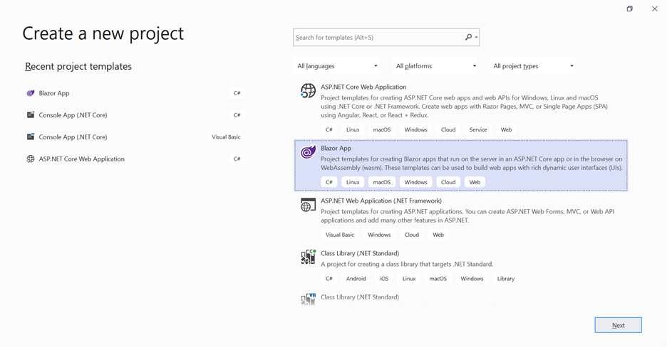
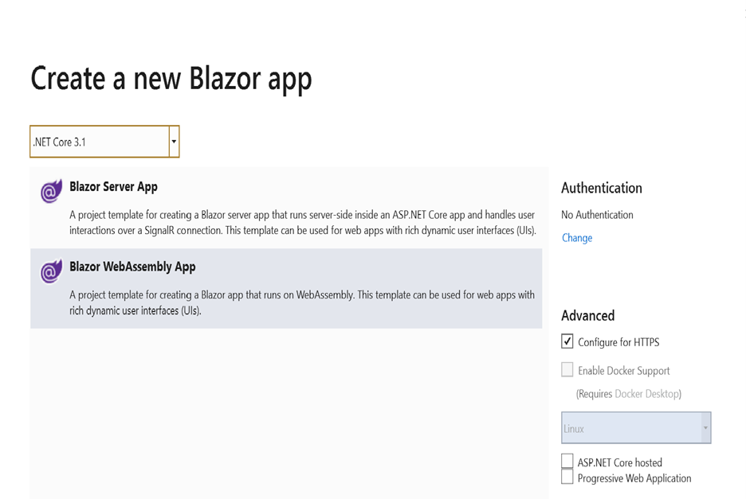
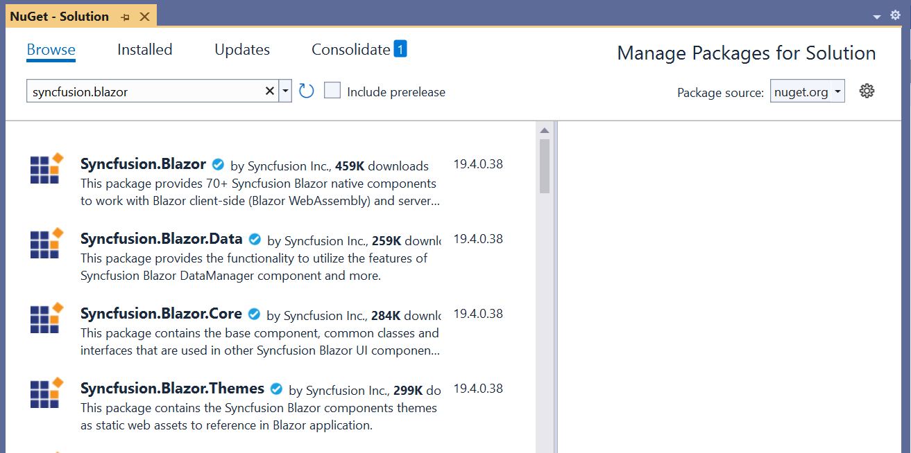

# WebAssembly Gantt Chart in Blazor Gantt Chart Component

This article provides a step-by-step instructions to configure Syncfusion [Blazor Gantt Chart](https://www.syncfusion.com/blazor-components/blazor-gantt-chart) in a simple Blazor WebAssembly application using [Visual Studio 2019](https://visualstudio.microsoft.com/vs/).

> Starting with version 17.4.0.39 (2019 Volume 4), you need to include a valid license key (either paid or trial key) within your applications. Please refer to this [help topic](https://help.syncfusion.com/common/essential-studio/licensing/license-key#blazor) for more information.

## Prerequisites

* [Visual Studio 2019](https://visualstudio.microsoft.com/vs/)
* [.NET Core SDK 3.1.3](https://dotnet.microsoft.com/download/dotnet-core/3.1)

> .NET Core SDK 3.1.3 requires Visual Studio 2019 16.6 or later. Syncfusion Blazor components are compatible with .NET Core 5.0 Preview 6 and it requires Visual Studio 16.7 Preview 1 or later.

## Create a Blazor WebAssembly project in Visual Studio 2019

1. Install the essential project templates in the Visual Studio 2019 by running the below command line in the command prompt.

    ```bash
    dotnet new -i Microsoft.AspNetCore.Components.WebAssembly.Templates::3.2.0-rc1.20223.4
    ```

2. Choose **Create a new project** from the Visual Studio dashboard.

    

3. Select **Blazor App** from the template, and then click **Next** button.

    

4. Now, the project configuration window will popup. Click **Create** button to create a new project with the default project configuration.

    

5. Choose **Blazor WebAssembly App** from the dashboard, and then click **Create** button to create a new Blazor WebAssembly application.

    

> ASP.NET Core 3.1 available in Visual Studio 2019 version.

## Importing Syncfusion Blazor component in the application

1. Install **Syncfusion.Blazor** NuGet package to the newly created application by using the `NuGet Package Manager`. Right-click the project and select Manage NuGet Packages.

    

2. Search Syncfusion.Blazor keyword in the Browser tab and install Syncfusion.Blazor NuGet package in the application.

    

3. The Syncfusion Blazor package will be installed in the project, once the installation process is completed.

4. Open **~/_Imports.razor** file and import the `Syncfusion.Blazor.Gantt` packages.

    ```cshtml
    @using Syncfusion.Blazor.Gantt
    ```

5. Open the **~/Program.cs** file and register the Syncfusion Blazor Service.

    ```c#
    using Syncfusion.Blazor;

    namespace WebApplication1
    {
        public class Program
        {
            public static async Task Main(string[] args)
            {
                ....
                ....
                builder.Services.AddSyncfusionBlazor();
                await builder.Build().RunAsync();
            }
        }
    }
    ```

6. Add the Syncfusion bootstrap4 theme in the `<head>` element of the **~/wwwroot/index.html** page.

    ```html
    <head>
        ....
        ....
        <link href="_content/Syncfusion.Blazor/styles/bootstrap4.css" rel="stylesheet" />
    </head>
    ```

    > The same theme file can be referred through the CDN version by using [https://cdn.syncfusion.com/blazor/{{ site.blazorversion }}/styles/bootstrap4.css](https://cdn.syncfusion.com/blazor/18.2.44/styles/bootstrap4.css).
    > To use manual scripts other than the scripts from NuGet package, register the Blazor service in **~/Program.cs** file by using true parameter as mentioned below.

     ```csharp
    using Syncfusion.Blazor;

     namespace WebApplication1
     {
         public class Program
       {
             public static async Task Main(string[] args)
             {
                ....
                ....
                builder.Services.AddSyncfusionBlazor(true);
                await builder.Build.RunAsync();
             }
         }
     }
     ```

## Adding Gantt Chart component to the application

Now, add the Syncfusion [Blazor Gantt Chart component](https://www.syncfusion.com/blazor-components/blazor-gantt-chart) in any web page (razor) in the `Pages` folder. For example, the Gantt Chart component is added in the **~/Pages/Index.razor** page.

```cshtml
@using Syncfusion.Blazor.Gantt
<SfGantt TValue="TaskData">
</SfGantt>

@code{
    public class TaskData
    {
        public int TaskId { get; set; }
        public string TaskName { get; set; }
        public DateTime StartDate { get; set; }
        public DateTime EndDate { get; set; }
        public string Duration { get; set; }
        public int Progress { get; set; }
        public List<TaskData> SubTasks { get; set; }
    }
}
```

## Binding Gantt Chart with Data

Bind data with the Gantt Chart component by using the `DataSource` property. It accepts an list objects or the DataManager instance.

```cshtml
@using Syncfusion.Blazor.Gantt
<SfGantt DataSource="@TaskCollection" Height="450px" Width="700px">
</SfGantt>

@code{
public List<TaskData> TaskCollection { get; set; }
protected override void OnInitialized()
{
    this.TaskCollection = GetTaskCollection();
}

public class TaskData
{
    public int TaskId { get; set; }
    public string TaskName { get; set; }
    public DateTime StartDate { get; set; }
    public DateTime EndDate { get; set; }
    public string Duration { get; set; }
    public int Progress { get; set; }
    public List<TaskData> SubTasks { get; set; }
}

public static List <TaskData> GetTaskCollection() {
    List <TaskData> Tasks = new List <TaskData> () {
        new TaskData() {
            TaskId = 1,
            TaskName = "Project initiation",
            StartDate = new DateTime(2019, 04, 02),
            EndDate = new DateTime(2019, 04, 21),
            SubTasks = (new List <TaskData> () {
                new TaskData() {
                    TaskId = 2,
                    TaskName = "Identify Site location",
                    StartDate = new DateTime(2019, 04, 02),
                    Duration = "4",
                    Progress = 50,
                },
                new TaskData() {
                    TaskId = 3,
                    TaskName = "Perform soil test",
                    StartDate = new DateTime(2019, 04, 02),
                    Duration = "4",
                    Progress = 50,
                }
            })
        }
    };
    return Tasks;
    }
}
```

## Mapping Task Fields

The data source fields that are required to render the tasks are mapped to the Gantt Chart component using the `GanttTaskFields` property.

```cshtml
@using Syncfusion.Blazor.Gantt
<SfGantt DataSource="@TaskCollection" Height="450px" Width="700px">
    <GanttTaskFields Id="TaskId" Name="TaskName" StartDate="StartDate" EndDate="EndDate" Duration="Duration" Progress="Progress" Child="SubTasks">
    </GanttTaskFields>
</SfGantt>

@code{
public List<TaskData> TaskCollection { get; set; }
protected override void OnInitialized()
{
    this.TaskCollection = GetTaskCollection();
}

public class TaskData
{
    public int TaskId { get; set; }
    public string TaskName { get; set; }
    public DateTime StartDate { get; set; }
    public DateTime EndDate { get; set; }
    public string Duration { get; set; }
    public int Progress { get; set; }
    public List<TaskData> SubTasks { get; set; }
}

public static List <TaskData> GetTaskCollection() {
    List <TaskData> Tasks = new List <TaskData> () {
        new TaskData() {
            TaskId = 1,
            TaskName = "Project initiation",
            StartDate = new DateTime(2019, 04, 02),
            EndDate = new DateTime(2019, 04, 21),
            SubTasks = (new List <TaskData> () {
                new TaskData() {
                    TaskId = 2,
                    TaskName = "Identify Site location",
                    StartDate = new DateTime(2019, 04, 02),
                    Duration = "4",
                    Progress = 50,
                },
                new TaskData() {
                    TaskId = 3,
                    TaskName = "Perform soil test",
                    StartDate = new DateTime(2019, 04, 02),
                    Duration = "4",
                    Progress = 50,
                }
            })
        }
    };

    return Tasks;
}
}
```

## Defining Columns

Gantt Chart has an option to define columns as an array. You can customize the Gantt Chart columns using the following properties:

* `Field`: Maps the data source fields to the columns.
* `HeaderText`: Changes the title of columns.
* `TextAlign`: Changes the alignment of columns. By default, columns will be left aligned. To change the columns to right align, set `TextAlign` to right.
* `Format`: Formats the number and date values to standard or custom formats. Here, it is defined for the conversion of numeric values to currency.

```cshtml
@using Syncfusion.Blazor.Gantt
@using Syncfusion.Blazor.Grids
<SfGantt DataSource="@TaskCollection" Height="450px" Width="700px">
    <GanttTaskFields Id="TaskId" Name="TaskName" StartDate="StartDate" EndDate="EndDate" Duration="Duration" Progress="Progress" Child="SubTasks">
    </GanttTaskFields>
    <GanttColumns>
        <GanttColumn Field="TaskId" HeaderText="Task ID" TextAlign="TextAlign.Right" Width="100"></GanttColumn>
        <GanttColumn Field="TaskName" HeaderText="Task Name" Width="250"></GanttColumn>
        <GanttColumn Field="StartDate" HeaderText="Start Date" Width="250"></GanttColumn>
        <GanttColumn Field="Duration" HeaderText="Duration" Width="250"></GanttColumn>
        <GanttColumn Field="Progress" HeaderText="Progress" Format="@NumberFormat" Width="250"></GanttColumn>
    </GanttColumns>
</SfGantt>

@code{
    public List<TaskData> TaskCollection { get; set; }
    public string NumberFormat = "C";
    protected override void OnInitialized()
    {
        this.TaskCollection = GetTaskCollection();
    }

    public class TaskData
    {
        public int TaskId { get; set; }
        public string TaskName { get; set; }
        public DateTime StartDate { get; set; }
        public DateTime EndDate { get; set; }
        public string Duration { get; set; }
        public int Progress { get; set; }
        public List<TaskData> SubTasks { get; set; }
    }

    public static List <TaskData> GetTaskCollection() {
    List <TaskData> Tasks = new List <TaskData> () {
        new TaskData() {
            TaskId = 1,
            TaskName = "Project initiation",
            StartDate = new DateTime(2019, 04, 02),
            EndDate = new DateTime(2019, 04, 21),
            SubTasks = (new List <TaskData> () {
                new TaskData() {
                    TaskId = 2,
                    TaskName = "Identify Site location",
                    StartDate = new DateTime(2019, 04, 02),
                    Duration = "4",
                    Progress = 50,
                },
                new TaskData() {
                    TaskId = 3,
                    TaskName = "Perform soil test",
                    StartDate = new DateTime(2019, 04, 02),
                    Duration = "4",
                    Progress = 50,
                }
            })
        }
    };

    return Tasks;
}
}
```

For further details regarding Columns, Please refer [here](https://blazor.syncfusion.com/documentation/gantt-chart/columns/)

## Enable Editing

The editing feature enables you to edit the tasks in the Gantt Chart component. It can be enabled by using the `EditSettings.AllowEditing` and `EditSettings.AllowTaskbarEditing` properties.

```cshtml
@using Syncfusion.Blazor.Gantt
<SfGantt DataSource="@TaskCollection" Height="450px" Width="700px">
    <GanttTaskFields Id="TaskId" Name="TaskName" StartDate="StartDate" EndDate="EndDate" Duration="Duration" Progress="Progress" Child="SubTasks">
    </GanttTaskFields>
    <GanttEditSettings AllowEditing="true" Mode="Syncfusion.Blazor.Gantt.EditMode.Auto" AllowTaskbarEditing="true"></GanttEditSettings>
</SfGantt>

@code{
    public List<TaskData> TaskCollection { get; set; }
    protected override void OnInitialized()
    {
        this.TaskCollection = GetTaskCollection();
    }

    public class TaskData
    {
        public int TaskId { get; set; }
        public string TaskName { get; set; }
        public DateTime StartDate { get; set; }
        public DateTime EndDate { get; set; }
        public string Duration { get; set; }
        public int Progress { get; set; }
        public List<TaskData> SubTasks { get; set; }
    }

    public static List <TaskData> GetTaskCollection() {
    List <TaskData> Tasks = new List <TaskData> () {
        new TaskData() {
            TaskId = 1,
            TaskName = "Project initiation",
            StartDate = new DateTime(2019, 04, 02),
            EndDate = new DateTime(2019, 04, 21),
            SubTasks = (new List <TaskData> () {
                new TaskData() {
                    TaskId = 2,
                    TaskName = "Identify Site location",
                    StartDate = new DateTime(2019, 04, 02),
                    Duration = "4",
                    Progress = 50,
                },
                new TaskData() {
                    TaskId = 3,
                    TaskName = "Perform soil test",
                    StartDate = new DateTime(2019, 04, 02),
                    Duration = "4",
                    Progress = 50,
                }
            })
        }
    };

    return Tasks;
}
}
```

> When the edit mode is set to `Auto`, you can change the cells to editable mode by double-clicking anywhere at the Tree Grid and edit the task details in the edit dialog by double-clicking anywhere at the chart.

You can find the full information regarding Editing from [here](https://blazor.syncfusion.com/documentation/gantt-chart/managing-tasks/)

## Enable Filtering

The filtering feature enables you to view the reduced amount of records based on filter criteria. Gantt Chart provides the menu filtering support for each column. It can be enabled by setting the `AllowFiltering` property to `true`. Filtering feature can also be customized using the `FilterSettings` property.

```cshtml
@using Syncfusion.Blazor.Gantt
<SfGantt DataSource="@TaskCollection" Height="450px" Width="700px" AllowFiltering="true">
    <GanttTaskFields Id="TaskId" Name="TaskName" StartDate="StartDate" EndDate="EndDate" Duration="Duration" Progress="Progress" Child="SubTasks">
    </GanttTaskFields>
</SfGantt>

@code{
    public List<TaskData> TaskCollection { get; set; }
    protected override void OnInitialized()
    {
        this.TaskCollection = GetTaskCollection();
    }

    public class TaskData
    {
        public int TaskId { get; set; }
        public string TaskName { get; set; }
        public DateTime StartDate { get; set; }
        public DateTime EndDate { get; set; }
        public string Duration { get; set; }
        public int Progress { get; set; }
        public List<TaskData> SubTasks { get; set; }
    }

    public static List<TaskData> GetTaskCollection()
    {
        List<TaskData> Tasks = new List<TaskData>() {
        new TaskData() {
            TaskId = 1,
            TaskName = "Project initiation",
            StartDate = new DateTime(2019, 04, 02),
            EndDate = new DateTime(2019, 04, 21),
            SubTasks = (new List <TaskData> () {
                new TaskData() {
                    TaskId = 2,
                    TaskName = "Identify Site location",
                    StartDate = new DateTime(2019, 04, 02),
                    Duration = "4",
                    Progress = 50,
                },
                new TaskData() {
                    TaskId = 3,
                    TaskName = "Perform soil test",
                    StartDate = new DateTime(2019, 04, 02),
                    Duration = "4",
                    Progress = 50,
                }
            })
        }
    };

        return Tasks;
    }
}
```

You can find the full information regarding Filtering from [here](https://blazor.syncfusion.com/documentation/gantt-chart/filtering/)
## Enable Sorting

The sorting feature enables you to order the records. It can be enabled by setting the `AllowSorting` property to `true`. The sorting feature can be customized using the `SortSettings` property.

```cshtml
@using Syncfusion.Blazor.Gantt
<SfGantt DataSource="@TaskCollection" Height="450px" Width="700px" AllowSorting="true">
    <GanttTaskFields Id="TaskId" Name="TaskName" StartDate="StartDate" EndDate="EndDate" Duration="Duration" Progress="Progress" Child="SubTasks">
    </GanttTaskFields>
</SfGantt>

@code{
    public List<TaskData> TaskCollection { get; set; }
    protected override void OnInitialized()
    {
        this.TaskCollection = GetTaskCollection();
    }

    public class TaskData
    {
        public int TaskId { get; set; }
        public string TaskName { get; set; }
        public DateTime StartDate { get; set; }
        public DateTime EndDate { get; set; }
        public string Duration { get; set; }
        public int Progress { get; set; }
        public List<TaskData> SubTasks { get; set; }
    }

    public static List<TaskData> GetTaskCollection()
    {
        List<TaskData> Tasks = new List<TaskData>() {
        new TaskData() {
            TaskId = 1,
            TaskName = "Project initiation",
            StartDate = new DateTime(2019, 04, 02),
            EndDate = new DateTime(2019, 04, 21),
            SubTasks = (new List <TaskData> () {
                new TaskData() {
                    TaskId = 2,
                    TaskName = "Identify Site location",
                    StartDate = new DateTime(2019, 04, 02),
                    Duration = "4",
                    Progress = 50,
                },
                new TaskData() {
                    TaskId = 3,
                    TaskName = "Perform soil test",
                    StartDate = new DateTime(2019, 04, 02),
                    Duration = "4",
                    Progress = 50,
                }
            })
        }
    };
    return Tasks;
    }
}
```

You can find the full information regarding Sorting from [here](https://blazor.syncfusion.com/documentation/gantt-chart/sorting/)


## Enabling Predecessors or Task Relationships

Predecessor or task dependency in the Gantt Chart component is used to depict the relationship between the tasks.

* Start to Start (SS): You cannot start a task until the dependent task starts.
* Start to Finish (SF): You cannot finish a task until the dependent task finishes.
* Finish to Start (FS): You cannot start a task until the dependent task completes.
* Finish to Finish (FF): You cannot finish a task until the dependent task completes.
You can show the relationship in tasks by using the `Dependency` property as shown in the following code example.

```cshtml
@using Syncfusion.Blazor.Gantt
<SfGantt DataSource="@TaskCollection" Height="450px" Width="700px">
    <GanttTaskFields Id="TaskId" Name="TaskName" StartDate="StartDate" EndDate="EndDate" Duration="Duration" Progress="Progress" Child="SubTasks" Dependency="Predecessor">
    </GanttTaskFields>
</SfGantt>

@code{
    public List<TaskData> TaskCollection { get; set; }
    protected override void OnInitialized()
    {
        this.TaskCollection = GetTaskCollection();
    }

    public class TaskData
    {
        public int TaskId { get; set; }
        public string TaskName { get; set; }
        public DateTime StartDate { get; set; }
        public DateTime EndDate { get; set; }
        public string Duration { get; set; }
        public int Progress { get; set; }
        public string Predecessor { get; set; }
        public List<TaskData> SubTasks { get; set; }
    }

    public static List<TaskData> GetTaskCollection()
    {
        List<TaskData> Tasks = new List<TaskData>() {
        new TaskData() {
            TaskId = 1,
            TaskName = "Project initiation",
            StartDate = new DateTime(2019, 04, 02),
            EndDate = new DateTime(2019, 04, 21),
            SubTasks = (new List <TaskData> () {
                new TaskData() {
                    TaskId = 2,
                    TaskName = "Identify Site location",
                    StartDate = new DateTime(2019, 04, 02),
                    Duration = "4",
                    Progress = 50
                },
                new TaskData() {
                    TaskId = 3,
                    TaskName = "Perform soil test",
                    StartDate = new DateTime(2019, 04, 02),
                    Duration = "4",
                    Progress = 50,
                    Predecessor = "2"
                }
            })
        }
    };

        return Tasks;
    }
}

```

You can find the full information regarding Predecessors from [here](https://blazor.syncfusion.com/documentation/gantt-chart/task-dependencies)

The following image represents Gantt with Editing, Sorting, Filtering and Predecessors.

