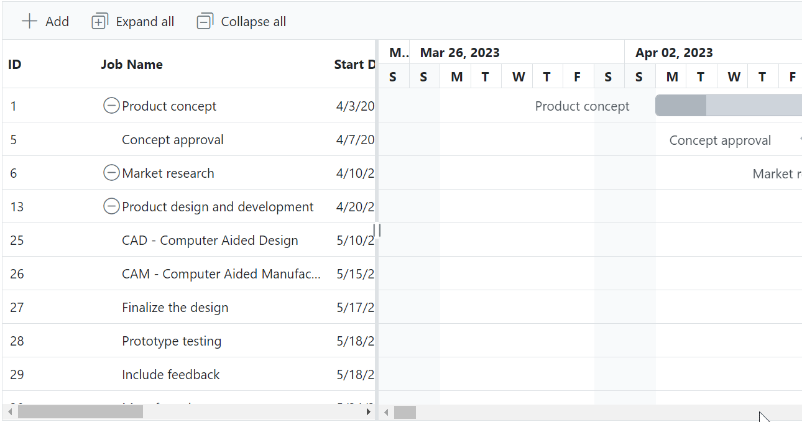

# Customize Expand and Collapse Icon in Blazor Gantt Chart Component

In the Gantt Chart component, you can customize the expand and collapse icons by overriding the default icon classes `.e-treegridexpand` and `.e-treegridcollapse` with the `content` property. The below sample code demonstrates the customization of the expand and collapse icons.

```cshtml
@using Syncfusion.Blazor.Gantt
<SfGantt DataSource="@TaskCollection" Height="450px" Width="1000px" HighlightWeekends="true"
         Toolbar="@(new List<string>(){ "Add", "Edit", "Update", "Delete", "Cancel", "ExpandAll", "CollapseAll","Indent","Outdent"})"
         AllowSelection="true" TreeColumnIndex="1"
         ProjectStartDate="@ProjectStart" ProjectEndDate="@ProjectEnd">
    <GanttTaskFields Id="TaskId" Name="TaskName" StartDate="StartDate" EndDate="EndDate" Duration="Duration" Progress="Progress"
                     Dependency="Predecessor" ParentID="ParentId"></GanttTaskFields>
    <GanttEditSettings AllowAdding="true" AllowDeleting="true" AllowEditing="true" AllowTaskbarEditing="true" ShowDeleteConfirmDialog="true"></GanttEditSettings>
    <GanttColumns>
        <GanttColumn Field="TaskId" Width="100"></GanttColumn>
        <GanttColumn Field="TaskName" HeaderText="Job Name" Width="250" ClipMode="Syncfusion.Blazor.Grids.ClipMode.EllipsisWithTooltip"></GanttColumn>
        <GanttColumn Field="StartDate" HeaderText="Start Date"></GanttColumn>
        <GanttColumn Field="EndDate" HeaderText="End Date"></GanttColumn>
        <GanttColumn Field="Duration" HeaderText="Duration"></GanttColumn>
        <GanttColumn Field="Progress" HeaderText="Progress"></GanttColumn>
        <GanttColumn Field="Predecessor" HeaderText="Dependency"></GanttColumn>
    </GanttColumns>
    <GanttLabelSettings LeftLabel="TaskName" TValue="GanttData.TaskData">
    </GanttLabelSettings>
    <GanttSplitterSettings Position="40%"> </GanttSplitterSettings>
</SfGantt>
@code {
    private DateTime ProjectStart = new DateTime(2023, 03, 25);
    private DateTime ProjectEnd = new DateTime(2024, 05, 07);
    private List<GanttData.TaskData> TaskCollection { get; set; }
    protected override void OnInitialized()
    {
        this.TaskCollection = GanttData.EditingData().ToList();
    }
    public class GanttData
    {
        public class TaskData
        {
            public int TaskId { get; set; }
            public string TaskName { get; set; }
            public DateTime? StartDate { get; set; }
            public DateTime? EndDate { get; set; }
            public string Duration { get; set; }
            public int Progress { get; set; }
            public string Predecessor { get; set; }
            public string Notes { get; set; }
            public int? ParentId { get; set; }
        }
        public static List<TaskData> EditingData()
        {
            List<TaskData> Tasks = new List<TaskData>() { 
            new TaskData() { TaskId = 1, TaskName = "Product concept", StartDate = new DateTime(2023, 04, 02), EndDate = new DateTime(2023, 04, 08), Duration = "5 days" },
            new TaskData() { TaskId = 2, TaskName = "Defining the product usage", StartDate = new DateTime(2023, 04, 02), EndDate = new DateTime(2023, 04, 08), Duration = "3", Progress = 30, ParentId = 1 },
            new TaskData() { TaskId = 3, TaskName = "Defining the target audience", StartDate = new DateTime(2023, 04, 02), EndDate = new DateTime(2023, 04, 04), Duration = "3", Progress = 40, ParentId = 1 },
            new TaskData() { TaskId = 4, TaskName = "Prepare product sketch and notes", StartDate = new DateTime(2023, 04, 05), EndDate = new DateTime(2023, 04, 08), Duration = "2", Progress = 30, ParentId = 1, Predecessor="2" },
            new TaskData() { TaskId = 5, TaskName = "Concept approval", StartDate = new DateTime(2023, 04, 08), EndDate = new DateTime(2023, 04, 08), Duration="0", Predecessor="3,4" },
            new TaskData() { TaskId = 6, TaskName = "Market research", StartDate = new DateTime(2023, 04, 09), EndDate = new DateTime(2023, 04, 18), Predecessor="2", Duration = "4",Progress = 30 },
            new TaskData() { TaskId = 7, TaskName = "Demand analysis", StartDate = new DateTime(2023, 04, 09), EndDate = new DateTime(2023, 04, 12), Duration = "4", Progress = 40, ParentId = 6 },
            new TaskData() { TaskId = 8, TaskName = "Customer strength", StartDate = new DateTime(2023, 04, 09), EndDate = new DateTime(2023, 04, 12), Duration = "4", Progress = 30, ParentId = 7, Predecessor="5" },
            new TaskData() { TaskId = 9, TaskName = "Market opportunity analysis", StartDate = new DateTime(2023, 04, 09), EndDate = new DateTime(2023, 04, 12), Duration = "4", ParentId = 7, Predecessor = "5" },
            new TaskData() { TaskId = 10, TaskName = "Competitor analysis", StartDate = new DateTime(2023, 04, 15), EndDate = new DateTime(2023, 04, 18), Duration = "4", Progress = 30, ParentId = 6, Predecessor = "7,8" },
            new TaskData() { TaskId = 11, TaskName = "Product strength analysis", StartDate = new DateTime(2023, 04, 15), EndDate = new DateTime(2023, 04, 18), Duration = "4", Progress = 40, ParentId = 6, Predecessor = "9" },
            new TaskData() { TaskId = 12, TaskName = "Research completed", StartDate = new DateTime(2023, 04, 22), EndDate = new DateTime(2023, 04, 22), Duration = "0", Progress = 30, ParentId = 6, Predecessor = "10", },
            new TaskData() { TaskId = 13, TaskName = "Product design and development", StartDate = new DateTime(2023, 04, 19), EndDate = new DateTime(2023, 05, 16), Duration = "20" },
            new TaskData() { TaskId = 14, TaskName = "Functionality design", StartDate = new DateTime(2023, 04, 19), EndDate = new DateTime(2023, 04, 23), Duration = "3", Progress = 30, ParentId = 13, Predecessor = "12" },
            new TaskData() { TaskId = 15, TaskName = "Quality design", StartDate = new DateTime(2023, 04, 19), EndDate = new DateTime(2023, 04, 23), Duration = "3", Progress = 40, ParentId = 13, Predecessor = "12" },
            new TaskData() { TaskId = 16, TaskName = "Define reliability", StartDate = new DateTime(2023, 04, 24), EndDate = new DateTime(2023, 04, 25), Duration = "2", Progress = 30, ParentId = 13, Predecessor = "15" },
            new TaskData() { TaskId = 17, TaskName = "Identifying raw materials", StartDate = new DateTime(2023, 04, 24), EndDate = new DateTime(2023, 04, 25), Duration = "2", ParentId = 13, Predecessor = "15" },
            new TaskData() { TaskId = 18, TaskName = "Define cost plan", StartDate = new DateTime(2023, 04, 26), EndDate = new DateTime(2023, 04, 29), Duration = "2", Progress = 30, ParentId = 13, Predecessor = "17" },
            new TaskData() { TaskId = 19, TaskName = "Define manufacturing cost", StartDate = new DateTime(2023, 04, 26), EndDate = new DateTime(2023, 04, 29), Duration = "2", Progress = 40, ParentId = 18, Predecessor = "17" },
            new TaskData() { TaskId = 20, TaskName = "Define selling cost", StartDate = new DateTime(2023, 04, 26), EndDate = new DateTime(2023, 04, 29), Duration = "2", Progress = 30, ParentId = 18, Predecessor = "17" },
            new TaskData() { TaskId = 21, TaskName = "Development of final design", StartDate = new DateTime(2023, 04, 30), EndDate = new DateTime(2023, 05, 08), Duration = "7", ParentId = 13 },
            new TaskData() { TaskId = 22, TaskName = "Develop dimensions and design", StartDate = new DateTime(2023, 04, 30), EndDate = new DateTime(2023, 05, 01), Duration = "2", Progress = 30, ParentId = 21, Predecessor = "19,20" },
            new TaskData() { TaskId = 23, TaskName = "Develop designs to meet industry standard", StartDate = new DateTime(2023, 05, 02), EndDate = new DateTime(2023, 05, 03), Duration = "2", Progress = 40, ParentId = 21, Predecessor = "22" },
            new TaskData() { TaskId = 24, TaskName = "Include all the details", StartDate = new DateTime(2023, 05, 06), EndDate = new DateTime(2023, 05, 08), Duration = "3", Progress = 30, ParentId = 21, Predecessor = "23" },
            new TaskData() { TaskId = 25, TaskName = "CAD - Computer Aided Design", StartDate = new DateTime(2023, 05, 09), EndDate = new DateTime(2023, 05, 13), Duration = "3", Predecessor = "24" },
            new TaskData() { TaskId = 26, TaskName = "CAM - Computer Aided Manufacturing", StartDate = new DateTime(2023, 05, 14), EndDate = new DateTime(2023, 05, 16), Duration = "3", Progress = 30, Predecessor = "25" },
            new TaskData() { TaskId = 27, TaskName = "Finalize the design", StartDate = new DateTime(2023, 04, 16), EndDate = new DateTime(2023, 04, 16), Duration = "0", Progress = 40, Predecessor = "26" },
            new TaskData() { TaskId = 28, TaskName = "Prototype testing", StartDate = new DateTime(2023, 05, 17), EndDate = new DateTime(2023, 05, 22), Duration = "4", Progress = 30, Predecessor = "27" },
            new TaskData() { TaskId = 29, TaskName = "Include feedback", StartDate = new DateTime(2023, 05, 17), EndDate = new DateTime(2023, 05, 22), Duration = "4", Predecessor = "28ss", },
            new TaskData() { TaskId = 30, TaskName = "Manufacturing", StartDate = new DateTime(2023, 05, 23), EndDate = new DateTime(2023, 05, 29), Duration = "5", Progress = 30, Predecessor = "28,29" },
            new TaskData() { TaskId = 31, TaskName = "Assembling material into finished goods", StartDate = new DateTime(2023, 05, 30), EndDate = new DateTime(2023, 06, 05), Duration = "5", Progress = 40, Predecessor = "30" },
            new TaskData() { TaskId = 32, TaskName = "Final product development", StartDate = new DateTime(2023, 06, 06), EndDate = new DateTime(2023, 06, 13), Duration = "6", Progress = 30 },
            new TaskData() { TaskId = 33, TaskName = "Important improvement", StartDate = new DateTime(2023, 06, 06), EndDate = new DateTime(2023, 06, 10), Duration = "3", ParentId = 32, Predecessor = "31" },
            new TaskData() { TaskId = 34, TaskName = "Customer testing and feedback", StartDate = new DateTime(2023, 06, 11), EndDate = new DateTime(2023, 06, 13), Duration = "3", Progress = 30, ParentId = 32, Predecessor = "33" },
            new TaskData() { TaskId = 35, TaskName = "Final product development", StartDate = new DateTime(2023, 06, 14), EndDate = new DateTime(2023, 06, 19), Duration = "4", Progress = 40 },
            new TaskData() { TaskId = 36, TaskName = "Important improvement", StartDate = new DateTime(2023, 06, 14), EndDate = new DateTime(2023, 06, 19), Duration = "4", Progress = 30, ParentId = 35, Predecessor = "34" },
            new TaskData() { TaskId = 37, TaskName = "Address any unforeseen issues", StartDate = new DateTime(2023, 06, 14), EndDate = new DateTime(2023, 06, 19), Duration = "4", Progress = 30, Predecessor = "36ss", ParentId = 35, },
            new TaskData() { TaskId = 38, TaskName = "Finalize the product ", StartDate = new DateTime(2023, 06, 20), EndDate = new DateTime(2023, 07, 01), Duration = "8", Progress = 40 },
            new TaskData() { TaskId = 39, TaskName = "Branding the product", StartDate = new DateTime(2023, 06, 20), EndDate = new DateTime(2023, 06, 25), Duration = "4", Progress = 30, ParentId = 38, Predecessor = "37" },
            new TaskData() { TaskId = 40, TaskName = "Marketing and Presales", StartDate = new DateTime(2023, 06, 26), EndDate = new DateTime(2023, 07, 01), ParentId = 38, Duration = "4", Predecessor = "39" }
            };
            return Tasks;
        }
    }
}
<style>
    .e-gantt .e-treegridcollapse::before {
        content: '\e81b' !important
    }

    .e-gantt .e-treegridexpand::before {
        content: '\e768' !important
    }
</style>
```

