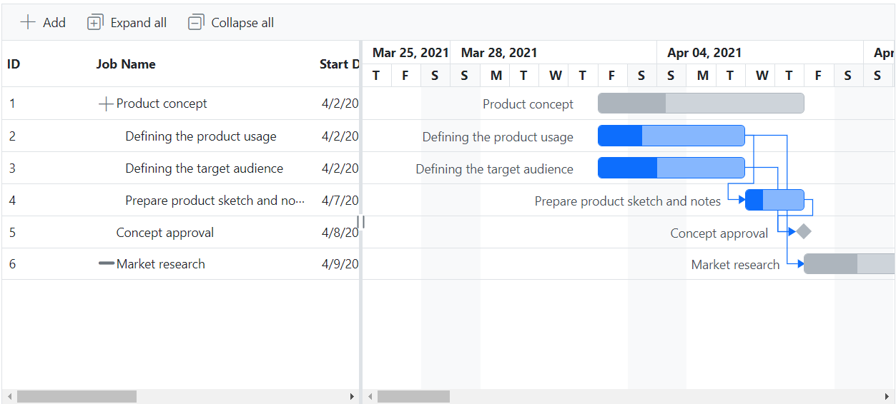

# Customize Expand and Collapse Icon in Blazor Gantt Chart Component

In the Gantt Chart component, you can customize the expand and collapse icons by overriding the default icon classes `.e-treegridexpand` and `.e-treegridcollapse` with the `content` property. The below sample code demonstrates the customization of the expand and collapse icons.

```cshtml
@using Syncfusion.Blazor.Gantt
<SfGantt DataSource="@TaskCollection" Height="450px" Width="1000px" HighlightWeekends="true"
         Toolbar="@(new List<string>(){ "Add", "Edit", "Update", "Delete", "Cancel", "ExpandAll", "CollapseAll","Indent","Outdent"})"
         AllowSelection="true" TreeColumnIndex="1"
         ProjectStartDate="@ProjectStart" ProjectEndDate="@ProjectEnd">
    <GanttTaskFields Id="TaskId" Name="TaskName" StartDate="StartDate" EndDate="EndDate" Duration="Duration" Progress="Progress"
                     Dependency="Predecessor" ParentID="ParentId"></GanttTaskFields>
    <GanttEditSettings AllowAdding="true" AllowDeleting="true" AllowEditing="true" AllowTaskbarEditing="true" ShowDeleteConfirmDialog="true"></GanttEditSettings>
    <GanttColumns>
        <GanttColumn Field="TaskId" Width="100"></GanttColumn>
        <GanttColumn Field="TaskName" HeaderText="Job Name" Width="250" ClipMode="Syncfusion.Blazor.Grids.ClipMode.EllipsisWithTooltip"></GanttColumn>
        <GanttColumn Field="StartDate" HeaderText="Start Date"></GanttColumn>
        <GanttColumn Field="EndDate" HeaderText="End Date"></GanttColumn>
        <GanttColumn Field="Duration" HeaderText="Duration"></GanttColumn>
        <GanttColumn Field="Progress" HeaderText="Progress"></GanttColumn>
        <GanttColumn Field="Predecessor" HeaderText="Dependency"></GanttColumn>
    </GanttColumns>
    <GanttLabelSettings LeftLabel="TaskName" TValue="GanttData.TaskData">
    </GanttLabelSettings>
    <GanttSplitterSettings Position="40%"> </GanttSplitterSettings>
</SfGantt>
@code {
    private DateTime ProjectStart = new DateTime(2021, 3, 25);
    private DateTime ProjectEnd = new DateTime(2021, 7, 28);
    private List<GanttData.TaskData> TaskCollection { get; set; }
    protected override void OnInitialized()
    {
        this.TaskCollection = GanttData.EditingData().ToList();
    }
    public class GanttData
    {
        public class TaskData
        {
            public int TaskId { get; set; }
            public string TaskName { get; set; }
            public DateTime? StartDate { get; set; }
            public DateTime? EndDate { get; set; }
            public string Duration { get; set; }
            public int Progress { get; set; }
            public string Predecessor { get; set; }
            public string Notes { get; set; }
            public int? ParentId { get; set; }
        }
        public static List<TaskData> EditingData()
        {
            List<TaskData> Tasks = new List<TaskData>() {
        new TaskData() {
            TaskId = 1,
            TaskName = "Product concept",
            StartDate = new DateTime(2021, 04, 02),
            EndDate = new DateTime(2021, 04, 08),
            Duration = "5 days"
        },
        new TaskData() {
            TaskId = 2,
            TaskName = "Defining the product usage",
            StartDate = new DateTime(2021, 04, 02),
            EndDate = new DateTime(2021, 04, 08),
            Duration = "3",
            Progress = 30,
            ParentId = 1
        },
        new TaskData() {
            TaskId = 3,
            TaskName = "Defining the target audience",
            StartDate = new DateTime(2021, 04, 02),
            EndDate = new DateTime(2021, 04, 04),
            Duration = "3",
            Progress = 40,
            ParentId = 1
        },
        new TaskData() {
            TaskId = 4,
            TaskName = "Prepare product sketch and notes",
            StartDate = new DateTime(2021, 04, 05),
            EndDate = new DateTime(2021, 04, 08),
            Duration = "2",
            Progress = 30,
            ParentId = 1,
            Predecessor="2"
        },
        new TaskData() {
            TaskId = 5,
            TaskName = "Concept approval",
            StartDate = new DateTime(2021, 04, 08),
            EndDate = new DateTime(2021, 04, 08),
            Duration="0",
            Predecessor="3,4"
        },
        new TaskData() {
            TaskId = 6,
            TaskName = "Market research",
            StartDate = new DateTime(2021, 04, 09),
            EndDate = new DateTime(2021, 04, 18),
            Predecessor="2",
            Duration = "4",
            Progress = 30
        },
        new TaskData() {
            TaskId = 7,
            TaskName = "Demand analysis",
            StartDate = new DateTime(2021, 04, 09),
            EndDate = new DateTime(2021, 04, 12),
            Duration = "4",
            Progress = 40,
            ParentId = 6
        },
        new TaskData() {
            TaskId = 8,
            TaskName = "Customer strength",
            StartDate = new DateTime(2021, 04, 09),
            EndDate = new DateTime(2021, 04, 12),
            Duration = "4",
            Progress = 30,
            ParentId = 7,
            Predecessor="5"
        } 
    };
            return Tasks;
        }
    }
}
<style>
.e-gantt .e-treegridcollapse::before {
    content: '\e87f' !important
}
.e-gantt .e-treegridexpand::before {
    content: '\e805' !important
}
</style>
```

The following screenshot shows the output of the above code snippet.

