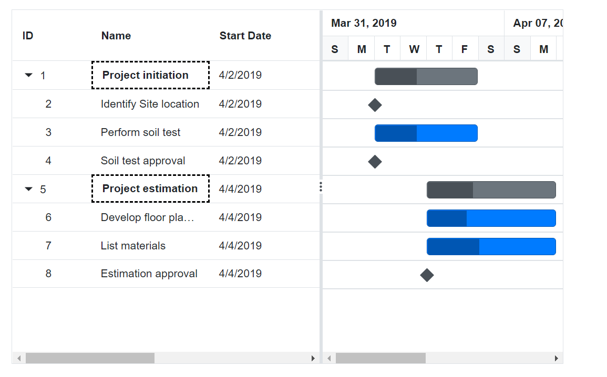

# Customize Appearance based on Hierarchy in Blazor Gantt Chart Component

In the Gantt Chart component, you can customize the appearance based on Hierarchy using `GetHierarchicalData` method. The following code example shows how to use the method.

```cshtml
@using Syncfusion.Blazor.Gantt
<SfGantt @ref="Gantt" DataSource="@TaskCollection" Height="450px" Width="700px">
    <GanttTaskFields Id="TaskId" Name="TaskName" StartDate="StartDate" EndDate="EndDate" Duration="Duration" Progress="Progress" ParentID="ParentId">
    </GanttTaskFields>
    <GanttEvents TValue="TaskData" QueryCellInfo="GanttCellInfo"></GanttEvents>
</SfGantt>

@code{
    SfGantt<TaskData> Gantt;
    public List<TaskData> TaskCollection { get; set; }
    protected override void OnInitialized()
    {
        this.TaskCollection = GetTaskCollection();
    }
    private void GanttCellInfo(Syncfusion.Blazor.Grids.QueryCellInfoEventArgs<TaskData> args)
    {
        dynamic data = Gantt.GetHierarchicalData(args.Data.TaskId);
        if ((data.level == 0) && args.Column.Field == "TaskName")
        {
            args.Cell.AddClass(new string[] { "customize-parent" });
        }
    }
    public class TaskData
    {
        public int TaskId { get; set; }
        public string TaskName { get; set; }
        public DateTime StartDate { get; set; }
        public DateTime EndDate { get; set; }
        public string Duration { get; set; }
        public int Progress { get; set; }
        public int? ParentId { get; set; }
    }
    public static List<TaskData> GetTaskCollection()
    {
        List<TaskData> Tasks = new List<TaskData>() {
        new TaskData() { TaskId = 1, TaskName = "Project initiation", StartDate = new DateTime(2019, 04, 02), EndDate = new DateTime(2019, 04, 21) },
        new TaskData() { TaskId = 2, TaskName = "Identify Site location", StartDate = new DateTime(2019, 04, 02), Duration = "0", Progress = 30, ParentId = 1 },
        new TaskData() { TaskId = 3, TaskName = "Perform soil test", StartDate = new DateTime(2019, 04, 02), Duration = "4", Progress = 40, ParentId = 1 },
        new TaskData() { TaskId = 4, TaskName = "Soil test approval", StartDate = new DateTime(2019, 04, 02), Duration = "0", Progress = 30, ParentId = 1 },
        new TaskData() { TaskId = 5, TaskName = "Project estimation", StartDate = new DateTime(2019, 04, 02), EndDate = new DateTime(2019, 04, 21) },
        new TaskData() { TaskId = 6, TaskName = "Develop floor plan for estimation", StartDate = new DateTime(2019, 04, 04), Duration = "3", Progress = 30, ParentId = 5 },
        new TaskData() { TaskId = 7, TaskName = "List materials", StartDate = new DateTime(2019, 04, 04), Duration = "3", Progress = 40, ParentId = 5 },
        new TaskData() { TaskId = 8, TaskName = "Estimation approval", StartDate = new DateTime(2019, 04, 04), Duration = "0", Progress = 30, ParentId = 5 }
    };
        return Tasks;
    }
}

<style>
    .customize-parent {
        font-weight: bold;
        border: 2px dashed black !important;
    }
</style>
```

The following screenshot shows the output of the above code snippet.

