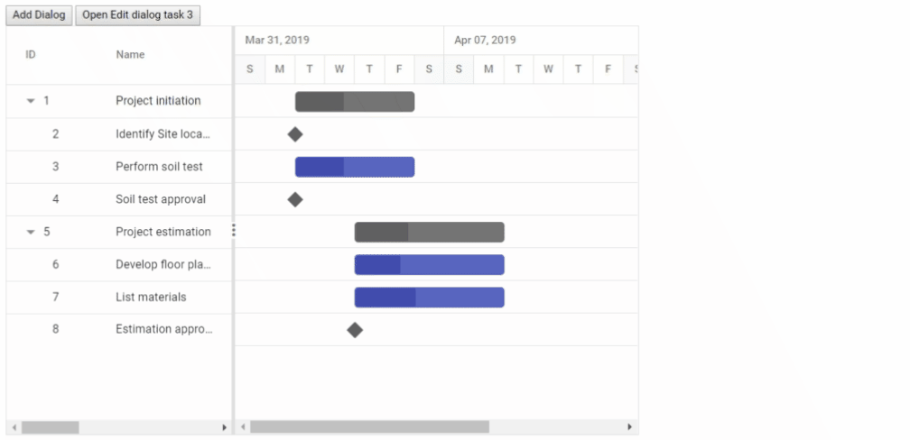

# Open Add Edit Dialog Dynamically

Gantt Chart add and edit dialogs can be opened dynamically by using `OpenAddDialog` and `OpenEditDialog` methods. The following code example shows how to open add and edit dialog on separate button click actions.

```csharp
@using Syncfusion.Blazor.Gantt
<button @onclick="AddDialog">Add Dialog</button>
<button @onclick="EditDialog">Open Edit dialog task 3</button>
<SfGantt @ref="Gantt" DataSource="@TaskCollection" Height="450px" Width="700px">
    <GanttTaskFields Id="TaskId" Name="TaskName" StartDate="StartDate" EndDate="EndDate" Duration="Duration" Progress="Progress" Child="SubTasks">
    </GanttTaskFields>
    <GanttEditSettings AllowEditing="true" AllowAdding="true"></GanttEditSettings>
</SfGantt>

@code{
    public SfGantt<TaskData> Gantt;
    public void AddDialog()
    {
       this.Gantt.OpenAddDialogAsync();
    }
    public void EditDialog()
    {
       this.Gantt.OpenEditDialogAsync(3);
    }
    public List<TaskData> TaskCollection { get; set; }
    protected override void OnInitialized()
    {
        this.TaskCollection = GetTaskCollection();
    }

    public class TaskData
    {
        public int TaskId { get; set; }
        public string TaskName { get; set; }
        public DateTime StartDate { get; set; }
        public DateTime EndDate { get; set; }
        public string Duration { get; set; }
        public int Progress { get; set; }
        public List<TaskData> SubTasks { get; set; }
    }

    public static List <TaskData> GetTaskCollection() {
    List <TaskData> Tasks = new List <TaskData> () {
        new TaskData() {
            TaskId = 1,
            TaskName = "Project initiation",
            StartDate = new DateTime(2019, 04, 02),
            EndDate = new DateTime(2019, 04, 21),
            SubTasks = (new List <TaskData> () {
                new TaskData() {
                    TaskId = 2,
                    TaskName = "Identify Site location",
                    StartDate = new DateTime(2019, 04, 02),
                    Duration = "0",
                    Progress = 30,
                },
                new TaskData() {
                    TaskId = 3,
                    TaskName = "Perform soil test",
                    StartDate = new DateTime(2019, 04, 02),
                    Duration = "4",
                    Progress = 40,
                },
                new TaskData() {
                    TaskId = 4,
                    TaskName = "Soil test approval",
                    StartDate = new DateTime(2019, 04, 02),
                    Duration = "0",
                    Progress = 30
                },
            })
        },
        new TaskData() {
            TaskId = 5,
            TaskName = "Project estimation",
            StartDate = new DateTime(2019, 04, 02),
            EndDate = new DateTime(2019, 04, 21),
            SubTasks = (new List <TaskData> () {
                new TaskData() {
                    TaskId = 6,
                    TaskName = "Develop floor plan for estimation",
                    StartDate = new DateTime(2019, 04, 04),
                    Duration = "3",
                    Progress = 30,
                },
                new TaskData() {
                    TaskId = 7,
                    TaskName = "List materials",
                    StartDate = new DateTime(2019, 04, 04),
                    Duration = "3",
                    Progress = 40
                },
                new TaskData() {
                    TaskId = 8,
                    TaskName = "Estimation approval",
                    StartDate = new DateTime(2019, 04, 04),
                    Duration = "0",
                    Progress = 30,
                }
            })
        }
    };

    return Tasks;
}
}
```

