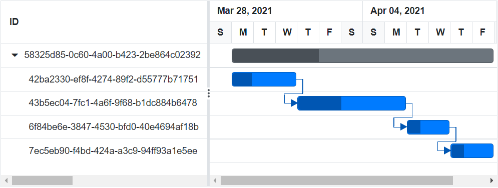
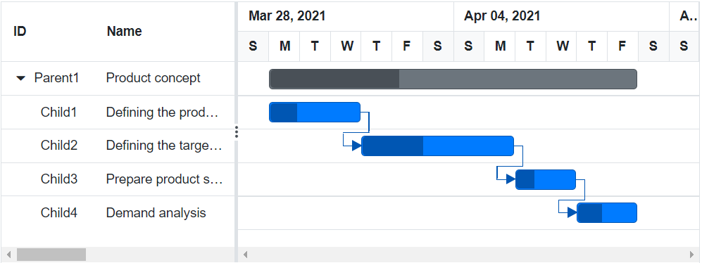

# Supported data types for task id

In the Gantt Chart component, you can bind the values of [GanttTaskFields.Id](https://help.syncfusion.com/cr/blazor/Syncfusion.Blazor.Gantt.GanttTaskFields.html#Syncfusion_Blazor_Gantt_GanttTaskFields_Id) field in following types.

* Integer
* GUID
* String

## Integer type

You can refer to our [Mapping task fields](https://blazor.syncfusion.com/documentation/gantt-chart/getting-started#mapping-task-fields) documentation link for integer type `GanttTaskFields.Id`

## GUID type

You can also use `GUID` type for `GanttTaskFields.Id`. When `GUID` type is used, it differs from `int` type and `string` type in following ways.

* Task id column will not be rendered in dependency tab of add/edit dialog.
* Task id will not be displayed in tooltip, which renders on hovering the connector lines.

```cshtml
@using Syncfusion.Blazor.Gantt
<SfGantt  DataSource="@TaskCollection" AllowResizing="true" Width="750px">
    <GanttTaskFields Id="TaskId" Name="TaskName" StartDate="StartDate" Duration="Duration" Progress="Progress"
     Dependency="Predecessor" ParentID="ParentId"></GanttTaskFields>
</SfGantt>
@code{
    private List<TaskData> TaskCollection { get; set; }
    protected override void OnInitialized()
    {
        this.TaskCollection = GanttData().ToList();
    }  
	public class TaskData
    {
        public Guid TaskId { get; set; }
        public string TaskName { get; set; }
        public DateTime? StartDate { get; set; }
        public string Duration { get; set; }
        public int Progress { get; set; }
        public string Predecessor { get; set; }
        public Guid? ParentId { get; set; }
    }
    public static List<TaskData> GanttData()
    {
        List<TaskData> Tasks = new List<TaskData>();
        Tasks.Add(new TaskData() { TaskId = Guid.NewGuid(), TaskName = "Product concept", StartDate = new DateTime(2021, 03, 28), Duration = "5 days" });
        Tasks.Add(new TaskData() { TaskId = Guid.NewGuid(), TaskName = "Defining the product usage", StartDate = new DateTime(2021, 03, 28), Duration = "3", Progress = 30, ParentId = Tasks[0].TaskId });
        Tasks.Add(new TaskData() { TaskId = Guid.NewGuid(), TaskName = "Defining the target audience", StartDate = new DateTime(2021, 03, 28), Duration = "3", Progress = 40, ParentId = Tasks[0].TaskId, Predecessor=Tasks[1].TaskId.ToString() + " FS" });
        Tasks.Add(new TaskData() { TaskId = Guid.NewGuid(), TaskName = "Prepare product sketch and notes", StartDate = new DateTime(2021, 04, 01), Duration = "2", Progress = 30, ParentId = Tasks[0].TaskId, Predecessor=Tasks[2].TaskId.ToString() + " FS" });
        Tasks.Add(new TaskData() { TaskId = Guid.NewGuid(), TaskName = "Market research", StartDate = new DateTime(2021, 04, 05), Duration = "2", Progress = 30, ParentId = Tasks[0].TaskId, Predecessor=Tasks[3].TaskId.ToString() + " FS" });
        return Tasks;
    }
}
```

The following screenshot shows the output of the above code snippet.



## String type

You can also use `string` type for `GanttTaskFields.Id` as shown in the following code snippet.

```cshtml
@using Syncfusion.Blazor.Gantt

<SfGantt DataSource="@TaskCollection" Width="750px">
    <GanttTaskFields Id="TaskId" Name="TaskName" StartDate="StartDate"  Duration="Duration" Progress="Progress"
    Dependency="Predecessor" ParentID="ParentId"></GanttTaskFields>
</SfGantt>

@code{
    private List<TaskData> TaskCollection { get; set; }
    protected override void OnInitialized()
    {
        this.TaskCollection = GanttData().ToList();
    }
	public class TaskData
    {
        public string TaskId { get; set; }
        public string TaskName { get; set; }
        public DateTime StartDate { get; set; }
        public string Duration { get; set; }
        public int Progress { get; set; }
        public string ParentId { get; set; }
        public string Predecessor { get; set; } 
    }
    public static List<TaskData> GanttData()
    {
        List<TaskData> Tasks = new List<TaskData>() {
            new TaskData() { TaskId = "Parent1", TaskName = "Product concept", StartDate = new DateTime(2021, 03, 28), Duration = "5 days" },
            new TaskData() { TaskId = "Child1", TaskName = "Defining the product usage", StartDate = new DateTime(2021, 03, 28), Duration = "3", Progress = 30, ParentId = "Parent1" },
            new TaskData() { TaskId = "Child2", TaskName = "Defining the target audience", StartDate = new DateTime(2021, 03, 28), Duration = "3", Progress = 40, ParentId = "Parent1", Predecessor="Child1 FS" },
            new TaskData() { TaskId = "Child3", TaskName = "Prepare product sketch and notes", StartDate = new DateTime(2021, 04, 01), Duration = "2", Progress = 30, ParentId = "Parent1", Predecessor="Child2 FS" },
            new TaskData() { TaskId = "Child4", TaskName = "Demand analysis", StartDate = new DateTime(2021, 04, 05), Duration = "2", Progress = 40, ParentId = "Parent1", Predecessor="Child3 FS" },
        };
        return Tasks;
    }
}
```

> The Id field in general tab of add dialog will be in the edited state.

The following screenshot shows the output of the above code snippet.



## Limitations

* The predecessor value contains id to which the task relationship should be established and [predecessor types](https://blazor.syncfusion.com/documentation/gantt-chart/task-dependencies#task-relationship-types). In string/GUID type, while providing predecessor values both on load time and on cell editing, a space should be given between task id and predecessor types.
* In string type, the id field in add dialog will be in edited state. The id should not contain an empty space.
