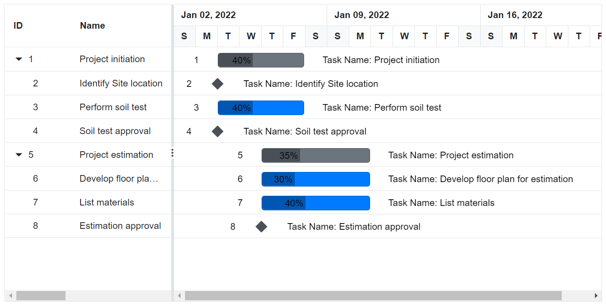

# Task Labels in Blazor Gantt Chart Component

Task labels in the Blazor Gantt Chart component display key task information directly on or near taskbars, enhancing project visualization without requiring task interaction. Configured via the [GanttLabelSettings](https://help.syncfusion.com/cr/blazor/Syncfusion.Blazor.Gantt.GanttLabelSettings-1.html) property, labels show details like task names, IDs, or progress, streamlining workflows for resource management and status tracking. Labels support three positions: left labels outside the taskbar for identifiers like **TaskName**, right labels after the taskbar for metrics like **Progress**, and task labels overlaid on taskbars for prominent data like task titles. Left and right labels remain visible regardless of taskbar width, while task labels may clip for short tasks. Labels improve readability and provide immediate context, reducing the need for hovers or dialogs in large projects.

## Configure task labels

Task labels are configured using the [GanttLabelSettings](https://help.syncfusion.com/cr/blazor/Syncfusion.Blazor.Gantt.GanttLabelSettings-1.html) property, mapping fields from the data source defined in [GanttTaskFields](https://help.syncfusion.com/cr/blazor/Syncfusion.Blazor.Gantt.GanttTaskFields.html) (e.g., id to TaskID, name to TaskName). The component supports three label positions with specific use cases:
- [LeftLabel](https://help.syncfusion.com/cr/blazor/Syncfusion.Blazor.Gantt.GanttLabelSettings-1.html#Syncfusion_Blazor_Gantt_GanttLabelSettings_1_LeftLabel): Displays content like task names or resource assignments to the left of taskbars, ideal for identifiers.
- [RightLabel](https://help.syncfusion.com/cr/blazor/Syncfusion.Blazor.Gantt.GanttLabelSettings-1.html#Syncfusion_Blazor_Gantt_GanttLabelSettings_1_RightLabel): Shows metrics like progress percentages or durations to the right, suitable for completion data.
- [TaskLabel](https://help.syncfusion.com/cr/blazor/Syncfusion.Blazor.Gantt.GanttLabelSettings-1.html#Syncfusion_Blazor_Gantt_GanttLabelSettings_1_TaskLabel): Overlays content like task titles or progress on taskbars, prominent but limited by taskbar width.

Use template literals for formatted labels, such as **${Progress}%** for progress percentages. Ensure valid `GanttTaskFields` mappings to reference fields accurately.

The following example configures labels for task names, IDs, and progress:

```cshtml
@using Syncfusion.Blazor.Gantt

<SfGantt DataSource="@TaskCollection" Height="450px" Width="900px">
    <GanttTaskFields Id="TaskId" Name="TaskName" StartDate="StartDate" EndDate="EndDate"
                     Duration="Duration" Progress="Progress" ParentID="ParentId">
    </GanttTaskFields>
    <GanttLabelSettings LeftLabel="TaskId" TValue="TaskData">
        <RightLabelTemplate>
            <div class="e-right-label-inner-div" style="height:22px;margin-top:7px;">
                <span class="e-label">Task Name: @((context as TaskData).TaskName)</span>
            </div>
        </RightLabelTemplate>
        <TaskLabelTemplate>
            <div class="e-task-label-inner-div" style="line-height:21px; height:22px;">
                <span class="e-label">@((context as TaskData).Progress)%</span>
            </div>
        </TaskLabelTemplate>
    </GanttLabelSettings>
</SfGantt>

@code{
    private List<TaskData> TaskCollection { get; set; }

    protected override void OnInitialized()
    {
        this.TaskCollection = GetTaskCollection();
    }
    
    public class TaskData
    {
        public int TaskId { get; set; }
        public string TaskName { get; set; }
        public DateTime StartDate { get; set; }
        public DateTime EndDate { get; set; }
        public string Duration { get; set; }
        public int Progress { get; set; }
        public int? ParentId { get; set; }
    }

    private static List<TaskData> GetTaskCollection()
    {
        List<TaskData> Tasks = new List<TaskData>()
{
            new TaskData() { TaskId = 1, TaskName = "Project initiation", StartDate = new DateTime(2022, 01, 04), EndDate = new DateTime(2022, 01, 17), },
            new TaskData() { TaskId = 2, TaskName = "Identify Site location", StartDate = new DateTime(2022, 01, 04), Duration = "0", Progress = 30, ParentId = 1, },
            new TaskData() { TaskId = 3, TaskName = "Perform soil test", StartDate = new DateTime(2022, 01, 04), Duration = "4", Progress = 40, ParentId = 1, },
            new TaskData() { TaskId = 4, TaskName = "Soil test approval", StartDate = new DateTime(2022, 01, 04), Duration = "0", Progress = 30, ParentId = 1, },
            new TaskData() { TaskId = 5, TaskName = "Project estimation", StartDate = new DateTime(2022, 01, 04), EndDate = new DateTime(2022, 01, 17), },
            new TaskData() { TaskId = 6, TaskName = "Develop floor plan for estimation", StartDate = new DateTime(2022, 01, 06), Duration = "3", Progress = 30, ParentId = 5, },
            new TaskData() { TaskId = 7, TaskName = "List materials", StartDate = new DateTime(2022, 01, 06), Duration = "3", Progress = 40, ParentId = 5, },
            new TaskData() { TaskId = 8, TaskName = "Estimation approval", StartDate = new DateTime(2022, 01, 06), Duration = "0", Progress = 30, ParentId = 5, }
        };
        return Tasks;
    }
}

<style>
    .e-label {
        color: black !important;
    }
</style>
```


