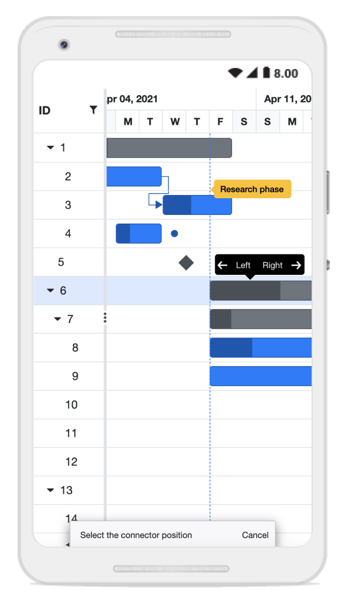
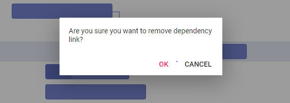

# Managing Tasks in Blazor Gantt Chart Component

Managing tasks in the Blazor Gantt Chart component enables dynamic project updates, such as inserting, deleting, or editing tasks and dependencies, by enabling [AllowAdding](https://help.syncfusion.com/cr/blazor/Syncfusion.Blazor.Gantt.GanttEditSettings.html#Syncfusion_Blazor_Gantt_GanttEditSettings_AllowAdding), [AllowDeleting](https://help.syncfusion.com/cr/blazor/Syncfusion.Blazor.Gantt.GanttEditSettings.html#Syncfusion_Blazor_Gantt_GanttEditSettings_AllowDeleting), [AllowEditing](https://help.syncfusion.com/cr/blazor/Syncfusion.Blazor.Gantt.GanttEditSettings.html#Syncfusion_Blazor_Gantt_GanttEditSettings_AllowEditing), and [AllowTaskbarEditing](https://help.syncfusion.com/cr/blazor/Syncfusion.Blazor.Gantt.GanttEditSettings.html#Syncfusion_Blazor_Gantt_GanttEditSettings_AllowTaskbarEditing). A primary key column, defined by [GanttColumn.IsPrimaryKey](https://help.syncfusion.com/cr/blazor/Syncfusion.Blazor.Gantt.GanttColumn.html#Syncfusion_Blazor_Gantt_GanttColumn_IsPrimaryKey) set to **true** (e.g., on id), ensures reliable CRUD operations and task identification. Editing modes include cell editing for quick TreeGrid updates, dialog editing for comprehensive changes, taskbar dragging for duration or date adjustments, and connector line dragging for dependencies. Customize dialogs with templates or fields using [AddDialogFields](https://help.syncfusion.com/cr/blazor/Syncfusion.Blazor.Gantt.SfGantt-1.html#Syncfusion_Blazor_Gantt_SfGantt_1_AddDialogFields) and [EditDialogFields](https://help.syncfusion.com/cr/blazor/Syncfusion.Blazor.Gantt.SfGantt-1.html#Syncfusion_Blazor_Gantt_SfGantt_1_EditDialogFields). Methods like [AddRecordAsync](https://help.syncfusion.com/cr/blazor/Syncfusion.Blazor.Gantt.SfGantt-1.html#Syncfusion_Blazor_Gantt_SfGantt_1_AddRecordAsync__0_System_Nullable_System_Int32__System_Nullable_Syncfusion_Blazor_Gantt_RowPosition__System_Object_), [DeleteRecordAsync](https://help.syncfusion.com/cr/blazor/Syncfusion.Blazor.Gantt.SfGantt-1.html#Syncfusion_Blazor_Gantt_SfGantt_1_DeleteRecordAsync_System_Nullable_System_Int32__), and [UpdateRecordByIDAsync](https://help.syncfusion.com/cr/blazor/Syncfusion.Blazor.Gantt.SfGantt-1.html#Syncfusion_Blazor_Gantt_SfGantt_1_UpdateRecordByIDAsync__0_) support programmatic management. Ensure valid [GanttTaskFields](https://help.syncfusion.com/cr/blazor/Syncfusion.Blazor.Gantt.GanttTaskFields.html) mappings and a primary key to enable editing seamlessly.

The following code example demonstrates editing in the Gantt component.




@using Syncfusion.Blazor.Gantt
<SfGantt DataSource="@TaskCollection" Height="450px" Width="700px">
    <GanttTaskFields Id="TaskID" Name="TaskName" StartDate="StartDate" EndDate="EndDate" Duration="Duration" Progress="Progress" ParentID="ParentID" Dependency="Predecessor">
    </GanttTaskFields>
    <GanttEditSettings AllowTaskbarEditing="true" AllowEditing="true" Mode="Syncfusion.Blazor.Gantt.EditMode.Auto"></GanttEditSettings>
</SfGantt>

@code{
    private List<TaskData> TaskCollection { get; set; }
    protected override void OnInitialized()
    {
        this.TaskCollection = GetTaskCollection();
    }

    public class TaskData
    {
        public int TaskID { get; set; }
        public string TaskName { get; set; }
        public DateTime StartDate { get; set; }
        public DateTime? EndDate { get; set; }
        public string Duration { get; set; }
        public int Progress { get; set; }
        public string Predecessor { get; set; }
        public int? ParentID { get; set; }
    }

    public static List<TaskData> GetTaskCollection()
    {
        List<TaskData> Tasks = new List<TaskData>();
        Tasks.Add(new TaskData() { TaskID = 1, TaskName = "Project initiation", StartDate = new DateTime(2022, 04, 05), EndDate = new DateTime(2022, 04, 08), });
        Tasks.Add(new TaskData() { TaskID = 2, TaskName = "Identify Site location", StartDate = new DateTime(2022, 04, 05), Duration = "0", Progress = 30, ParentID = 1 });
        Tasks.Add(new TaskData() { TaskID = 3, TaskName = "Perform soil test", StartDate = new DateTime(2022, 04, 05), Duration = "4", Progress = 40, Predecessor = "2", ParentID = 1 });
        Tasks.Add(new TaskData() { TaskID = 4, TaskName = "Soil test approval", StartDate = new DateTime(2022, 04, 05), Duration = "0", Progress = 30, Predecessor = "3", ParentID = 1 });
        Tasks.Add(new TaskData() { TaskID = 5, TaskName = "Project estimation", StartDate = new DateTime(2022, 04, 11), EndDate = new DateTime(2022, 04, 18), });
        Tasks.Add(new TaskData() { TaskID = 6, TaskName = "Develop floor plan for estimation", StartDate = new DateTime(2022, 04, 06), Duration = "3", Progress = 30, Predecessor = "4", ParentID = 5 });
        Tasks.Add(new TaskData() { TaskID = 7, TaskName = "List materials", StartDate = new DateTime(2022, 04, 06), Duration = "3", Progress = 40, Predecessor = "6", ParentID = 5 });
        Tasks.Add(new TaskData() { TaskID = 8, TaskName = "Estimation approval", StartDate = new DateTime(2022, 04, 06), Duration = "0", Progress = 30, Predecessor = "7", ParentID = 5 });
        return Tasks;
    }
}






Editing feature requires a primary key column for CRUD operations. While defining columns in Gantt using the [GanttColumns](https://help.syncfusion.com/cr/blazor/Syncfusion.Blazor.Gantt.GanttColumns.html) property, it is mandatory that any one of the columns, must be a primary column. By default, the [Id](https://help.syncfusion.com/cr/blazor/Syncfusion.Blazor.Gantt.GanttTaskFields.html#Syncfusion_Blazor_Gantt_GanttTaskFields_Id) column will be the primary key column.  If `Id` column is not defined, we need to enable [IsPrimaryKey](https://help.syncfusion.com/cr/blazor/Syncfusion.Blazor.Gantt.GanttColumn.html#Syncfusion_Blazor_Gantt_GanttColumn_IsPrimaryKey) for any one of the columns defined in the `GanttColumns` property.

## Cell edit type and its params

The [GanttColumn.EditType](https://help.syncfusion.com/cr/blazor/Syncfusion.Blazor.Gantt.GanttColumn.html#Syncfusion_Blazor_Gantt_GanttColumn_EditType) is used to define the edit type for any particular column. You can set the `GanttColumn.editType` based on data type of the column.

Below is the combined content from the provided markdown sections in bullet points, as requested, ensuring clarity and conciseness while preserving the original information:

- **Cell edit types and components**:
  - **numericedit**: Uses the [NumericTextBox](https://blazor.syncfusion.com/documentation/numeric-textbox/getting-started) component for editing integers, doubles, and decimals.
  - **defaultedit**: Uses the [TextBox](https://blazor.syncfusion.com/documentation/textbox/getting-started) component for editing string data.
  - **dropdownedit**: Uses the [DropDownList](https://blazor.syncfusion.com/documentation/dropdown-list/getting-started) component to display all unique values for a field.
  - **booleanedit**: Uses the [Checkbox](https://blazor.syncfusion.com/documentation/check-box/getting-started) component for editing boolean data.
  - **datepickeredit**: Uses the [DatePicker](https://blazor.syncfusion.com/documentation/datepicker/getting-started) component for editing date data.
  - **datetimepickeredit**: Uses the [DateTimePicker](https://blazor.syncfusion.com/documentation/datetime-picker/getting-started) component for editing date-time data.

- **Customization**:
  - You can customize model of the `GanttColumn.EditType` component through the `GanttColumn.EditorSettings`.

- **Edit type parameters**:
  - **numericedit**: Supports parameters like `Decimals: 2`, `Value: 5`.
  - **dropdownedit**: Supports parameters like `Value: 'Germany'`.
  - **booleanedit**: Supports parameters like `Checked: true`.
  - **datepickeredit**: Supports parameters like `Format: 'dd.MM.yyyy'`.
  - **datetimepickeredit**: Supports parameters like `Value: new Date()`.




@using Syncfusion.Blazor.Gantt
<SfGantt @ref="Gantt" DataSource="@TaskCollection" Height="450px" Width="900px" Toolbar="@(new List<string>() { "Add", "Edit", "Delete", "Update", "Cancel" })">
    <GanttTaskFields Id="TaskID" Name="TaskName" StartDate="StartDate" EndDate="EndDate" Duration="Duration" Progress="Progress" ParentID="ParentID">
    </GanttTaskFields>
    <GanttColumns>
        <GanttColumn Field="TaskID" Width="100"></GanttColumn>
        <GanttColumn Field="TaskName" Width="250"></GanttColumn>
        <GanttColumn Field="StartDate" EditorSettings="DateParams" Type="Syncfusion.Blazor.Grids.ColumnType.DateTime" EditType="Syncfusion.Blazor.Grids.EditType.DateTimePickerEdit"></GanttColumn>
        <GanttColumn Field="Duration"></GanttColumn>
        <GanttColumn Field="Progress" EditorSettings="NumericParams" EditType="Syncfusion.Blazor.Grids.EditType.NumericEdit"></GanttColumn>
    </GanttColumns>
    <GanttEditSettings AllowEditing="true" AllowAdding="true"></GanttEditSettings>
</SfGantt>

@code{
    public SfGantt<TaskData> Gantt;
    private List<TaskData> TaskCollection { get; set; }
    public Syncfusion.Blazor.Grids.NumericEditCellParams NumericParams = new Syncfusion.Blazor.Grids.NumericEditCellParams()
    {
        Params = new Syncfusion.Blazor.Inputs.NumericTextBoxModel<object>() { Format = "N2" }
    };

    public Syncfusion.Blazor.Grids.DateEditCellParams DateParams = new Syncfusion.Blazor.Grids.DateEditCellParams()
    {
        Params = new Syncfusion.Blazor.Calendars.DatePickerModel() { Format = "d" }
    };
    protected override void OnInitialized()
    {
        this.TaskCollection = GetTaskCollection();
    }
    public class TaskData
    {
        public int TaskID { get; set; }
        public string TaskName { get; set; }
        public DateTime StartDate { get; set; }
        public DateTime? EndDate { get; set; }
        public string Duration { get; set; }
        public int Progress { get; set; }
        public int? ParentID { get; set; }
    }

    public static List<TaskData> GetTaskCollection()
    {
        List<TaskData> Tasks = new List<TaskData>()
        {
            new TaskData() { TaskID = 1, TaskName = "Project initiation", StartDate = new DateTime(2022, 04, 05), EndDate = new DateTime(2022, 04, 08) },
            new TaskData() { TaskID = 2, TaskName = "Identify Site location", StartDate = new DateTime(2022, 04, 05), Duration = "0", Progress = 30, ParentID = 1 },
            new TaskData() { TaskID = 3, TaskName = "Perform soil test", StartDate = new DateTime(2022, 04, 05), Duration = "4", Progress = 40, ParentID = 1 },
            new TaskData() { TaskID = 4, TaskName = "Soil test approval", StartDate = new DateTime(2022, 04, 05), Duration = "0", Progress = 30, ParentID = 1 },
            new TaskData() { TaskID = 5, TaskName = "Project estimation", StartDate = new DateTime(2022, 04, 06), EndDate = new DateTime(2022, 04, 08), },
            new TaskData() { TaskID = 6, TaskName = "Develop floor plan for estimation", StartDate = new DateTime(2022, 04, 06), Duration = "3", Progress = 30, ParentID = 5 },
            new TaskData() { TaskID = 7, TaskName = "List materials", StartDate = new DateTime(2022, 04, 06), Duration = "3", Progress = 40, ParentID = 5 },
            new TaskData() { TaskID = 8, TaskName = "Estimation approval", StartDate = new DateTime(2022, 04, 06), Duration = "0", Progress = 30, ParentID = 5 },
        };
        return Tasks;
    }
}






> If edit type is not defined in the column, then it will be considered as the **StringEdit** type (Textbox component).

## Cell edit template

The cell edit template feature in Syncfusion Blazor Gantt Chart component allows you to customize the editing interface of individual cells by embedding custom components or HTML elements. Instead of using the default editor such as a textbox, you can define a template that provides a tailored editing experience such as a dropdown, date picker, or checkbox based on your application's requirements. This is especially useful when you need more control over how data is entered or displayed during editing.

The following code example demonstrates how to define an edit template for a specific column, where the **TaskName** field is rendered using a dropdown.




@using Syncfusion.Blazor.Gantt
@using Syncfusion.Blazor.DropDowns;
<SfGantt DataSource="@TaskCollection" Height="450px" Width="700px" Toolbar="@(new List<string>() { "Add", "Cancel", "Edit", "Update", })">
    <GanttTaskFields Id="TaskID" Name="TaskName" StartDate="StartDate" EndDate="EndDate" Duration="Duration" Progress="Progress" ParentID="ParentID">
    </GanttTaskFields>
    <GanttColumns>
        <GanttColumn Field="TaskID" IsPrimaryKey=true></GanttColumn>
        <GanttColumn Field="TaskName">
            <EditTemplate>
                @{
                    var task = (context as TaskData);
                }
                <SfDropDownList @ref="dropdown" Placeholder="Name" FloatLabelType="Syncfusion.Blazor.Inputs.FloatLabelType.Always" ID="TaskName" @bind-Value="task.TaskName" TItem="string" TValue="string" DataSource="@DropDownData">
                </SfDropDownList>
            </EditTemplate>
        </GanttColumn>
        <GanttColumn Field="Duration"></GanttColumn>
        <GanttColumn Field="StartDate"></GanttColumn>
        <GanttColumn Field="Progress"></GanttColumn>
    </GanttColumns>
    <GanttEditSettings AllowAdding="true" AllowEditing=true AllowTaskbarEditing=true></GanttEditSettings>
    <GanttEvents OnCellSave="CellSaveHandler" TValue="TaskData"></GanttEvents>
</SfGantt>

@code{
    SfDropDownList<string, string> dropdown;

    private void CellSaveHandler(CellSaveArgs<TaskData> args)
    {
        if (args.ColumnName == "TaskName")
        {
            args.Value = dropdown.Value;
        }
    }
    private List<TaskData> TaskCollection { get; set; }
    private List<string> DropDownData { get; set; }
    protected override void OnInitialized()
    {
        this.TaskCollection = GetTaskCollection();
        this.DropDownData = TaskCollection.Select(s => s.TaskName).Distinct().ToList();
    }

    public class TaskData
    {
        public int TaskID { get; set; }
        public string TaskName { get; set; }
        public DateTime StartDate { get; set; }
        public DateTime? EndDate { get; set; }
        public string Duration { get; set; }
        public int Progress { get; set; }
        public int? ParentID { get; set; }
    }

    public static List<TaskData> GetTaskCollection()
    {
        List<TaskData> Tasks = new List<TaskData>() 
        {
            new TaskData() { TaskID = 1, TaskName = "Project initiation", StartDate = new DateTime(2022, 04, 05), EndDate = new DateTime(2022, 04, 08) },
            new TaskData() { TaskID = 2, TaskName = "Identify Site location", StartDate = new DateTime(2022, 04, 05), Duration = "4", Progress = 30, ParentID = 1 },
            new TaskData() { TaskID = 3, TaskName = "Perform soil test", StartDate = new DateTime(2022, 04, 05), Duration = "4", Progress = 40, ParentID = 1 },
            new TaskData() { TaskID = 4, TaskName = "Soil test approval", StartDate = new DateTime(2022, 04, 05), Duration = "4", Progress = 30, ParentID = 1 },
            new TaskData() { TaskID = 5, TaskName = "Project estimation", StartDate = new DateTime(2022, 04, 06), EndDate = new DateTime(2022, 04, 08) },
            new TaskData() { TaskID = 6, TaskName = "Develop floor plan for estimation", StartDate = new DateTime(2022, 04, 06), Duration = "3", Progress = 30, ParentID = 5 },
            new TaskData() { TaskID = 7, TaskName = "List materials", StartDate = new DateTime(2022, 04, 06), Duration = "3", Progress = 40, ParentID = 5 },
            new TaskData() { TaskID = 8, TaskName = "Estimation approval", StartDate = new DateTime(2022, 04, 06), Duration = "3", Progress = 30, ParentID = 5 }
        };
        return Tasks;
    }
}






## Disable editing for particular column

You can disable editing for particular columns, by using the [GanttColumn.AllowEditing](https://help.syncfusion.com/cr/blazor/Syncfusion.Blazor.Gantt.GanttColumn.html#Syncfusion_Blazor_Gantt_GanttColumn_AllowEditing) property.

In the following demo, editing is disabled for the **TaskName** column.




@using Syncfusion.Blazor.Gantt
<SfGantt @ref="Gantt" DataSource="@TaskCollection" Height="450px" Width="900px" Toolbar="@(new List<string>() { "Edit" })">
    <GanttTaskFields Id="TaskID" Name="TaskName" StartDate="StartDate" EndDate="EndDate" Duration="Duration" Progress="Progress" ParentID="ParentID">
    </GanttTaskFields>
    <GanttColumns>
        <GanttColumn Field="TaskID" Width="100"></GanttColumn>
        <GanttColumn Field="TaskName" Width="250" AllowEditing="false"></GanttColumn>
        <GanttColumn Field="StartDate"></GanttColumn>
        <GanttColumn Field="Duration"></GanttColumn>
        <GanttColumn Field="Progress"></GanttColumn>
    </GanttColumns>
    <GanttEditSettings AllowEditing="true"></GanttEditSettings>
</SfGantt>

@code{
    public SfGantt<TaskData> Gantt;
    private List<TaskData> TaskCollection { get; set; }
    protected override void OnInitialized()
    {
        this.TaskCollection = GetTaskCollection();
    }
    public class TaskData
    {
        public int TaskID { get; set; }
        public string TaskName { get; set; }
        public DateTime StartDate { get; set; }
        public DateTime? EndDate { get; set; }
        public string Duration { get; set; }
        public int Progress { get; set; }
        public int? ParentID { get; set; }
    }

    public static List<TaskData> GetTaskCollection()
        {
            List<TaskData> Tasks = new List<TaskData>()
            {
                new TaskData() { TaskID = 1, TaskName = "Project initiation", StartDate = new DateTime(2022, 04, 05), EndDate = new DateTime(2022, 04, 08), },
                new TaskData() { TaskID = 2, TaskName = "Identify Site location", StartDate = new DateTime(2022, 04, 05), Duration = "0", Progress = 30, ParentID = 1 },
                new TaskData() { TaskID = 3, TaskName = "Perform soil test", StartDate = new DateTime(2022, 04, 05), Duration = "4", Progress = 40, ParentID = 1 },
                new TaskData() { TaskID = 4, TaskName = "Soil test approval", StartDate = new DateTime(2022, 04, 05), Duration = "0", Progress = 30, ParentID = 1 },
                new TaskData() { TaskID = 5, TaskName = "Project estimation", StartDate = new DateTime(2022, 04, 06), EndDate = new DateTime(2022, 04, 08), },
                new TaskData() { TaskID = 6, TaskName = "Develop floor plan for estimation", StartDate = new DateTime(2022, 04, 06), Duration = "3", Progress = 30, ParentID = 5 },
                new TaskData() { TaskID = 7, TaskName = "List materials", StartDate = new DateTime(2022, 04, 06), Duration = "3", Progress = 40, ParentID = 5 },
                new TaskData() { TaskID = 8, TaskName = "Estimation approval", StartDate = new DateTime(2022, 04, 06), Duration = "0", Progress = 30, ParentID = 5 },
            };
            return Tasks;
        }
}






## Troubleshoot: Editing works only when primary key column is defined

The editing feature in the Syncfusion Blazor Gantt Chart component requires a primary key column to perform CRUD operations. When defining columns using the [GanttColumns](https://help.syncfusion.com/cr/blazor/Syncfusion.Blazor.Gantt.GanttColumns.html) property, at least one column must be marked as the primary key.

By default, the [Id](https://help.syncfusion.com/cr/blazor/Syncfusion.Blazor.Gantt.GanttTaskFields.html#Syncfusion_Blazor_Gantt_GanttTaskFields_Id) column is considered the primary key. If the `Id` column is not defined, you must explicitly set the [IsPrimaryKey](https://help.syncfusion.com/cr/blazor/Syncfusion.Blazor.Gantt.GanttColumn.html#Syncfusion_Blazor_Gantt_GanttColumn_IsPrimaryKey) property to true for one of the columns in the `GanttColumns` collection to enable editing functionality.

## Touch interaction

The Gantt Chart component editing actions can be achieved using the double tap and tap and drag actions on an element.

The following table describes different types of editing modes available in Gantt.

Action |Description
-----|-----
[Cell editing](https://blazor.syncfusion.com/documentation/gantt-chart/editing-tasks#cell-editing) | To perform `double tap` on a specific cell, initiate the cell to be in edit state.
[Dialog editing](https://blazor.syncfusion.com/documentation/gantt-chart/editing-tasks#dialog-editing) | To perform `double tap` on a specific row, initiate the edit dialog to be opened.
[Taskbar editing](https://blazor.syncfusion.com/documentation/gantt-chart/taskbar-editing) | Taskbar editing action is initiated using the `tap` action on the taskbar.   **Parent taskbar** : Once you tap on the parent taskbar, it will be changed to editing state. Perform only dragging action on parent taskbar editing.     **Child taskbar** : Once you tap the child taskbar, it will be changed to editing state.      **Dragging taskbar** : To drag a taskbar to the left or right in editing state.     **Resizing taskbar** : To resize a taskbar, drag the left/right resize icon.     **Progress resizing** : To change the progress, drag the progress resize icon to the left or right direction.

### Task dependency editing

You can tap the left/right connector point to initiate task [dependencies](https://blazor.syncfusion.com/documentation/gantt-chart/managing-tasks#task-dependency-editing) edit mode and again tap another taskbar to establish the dependency line between two taskbars.

Once the dependency edit mode is initiated, a dialog appears with the message **Choose another task** and a **Cancel** button. Tapping another taskbar will prompt a second dialog with the message **Select the connector position** and a tooltip near the second taskbar showing **Left** and **Right** buttons. Selecting one of these buttons establishes the dependency relationship between the two tasks. You can click the **Cancel** button at any time to exit the edit mode.

The following table explains the taskbar state in dependency edit mode.

Taskbar state |Description
-----|-----
Parent taskbar | You cannot create dependency relationship to parent tasks.   
Taskbar without dependency |  If you tap a valid child taskbar, it will create `FS` type dependency line between tasks, otherwise exits from task dependency edit mode.   
Taskbar with dependency | If you tap the second taskbar, which has already been directly connected, it will ask to remove it.   
Removing dependency | Once you tap the taskbar with direct dependency, then confirmation dialog will be shown for removing dependency.   

## Taskbar editing tooltip

The taskbar editing tooltip can be customized using the [GanttTooltipSettings.ShowTooltipOnEditing](https://help.syncfusion.com/cr/blazor/Syncfusion.Blazor.Gantt.GanttTooltipSettings-1.html#Syncfusion_Blazor_Gantt_GanttTooltipSettings_1_ShowTooltipOnEditing) property. By default, this property is set to **true**. The following code example shows how to customize the taskbar editing tooltip in Gantt Chart.




@using Syncfusion.Blazor.Gantt
<SfGantt DataSource="@TaskCollection" Height="450px" Width="900px" TreeColumnIndex="1"
    Toolbar="@(new List<string>() { "Add", "Cancel", "CollapseAll", "Delete", "Edit", "ExpandAll", "Search", "Update" , "Indent" , "Outdent"})">
    <GanttTaskFields Id="TaskID" Name="TaskName" StartDate="StartDate" EndDate="EndDate"
        Duration="Duration" Progress="Progress" Dependency="Predecessor" ParentID="ParentID" Notes="Notes">
    </GanttTaskFields>
    <GanttEditSettings AllowTaskbarEditing="true" AllowEditing="true" AllowAdding="true" AllowDeleting="true">
    </GanttEditSettings>
    <GanttTooltipSettings ShowTooltipOnEditing="true" TValue="TaskData"></GanttTooltipSettings>
</SfGantt>
@code {
    private List<TaskData> TaskCollection { get; set; }
    protected override void OnInitialized()
    {
        this.TaskCollection = this.TaskCollection = GetTaskCollection();
    }
    public class TaskData
    {
        public int TaskID { get; set; }
        public string TaskName { get; set; }
        public DateTime StartDate { get; set; }
        public DateTime EndDate { get; set; }
        public string Duration { get; set; }
        public int Progress { get; set; }
        public string Predecessor { get; set; }
        public string Notes { get; set; }
        public int? ParentID { get; set; }
    }

    public static List<TaskData> GetTaskCollection()
    {
        List<TaskData> Tasks = new List<TaskData>() {
            new TaskData() {TaskID = 1, TaskName = "Project initiation", StartDate = new DateTime(2019, 04, 02), EndDate = new DateTime(2019, 04, 10)},
            new TaskData() { TaskID = 2, TaskName = "Identify Site location", StartDate = new DateTime(2019, 04, 02), Duration = "3", Progress = 30, ParentID = 1 },
            new TaskData() { TaskID = 3, TaskName = "Perform soil test", StartDate = new DateTime(2019, 04, 02), Duration = "4", Progress = 40, Predecessor = "2FS", ParentID = 1 },
            new TaskData() { TaskID = 4, TaskName = "Soil test approval", StartDate = new DateTime(2019, 04, 02), Duration = "0", Progress = 30, Predecessor = "3FF", ParentID = 1 },
            new TaskData() { TaskID = 5, TaskName = "Project estimation", StartDate = new DateTime(2019, 04, 04), EndDate = new DateTime(2019, 04, 08)},
            new TaskData() { TaskID = 6, TaskName = "Develop floor plan for estimation", StartDate = new DateTime(2019, 04, 04), Duration = "3", Progress = 30, ParentID = 5 },
            new TaskData() { TaskID = 7, TaskName = "List materials", StartDate = new DateTime(2019, 04, 04), Duration = "3", Progress = 40, Predecessor = "6SS", ParentID = 5 }
        };
        return Tasks;
    }
}






### Template

The taskbar editing tooltip can be customized using the [GanttTooltipSettings.EditingTemplate](https://help.syncfusion.com/cr/blazor/Syncfusion.Blazor.Gantt.GanttTooltipSettings-1.html#Syncfusion_Blazor_Gantt_GanttTooltipSettings_1_EditingTemplate) property. The following code example shows how to customize the taskbar editing tooltip in a Gantt Chart:




@using Syncfusion.Blazor.Gantt
<SfGantt DataSource="@TaskCollection" Height="450px" Width="700px">
    <GanttTaskFields Id="TaskID" Name="TaskName" StartDate="StartDate" EndDate="EndDate" Duration="Duration"    Progress="Progress" ParentID="ParentID"></GanttTaskFields>
    <GanttEditSettings AllowTaskbarEditing="true" AllowEditing="true" AllowAdding="true"
        AllowDeleting="true"  ShowDeleteConfirmDialog="true">
    </GanttEditSettings>
    <GanttTooltipSettings ShowTooltip="true" TValue="TaskData">
        <EditingTemplate>
            <table>
                @{
                    var template = (context as TaskData);
                    if (TaskbarEditAction == "LeftResizing")
                    {
                        <tr> <td style="padding:3px">@(template.StartDate.ToString("MMM dd, yyyy"))</td> </tr>
                        <tr> <td style="padding:6px">@(template.Duration) days</td> </tr>
                    } 
                    else if (TaskbarEditAction == "RightResizing")
                    {
                        <tr> <td style="padding:3px">@(template.EndDate.ToString("MMM dd, yyyy"))</td> </tr>
                        <tr> <td style="padding:6px">@(template.Duration) days</td> </tr>
                    }
                    else if (TaskbarEditAction == "ChildDrag" || TaskbarEditAction == "ParentDrag" || TaskbarEditAction == "MilestoneDrag")
                    {
                        <tr> <td style="padding:3px">@(template.StartDate.ToString("MMM dd, yyyy"))</td> </tr>
                        <tr> <td style="padding:3px">@(template.EndDate.ToString("MMM dd, yyyy"))</td> </tr>
                    }
                    else if (TaskbarEditAction == "ProgressResizing")
                    {
                        <tr> <td style="padding:3px">@(template.Progress) %</td> </tr>
                    }
                }
            </table>
            </EditingTemplate>
        </GanttTooltipSettings>
        <GanttEvents TaskbarEditing="TaskbarEditingHandler" TValue="TaskData"></GanttEvents>
</SfGantt>
@code {
    private List<TaskData> TaskCollection { get; set; }
    private string TaskbarEditAction { get; set; }
    private void TaskbarEditingHandler(TaskbarEditingEventArgs<TaskData> args)
    {
        TaskbarEditAction = args.Action;
    }
    protected override void OnInitialized()
    {
        this.TaskCollection = GetTaskCollection();
    }
    public class TaskData
    {
        public int TaskID { get; set; }
        public string TaskName { get; set; }
        public DateTime StartDate { get; set; }
        public DateTime EndDate { get; set; }
        public string Duration { get; set; }
        public int Progress { get; set; }
        public int? ParentID { get; set; }
    }

    public static List<TaskData> GetTaskCollection()
    {
        List<TaskData> Tasks = new List<TaskData>() {
            new TaskData() {TaskID = 1, TaskName = "Project initiation", StartDate = new DateTime(2019, 04, 02), EndDate = new DateTime(2019, 04, 05)},
            new TaskData() { TaskID = 2, TaskName = "Identify Site location", StartDate = new DateTime(2019, 04, 02), Duration = "3", Progress = 30, ParentID = 1 },
            new TaskData() { TaskID = 3, TaskName = "Perform soil test", StartDate = new DateTime(2019, 04, 02), Duration = "4", Progress = 40, ParentID = 1 },
            new TaskData() { TaskID = 4, TaskName = "Soil test approval", StartDate = new DateTime(2019, 04, 02), Duration = "0", Progress = 30, ParentID = 1 },
            new TaskData() { TaskID = 5, TaskName = "Project estimation", StartDate = new DateTime(2019, 04, 04), EndDate = new DateTime(2019, 04, 08)},
            new TaskData() { TaskID = 6, TaskName = "Develop floor plan for estimation", StartDate = new DateTime(2019, 04, 04), Duration = "3", Progress = 30, ParentID = 5 },
            new TaskData() { TaskID = 7, TaskName = "List materials", StartDate = new DateTime(2019, 04, 04), Duration = "3", Progress = 40, ParentID = 5 }
        };
        return Tasks;
    }
}






## See also
- [How to add new tasks?](https://blazor.syncfusion.com/documentation/gantt-chart/adding-new-tasks)
- [How to delete tasks?](https://blazor.syncfusion.com/documentation/gantt-chart/deleting-tasks)
- [How to manage task dependencies?](https://blazor.syncfusion.com/documentation/gantt-chart/task-dependencies)
- [How to configure critical path?](https://blazor.syncfusion.com/documentation/gantt-chart/criticalpath)