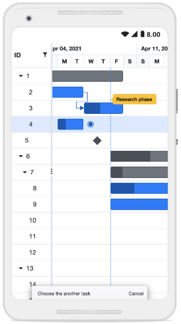

# Managing Tasks in Blazor Gantt Chart Component

The [Blazor Gantt Chart](https://www.syncfusion.com/blazor-components/blazor-gantt-chart) component has options to dynamically insert, delete, and update tasks in a project. The primary key column is necessary to manage the tasks and perform CRUD operations in Gantt Chart. To define the primary key, set the `GanttColumn.IsPrimaryKey` property to `true` in the column.

## Cell edit type and its params

The `GanttColumn.EditType` is used to customize the edit type of the particular column. You can set the `GanttColumn.EditType` based on data type of the column.

* [NumericTextBox](https://blazor.syncfusion.com/documentation/numeric-textbox/getting-started) component for integers, double, and decimal data types.

* [TextBox](https://blazor.syncfusion.com/documentation/textbox/getting-started) component for string data type.

* [DropDownList](https://blazor.syncfusion.com/documentation/dropdown-list/getting-started) component for list data type.

* [DatePicker](https://blazor.syncfusion.com/documentation/datepicker/getting-started) component for date values.

* [DateTimePicker](https://blazor.syncfusion.com/documentation/datetime-picker/getting-started) component for datetime type.

* [Checkbox](https://blazor.syncfusion.com/documentation/check-box/getting-started) component for boolean type.

Also, you can customize model of the `GanttColumn.EditType` component through the `GanttColumn.EditorSettings`.

The following table describes cell edit type component and their corresponding edit params of the column.

Component |Example
-----|-----
[NumericTextBox](https://blazor.syncfusion.com/documentation/numeric-textbox/getting-started) | @(new { @params = new { format = "n"} })
[TextBox](https://blazor.syncfusion.com/documentation/textbox/getting-started) | -
[DropDownList](https://blazor.syncfusion.com/documentation/dropdown-list/getting-started) | @(new { @params = new { value = "Germany"} })
[DatePicker](https://blazor.syncfusion.com/documentation/datepicker/getting-started) | @(new { @params = new { format = "yyyy-MM-dd"} })
[DateTimePicker](https://blazor.syncfusion.com/documentation/datetime-picker/getting-started) | @(new { @params = new { strictMode = true} })
[Checkbox](https://blazor.syncfusion.com/documentation/check-box/getting-started) | @(new { @params = new { checked = true} })




@using Syncfusion.Blazor.Gantt
<SfGantt @ref="Gantt" DataSource="@TaskCollection" Height="450px" Width="900px" Toolbar="@(new List<string>() { "Add", "Edit", "Delete", "Update", "Cancel" })">
    <GanttTaskFields Id="TaskID" Name="TaskName" StartDate="StartDate" EndDate="EndDate" Duration="Duration" Progress="Progress" ParentID="ParentID">
    </GanttTaskFields>
    <GanttColumns>
        <GanttColumn Field="TaskID" Width="100"></GanttColumn>
        <GanttColumn Field="TaskName" Width="250"></GanttColumn>
        <GanttColumn Field="StartDate" EditorSettings="DateParams" Type="Syncfusion.Blazor.Grids.ColumnType.DateTime" EditType="Syncfusion.Blazor.Grids.EditType.DateTimePickerEdit"></GanttColumn>
        <GanttColumn Field="Duration"></GanttColumn>
        <GanttColumn Field="Progress" EditorSettings="NumericParams" EditType="Syncfusion.Blazor.Grids.EditType.NumericEdit"></GanttColumn>
    </GanttColumns>
    <GanttEditSettings AllowEditing="true" AllowAdding="true"></GanttEditSettings>
</SfGantt>

@code{
    public SfGantt<TaskData> Gantt;
    private List<TaskData> TaskCollection { get; set; }
    public Syncfusion.Blazor.Grids.NumericEditCellParams NumericParams = new Syncfusion.Blazor.Grids.NumericEditCellParams()
    {
        Params = new Syncfusion.Blazor.Inputs.NumericTextBoxModel<object>() { Format = "N2" }
    };

    public Syncfusion.Blazor.Grids.DateEditCellParams DateParams = new Syncfusion.Blazor.Grids.DateEditCellParams()
    {
        Params = new Syncfusion.Blazor.Calendars.DatePickerModel() { Format = "d" }
    };
    protected override void OnInitialized()
    {
        this.TaskCollection = GetTaskCollection();
    }
    public class TaskData
    {
        public int TaskID { get; set; }
        public string TaskName { get; set; }
        public DateTime StartDate { get; set; }
        public DateTime? EndDate { get; set; }
        public string Duration { get; set; }
        public int Progress { get; set; }
        public int? ParentID { get; set; }
    }

    public static List<TaskData> GetTaskCollection()
    {
        List<TaskData> Tasks = new List<TaskData>()
        {
            new TaskData() { TaskID = 1, TaskName = "Project initiation", StartDate = new DateTime(2022, 04, 05), EndDate = new DateTime(2022, 04, 08) },
            new TaskData() { TaskID = 2, TaskName = "Identify Site location", StartDate = new DateTime(2022, 04, 05), Duration = "0", Progress = 30, ParentID = 1 },
            new TaskData() { TaskID = 3, TaskName = "Perform soil test", StartDate = new DateTime(2022, 04, 05), Duration = "4", Progress = 40, ParentID = 1 },
            new TaskData() { TaskID = 4, TaskName = "Soil test approval", StartDate = new DateTime(2022, 04, 05), Duration = "0", Progress = 30, ParentID = 1 },
            new TaskData() { TaskID = 5, TaskName = "Project estimation", StartDate = new DateTime(2022, 04, 06), EndDate = new DateTime(2022, 04, 08), },
            new TaskData() { TaskID = 6, TaskName = "Develop floor plan for estimation", StartDate = new DateTime(2022, 04, 06), Duration = "3", Progress = 30, ParentID = 5 },
            new TaskData() { TaskID = 7, TaskName = "List materials", StartDate = new DateTime(2022, 04, 06), Duration = "3", Progress = 40, ParentID = 5 },
            new TaskData() { TaskID = 8, TaskName = "Estimation approval", StartDate = new DateTime(2022, 04, 06), Duration = "0", Progress = 30, ParentID = 5 },
        };
        return Tasks;
    }
}






N> If edit type is not defined in the column, then it will be considered as the **StringEdit** type (Textbox component).

## Cell edit template

The cell edit template is used to add a custom component for a particular column when the column is edited.

The following code example describes, how to define the Edit template for a particular column.




@using Syncfusion.Blazor.Gantt
@using Syncfusion.Blazor.DropDowns;
<SfGantt DataSource="@TaskCollection" Height="450px" Width="700px" Toolbar="@(new List<string>() { "Add", "Cancel", "Edit", "Update", })">
    <GanttTaskFields Id="TaskID" Name="TaskName" StartDate="StartDate" EndDate="EndDate" Duration="Duration" Progress="Progress" ParentID="ParentID">
    </GanttTaskFields>
    <GanttColumns>
        <GanttColumn Field="TaskID" IsPrimaryKey=true></GanttColumn>
        <GanttColumn Field="TaskName">
            <EditTemplate>
                @{
                    var task = (context as TaskData);
                }
                <SfDropDownList @ref="dropdown" Placeholder="Name" FloatLabelType="Syncfusion.Blazor.Inputs.FloatLabelType.Always" ID="TaskName" @bind-Value="task.TaskName" TItem="string" TValue="string" DataSource="@DropDownData">
                </SfDropDownList>
            </EditTemplate>
        </GanttColumn>
        <GanttColumn Field="Duration"></GanttColumn>
        <GanttColumn Field="StartDate"></GanttColumn>
        <GanttColumn Field="Progress"></GanttColumn>
    </GanttColumns>
    <GanttEditSettings AllowAdding="true" AllowEditing=true AllowTaskbarEditing=true></GanttEditSettings>
    <GanttEvents OnCellSave="CellSaveHandler" TValue="TaskData"></GanttEvents>
</SfGantt>

@code{
    SfDropDownList<string, string> dropdown;

    private void CellSaveHandler(CellSaveArgs<TaskData> args)
    {
        if (args.ColumnName == "TaskName")
        {
            args.Value = dropdown.Value;
        }
    }
    private List<TaskData> TaskCollection { get; set; }
    private List<string> DropDownData { get; set; }
    protected override void OnInitialized()
    {
        this.TaskCollection = GetTaskCollection();
        this.DropDownData = TaskCollection.Select(s => s.TaskName).Distinct().ToList();
    }

    public class TaskData
    {
        public int TaskID { get; set; }
        public string TaskName { get; set; }
        public DateTime StartDate { get; set; }
        public DateTime? EndDate { get; set; }
        public string Duration { get; set; }
        public int Progress { get; set; }
        public int? ParentID { get; set; }
    }

    public static List<TaskData> GetTaskCollection()
    {
        List<TaskData> Tasks = new List<TaskData>() 
        {
            new TaskData() { TaskID = 1, TaskName = "Project initiation", StartDate = new DateTime(2022, 04, 05), EndDate = new DateTime(2022, 04, 08) },
            new TaskData() { TaskID = 2, TaskName = "Identify Site location", StartDate = new DateTime(2022, 04, 05), Duration = "4", Progress = 30, ParentID = 1 },
            new TaskData() { TaskID = 3, TaskName = "Perform soil test", StartDate = new DateTime(2022, 04, 05), Duration = "4", Progress = 40, ParentID = 1 },
            new TaskData() { TaskID = 4, TaskName = "Soil test approval", StartDate = new DateTime(2022, 04, 05), Duration = "4", Progress = 30, ParentID = 1 },
            new TaskData() { TaskID = 5, TaskName = "Project estimation", StartDate = new DateTime(2022, 04, 06), EndDate = new DateTime(2022, 04, 08) },
            new TaskData() { TaskID = 6, TaskName = "Develop floor plan for estimation", StartDate = new DateTime(2022, 04, 06), Duration = "3", Progress = 30, ParentID = 5 },
            new TaskData() { TaskID = 7, TaskName = "List materials", StartDate = new DateTime(2022, 04, 06), Duration = "3", Progress = 40, ParentID = 5 },
            new TaskData() { TaskID = 8, TaskName = "Estimation approval", StartDate = new DateTime(2022, 04, 06), Duration = "3", Progress = 30, ParentID = 5 }
        };
        return Tasks;
    }
}






## Disable editing for particular column

You can disable editing for particular columns by using the [GanttColumn.AllowEditing](https://help.syncfusion.com/cr/blazor/Syncfusion.Blazor.Gantt.GanttColumn.html#Syncfusion_Blazor_Gantt_GanttColumn_AllowEditing) property.

In the following demo, editing is disabled for the `TaskName` column.




@using Syncfusion.Blazor.Gantt
<SfGantt @ref="Gantt" DataSource="@TaskCollection" Height="450px" Width="900px" Toolbar="@(new List<string>() { "Edit" })">
    <GanttTaskFields Id="TaskID" Name="TaskName" StartDate="StartDate" EndDate="EndDate" Duration="Duration" Progress="Progress" ParentID="ParentID">
    </GanttTaskFields>
    <GanttColumns>
        <GanttColumn Field="TaskID" Width="100"></GanttColumn>
        <GanttColumn Field="TaskName" Width="250" AllowEditing="false"></GanttColumn>
        <GanttColumn Field="StartDate"></GanttColumn>
        <GanttColumn Field="Duration"></GanttColumn>
        <GanttColumn Field="Progress"></GanttColumn>
    </GanttColumns>
    <GanttEditSettings AllowEditing="true"></GanttEditSettings>
</SfGantt>

@code{
    public SfGantt<TaskData> Gantt;
    private List<TaskData> TaskCollection { get; set; }
    protected override void OnInitialized()
    {
        this.TaskCollection = GetTaskCollection();
    }
    public class TaskData
    {
        public int TaskID { get; set; }
        public string TaskName { get; set; }
        public DateTime StartDate { get; set; }
        public DateTime? EndDate { get; set; }
        public string Duration { get; set; }
        public int Progress { get; set; }
        public int? ParentID { get; set; }
    }

    public static List<TaskData> GetTaskCollection()
        {
            List<TaskData> Tasks = new List<TaskData>()
            {
                new TaskData() { TaskID = 1, TaskName = "Project initiation", StartDate = new DateTime(2022, 04, 05), EndDate = new DateTime(2022, 04, 08), },
                new TaskData() { TaskID = 2, TaskName = "Identify Site location", StartDate = new DateTime(2022, 04, 05), Duration = "0", Progress = 30, ParentID = 1 },
                new TaskData() { TaskID = 3, TaskName = "Perform soil test", StartDate = new DateTime(2022, 04, 05), Duration = "4", Progress = 40, ParentID = 1 },
                new TaskData() { TaskID = 4, TaskName = "Soil test approval", StartDate = new DateTime(2022, 04, 05), Duration = "0", Progress = 30, ParentID = 1 },
                new TaskData() { TaskID = 5, TaskName = "Project estimation", StartDate = new DateTime(2022, 04, 06), EndDate = new DateTime(2022, 04, 08), },
                new TaskData() { TaskID = 6, TaskName = "Develop floor plan for estimation", StartDate = new DateTime(2022, 04, 06), Duration = "3", Progress = 30, ParentID = 5 },
                new TaskData() { TaskID = 7, TaskName = "List materials", StartDate = new DateTime(2022, 04, 06), Duration = "3", Progress = 40, ParentID = 5 },
                new TaskData() { TaskID = 8, TaskName = "Estimation approval", StartDate = new DateTime(2022, 04, 06), Duration = "0", Progress = 30, ParentID = 5 },
            };
            return Tasks;
        }
}






## Troubleshoot: Editing works only when primary key column is defined

Editing feature requires a primary key column for CRUD operations. While defining columns in Gantt using the `GanttColumns` property, any one of the columns must be a primary column. By default, the `Id` column will be the primary key column. If `Id` column is not defined, you need to enable `IsPrimaryKey` for any one of the columns defined in the `GanttColumns` property.

## Touch interaction

The Gantt Chart component editing actions can be achieved using the double tap and tap and drag actions on an element.

The following table describes different types of editing modes available in Gantt.

Action |Description
-----|-----
[Cell editing](https://blazor.syncfusion.com/documentation/gantt-chart/editing-tasks#cell-editing) | To perform `double tap` on a specific cell, initiate the cell to be in edit state.
[Dialog editing](https://blazor.syncfusion.com/documentation/gantt-chart/editing-tasks#dialog-editing) | To perform `double tap` on a specific row, initiate the edit dialog to be opened.
[Taskbar editing](https://blazor.syncfusion.com/documentation/gantt-chart/taskbar-editing) | Taskbar editing action is initiated using the `tap` action on the taskbar.   **Parent taskbar** : Once you tap on the parent taskbar, it will be changed to editing state. Perform only dragging action on parent taskbar editing.     **Child taskbar** : Once you tap the child taskbar, it will be changed to editing state.      **Dragging taskbar** : To drag a taskbar to the left or right in editing state.     **Resizing taskbar** : To resize a taskbar, drag the left/right resize icon.     **Progress resizing** : To change the progress, drag the progress resize icon to the left or right direction.

### Task dependency editing

Tap the taskbar to initiate the taskbar editing for predecessors. Once it enters the edited state, `tap` the left or right connector point to initiate the task [dependencies](https://blazor.syncfusion.com/documentation/gantt-chart/managing-tasks#task-dependency-editing) editing. The dialog will be rendered with the message `Choose another task` and `Cancel` button.

Click the `Cancel` button to cancel the edit action and to continue editing, tap another taskbar to establish the dependency line between the two taskbars.

Once the second taskbar is tapped, the dialog will display a message `Select the connector position` and `Cancel` button. A tooltip is also displayed near the second taskbar with the `Left` and `Right` buttons. Click any button to establish a dependency relationship between the two tasks.

## Editing tooltip

It is possible to enable or disable the tooltip while performing editing actions on the taskbar like left resizing, right resizing, dragging, and progress resizing by using the [GanttTooltipSettings.ShowTooltipOnEditing](https://help.syncfusion.com/cr/blazor/Syncfusion.Blazor.Gantt.GanttTooltipSettings-1.html#Syncfusion_Blazor_Gantt_GanttTooltipSettings_1_ShowTooltipOnEditing) property. By default, this property is set to 'true.'




@using Syncfusion.Blazor.Gantt
<SfGantt DataSource="@TaskCollection" Height="450px" Width="900px" TreeColumnIndex="1"
    Toolbar="@(new List<string>() { "Add", "Cancel", "CollapseAll", "Delete", "Edit", "ExpandAll", "Search", "Update" , "Indent" , "Outdent"})">
    <GanttTaskFields Id="TaskID" Name="TaskName" StartDate="StartDate" EndDate="EndDate"
        Duration="Duration" Progress="Progress" Dependency="Predecessor" ParentID="ParentID" Notes="Notes">
    </GanttTaskFields>
    <GanttEditSettings AllowTaskbarEditing="true" AllowEditing="true" AllowAdding="true" AllowDeleting="true">
    </GanttEditSettings>
    <GanttTooltipSettings ShowTooltipOnEditing="true" TValue="TaskData"></GanttTooltipSettings>
</SfGantt>
@code {
    private List<TaskData> TaskCollection { get; set; }
    protected override void OnInitialized()
    {
        this.TaskCollection = this.TaskCollection = GetTaskCollection();
    }
    public class TaskData
    {
        public int TaskID { get; set; }
        public string TaskName { get; set; }
        public DateTime StartDate { get; set; }
        public DateTime EndDate { get; set; }
        public string Duration { get; set; }
        public int Progress { get; set; }
        public string Predecessor { get; set; }
        public string Notes { get; set; }
        public int? ParentID { get; set; }
    }

    public static List<TaskData> GetTaskCollection()
    {
        List<TaskData> Tasks = new List<TaskData>() {
            new TaskData() {TaskID = 1, TaskName = "Project initiation", StartDate = new DateTime(2019, 04, 02), EndDate = new DateTime(2019, 04, 10)},
            new TaskData() { TaskID = 2, TaskName = "Identify Site location", StartDate = new DateTime(2019, 04, 02), Duration = "3", Progress = 30, ParentID = 1 },
            new TaskData() { TaskID = 3, TaskName = "Perform soil test", StartDate = new DateTime(2019, 04, 02), Duration = "4", Progress = 40, Predecessor = "2FS", ParentID = 1 },
            new TaskData() { TaskID = 4, TaskName = "Soil test approval", StartDate = new DateTime(2019, 04, 02), Duration = "0", Progress = 30, Predecessor = "3FF", ParentID = 1 },
            new TaskData() { TaskID = 5, TaskName = "Project estimation", StartDate = new DateTime(2019, 04, 04), EndDate = new DateTime(2019, 04, 08)},
            new TaskData() { TaskID = 6, TaskName = "Develop floor plan for estimation", StartDate = new DateTime(2019, 04, 04), Duration = "3", Progress = 30, ParentID = 5 },
            new TaskData() { TaskID = 7, TaskName = "List materials", StartDate = new DateTime(2019, 04, 04), Duration = "3", Progress = 40, Predecessor = "6SS", ParentID = 5 }
        };
        return Tasks;
    }
}






### Template

The taskbar editing tooltip can be customized using the [GanttTooltipSettings.EditingTemplate](https://help.syncfusion.com/cr/blazor/Syncfusion.Blazor.Gantt.GanttTooltipSettings-1.html#Syncfusion_Blazor_Gantt_GanttTooltipSettings_1_EditingTemplate) property. The following code example shows how to customize the taskbar editing tooltip in a Gantt Chart:




@using Syncfusion.Blazor.Gantt
<SfGantt DataSource="@TaskCollection" Height="450px" Width="700px">
    <GanttTaskFields Id="TaskID" Name="TaskName" StartDate="StartDate" EndDate="EndDate" Duration="Duration"    Progress="Progress" ParentID="ParentID"></GanttTaskFields>
    <GanttEditSettings AllowTaskbarEditing="true" AllowEditing="true" AllowAdding="true"
        AllowDeleting="true"  ShowDeleteConfirmDialog="true">
    </GanttEditSettings>
    <GanttTooltipSettings ShowTooltip="true" TValue="TaskData">
        <EditingTemplate>
            <table>
                @{
                    var template = (context as TaskData);
                    if (TaskbarEditAction == "LeftResizing")
                    {
                        <tr> <td style="padding:3px">@(template.StartDate.ToString("MMM dd, yyyy"))</td> </tr>
                        <tr> <td style="padding:6px">@(template.Duration) days</td> </tr>
                    } 
                    else if (TaskbarEditAction == "RightResizing")
                    {
                        <tr> <td style="padding:3px">@(template.EndDate.ToString("MMM dd, yyyy"))</td> </tr>
                        <tr> <td style="padding:6px">@(template.Duration) days</td> </tr>
                    }
                    else if (TaskbarEditAction == "ChildDrag" || TaskbarEditAction == "ParentDrag" || TaskbarEditAction == "MilestoneDrag")
                    {
                        <tr> <td style="padding:3px">@(template.StartDate.ToString("MMM dd, yyyy"))</td> </tr>
                        <tr> <td style="padding:3px">@(template.EndDate.ToString("MMM dd, yyyy"))</td> </tr>
                    }
                    else if (TaskbarEditAction == "ProgressResizing")
                    {
                        <tr> <td style="padding:3px">@(template.Progress) %</td> </tr>
                    }
                }
            </table>
            </EditingTemplate>
        </GanttTooltipSettings>
        <GanttEvents TaskbarEditing="TaskbarEditingHandler" TValue="TaskData"></GanttEvents>
</SfGantt>
@code {
    private List<TaskData> TaskCollection { get; set; }
    private string TaskbarEditAction { get; set; }
    private void TaskbarEditingHandler(TaskbarEditingEventArgs<TaskData> args)
    {
        TaskbarEditAction = args.Action;
    }
    protected override void OnInitialized()
    {
        this.TaskCollection = GetTaskCollection();
    }
    public class TaskData
    {
        public int TaskID { get; set; }
        public string TaskName { get; set; }
        public DateTime StartDate { get; set; }
        public DateTime EndDate { get; set; }
        public string Duration { get; set; }
        public int Progress { get; set; }
        public int? ParentID { get; set; }
    }

    public static List<TaskData> GetTaskCollection()
    {
        List<TaskData> Tasks = new List<TaskData>() {
            new TaskData() {TaskID = 1, TaskName = "Project initiation", StartDate = new DateTime(2019, 04, 02), EndDate = new DateTime(2019, 04, 05)},
            new TaskData() { TaskID = 2, TaskName = "Identify Site location", StartDate = new DateTime(2019, 04, 02), Duration = "3", Progress = 30, ParentID = 1 },
            new TaskData() { TaskID = 3, TaskName = "Perform soil test", StartDate = new DateTime(2019, 04, 02), Duration = "4", Progress = 40, ParentID = 1 },
            new TaskData() { TaskID = 4, TaskName = "Soil test approval", StartDate = new DateTime(2019, 04, 02), Duration = "0", Progress = 30, ParentID = 1 },
            new TaskData() { TaskID = 5, TaskName = "Project estimation", StartDate = new DateTime(2019, 04, 04), EndDate = new DateTime(2019, 04, 08)},
            new TaskData() { TaskID = 6, TaskName = "Develop floor plan for estimation", StartDate = new DateTime(2019, 04, 04), Duration = "3", Progress = 30, ParentID = 5 },
            new TaskData() { TaskID = 7, TaskName = "List materials", StartDate = new DateTime(2019, 04, 04), Duration = "3", Progress = 40, ParentID = 5 }
        };
        return Tasks;
    }
}




