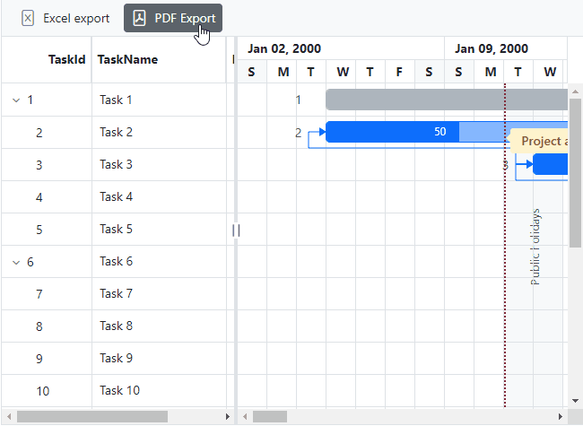

# PDF Export in Blazor Gantt Chart Component

PDF export allows exporting Gantt data to PDF document. You need to use the [ExportToPdfAsync](https://help.syncfusion.com/cr/blazor/Syncfusion.Blazor.Gantt.SfGantt-1.html#Syncfusion_Blazor_Gantt_SfGantt_1_ExportToPdfAsync) method for exporting. To enable PDF export in the Gantt, set the [AllowPdfExport](https://help.syncfusion.com/cr/blazor/Syncfusion.Blazor.Gantt.SfGantt-1.html#Syncfusion_Blazor_Gantt_SfGantt_1_AllowPdfExport) to true.

```cshtml
@using Syncfusion.Blazor.Gantt
@using Syncfusion.Blazor.Navigations

<SfGantt @ref="Gantt" ID="GanttExport" DataSource="@TaskCollection" Height="450px" Width="900px" AllowPdfExport="true" Toolbar="toolbarItem">
    <GanttTaskFields Id="TaskId" Name="TaskName" StartDate="StartDate" EndDate="EndDate" Dependency="Predecessor"
                     Duration="Duration" Progress="Progress" ParentID="ParentId">
    </GanttTaskFields>
    <GanttEvents OnToolbarClick="ToolbarClickHandler" TValue="TaskData"></GanttEvents>
</SfGantt>

@code {
    private List<TaskData> TaskCollection { get; set; }
    private SfGantt<TaskData> Gantt;
    private List<object> toolbarItem = new List<Object>() { new ToolbarItem() { Text = "PDF Export", TooltipText = "PDF Export", Id = "PdfExport", PrefixIcon = "e-pdfexport" } };
    protected override void OnInitialized()
    {
        this.TaskCollection = GetTaskCollection();
    }
    public async void ToolbarClickHandler(Syncfusion.Blazor.Navigations.ClickEventArgs args)
    {
        if (args.Item.Id == "PdfExport")
        {
            await Gantt.ExportToPdfAsync();
        }
    }
   
    public class TaskData
    {
        public int TaskId { get; set; }
        public string TaskName { get; set; }
        public DateTime StartDate { get; set; }
        public DateTime? EndDate { get; set; }
        public string Duration { get; set; }
        public int Progress { get; set; }
        public int? ParentId { get; set; }
        public string Predecessor { get; set; }
    }

    public static List<TaskData> GetTaskCollection()
    {
        List<TaskData> Tasks = new List<TaskData>()
        {
            new TaskData() { TaskId = 1, TaskName = "Project initiation", StartDate = new DateTime(2022, 04, 05), EndDate = new DateTime(2022, 04, 21), },
            new TaskData() { TaskId = 2, TaskName = "Identify Site location", StartDate = new DateTime(2022, 04, 05), Duration = "0", Progress = 30, ParentId = 1 },
            new TaskData() { TaskId = 3, TaskName = "Perform soil test", StartDate = new DateTime(2022, 04, 05), Duration = "4", Progress = 40, ParentId = 1, Predecessor = "2" },
            new TaskData() { TaskId = 4, TaskName = "Soil test approval", StartDate = new DateTime(2022, 04, 05), Duration = "0", Progress = 30, ParentId = 1 , Predecessor = "3" },
            new TaskData() { TaskId = 5, TaskName = "Project estimation", StartDate = new DateTime(2022, 04, 06), EndDate = new DateTime(2022, 04, 21), },
            new TaskData() { TaskId = 6, TaskName = "Develop floor plan for estimation", StartDate = new DateTime(2022, 04, 06), Duration = "3", Progress = 30, ParentId = 5 },
            new TaskData() { TaskId = 7, TaskName = "List materials", StartDate = new DateTime(2022, 04, 06), Duration = "3", Progress = 40, ParentId = 5 },
            new TaskData() { TaskId = 8, TaskName = "Estimation approval", StartDate = new DateTime(2022, 04, 06), Duration = "0", Progress = 30, ParentId = 5 }
        };
        return Tasks;
    }
}
```


## Customize the PDF export

The PDF export functionality in the Syncfusion Gantt Chart allows extensive customization through the `GanttPdfExportProperties` class. By configuring properties within this class, you can control the layout, format, and content that is included in the exported PDF. This ensures that the PDF accurately represents the Gantt chart's structure and provides flexibility for tailored exports.

### Customize file name for exported document
The PDF export functionality in the Syncfusion Gantt Chart allows you to customize the file name of the exported document. By configuring the `FileName` property within the `GanttPdfExportProperties` class, you can assign a specific name to the generated PDF. This is especially useful for keeping your exported documents organized and easily identifiable.

In this example, the exported PDF will be saved as `ProjectSchedule.pdf`.

```cshtml
@using Syncfusion.Blazor.Gantt
@using Syncfusion.Blazor.Navigations

<SfGantt @ref="Gantt" ID="GanttExport" DataSource="@TaskCollection" Height="450px" Width="900px" AllowPdfExport="true" Toolbar="toolbarItem">
    <GanttTaskFields Id="TaskId" Name="TaskName" StartDate="StartDate" EndDate="EndDate" Dependency="Predecessor"
                     Duration="Duration" Progress="Progress" ParentID="ParentId">
    </GanttTaskFields>
    <GanttEvents OnToolbarClick="ToolbarClickHandler" TValue="TaskData"></GanttEvents>
</SfGantt>

@code {
    private List<TaskData> TaskCollection { get; set; }
    private SfGantt<TaskData> Gantt;
    private List<object> toolbarItem = new List<Object>() { new ToolbarItem() { Text = "PDF Export", TooltipText = "PDF Export", Id = "PdfExport", PrefixIcon = "e-pdfexport" } };
    protected override void OnInitialized()
    {
        this.TaskCollection = GetTaskCollection();
    }
    public async void ToolbarClickHandler(Syncfusion.Blazor.Navigations.ClickEventArgs args)
    {
        if (args.Item.Id == "PdfExport")
        {
            GanttPdfExportProperties exportProperties = new GanttPdfExportProperties();
            exportProperties.FileName = "ProjectSchedule.pdf";
            await Gantt.ExportToPdfAsync(exportProperties);
        }
    }
   
    public class TaskData
    {
        public int TaskId { get; set; }
        public string TaskName { get; set; }
        public DateTime StartDate { get; set; }
        public DateTime? EndDate { get; set; }
        public string Duration { get; set; }
        public int Progress { get; set; }
        public int? ParentId { get; set; }
        public string Predecessor { get; set; }
    }

    public static List<TaskData> GetTaskCollection()
    {
        List<TaskData> Tasks = new List<TaskData>()
        {
            new TaskData() { TaskId = 1, TaskName = "Project initiation", StartDate = new DateTime(2022, 04, 05), EndDate = new DateTime(2022, 04, 21), },
            new TaskData() { TaskId = 2, TaskName = "Identify Site location", StartDate = new DateTime(2022, 04, 05), Duration = "0", Progress = 30, ParentId = 1 },
            new TaskData() { TaskId = 3, TaskName = "Perform soil test", StartDate = new DateTime(2022, 04, 05), Duration = "4", Progress = 40, ParentId = 1, Predecessor = "2" },
            new TaskData() { TaskId = 4, TaskName = "Soil test approval", StartDate = new DateTime(2022, 04, 05), Duration = "0", Progress = 30, ParentId = 1 , Predecessor = "3" },
            new TaskData() { TaskId = 5, TaskName = "Project estimation", StartDate = new DateTime(2022, 04, 06), EndDate = new DateTime(2022, 04, 21), },
            new TaskData() { TaskId = 6, TaskName = "Develop floor plan for estimation", StartDate = new DateTime(2022, 04, 06), Duration = "3", Progress = 30, ParentId = 5 },
            new TaskData() { TaskId = 7, TaskName = "List materials", StartDate = new DateTime(2022, 04, 06), Duration = "3", Progress = 40, ParentId = 5 },
            new TaskData() { TaskId = 8, TaskName = "Estimation approval", StartDate = new DateTime(2022, 04, 06), Duration = "0", Progress = 30, ParentId = 5 }
        };
        return Tasks;
    }
}
```
### How to add a text in header/footer

The PDF export functionality of the Gantt Chart allows you to add and style custom text in the Header or Footer of the exported PDF document. This customization can be achieved using the `Header` and `Footer` properties of the `GanttPdfExportProperties` class. By configuring these properties, you can include important information, such as titles, project names, or other relevant details, to enhance the exported document.

The following sample code demonstrates how to add custom text and customize its styles in the Header section of the exported PDF document:

``` cshtml
@using Syncfusion.Blazor.Gantt
@using Syncfusion.Blazor.Grids
@using Syncfusion.Blazor.Navigations

<SfGantt @ref="Gantt" ID="GanttExport" DataSource="@TaskCollection" Height="450px" Width="900px" AllowPdfExport="true" Toolbar="toolbarItem">
    <GanttTaskFields Id="TaskId" Name="TaskName" StartDate="StartDate" EndDate="EndDate" Dependency="Predecessor"
                     Duration="Duration" Progress="Progress" ParentID="ParentId">
    </GanttTaskFields>
    <GanttEvents OnToolbarClick="ToolbarClickHandler" TValue="TaskData"></GanttEvents>
</SfGantt>

@code {
    private List<TaskData> TaskCollection { get; set; }
    private SfGantt<TaskData> Gantt;
    private List<object> toolbarItem = new List<Object>() { new ToolbarItem() { Text = "PDF Export", TooltipText = "PDF Export", Id = "PdfExport", PrefixIcon = "e-pdfexport" } };
    public List<PdfHeaderFooterContent> HeaderContent = new List<PdfHeaderFooterContent>
    {
        new PdfHeaderFooterContent() { Type = ContentType.Text, Value = "Gantt Chart PDF Export", Position = new PdfPosition() { X = 0, Y = 50 }, Style = new PdfContentStyle() { TextBrushColor = "#000000", FontSize = 13 } }
    };
    protected override void OnInitialized()
    {
        this.TaskCollection = GetTaskCollection();
    }
    public async void ToolbarClickHandler(Syncfusion.Blazor.Navigations.ClickEventArgs args)
    {
        if (args.Item.Id == "PdfExport")
        {
            GanttPdfExportProperties exportProperties = new GanttPdfExportProperties();
            PdfHeader Header = new PdfHeader()
                {
                    FromTop = 0,
                    Height = 100,
                    Contents = HeaderContent
                };
            exportProperties.Header = Header;
            await Gantt.ExportToPdfAsync(exportProperties);
        }
    }
   
    public class TaskData
    {
        public int TaskId { get; set; }
        public string TaskName { get; set; }
        public DateTime StartDate { get; set; }
        public DateTime? EndDate { get; set; }
        public string Duration { get; set; }
        public int Progress { get; set; }
        public int? ParentId { get; set; }
        public string Predecessor { get; set; }
    }

    public static List<TaskData> GetTaskCollection()
    {
        List<TaskData> Tasks = new List<TaskData>()
        {
            new TaskData() { TaskId = 1, TaskName = "Project initiation", StartDate = new DateTime(2022, 04, 05), EndDate = new DateTime(2022, 04, 21), },
            new TaskData() { TaskId = 2, TaskName = "Identify Site location", StartDate = new DateTime(2022, 04, 05), Duration = "0", Progress = 30, ParentId = 1 },
            new TaskData() { TaskId = 3, TaskName = "Perform soil test", StartDate = new DateTime(2022, 04, 05), Duration = "4", Progress = 40, ParentId = 1, Predecessor = "2" },
            new TaskData() { TaskId = 4, TaskName = "Soil test approval", StartDate = new DateTime(2022, 04, 05), Duration = "0", Progress = 30, ParentId = 1 , Predecessor = "3" },
            new TaskData() { TaskId = 5, TaskName = "Project estimation", StartDate = new DateTime(2022, 04, 06), EndDate = new DateTime(2022, 04, 21), },
            new TaskData() { TaskId = 6, TaskName = "Develop floor plan for estimation", StartDate = new DateTime(2022, 04, 06), Duration = "3", Progress = 30, ParentId = 5 },
            new TaskData() { TaskId = 7, TaskName = "List materials", StartDate = new DateTime(2022, 04, 06), Duration = "3", Progress = 40, ParentId = 5 },
            new TaskData() { TaskId = 8, TaskName = "Estimation approval", StartDate = new DateTime(2022, 04, 06), Duration = "0", Progress = 30, ParentId = 5 }
        };
        return Tasks;
    }
}
```

### How to draw a line in header/footer
You can add lines to the Header or Footer area of the exported PDF document using the `Header` and `Footer` properties in the `GanttPdfExportProperties` class.

Supported line styles are,

* Dash
* Dot
* DashDot
* DashDotDot
* Solid

The following sample code demonstrates adding line in the Header section of the exported document,

``` cshtml
@using Syncfusion.Blazor.Gantt
@using Syncfusion.Blazor.Grids
@using Syncfusion.Blazor.Navigations

<SfGantt @ref="Gantt" ID="GanttExport" DataSource="@TaskCollection" Height="450px" Width="900px" AllowPdfExport="true" Toolbar="toolbarItem">
    <GanttTaskFields Id="TaskId" Name="TaskName" StartDate="StartDate" EndDate="EndDate" Dependency="Predecessor"
                     Duration="Duration" Progress="Progress" ParentID="ParentId">
    </GanttTaskFields>
    <GanttEvents OnToolbarClick="ToolbarClickHandler" TValue="TaskData"></GanttEvents>
</SfGantt>

@code {
    private List<TaskData> TaskCollection { get; set; }
    private SfGantt<TaskData> Gantt;
    private List<object> toolbarItem = new List<Object>() { new ToolbarItem() { Text = "PDF Export", TooltipText = "PDF Export", Id = "PdfExport", PrefixIcon = "e-pdfexport" } };
    public List<PdfHeaderFooterContent> HeaderContent = new List<PdfHeaderFooterContent>
    {
        new PdfHeaderFooterContent() { Type = ContentType.Line, Points = new PdfPoints() { X1 = 0, Y1 = 4, X2 = 685, Y2 = 4 }, Style = new PdfContentStyle() { PenColor = "#000080", DashStyle = PdfDashStyle.Solid } }
    };
    protected override void OnInitialized()
    {
        this.TaskCollection = GetTaskCollection();
    }
    public async void ToolbarClickHandler(Syncfusion.Blazor.Navigations.ClickEventArgs args)
    {
        if (args.Item.Id == "PdfExport")
        {
            GanttPdfExportProperties exportProperties = new GanttPdfExportProperties();
            PdfHeader Header = new PdfHeader()
                {
                    FromTop = 0,
                    Height = 100,
                    Contents = HeaderContent
                };
            exportProperties.Header = Header;
            await Gantt.ExportToPdfAsync(exportProperties);
        }
    }
   
    public class TaskData
    {
        public int TaskId { get; set; }
        public string TaskName { get; set; }
        public DateTime StartDate { get; set; }
        public DateTime? EndDate { get; set; }
        public string Duration { get; set; }
        public int Progress { get; set; }
        public int? ParentId { get; set; }
        public string Predecessor { get; set; }
    }

    public static List<TaskData> GetTaskCollection()
    {
        List<TaskData> Tasks = new List<TaskData>()
        {
            new TaskData() { TaskId = 1, TaskName = "Project initiation", StartDate = new DateTime(2022, 04, 05), EndDate = new DateTime(2022, 04, 21), },
            new TaskData() { TaskId = 2, TaskName = "Identify Site location", StartDate = new DateTime(2022, 04, 05), Duration = "0", Progress = 30, ParentId = 1 },
            new TaskData() { TaskId = 3, TaskName = "Perform soil test", StartDate = new DateTime(2022, 04, 05), Duration = "4", Progress = 40, ParentId = 1, Predecessor = "2" },
            new TaskData() { TaskId = 4, TaskName = "Soil test approval", StartDate = new DateTime(2022, 04, 05), Duration = "0", Progress = 30, ParentId = 1 , Predecessor = "3" },
            new TaskData() { TaskId = 5, TaskName = "Project estimation", StartDate = new DateTime(2022, 04, 06), EndDate = new DateTime(2022, 04, 21), },
            new TaskData() { TaskId = 6, TaskName = "Develop floor plan for estimation", StartDate = new DateTime(2022, 04, 06), Duration = "3", Progress = 30, ParentId = 5 },
            new TaskData() { TaskId = 7, TaskName = "List materials", StartDate = new DateTime(2022, 04, 06), Duration = "3", Progress = 40, ParentId = 5 },
            new TaskData() { TaskId = 8, TaskName = "Estimation approval", StartDate = new DateTime(2022, 04, 06), Duration = "0", Progress = 30, ParentId = 5 }
        };
        return Tasks;
    }
}
```

### How to change the change page orientation

The PDF export functionality allows you to customize the page orientation of the exported document. By setting the `PageOrientation` property in the `GanttPdfExportProperties` class, you can switch between Portrait (default) and Landscape orientations based on your requirements.

The following code snippet demonstrates how to set the page orientation to Landscape in the exported PDF document,

```cshtml
@using Syncfusion.Blazor.Gantt
@using Syncfusion.Blazor.Navigations

<SfGantt @ref="Gantt" ID="GanttExport" DataSource="@TaskCollection" Height="450px" Width="900px" AllowPdfExport="true" Toolbar="toolbarItem">
    <GanttTaskFields Id="TaskId" Name="TaskName" StartDate="StartDate" EndDate="EndDate" Dependency="Predecessor"
                     Duration="Duration" Progress="Progress" ParentID="ParentId">
    </GanttTaskFields>
    <GanttEvents OnToolbarClick="ToolbarClickHandler" TValue="TaskData"></GanttEvents>
</SfGantt>

@code {
    private List<TaskData> TaskCollection { get; set; }
    private SfGantt<TaskData> Gantt;
    private List<object> toolbarItem = new List<Object>() { new ToolbarItem() { Text = "PDF Export", TooltipText = "PDF Export", Id = "PdfExport", PrefixIcon = "e-pdfexport" } };
    protected override void OnInitialized()
    {
        this.TaskCollection = GetTaskCollection();
    }
    public async void ToolbarClickHandler(Syncfusion.Blazor.Navigations.ClickEventArgs args)
    {
        if (args.Item.Id == "PdfExport")
        {
            GanttPdfExportProperties exportProperties = new GanttPdfExportProperties();
            exportProperties.PageOrientation = Syncfusion.Blazor.Grids.PageOrientation.Landscape;
            await Gantt.ExportToPdfAsync(exportProperties);
        }
    }
   
    public class TaskData
    {
        public int TaskId { get; set; }
        public string TaskName { get; set; }
        public DateTime StartDate { get; set; }
        public DateTime? EndDate { get; set; }
        public string Duration { get; set; }
        public int Progress { get; set; }
        public int? ParentId { get; set; }
        public string Predecessor { get; set; }
    }

    public static List<TaskData> GetTaskCollection()
    {
        List<TaskData> Tasks = new List<TaskData>()
        {
            new TaskData() { TaskId = 1, TaskName = "Project initiation", StartDate = new DateTime(2022, 04, 05), EndDate = new DateTime(2022, 04, 21), },
            new TaskData() { TaskId = 2, TaskName = "Identify Site location", StartDate = new DateTime(2022, 04, 05), Duration = "0", Progress = 30, ParentId = 1 },
            new TaskData() { TaskId = 3, TaskName = "Perform soil test", StartDate = new DateTime(2022, 04, 05), Duration = "4", Progress = 40, ParentId = 1, Predecessor = "2" },
            new TaskData() { TaskId = 4, TaskName = "Soil test approval", StartDate = new DateTime(2022, 04, 05), Duration = "0", Progress = 30, ParentId = 1 , Predecessor = "3" },
            new TaskData() { TaskId = 5, TaskName = "Project estimation", StartDate = new DateTime(2022, 04, 06), EndDate = new DateTime(2022, 04, 21), },
            new TaskData() { TaskId = 6, TaskName = "Develop floor plan for estimation", StartDate = new DateTime(2022, 04, 06), Duration = "3", Progress = 30, ParentId = 5 },
            new TaskData() { TaskId = 7, TaskName = "List materials", StartDate = new DateTime(2022, 04, 06), Duration = "3", Progress = 40, ParentId = 5 },
            new TaskData() { TaskId = 8, TaskName = "Estimation approval", StartDate = new DateTime(2022, 04, 06), Duration = "0", Progress = 30, ParentId = 5 }
        };
        return Tasks;
    }
}
```

### How to change the change page size

The PDF export functionality allows you to adjust the page size of the exported document to meet your specific needs. By setting the `PageSize` property in the `GanttPdfExportProperties` class, you can select from various standard page sizes. The default page size is Letter, but other options like A4, A3, and more are available.

Supported page sizes are:
* Letter
* Note
* Legal
* A0
* A1
* A2
* A3
* A5
* A6
* A7
* A8
* A9
* B0
* B1
* B2
* B3
* B4
* B5
* Archa
* Archb
* Archc
* Archd
* Arche
* Flsa
* HalfLetter
* Letter11x17
* Ledger

The following code demonstrates how to change the page size to A4 for the exported PDF document,

```cshtml
@using Syncfusion.Blazor.Gantt
@using Syncfusion.Blazor.Navigations

<SfGantt @ref="Gantt" ID="GanttExport" DataSource="@TaskCollection" Height="450px" Width="900px" AllowPdfExport="true" Toolbar="toolbarItem">
    <GanttTaskFields Id="TaskId" Name="TaskName" StartDate="StartDate" EndDate="EndDate" Dependency="Predecessor"
                     Duration="Duration" Progress="Progress" ParentID="ParentId">
    </GanttTaskFields>
    <GanttEvents OnToolbarClick="ToolbarClickHandler" TValue="TaskData"></GanttEvents>
</SfGantt>

@code {
    private List<TaskData> TaskCollection { get; set; }
    private SfGantt<TaskData> Gantt;
    private List<object> toolbarItem = new List<Object>() { new ToolbarItem() { Text = "PDF Export", TooltipText = "PDF Export", Id = "PdfExport", PrefixIcon = "e-pdfexport" } };
    protected override void OnInitialized()
    {
        this.TaskCollection = GetTaskCollection();
    }
    public async void ToolbarClickHandler(Syncfusion.Blazor.Navigations.ClickEventArgs args)
    {
        if (args.Item.Id == "PdfExport")
        {
            GanttPdfExportProperties exportProperties = new GanttPdfExportProperties();
            exportProperties.PageSize = Syncfusion.Blazor.Grids.PdfPageSize.A4;
            await Gantt.ExportToPdfAsync(exportProperties);
        }
    }
   
    public class TaskData
    {
        public int TaskId { get; set; }
        public string TaskName { get; set; }
        public DateTime StartDate { get; set; }
        public DateTime? EndDate { get; set; }
        public string Duration { get; set; }
        public int Progress { get; set; }
        public int? ParentId { get; set; }
        public string Predecessor { get; set; }
    }

    public static List<TaskData> GetTaskCollection()
    {
        List<TaskData> Tasks = new List<TaskData>()
        {
            new TaskData() { TaskId = 1, TaskName = "Project initiation", StartDate = new DateTime(2022, 04, 05), EndDate = new DateTime(2022, 04, 21), },
            new TaskData() { TaskId = 2, TaskName = "Identify Site location", StartDate = new DateTime(2022, 04, 05), Duration = "0", Progress = 30, ParentId = 1 },
            new TaskData() { TaskId = 3, TaskName = "Perform soil test", StartDate = new DateTime(2022, 04, 05), Duration = "4", Progress = 40, ParentId = 1, Predecessor = "2" },
            new TaskData() { TaskId = 4, TaskName = "Soil test approval", StartDate = new DateTime(2022, 04, 05), Duration = "0", Progress = 30, ParentId = 1 , Predecessor = "3" },
            new TaskData() { TaskId = 5, TaskName = "Project estimation", StartDate = new DateTime(2022, 04, 06), EndDate = new DateTime(2022, 04, 21), },
            new TaskData() { TaskId = 6, TaskName = "Develop floor plan for estimation", StartDate = new DateTime(2022, 04, 06), Duration = "3", Progress = 30, ParentId = 5 },
            new TaskData() { TaskId = 7, TaskName = "List materials", StartDate = new DateTime(2022, 04, 06), Duration = "3", Progress = 40, ParentId = 5 },
            new TaskData() { TaskId = 8, TaskName = "Estimation approval", StartDate = new DateTime(2022, 04, 06), Duration = "0", Progress = 30, ParentId = 5 }
        };
        return Tasks;
    }
}
```
### How to export the Gantt chart with specific columns

The PDF export functionality allows you to export only specific columns from the Gantt chart, rather than exporting all columns by default. This can be achieved by setting the `Columns` property in the `GanttPdfExportProperties` class, enabling you to tailor the exported document to only include relevant data.

The following code demonstrates how to export the Gantt chart to a PDF with specific columns,

``` cshtml
@using Syncfusion.Blazor.Gantt
@using Syncfusion.Blazor.Grids
@using Syncfusion.Blazor.Navigations
@using Syncfusion.PdfExport

<SfGantt @ref="Gantt" ID="GanttExport" DataSource="@TaskCollection" Height="450px" Width="900px" AllowPdfExport="true" Toolbar="toolbarItem">
    <GanttTaskFields Id="TaskId" Name="TaskName" StartDate="StartDate" EndDate="EndDate" Dependency="Predecessor"
                     Duration="Duration" Progress="Progress" ParentID="ParentId">
    </GanttTaskFields>
    <GanttColumns>
        <GanttColumn Field="TaskId" HeaderText="TaskId" Width="100" HeaderTextAlign="Syncfusion.Blazor.Grids.TextAlign.Right"></GanttColumn>
        <GanttColumn Field="TaskName" HeaderText="TaskName"></GanttColumn>
        <GanttColumn Field="StartDate" HeaderText="Start Date" TextAlign="Syncfusion.Blazor.Grids.TextAlign.Right"></GanttColumn>
        <GanttColumn Field="EndDate" HeaderText="End Date"></GanttColumn>
        <GanttColumn Field="Duration" HeaderText="Duration"></GanttColumn>
        <GanttColumn Field="Predecessor" HeaderText="Dependency"></GanttColumn>
    </GanttColumns>
    <GanttEvents OnToolbarClick="ToolbarClickHandler" TValue="TaskData"></GanttEvents>
</SfGantt>

@code {
    private List<TaskData> TaskCollection { get; set; }
    private SfGantt<TaskData> Gantt;
    private List<object> toolbarItem = new List<Object>() { new ToolbarItem() { Text = "PDF Export", TooltipText = "PDF Export", Id = "PdfExport", PrefixIcon = "e-pdfexport" } };
    protected override void OnInitialized()
    {
        this.TaskCollection = GetTaskCollection();
    }
    public async void ToolbarClickHandler(Syncfusion.Blazor.Navigations.ClickEventArgs args)
    {
        if (args.Item.Id == "PdfExport")
        {
            GanttPdfExportProperties exportProperties = new GanttPdfExportProperties();
            exportProperties.Columns = new List<GanttColumn>()
            {
                new GanttColumn(){ Field = "TaskId", HeaderText = "Task Id", Width = "100" },
                new GanttColumn(){ Field = "TaskName", HeaderText = "Task Name", Width = "200"},
                new GanttColumn(){ Field = "StartDate", HeaderText = "Start Date", Width = "150"},
            };
            await Gantt.ExportToPdfAsync(exportProperties);
        }
    }
    
    public class TaskData
    {
        public int TaskId { get; set; }
        public string TaskName { get; set; }
        public DateTime StartDate { get; set; }
        public DateTime? EndDate { get; set; }
        public string Duration { get; set; }
        public int Progress { get; set; }
        public int? ParentId { get; set; }
        public string Predecessor { get; set; }
    }

    public static List<TaskData> GetTaskCollection()
    {
        List<TaskData> Tasks = new List<TaskData>()
        {
            new TaskData() { TaskId = 1, TaskName = "Project initiation", StartDate = new DateTime(2022, 04, 05), EndDate = new DateTime(2022, 04, 21), },
            new TaskData() { TaskId = 2, TaskName = "Identify Site location", StartDate = new DateTime(2022, 04, 05), Duration = "0", Progress = 30, ParentId = 1 },
            new TaskData() { TaskId = 3, TaskName = "Perform soil test", StartDate = new DateTime(2022, 04, 05), Duration = "4", Progress = 40, ParentId = 1, Predecessor = "2" },
            new TaskData() { TaskId = 4, TaskName = "Soil test approval", StartDate = new DateTime(2022, 04, 05), Duration = "0", Progress = 30, ParentId = 1 , Predecessor = "3" },
            new TaskData() { TaskId = 5, TaskName = "Project estimation", StartDate = new DateTime(2022, 04, 06), EndDate = new DateTime(2022, 04, 21), },
            new TaskData() { TaskId = 6, TaskName = "Develop floor plan for estimation", StartDate = new DateTime(2022, 04, 06), Duration = "3", Progress = 30, ParentId = 5 },
            new TaskData() { TaskId = 7, TaskName = "List materials", StartDate = new DateTime(2022, 04, 06), Duration = "3", Progress = 40, ParentId = 5 },
            new TaskData() { TaskId = 8, TaskName = "Estimation approval", StartDate = new DateTime(2022, 04, 06), Duration = "0", Progress = 30, ParentId = 5 }
        };
        return Tasks;
    }
}
```

### Export hidden columns
The PDF export functionality includes an option to export hidden columns from the Gantt chart. By setting the `IncludeHiddenColumn` property to true in the `GanttPdfExportProperties` class, you can ensure that even columns not visible in the Gantt chart will be included in the exported PDF document.

The following code demonstrates how to export hidden columns in the Gantt chart to a PDF document,

```cshtml
@using Syncfusion.Blazor.Gantt
@using Syncfusion.Blazor.Navigations

<SfGantt @ref="Gantt" ID="GanttExport" DataSource="@TaskCollection" Height="450px" Width="900px" AllowPdfExport="true" Toolbar="toolbarItem">
    <GanttTaskFields Id="TaskId" Name="TaskName" StartDate="StartDate" EndDate="EndDate" Dependency="Predecessor"
                     Duration="Duration" Progress="Progress" ParentID="ParentId">
    </GanttTaskFields>
    <GanttEvents OnToolbarClick="ToolbarClickHandler" TValue="TaskData"></GanttEvents>
</SfGantt>

@code {
    private List<TaskData> TaskCollection { get; set; }
    private SfGantt<TaskData> Gantt;
    private List<object> toolbarItem = new List<Object>() { new ToolbarItem() { Text = "PDF Export", TooltipText = "PDF Export", Id = "PdfExport", PrefixIcon = "e-pdfexport" } };
    protected override void OnInitialized()
    {
        this.TaskCollection = GetTaskCollection();
    }
    public async void ToolbarClickHandler(Syncfusion.Blazor.Navigations.ClickEventArgs args)
    {
        if (args.Item.Id == "PdfExport")
        {
            GanttPdfExportProperties exportProperties = new GanttPdfExportProperties();
            exportProperties.IncludeHiddenColumn = true;
            await Gantt.ExportToPdfAsync(exportProperties);
        }
    }
   
    public class TaskData
    {
        public int TaskId { get; set; }
        public string TaskName { get; set; }
        public DateTime StartDate { get; set; }
        public DateTime? EndDate { get; set; }
        public string Duration { get; set; }
        public int Progress { get; set; }
        public int? ParentId { get; set; }
        public string Predecessor { get; set; }
    }

    public static List<TaskData> GetTaskCollection()
    {
        List<TaskData> Tasks = new List<TaskData>()
        {
            new TaskData() { TaskId = 1, TaskName = "Project initiation", StartDate = new DateTime(2022, 04, 05), EndDate = new DateTime(2022, 04, 21), },
            new TaskData() { TaskId = 2, TaskName = "Identify Site location", StartDate = new DateTime(2022, 04, 05), Duration = "0", Progress = 30, ParentId = 1 },
            new TaskData() { TaskId = 3, TaskName = "Perform soil test", StartDate = new DateTime(2022, 04, 05), Duration = "4", Progress = 40, ParentId = 1, Predecessor = "2" },
            new TaskData() { TaskId = 4, TaskName = "Soil test approval", StartDate = new DateTime(2022, 04, 05), Duration = "0", Progress = 30, ParentId = 1 , Predecessor = "3" },
            new TaskData() { TaskId = 5, TaskName = "Project estimation", StartDate = new DateTime(2022, 04, 06), EndDate = new DateTime(2022, 04, 21), },
            new TaskData() { TaskId = 6, TaskName = "Develop floor plan for estimation", StartDate = new DateTime(2022, 04, 06), Duration = "3", Progress = 30, ParentId = 5 },
            new TaskData() { TaskId = 7, TaskName = "List materials", StartDate = new DateTime(2022, 04, 06), Duration = "3", Progress = 40, ParentId = 5 },
            new TaskData() { TaskId = 8, TaskName = "Estimation approval", StartDate = new DateTime(2022, 04, 06), Duration = "0", Progress = 30, ParentId = 5 }
        };
        return Tasks;
    }
}
```
### Customize column width in exported PDF document

The PDF export functionality allows you to customize which columns are included in the exported PDF, as well as adjust their widths. This can be achieved using the `Columns` property in the `GanttPdfExportProperties` class. By specifying columns and their respective widths, you can tailor the PDF export to meet your specific needs.

The following code demonstrates how to customize the columns and set their widths in the exported PDF document,

``` cshtml
@using Syncfusion.Blazor.Gantt
@using Syncfusion.Blazor.Grids
@using Syncfusion.Blazor.Navigations
@using Syncfusion.PdfExport

<SfGantt @ref="Gantt" ID="GanttExport" DataSource="@TaskCollection" Height="450px" Width="900px" AllowPdfExport="true" Toolbar="toolbarItem">
    <GanttTaskFields Id="TaskId" Name="TaskName" StartDate="StartDate" EndDate="EndDate" Dependency="Predecessor"
                     Duration="Duration" Progress="Progress" ParentID="ParentId">
    </GanttTaskFields>
    <GanttColumns>
        <GanttColumn Field="TaskId" HeaderText="TaskId" Width="100" HeaderTextAlign="Syncfusion.Blazor.Grids.TextAlign.Right"></GanttColumn>
        <GanttColumn Field="TaskName" HeaderText="TaskName"></GanttColumn>
        <GanttColumn Field="StartDate" HeaderText="Start Date" TextAlign="Syncfusion.Blazor.Grids.TextAlign.Right"></GanttColumn>
        <GanttColumn Field="EndDate" HeaderText="End Date"></GanttColumn>
        <GanttColumn Field="Duration" HeaderText="Duration"></GanttColumn>
        <GanttColumn Field="Predecessor" HeaderText="Dependency"></GanttColumn>
    </GanttColumns>
    <GanttEvents OnToolbarClick="ToolbarClickHandler" TValue="TaskData"></GanttEvents>
</SfGantt>

@code {
    private List<TaskData> TaskCollection { get; set; }
    private SfGantt<TaskData> Gantt;
    private List<object> toolbarItem = new List<Object>() { new ToolbarItem() { Text = "PDF Export", TooltipText = "PDF Export", Id = "PdfExport", PrefixIcon = "e-pdfexport" } };
    protected override void OnInitialized()
    {
        this.TaskCollection = GetTaskCollection();
    }
    public async void ToolbarClickHandler(Syncfusion.Blazor.Navigations.ClickEventArgs args)
    {
        if (args.Item.Id == "PdfExport")
        {
            GanttPdfExportProperties exportProperties = new GanttPdfExportProperties();
            exportProperties.Columns = new List<GanttColumn>()
            {
                new GanttColumn(){ Field = "TaskId", HeaderText = "Task Id", Width = "200" },
                new GanttColumn(){ Field = "TaskName", HeaderText = "Task Name", Width = "250"},
                new GanttColumn(){ Field = "StartDate", HeaderText = "Start Date", Width = "150"},
            };
            await Gantt.ExportToPdfAsync(exportProperties);
        }
    }
    
    public class TaskData
    {
        public int TaskId { get; set; }
        public string TaskName { get; set; }
        public DateTime StartDate { get; set; }
        public DateTime? EndDate { get; set; }
        public string Duration { get; set; }
        public int Progress { get; set; }
        public int? ParentId { get; set; }
        public string Predecessor { get; set; }
    }

    public static List<TaskData> GetTaskCollection()
    {
        List<TaskData> Tasks = new List<TaskData>()
        {
            new TaskData() { TaskId = 1, TaskName = "Project initiation", StartDate = new DateTime(2022, 04, 05), EndDate = new DateTime(2022, 04, 21), },
            new TaskData() { TaskId = 2, TaskName = "Identify Site location", StartDate = new DateTime(2022, 04, 05), Duration = "0", Progress = 30, ParentId = 1 },
            new TaskData() { TaskId = 3, TaskName = "Perform soil test", StartDate = new DateTime(2022, 04, 05), Duration = "4", Progress = 40, ParentId = 1, Predecessor = "2" },
            new TaskData() { TaskId = 4, TaskName = "Soil test approval", StartDate = new DateTime(2022, 04, 05), Duration = "0", Progress = 30, ParentId = 1 , Predecessor = "3" },
            new TaskData() { TaskId = 5, TaskName = "Project estimation", StartDate = new DateTime(2022, 04, 06), EndDate = new DateTime(2022, 04, 21), },
            new TaskData() { TaskId = 6, TaskName = "Develop floor plan for estimation", StartDate = new DateTime(2022, 04, 06), Duration = "3", Progress = 30, ParentId = 5 },
            new TaskData() { TaskId = 7, TaskName = "List materials", StartDate = new DateTime(2022, 04, 06), Duration = "3", Progress = 40, ParentId = 5 },
            new TaskData() { TaskId = 8, TaskName = "Estimation approval", StartDate = new DateTime(2022, 04, 06), Duration = "0", Progress = 30, ParentId = 5 }
        };
        return Tasks;
    }
}
```
