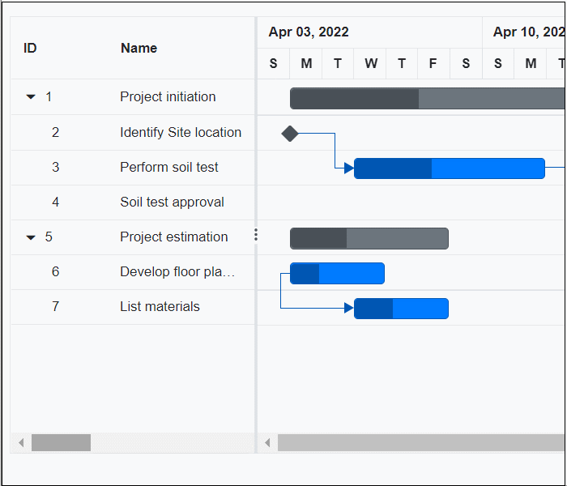

# Predecessor Validation

By default, Gantt task date values are validated based on predecessor values. You can enable or disable this validation by using the [EnablePredecessorValidation](https://help.syncfusion.com/cr/blazor/Syncfusion.Blazor.Gantt.SfGantt-1.html#Syncfusion_Blazor_Gantt_SfGantt_1_EnablePredecessorValidation) property. By default, `EnablePredecessorValidation` is **true**.




@using Syncfusion.Blazor.Gantt

<SfGantt @ref="Gantt" DataSource="@TaskCollection" Height="450px" Width="1000px" ProjectStartDate="ProjectStart" ProjectEndDate="ProjectEnd"
 Toolbar="@(new List<string>() { "Add", "Edit", "Update", "Cancel"})" EnablePredecessorValidation="false">
    <GanttTaskFields Id="TaskID" Name="TaskName" StartDate="StartDate"
                     Duration="Duration" Dependency="Predecessor" ParentID="ParentID"></GanttTaskFields>
    <GanttEditSettings AllowTaskbarEditing="true" AllowEditing="true" AllowAdding="true"></GanttEditSettings>
</SfGantt>

@code {
    public SfGantt<TaskData> Gantt;
    private DateTime ProjectStart = new DateTime(2022, 03, 31);
    private DateTime ProjectEnd = new DateTime(2022, 07, 06);
    private List<TaskData> TaskCollection { get; set; }

    protected override void OnInitialized()
    {
        this.TaskCollection = GetTaskCollection();
    }

    public class TaskData
    {
        public int TaskID { get; set; }
        public string TaskName { get; set; }
        public DateTime StartDate { get; set; }
        public string Duration { get; set; }
        public string Predecessor { get; set; }
        public int Progress { get; set; }
        public int? ParentID { get; set; }
    }

    public static List<TaskData> GetTaskCollection()
    {
        List<TaskData> Tasks = new List<TaskData>() {
            new TaskData() { TaskID = 1, TaskName = "Project initiation", StartDate = new DateTime(2022, 04, 05)},
            new TaskData() { TaskID = 2, TaskName = "Identify Site location", StartDate = new DateTime(2022, 04, 05), Progress = 30, ParentID = 1},
            new TaskData() { TaskID = 3, TaskName = "Perform soil test", StartDate = new DateTime(2022, 04, 05), Duration = "3", Progress = 40, Predecessor = "2fs", ParentID = 1 },
            new TaskData() { TaskID = 4, TaskName = "Soil test approval", StartDate = new DateTime(2022, 04, 05), Duration = "1", Progress = 30, ParentID = 1 },
            new TaskData() { TaskID = 5, TaskName = "Project estimation", StartDate = new DateTime(2022, 04, 06) },
            new TaskData() { TaskID = 6, TaskName = "Develop floor plan for estimation", StartDate = new DateTime(2022, 04, 06), Duration = "3", Progress = 30, ParentID = 5 },
            new TaskData() { TaskID = 7, TaskName = "List materials", StartDate = new DateTime(2022, 04, 06), Duration = "3", Progress = 40, Predecessor = "6", ParentID = 5 },
            new TaskData() { TaskID = 8, TaskName = "Estimation approval", StartDate = new DateTime(2022, 04, 06), Duration = "2", Progress = 30, ParentID = 5 }
        };
        return Tasks;
    }
}






## Custom validation using TaskbarEditing event

In Gantt Chart, the task relationship link can be broken by editing the start date, end date, or duration of a task. When the task relationship is broken during any edit action, it can be handled in Gantt Chart in the following ways.

### Validation mode

When editing tasks with predecessor links, the [TaskbarEditing](https://help.syncfusion.com/cr/blazor/Syncfusion.Blazor.Gantt.GanttEvents-1.html#Syncfusion_Blazor_Gantt_GanttEvents_1_TaskbarEditing) event is triggered. You can validate the editing action within the `TaskbarEditing` event using the [ValidateMode](https://help.syncfusion.com/cr/blazor/Syncfusion.Blazor.Gantt.ValidateMode.html) event argument. The `ValidateMode` argument provides the following properties:

Argument |Default value |Description
-----|-----|-----
args.ValidationMode.RespectLink | false | In this validation mode, the predecessor links get high priority. For example, in FS type, with this mode enabled, when the successor task is moved before the predecessor task’s end date, the editing will be reverted, and dates will be validated based on the dependency links.
args.ValidationMode.PreserveLinkWithEditing | true | In this validation mode, the taskbar editing will be considered along with the dependency links. This relationship will be maintained by updating the offset value of predecessors.

By default, the [PreserveLinkWithEditing](https://help.syncfusion.com/cr/blazor/Syncfusion.Blazor.Gantt.ValidateMode.html#Syncfusion_Blazor_Gantt_ValidateMode_PreserveLinkWithEditing) validation mode is enabled, so the predecessors are updated with offset values.

The following code example explains enabling the [RespectLink](https://help.syncfusion.com/cr/blazor/Syncfusion.Blazor.Gantt.ValidateMode.html#Syncfusion_Blazor_Gantt_ValidateMode_RespectLink) validation mode while editing the linked tasks in the [TaskbarEditing](https://blazor.syncfusion.com/documentation/gantt-chart/events#taskbarediting) event.




@using Syncfusion.Blazor.Gantt
<SfGantt DataSource="@TaskCollection" Height="450px" Width="700px">
    <GanttTaskFields Id="TaskID" Name="TaskName" StartDate="StartDate" EndDate="EndDate" Duration="Duration" Progress="Progress"
                     Dependency="Predecessor" ParentID="ParentID"></GanttTaskFields>
    <GanttEditSettings AllowTaskbarEditing="true" AllowEditing></GanttEditSettings>
    <GanttEvents TValue="TaskData" TaskbarEditing="TaskbarEditing"></GanttEvents>
</SfGantt>

@code {
    private List<TaskData> TaskCollection { get; set; }
    protected override void OnInitialized()
    {
        this.TaskCollection = GetTaskCollection();
    }
    public void TaskbarEditing(TaskbarEditingEventArgs<TaskData> args)
    {
        if (args.ValidationMode != null)
        {
            args.ValidationMode.RespectLink = true;
        }
    }
    public class TaskData
    {
        public int TaskID { get; set; }
        public string TaskName { get; set; }
        public DateTime StartDate { get; set; }
        public DateTime? EndDate { get; set; }
        public string Duration { get; set; }
        public int Progress { get; set; }
        public string Predecessor { get; set; }
        public int? ParentID { get; set; }
    }

    public static List<TaskData> GetTaskCollection()
    {
        List<TaskData> Tasks = new List<TaskData>() {
            new TaskData() { TaskID = 1, TaskName = "Project initiation", StartDate = new DateTime(2022, 04, 05), EndDate = new DateTime(2022, 04, 08) },
            new TaskData() { TaskID = 2, TaskName = "Identify Site location", StartDate = new DateTime(2022, 04, 05), Duration = "0", Progress = 30, ParentID = 1 },
            new TaskData() { TaskID = 3, TaskName = "Perform soil test", StartDate = new DateTime(2022, 04, 05), Duration = "4", Progress = 40, Predecessor = "2", ParentID = 1 },
            new TaskData() { TaskID = 4, TaskName = "Soil test approval", StartDate = new DateTime(2022, 04, 05), Duration = "0", Progress = 30, ParentID = 1 },
            new TaskData() { TaskID = 5, TaskName = "Project estimation", StartDate = new DateTime(2022, 04, 06), EndDate = new DateTime(2022, 04, 13) },
            new TaskData() { TaskID = 6, TaskName = "Develop floor plan for estimation", StartDate = new DateTime(2022, 04, 06), Duration = "3", Progress = 30, ParentID = 5 },
            new TaskData() { TaskID = 7, TaskName = "List materials", StartDate = new DateTime(2022, 04, 06), Duration = "3", Progress = 40, Predecessor = "6", ParentID = 5 },
            new TaskData() { TaskID = 8, TaskName = "Estimation approval", StartDate = new DateTime(2022, 04, 06),  Duration = "0", Progress = 30, ParentID = 5 }
        };
        return Tasks;
    }
}






### Predecessor offset validation

In Gantt the [AutoUpdatePredecessorOffset](https://help.syncfusion.com/cr/blazor/Syncfusion.Blazor.Gantt.SfGantt-1.html#Syncfusion_Blazor_Gantt_SfGantt_1_AutoUpdatePredecessorOffset) property is used to control whether predecessor offsets are recalculated automatically during task scheduling. When AutoUpdatePredecessorOffset is true (the default), the Gantt component recalculates and updates predecessor offsets whenever task edited that affect scheduling—such as start date, end date, duration, or dependencies—are changed. When set to false, offsets are not recalculated; the Gantt uses the offset values supplied by the data source, allowing offsets to be managed externally or preserved as predefined values. In cases where a task has multiple predecessors, the highest offset value among its predecessors is used and existing offset values from the data source are retained without modification.

The taskbar can be moved above the specified predecessor offset value, but if it is dragged below the offset value, it will revert to the minimum predecessor value.




@using Syncfusion.Blazor.Gantt

<SfGantt @ref="Gantt" DataSource="@TaskCollection" Height="450px" Width="1000px" ProjectStartDate="ProjectStart" ProjectEndDate="ProjectEnd"
         Toolbar="@(new List<string>() { "Add", "Edit", "Update", "Cancel" })" AutoUpdatePredecessorOffset="false">
    <GanttTaskFields Id="TaskID" Name="TaskName" StartDate="StartDate"
                     Duration="Duration" Dependency="Predecessor" ParentID="ParentID"></GanttTaskFields>
    <GanttEditSettings AllowTaskbarEditing="true" AllowEditing="true" AllowAdding="true"></GanttEditSettings>    
</SfGantt>

@code {
    public SfGantt<TaskData> Gantt;
    private DateTime ProjectStart = new DateTime(2022, 03, 31);
    private DateTime ProjectEnd = new DateTime(2022, 07, 06);
    private List<TaskData> TaskCollection { get; set; }

    protected override void OnInitialized()
    {
        this.TaskCollection = GetTaskCollection();
    }

    public class TaskData
    {
        public int TaskID { get; set; }
        public string TaskName { get; set; }
        public DateTime StartDate { get; set; }
        public string Duration { get; set; }
        public string Predecessor { get; set; }
        public int Progress { get; set; }
        public int? ParentID { get; set; }
    }

    public static List<TaskData> GetTaskCollection()
    {
        List<TaskData> Tasks = new List<TaskData>() {
            new TaskData() { TaskID = 1, TaskName = "Project initiation", StartDate = new DateTime(2022, 04, 04)},
            new TaskData() { TaskID = 2, TaskName = "Identify Site location", StartDate = new DateTime(2022, 04, 04), Progress = 30, ParentID = 1},
            new TaskData() { TaskID = 3, TaskName = "Perform soil test", StartDate = new DateTime(2022, 04, 05), Duration = "3", Progress = 40, Predecessor = "2fs", ParentID = 1 },
            new TaskData() { TaskID = 4, TaskName = "Soil test approval", StartDate = new DateTime(2022, 04, 04), Duration = "1", Progress = 30, ParentID = 1 },
            new TaskData() { TaskID = 5, TaskName = "Project estimation", StartDate = new DateTime(2022, 04, 04) },
            new TaskData() { TaskID = 6, TaskName = "Develop floor plan for estimation", StartDate = new DateTime(2022, 04, 04), Duration = "3", Progress = 30, ParentID = 5 },
            new TaskData() { TaskID = 7, TaskName = "List materials", StartDate = new DateTime(2022, 04, 07), Duration = "3", Progress = 40, Predecessor = "6", ParentID = 5 },
            new TaskData() { TaskID = 8, TaskName = "Estimation approval", StartDate = new DateTime(2022, 04, 04), Duration = "2", Progress = 30, ParentID = 5 }
        };
        return Tasks;
    }
}






N> When `EnablePredecessorOffsetValidation` is enabled, the predecessor offset will not be updated on dragging the taskbar. You can update the predecessor offset either by cell edit or dialog edit.

### Auto-link validation

When connector lines are drawn between tasks, the task dates are validated based on predecessor values. You can restrict this validation when drawing predecessors by using the [TaskbarEditing](https://help.syncfusion.com/cr/blazor/Syncfusion.Blazor.Gantt.GanttEvents-1.html#Syncfusion_Blazor_Gantt_GanttEvents_1_TaskbarEditing)  event. You can enable or disable the validation using the [EnablePredecessorValidation](https://help.syncfusion.com/cr/blazor/Syncfusion.Blazor.Gantt.TaskbarEditingEventArgs-1.html#Syncfusion_Blazor_Gantt_TaskbarEditingEventArgs_1_EnablePredecessorValidation) event argument. By default, `EnablePredecessorValidation` is **true**.

In the following code example, the connector line connected from task ID 2 to task ID 3 is rendered at load time, so validation occurs. However, the connector line from task ID 6 to task ID 7 is drawn dynamically, and validation is restricted by disabling the `EnablePredecessorValidation` property.




@using Syncfusion.Blazor.Gantt

<SfGantt @ref="Gantt" DataSource="@TaskCollection" Height="450px" Width="1000px" Toolbar="@(new List<string>() { "Add", "Edit", "Update", "Cancel"})">
    <GanttTaskFields Id="TaskID" Name="TaskName" StartDate="StartDate"
                     Duration="Duration" Dependency="Predecessor" ParentID="ParentID"></GanttTaskFields>
    <GanttEditSettings AllowTaskbarEditing="true" AllowEditing="true" AllowAdding="true"></GanttEditSettings>
    <GanttEvents TaskbarEditing="TaskbarEditingHandler" TValue="TaskData"></GanttEvents>
</SfGantt>

@code {
    public SfGantt<TaskData> Gantt;
    private DateTime ProjectStart = new DateTime(2022, 3, 24);
    private DateTime ProjectEnd = new DateTime(2022, 7, 6);
    private List<TaskData> TaskCollection { get; set; }

    protected override void OnInitialized()
    {
        this.TaskCollection = GetTaskCollection();
    }

    public void TaskbarEditingHandler(TaskbarEditingEventArgs<TaskData> args)
    {
       args.EnablePredecessorValidation = true;
    }

    public class TaskData
    {
        public int TaskID { get; set; }
        public string TaskName { get; set; }
        public DateTime StartDate { get; set; }
        public string Duration { get; set; }
        public string Predecessor { get; set; }
        public int Progress { get; set; }
        public int? ParentID { get; set; }
    }

    public static List<TaskData> GetTaskCollection()
    {
        List<TaskData> Tasks = new List<TaskData>() {
            new TaskData() { TaskID = 1, TaskName = "Project initiation", StartDate = new DateTime(2022, 04, 04)},
            new TaskData() { TaskID = 2, TaskName = "Identify Site location", StartDate = new DateTime(2022, 04, 04), Progress = 30, ParentID = 1},
            new TaskData() { TaskID = 3, TaskName = "Perform soil test", StartDate = new DateTime(2022, 04, 05), Duration = "3", Progress = 40, Predecessor = "2fs", ParentID = 1 },
            new TaskData() { TaskID = 4, TaskName = "Soil test approval", StartDate = new DateTime(2022, 04, 04), Duration = "1", Progress = 30, ParentID = 1 },
            new TaskData() { TaskID = 5, TaskName = "Project estimation", StartDate = new DateTime(2022, 04, 04) },
            new TaskData() { TaskID = 6, TaskName = "Develop floor plan for estimation", StartDate = new DateTime(2022, 04, 04), Duration = "3", Progress = 30, ParentID = 5 },
            new TaskData() { TaskID = 7, TaskName = "List materials", StartDate = new DateTime(2022, 04, 04), Duration = "3", Progress = 40, ParentID = 5 },
            new TaskData() { TaskID = 8, TaskName = "Estimation approval", StartDate = new DateTime(2022, 04, 04), Duration = "2", Progress = 30, ParentID = 5 }
        };
        return Tasks;
    }
}






> [EnablePredecessorValidation](https://help.syncfusion.com/cr/blazor/Syncfusion.Blazor.Gantt.SfGantt-1.html#Syncfusion_Blazor_Gantt_SfGantt_1_EnablePredecessorValidation) API is used to enable/disable validation based on predecessor values both on load time and on edit actions like cell editing, dialog editing, and on predecessor drawing. Whereas, [EnablePredecessorValidation](https://help.syncfusion.com/cr/blazor/Syncfusion.Blazor.Gantt.TaskbarEditingEventArgs-1.html#Syncfusion_Blazor_Gantt_TaskbarEditingEventArgs_1_EnablePredecessorValidation) event argument is used to enable/disable validation only on predecessor drawing. 