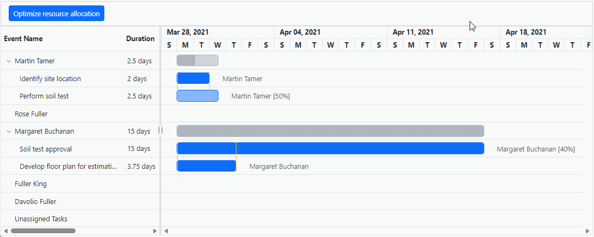

# Resource allocation with Blazor Gantt Chart and AI models

This guide demonstrates how to use the [Syncfusion.Blazor.AI](https://www.nuget.org/packages/Syncfusion.Blazor.AI) package for automatic resource reallocation in a Syncfusion Blazor Gantt Chart component. The [Syncfusion.Blazor.AI](https://www.nuget.org/packages/Syncfusion.Blazor.AI) package enables integration with AI models to process and structure data, while Ollama provides self-hosted or cloud-based AI capabilities for analyzing relationships in datasets. This sample demonstrates how to efficiently manage resource overallocation by reallocating available resources to tasks.

## Prerequisites

Ensure the following NuGet packages are installed based on the selected AI service.

### For OpenAI
- Microsoft.Extensions.AI
- Microsoft.Extensions.AI.OpenAI

### For Azure OpenAI
- Microsoft.Extensions.AI
- Microsoft.Extensions.AI.OpenAI
- Azure.AI.OpenAI

### For Ollama
- Microsoft.Extensions.AI
- OllamaSharp




Install-Package Syncfusion.Blazor.Gantt -Version {{ site.releaseversion }}
Install-Package Syncfusion.Blazor.Themes -Version {{ site.releaseversion }}
Install-Package Syncfusion.Blazor.AI -Version {{ site.releaseversion }}
Install-Package Microsoft.Extensions.AI
Install-Package Microsoft.Extensions.AI.OpenAI  # For OpenAI or Azure OpenAI
Install-Package Azure.AI.OpenAI  # For Azure OpenAI
Install-Package OllamaSharp  # For Ollama




## Add stylesheet and script resources

Include the theme stylesheet and script from NuGet via [Static Web Assets](https://blazor.syncfusion.com/documentation/appearance/themes#static-web-assets) in the `<head>` of the main page:

- For **.NET 6** Blazor Server apps, add to **~/Pages/_Layout.cshtml**.
- For **.NET 8 or .NET 9 or .NET 10** Blazor Server apps, add to **~/Components/App.razor**.

```html
<head>
    <link href="_content/Syncfusion.Blazor.Themes/bootstrap5.css" rel="stylesheet" />
</head>
<body>
    <script src="_content/Syncfusion.Blazor.Core/scripts/syncfusion-blazor.min.js" type="text/javascript"></script>
</body>
```

> Explore the [Blazor Themes](https://blazor.syncfusion.com/documentation/appearance/themes) topic for methods to reference themes ([Static Web Assets](https://blazor.syncfusion.com/documentation/appearance/themes#static-web-assets), [CDN](https://blazor.syncfusion.com/documentation/appearance/themes#cdn-reference), or [CRG](https://blazor.syncfusion.com/documentation/common/custom-resource-generator)). Refer to the [Adding Script Reference](https://blazor.syncfusion.com/documentation/common/adding-script-references) topic for different approaches to adding script references in your Blazor application.

## Configure AI service

Choose one of the following AI services (OpenAI, Azure OpenAI, or Ollama) based on requirements:
- **OpenAI**: Cloud-based, general-purpose AI models with minimal setup.
- **Azure OpenAI**: Enterprise-grade deployment with enhanced security and scalability.
- **Ollama**: Self-hosted, privacy-focused AI models.

Follow the instructions for the selected service to register the AI model in the application.

### OpenAI

Generate an API key from OpenAI and set `openAIApiKey`. Specify the desired model (for example, `gpt-3.5-turbo`, `gpt-4`) in `openAIModel`.

- Install the required NuGet packages:




Install-Package Microsoft.Extensions.AI
Install-Package Microsoft.Extensions.AI.OpenAI




- Add the following to the **~/Program.cs** file in the Blazor Web App:




using Syncfusion.Blazor.AI;
using Microsoft.Extensions.AI;
using Syncfusion.Blazor.SmartComponents;
using OpenAI;

var builder = WebApplication.CreateBuilder(args);

string openAIApiKey = "API-KEY";
string openAIModel = "OPENAI_MODEL";
OpenAIClient openAIClient = new OpenAIClient(openAIApiKey);
IChatClient openAIChatClient = openAIClient.GetChatClient(openAIModel).AsIChatClient();
builder.Services.AddChatClient(openAIChatClient);
builder.Services.AddSingleton<IChatInferenceService, SyncfusionAIService>();

var app = builder.Build();




### Azure OpenAI

Deploy an Azure OpenAI Service resource and model as described in [Microsoft’s documentation](https://learn.microsoft.com/en-us/azure/ai-services/openai/how-to/create-resource). Obtain values for `azureOpenAIKey`, `azureOpenAIEndpoint`, and `azureOpenAIModel`.

- Install the required NuGet packages:




Install-Package Microsoft.Extensions.AI
Install-Package Microsoft.Extensions.AI.OpenAI
Install-Package Azure.AI.OpenAI




- Add the following to the **~/Program.cs** file in the Blazor Web App:




using Syncfusion.Blazor.AI;
using Azure.AI.OpenAI;
using Microsoft.Extensions.AI;
using System.ClientModel;

var builder = WebApplication.CreateBuilder(args);

string azureOpenAIKey = "AZURE_OPENAI_KEY";
string azureOpenAIEndpoint = "AZURE_OPENAI_ENDPOINT";
string azureOpenAIModel = "AZURE_OPENAI_MODEL";
AzureOpenAIClient azureOpenAIClient = new AzureOpenAIClient(
     new Uri(azureOpenAIEndpoint),
     new ApiKeyCredential(azureOpenAIKey)
);
IChatClient azureOpenAIChatClient = azureOpenAIClient.GetChatClient(azureOpenAIModel).AsIChatClient();
builder.Services.AddChatClient(azureOpenAIChatClient);
builder.Services.AddSingleton<IChatInferenceService, SyncfusionAIService>();

var app = builder.Build();




### Ollama

To use Ollama for self-hosted AI models:

1. **Download and install Ollama**: Visit [Ollama's official website](https://ollama.com) and install the application for the operating system.
2. **Install a model**: Choose a model from the [Ollama Library](https://ollama.com/library) (for example, `llama2:13b`, `mistral:7b`).
3. **Configure the application**: Provide the `Endpoint` URL (for example, `http://localhost:11434`) and `ModelName` (for example, `llama2:13b`).

- Install the required NuGet packages:




Install-Package Microsoft.Extensions.AI
Install-Package OllamaSharp




- Add the following to the **~/Program.cs** file in the Blazor Web App:




using Syncfusion.Blazor.AI;
using Microsoft.Extensions.AI;
using OllamaSharp;

var builder = WebApplication.CreateBuilder(args);

string ModelName = "MODEL_NAME";
IChatClient chatClient = new OllamaApiClient("http://localhost:11434", ModelName);
builder.Services.AddChatClient(chatClient);
builder.Services.AddSingleton<IChatInferenceService, SyncfusionAIService>();

var app = builder.Build();




- **Verify connectivity**: Ensure the Ollama server is running and accessible at the specified endpoint (for example, `http://localhost:11434`) before starting the application.

## Register Syncfusion Blazor service

Add the Syncfusion Blazor service to the **~/Program.cs** file. The configuration depends on the app’s **Interactive Render Mode**:

- **Server mode**: Register the service in the single **~/Program.cs** file.
- **WebAssembly or Auto mode**: Register the service in both the server-side **~/Program.cs** and client-side **~/Program.cs** files.




using Syncfusion.Blazor;

var builder = WebApplication.CreateBuilder(args);

builder.Services.AddRazorComponents()
    .AddInteractiveServerComponents()
    .AddInteractiveWebAssemblyComponents();
builder.Services.AddSyncfusionBlazor();

var app = builder.Build();




using Syncfusion.Blazor;

var builder = WebAssemblyHostBuilder.CreateDefault(args);
builder.Services.AddSyncfusionBlazor();

await builder.Build().RunAsync();




## Integrated Gantt Chart with AI

The following code example show how to integrate the Gantt Chart with AI for automatic resource allocation




@inject AzureAIService OpenAIService
@using GanttChart.Components.Model
@using GanttChart.Components.Service
@using Syncfusion.Blazor.Gantt
@using Syncfusion.Blazor.Navigations
@using Syncfusion.Blazor.Buttons
@using System.Text.Json
@inject IJSRuntime JsInterop

<div class="col-lg-12 control-section" id="gantt-control-section">
    @if (showMessage)
    {
        <div>
            <SfButton CssClass="e-flat" IsPrimary="true" IconCss="e-icons e-refresh" IconPosition=@IconPosition.Right OnClick="Reload">Something went wrong.</SfButton>
        </div>
    }
    <div style="position: relative">
        <SfGantt @ref="Gantt" ViewType="ViewType.ResourceView" ShowOverallocation="true" DataSource="@TaskCollection" Width="100%" TreeColumnIndex="1" WorkUnit="WorkUnit.Hour" AllowUnscheduledTasks="true">
            <GanttTaskFields Id="Id" Name="Name" StartDate="StartDate" EndDate="EndDate" Duration="Duration" Progress="Progress"
            ParentID="ParentId" Work="Work" TaskType="TaskType">
            </GanttTaskFields>
            <GanttResource DataSource="ResourceCollection" Id="Id" Name="Name" MaxUnits="MaxUnit" TValue="GanttModel.TaskInfoModel" TResources="GanttModel.ResourceInfoModel"></GanttResource>
            <GanttAssignmentFields DataSource="AssignmentCollection" PrimaryKey="PrimaryId" TaskID="TaskId" ResourceID="ResourceId" Units="Unit" TValue="GanttModel.TaskInfoModel" TAssignment="GanttModel.AssignmentModel"></GanttAssignmentFields>
            <GanttLabelSettings RightLabel="Resources" TValue="GanttModel.TaskInfoModel"></GanttLabelSettings>
            <GanttColumns>
                <GanttColumn Field="Id" HeaderText="ID" Visible="false"></GanttColumn>
                <GanttColumn Field="Name" HeaderText="Event Name" Width="250px"></GanttColumn>
                <GanttResourceColumn HeaderText="Event Resources"></GanttResourceColumn>
                <GanttColumn Field="Duration" HeaderText="Duration"></GanttColumn>
                <GanttColumn Field="StartDate" HeaderText="Start Date"></GanttColumn>
                <GanttColumn Field="EndDate" HeaderText="End Date"></GanttColumn>
            </GanttColumns>
            <GanttTemplates TValue="GanttModel.TaskInfoModel">
                <TaskbarTemplate>
                    @{
                        var task = (context as GanttModel.TaskInfoModel);
                        if (task == null)
                        {
                            return;
                        }
                        var taskModel = Gantt.GetRowTaskModel(task);
                        string taskbarClassName = string.Empty;
                        string progressClassName = string.Empty;
                        if (TaskIds.Count > 0 && TaskIds.Any(s => s == task.Id))
                        {
                            taskbarClassName = "e-custom-taskbar";
                            progressClassName = "e-custom-progress";
                        }
                        <div class="e-gantt-child-taskbar e-gantt-child-taskbar-inner-div @taskbarClassName" style="height:22px;" tabindex=-1>
                            <div class="e-gantt-child-progressbar-inner-div e-gantt-child-progressbar @progressClassName" style="height:22px;width:@(taskModel.ProgressWidth + "px");text-align: right;border-radius: 0px;">
                            </div>
                        </div>
                    }
                </TaskbarTemplate>
            </GanttTemplates>
            <GanttSplitterSettings Position="50%"> </GanttSplitterSettings>
            <SfToolbar ID="Gantt_Toolbar">
                <ToolbarItems>
                    <ToolbarItem>
                        <Template>
                            <SfButton IsPrimary ID="openAI" @onclick="OpenAIHandler">Optimize resource allocation</SfButton>
                        </Template>
                    </ToolbarItem>
                </ToolbarItems>
            </SfToolbar>
        </SfGantt>
    </div>
</div>
<style>
    #Gantt_Toolbar {
    border: 1px solid lightgray !important;
    padding: 4px !important;
    }
    .e-icons.e-refresh::before {
    content: '\e706';
    }
    .e-custom-taskbar {
    background-color: lightgreen !important;
    }
    .e-custom-progress {
    background-color: green !important;
    }
</style>




using GanttChart.Components.Model;
using Microsoft.JSInterop;
using Syncfusion.Blazor.Gantt;
using System.Text.Json;

namespace GanttChart.Components.Pages
{
    public partial class Home
    {
        public  SfGantt<GanttModel.TaskInfoModel> Gantt;
        private List<GanttModel.TaskInfoModel> TaskCollection { get; set; }
        private List<GanttModel.ResourceInfoModel> ResourceCollection { get; set; }
        private static List<GanttModel.AssignmentModel> AssignmentCollection { get; set; }
        private string AIPrompt = string.Empty;
        private bool showMessage;
        List<int> TaskIds = new();
        protected override void OnInitialized()
        {
            TaskCollection = GanttModel.GetTaskCollection().Take(6).ToList();
            ResourceCollection = GanttModel.GetResources;
            AssignmentCollection = GanttModel.GetAssignmentCollection();
        }
        private string GeneratePrompt(List<GanttModel.TaskInfoModel> TaskCollection, List<GanttModel.ResourceInfoModel> ResourceCollection, List<GanttModel.AssignmentModel> AssignmentCollection)
        {
            return @"Here's a revised prompt to ensure the AI provides the results in JSON format:
    Function as an AI assistant responsible for optimizing resource assignments in a project management system. Your goal is to prevent overlapping task assignments for each resource, ensuring no resource is double-booked.
    1. **Check Task Assignments:** Review the start and end dates of tasks assigned to each resource to identify overlaps.
    2. **Resolve Conflicts:** Reassign conflicting tasks to other available resources without scheduling conflicts, ensuring each task is assigned to a resource.
    3. **Provide Updated Assignments:** Return the updated assignments.
    Please return a JSON object with the following:
    - **AssignmentCollection:** Updated resource assignments.
    - **TaskIds:** List of task IDs where resource assignments have changed.
    The response must be in JSON format only, with no additional explanations or content.
    Here is the dataset:
    - Task Collection Data: " + JsonSerializer.Serialize(TaskCollection) + @"
    - Resource Collection Data: " + JsonSerializer.Serialize(ResourceCollection) + @"
    - Assignment Collection Data: " + JsonSerializer.Serialize(AssignmentCollection) + @"
    Note: Ensure the response is a JSON string and does not include any extra information.";
        }
        private async Task Reload()
        {
            await JsInterop.InvokeVoidAsync("window.location.reload");
        }
        private async Task OpenAIHandler()
        {
            await Gantt.ShowSpinnerAsync();
            TaskIds = new();
            showMessage = false;
            List<GanttModel.AssignmentModel> sortedCollection = new List<GanttModel.AssignmentModel>();
            var AIPrompt = GeneratePrompt(TaskCollection, ResourceCollection, AssignmentCollection);
            string result = await OpenAIService.GetCompletionAsync(AIPrompt);
            try
            {
                if (result.StartsWith("```json"))
                {
                    result = result.Replace("```json", "").Replace("```", "").Trim();
                }
                else if (result.StartsWith("```"))
                {
                    result = result.Replace("```", "").Replace("```", "").Trim();
                }
                string response = JsonDocument.Parse(result).RootElement.GetProperty("AssignmentCollection").ToString();
                string taskIdCollection = JsonDocument.Parse(result).RootElement.GetProperty("TaskIds").ToString();
                if (response is not null)
                {
                    var collection = JsonSerializer.Deserialize<List<GanttModel.AssignmentModel>>(response);
                    if (collection is not null)
                    {
                        sortedCollection = collection;
                    }
                }
                if (taskIdCollection is not null)
                {
                    var collection = JsonSerializer.Deserialize<List<int>>(taskIdCollection);
                    if (collection is not null)
                    {
                        TaskIds = collection;
                    }
                }
                if (sortedCollection is not null && sortedCollection.Count > 0)
                {
                    AssignmentCollection = sortedCollection.Cast<GanttModel.AssignmentModel>().ToList();
                }
            }
            catch (Exception e)
            {
                showMessage = true;
                await Gantt.HideSpinnerAsync();
                return;
            }
            await Gantt.HideSpinnerAsync();
            await Task.CompletedTask;
        }
    }
}




using Microsoft.Extensions.AI;
using Syncfusion.Blazor.AI;

namespace GanttChart.Components.Service
{
    public class AzureAIService
    {
        private SyncfusionAIService _openAIConfiguration;
        private ChatParameters chatParameters_history = new ChatParameters();

        public AzureAIService(SyncfusionAIService openAIConfiguration)
        {
            _openAIConfiguration = openAIConfiguration;
        }

        /// <summary>
        /// Gets a text completion from the Azure OpenAI service.
        /// </summary>
        /// <param name="prompt">The user prompt to send to the AI service.</param>
        /// <param name="returnAsJson">Indicates whether the response should be returned in JSON format. Defaults to <c>true</c></param>
        /// <param name="appendPreviousResponse">Indicates whether to append previous responses to the conversation history. Defaults to <c>false</c></param>
        /// <param name="systemRole">Specifies the systemRole that is sent to AI Clients. Defaults to <c>null</c></param>
        /// <returns>The AI-generated completion as a string.</returns>
        public async Task<string> GetCompletionAsync(string prompt, bool returnAsJson = true, bool appendPreviousResponse = false, string systemRole = null)
        {
            string systemMessage = returnAsJson ? "You are a helpful assistant that only returns and replies with valid, iterable RFC8259 compliant JSON in your responses unless I ask for any other format. Do not provide introductory words such as 'Here is your result' or '```json', etc. in the response" : !string.IsNullOrEmpty(systemRole) ? systemRole : "You are a helpful assistant";
            try
            {
                ChatParameters chatParameters = appendPreviousResponse ? chatParameters_history : new ChatParameters();
                if (appendPreviousResponse)
                {
                    if (chatParameters.Messages == null)
                    {
                        chatParameters.Messages = new List<ChatMessage>() {
                        new ChatMessage(ChatRole.System,systemMessage),
                    };
                    }
                    chatParameters.Messages.Add(new ChatMessage(ChatRole.User, prompt));
                }
                else
                {
                    chatParameters.Messages = new List<ChatMessage>(2) {
                    new ChatMessage (ChatRole.System, systemMessage),
                    new ChatMessage(ChatRole.User,prompt)
                };
                }
                var completion = await _openAIConfiguration.GenerateResponseAsync(chatParameters);
                if (appendPreviousResponse)
                {
                    chatParameters_history?.Messages?.Add(new ChatMessage(ChatRole.Assistant, completion.ToString()));
                }
                return completion.ToString();
            }
            catch (Exception ex)
            {
                Console.WriteLine($"An exception has occurred: {ex.Message}");
                return "";
            }
        }
    }
}




namespace GanttChart.Components.Model
{
    public class GanttModel
    {
        public class ResourceInfoModel
        {
            public int Id { get; set; }
            public string Name { get; set; }
            public double MaxUnit { get; set; }
        }

        public class TaskInfoModel
        {
            public int Id { get; set; }
            public string Name { get; set; }
            public string TaskType { get; set; }
            public DateTime StartDate { get; set; }
            public DateTime? EndDate { get; set; }
            public string Duration { get; set; }
            public int Progress { get; set; }
            public int? ParentId { get; set; }
            public double? Work { get; set; }
        }

        public class AssignmentModel
        {
            public int PrimaryId { get; set; }
            public int TaskId { get; set; }
            public int ResourceId { get; set; }
            public double? Unit { get; set; }
        }

        public static List<ResourceInfoModel> GetResources = new List<ResourceInfoModel>()
        {
            new ResourceInfoModel() { Id= 1, Name= "Martin Tamer" ,MaxUnit=100},
            new ResourceInfoModel() { Id= 2, Name= "Rose Fuller", MaxUnit= 100 },
            new ResourceInfoModel() { Id= 3, Name= "Margaret Buchanan" },
            new ResourceInfoModel() { Id= 4, Name= "Fuller King", MaxUnit = 100},
            new ResourceInfoModel() { Id= 5, Name= "Davolio Fuller", MaxUnit = 100 }
        };

        public static List<AssignmentModel> GetAssignmentCollection()
        {
            List<AssignmentModel> assignments = new List<AssignmentModel>()
            {
                new AssignmentModel(){ PrimaryId=1, TaskId = 2, ResourceId=1, Unit=100},
                new AssignmentModel(){ PrimaryId=2, TaskId = 3, ResourceId=1, Unit=50},
                new AssignmentModel(){ PrimaryId=3, TaskId = 4, ResourceId=3, Unit=40},
                new AssignmentModel(){ PrimaryId=4, TaskId = 6, ResourceId=3, Unit = 100},
            };
            return assignments;
        }

        public static List<TaskInfoModel> GetTaskCollection()
        {
            return new List<TaskInfoModel>()
            {
                new TaskInfoModel() { Id = 1, Name = "Project initiation", StartDate = new DateTime(2021, 03, 28), EndDate = new DateTime(2021, 07, 28), TaskType ="FixedUnit", Work=128, Duration="4" },
                new TaskInfoModel() { Id = 2, Name = "Identify site location", StartDate = new DateTime(2021, 03, 29), Progress = 100, ParentId = 1, Duration="2", TaskType ="FixedUnit", Work=16 },
                new TaskInfoModel() { Id = 3, Name = "Perform soil test", StartDate = new DateTime(2021, 03, 29), ParentId = 1, Work=10, Duration="4", TaskType="FixedUnit" },
                new TaskInfoModel() { Id = 4, Name = "Soil test approval", StartDate = new DateTime(2021, 03, 29), Duration = "15", Progress = 100, ParentId = 1, Work=16, TaskType="FixedDuration" },
                new TaskInfoModel() { Id = 5, Name = "Project estimation", StartDate = new DateTime(2021, 03, 29), EndDate = new DateTime(2021, 04, 2), TaskType="FixedUnit", Duration="4" },
                new TaskInfoModel() { Id = 6, Name = "Develop floor plan for estimation", StartDate = new DateTime(2021, 03, 29), Duration = "3", Progress = 100, ParentId = 5, Work=30, TaskType="FixedUnit" },
                new TaskInfoModel() { Id = 7, Name = "List materials", StartDate = new DateTime(2021, 04, 01), Duration = "3", Progress = 30, ParentId = 5, TaskType="FixedUnit", Work=48 },
                new TaskInfoModel() { Id = 8, Name = "Estimation approval", StartDate = new DateTime(2021, 04, 01), Duration = "2", ParentId = 5, Work=60, TaskType="FixedUnit" },
                new TaskInfoModel() { Id = 9, Name = "Sign contract", StartDate = new DateTime(2021, 03, 31), EndDate = new DateTime(2021, 04, 01), Duration="3", TaskType="FixedUnit", Work=24 },
            };
        }
    }
}




using GanttChart.Components;
using GanttChart.Components.Service;
using Microsoft.Extensions.AI;
using OpenAI;
using Syncfusion.Blazor;
using Syncfusion.Blazor.AI;

var builder = WebApplication.CreateBuilder(args);

// Add services to the container.
builder.Services.AddRazorComponents()
    .AddInteractiveServerComponents();
builder.Services.AddSyncfusionBlazor();

#region AI Integration
// Open AI Service.

string apiKey = "API-KEY";
string modelName = "OPENAI_MODEL";
OpenAIClient client = new OpenAIClient(apiKey);
IChatClient chatClient = openAIClient.GetChatClient(modelName).AsIChatClient();
builder.Services.AddChatClient(chatClient);

builder.Services.AddSingleton<SyncfusionAIService>();
builder.Services.AddSingleton<AzureAIService>();
#endregion

var app = builder.Build();
app.Run();




## Error handling and troubleshooting

If the AI service fails to return a valid response, the TreeGrid displays an error message (“Oops! Please try again!”). Common issues include:

- **Invalid API key or endpoint**: Verify that `openAIApiKey`, `azureOpenAIKey`, or the Ollama `Endpoint` is correct and the service is accessible.
- **Model unavailable**: Ensure the specified `openAIModel`, `azureOpenAIModel`, or `ModelName` is deployed and supported.
- **Network issues**: Check connectivity to the AI service endpoint, especially for self-hosted Ollama instances.
- **Large datasets**: Processing large datasets may cause timeouts. Consider batching data or optimizing the prompt.

## Performance considerations

When handling large datasets, ensure the Ollama server has sufficient resources (CPU/GPU) to process requests efficiently. For datasets exceeding 10,000 records, consider splitting the data into smaller batches to avoid performance bottlenecks. Test the application with your specific dataset to determine optimal performance.

## Sample code

A complete working example is available in the [Syncfusion Blazor AI Samples GitHub repository](https://github.com/syncfusion/smart-ai-samples).

