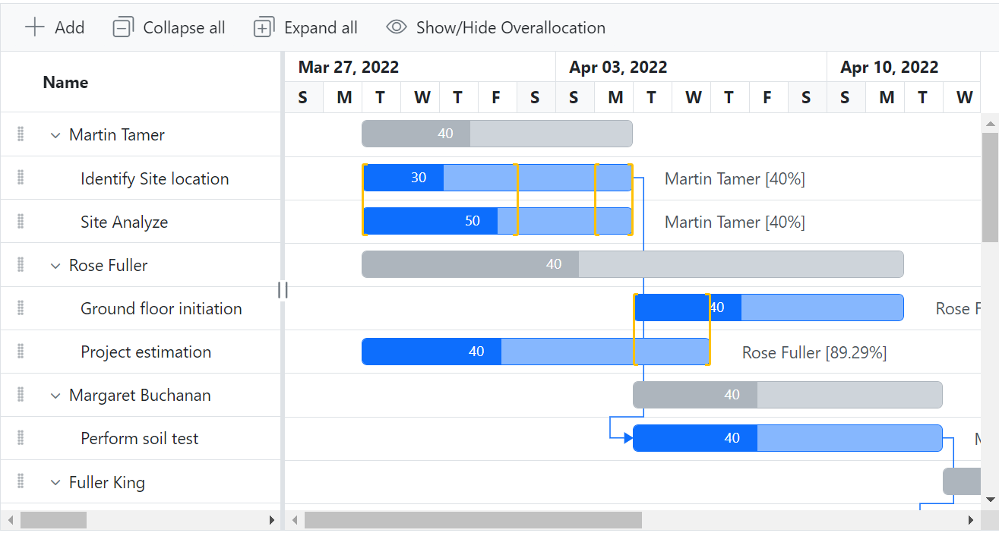
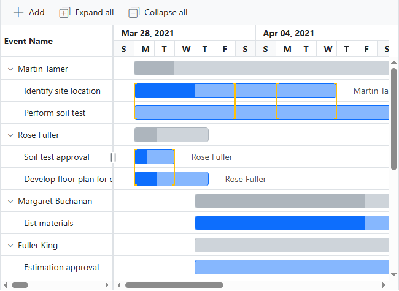
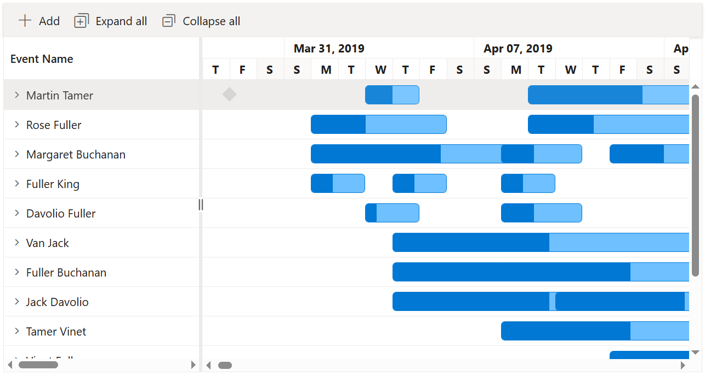
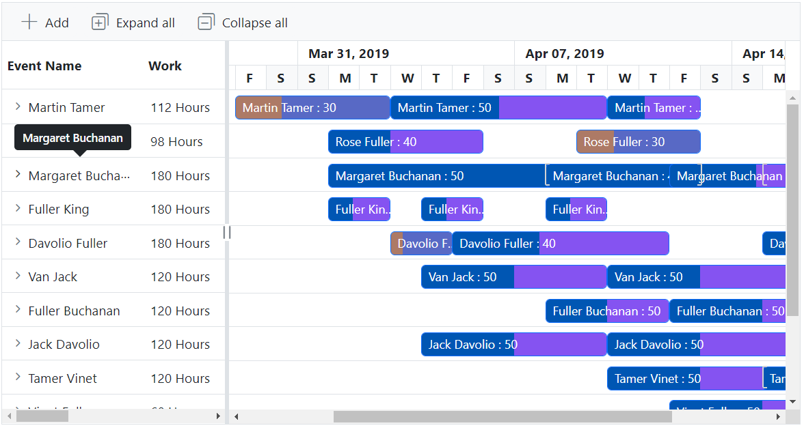
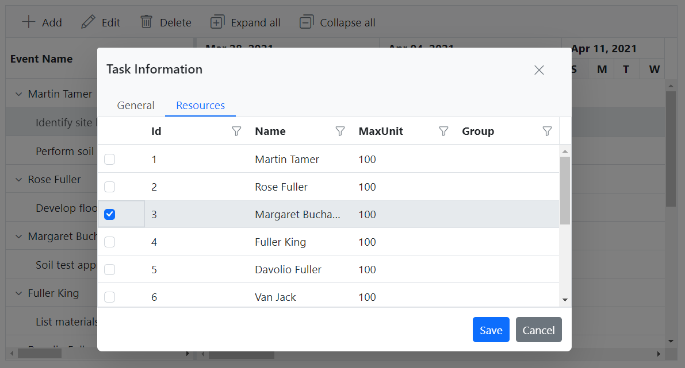

# Resource view in Blazor Gantt Chart Component

To visualize tasks assigned to each resource in a hierarchical manner, you can set the [ViewType](https://help.syncfusion.com/cr/blazor/Syncfusion.Blazor.Gantt.SfGantt-1.html#Syncfusion_Blazor_Gantt_SfGantt_1_ViewType) property to [ResourceView](https://help.syncfusion.com/cr/blazor/Syncfusion.Blazor.Gantt.ViewType.html#Syncfusion_Blazor_Gantt_ViewType_ResourceView) during initialization of the Gantt Chart. This view represents resources as parent records and their corresponding tasks as child records.

```cshtml
@using Syncfusion.Blazor.Gantt

<SfGantt @ref="ganttInstance" DataSource="@TaskCollection" ViewType="ViewType.ResourceView" Height="450px" Width="850px" TreeColumnIndex="1" ProjectStartDate="@ProjectStart" ProjectEndDate="@ProjectEnd" WorkUnit="WorkUnit.Hour"
         Toolbar="@(new List<string>(){ "Add", "Edit", "Update", "Delete", "Cancel", "ExpandAll", "CollapseAll"})">
    <GanttTaskFields Id="Id" Name="Name" StartDate="StartDate" EndDate="EndDate" Duration="Duration" Progress="Progress"
                     ParentID="ParentId" Work="Work" TaskType="TaskType">
    </GanttTaskFields>
    <GanttEditSettings AllowAdding="true" AllowEditing="true" AllowDeleting="true" AllowTaskbarEditing="true"
                       ShowDeleteConfirmDialog="true"></GanttEditSettings>
    <GanttColumns>
        <GanttColumn Field="Id" HeaderText="ID"></GanttColumn>
        <GanttColumn Field="Name" HeaderText="Event Name" ClipMode="Syncfusion.Blazor.Grids.ClipMode.EllipsisWithTooltip"></GanttColumn>
        <GanttResourceColumn HeaderText="Event Resources"></GanttResourceColumn>
        <GanttColumn Field="Work" HeaderText="Work"></GanttColumn>
        <GanttColumn Field="Duration" HeaderText="Duration"></GanttColumn>
        <GanttColumn Field="TaskType" HeaderText="Task Type"></GanttColumn>
        <GanttColumn Field="StartDate" HeaderText="Start Date"></GanttColumn>
        <GanttColumn Field="EndDate" HeaderText="End Date"></GanttColumn>
    </GanttColumns>
    <GanttResource DataSource="ResourceCollection" Id="Id" Name="Name" MaxUnits="MaxUnit" TValue="TaskInfoModel" TResources="ResourceInfoModel"></GanttResource>
    <GanttAssignmentFields DataSource="AssignmentCollection" PrimaryKey="PrimaryId" TaskID="TaskId" ResourceID="ResourceId" Units="Unit" TValue="TaskInfoModel" TAssignment="AssignmentModel"></GanttAssignmentFields>
    <GanttLabelSettings RightLabel="Resources" TValue="TaskInfoModel"></GanttLabelSettings>
    <GanttSplitterSettings Position="28%"> </GanttSplitterSettings>
</SfGantt>

@code {
    private SfGantt<TaskInfoModel> ganttInstance { get; set; } = new();
    private DateTime ProjectStart = new DateTime(2021, 3, 28);
    private DateTime ProjectEnd = new DateTime(2021, 7, 28);
    private List<TaskInfoModel> TaskCollection { get; set; } = new();
    private List<ResourceInfoModel> ResourceCollection { get; set; } = new();
    private static List<AssignmentModel> AssignmentCollection { get; set; } = new();
    protected override void OnInitialized()
    {
        TaskCollection = GetTaskCollection();
        ResourceCollection = GetResources;
        AssignmentCollection = GetAssignmentCollection();
    }

    public class ResourceInfoModel
    {
        public int Id { get; set; }
        public string? Name { get; set; }
        public double MaxUnit { get; set; }
    }

    public class TaskInfoModel
    {
        public int Id { get; set; }
        public string? Name { get; set; }
        public string? TaskType { get; set; }
        public DateTime StartDate { get; set; }
        public DateTime? EndDate { get; set; }
        public string? Duration { get; set; }
        public int Progress { get; set; }
        public int? ParentId { get; set; }
        public double? Work { get; set; }
    }

    public class AssignmentModel
    {
        public int PrimaryId { get; set; }
        public int TaskId { get; set; }
        public int ResourceId { get; set; }
        public double Unit { get; set; }
    }

    public static List<ResourceInfoModel> GetResources = new List<ResourceInfoModel>()
    {
        new ResourceInfoModel() { Id= 1, Name= "Martin Tamer" ,MaxUnit=70},
        new ResourceInfoModel() { Id= 2, Name= "Rose Fuller" },
        new ResourceInfoModel() { Id= 3, Name= "Margaret Buchanan" },
        new ResourceInfoModel() { Id= 4, Name= "Fuller King", MaxUnit = 100},
        new ResourceInfoModel() { Id= 5, Name= "Davolio Fuller" },
        new ResourceInfoModel() { Id= 6, Name= "Van Jack" },
        new ResourceInfoModel() { Id= 7, Name= "Fuller Buchanan" },
        new ResourceInfoModel() { Id= 8, Name= "Jack Davolio" },
        new ResourceInfoModel() { Id= 9, Name= "Tamer Vinet" },
        new ResourceInfoModel() { Id= 10, Name= "Vinet Fuller" },
        new ResourceInfoModel() { Id= 11, Name= "Bergs Anton" },
        new ResourceInfoModel() { Id= 12, Name= "Construction Supervisor" }
    };

    public static List<AssignmentModel> GetAssignmentCollection()
    {
        List<AssignmentModel> assignments = new List<AssignmentModel>()
        {
            new AssignmentModel(){ PrimaryId=1, TaskId = 2 , ResourceId=1, Unit=70},
            new AssignmentModel(){ PrimaryId=2, TaskId = 3 , ResourceId=1, Unit=70},
            new AssignmentModel(){ PrimaryId=3, TaskId = 4 , ResourceId=3},
            new AssignmentModel(){ PrimaryId=4, TaskId = 5 , ResourceId=8},
            new AssignmentModel(){ PrimaryId=5, TaskId = 6 , ResourceId=2},
            new AssignmentModel(){ PrimaryId=6, TaskId = 7 , ResourceId=4, Unit=30},
            new AssignmentModel(){ PrimaryId=7, TaskId = 8 , ResourceId=8},
            new AssignmentModel(){ PrimaryId=8, TaskId = 9 , ResourceId=11},
            new AssignmentModel(){ PrimaryId=9, TaskId = 12 , ResourceId=2},
            new AssignmentModel(){ PrimaryId=10, TaskId = 13 , ResourceId=6},
            new AssignmentModel(){ PrimaryId=11, TaskId = 14 , ResourceId=7},
            new AssignmentModel(){ PrimaryId=12, TaskId = 15 , ResourceId=9},
            new AssignmentModel(){ PrimaryId=13, TaskId = 16 , ResourceId=10},
            new AssignmentModel(){ PrimaryId=14, TaskId = 17 , ResourceId=7},
            new AssignmentModel(){ PrimaryId=15, TaskId = 18 , ResourceId=5},
            new AssignmentModel(){ PrimaryId=16, TaskId = 19 , ResourceId=5}
        };
        return assignments;
    }

    public static List<TaskInfoModel> GetTaskCollection()
    {
        List<TaskInfoModel> Tasks = new List<TaskInfoModel>()
        {
            new TaskInfoModel() {
                Id = 1,
                Name = "Project initiation",
                StartDate = new DateTime(2021, 03, 28),
                EndDate = new DateTime(2021, 07, 28),
                TaskType ="FixedDuration",
                Work=128,
                Duration="4"
            },
            new TaskInfoModel() {
                Id = 2,
                Name = "Identify site location",
                StartDate = new DateTime(2021, 03, 29),
                Progress = 30,
                ParentId = 1,
                Duration="2",
                TaskType ="FixedDuration",
                Work=16,
            },
            new TaskInfoModel() {
                Id = 3,
                Name = "Perform soil test",
                StartDate = new DateTime(2021, 03, 29),
                ParentId = 1,
                Work=96,
                Duration="4",
                TaskType="FixedWork"
            },
            new TaskInfoModel() {
                Id = 4,
                Name = "Soil test approval",
                StartDate = new DateTime(2021, 03, 29),
                Duration = "1",
                Progress = 30,
                ParentId = 1,
                Work=16,
                TaskType="FixedWork"
            },
            new TaskInfoModel() {
                Id = 5,
                Name = "Project estimation",
                StartDate = new DateTime(2021, 03, 29),
                EndDate = new DateTime(2021, 04, 2),
                TaskType="FixedDuration",
                Duration="4"
            },
            new TaskInfoModel() {
                Id = 6,
                Name = "Develop floor plan for estimation",
                StartDate = new DateTime(2021, 03, 29),
                Duration = "3",
                Progress = 30,
                ParentId = 5,
                Work=30,
                TaskType="FixedWork"
            },
            new TaskInfoModel() {
                Id = 7,
                Name = "List materials",
                StartDate = new DateTime(2021, 04, 01),
                Duration = "3",
                Progress = 30,
                ParentId = 5,
                TaskType="FixedWork",
                Work=48,
            },
            new TaskInfoModel() {
                Id = 8,
                Name = "Estimation approval",
                StartDate = new DateTime(2021, 04, 01),
                Duration = "2",
                ParentId = 5,
                Work=60,
                TaskType="FixedWork",
            },
            new TaskInfoModel() {
                Id = 9,
                Name = "Sign contract",
                StartDate = new DateTime(2021, 03, 31),
                EndDate = new DateTime(2021, 04, 01),
                Duration="1",
                TaskType="FixedWork",
                Work=24,
            },
        };
        return Tasks;
    }
}
```


> There is not support for Indent/Oudent in resource view Gantt Chart.

## Resource overallocation

When a resource is assigned more work than they can complete within their available time in a day, it is referred to as overallocation. The available working time for resources to complete tasks in a day is calculated based on the [GanttDayWorkingTime](https://help.syncfusion.com/cr/blazor/Syncfusion.Blazor.Gantt.GanttDayWorkingTimeCollection.html#Syncfusion_Blazor_Gantt_GanttDayWorkingTimeCollection_DayWorkingTime) property and the resource unit.

To highlight the range of overallocation dates with a square bracket, you can enable this feature by setting the [ShowOverallocation](https://help.syncfusion.com/cr/blazor/Syncfusion.Blazor.Gantt.SfGantt-1.html#Syncfusion_Blazor_Gantt_SfGantt_1_ShowOverallocation) property to `true`.

```cshtml

@using Syncfusion.Blazor.Gantt

<SfGantt @ref="ganttInstance" ShowOverallocation="true" DataSource="@TaskCollection" ViewType="ViewType.ResourceView" Height="450px" Width="850px" TreeColumnIndex="1" ProjectStartDate="@ProjectStart" ProjectEndDate="@ProjectEnd" WorkUnit="WorkUnit.Hour"
         Toolbar="@(new List<string>(){ "Add", "Edit", "Update", "Delete", "Cancel", "ExpandAll", "CollapseAll"})">
    <GanttTaskFields Id="Id" Name="Name" StartDate="StartDate" EndDate="EndDate" Duration="Duration" Progress="Progress"
                     ParentID="ParentId" Work="Work" TaskType="TaskType">
    </GanttTaskFields>
    <GanttEditSettings AllowAdding="true" AllowEditing="true" AllowDeleting="true" AllowTaskbarEditing="true"
                       ShowDeleteConfirmDialog="true"></GanttEditSettings>
    <GanttColumns>
        <GanttColumn Field="Id" HeaderText="ID"></GanttColumn>
        <GanttColumn Field="Name" HeaderText="Event Name" ClipMode="Syncfusion.Blazor.Grids.ClipMode.EllipsisWithTooltip"></GanttColumn>
        <GanttResourceColumn HeaderText="Event Resources"></GanttResourceColumn>
        <GanttColumn Field="Work" HeaderText="Work"></GanttColumn>
        <GanttColumn Field="Duration" HeaderText="Duration"></GanttColumn>
        <GanttColumn Field="TaskType" HeaderText="Task Type"></GanttColumn>
        <GanttColumn Field="StartDate" HeaderText="Start Date"></GanttColumn>
        <GanttColumn Field="EndDate" HeaderText="End Date"></GanttColumn>
    </GanttColumns>
    <GanttResource DataSource="ResourceCollection" Id="Id" Name="Name" MaxUnits="MaxUnit" TValue="TaskInfoModel" TResources="ResourceInfoModel"></GanttResource>
    <GanttAssignmentFields DataSource="AssignmentCollection" PrimaryKey="PrimaryId" TaskID="TaskId" ResourceID="ResourceId" Units="Unit" TValue="TaskInfoModel" TAssignment="AssignmentModel"></GanttAssignmentFields>
    <GanttLabelSettings RightLabel="Resources" TValue="TaskInfoModel"></GanttLabelSettings>
    <GanttSplitterSettings Position="28%"> </GanttSplitterSettings>
</SfGantt>

@code {
    private SfGantt<TaskInfoModel> ganttInstance { get; set; } = new();
    private DateTime ProjectStart = new DateTime(2021, 3, 28);
    private DateTime ProjectEnd = new DateTime(2021, 7, 28);
    private List<TaskInfoModel> TaskCollection { get; set; } = new();
    private List<ResourceInfoModel> ResourceCollection { get; set; } = new();
    private static List<AssignmentModel> AssignmentCollection { get; set; } = new();
    protected override void OnInitialized()
    {
        TaskCollection = GetTaskCollection();
        ResourceCollection = GetResources;
        AssignmentCollection = GetAssignmentCollection();
    }

    public class ResourceInfoModel
    {
        public int Id { get; set; }
        public string? Name { get; set; }
        public double MaxUnit { get; set; }
    }

    public class TaskInfoModel
    {
        public int Id { get; set; }
        public string? Name { get; set; }
        public string? TaskType { get; set; }
        public DateTime StartDate { get; set; }
        public DateTime? EndDate { get; set; }
        public string? Duration { get; set; }
        public int Progress { get; set; }
        public int? ParentId { get; set; }
        public double? Work { get; set; }
    }

    public class AssignmentModel
    {
        public int PrimaryId { get; set; }
        public int TaskId { get; set; }
        public int ResourceId { get; set; }
        public double Unit { get; set; }
    }

    public static List<ResourceInfoModel> GetResources = new List<ResourceInfoModel>()
    {
        new ResourceInfoModel() { Id= 1, Name= "Martin Tamer" ,MaxUnit=70},
        new ResourceInfoModel() { Id= 2, Name= "Rose Fuller" },
        new ResourceInfoModel() { Id= 3, Name= "Margaret Buchanan" },
        new ResourceInfoModel() { Id= 4, Name= "Fuller King", MaxUnit = 100},
        new ResourceInfoModel() { Id= 5, Name= "Davolio Fuller" },
        new ResourceInfoModel() { Id= 6, Name= "Van Jack" },
        new ResourceInfoModel() { Id= 7, Name= "Fuller Buchanan" },
        new ResourceInfoModel() { Id= 8, Name= "Jack Davolio" },
        new ResourceInfoModel() { Id= 9, Name= "Tamer Vinet" },
        new ResourceInfoModel() { Id= 10, Name= "Vinet Fuller" },
        new ResourceInfoModel() { Id= 11, Name= "Bergs Anton" },
        new ResourceInfoModel() { Id= 12, Name= "Construction Supervisor" }
    };

    public static List<AssignmentModel> GetAssignmentCollection()
    {
        List<AssignmentModel> assignments = new List<AssignmentModel>()
        {
            new AssignmentModel(){ PrimaryId=1, TaskId = 2 , ResourceId=1, Unit=70},
            new AssignmentModel(){ PrimaryId=2, TaskId = 3 , ResourceId=1, Unit=70},
            new AssignmentModel(){ PrimaryId=3, TaskId = 4 , ResourceId=3},
            new AssignmentModel(){ PrimaryId=4, TaskId = 5 , ResourceId=8},
            new AssignmentModel(){ PrimaryId=5, TaskId = 6 , ResourceId=2},
            new AssignmentModel(){ PrimaryId=6, TaskId = 7 , ResourceId=4, Unit=30},
            new AssignmentModel(){ PrimaryId=7, TaskId = 8 , ResourceId=8},
            new AssignmentModel(){ PrimaryId=8, TaskId = 9 , ResourceId=11},
            new AssignmentModel(){ PrimaryId=9, TaskId = 12 , ResourceId=2},
            new AssignmentModel(){ PrimaryId=10, TaskId = 13 , ResourceId=6},
            new AssignmentModel(){ PrimaryId=11, TaskId = 14 , ResourceId=7},
            new AssignmentModel(){ PrimaryId=12, TaskId = 15 , ResourceId=9},
            new AssignmentModel(){ PrimaryId=13, TaskId = 16 , ResourceId=10},
            new AssignmentModel(){ PrimaryId=14, TaskId = 17 , ResourceId=7},
            new AssignmentModel(){ PrimaryId=15, TaskId = 18 , ResourceId=5},
            new AssignmentModel(){ PrimaryId=16, TaskId = 19 , ResourceId=5}
        };
        return assignments;
    }

    public static List<TaskInfoModel> GetTaskCollection()
    {
        List<TaskInfoModel> Tasks = new List<TaskInfoModel>()
        {
            new TaskInfoModel() {
                Id = 1,
                Name = "Project initiation",
                StartDate = new DateTime(2021, 03, 28),
                EndDate = new DateTime(2021, 07, 28),
                TaskType ="FixedDuration",
                Work=128,
                Duration="4"
            },
            new TaskInfoModel() {
                Id = 2,
                Name = "Identify site location",
                StartDate = new DateTime(2021, 03, 29),
                Progress = 30,
                ParentId = 1,
                Duration="2",
                TaskType ="FixedDuration",
                Work=16,
            },
            new TaskInfoModel() {
                Id = 3,
                Name = "Perform soil test",
                StartDate = new DateTime(2021, 03, 29),
                ParentId = 1,
                Work=96,
                Duration="4",
                TaskType="FixedWork"
            },
            new TaskInfoModel() {
                Id = 4,
                Name = "Soil test approval",
                StartDate = new DateTime(2021, 03, 29),
                Duration = "1",
                Progress = 30,
                ParentId = 1,
                Work=16,
                TaskType="FixedWork"
            },
            new TaskInfoModel() {
                Id = 5,
                Name = "Project estimation",
                StartDate = new DateTime(2021, 03, 29),
                EndDate = new DateTime(2021, 04, 2),
                TaskType="FixedDuration",
                Duration="4"
            },
            new TaskInfoModel() {
                Id = 6,
                Name = "Develop floor plan for estimation",
                StartDate = new DateTime(2021, 03, 29),
                Duration = "3",
                Progress = 30,
                ParentId = 5,
                Work=30,
                TaskType="FixedWork"
            },
            new TaskInfoModel() {
                Id = 7,
                Name = "List materials",
                StartDate = new DateTime(2021, 04, 01),
                Duration = "3",
                Progress = 30,
                ParentId = 5,
                TaskType="FixedWork",
                Work=48,
            },
            new TaskInfoModel() {
                Id = 8,
                Name = "Estimation approval",
                StartDate = new DateTime(2021, 04, 01),
                Duration = "2",
                ParentId = 5,
                Work=60,
                TaskType="FixedWork",
            },
            new TaskInfoModel() {
                Id = 9,
                Name = "Sign contract",
                StartDate = new DateTime(2021, 03, 31),
                EndDate = new DateTime(2021, 04, 01),
                Duration="1",
                TaskType="FixedWork",
                Work=24,
            },
        };
        return Tasks;
    }
}

```



## Unassigned task

Unassigned tasks in the Gantt Chart refer to tasks that have not been assigned to any particular resource. These tasks are categorized under the label `Unassigned Task` and appear at the bottom of the Gantt Chart's data collection. The Gantt Chart's default behavior is to validate unassigned tasks during record creation, based on the task's [Resources](https://help.syncfusion.com/cr/blazor/Syncfusion.Blazor.Gantt.GanttResourceFields-1.html#Syncfusion_Blazor_Gantt_GanttResourceFields_1_Resources) mapping property in the data source. If a resource is subsequently assigned to an unassigned task, the task will be repositioned as a child task under the assigned resource.

## Multi-taskbar

To visualize multiple tasks assigned to each resource in a row when the records are in the collapsed state, you can enable the [EnableMultiTaskbar](https://help.syncfusion.com/cr/blazor/Syncfusion.Blazor.Gantt.GanttTaskbarSettings.html#Syncfusion_Blazor_Gantt_GanttTaskbarSettings_EnableMultiTaskbar) property within [GanttTaskbarSettings](https://help.syncfusion.com/cr/blazor/Syncfusion.Blazor.Gantt.GanttTaskbarSettings.html) and set its value to true. When a resource has multiple tasks scheduled on the same date, these tasks will be overlapped on each other, providing a compact view in the collapsed state. Taskbar editing is also supported, allowing you to adjust task scheduling directly from the collapsed view for enhanced task management.

``` cshtml

@using Syncfusion.Blazor.Gantt

<SfGantt @ref="ganttInstance" DataSource="@TaskCollection" ViewType="ViewType.ResourceView" ShowOverallocation="true" CollapseAllParentTasks=true Height="450px" Width="850px" TreeColumnIndex="1" WorkUnit="WorkUnit.Hour"
         Toolbar="@(new List<string>(){ "Add", "Edit", "Update", "Delete", "Cancel", "ExpandAll", "CollapseAll"})">
    <GanttTaskFields Id="Id" Name="Name" StartDate="StartDate" EndDate="EndDate" Duration="Duration" Progress="Progress"
                     ParentID="ParentId" Work="Work" TaskType="TaskType" Dependency="Predecessor">
    </GanttTaskFields>
    <GanttEditSettings AllowAdding="true" AllowEditing="true" AllowDeleting="true" AllowTaskbarEditing="true"
                       ShowDeleteConfirmDialog="true"></GanttEditSettings>
    <GanttColumns>
        <GanttColumn Field="Id" HeaderText="ID"></GanttColumn>
        <GanttColumn Field="Name" HeaderText="Event Name" ClipMode="Syncfusion.Blazor.Grids.ClipMode.EllipsisWithTooltip"></GanttColumn>
        <GanttResourceColumn HeaderText="Event Resources"></GanttResourceColumn>
        <GanttColumn Field="Work" HeaderText="Work"></GanttColumn>
        <GanttColumn Field="Duration" HeaderText="Duration"></GanttColumn>
        <GanttColumn Field="TaskType" HeaderText="Task Type"></GanttColumn>
        <GanttColumn Field="StartDate" HeaderText="Start Date"></GanttColumn>
        <GanttColumn Field="EndDate" HeaderText="End Date"></GanttColumn>
    </GanttColumns>
    <GanttResource DataSource="ResourceCollection" Id="Id" Name="Name" MaxUnits="MaxUnit" TValue="TaskInfoModel" TResources="ResourceInfoModel"></GanttResource>
    <GanttAssignmentFields DataSource="AssignmentCollection" PrimaryKey="PrimaryId" TaskID="TaskId" ResourceID="ResourceId" Units="Unit" TValue="TaskInfoModel" TAssignment="AssignmentModel"></GanttAssignmentFields>
    <GanttTaskbarSettings EnableMultiTaskbar="true"></GanttTaskbarSettings>
    <GanttSplitterSettings Position="28%"> </GanttSplitterSettings>
</SfGantt>

@code {
    private SfGantt<TaskInfoModel> ganttInstance { get; set; } = new();
    private List<TaskInfoModel> TaskCollection { get; set; } = new();
    private List<ResourceInfoModel> ResourceCollection { get; set; } = new();
    private static List<AssignmentModel> AssignmentCollection { get; set; } = new();
    protected override void OnInitialized()
    {
        TaskCollection = GetTaskCollection();
        ResourceCollection = GetResources;
        AssignmentCollection = GetAssignmentCollection();
    }

    public class ResourceInfoModel
    {
        public int Id { get; set; }
        public string? Name { get; set; }
        public double MaxUnit { get; set; }
    }

    public class TaskInfoModel
    {
        public int Id { get; set; }
        public string? Name { get; set; }
        public string? TaskType { get; set; }
        public DateTime StartDate { get; set; }
        public DateTime? EndDate { get; set; }
        public string? Duration { get; set; }
        public int Progress { get; set; }
        public int? ParentId { get; set; }
        public double? Work { get; set; }
        public string? Predecessor { get; set; }
    }

    public class AssignmentModel
    {
        public int PrimaryId { get; set; }
        public int TaskId { get; set; }
        public int ResourceId { get; set; }
        public double Unit { get; set; }
    }

    public static List<ResourceInfoModel> GetResources = new List<ResourceInfoModel>()
    {
        new ResourceInfoModel() { Id= 1, Name= "Martin Tamer" ,MaxUnit=70},
        new ResourceInfoModel() { Id= 2, Name= "Rose Fuller" },
        new ResourceInfoModel() { Id= 3, Name= "Margaret Buchanan" },
        new ResourceInfoModel() { Id= 4, Name= "Fuller King", MaxUnit = 100},
        new ResourceInfoModel() { Id= 5, Name= "Davolio Fuller" },
        new ResourceInfoModel() { Id= 6, Name= "Van Jack" },
        new ResourceInfoModel() { Id= 7, Name= "Fuller Buchanan" },
        new ResourceInfoModel() { Id= 8, Name= "Jack Davolio" },
        new ResourceInfoModel() { Id= 9, Name= "Tamer Vinet" },
        new ResourceInfoModel() { Id= 10, Name= "Vinet Fuller" },
        new ResourceInfoModel() { Id= 11, Name= "Bergs Anton" },
        new ResourceInfoModel() { Id= 12, Name= "Construction Supervisor" }
    };

    public static List<AssignmentModel> GetAssignmentCollection()
    {
        List<AssignmentModel> assignments = new List<AssignmentModel>()
        {
            new AssignmentModel(){ PrimaryId=1, TaskId = 2 , ResourceId=1, Unit=70},
            new AssignmentModel(){ PrimaryId=2, TaskId = 3 , ResourceId=1, Unit=70},
            new AssignmentModel(){ PrimaryId=3, TaskId = 4 , ResourceId=1},
            new AssignmentModel(){ PrimaryId=4, TaskId = 6 , ResourceId=2},
            new AssignmentModel(){ PrimaryId=6, TaskId = 8 , ResourceId=2},
            new AssignmentModel(){ PrimaryId=7, TaskId = 10 , ResourceId=3},
            new AssignmentModel(){ PrimaryId=8, TaskId = 11, ResourceId=3},
            new AssignmentModel(){ PrimaryId=9, TaskId = 12 , ResourceId=3},
            new AssignmentModel(){ PrimaryId=10, TaskId = 14 , ResourceId=4},
            new AssignmentModel(){ PrimaryId=11, TaskId = 15 , ResourceId=4},
            new AssignmentModel(){ PrimaryId=12, TaskId = 16 , ResourceId=4},
            new AssignmentModel(){ PrimaryId=13, TaskId = 18 , ResourceId=5},
            new AssignmentModel(){ PrimaryId=14, TaskId = 19 , ResourceId=5},
            new AssignmentModel(){ PrimaryId=15, TaskId = 20 , ResourceId=5},
            new AssignmentModel(){ PrimaryId=16, TaskId = 21 , ResourceId=6},
            new AssignmentModel(){ PrimaryId=17, TaskId = 22 , ResourceId=6},
            new AssignmentModel(){ PrimaryId=18, TaskId = 23 , ResourceId=7},
            new AssignmentModel(){ PrimaryId=19, TaskId = 24 , ResourceId=7},
            new AssignmentModel(){ PrimaryId=20, TaskId = 25 , ResourceId=8},
            new AssignmentModel(){ PrimaryId=21, TaskId = 26 , ResourceId=8},
            new AssignmentModel(){ PrimaryId=22, TaskId = 27 , ResourceId=9},
            new AssignmentModel(){ PrimaryId=23, TaskId = 28 , ResourceId=9},
            new AssignmentModel(){ PrimaryId=24, TaskId = 29 , ResourceId=10},
        };
        return assignments;
    }

    public static List<TaskInfoModel> GetTaskCollection()
    {
        List<TaskInfoModel> Tasks = new List<TaskInfoModel>() {
                new TaskInfoModel() {
                    Id = 1,
                    Name = "Project initiation",
                    StartDate = new DateTime(2019, 03, 29),
                    EndDate = new DateTime(2019, 04, 21),
                    TaskType ="FixedDuration",
                    Work=128,
                    Duration="4",
                },
                new TaskInfoModel() {
                    Id = 2,
                    Name = "Identify Site location",
                    StartDate = new DateTime(2019, 03, 29),
                    Progress = 30,
                    ParentId = 1,
                    Duration="3",
                },
                new TaskInfoModel() {
                    Id = 3,
                    Name = "Perform soil test",
                    StartDate = new DateTime(2019, 04, 03),
                    Progress = 50,
                    ParentId = 1,
                    Duration="5",
                    Work=16,
                },
                new TaskInfoModel() {
                    Id = 4,
                    Name = "Soil test approval",
                    StartDate = new DateTime(2019, 04, 09),
                    ParentId = 1,
                    Work=96,
                    Duration="3",
                    TaskType="FixedWork",
                    Predecessor="3",
                    Progress=40,
                },
                new TaskInfoModel() {
                    Id = 5,
                    Name = "Project estimation",
                    StartDate = new DateTime(2019, 03, 29),
                    EndDate = new DateTime(2019,04,21),
                    Progress = 30,
                    Work=16,
                    TaskType="FixedWork",
                },
                new TaskInfoModel() {
                    Id = 6,
                    Name = "Develop floor plan for estimation",
                    StartDate = new DateTime(2019, 04, 01),
                    TaskType="FixedDuration",
                    Duration="5",
                    Progress=40,
                    Work=50,
                },
                new TaskInfoModel() {
                    Id = 7,
                    Name = "List materials",
                    StartDate = new DateTime(2019, 04, 04),
                    Duration = "4",
                    Progress = 30,
                    ParentId = 5,
                    Work=30,
                    TaskType="FixedDuration",
                    Predecessor= "6FS-2",
                },
                new TaskInfoModel() {
                    Id = 8,
                    Name = "Estimation approval",
                    StartDate = new DateTime(2019, 04, 09),
                    Duration = "4",
                    Progress = 30,
                    ParentId = 5,
                    TaskType="FixedWork",
                    Work=48,
                    Predecessor = "7FS-1",
                },
                new TaskInfoModel() {
                    Id = 9,
                    Name = "Site work",
                    Progress=30,
                    StartDate = new DateTime(2019, 04, 04),
                    EndDate = new DateTime(2019,04,21),
                    Work=60,
                    TaskType="FixedUnit",
                },
                new TaskInfoModel() {
                    Id = 10,
                    Name = "Install temporary power service",
                    StartDate = new DateTime(2019, 04, 01),
                    Duration = "14",
                    ParentId = 9,
                    Work=60,
                    Progress=50,
                    TaskType="FixedWork",
                },
                new TaskInfoModel() {
                    Id = 11,
                    Name = "Clear the building site",
                    StartDate = new DateTime(2019, 04, 08),
                    Duration = "9",
                    ParentId = 9,
                    Work=60,
                    Progress=40,
                    TaskType="FixedDuration",
                    Predecessor = "10FS-9",
                },
                new TaskInfoModel() {
                    Id = 12,
                    Name = "Sign contract",
                    StartDate = new DateTime(2019, 04, 12),
                    Duration = "5",
                    ParentId = 9,
                    Work=60,Progress=40,
                    TaskType="FixedDuration",
                    Predecessor = "11FS-5",
                },
                new TaskInfoModel() {
                    Id = 13,
                    Name = "Foundation",
                    StartDate = new DateTime(2022, 04, 04),
                    EndDate = new DateTime(2019,04,28),
                    Work=60,
                    Progress=40,
                    TaskType="FixedDuration",
                },
                new TaskInfoModel() {
                    Id = 14,
                    Name = "Excavate for foundations",
                    StartDate = new DateTime(2019, 04, 01),
                    Duration = "2",
                    ParentId = 13,
                    Work=60,
                    Progress=40,
                    TaskType="FixedDuration",
                },
                new TaskInfoModel() {
                    Id = 15,
                    Name = "Dig footer",
                    StartDate = new DateTime(2019, 04, 04),
                    Duration = "2",
                    ParentId = 13,
                    Work=60,
                    Progress=40,
                    TaskType="FixedDuration",
                    Predecessor = "14FS + 1",
                },
                new TaskInfoModel() {
                    Id = 16,
                    Name = "Install plumbing grounds",
                    StartDate = new DateTime(2019, 04, 08),
                    Duration = "2",
                    ParentId = 13,
                    Work=60,
                    Progress=40,
                    TaskType="FixedDuration",
                    Predecessor = "15FS"
                },
                new TaskInfoModel() {
                    Id = 17,
                    Name = "Framing",
                    StartDate = new DateTime(2019, 04, 04),
                    EndDate = new DateTime(2019,04,28),
                    Work=60,
                    Progress=40,
                    TaskType="FixedDuration",
                },
                new TaskInfoModel() {
                    Id = 18,
                    Name = "Add load-bearing structure",
                    StartDate = new DateTime(2019, 04, 03),
                    Duration = "2",
                    ParentId = 17,
                    Work=60,
                    Progress=20,
                    TaskType="FixedDuration",
                },
                new TaskInfoModel() {
                    Id = 19,
                    Name = "Natural gas utilities",
                    StartDate = new DateTime(2019, 04, 08),
                    Duration = "5",
                    ParentId = 17,
                    Work=60,
                    Progress=40,
                    TaskType="FixedDuration",
                    Predecessor = "18",
                },
                new TaskInfoModel() {
                    Id = 20,
                    Name = "Electrical utilities",
                    StartDate = new DateTime(2022, 04, 01),
                    Duration = "4",
                    ParentId = 17,
                    Work=60,
                    Progress=50,
                    TaskType="FixedWork",
                    Predecessor = "19FS + 1",
                },
                new TaskInfoModel() {
                    Id = 21,
                    Name = "Plumbing test",
                    StartDate = new DateTime(2019, 04, 04),
                    Duration = "4",
                    Work=60,
                    Progress=50,
                    TaskType="FixedWork",
                },
                new TaskInfoModel() {
                    Id = 22,
                    Name = "Electrical test",
                    StartDate = new DateTime(2019, 04, 04),
                    Duration = "4",
                    Work=60,
                    Progress=50,
                    TaskType="FixedWork",
                    Predecessor = "21"
                },
                new TaskInfoModel() {
                    Id = 23,
                    Name = "First floor initiation",
                    StartDate = new DateTime(2019, 04, 06),
                    Duration = "4",
                    Work=60,
                    Progress=50,
                    TaskType="FixedWork",
                },
                new TaskInfoModel() {
                    Id = 24,
                    Name = "Interior work",
                    StartDate = new DateTime(2019, 04, 04),
                    Duration = "4",
                    Work=60,
                    Progress=50,
                    TaskType="FixedWork",
                    Predecessor="23"
                },
                new TaskInfoModel() {
                    Id = 25,
                    Name = "First floor tile work initation",
                    StartDate = new DateTime(2019, 04, 10),
                    Duration = "4",
                    Work=60,
                    Progress=50,
                    TaskType="FixedWork",
                },
                new TaskInfoModel() {
                    Id = 26,
                    Name = "Tile test",
                    StartDate = new DateTime(2019, 04, 04),
                    Duration = "4",
                    Work=60,
                    Progress=50,
                    TaskType="FixedWork",
                },
                new TaskInfoModel() {
                    Id = 27,
                    Name = "Second floor initiation",
                    StartDate = new DateTime(2019, 04, 10),
                    Duration = "4",
                    Work=60,
                    Progress=50,
                    TaskType="FixedWork",
                },
                new TaskInfoModel() {
                    Id = 28,
                    Name = "Second floor tile work initation",
                    StartDate = new DateTime(2019, 04, 06),
                    Duration = "4",
                    Work=60,
                    Progress=50,
                    TaskType="FixedWork",
                    Predecessor="27FS - 1"
                },
                new TaskInfoModel() {
                    Id = 29,
                    Name = "Exterior work initation",
                    StartDate = new DateTime(2019, 04, 12),
                    Duration = "4",
                    Work=60,
                    Progress=50,
                    TaskType="FixedWork",
                },
                new TaskInfoModel() {
                    Id = 30,
                    Name = "Building test",
                    StartDate = new DateTime(2019, 04, 08),
                    Duration = "4",
                    Work=60,
                    Progress=50,
                    TaskType="FixedWork",
                },
            };
        return Tasks;
    }
}

```


### Customizing multi-taskbar using template

The taskbar appearance can be customized by using the [TaskbarTemplate](https://help.syncfusion.com/cr/blazor/Syncfusion.Blazor.Gantt.GanttTemplates-1.html#Syncfusion_Blazor_Gantt_GanttTemplates_1_TaskbarTemplate) property. In the code snippet below, the child task are customized based on template context data, and the resource name and progress value is added inside each child taskbar. 

```cshtml

@using Syncfusion.Blazor.Gantt

<SfGantt @ref="ganttInstance" DataSource="@TaskCollection" ViewType="ViewType.ResourceView" ShowOverallocation="true" CollapseAllParentTasks=true Height="450px" Width="850px" TreeColumnIndex="1" WorkUnit="WorkUnit.Hour"
         Toolbar="@(new List<string>(){ "Add", "Edit", "Update", "Delete", "Cancel", "ExpandAll", "CollapseAll"})">
    <GanttTaskFields Id="Id" Name="Name" StartDate="StartDate" EndDate="EndDate" Duration="Duration" Progress="Progress"
                     ParentID="ParentId" Work="Work" TaskType="TaskType" Dependency="Predecessor">
    </GanttTaskFields>
    <GanttEditSettings AllowAdding="true" AllowEditing="true" AllowDeleting="true" AllowTaskbarEditing="true"
                       ShowDeleteConfirmDialog="true"></GanttEditSettings>
    <GanttColumns>
        <GanttColumn Field="Id" HeaderText="ID"></GanttColumn>
        <GanttColumn Field="Name" HeaderText="Event Name" ClipMode="Syncfusion.Blazor.Grids.ClipMode.EllipsisWithTooltip"></GanttColumn>
        <GanttResourceColumn HeaderText="Event Resources"></GanttResourceColumn>
        <GanttColumn Field="Work" HeaderText="Work"></GanttColumn>
        <GanttColumn Field="Duration" HeaderText="Duration"></GanttColumn>
        <GanttColumn Field="TaskType" HeaderText="Task Type"></GanttColumn>
        <GanttColumn Field="StartDate" HeaderText="Start Date"></GanttColumn>
        <GanttColumn Field="EndDate" HeaderText="End Date"></GanttColumn>
    </GanttColumns>
    <GanttResource DataSource="ResourceCollection" Id="Id" Name="Name" MaxUnits="MaxUnit" TValue="TaskInfoModel" TResources="ResourceInfoModel"></GanttResource>
    <GanttAssignmentFields DataSource="AssignmentCollection" PrimaryKey="PrimaryId" TaskID="TaskId" ResourceID="ResourceId" Units="Unit" TValue="TaskInfoModel" TAssignment="AssignmentModel"></GanttAssignmentFields>
    <GanttTaskbarSettings EnableMultiTaskbar="true"></GanttTaskbarSettings>
    <GanttSplitterSettings Position="28%"> </GanttSplitterSettings>
    <GanttTemplates TValue="TaskInfoModel">
        <TaskbarTemplate>
            @{
                var task = context as TaskInfoModel;
                if(task is null)
                {
                    return;
                }
                var taskModel = ganttInstance.GetRowTaskModel(task);
                string resource = GetResourceName(task);
                <div class="e-gantt-child-taskbar e-gantt-child-taskbar-inner-div" style="height:24px;" tabindex=-1>
                    <div class="e-gantt-child-progressbar-inner-div e-gantt-child-progressbar" style="height:24px;width:@(taskModel.ProgressWidth + "px");text-align: right;border-radius: 0px;">
                    </div>
                    <div style="position: absolute;font-size: 13px; top: 3px; color: #ffffff;left: 7px;overflow: hidden; width: @(taskModel.Width + "px"); text-wrap: nowrap;text-overflow: ellipsis;">
                        @resource : @task.Progress
                    </div>
                </div>
            }
        </TaskbarTemplate>
    </GanttTemplates>
</SfGantt>

@code {
    private SfGantt<TaskInfoModel> ganttInstance { get; set; } = new();
    private List<TaskInfoModel> TaskCollection { get; set; } = new();
    private List<ResourceInfoModel> ResourceCollection { get; set; } = new();
    private static List<AssignmentModel> AssignmentCollection { get; set; } = new();
    protected override void OnInitialized()
    {
        TaskCollection = GetTaskCollection();
        ResourceCollection = GetResources;
        AssignmentCollection = GetAssignmentCollection();
    }

    public class ResourceInfoModel
    {
        public int Id { get; set; }
        public string? Name { get; set; }
        public double MaxUnit { get; set; }
    }

    public class TaskInfoModel
    {
        public int Id { get; set; }
        public string? Name { get; set; }
        public string? TaskType { get; set; }
        public DateTime StartDate { get; set; }
        public DateTime? EndDate { get; set; }
        public string? Duration { get; set; }
        public int Progress { get; set; }
        public int? ParentId { get; set; }
        public double? Work { get; set; }
        public string? Predecessor { get; set; }
    }

    public class AssignmentModel
    {
        public int PrimaryId { get; set; }
        public int TaskId { get; set; }
        public int ResourceId { get; set; }
        public double Unit { get; set; }
    }

    private string GetResourceName(TaskInfoModel record)
    {
        var assignment = ganttInstance.GetResourceAssignments<AssignmentModel>(record);
        if(assignment is not null && assignment.Any())
        {
            var resourceId = (assignment[0] as AssignmentModel).ResourceId - 1;
            return (GetResources[(int)resourceId]).Name;
        }
        return string.Empty;
    } 

    public static List<ResourceInfoModel> GetResources = new List<ResourceInfoModel>()
    {
        new ResourceInfoModel() { Id= 1, Name= "Martin Tamer" ,MaxUnit=70},
        new ResourceInfoModel() { Id= 2, Name= "Rose Fuller" },
        new ResourceInfoModel() { Id= 3, Name= "Margaret Buchanan" },
        new ResourceInfoModel() { Id= 4, Name= "Fuller King", MaxUnit = 100},
        new ResourceInfoModel() { Id= 5, Name= "Davolio Fuller" },
        new ResourceInfoModel() { Id= 6, Name= "Van Jack" },
        new ResourceInfoModel() { Id= 7, Name= "Fuller Buchanan" },
        new ResourceInfoModel() { Id= 8, Name= "Jack Davolio" },
        new ResourceInfoModel() { Id= 9, Name= "Tamer Vinet" },
        new ResourceInfoModel() { Id= 10, Name= "Vinet Fuller" },
        new ResourceInfoModel() { Id= 11, Name= "Bergs Anton" },
        new ResourceInfoModel() { Id= 12, Name= "Construction Supervisor" }
    };

    public static List<AssignmentModel> GetAssignmentCollection()
    {
        List<AssignmentModel> assignments = new List<AssignmentModel>()
        {
            new AssignmentModel(){ PrimaryId=1, TaskId = 2 , ResourceId=1, Unit=70},
            new AssignmentModel(){ PrimaryId=2, TaskId = 3 , ResourceId=1, Unit=70},
            new AssignmentModel(){ PrimaryId=3, TaskId = 4 , ResourceId=1},
            new AssignmentModel(){ PrimaryId=4, TaskId = 6 , ResourceId=2},
            new AssignmentModel(){ PrimaryId=6, TaskId = 8 , ResourceId=2},
            new AssignmentModel(){ PrimaryId=7, TaskId = 10 , ResourceId=3},
            new AssignmentModel(){ PrimaryId=8, TaskId = 11, ResourceId=3},
            new AssignmentModel(){ PrimaryId=9, TaskId = 12 , ResourceId=3},
            new AssignmentModel(){ PrimaryId=10, TaskId = 14 , ResourceId=4},
            new AssignmentModel(){ PrimaryId=11, TaskId = 15 , ResourceId=4},
            new AssignmentModel(){ PrimaryId=12, TaskId = 16 , ResourceId=4},
            new AssignmentModel(){ PrimaryId=13, TaskId = 18 , ResourceId=5},
            new AssignmentModel(){ PrimaryId=14, TaskId = 19 , ResourceId=5},
            new AssignmentModel(){ PrimaryId=15, TaskId = 20 , ResourceId=5},
            new AssignmentModel(){ PrimaryId=16, TaskId = 21 , ResourceId=6},
            new AssignmentModel(){ PrimaryId=17, TaskId = 22 , ResourceId=6},
            new AssignmentModel(){ PrimaryId=18, TaskId = 23 , ResourceId=7},
            new AssignmentModel(){ PrimaryId=19, TaskId = 24 , ResourceId=7},
            new AssignmentModel(){ PrimaryId=20, TaskId = 25 , ResourceId=8},
            new AssignmentModel(){ PrimaryId=21, TaskId = 26 , ResourceId=8},
            new AssignmentModel(){ PrimaryId=22, TaskId = 27 , ResourceId=9},
            new AssignmentModel(){ PrimaryId=23, TaskId = 28 , ResourceId=9},
            new AssignmentModel(){ PrimaryId=24, TaskId = 29 , ResourceId=10},
        };
        return assignments;
    }

    public static List<TaskInfoModel> GetTaskCollection()
    {
        List<TaskInfoModel> Tasks = new List<TaskInfoModel>() {
                new TaskInfoModel() {
                    Id = 1,
                    Name = "Project initiation",
                    StartDate = new DateTime(2019, 03, 29),
                    EndDate = new DateTime(2019, 04, 21),
                    TaskType ="FixedDuration",
                    Work=128,
                    Duration="4",
                },
                new TaskInfoModel() {
                    Id = 2,
                    Name = "Identify Site location",
                    StartDate = new DateTime(2019, 03, 29),
                    Progress = 30,
                    ParentId = 1,
                    Duration="3",
                },
                new TaskInfoModel() {
                    Id = 3,
                    Name = "Perform soil test",
                    StartDate = new DateTime(2019, 04, 03),
                    Progress = 50,
                    ParentId = 1,
                    Duration="5",
                    Work=16,
                },
                new TaskInfoModel() {
                    Id = 4,
                    Name = "Soil test approval",
                    StartDate = new DateTime(2019, 04, 09),
                    ParentId = 1,
                    Work=96,
                    Duration="3",
                    TaskType="FixedWork",
                    Predecessor="3",
                    Progress=40,
                },
                new TaskInfoModel() {
                    Id = 5,
                    Name = "Project estimation",
                    StartDate = new DateTime(2019, 03, 29),
                    EndDate = new DateTime(2019,04,21),
                    Progress = 30,
                    Work=16,
                    TaskType="FixedWork",
                },
                new TaskInfoModel() {
                    Id = 6,
                    Name = "Develop floor plan for estimation",
                    StartDate = new DateTime(2019, 04, 01),
                    TaskType="FixedDuration",
                    Duration="5",
                    Progress=40,
                    Work=50,
                },
                new TaskInfoModel() {
                    Id = 7,
                    Name = "List materials",
                    StartDate = new DateTime(2019, 04, 04),
                    Duration = "4",
                    Progress = 30,
                    ParentId = 5,
                    Work=30,
                    TaskType="FixedDuration",
                    Predecessor= "6FS-2",
                },
                new TaskInfoModel() {
                    Id = 8,
                    Name = "Estimation approval",
                    StartDate = new DateTime(2019, 04, 09),
                    Duration = "4",
                    Progress = 30,
                    ParentId = 5,
                    TaskType="FixedWork",
                    Work=48,
                    Predecessor = "7FS-1",
                },
                new TaskInfoModel() {
                    Id = 9,
                    Name = "Site work",
                    Progress=30,
                    StartDate = new DateTime(2019, 04, 04),
                    EndDate = new DateTime(2019,04,21),
                    Work=60,
                    TaskType="FixedUnit",
                },
                new TaskInfoModel() {
                    Id = 10,
                    Name = "Install temporary power service",
                    StartDate = new DateTime(2019, 04, 01),
                    Duration = "14",
                    ParentId = 9,
                    Work=60,
                    Progress=50,
                    TaskType="FixedWork",
                },
                new TaskInfoModel() {
                    Id = 11,
                    Name = "Clear the building site",
                    StartDate = new DateTime(2019, 04, 08),
                    Duration = "9",
                    ParentId = 9,
                    Work=60,
                    Progress=40,
                    TaskType="FixedDuration",
                    Predecessor = "10FS-9",
                },
                new TaskInfoModel() {
                    Id = 12,
                    Name = "Sign contract",
                    StartDate = new DateTime(2019, 04, 12),
                    Duration = "5",
                    ParentId = 9,
                    Work=60,Progress=40,
                    TaskType="FixedDuration",
                    Predecessor = "11FS-5",
                },
                new TaskInfoModel() {
                    Id = 13,
                    Name = "Foundation",
                    StartDate = new DateTime(2022, 04, 04),
                    EndDate = new DateTime(2019,04,28),
                    Work=60,
                    Progress=40,
                    TaskType="FixedDuration",
                },
                new TaskInfoModel() {
                    Id = 14,
                    Name = "Excavate for foundations",
                    StartDate = new DateTime(2019, 04, 01),
                    Duration = "2",
                    ParentId = 13,
                    Work=60,
                    Progress=40,
                    TaskType="FixedDuration",
                },
                new TaskInfoModel() {
                    Id = 15,
                    Name = "Dig footer",
                    StartDate = new DateTime(2019, 04, 04),
                    Duration = "2",
                    ParentId = 13,
                    Work=60,
                    Progress=40,
                    TaskType="FixedDuration",
                    Predecessor = "14FS + 1",
                },
                new TaskInfoModel() {
                    Id = 16,
                    Name = "Install plumbing grounds",
                    StartDate = new DateTime(2019, 04, 08),
                    Duration = "2",
                    ParentId = 13,
                    Work=60,
                    Progress=40,
                    TaskType="FixedDuration",
                    Predecessor = "15FS"
                },
                new TaskInfoModel() {
                    Id = 17,
                    Name = "Framing",
                    StartDate = new DateTime(2019, 04, 04),
                    EndDate = new DateTime(2019,04,28),
                    Work=60,
                    Progress=40,
                    TaskType="FixedDuration",
                },
                new TaskInfoModel() {
                    Id = 18,
                    Name = "Add load-bearing structure",
                    StartDate = new DateTime(2019, 04, 03),
                    Duration = "2",
                    ParentId = 17,
                    Work=60,
                    Progress=20,
                    TaskType="FixedDuration",
                },
                new TaskInfoModel() {
                    Id = 19,
                    Name = "Natural gas utilities",
                    StartDate = new DateTime(2019, 04, 08),
                    Duration = "5",
                    ParentId = 17,
                    Work=60,
                    Progress=40,
                    TaskType="FixedDuration",
                    Predecessor = "18",
                },
                new TaskInfoModel() {
                    Id = 20,
                    Name = "Electrical utilities",
                    StartDate = new DateTime(2022, 04, 01),
                    Duration = "4",
                    ParentId = 17,
                    Work=60,
                    Progress=50,
                    TaskType="FixedWork",
                    Predecessor = "19FS + 1",
                },
                new TaskInfoModel() {
                    Id = 21,
                    Name = "Plumbing test",
                    StartDate = new DateTime(2019, 04, 04),
                    Duration = "4",
                    Work=60,
                    Progress=50,
                    TaskType="FixedWork",
                },
                new TaskInfoModel() {
                    Id = 22,
                    Name = "Electrical test",
                    StartDate = new DateTime(2019, 04, 04),
                    Duration = "4",
                    Work=60,
                    Progress=50,
                    TaskType="FixedWork",
                    Predecessor = "21"
                },
                new TaskInfoModel() {
                    Id = 23,
                    Name = "First floor initiation",
                    StartDate = new DateTime(2019, 04, 06),
                    Duration = "4",
                    Work=60,
                    Progress=50,
                    TaskType="FixedWork",
                },
                new TaskInfoModel() {
                    Id = 24,
                    Name = "Interior work",
                    StartDate = new DateTime(2019, 04, 04),
                    Duration = "4",
                    Work=60,
                    Progress=50,
                    TaskType="FixedWork",
                    Predecessor="23"
                },
                new TaskInfoModel() {
                    Id = 25,
                    Name = "First floor tile work initation",
                    StartDate = new DateTime(2019, 04, 10),
                    Duration = "4",
                    Work=60,
                    Progress=50,
                    TaskType="FixedWork",
                },
                new TaskInfoModel() {
                    Id = 26,
                    Name = "Tile test",
                    StartDate = new DateTime(2019, 04, 04),
                    Duration = "4",
                    Work=60,
                    Progress=50,
                    TaskType="FixedWork",
                },
                new TaskInfoModel() {
                    Id = 27,
                    Name = "Second floor initiation",
                    StartDate = new DateTime(2019, 04, 10),
                    Duration = "4",
                    Work=60,
                    Progress=50,
                    TaskType="FixedWork",
                },
                new TaskInfoModel() {
                    Id = 28,
                    Name = "Second floor tile work initation",
                    StartDate = new DateTime(2019, 04, 06),
                    Duration = "4",
                    Work=60,
                    Progress=50,
                    TaskType="FixedWork",
                    Predecessor="27FS - 1"
                },
                new TaskInfoModel() {
                    Id = 29,
                    Name = "Exterior work initation",
                    StartDate = new DateTime(2019, 04, 12),
                    Duration = "4",
                    Work=60,
                    Progress=50,
                    TaskType="FixedWork",
                },
                new TaskInfoModel() {
                    Id = 30,
                    Name = "Building test",
                    StartDate = new DateTime(2019, 04, 08),
                    Duration = "4",
                    Work=60,
                    Progress=50,
                    TaskType="FixedWork",
                },
            };
        return Tasks;
    }
}

```




## Taskbar drag and drop between resources

You can smoothly move taskbars vertically, enabling the seamless transfer of tasks between different resources. This capability simplifies task scheduling and enhances overall resource management. Whether you're reassigning tasks to different resources or optimizing resource allocation, you can achieve these tasks effortlessly.

Within the Gantt chart, taskbar repositioning among different resources can be enabled by setting the [AllowTaskbarDragAndDrop](https://help.syncfusion.com/cr/blazor/Syncfusion.Blazor.Gantt.GanttTaskbarSettings.html#Syncfusion_Blazor_Gantt_GanttTaskbarSettings_AllowTaskbarDragAndDrop) property within `GanttTaskbarSettings` to `true`.

```cshtml

@using Syncfusion.Blazor.Gantt

<SfGantt @ref="ganttInstance" DataSource="@TaskCollection" ViewType="ViewType.ResourceView" ShowOverallocation="true" CollapseAllParentTasks=true Height="450px" Width="850px" TreeColumnIndex="1" WorkUnit="WorkUnit.Hour"
         Toolbar="@(new List<string>(){ "Add", "Edit", "Update", "Delete", "Cancel", "ExpandAll", "CollapseAll"})">
    <GanttTaskFields Id="Id" Name="Name" StartDate="StartDate" EndDate="EndDate" Duration="Duration" Progress="Progress"
                     ParentID="ParentId" Work="Work" TaskType="TaskType" Dependency="Predecessor">
    </GanttTaskFields>
    <GanttEditSettings AllowAdding="true" AllowEditing="true" AllowDeleting="true" AllowTaskbarEditing="true"
                       ShowDeleteConfirmDialog="true"></GanttEditSettings>
    <GanttColumns>
        <GanttColumn Field="Id" HeaderText="ID"></GanttColumn>
        <GanttColumn Field="Name" HeaderText="Event Name" ClipMode="Syncfusion.Blazor.Grids.ClipMode.EllipsisWithTooltip"></GanttColumn>
        <GanttResourceColumn HeaderText="Event Resources"></GanttResourceColumn>
        <GanttColumn Field="Work" HeaderText="Work"></GanttColumn>
        <GanttColumn Field="Duration" HeaderText="Duration"></GanttColumn>
        <GanttColumn Field="TaskType" HeaderText="Task Type"></GanttColumn>
        <GanttColumn Field="StartDate" HeaderText="Start Date"></GanttColumn>
        <GanttColumn Field="EndDate" HeaderText="End Date"></GanttColumn>
    </GanttColumns>
    <GanttResource DataSource="ResourceCollection" Id="Id" Name="Name" MaxUnits="MaxUnit" TValue="TaskInfoModel" TResources="ResourceInfoModel"></GanttResource>
    <GanttAssignmentFields DataSource="AssignmentCollection" PrimaryKey="PrimaryId" TaskID="TaskId" ResourceID="ResourceId" Units="Unit" TValue="TaskInfoModel" TAssignment="AssignmentModel"></GanttAssignmentFields>
    <GanttTaskbarSettings EnableMultiTaskbar="true" AllowTaskbarDragAndDrop="true"></GanttTaskbarSettings>
    <GanttSplitterSettings Position="28%"> </GanttSplitterSettings>
</SfGantt>

@code {
    private SfGantt<TaskInfoModel> ganttInstance { get; set; } = new();
    private List<TaskInfoModel> TaskCollection { get; set; } = new();
    private List<ResourceInfoModel> ResourceCollection { get; set; } = new();
    private static List<AssignmentModel> AssignmentCollection { get; set; } = new();
    protected override void OnInitialized()
    {
        TaskCollection = GetTaskCollection();
        ResourceCollection = GetResources;
        AssignmentCollection = GetAssignmentCollection();
    }

    public class ResourceInfoModel
    {
        public int Id { get; set; }
        public string? Name { get; set; }
        public double MaxUnit { get; set; }
    }

    public class TaskInfoModel
    {
        public int Id { get; set; }
        public string? Name { get; set; }
        public string? TaskType { get; set; }
        public DateTime StartDate { get; set; }
        public DateTime? EndDate { get; set; }
        public string? Duration { get; set; }
        public int Progress { get; set; }
        public int? ParentId { get; set; }
        public double? Work { get; set; }
        public string? Predecessor { get; set; }
    }

    public class AssignmentModel
    {
        public int PrimaryId { get; set; }
        public int TaskId { get; set; }
        public int ResourceId { get; set; }
        public double Unit { get; set; }
    }

    public static List<ResourceInfoModel> GetResources = new List<ResourceInfoModel>()
    {
        new ResourceInfoModel() { Id= 1, Name= "Martin Tamer" ,MaxUnit=70},
        new ResourceInfoModel() { Id= 2, Name= "Rose Fuller" },
        new ResourceInfoModel() { Id= 3, Name= "Margaret Buchanan" },
        new ResourceInfoModel() { Id= 4, Name= "Fuller King", MaxUnit = 100},
        new ResourceInfoModel() { Id= 5, Name= "Davolio Fuller" },
        new ResourceInfoModel() { Id= 6, Name= "Van Jack" },
        new ResourceInfoModel() { Id= 7, Name= "Fuller Buchanan" },
        new ResourceInfoModel() { Id= 8, Name= "Jack Davolio" },
        new ResourceInfoModel() { Id= 9, Name= "Tamer Vinet" },
        new ResourceInfoModel() { Id= 10, Name= "Vinet Fuller" },
        new ResourceInfoModel() { Id= 11, Name= "Bergs Anton" },
        new ResourceInfoModel() { Id= 12, Name= "Construction Supervisor" }
    };

    public static List<AssignmentModel> GetAssignmentCollection()
    {
        List<AssignmentModel> assignments = new List<AssignmentModel>()
        {
            new AssignmentModel(){ PrimaryId=1, TaskId = 2 , ResourceId=1, Unit=70},
            new AssignmentModel(){ PrimaryId=2, TaskId = 3 , ResourceId=1, Unit=70},
            new AssignmentModel(){ PrimaryId=3, TaskId = 4 , ResourceId=1},
            new AssignmentModel(){ PrimaryId=4, TaskId = 6 , ResourceId=2},
            new AssignmentModel(){ PrimaryId=6, TaskId = 8 , ResourceId=2},
            new AssignmentModel(){ PrimaryId=7, TaskId = 10 , ResourceId=3},
            new AssignmentModel(){ PrimaryId=8, TaskId = 11, ResourceId=3},
            new AssignmentModel(){ PrimaryId=9, TaskId = 12 , ResourceId=3},
            new AssignmentModel(){ PrimaryId=10, TaskId = 14 , ResourceId=4},
            new AssignmentModel(){ PrimaryId=11, TaskId = 15 , ResourceId=4},
            new AssignmentModel(){ PrimaryId=12, TaskId = 16 , ResourceId=4},
            new AssignmentModel(){ PrimaryId=13, TaskId = 18 , ResourceId=5},
            new AssignmentModel(){ PrimaryId=14, TaskId = 19 , ResourceId=5},
            new AssignmentModel(){ PrimaryId=15, TaskId = 20 , ResourceId=5},
            new AssignmentModel(){ PrimaryId=16, TaskId = 21 , ResourceId=6},
            new AssignmentModel(){ PrimaryId=17, TaskId = 22 , ResourceId=6},
            new AssignmentModel(){ PrimaryId=18, TaskId = 23 , ResourceId=7},
            new AssignmentModel(){ PrimaryId=19, TaskId = 24 , ResourceId=7},
            new AssignmentModel(){ PrimaryId=20, TaskId = 25 , ResourceId=8},
            new AssignmentModel(){ PrimaryId=21, TaskId = 26 , ResourceId=8},
            new AssignmentModel(){ PrimaryId=22, TaskId = 27 , ResourceId=9},
            new AssignmentModel(){ PrimaryId=23, TaskId = 28 , ResourceId=9},
            new AssignmentModel(){ PrimaryId=24, TaskId = 29 , ResourceId=10},
        };
        return assignments;
    }

    public static List<TaskInfoModel> GetTaskCollection()
    {
        List<TaskInfoModel> Tasks = new List<TaskInfoModel>() {
                new TaskInfoModel() {
                    Id = 1,
                    Name = "Project initiation",
                    StartDate = new DateTime(2019, 03, 29),
                    EndDate = new DateTime(2019, 04, 21),
                    TaskType ="FixedDuration",
                    Work=128,
                    Duration="4",
                },
                new TaskInfoModel() {
                    Id = 2,
                    Name = "Identify Site location",
                    StartDate = new DateTime(2019, 03, 29),
                    Progress = 30,
                    ParentId = 1,
                    Duration="3",
                },
                new TaskInfoModel() {
                    Id = 3,
                    Name = "Perform soil test",
                    StartDate = new DateTime(2019, 04, 03),
                    Progress = 50,
                    ParentId = 1,
                    Duration="5",
                    Work=16,
                },
                new TaskInfoModel() {
                    Id = 4,
                    Name = "Soil test approval",
                    StartDate = new DateTime(2019, 04, 09),
                    ParentId = 1,
                    Work=96,
                    Duration="3",
                    TaskType="FixedWork",
                    Predecessor="3",
                    Progress=40,
                },
                new TaskInfoModel() {
                    Id = 5,
                    Name = "Project estimation",
                    StartDate = new DateTime(2019, 03, 29),
                    EndDate = new DateTime(2019,04,21),
                    Progress = 30,
                    Work=16,
                    TaskType="FixedWork",
                },
                new TaskInfoModel() {
                    Id = 6,
                    Name = "Develop floor plan for estimation",
                    StartDate = new DateTime(2019, 04, 01),
                    TaskType="FixedDuration",
                    Duration="5",
                    Progress=40,
                    Work=50,
                },
                new TaskInfoModel() {
                    Id = 7,
                    Name = "List materials",
                    StartDate = new DateTime(2019, 04, 04),
                    Duration = "4",
                    Progress = 30,
                    ParentId = 5,
                    Work=30,
                    TaskType="FixedDuration",
                    Predecessor= "6FS-2",
                },
                new TaskInfoModel() {
                    Id = 8,
                    Name = "Estimation approval",
                    StartDate = new DateTime(2019, 04, 09),
                    Duration = "4",
                    Progress = 30,
                    ParentId = 5,
                    TaskType="FixedWork",
                    Work=48,
                    Predecessor = "7FS-1",
                },
                new TaskInfoModel() {
                    Id = 9,
                    Name = "Site work",
                    Progress=30,
                    StartDate = new DateTime(2019, 04, 04),
                    EndDate = new DateTime(2019,04,21),
                    Work=60,
                    TaskType="FixedUnit",
                },
                new TaskInfoModel() {
                    Id = 10,
                    Name = "Install temporary power service",
                    StartDate = new DateTime(2019, 04, 01),
                    Duration = "14",
                    ParentId = 9,
                    Work=60,
                    Progress=50,
                    TaskType="FixedWork",
                },
                new TaskInfoModel() {
                    Id = 11,
                    Name = "Clear the building site",
                    StartDate = new DateTime(2019, 04, 08),
                    Duration = "9",
                    ParentId = 9,
                    Work=60,
                    Progress=40,
                    TaskType="FixedDuration",
                    Predecessor = "10FS-9",
                },
                new TaskInfoModel() {
                    Id = 12,
                    Name = "Sign contract",
                    StartDate = new DateTime(2019, 04, 12),
                    Duration = "5",
                    ParentId = 9,
                    Work=60,Progress=40,
                    TaskType="FixedDuration",
                    Predecessor = "11FS-5",
                },
                new TaskInfoModel() {
                    Id = 13,
                    Name = "Foundation",
                    StartDate = new DateTime(2022, 04, 04),
                    EndDate = new DateTime(2019,04,28),
                    Work=60,
                    Progress=40,
                    TaskType="FixedDuration",
                },
                new TaskInfoModel() {
                    Id = 14,
                    Name = "Excavate for foundations",
                    StartDate = new DateTime(2019, 04, 01),
                    Duration = "2",
                    ParentId = 13,
                    Work=60,
                    Progress=40,
                    TaskType="FixedDuration",
                },
                new TaskInfoModel() {
                    Id = 15,
                    Name = "Dig footer",
                    StartDate = new DateTime(2019, 04, 04),
                    Duration = "2",
                    ParentId = 13,
                    Work=60,
                    Progress=40,
                    TaskType="FixedDuration",
                    Predecessor = "14FS + 1",
                },
                new TaskInfoModel() {
                    Id = 16,
                    Name = "Install plumbing grounds",
                    StartDate = new DateTime(2019, 04, 08),
                    Duration = "2",
                    ParentId = 13,
                    Work=60,
                    Progress=40,
                    TaskType="FixedDuration",
                    Predecessor = "15FS"
                },
                new TaskInfoModel() {
                    Id = 17,
                    Name = "Framing",
                    StartDate = new DateTime(2019, 04, 04),
                    EndDate = new DateTime(2019,04,28),
                    Work=60,
                    Progress=40,
                    TaskType="FixedDuration",
                },
                new TaskInfoModel() {
                    Id = 18,
                    Name = "Add load-bearing structure",
                    StartDate = new DateTime(2019, 04, 03),
                    Duration = "2",
                    ParentId = 17,
                    Work=60,
                    Progress=20,
                    TaskType="FixedDuration",
                },
                new TaskInfoModel() {
                    Id = 19,
                    Name = "Natural gas utilities",
                    StartDate = new DateTime(2019, 04, 08),
                    Duration = "5",
                    ParentId = 17,
                    Work=60,
                    Progress=40,
                    TaskType="FixedDuration",
                    Predecessor = "18",
                },
                new TaskInfoModel() {
                    Id = 20,
                    Name = "Electrical utilities",
                    StartDate = new DateTime(2022, 04, 01),
                    Duration = "4",
                    ParentId = 17,
                    Work=60,
                    Progress=50,
                    TaskType="FixedWork",
                    Predecessor = "19FS + 1",
                },
                new TaskInfoModel() {
                    Id = 21,
                    Name = "Plumbing test",
                    StartDate = new DateTime(2019, 04, 04),
                    Duration = "4",
                    Work=60,
                    Progress=50,
                    TaskType="FixedWork",
                },
                new TaskInfoModel() {
                    Id = 22,
                    Name = "Electrical test",
                    StartDate = new DateTime(2019, 04, 04),
                    Duration = "4",
                    Work=60,
                    Progress=50,
                    TaskType="FixedWork",
                    Predecessor = "21"
                },
                new TaskInfoModel() {
                    Id = 23,
                    Name = "First floor initiation",
                    StartDate = new DateTime(2019, 04, 06),
                    Duration = "4",
                    Work=60,
                    Progress=50,
                    TaskType="FixedWork",
                },
                new TaskInfoModel() {
                    Id = 24,
                    Name = "Interior work",
                    StartDate = new DateTime(2019, 04, 04),
                    Duration = "4",
                    Work=60,
                    Progress=50,
                    TaskType="FixedWork",
                    Predecessor="23"
                },
                new TaskInfoModel() {
                    Id = 25,
                    Name = "First floor tile work initation",
                    StartDate = new DateTime(2019, 04, 10),
                    Duration = "4",
                    Work=60,
                    Progress=50,
                    TaskType="FixedWork",
                },
                new TaskInfoModel() {
                    Id = 26,
                    Name = "Tile test",
                    StartDate = new DateTime(2019, 04, 04),
                    Duration = "4",
                    Work=60,
                    Progress=50,
                    TaskType="FixedWork",
                },
                new TaskInfoModel() {
                    Id = 27,
                    Name = "Second floor initiation",
                    StartDate = new DateTime(2019, 04, 10),
                    Duration = "4",
                    Work=60,
                    Progress=50,
                    TaskType="FixedWork",
                },
                new TaskInfoModel() {
                    Id = 28,
                    Name = "Second floor tile work initation",
                    StartDate = new DateTime(2019, 04, 06),
                    Duration = "4",
                    Work=60,
                    Progress=50,
                    TaskType="FixedWork",
                    Predecessor="27FS - 1"
                },
                new TaskInfoModel() {
                    Id = 29,
                    Name = "Exterior work initation",
                    StartDate = new DateTime(2019, 04, 12),
                    Duration = "4",
                    Work=60,
                    Progress=50,
                    TaskType="FixedWork",
                },
                new TaskInfoModel() {
                    Id = 30,
                    Name = "Building test",
                    StartDate = new DateTime(2019, 04, 08),
                    Duration = "4",
                    Work=60,
                    Progress=50,
                    TaskType="FixedWork",
                },
            };
        return Tasks;
    }
}

```

## Managing resource assignments

In the Gantt Chart, you can enable dynamic resources assignments by setting the [AllowEditing](https://help.syncfusion.com/cr/blazor/Syncfusion.Blazor.Gantt.GanttEditSettings.html#Syncfusion_Blazor_Gantt_GanttEditSettings_AllowEditing) properties to `true` in the [GanttEditSettings](https://help.syncfusion.com/cr/blazor/Syncfusion.Blazor.Gantt.GanttEditSettings.html) component. When editing resources, it's essential to bind the `GanttResource` and `GanttAssignmentFields` within the SfGantt component for a comprehensive resource management process. Task resources can be dynamically added, removed, and updated. Additionally, these actions can be performed using the following three methods:

### Through dialog box

In the resource tab of the [add/edit dialog box](https://blazor.syncfusion.com/documentation/gantt-chart/editing-tasks#dialog-editing) within the Gantt chart, resources can be both added and removed. Additionally, the resource tab allows editing the unit value for individual resources. When editing resources through the dialog box, it's essential to bind the `GanttResource` and `GanttAssignmentFields` within the `SfGantt` component for a comprehensive resource management process. 

In the resource view, you can easily change task resources. If the dialog box's resource tab has multiple resources, you can add one resource, make individual changes, or remove assigned resources as needed, all done efficiently.

```cshtml
@using Syncfusion.Blazor.Gantt

<SfGantt @ref="ganttInstance" DataSource="@TaskCollection" ViewType="ViewType.ResourceView" Height="450px" Width="850px" TreeColumnIndex="1" ProjectStartDate="@ProjectStart" ProjectEndDate="@ProjectEnd" WorkUnit="WorkUnit.Hour"
         Toolbar="@(new List<string>(){ "Add", "Edit", "Update", "Delete", "Cancel", "ExpandAll", "CollapseAll"})">
    <GanttTaskFields Id="Id" Name="Name" StartDate="StartDate" EndDate="EndDate" Duration="Duration" Progress="Progress"
                     ParentID="ParentId" Work="Work" TaskType="TaskType">
    </GanttTaskFields>
    <GanttEditSettings AllowAdding="true" AllowEditing="true" AllowDeleting="true" AllowTaskbarEditing="true"
                       ShowDeleteConfirmDialog="true"></GanttEditSettings>
    <GanttColumns>
        <GanttColumn Field="Id" HeaderText="ID"></GanttColumn>
        <GanttColumn Field="Name" HeaderText="Event Name" ClipMode="Syncfusion.Blazor.Grids.ClipMode.EllipsisWithTooltip"></GanttColumn>
        <GanttResourceColumn HeaderText="Event Resources"></GanttResourceColumn>
        <GanttColumn Field="Work" HeaderText="Work"></GanttColumn>
        <GanttColumn Field="Duration" HeaderText="Duration"></GanttColumn>
        <GanttColumn Field="TaskType" HeaderText="Task Type"></GanttColumn>
        <GanttColumn Field="StartDate" HeaderText="Start Date"></GanttColumn>
        <GanttColumn Field="EndDate" HeaderText="End Date"></GanttColumn>
    </GanttColumns>
    <GanttResource DataSource="ResourceCollection" Id="Id" Name="Name" MaxUnits="MaxUnit" TValue="TaskInfoModel" TResources="ResourceInfoModel"></GanttResource>
    <GanttAssignmentFields DataSource="AssignmentCollection" PrimaryKey="PrimaryId" TaskID="TaskId" ResourceID="ResourceId" Units="Unit" TValue="TaskInfoModel" TAssignment="AssignmentModel"></GanttAssignmentFields>
    <GanttLabelSettings RightLabel="Resources" TValue="TaskInfoModel"></GanttLabelSettings>
    <GanttSplitterSettings Position="28%"> </GanttSplitterSettings>
</SfGantt>

@code {
    private SfGantt<TaskInfoModel> ganttInstance { get; set; } = new();
    private DateTime ProjectStart = new DateTime(2021, 3, 28);
    private DateTime ProjectEnd = new DateTime(2021, 7, 28);
    private List<TaskInfoModel> TaskCollection { get; set; } = new();
    private List<ResourceInfoModel> ResourceCollection { get; set; } = new();
    private static List<AssignmentModel> AssignmentCollection { get; set; } = new();
    protected override void OnInitialized()
    {
        TaskCollection = GetTaskCollection();
        ResourceCollection = GetResources;
        AssignmentCollection = GetAssignmentCollection();
    }

    public class ResourceInfoModel
    {
        public int Id { get; set; }
        public string? Name { get; set; }
        public double MaxUnit { get; set; }
    }

    public class TaskInfoModel
    {
        public int Id { get; set; }
        public string? Name { get; set; }
        public string? TaskType { get; set; }
        public DateTime StartDate { get; set; }
        public DateTime? EndDate { get; set; }
        public string? Duration { get; set; }
        public int Progress { get; set; }
        public int? ParentId { get; set; }
        public double? Work { get; set; }
    }

    public class AssignmentModel
    {
        public int PrimaryId { get; set; }
        public int TaskId { get; set; }
        public int ResourceId { get; set; }
        public double Unit { get; set; }
    }

    public static List<ResourceInfoModel> GetResources = new List<ResourceInfoModel>()
    {
        new ResourceInfoModel() { Id= 1, Name= "Martin Tamer" ,MaxUnit=70},
        new ResourceInfoModel() { Id= 2, Name= "Rose Fuller" },
        new ResourceInfoModel() { Id= 3, Name= "Margaret Buchanan" },
        new ResourceInfoModel() { Id= 4, Name= "Fuller King", MaxUnit = 100},
        new ResourceInfoModel() { Id= 5, Name= "Davolio Fuller" },
        new ResourceInfoModel() { Id= 6, Name= "Van Jack" },
        new ResourceInfoModel() { Id= 7, Name= "Fuller Buchanan" },
        new ResourceInfoModel() { Id= 8, Name= "Jack Davolio" },
        new ResourceInfoModel() { Id= 9, Name= "Tamer Vinet" },
        new ResourceInfoModel() { Id= 10, Name= "Vinet Fuller" },
        new ResourceInfoModel() { Id= 11, Name= "Bergs Anton" },
        new ResourceInfoModel() { Id= 12, Name= "Construction Supervisor" }
    };

    public static List<AssignmentModel> GetAssignmentCollection()
    {
        List<AssignmentModel> assignments = new List<AssignmentModel>()
        {
            new AssignmentModel(){ PrimaryId=1, TaskId = 2 , ResourceId=1, Unit=70},
            new AssignmentModel(){ PrimaryId=2, TaskId = 3 , ResourceId=1, Unit=70},
            new AssignmentModel(){ PrimaryId=3, TaskId = 4 , ResourceId=3},
            new AssignmentModel(){ PrimaryId=4, TaskId = 5 , ResourceId=8},
            new AssignmentModel(){ PrimaryId=5, TaskId = 6 , ResourceId=2},
            new AssignmentModel(){ PrimaryId=6, TaskId = 7 , ResourceId=4, Unit=30},
            new AssignmentModel(){ PrimaryId=7, TaskId = 8 , ResourceId=8},
            new AssignmentModel(){ PrimaryId=8, TaskId = 9 , ResourceId=11}
        };
        return assignments;
    }

    public static List<TaskInfoModel> GetTaskCollection()
    {
        List<TaskInfoModel> Tasks = new List<TaskInfoModel>()
        {
            new TaskInfoModel() {
                Id = 1,
                Name = "Project initiation",
                StartDate = new DateTime(2021, 03, 28),
                EndDate = new DateTime(2021, 07, 28),
                TaskType ="FixedDuration",
                Work=128,
                Duration="4"
            },
            new TaskInfoModel() {
                Id = 2,
                Name = "Identify site location",
                StartDate = new DateTime(2021, 03, 29),
                Progress = 30,
                ParentId = 1,
                Duration="2",
                TaskType ="FixedDuration",
                Work=16,
            },
            new TaskInfoModel() {
                Id = 3,
                Name = "Perform soil test",
                StartDate = new DateTime(2021, 03, 29),
                ParentId = 1,
                Work=96,
                Duration="4",
                TaskType="FixedWork"
            },
            new TaskInfoModel() {
                Id = 4,
                Name = "Soil test approval",
                StartDate = new DateTime(2021, 03, 29),
                Duration = "1",
                Progress = 30,
                ParentId = 1,
                Work=16,
                TaskType="FixedWork"
            },
            new TaskInfoModel() {
                Id = 5,
                Name = "Project estimation",
                StartDate = new DateTime(2021, 03, 29),
                EndDate = new DateTime(2021, 04, 2),
                TaskType="FixedDuration",
                Duration="4"
            },
            new TaskInfoModel() {
                Id = 6,
                Name = "Develop floor plan for estimation",
                StartDate = new DateTime(2021, 03, 29),
                Duration = "3",
                Progress = 30,
                ParentId = 5,
                Work=30,
                TaskType="FixedWork"
            },
            new TaskInfoModel() {
                Id = 7,
                Name = "List materials",
                StartDate = new DateTime(2021, 04, 01),
                Duration = "3",
                Progress = 30,
                ParentId = 5,
                TaskType="FixedWork",
                Work=48,
            },
            new TaskInfoModel() {
                Id = 8,
                Name = "Estimation approval",
                StartDate = new DateTime(2021, 04, 01),
                Duration = "2",
                ParentId = 5,
                Work=60,
                TaskType="FixedWork",
            },
            new TaskInfoModel() {
                Id = 9,
                Name = "Sign contract",
                StartDate = new DateTime(2021, 03, 31),
                EndDate = new DateTime(2021, 04, 01),
                Duration="1",
                TaskType="FixedWork",
                Work=24,
            },
        };
        return Tasks;
    }
}
```


### Through method

You can manipulate task resources programmatically by using the following methods:

* [AddResourceAssignmentAsync](https://help.syncfusion.com/cr/blazor/Syncfusion.Blazor.Gantt.SfGantt-1.html#Syncfusion_Blazor_Gantt_SfGantt_1_AddResourceAssignmentAsync): Adds a resource assignment to a task.
* [DeleteResourceAssignmentAsync](https://help.syncfusion.com/cr/blazor/Syncfusion.Blazor.Gantt.SfGantt-1.html#Syncfusion_Blazor_Gantt_SfGantt_1_DeleteResourceAssignmentAsync): Removes a resource assignment from a task.
* [UpdateResourceAssignmentAsync](https://help.syncfusion.com/cr/blazor/Syncfusion.Blazor.Gantt.SfGantt-1.html#Syncfusion_Blazor_Gantt_SfGantt_1_UpdateResourceAssignmentAsync): Updates an existing resource assignment for a task.

Additionally, you can retrieve assigned resources and resource assignments through the following methods:

These methods offer a convenient way to efficiently manage task resources in your Gantt chart, allowing you to add, remove, and update resources as needed. In the following code snippet, when an external button is clicked, the following actions are performed: clicking the **Add Assignment** button adds resource ID 2 for task 9, the **Update Assignment** button updates the resource ID from 8 to 7 for task 9, and the **Delete Assignment** button removes the assigned resource 1 from task 3.

```cshtml
@using Syncfusion.Blazor.Gantt

<button @onclick="AddAssignment">Add Assignment</button>
<button @onclick="UpdateAssignment">Update Assignment</button>
<button @onclick="DeleteAssignment">Delete Assignment</button>

<SfGantt @ref="ganttInstance" DataSource="@TaskCollection" ViewType="ViewType.ResourceView" Height="450px" Width="850px" TreeColumnIndex="1" ProjectStartDate="@ProjectStart" ProjectEndDate="@ProjectEnd" WorkUnit="WorkUnit.Hour"
         Toolbar="@(new List<string>(){ "Add", "Edit", "Update", "Delete", "Cancel", "ExpandAll", "CollapseAll"})">
    <GanttTaskFields Id="Id" Name="Name" StartDate="StartDate" EndDate="EndDate" Duration="Duration" Progress="Progress"
                     ParentID="ParentId" Work="Work" TaskType="TaskType">
    </GanttTaskFields>
    <GanttEditSettings AllowAdding="true" AllowEditing="true" AllowDeleting="true" AllowTaskbarEditing="true"
                       ShowDeleteConfirmDialog="true"></GanttEditSettings>
    <GanttColumns>
        <GanttColumn Field="Id" HeaderText="ID"></GanttColumn>
        <GanttColumn Field="Name" HeaderText="Event Name" ClipMode="Syncfusion.Blazor.Grids.ClipMode.EllipsisWithTooltip"></GanttColumn>
        <GanttResourceColumn HeaderText="Event Resources"></GanttResourceColumn>
        <GanttColumn Field="Work" HeaderText="Work"></GanttColumn>
        <GanttColumn Field="Duration" HeaderText="Duration"></GanttColumn>
        <GanttColumn Field="TaskType" HeaderText="Task Type"></GanttColumn>
        <GanttColumn Field="StartDate" HeaderText="Start Date"></GanttColumn>
        <GanttColumn Field="EndDate" HeaderText="End Date"></GanttColumn>
    </GanttColumns>
    <GanttResource DataSource="ResourceCollection" Id="Id" Name="Name" MaxUnits="MaxUnit" TValue="TaskInfoModel" TResources="ResourceInfoModel"></GanttResource>
    <GanttAssignmentFields DataSource="AssignmentCollection" PrimaryKey="PrimaryId" TaskID="TaskId" ResourceID="ResourceId" Units="Unit" TValue="TaskInfoModel" TAssignment="AssignmentModel"></GanttAssignmentFields>
    <GanttLabelSettings RightLabel="Resources" TValue="TaskInfoModel"></GanttLabelSettings>
    <GanttSplitterSettings Position="28%"> </GanttSplitterSettings>
</SfGantt>

@code {
    private SfGantt<TaskInfoModel> ganttInstance { get; set; } = new();
    private DateTime ProjectStart = new DateTime(2021, 3, 28);
    private DateTime ProjectEnd = new DateTime(2021, 7, 28);
    private List<TaskInfoModel> TaskCollection { get; set; } = new();
    private List<ResourceInfoModel> ResourceCollection { get; set; } = new();
    private static List<AssignmentModel> AssignmentCollection { get; set; } = new();
    protected override void OnInitialized()
    {
        TaskCollection = GetTaskCollection();
        ResourceCollection = GetResources;
        AssignmentCollection = GetAssignmentCollection();
    }

    public class ResourceInfoModel
    {
        public int Id { get; set; }
        public string? Name { get; set; }
        public double MaxUnit { get; set; }
    }

    public class TaskInfoModel
    {
        public int Id { get; set; }
        public string? Name { get; set; }
        public string? TaskType { get; set; }
        public DateTime StartDate { get; set; }
        public DateTime? EndDate { get; set; }
        public string? Duration { get; set; }
        public int Progress { get; set; }
        public int? ParentId { get; set; }
        public double? Work { get; set; }
    }

    public class AssignmentModel
    {
        public int PrimaryId { get; set; }
        public int TaskId { get; set; }
        public int ResourceId { get; set; }
        public double Unit { get; set; }
    }

    public static List<ResourceInfoModel> GetResources = new List<ResourceInfoModel>()
    {
        new ResourceInfoModel() { Id= 1, Name= "Martin Tamer" ,MaxUnit=70},
        new ResourceInfoModel() { Id= 2, Name= "Rose Fuller" },
        new ResourceInfoModel() { Id= 3, Name= "Margaret Buchanan" },
        new ResourceInfoModel() { Id= 4, Name= "Fuller King", MaxUnit = 100},
        new ResourceInfoModel() { Id= 5, Name= "Davolio Fuller" },
        new ResourceInfoModel() { Id= 6, Name= "Van Jack" },
        new ResourceInfoModel() { Id= 7, Name= "Fuller Buchanan" },
        new ResourceInfoModel() { Id= 8, Name= "Jack Davolio" },
        new ResourceInfoModel() { Id= 9, Name= "Tamer Vinet" },
        new ResourceInfoModel() { Id= 10, Name= "Vinet Fuller" },
        new ResourceInfoModel() { Id= 11, Name= "Bergs Anton" },
        new ResourceInfoModel() { Id= 12, Name= "Construction Supervisor" }
    };

    public static List<AssignmentModel> GetAssignmentCollection()
    {
        List<AssignmentModel> assignments = new List<AssignmentModel>()
        {
            new AssignmentModel(){ PrimaryId=1, TaskId = 2 , ResourceId=1, Unit=70},
            new AssignmentModel(){ PrimaryId=2, TaskId = 3 , ResourceId=1, Unit=70},
            new AssignmentModel(){ PrimaryId=3, TaskId = 4 , ResourceId=3},
            new AssignmentModel(){ PrimaryId=4, TaskId = 5 , ResourceId=8},
            new AssignmentModel(){ PrimaryId=5, TaskId = 6 , ResourceId=2},
            new AssignmentModel(){ PrimaryId=6, TaskId = 7 , ResourceId=4, Unit=30},
            new AssignmentModel(){ PrimaryId=7, TaskId = 8 , ResourceId=8}
        };
        return assignments;
    }

    public static List<TaskInfoModel> GetTaskCollection()
    {
        List<TaskInfoModel> Tasks = new List<TaskInfoModel>()
        {
            new TaskInfoModel() {
                Id = 1,
                Name = "Project initiation",
                StartDate = new DateTime(2021, 03, 28),
                EndDate = new DateTime(2021, 07, 28),
                TaskType ="FixedDuration",
                Work=128,
                Duration="4"
            },
            new TaskInfoModel() {
                Id = 2,
                Name = "Identify site location",
                StartDate = new DateTime(2021, 03, 29),
                Progress = 30,
                ParentId = 1,
                Duration="2",
                TaskType ="FixedDuration",
                Work=16,
            },
            new TaskInfoModel() {
                Id = 3,
                Name = "Perform soil test",
                StartDate = new DateTime(2021, 03, 29),
                ParentId = 1,
                Work=96,
                Duration="4",
                TaskType="FixedWork"
            },
            new TaskInfoModel() {
                Id = 4,
                Name = "Soil test approval",
                StartDate = new DateTime(2021, 03, 29),
                Duration = "1",
                Progress = 30,
                ParentId = 1,
                Work=16,
                TaskType="FixedWork"
            },
            new TaskInfoModel() {
                Id = 5,
                Name = "Project estimation",
                StartDate = new DateTime(2021, 03, 29),
                EndDate = new DateTime(2021, 04, 2),
                TaskType="FixedDuration",
                Duration="4"
            },
            new TaskInfoModel() {
                Id = 6,
                Name = "Develop floor plan for estimation",
                StartDate = new DateTime(2021, 03, 29),
                Duration = "3",
                Progress = 30,
                ParentId = 5,
                Work=30,
                TaskType="FixedWork"
            },
            new TaskInfoModel() {
                Id = 7,
                Name = "List materials",
                StartDate = new DateTime(2021, 04, 01),
                Duration = "3",
                Progress = 30,
                ParentId = 5,
                TaskType="FixedWork",
                Work=48,
            },
            new TaskInfoModel() {
                Id = 8,
                Name = "Estimation approval",
                StartDate = new DateTime(2021, 04, 01),
                Duration = "2",
                ParentId = 5,
                Work=60,
                TaskType="FixedWork",
            },
            new TaskInfoModel() {
                Id = 9,
                Name = "Sign contract",
                StartDate = new DateTime(2021, 03, 31),
                EndDate = new DateTime(2021, 04, 01),
                Duration="1",
                TaskType="FixedWork",
                Work=24,
            },
        };
        return Tasks;
    }

    private async void AddAssignment()
    {
        var record = new AssignmentModel() { PrimaryId = 8, TaskId = 9, ResourceId = 2 };
        await ganttInstance.AddResourceAssignmentAsync(record);
    }
    private async void UpdateAssignment()
    {
        var record = new AssignmentModel() { PrimaryId = 7, TaskId = 8, ResourceId = 7 };
        await ganttInstance.UpdateResourceAssignmentAsync(record);
    }
    private async void DeleteAssignment()
    {
        var record = new AssignmentModel() { TaskId = 3, ResourceId = 1 };
        await ganttInstance.DeleteResourceAssignmentAsync(record);
    }
}

```

## Limitations

* The resource view in the Gantt Chart does not support assigning multiple resources to a single task.
* Editing of resource records is not supported in the resource view of the Gantt Chart.

## See also

* [Resource Unit](https://blazor.syncfusion.com/documentation/gantt-chart/resources.html#resource-unit)
* [Configure task duration using Work](https://blazor.syncfusion.com/documentation/gantt-chart/work)
* [Custom taskbar styling using template](https://blazor.syncfusion.com/documentation/gantt-chart/resources.html#binding-data-source-for-resource-collection-and-assigning-resource-to-tasks)


