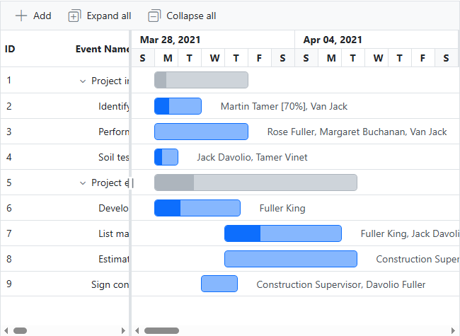
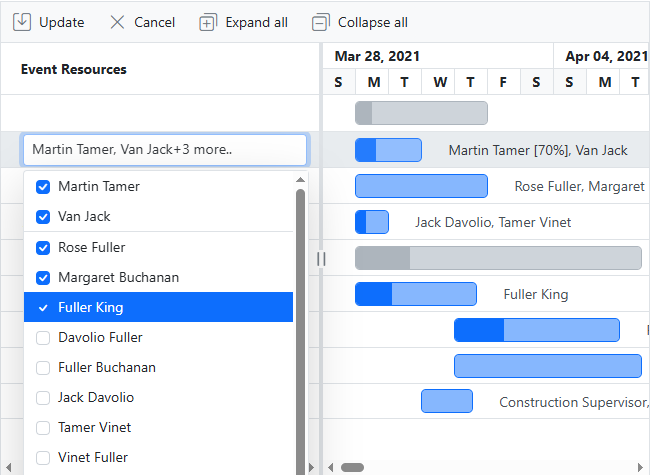
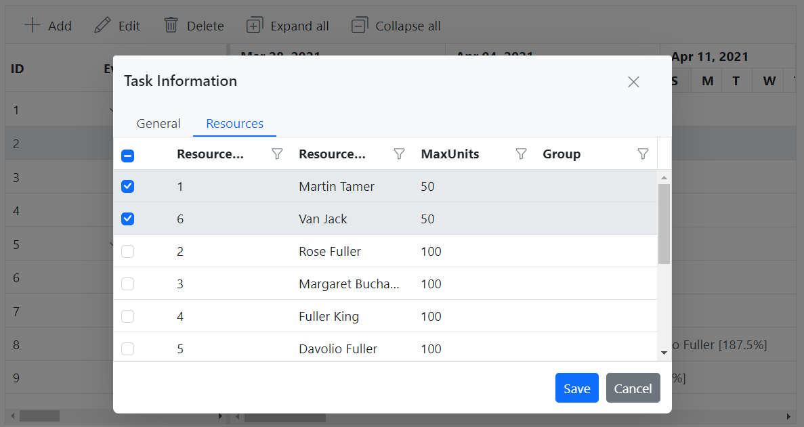
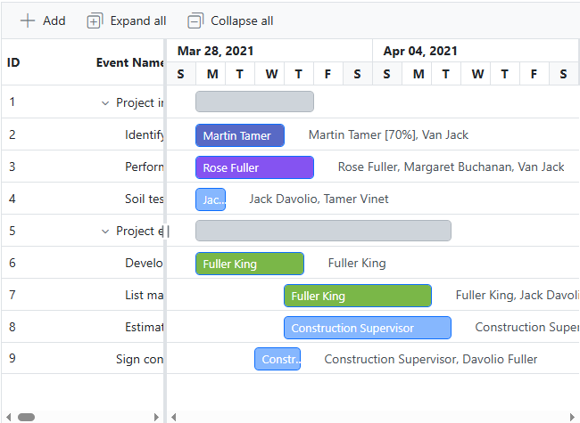

# Resources in Blazor Gantt Chart Component

In [Blazor Gantt Chart](https://www.syncfusion.com/blazor-components/blazor-gantt-chart), the resources are represented by staff, equipment, materials, etc. In the Gantt Chart component, you can show or allocate the resources (human resources) for each task.

## Binding data source for resource collection and assigning resource to tasks

Resources are a list of `TResources` objects that contain id, name, max unit and group of the resources, and this collection is mapped to the Gantt Chart component using the [DataSource](https://help.syncfusion.com/cr/blazor/Syncfusion.Blazor.Gantt.GanttResource-1.html#Syncfusion_Blazor_Gantt_GanttResource_1_DataSource) property in [GanttResource](https://help.syncfusion.com/cr/blazor/Syncfusion.Blazor.Gantt.GanttResource-1.html). The following code snippets show resource collection and how it is assigned to the Gantt Chart component. 

The [DataSource](https://help.syncfusion.com/cr/blazor/Syncfusion.Blazor.Gantt.GanttAssignmentFields-1.html#Syncfusion_Blazor_Gantt_GanttAssignmentFields_1_DataSource) property of the [GanttAssignmentFields](https://help.syncfusion.com/cr/blazor/Syncfusion.Blazor.Gantt.GanttAssignmentFields-1.html) component is vital for defining the resource assignment data source collection in a Blazor Gantt chart. It's crucial to structure this collection thoughtfully to establish a strong foreign key relationship. This involves linking the [TaskId](https://help.syncfusion.com/cr/blazor/Syncfusion.Blazor.Gantt.GanttAssignmentFields-1.html#Syncfusion_Blazor_Gantt_GanttAssignmentFields_1_TaskId) and [ResourceId](https://help.syncfusion.com/cr/blazor/Syncfusion.Blazor.Gantt.GanttAssignmentFields-1.html#Syncfusion_Blazor_Gantt_GanttAssignmentFields_1_ResourceId) properties of `GanttAssignmentFields` with the [ID](https://help.syncfusion.com/cr/blazor/Syncfusion.Blazor.Gantt.GanttTaskFields.html#Syncfusion_Blazor_Gantt_GanttTaskFields_Id) property value of [GanttTaskFields](https://help.syncfusion.com/cr/blazor/Syncfusion.Blazor.Gantt.GanttTaskFields.html) for tasks and the [Id](https://help.syncfusion.com/cr/blazor/Syncfusion.Blazor.Gantt.GanttResource-1.html#Syncfusion_Blazor_Gantt_GanttResource_1_Id) property of `GanttResource` for resources. By establishing these connections, the Gantt chart can efficiently manage resource assignments in individual task.

```cshtml
@using Syncfusion.Blazor.Gantt

<SfGantt DataSource="@TaskCollection" Height="450px" Width="100%" TreeColumnIndex="1" ProjectStartDate="@ProjectStart" ProjectEndDate="@ProjectEnd" WorkUnit="WorkUnit.Hour"
            Toolbar="@(new List<string>(){ "Add", "Edit", "Update", "Delete", "Cancel", "ExpandAll", "CollapseAll"})">
    <GanttTaskFields Id="Id" Name="Name" StartDate="StartDate" EndDate="EndDate" Duration="Duration" Progress="Progress"
                        ParentID="ParentId" Work="Work" TaskType="TaskType">
    </GanttTaskFields>
    <GanttEditSettings AllowAdding="true" AllowEditing="true" AllowDeleting="true" AllowTaskbarEditing="true"
                        ShowDeleteConfirmDialog="true"></GanttEditSettings>
    <GanttColumns>
        <GanttColumn Field="Id" HeaderText="ID"></GanttColumn>
        <GanttColumn Field="Name" HeaderText="Event Name" ClipMode="Syncfusion.Blazor.Grids.ClipMode.EllipsisWithTooltip"></GanttColumn>
        <GanttResourceColumn HeaderText="Event Resources"></GanttResourceColumn>
        <GanttColumn Field="Work" HeaderText="Work"></GanttColumn>
        <GanttColumn Field="Duration" HeaderText="Duration"></GanttColumn>
        <GanttColumn Field="TaskType" HeaderText="Task Type"></GanttColumn>
        <GanttColumn Field="StartDate" HeaderText="Start Date"></GanttColumn>
        <GanttColumn Field="EndDate" HeaderText="End Date"></GanttColumn>
    </GanttColumns>
    <GanttResource DataSource="ResourceCollection" Id="Id" Name="Name" MaxUnits="MaxUnit" TValue="TaskInfoModel" TResources="ResourceInfoModel"></GanttResource>
    <GanttAssignmentFields DataSource="AssignmentCollection" PrimaryKey="PrimaryId" TaskID="TaskId" ResourceID="ResourceId" Units="Unit" TValue="TaskInfoModel" TAssignment="AssignmentModel"></GanttAssignmentFields>
    <GanttLabelSettings RightLabel="Resources" TValue="TaskInfoModel"></GanttLabelSettings>
    <GanttSplitterSettings Position="28%"> </GanttSplitterSettings>
</SfGantt>

@code {
    private DateTime ProjectStart = new DateTime(2021, 3, 28);
    private DateTime ProjectEnd = new DateTime(2021, 7, 28);
    private List<TaskInfoModel> TaskCollection { get; set; } = new();
    private List<ResourceInfoModel> ResourceCollection { get; set; } = new();
    private static List<AssignmentModel> AssignmentCollection { get; set; } = new();
    protected override void OnInitialized()
    {
        TaskCollection = GetTaskCollection();
        ResourceCollection = GetResources;
        AssignmentCollection = GetAssignmentCollection();
    }
        
    public class ResourceInfoModel
    {
        public int Id { get; set; }
        public string? Name { get; set; }
        public double MaxUnit { get; set; }
    }
   
    public class TaskInfoModel
    {
        public int Id { get; set; }
        public string? Name { get; set; }
        public string? TaskType { get; set; }
        public DateTime StartDate { get; set; }
        public DateTime? EndDate { get; set; }
        public string? Duration { get; set; }
        public int Progress { get; set; }
        public int? ParentId { get; set; }
        public double? Work { get; set; }
    }

    public class AssignmentModel
    {
        public int PrimaryId { get; set; }
        public int TaskId { get; set; }
        public int ResourceId { get; set; }
        public double Unit { get; set; }
    }

    public static List<ResourceInfoModel> GetResources = new List<ResourceInfoModel>()
    {
        new ResourceInfoModel() { Id= 1, Name= "Martin Tamer" ,MaxUnit=70},
        new ResourceInfoModel() { Id= 2, Name= "Rose Fuller" },
        new ResourceInfoModel() { Id= 3, Name= "Margaret Buchanan" },
        new ResourceInfoModel() { Id= 4, Name= "Fuller King", MaxUnit = 100},
        new ResourceInfoModel() { Id= 5, Name= "Davolio Fuller" },
        new ResourceInfoModel() { Id= 6, Name= "Van Jack" },
        new ResourceInfoModel() { Id= 7, Name= "Fuller Buchanan" },
        new ResourceInfoModel() { Id= 8, Name= "Jack Davolio" },
        new ResourceInfoModel() { Id= 9, Name= "Tamer Vinet" },
        new ResourceInfoModel() { Id= 10, Name= "Vinet Fuller" },
        new ResourceInfoModel() { Id= 11, Name= "Bergs Anton" },
        new ResourceInfoModel() { Id= 12, Name= "Construction Supervisor" }
    };

    public static List<AssignmentModel> GetAssignmentCollection()
    {
        List<AssignmentModel> assignments = new List<AssignmentModel>()
        {
            new AssignmentModel(){ PrimaryId=1, TaskId = 2 , ResourceId=1, Unit=70},
            new AssignmentModel(){ PrimaryId=2, TaskId = 2 , ResourceId=6},
            new AssignmentModel(){ PrimaryId=3, TaskId = 3 , ResourceId=2},
            new AssignmentModel(){ PrimaryId=4, TaskId = 3 , ResourceId=3},
            new AssignmentModel(){ PrimaryId=5, TaskId = 3 , ResourceId=6},
            new AssignmentModel(){ PrimaryId=6, TaskId = 4 , ResourceId=8},
            new AssignmentModel(){ PrimaryId=7, TaskId = 4 , ResourceId=9},
            new AssignmentModel(){ PrimaryId=8, TaskId = 6 , ResourceId=4},
            new AssignmentModel(){ PrimaryId=9, TaskId = 7 , ResourceId=4},
            new AssignmentModel(){ PrimaryId=10, TaskId = 7 , ResourceId=8},
            new AssignmentModel(){ PrimaryId=11, TaskId = 8 , ResourceId=12},
            new AssignmentModel(){ PrimaryId=12, TaskId = 8 , ResourceId=5},
            new AssignmentModel(){ PrimaryId=13, TaskId = 9 , ResourceId=12},
            new AssignmentModel(){ PrimaryId=14, TaskId = 9 , ResourceId=5}
        };
        return assignments;
    }

    public static List<TaskInfoModel> GetTaskCollection()
    {
        List<TaskInfoModel> Tasks = new List<TaskInfoModel>()
        {
            new TaskInfoModel() {
                Id = 1,
                Name = "Project initiation",
                StartDate = new DateTime(2021, 03, 28),
                EndDate = new DateTime(2021, 07, 28),
                TaskType ="FixedDuration",
                Work=128,
                Duration="4"
            },
            new TaskInfoModel() {
                Id = 2,
                Name = "Identify site location",
                StartDate = new DateTime(2021, 03, 29),
                Progress = 30,
                ParentId = 1,
                Duration="2",
                TaskType ="FixedDuration",
                Work=16,
            },
            new TaskInfoModel() {
                Id = 3,
                Name = "Perform soil test",
                StartDate = new DateTime(2021, 03, 29),
                ParentId = 1,
                Work=96,
                Duration="4",
                TaskType="FixedWork"
            },
            new TaskInfoModel() {
                Id = 4,
                Name = "Soil test approval",
                StartDate = new DateTime(2021, 03, 29),
                Duration = "1",
                Progress = 30,
                ParentId = 1,
                Work=16,
                TaskType="FixedWork"
            },
            new TaskInfoModel() {
                Id = 5,
                Name = "Project estimation",
                StartDate = new DateTime(2021, 03, 29),
                EndDate = new DateTime(2021, 04, 2),
                TaskType="FixedDuration",
                Duration="4"
            },
            new TaskInfoModel() {
                Id = 6,
                Name = "Develop floor plan for estimation",
                StartDate = new DateTime(2021, 03, 29),
                Duration = "3",
                Progress = 30,
                ParentId = 5,
                Work=30,
                TaskType="FixedWork"
            },
            new TaskInfoModel() {
                Id = 7,
                Name = "List materials",
                StartDate = new DateTime(2021, 04, 01),
                Duration = "3",
                Progress = 30,
                ParentId = 5,
                TaskType="FixedWork",
                Work=48,
            },
            new TaskInfoModel() {
                Id = 8,
                Name = "Estimation approval",
                StartDate = new DateTime(2021, 04, 01),
                Duration = "2",
                ParentId = 5,
                Work=60,
                TaskType="FixedWork",
            },
            new TaskInfoModel() {
                Id = 9,
                Name = "Sign contract",
                StartDate = new DateTime(2021, 03, 31),
                EndDate = new DateTime(2021, 04, 01),
                Duration="1",
                TaskType="FixedWork",
                Work=24,
            },
        };
        return Tasks;
    }
}
```


## Resource unit

When the resource unit is defined in the resource collection, it indicates that the amount of work done by a particular resource remains consistent across all tasks. This concept applies to both the [Units](https://help.syncfusion.com/cr/blazor/Syncfusion.Blazor.Gantt.GanttAssignmentFields-1.html#Syncfusion_Blazor_Gantt_GanttAssignmentFields_1_Units) and [MaxUnits](https://help.syncfusion.com/cr/blazor/Syncfusion.Blazor.Gantt.GanttResource-1.html#Syncfusion_Blazor_Gantt_GanttResource_1_MaxUnits) properties in resource allocation. The `Units` property represents the quantity of work done by the resource for a specific task, while the `MaxUnits` property defines the maximum capacity or availability of that resource.

To illustrate this concept, the following code snippet demonstrates how to assign resources to specific tasks and map them in the Gantt chart, providing a clear overview of how resource units and maximum capacities are managed in task allocation. For more detailed information about work and resource units, you can refer to the [documentation link](https://blazor.syncfusion.com/documentation/gantt-chart/work).

```cshtml
@using Syncfusion.Blazor.Gantt

<SfGantt DataSource="@TaskCollection" Height="450px" Width="100%" TreeColumnIndex="1" ProjectStartDate="@ProjectStart" ProjectEndDate="@ProjectEnd" WorkUnit="WorkUnit.Hour"
            Toolbar="@(new List<string>(){ "Add", "Edit", "Update", "Delete", "Cancel", "ExpandAll", "CollapseAll"})">
    <GanttTaskFields Id="Id" Name="Name" StartDate="StartDate" EndDate="EndDate" Duration="Duration" Progress="Progress"
                        ParentID="ParentId" Work="Work" TaskType="TaskType">
    </GanttTaskFields>
    <GanttEditSettings AllowAdding="true" AllowEditing="true" AllowDeleting="true" AllowTaskbarEditing="true"
                        ShowDeleteConfirmDialog="true"></GanttEditSettings>
    <GanttColumns>
        <GanttColumn Field="Id" HeaderText="ID"></GanttColumn>
        <GanttColumn Field="Name" HeaderText="Event Name" ClipMode="Syncfusion.Blazor.Grids.ClipMode.EllipsisWithTooltip"></GanttColumn>
        <GanttResourceColumn HeaderText="Event Resources"></GanttResourceColumn>
        <GanttColumn Field="Work" HeaderText="Work"></GanttColumn>
        <GanttColumn Field="Duration" HeaderText="Duration"></GanttColumn>
        <GanttColumn Field="TaskType" HeaderText="Task Type"></GanttColumn>
        <GanttColumn Field="StartDate" HeaderText="Start Date"></GanttColumn>
        <GanttColumn Field="EndDate" HeaderText="End Date"></GanttColumn>
    </GanttColumns>
    <GanttResource DataSource="ResourceCollection" Id="Id" Name="Name" MaxUnits="MaxUnit" TValue="TaskInfoModel" TResources="ResourceInfoModel"></GanttResource>
    <GanttAssignmentFields DataSource="AssignmentCollection" PrimaryKey="PrimaryId" TaskID="TaskId" ResourceID="ResourceId" Units="Unit" TValue="TaskInfoModel" TAssignment="AssignmentModel"></GanttAssignmentFields>
    <GanttLabelSettings RightLabel="Resources" TValue="TaskInfoModel"></GanttLabelSettings>
    <GanttSplitterSettings Position="28%"> </GanttSplitterSettings>
</SfGantt>

@code {
    private DateTime ProjectStart = new DateTime(2021, 3, 28);
    private DateTime ProjectEnd = new DateTime(2021, 7, 28);
    private List<TaskInfoModel> TaskCollection { get; set; } = new();
    private List<ResourceInfoModel> ResourceCollection { get; set; } = new();
    private static List<AssignmentModel> AssignmentCollection { get; set; } = new();
    protected override void OnInitialized()
    {
        TaskCollection = GetTaskCollection();
        ResourceCollection = GetResources;
        AssignmentCollection = GetAssignmentCollection();
    }
        
    public class ResourceInfoModel
    {
        public int Id { get; set; }
        public string? Name { get; set; }
        public double MaxUnit { get; set; }
    }
   
    public class TaskInfoModel
    {
        public int Id { get; set; }
        public string? Name { get; set; }
        public string? TaskType { get; set; }
        public DateTime StartDate { get; set; }
        public DateTime? EndDate { get; set; }
        public string? Duration { get; set; }
        public int Progress { get; set; }
        public int? ParentId { get; set; }
        public double? Work { get; set; }
    }

    public class AssignmentModel
    {
        public int PrimaryId { get; set; }
        public int TaskId { get; set; }
        public int ResourceId { get; set; }
        public double Unit { get; set; }
    }

    public static List<ResourceInfoModel> GetResources = new List<ResourceInfoModel>()
    {
        new ResourceInfoModel() { Id= 1, Name= "Martin Tamer" ,MaxUnit=70},
        new ResourceInfoModel() { Id= 2, Name= "Rose Fuller" },
        new ResourceInfoModel() { Id= 3, Name= "Margaret Buchanan" },
        new ResourceInfoModel() { Id= 4, Name= "Fuller King", MaxUnit = 100},
        new ResourceInfoModel() { Id= 5, Name= "Davolio Fuller" },
        new ResourceInfoModel() { Id= 6, Name= "Van Jack" },
        new ResourceInfoModel() { Id= 7, Name= "Fuller Buchanan" },
        new ResourceInfoModel() { Id= 8, Name= "Jack Davolio" },
        new ResourceInfoModel() { Id= 9, Name= "Tamer Vinet" },
        new ResourceInfoModel() { Id= 10, Name= "Vinet Fuller" },
        new ResourceInfoModel() { Id= 11, Name= "Bergs Anton" },
        new ResourceInfoModel() { Id= 12, Name= "Construction Supervisor" }
    };

    public static List<AssignmentModel> GetAssignmentCollection()
    {
        List<AssignmentModel> assignments = new List<AssignmentModel>()
        {
            new AssignmentModel(){ PrimaryId=1, TaskId = 2 , ResourceId=1, Unit=70},
            new AssignmentModel(){ PrimaryId=2, TaskId = 2 , ResourceId=6},
            new AssignmentModel(){ PrimaryId=3, TaskId = 3 , ResourceId=2},
            new AssignmentModel(){ PrimaryId=4, TaskId = 3 , ResourceId=3},
            new AssignmentModel(){ PrimaryId=5, TaskId = 3 , ResourceId=6},
            new AssignmentModel(){ PrimaryId=6, TaskId = 4 , ResourceId=8},
            new AssignmentModel(){ PrimaryId=7, TaskId = 4 , ResourceId=9},
            new AssignmentModel(){ PrimaryId=8, TaskId = 6 , ResourceId=4},
            new AssignmentModel(){ PrimaryId=9, TaskId = 7 , ResourceId=4},
            new AssignmentModel(){ PrimaryId=10, TaskId = 7 , ResourceId=8},
            new AssignmentModel(){ PrimaryId=11, TaskId = 8 , ResourceId=12},
            new AssignmentModel(){ PrimaryId=12, TaskId = 8 , ResourceId=5},
            new AssignmentModel(){ PrimaryId=13, TaskId = 9 , ResourceId=12},
            new AssignmentModel(){ PrimaryId=14, TaskId = 9 , ResourceId=5}
        };
        return assignments;
    }

    public static List<TaskInfoModel> GetTaskCollection()
    {
        List<TaskInfoModel> Tasks = new List<TaskInfoModel>()
        {
            new TaskInfoModel() {
                Id = 1,
                Name = "Project initiation",
                StartDate = new DateTime(2021, 03, 28),
                EndDate = new DateTime(2021, 07, 28),
                TaskType ="FixedDuration",
                Work=128,
                Duration="4"
            },
            new TaskInfoModel() {
                Id = 2,
                Name = "Identify site location",
                StartDate = new DateTime(2021, 03, 29),
                Progress = 30,
                ParentId = 1,
                Duration="2",
                TaskType ="FixedDuration",
                Work=16,
            },
            new TaskInfoModel() {
                Id = 3,
                Name = "Perform soil test",
                StartDate = new DateTime(2021, 03, 29),
                ParentId = 1,
                Work=96,
                Duration="4",
                TaskType="FixedWork"
            },
            new TaskInfoModel() {
                Id = 4,
                Name = "Soil test approval",
                StartDate = new DateTime(2021, 03, 29),
                Duration = "1",
                Progress = 30,
                ParentId = 1,
                Work=16,
                TaskType="FixedWork"
            },
            new TaskInfoModel() {
                Id = 5,
                Name = "Project estimation",
                StartDate = new DateTime(2021, 03, 29),
                EndDate = new DateTime(2021, 04, 2),
                TaskType="FixedDuration",
                Duration="4"
            },
            new TaskInfoModel() {
                Id = 6,
                Name = "Develop floor plan for estimation",
                StartDate = new DateTime(2021, 03, 29),
                Duration = "3",
                Progress = 30,
                ParentId = 5,
                Work=30,
                TaskType="FixedWork"
            },
            new TaskInfoModel() {
                Id = 7,
                Name = "List materials",
                StartDate = new DateTime(2021, 04, 01),
                Duration = "3",
                Progress = 30,
                ParentId = 5,
                TaskType="FixedWork",
                Work=48,
            },
            new TaskInfoModel() {
                Id = 8,
                Name = "Estimation approval",
                StartDate = new DateTime(2021, 04, 01),
                Duration = "2",
                ParentId = 5,
                Work=60,
                TaskType="FixedWork",
            },
            new TaskInfoModel() {
                Id = 9,
                Name = "Sign contract",
                StartDate = new DateTime(2021, 03, 31),
                EndDate = new DateTime(2021, 04, 01),
                Duration="1",
                TaskType="FixedWork",
                Work=24,
            },
        };
        return Tasks;
    }
}
```

## Managing resources assignments in project view

In the Gantt Chart, you can enable dynamic resources assignments by setting the [AllowEditing](https://help.syncfusion.com/cr/blazor/Syncfusion.Blazor.Gantt.GanttEditSettings.html#Syncfusion_Blazor_Gantt_GanttEditSettings_AllowEditing) properties to true in the [GanttEditSettings](https://help.syncfusion.com/cr/blazor/Syncfusion.Blazor.Gantt.GanttEditSettings.html) component. When editing resources, it's essential to bind the `GanttResource` and `GanttAssignmentFields` within the SfGantt component for a comprehensive resource management process. Task resources can be dynamically added, removed, and updated. Additionally, these actions can be performed using the following three methods:

### Through cell edit

To edit resources directly through [cell editing](https://blazor.syncfusion.com/documentation/gantt-chart/editing-tasks#cell-editing), you can use the [GanttResourceColumn](https://help.syncfusion.com/cr/blazor/Syncfusion.Blazor.Gantt.GanttResourceColumn.html) within the [GanttColumns](https://help.syncfusion.com/cr/blazor/Syncfusion.Blazor.Gantt.GanttColumns.html) of the Blazor Gantt Chart. The image below demonstrates the cell edit functionality in the Gantt chart.

```cshtml
@using Syncfusion.Blazor.Gantt

<SfGantt DataSource="@TaskCollection" Height="450px" Width="100%" TreeColumnIndex="1" ProjectStartDate="@ProjectStart" ProjectEndDate="@ProjectEnd" WorkUnit="WorkUnit.Hour"
         Toolbar="@(new List<string>(){ "Add", "Edit", "Update", "Delete", "Cancel", "ExpandAll", "CollapseAll"})">
    <GanttTaskFields Id="Id" Name="Name" StartDate="StartDate" EndDate="EndDate" Duration="Duration" Progress="Progress"
                     ParentID="ParentId" Work="Work" TaskType="TaskType">
    </GanttTaskFields>
    <GanttEditSettings AllowAdding="true" AllowEditing="true" AllowDeleting="true" AllowTaskbarEditing="true"
                       ShowDeleteConfirmDialog="true"></GanttEditSettings>
    <GanttColumns>
        <GanttColumn Field="Id" HeaderText="ID"></GanttColumn>
        <GanttColumn Field="Name" HeaderText="Event Name" ClipMode="Syncfusion.Blazor.Grids.ClipMode.EllipsisWithTooltip"></GanttColumn>
        <GanttResourceColumn HeaderText="Event Resources"></GanttResourceColumn>
        <GanttColumn Field="Work" HeaderText="Work"></GanttColumn>
        <GanttColumn Field="Duration" HeaderText="Duration"></GanttColumn>
        <GanttColumn Field="TaskType" HeaderText="Task Type"></GanttColumn>
        <GanttColumn Field="StartDate" HeaderText="Start Date"></GanttColumn>
        <GanttColumn Field="EndDate" HeaderText="End Date"></GanttColumn>
    </GanttColumns>
    <GanttResource DataSource="ResourceCollection" Id="Id" Name="Name" MaxUnits="MaxUnit" TValue="TaskInfoModel" TResources="ResourceInfoModel"></GanttResource>
    <GanttAssignmentFields DataSource="AssignmentCollection" PrimaryKey="PrimaryId" TaskID="TaskId" ResourceID="ResourceId" Units="Unit" TValue="TaskInfoModel" TAssignment="AssignmentModel"></GanttAssignmentFields>
    <GanttLabelSettings RightLabel="Resources" TValue="TaskInfoModel"></GanttLabelSettings>
    <GanttSplitterSettings Position="28%"> </GanttSplitterSettings>
</SfGantt>

@code {
    private DateTime ProjectStart = new DateTime(2021, 3, 28);
    private DateTime ProjectEnd = new DateTime(2021, 7, 28);
    private List<TaskInfoModel> TaskCollection { get; set; } = new();
    private List<ResourceInfoModel> ResourceCollection { get; set; } = new();
    private static List<AssignmentModel> AssignmentCollection { get; set; } = new();
    protected override void OnInitialized()
    {
        TaskCollection = GetTaskCollection();
        ResourceCollection = GetResources;
        AssignmentCollection = GetAssignmentCollection();
    }

    public class ResourceInfoModel
    {
        public int Id { get; set; }
        public string? Name { get; set; }
        public double MaxUnit { get; set; }
    }

    public class TaskInfoModel
    {
        public int Id { get; set; }
        public string? Name { get; set; }
        public string? TaskType { get; set; }
        public DateTime StartDate { get; set; }
        public DateTime? EndDate { get; set; }
        public string? Duration { get; set; }
        public int Progress { get; set; }
        public int? ParentId { get; set; }
        public double? Work { get; set; }
    }

    public class AssignmentModel
    {
        public int PrimaryId { get; set; }
        public int TaskId { get; set; }
        public int ResourceId { get; set; }
        public double Unit { get; set; }
    }

    public static List<ResourceInfoModel> GetResources = new List<ResourceInfoModel>()
    {
        new ResourceInfoModel() { Id= 1, Name= "Martin Tamer" ,MaxUnit=70},
        new ResourceInfoModel() { Id= 2, Name= "Rose Fuller" },
        new ResourceInfoModel() { Id= 3, Name= "Margaret Buchanan" },
        new ResourceInfoModel() { Id= 4, Name= "Fuller King", MaxUnit = 100},
        new ResourceInfoModel() { Id= 5, Name= "Davolio Fuller" },
        new ResourceInfoModel() { Id= 6, Name= "Van Jack" },
        new ResourceInfoModel() { Id= 7, Name= "Fuller Buchanan" },
        new ResourceInfoModel() { Id= 8, Name= "Jack Davolio" },
        new ResourceInfoModel() { Id= 9, Name= "Tamer Vinet" },
        new ResourceInfoModel() { Id= 10, Name= "Vinet Fuller" },
        new ResourceInfoModel() { Id= 11, Name= "Bergs Anton" },
        new ResourceInfoModel() { Id= 12, Name= "Construction Supervisor" }
    };

    public static List<AssignmentModel> GetAssignmentCollection()
    {
        List<AssignmentModel> assignments = new List<AssignmentModel>()
        {
            new AssignmentModel(){ PrimaryId=1, TaskId = 2 , ResourceId=1, Unit=70},
            new AssignmentModel(){ PrimaryId=2, TaskId = 2 , ResourceId=6},
            new AssignmentModel(){ PrimaryId=3, TaskId = 3 , ResourceId=2},
            new AssignmentModel(){ PrimaryId=4, TaskId = 3 , ResourceId=3},
            new AssignmentModel(){ PrimaryId=5, TaskId = 3 , ResourceId=6},
            new AssignmentModel(){ PrimaryId=6, TaskId = 4 , ResourceId=8},
            new AssignmentModel(){ PrimaryId=7, TaskId = 4 , ResourceId=9},
            new AssignmentModel(){ PrimaryId=8, TaskId = 6 , ResourceId=4},
            new AssignmentModel(){ PrimaryId=9, TaskId = 7 , ResourceId=4},
            new AssignmentModel(){ PrimaryId=10, TaskId = 7 , ResourceId=8},
            new AssignmentModel(){ PrimaryId=11, TaskId = 8 , ResourceId=12},
            new AssignmentModel(){ PrimaryId=12, TaskId = 8 , ResourceId=5},
            new AssignmentModel(){ PrimaryId=13, TaskId = 9 , ResourceId=12},
            new AssignmentModel(){ PrimaryId=14, TaskId = 9 , ResourceId=5}
        };
        return assignments;
    }

    public static List<TaskInfoModel> GetTaskCollection()
    {
        List<TaskInfoModel> Tasks = new List<TaskInfoModel>()
        {
            new TaskInfoModel() {
                Id = 1,
                Name = "Project initiation",
                StartDate = new DateTime(2021, 03, 28),
                EndDate = new DateTime(2021, 07, 28),
                TaskType ="FixedDuration",
                Work=128,
                Duration="4"
            },
            new TaskInfoModel() {
                Id = 2,
                Name = "Identify site location",
                StartDate = new DateTime(2021, 03, 29),
                Progress = 30,
                ParentId = 1,
                Duration="2",
                TaskType ="FixedDuration",
                Work=16,
            },
            new TaskInfoModel() {
                Id = 3,
                Name = "Perform soil test",
                StartDate = new DateTime(2021, 03, 29),
                ParentId = 1,
                Work=96,
                Duration="4",
                TaskType="FixedWork"
            },
            new TaskInfoModel() {
                Id = 4,
                Name = "Soil test approval",
                StartDate = new DateTime(2021, 03, 29),
                Duration = "1",
                Progress = 30,
                ParentId = 1,
                Work=16,
                TaskType="FixedWork"
            },
            new TaskInfoModel() {
                Id = 5,
                Name = "Project estimation",
                StartDate = new DateTime(2021, 03, 29),
                EndDate = new DateTime(2021, 04, 2),
                TaskType="FixedDuration",
                Duration="4"
            },
            new TaskInfoModel() {
                Id = 6,
                Name = "Develop floor plan for estimation",
                StartDate = new DateTime(2021, 03, 29),
                Duration = "3",
                Progress = 30,
                ParentId = 5,
                Work=30,
                TaskType="FixedWork"
            },
            new TaskInfoModel() {
                Id = 7,
                Name = "List materials",
                StartDate = new DateTime(2021, 04, 01),
                Duration = "3",
                Progress = 30,
                ParentId = 5,
                TaskType="FixedWork",
                Work=48,
            },
            new TaskInfoModel() {
                Id = 8,
                Name = "Estimation approval",
                StartDate = new DateTime(2021, 04, 01),
                Duration = "2",
                ParentId = 5,
                Work=60,
                TaskType="FixedWork",
            },
            new TaskInfoModel() {
                Id = 9,
                Name = "Sign contract",
                StartDate = new DateTime(2021, 03, 31),
                EndDate = new DateTime(2021, 04, 01),
                Duration="1",
                TaskType="FixedWork",
                Work=24,
            },
        };
        return Tasks;
    }
}
```


### Through dialog box

In the resource tab of the [add/edit dialog box](https://blazor.syncfusion.com/documentation/gantt-chart/editing-tasks#dialog-editing) within the Gantt chart, resources can be both added and removed. Additionally, the resource tab allows editing the unit value for individual resources. When editing resources through the dialog box, it's essential to bind the `GanttResource` and `GanttAssignmentFields` within the `SfGantt` component for a comprehensive resource management process. 

```cshtml
@using Syncfusion.Blazor.Gantt
@using System.ComponentModel.DataAnnotations

<SfGantt DataSource="@TaskCollection" Height="450px" Width="850px" TreeColumnIndex="1" ProjectStartDate="@ProjectStart" ProjectEndDate="@ProjectEnd" WorkUnit="WorkUnit.Hour"
         Toolbar="@(new List<string>(){ "Add", "Edit", "Update", "Delete", "Cancel", "ExpandAll", "CollapseAll"})">
    <GanttTaskFields Id="Id" Name="Name" StartDate="StartDate" EndDate="EndDate" Duration="Duration" Progress="Progress"
                     ParentID="ParentId" Work="Work" TaskType="TaskType">
    </GanttTaskFields>
    <GanttEditSettings AllowAdding="true" AllowEditing="true" AllowDeleting="true" AllowTaskbarEditing="true"
                       ShowDeleteConfirmDialog="true"></GanttEditSettings>
    <GanttColumns>
        <GanttColumn Field="Id" HeaderText="ID"></GanttColumn>
        <GanttColumn Field="Name" HeaderText="Event Name" ClipMode="Syncfusion.Blazor.Grids.ClipMode.EllipsisWithTooltip"></GanttColumn>
        <GanttResourceColumn HeaderText="Event Resources"></GanttResourceColumn>
        <GanttColumn Field="Work" HeaderText="Work"></GanttColumn>
        <GanttColumn Field="Duration" HeaderText="Duration"></GanttColumn>
        <GanttColumn Field="TaskType" HeaderText="Task Type"></GanttColumn>
        <GanttColumn Field="StartDate" HeaderText="Start Date"></GanttColumn>
        <GanttColumn Field="EndDate" HeaderText="End Date"></GanttColumn>
    </GanttColumns>
    <GanttResource DataSource="ResourceCollection" Id="Id" Name="Name" MaxUnits="MaxUnit" TValue="TaskInfoModel" TResources="ResourceInfoModel"></GanttResource>
    <GanttAssignmentFields DataSource="AssignmentCollection" PrimaryKey="PrimaryId" TaskID="TaskId" ResourceID="ResourceId" Units="Unit" TValue="TaskInfoModel" TAssignment="AssignmentModel"></GanttAssignmentFields>
    <GanttLabelSettings RightLabel="Resources" TValue="TaskInfoModel"></GanttLabelSettings>
    <GanttSplitterSettings Position="28%"> </GanttSplitterSettings>
</SfGantt>

@code {
    private DateTime ProjectStart = new DateTime(2021, 3, 28);
    private DateTime ProjectEnd = new DateTime(2021, 7, 28);
    private List<TaskInfoModel> TaskCollection { get; set; } = new();
    private List<ResourceInfoModel> ResourceCollection { get; set; } = new();
    private static List<AssignmentModel> AssignmentCollection { get; set; } = new();
    protected override void OnInitialized()
    {
        TaskCollection = GetTaskCollection();
        ResourceCollection = GetResources;
        AssignmentCollection = GetAssignmentCollection();
    }

    public class ResourceInfoModel
    {
        [Display(Name ="Resource Id")]
        public int Id { get; set; }
        [Display(ShortName ="Resource Name")]
        public string? Name { get; set; }
        [Display(ShortName = "MaxUnits")]
        public double MaxUnit { get; set; }
    }

    public class TaskInfoModel
    {
        public int Id { get; set; }
        public string? Name { get; set; }
        public string? TaskType { get; set; }
        public DateTime StartDate { get; set; }
        public DateTime? EndDate { get; set; }
        public string? Duration { get; set; }
        public int Progress { get; set; }
        public int? ParentId { get; set; }
        public double? Work { get; set; }
    }

    public class AssignmentModel
    {
        public int PrimaryId { get; set; }
        public int TaskId { get; set; }
        public int ResourceId { get; set; }
        public double Unit { get; set; }
    }

    public static List<ResourceInfoModel> GetResources = new List<ResourceInfoModel>()
    {
        new ResourceInfoModel() { Id= 1, Name= "Martin Tamer" ,MaxUnit=70},
        new ResourceInfoModel() { Id= 2, Name= "Rose Fuller" },
        new ResourceInfoModel() { Id= 3, Name= "Margaret Buchanan" },
        new ResourceInfoModel() { Id= 4, Name= "Fuller King", MaxUnit = 100},
        new ResourceInfoModel() { Id= 5, Name= "Davolio Fuller" },
        new ResourceInfoModel() { Id= 6, Name= "Van Jack" },
        new ResourceInfoModel() { Id= 7, Name= "Fuller Buchanan" },
        new ResourceInfoModel() { Id= 8, Name= "Jack Davolio" },
        new ResourceInfoModel() { Id= 9, Name= "Tamer Vinet" },
        new ResourceInfoModel() { Id= 10, Name= "Vinet Fuller" },
        new ResourceInfoModel() { Id= 11, Name= "Bergs Anton" },
        new ResourceInfoModel() { Id= 12, Name= "Construction Supervisor" }
    };

    public static List<AssignmentModel> GetAssignmentCollection()
    {
        List<AssignmentModel> assignments = new List<AssignmentModel>()
        {
            new AssignmentModel(){ PrimaryId=1, TaskId = 2 , ResourceId=1, Unit=70},
            new AssignmentModel(){ PrimaryId=2, TaskId = 2 , ResourceId=6},
            new AssignmentModel(){ PrimaryId=3, TaskId = 3 , ResourceId=2},
            new AssignmentModel(){ PrimaryId=4, TaskId = 3 , ResourceId=3},
            new AssignmentModel(){ PrimaryId=5, TaskId = 3 , ResourceId=6},
            new AssignmentModel(){ PrimaryId=6, TaskId = 4 , ResourceId=8},
            new AssignmentModel(){ PrimaryId=7, TaskId = 4 , ResourceId=9},
            new AssignmentModel(){ PrimaryId=8, TaskId = 6 , ResourceId=4},
            new AssignmentModel(){ PrimaryId=9, TaskId = 7 , ResourceId=4},
            new AssignmentModel(){ PrimaryId=10, TaskId = 7 , ResourceId=8},
            new AssignmentModel(){ PrimaryId=11, TaskId = 8 , ResourceId=12},
            new AssignmentModel(){ PrimaryId=12, TaskId = 8 , ResourceId=5},
            new AssignmentModel(){ PrimaryId=13, TaskId = 9 , ResourceId=12},
            new AssignmentModel(){ PrimaryId=14, TaskId = 9 , ResourceId=5}
        };
        return assignments;
    }

    public static List<TaskInfoModel> GetTaskCollection()
    {
        List<TaskInfoModel> Tasks = new List<TaskInfoModel>()
        {
            new TaskInfoModel() {
                Id = 1,
                Name = "Project initiation",
                StartDate = new DateTime(2021, 03, 28),
                EndDate = new DateTime(2021, 07, 28),
                TaskType ="FixedDuration",
                Work=128,
                Duration="4"
            },
            new TaskInfoModel() {
                Id = 2,
                Name = "Identify site location",
                StartDate = new DateTime(2021, 03, 29),
                Progress = 30,
                ParentId = 1,
                Duration="2",
                TaskType ="FixedDuration",
                Work=16,
            },
            new TaskInfoModel() {
                Id = 3,
                Name = "Perform soil test",
                StartDate = new DateTime(2021, 03, 29),
                ParentId = 1,
                Work=96,
                Duration="4",
                TaskType="FixedWork"
            },
            new TaskInfoModel() {
                Id = 4,
                Name = "Soil test approval",
                StartDate = new DateTime(2021, 03, 29),
                Duration = "1",
                Progress = 30,
                ParentId = 1,
                Work=16,
                TaskType="FixedWork"
            },
            new TaskInfoModel() {
                Id = 5,
                Name = "Project estimation",
                StartDate = new DateTime(2021, 03, 29),
                EndDate = new DateTime(2021, 04, 2),
                TaskType="FixedDuration",
                Duration="4"
            },
            new TaskInfoModel() {
                Id = 6,
                Name = "Develop floor plan for estimation",
                StartDate = new DateTime(2021, 03, 29),
                Duration = "3",
                Progress = 30,
                ParentId = 5,
                Work=30,
                TaskType="FixedWork"
            },
            new TaskInfoModel() {
                Id = 7,
                Name = "List materials",
                StartDate = new DateTime(2021, 04, 01),
                Duration = "3",
                Progress = 30,
                ParentId = 5,
                TaskType="FixedWork",
                Work=48,
            },
            new TaskInfoModel() {
                Id = 8,
                Name = "Estimation approval",
                StartDate = new DateTime(2021, 04, 01),
                Duration = "2",
                ParentId = 5,
                Work=60,
                TaskType="FixedWork",
            },
            new TaskInfoModel() {
                Id = 9,
                Name = "Sign contract",
                StartDate = new DateTime(2021, 03, 31),
                EndDate = new DateTime(2021, 04, 01),
                Duration="1",
                TaskType="FixedWork",
                Work=24,
            },
        };
        return Tasks;
    }
}
```


### Through method

You can manipulate task resources programmatically by using the following methods:

* [AddResourceAssignmentAsync](https://help.syncfusion.com/cr/blazor/Syncfusion.Blazor.Gantt.SfGantt-1.html#Syncfusion_Blazor_Gantt_SfGantt_1_AddResourceAssignmentAsync): Adds a resource assignment to a task.
* [DeleteResourceAssignmentAsync](https://help.syncfusion.com/cr/blazor/Syncfusion.Blazor.Gantt.SfGantt-1.html#Syncfusion_Blazor_Gantt_SfGantt_1_DeleteResourceAssignmentAsync): Removes a resource assignment from a task.
* [UpdateResourceAssignmentAsync](https://help.syncfusion.com/cr/blazor/Syncfusion.Blazor.Gantt.SfGantt-1.html#Syncfusion_Blazor_Gantt_SfGantt_1_UpdateResourceAssignmentAsync): Updates an existing resource assignment for a task.

Additionally, you can retrieve assigned resources and resource assignments through the following methods:

* [GetResources](https://help.syncfusion.com/cr/blazor/Syncfusion.Blazor.Gantt.SfGantt-1.html#Syncfusion_Blazor_Gantt_SfGantt_1_GetResources): Retrieves the list of resources.
* [GetResourceAssignments](https://help.syncfusion.com/cr/blazor/Syncfusion.Blazor.Gantt.SfGantt-1.html#Syncfusion_Blazor_Gantt_SfGantt_1_GetResourceAssignments): Retrieves the list of resource assignments.

These methods provide a convenient way to efficiently add, remove, and update task resources in your Gantt chart. In the following code snippet, upon clicking an external button, perform the following actions: add a resource to the 7th index record, update the resource of the 3rd index record, delete the resource of the 1st index record, retrieve the resource of the 1st index record, and retrieve the resource assignments of the 1st index record.

```cshtml
@using Syncfusion.Blazor.Gantt

<button @onclick="AddAssignment">Add Assignment</button>
<button @onclick="UpdateAssignment">Update Assignment</button>
<button @onclick="DeleteAssignment">Delete Assignment</button>
<button @onclick="GetResource">GetResource</button>
<button @onclick="GetAssignment">GetAssignments</button>

<SfGantt @ref="ganttInstance" DataSource="@TaskCollection" Height="450px" Width="850px" TreeColumnIndex="1" ProjectStartDate="@ProjectStart" ProjectEndDate="@ProjectEnd" WorkUnit="WorkUnit.Hour"
         Toolbar="@(new List<string>(){ "Add", "Edit", "Update", "Delete", "Cancel", "ExpandAll", "CollapseAll"})">
    <GanttTaskFields Id="Id" Name="Name" StartDate="StartDate" EndDate="EndDate" Duration="Duration" Progress="Progress"
                     ParentID="ParentId" Work="Work" TaskType="TaskType">
    </GanttTaskFields>
    <GanttEditSettings AllowAdding="true" AllowEditing="true" AllowDeleting="true" AllowTaskbarEditing="true"
                       ShowDeleteConfirmDialog="true"></GanttEditSettings>
    <GanttColumns>
        <GanttColumn Field="Id" HeaderText="ID"></GanttColumn>
        <GanttColumn Field="Name" HeaderText="Event Name" ClipMode="Syncfusion.Blazor.Grids.ClipMode.EllipsisWithTooltip"></GanttColumn>
        <GanttResourceColumn HeaderText="Event Resources"></GanttResourceColumn>
        <GanttColumn Field="Work" HeaderText="Work"></GanttColumn>
        <GanttColumn Field="Duration" HeaderText="Duration"></GanttColumn>
        <GanttColumn Field="TaskType" HeaderText="Task Type"></GanttColumn>
        <GanttColumn Field="StartDate" HeaderText="Start Date"></GanttColumn>
        <GanttColumn Field="EndDate" HeaderText="End Date"></GanttColumn>
    </GanttColumns>
    <GanttResource DataSource="ResourceCollection" Id="Id" Name="Name" MaxUnits="MaxUnit" TValue="TaskInfoModel" TResources="ResourceInfoModel"></GanttResource>
    <GanttAssignmentFields DataSource="AssignmentCollection" PrimaryKey="PrimaryId" TaskID="TaskId" ResourceID="ResourceId" Units="Unit" TValue="TaskInfoModel" TAssignment="AssignmentModel"></GanttAssignmentFields>
    <GanttLabelSettings RightLabel="Resources" TValue="TaskInfoModel"></GanttLabelSettings>
    <GanttSplitterSettings Position="28%"> </GanttSplitterSettings>
</SfGantt>

@code {
    private SfGantt<TaskInfoModel> ganttInstance { get; set; } = new();
    private DateTime ProjectStart = new DateTime(2021, 3, 28);
    private DateTime ProjectEnd = new DateTime(2021, 7, 28);
    private List<TaskInfoModel> TaskCollection { get; set; } = new();
    private List<ResourceInfoModel> ResourceCollection { get; set; } = new();
    private static List<AssignmentModel> AssignmentCollection { get; set; } = new();
    protected override void OnInitialized()
    {
        TaskCollection = GetTaskCollection();
        ResourceCollection = GetResources;
        AssignmentCollection = GetAssignmentCollection();
    }

    public class ResourceInfoModel
    {
        public int Id { get; set; }
        public string? Name { get; set; }
        public double MaxUnit { get; set; }
    }

    public class TaskInfoModel
    {
        public int Id { get; set; }
        public string? Name { get; set; }
        public string? TaskType { get; set; }
        public DateTime StartDate { get; set; }
        public DateTime? EndDate { get; set; }
        public string? Duration { get; set; }
        public int Progress { get; set; }
        public int? ParentId { get; set; }
        public double? Work { get; set; }
    }

    public class AssignmentModel
    {
        public int PrimaryId { get; set; }
        public int TaskId { get; set; }
        public int ResourceId { get; set; }
        public double Unit { get; set; }
    }

    private async void AddAssignment()
    {
        var record = new AssignmentModel() { PrimaryId = 15, TaskId = 8, ResourceId = 8 };
        await ganttInstance.AddResourceAssignmentAsync(record);
    }
    private async void UpdateAssignment()
    {
        var record = new AssignmentModel() { PrimaryId = 7, TaskId = 4, ResourceId = 3, Unit = 50 };
        await ganttInstance.UpdateResourceAssignmentAsync(record);
    }
    private async void DeleteAssignment()
    {
        var record = new AssignmentModel() { TaskId = 2, ResourceId = 6 };
        await ganttInstance.DeleteResourceAssignmentAsync(record);
    }

    private void GetResource()
    {
        TaskInfoModel data = new TaskInfoModel() { Id = 2 };
        var resources = ganttInstance.GetResources<ResourceInfoModel>(data);
    }
    private void GetAssignment()
    {
        TaskInfoModel data = new TaskInfoModel() { Id = 2 };
        var assignments = ganttInstance.GetResourceAssignments<AssignmentModel>(data);
    }

    public static List<ResourceInfoModel> GetResources = new List<ResourceInfoModel>()
    {
        new ResourceInfoModel() { Id= 1, Name= "Martin Tamer" ,MaxUnit=70},
        new ResourceInfoModel() { Id= 2, Name= "Rose Fuller" },
        new ResourceInfoModel() { Id= 3, Name= "Margaret Buchanan" },
        new ResourceInfoModel() { Id= 4, Name= "Fuller King", MaxUnit = 100},
        new ResourceInfoModel() { Id= 5, Name= "Davolio Fuller" },
        new ResourceInfoModel() { Id= 6, Name= "Van Jack" },
        new ResourceInfoModel() { Id= 7, Name= "Fuller Buchanan" },
        new ResourceInfoModel() { Id= 8, Name= "Jack Davolio" },
        new ResourceInfoModel() { Id= 9, Name= "Tamer Vinet" },
        new ResourceInfoModel() { Id= 10, Name= "Vinet Fuller" },
        new ResourceInfoModel() { Id= 11, Name= "Bergs Anton" },
        new ResourceInfoModel() { Id= 12, Name= "Construction Supervisor" }
    };

    public static List<AssignmentModel> GetAssignmentCollection()
    {
        List<AssignmentModel> assignments = new List<AssignmentModel>()
        {
            new AssignmentModel(){ PrimaryId=1, TaskId = 2 , ResourceId=1, Unit=70},
            new AssignmentModel(){ PrimaryId=2, TaskId = 2 , ResourceId=6},
            new AssignmentModel(){ PrimaryId=3, TaskId = 3 , ResourceId=2},
            new AssignmentModel(){ PrimaryId=4, TaskId = 3 , ResourceId=3},
            new AssignmentModel(){ PrimaryId=5, TaskId = 3 , ResourceId=6},
            new AssignmentModel(){ PrimaryId=6, TaskId = 4 , ResourceId=8},
            new AssignmentModel(){ PrimaryId=7, TaskId = 4 , ResourceId=9},
            new AssignmentModel(){ PrimaryId=8, TaskId = 6 , ResourceId=4},
            new AssignmentModel(){ PrimaryId=9, TaskId = 7 , ResourceId=4},
            new AssignmentModel(){ PrimaryId=10, TaskId = 7 , ResourceId=8},
            new AssignmentModel(){ PrimaryId=11, TaskId = 8 , ResourceId=12},
            new AssignmentModel(){ PrimaryId=12, TaskId = 8 , ResourceId=5},
            new AssignmentModel(){ PrimaryId=13, TaskId = 9 , ResourceId=12},
            new AssignmentModel(){ PrimaryId=14, TaskId = 9 , ResourceId=5}
        };
        return assignments;
    }

    public static List<TaskInfoModel> GetTaskCollection()
    {
        List<TaskInfoModel> Tasks = new List<TaskInfoModel>()
        {
            new TaskInfoModel() {
                Id = 1,
                Name = "Project initiation",
                StartDate = new DateTime(2021, 03, 28),
                EndDate = new DateTime(2021, 07, 28),
                TaskType ="FixedDuration",
                Work=128,
                Duration="4"
            },
            new TaskInfoModel() {
                Id = 2,
                Name = "Identify site location",
                StartDate = new DateTime(2021, 03, 29),
                Progress = 30,
                ParentId = 1,
                Duration="2",
                TaskType ="FixedDuration",
                Work=16,
            },
            new TaskInfoModel() {
                Id = 3,
                Name = "Perform soil test",
                StartDate = new DateTime(2021, 03, 29),
                ParentId = 1,
                Work=96,
                Duration="4",
                TaskType="FixedWork"
            },
            new TaskInfoModel() {
                Id = 4,
                Name = "Soil test approval",
                StartDate = new DateTime(2021, 03, 29),
                Duration = "1",
                Progress = 30,
                ParentId = 1,
                Work=16,
                TaskType="FixedWork"
            },
            new TaskInfoModel() {
                Id = 5,
                Name = "Project estimation",
                StartDate = new DateTime(2021, 03, 29),
                EndDate = new DateTime(2021, 04, 2),
                TaskType="FixedDuration",
                Duration="4"
            },
            new TaskInfoModel() {
                Id = 6,
                Name = "Develop floor plan for estimation",
                StartDate = new DateTime(2021, 03, 29),
                Duration = "3",
                Progress = 30,
                ParentId = 5,
                Work=30,
                TaskType="FixedWork"
            },
            new TaskInfoModel() {
                Id = 7,
                Name = "List materials",
                StartDate = new DateTime(2021, 04, 01),
                Duration = "3",
                Progress = 30,
                ParentId = 5,
                TaskType="FixedWork",
                Work=48,
            },
            new TaskInfoModel() {
                Id = 8,
                Name = "Estimation approval",
                StartDate = new DateTime(2021, 04, 01),
                Duration = "2",
                ParentId = 5,
                Work=60,
                TaskType="FixedWork",
            },
            new TaskInfoModel() {
                Id = 9,
                Name = "Sign contract",
                StartDate = new DateTime(2021, 03, 31),
                EndDate = new DateTime(2021, 04, 01),
                Duration="1",
                TaskType="FixedWork",
                Work=24,
            },
        };
        return Tasks;
    }
}
```

## Custom taskbar styling using template

The taskbar appearance can be customized by using the [TaskbarTemplate](https://help.syncfusion.com/cr/blazor/Syncfusion.Blazor.Gantt.GanttTemplates-1.html#Syncfusion_Blazor_Gantt_GanttTemplates_1_TaskbarTemplate) property. In the code snippet below, the child task are customized based on template context data, and the resource name is added inside each child taskbar.

``` cshtml

@using Syncfusion.Blazor.Gantt

<SfGantt @ref="ganttInstance" DataSource="@TaskCollection" Height="450px" Width="850px" TreeColumnIndex="1" WorkUnit="WorkUnit.Hour"
         Toolbar="@(new List<string>(){ "Add", "Edit", "Update", "Delete", "Cancel", "ExpandAll", "CollapseAll"})">
    <GanttTaskFields Id="Id" Name="Name" StartDate="StartDate" EndDate="EndDate" Duration="Duration" Progress="Progress"
                     ParentID="ParentId" Work="Work" TaskType="TaskType" Dependency="Predecessor">
    </GanttTaskFields>
    <GanttEditSettings AllowAdding="true" AllowEditing="true" AllowDeleting="true" AllowTaskbarEditing="true"
                       ShowDeleteConfirmDialog="true"></GanttEditSettings>
    <GanttColumns>
        <GanttColumn Field="Id" HeaderText="ID"></GanttColumn>
        <GanttColumn Field="Name" HeaderText="Event Name" ClipMode="Syncfusion.Blazor.Grids.ClipMode.EllipsisWithTooltip"></GanttColumn>
        <GanttResourceColumn HeaderText="Event Resources"></GanttResourceColumn>
        <GanttColumn Field="Work" HeaderText="Work"></GanttColumn>
        <GanttColumn Field="Duration" HeaderText="Duration"></GanttColumn>
        <GanttColumn Field="TaskType" HeaderText="Task Type"></GanttColumn>
        <GanttColumn Field="StartDate" HeaderText="Start Date"></GanttColumn>
        <GanttColumn Field="EndDate" HeaderText="End Date"></GanttColumn>
    </GanttColumns>
    <GanttResource DataSource="ResourceCollection" Id="Id" Name="Name" MaxUnits="MaxUnit" TValue="TaskInfoModel" TResources="ResourceInfoModel"></GanttResource>
    <GanttAssignmentFields DataSource="AssignmentCollection" PrimaryKey="PrimaryId" TaskID="TaskId" ResourceID="ResourceId" Units="Unit" TValue="TaskInfoModel" TAssignment="AssignmentModel"></GanttAssignmentFields>
    <GanttTaskbarSettings EnableMultiTaskbar="true"></GanttTaskbarSettings>
    <GanttSplitterSettings Position="28%"> </GanttSplitterSettings>
    <GanttTemplates TValue="TaskInfoModel">
        <TaskbarTemplate>
            @{
                var task = context as TaskInfoModel;
                if (task is null)
                {
                    return;
                }
                var taskModel = ganttInstance.GetRowTaskModel(task);
                string resource = GetResourceName(task);
                <div class="e-gantt-child-taskbar e-gantt-child-taskbar-inner-div" style="height:24px;" tabindex=-1>
                    <div class="e-gantt-child-progressbar-inner-div e-gantt-child-progressbar" style="height:24px;width:@(taskModel.ProgressWidth + "px");text-align: right;border-radius: 0px;">
                    </div>
                    <div style="position: absolute;font-size: 13px; top: 3px; color: #ffffff;left: 7px;overflow: hidden; width: @(taskModel.Width + "px"); text-wrap: nowrap;text-overflow: ellipsis;">
                        @resource
                    </div>
                </div>
            }
        </TaskbarTemplate>
    </GanttTemplates>
</SfGantt>

<style>
    .e-gantt .e-gantt-chart .e-gantt-child-progressbar-inner-div {
        border-radius: 0px !important
    }

    .e-gantt .e-gantt-chart .e-gantt-child-taskbar-inner-div {
        border-radius: 0px !important
    }
</style>

@code {
    private SfGantt<TaskInfoModel> ganttInstance { get; set; } = new();
    private List<TaskInfoModel> TaskCollection { get; set; } = new();
    private List<ResourceInfoModel> ResourceCollection { get; set; } = new();
    private static List<AssignmentModel> AssignmentCollection { get; set; } = new();
    protected override void OnInitialized()
    {
        TaskCollection = GetTaskCollection();
        ResourceCollection = GetResources;
        AssignmentCollection = GetAssignmentCollection();
    }

    public class ResourceInfoModel
    {
        public int Id { get; set; }
        public string? Name { get; set; }
        public double MaxUnit { get; set; }
    }

    public class TaskInfoModel
    {
        public int Id { get; set; }
        public string? Name { get; set; }
        public string? TaskType { get; set; }
        public DateTime StartDate { get; set; }
        public DateTime? EndDate { get; set; }
        public string? Duration { get; set; }
        public int Progress { get; set; }
        public int? ParentId { get; set; }
        public double? Work { get; set; }
        public string? Predecessor { get; set; }
    }

    public class AssignmentModel
    {
        public int PrimaryId { get; set; }
        public int TaskId { get; set; }
        public int ResourceId { get; set; }
        public double Unit { get; set; }
    }

    private string GetResourceName(TaskInfoModel record)
    {
        var assignment = ganttInstance.GetResourceAssignments<AssignmentModel>(record);
        if (assignment is not null && assignment.Any())
        {
            var resourceId = (assignment[0] as AssignmentModel).ResourceId - 1;
            return (GetResources[(int)resourceId]).Name;
        }
        return string.Empty;
    }

    public static List<ResourceInfoModel> GetResources = new List<ResourceInfoModel>()
    {
        new ResourceInfoModel() { Id= 1, Name= "Martin Tamer" ,MaxUnit=70},
        new ResourceInfoModel() { Id= 2, Name= "Rose Fuller" },
        new ResourceInfoModel() { Id= 3, Name= "Margaret Buchanan" },
        new ResourceInfoModel() { Id= 4, Name= "Fuller King", MaxUnit = 100},
        new ResourceInfoModel() { Id= 5, Name= "Davolio Fuller" },
        new ResourceInfoModel() { Id= 6, Name= "Van Jack" },
        new ResourceInfoModel() { Id= 7, Name= "Fuller Buchanan" },
        new ResourceInfoModel() { Id= 8, Name= "Jack Davolio" },
        new ResourceInfoModel() { Id= 9, Name= "Tamer Vinet" },
        new ResourceInfoModel() { Id= 10, Name= "Vinet Fuller" },
        new ResourceInfoModel() { Id= 11, Name= "Bergs Anton" },
        new ResourceInfoModel() { Id= 12, Name= "Construction Supervisor" }
    };

    public static List<AssignmentModel> GetAssignmentCollection()
    {
        List<AssignmentModel> assignments = new List<AssignmentModel>()
        {
            new AssignmentModel(){ PrimaryId=1, TaskId = 2 , ResourceId=1, Unit=70},
            new AssignmentModel(){ PrimaryId=2, TaskId = 3 , ResourceId=1, Unit=70},
            new AssignmentModel(){ PrimaryId=3, TaskId = 4 , ResourceId=1},
            new AssignmentModel(){ PrimaryId=4, TaskId = 6 , ResourceId=2},
            new AssignmentModel(){ PrimaryId=6, TaskId = 8 , ResourceId=2},
            new AssignmentModel(){ PrimaryId=7, TaskId = 10 , ResourceId=3},
            new AssignmentModel(){ PrimaryId=8, TaskId = 11, ResourceId=3},
            new AssignmentModel(){ PrimaryId=9, TaskId = 12 , ResourceId=3},
            new AssignmentModel(){ PrimaryId=10, TaskId = 14 , ResourceId=4},
            new AssignmentModel(){ PrimaryId=11, TaskId = 15 , ResourceId=4},
            new AssignmentModel(){ PrimaryId=12, TaskId = 16 , ResourceId=4},
            new AssignmentModel(){ PrimaryId=13, TaskId = 18 , ResourceId=5},
            new AssignmentModel(){ PrimaryId=14, TaskId = 19 , ResourceId=5},
            new AssignmentModel(){ PrimaryId=15, TaskId = 20 , ResourceId=5},
            new AssignmentModel(){ PrimaryId=16, TaskId = 21 , ResourceId=6},
            new AssignmentModel(){ PrimaryId=17, TaskId = 22 , ResourceId=6},
            new AssignmentModel(){ PrimaryId=18, TaskId = 23 , ResourceId=7},
            new AssignmentModel(){ PrimaryId=19, TaskId = 24 , ResourceId=7},
            new AssignmentModel(){ PrimaryId=20, TaskId = 25 , ResourceId=8},
            new AssignmentModel(){ PrimaryId=21, TaskId = 26 , ResourceId=8},
            new AssignmentModel(){ PrimaryId=22, TaskId = 27 , ResourceId=9},
            new AssignmentModel(){ PrimaryId=23, TaskId = 28 , ResourceId=9},
            new AssignmentModel(){ PrimaryId=24, TaskId = 29 , ResourceId=10},
        };
        return assignments;
    }

    public static List<TaskInfoModel> GetTaskCollection()
    {
        List<TaskInfoModel> Tasks = new List<TaskInfoModel>() {
                new TaskInfoModel() {
                    Id = 1,
                    Name = "Project initiation",
                    StartDate = new DateTime(2019, 03, 29),
                    EndDate = new DateTime(2019, 04, 21),
                    TaskType ="FixedDuration",
                    Work=128,
                    Duration="4",
                },
                new TaskInfoModel() {
                    Id = 2,
                    Name = "Identify Site location",
                    StartDate = new DateTime(2019, 03, 29),
                    Progress = 30,
                    ParentId = 1,
                    Duration="3",
                },
                new TaskInfoModel() {
                    Id = 3,
                    Name = "Perform soil test",
                    StartDate = new DateTime(2019, 04, 03),
                    Progress = 50,
                    ParentId = 1,
                    Duration="5",
                    Work=16,
                },
                new TaskInfoModel() {
                    Id = 4,
                    Name = "Soil test approval",
                    StartDate = new DateTime(2019, 04, 09),
                    ParentId = 1,
                    Work=96,
                    Duration="3",
                    TaskType="FixedWork",
                    Predecessor="3",
                    Progress=40,
                },
                new TaskInfoModel() {
                    Id = 5,
                    Name = "Project estimation",
                    StartDate = new DateTime(2019, 03, 29),
                    EndDate = new DateTime(2019,04,21),
                    Progress = 30,
                    Work=16,
                    TaskType="FixedWork",
                },
                new TaskInfoModel() {
                    Id = 6,
                    Name = "Develop floor plan for estimation",
                    StartDate = new DateTime(2019, 04, 01),
                    TaskType="FixedDuration",
                    Duration="5",
                    Progress=40,
                    Work=50,
                },
                new TaskInfoModel() {
                    Id = 7,
                    Name = "List materials",
                    StartDate = new DateTime(2019, 04, 04),
                    Duration = "4",
                    Progress = 30,
                    ParentId = 5,
                    Work=30,
                    TaskType="FixedDuration",
                    Predecessor= "6FS-2",
                },
                new TaskInfoModel() {
                    Id = 8,
                    Name = "Estimation approval",
                    StartDate = new DateTime(2019, 04, 09),
                    Duration = "4",
                    Progress = 30,
                    ParentId = 5,
                    TaskType="FixedWork",
                    Work=48,
                    Predecessor = "7FS-1",
                },
                new TaskInfoModel() {
                    Id = 9,
                    Name = "Site work",
                    Progress=30,
                    StartDate = new DateTime(2019, 04, 04),
                    EndDate = new DateTime(2019,04,21),
                    Work=60,
                    TaskType="FixedUnit",
                },
                new TaskInfoModel() {
                    Id = 10,
                    Name = "Install temporary power service",
                    StartDate = new DateTime(2019, 04, 01),
                    Duration = "14",
                    ParentId = 9,
                    Work=60,
                    Progress=50,
                    TaskType="FixedWork",
                },
                new TaskInfoModel() {
                    Id = 11,
                    Name = "Clear the building site",
                    StartDate = new DateTime(2019, 04, 08),
                    Duration = "9",
                    ParentId = 9,
                    Work=60,
                    Progress=40,
                    TaskType="FixedDuration",
                    Predecessor = "10FS-9",
                },
                new TaskInfoModel() {
                    Id = 12,
                    Name = "Sign contract",
                    StartDate = new DateTime(2019, 04, 12),
                    Duration = "5",
                    ParentId = 9,
                    Work=60,Progress=40,
                    TaskType="FixedDuration",
                    Predecessor = "11FS-5",
                },
                new TaskInfoModel() {
                    Id = 13,
                    Name = "Foundation",
                    StartDate = new DateTime(2022, 04, 04),
                    EndDate = new DateTime(2019,04,28),
                    Work=60,
                    Progress=40,
                    TaskType="FixedDuration",
                },
                new TaskInfoModel() {
                    Id = 14,
                    Name = "Excavate for foundations",
                    StartDate = new DateTime(2019, 04, 01),
                    Duration = "2",
                    ParentId = 13,
                    Work=60,
                    Progress=40,
                    TaskType="FixedDuration",
                },
                new TaskInfoModel() {
                    Id = 15,
                    Name = "Dig footer",
                    StartDate = new DateTime(2019, 04, 04),
                    Duration = "2",
                    ParentId = 13,
                    Work=60,
                    Progress=40,
                    TaskType="FixedDuration",
                    Predecessor = "14FS + 1",
                },
                new TaskInfoModel() {
                    Id = 16,
                    Name = "Install plumbing grounds",
                    StartDate = new DateTime(2019, 04, 08),
                    Duration = "2",
                    ParentId = 13,
                    Work=60,
                    Progress=40,
                    TaskType="FixedDuration",
                    Predecessor = "15FS"
                },
                new TaskInfoModel() {
                    Id = 17,
                    Name = "Framing",
                    StartDate = new DateTime(2019, 04, 04),
                    EndDate = new DateTime(2019,04,28),
                    Work=60,
                    Progress=40,
                    TaskType="FixedDuration",
                },
                new TaskInfoModel() {
                    Id = 18,
                    Name = "Add load-bearing structure",
                    StartDate = new DateTime(2019, 04, 03),
                    Duration = "2",
                    ParentId = 17,
                    Work=60,
                    Progress=20,
                    TaskType="FixedDuration",
                },
                new TaskInfoModel() {
                    Id = 19,
                    Name = "Natural gas utilities",
                    StartDate = new DateTime(2019, 04, 08),
                    Duration = "5",
                    ParentId = 17,
                    Work=60,
                    Progress=40,
                    TaskType="FixedDuration",
                    Predecessor = "18",
                },
                new TaskInfoModel() {
                    Id = 20,
                    Name = "Electrical utilities",
                    StartDate = new DateTime(2022, 04, 01),
                    Duration = "4",
                    ParentId = 17,
                    Work=60,
                    Progress=50,
                    TaskType="FixedWork",
                    Predecessor = "19FS + 1",
                },
                new TaskInfoModel() {
                    Id = 21,
                    Name = "Plumbing test",
                    StartDate = new DateTime(2019, 04, 04),
                    Duration = "4",
                    Work=60,
                    Progress=50,
                    TaskType="FixedWork",
                },
                new TaskInfoModel() {
                    Id = 22,
                    Name = "Electrical test",
                    StartDate = new DateTime(2019, 04, 04),
                    Duration = "4",
                    Work=60,
                    Progress=50,
                    TaskType="FixedWork",
                    Predecessor = "21"
                },
                new TaskInfoModel() {
                    Id = 23,
                    Name = "First floor initiation",
                    StartDate = new DateTime(2019, 04, 06),
                    Duration = "4",
                    Work=60,
                    Progress=50,
                    TaskType="FixedWork",
                },
                new TaskInfoModel() {
                    Id = 24,
                    Name = "Interior work",
                    StartDate = new DateTime(2019, 04, 04),
                    Duration = "4",
                    Work=60,
                    Progress=50,
                    TaskType="FixedWork",
                    Predecessor="23"
                },
                new TaskInfoModel() {
                    Id = 25,
                    Name = "First floor tile work initation",
                    StartDate = new DateTime(2019, 04, 10),
                    Duration = "4",
                    Work=60,
                    Progress=50,
                    TaskType="FixedWork",
                },
                new TaskInfoModel() {
                    Id = 26,
                    Name = "Tile test",
                    StartDate = new DateTime(2019, 04, 04),
                    Duration = "4",
                    Work=60,
                    Progress=50,
                    TaskType="FixedWork",
                },
                new TaskInfoModel() {
                    Id = 27,
                    Name = "Second floor initiation",
                    StartDate = new DateTime(2019, 04, 10),
                    Duration = "4",
                    Work=60,
                    Progress=50,
                    TaskType="FixedWork",
                },
                new TaskInfoModel() {
                    Id = 28,
                    Name = "Second floor tile work initation",
                    StartDate = new DateTime(2019, 04, 06),
                    Duration = "4",
                    Work=60,
                    Progress=50,
                    TaskType="FixedWork",
                    Predecessor="27FS - 1"
                },
                new TaskInfoModel() {
                    Id = 29,
                    Name = "Exterior work initation",
                    StartDate = new DateTime(2019, 04, 12),
                    Duration = "4",
                    Work=60,
                    Progress=50,
                    TaskType="FixedWork",
                },
                new TaskInfoModel() {
                    Id = 30,
                    Name = "Building test",
                    StartDate = new DateTime(2019, 04, 08),
                    Duration = "4",
                    Work=60,
                    Progress=50,
                    TaskType="FixedWork",
                },
            };
        return Tasks;
    }
}

```

