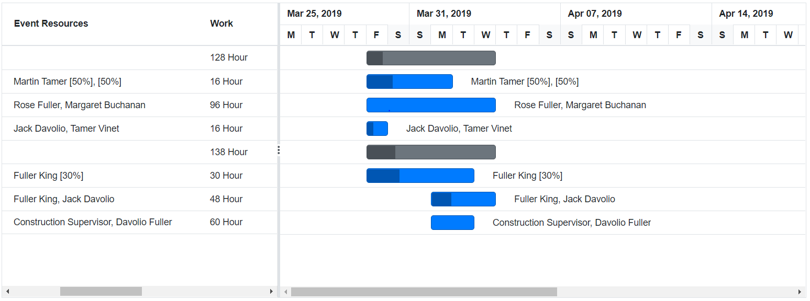
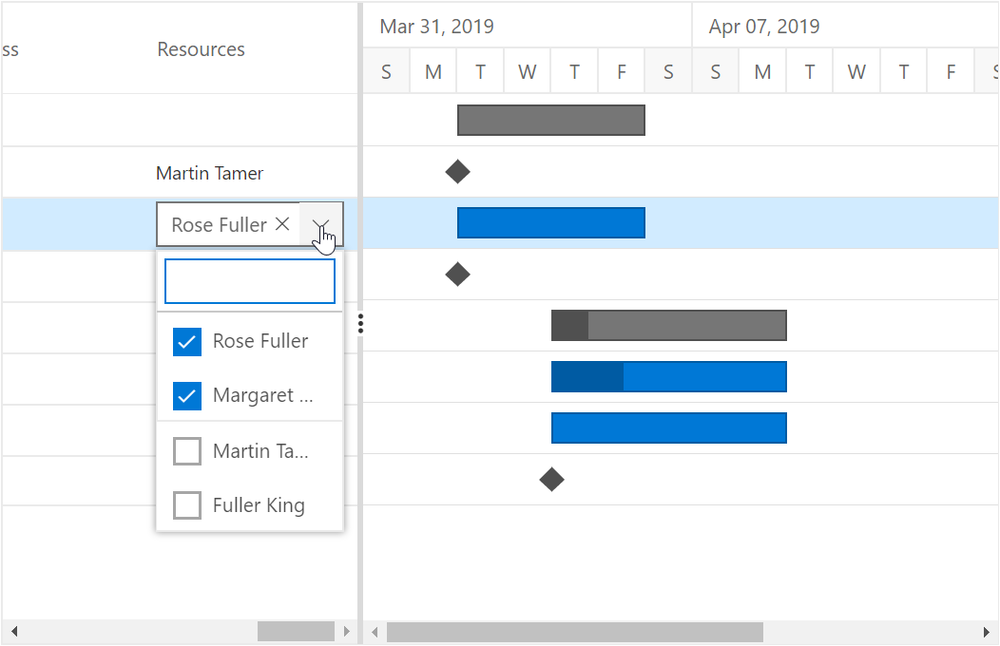
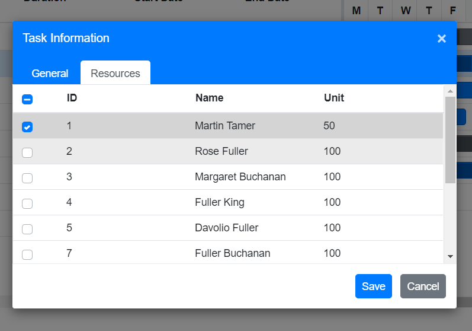

# Resources in Blazor Gantt Chart Component

In [`Blazor Gantt Chart`](https://www.syncfusion.com/blazor-components/blazor-gantt-chart), the resources are represented by staff, equipment and materials etc. In Gantt Chart component you can show or allocate the resources (human resources) for each task.

## Resource Collection

The resource collection contains details about resources that are used in the project. Resources are List of TResources object that contains id, name and unit of the resources and this collection is mapped to the Gantt Chart component using the `GanttResourceFields.Resources` property. Id, name and unit field of the resources are mapped by using the `GanttResourceFields.Id` , `GanttResourceFields.Name` and `GanttResourceFields.Unit` properties. The following code snippets shows resource collection and how it assigned to Gantt Chart component.

```cshtml
@using Syncfusion.Blazor.Gantt
<SfGantt DataSource="@TaskCollection" Height="450px" Width="100%" ProjectStartDate="@ProjectStart" ProjectEndDate="@ProjectEnd" WorkUnit="WorkUnit.Hour">
    <GanttTaskFields Id="TaskId" Name="TaskName" StartDate="StartDate" EndDate="EndDate" Duration="Duration" Progress="Progress"
            ParentID="ParentId" ResourceInfo="Resources">
    </GanttTaskFields>
    <GanttColumns>
        <GanttColumn Field="TaskId" HeaderText="ID"></GanttColumn>
        <GanttColumn Field="TaskName" HeaderText="Event Name"></GanttColumn>
        <GanttColumn Field="Resources" HeaderText="Event Resources" Width="300px"></GanttColumn>
        <GanttColumn Field="Duration" HeaderText="Duration"></GanttColumn>
        <GanttColumn Field="StartDate" HeaderText="Start Date"></GanttColumn>
        <GanttColumn Field="EndDate" HeaderText="End Date"></GanttColumn>
    </GanttColumns>
    <GanttResourceFields Resources="@ResourceCollection" Id="ResourceId" Name="ResourceName" Unit="Unit" TResources="ResourceAlloacteData"></GanttResourceFields>
    <GanttLabelSettings RightLabel="Resources" TValue="TaskData"></GanttLabelSettings>
</SfGantt>

@code{
    public DateTime ProjectStart = new DateTime(2019, 03, 25);
    public DateTime ProjectEnd = new DateTime(2019, 05, 10);
    public List<TaskData> TaskCollection { get; set; }
    public List<ResourceAlloacteData> ResourceCollection { get; set; }

    protected override void OnInitialized()
    {
        this.TaskCollection = GetTaskCollection();
        this.ResourceCollection = GetResources;

    }
    public class ResourceAlloacteData
    {
        public int ResourceId { get; set; }
        public string ResourceName { get; set; }
        public int Unit { get; set; }
    }
    public static List<ResourceAlloacteData> GetResources = new List<ResourceAlloacteData>()
    {

        new ResourceAlloacteData() { ResourceId= 1, ResourceName= "Martin Tamer"},
        new ResourceAlloacteData() { ResourceId= 2, ResourceName= "Rose Fuller" },
        new ResourceAlloacteData() { ResourceId= 3, ResourceName= "Margaret Buchanan" },
        new ResourceAlloacteData() { ResourceId= 4, ResourceName= "Fuller King" },
        new ResourceAlloacteData() { ResourceId= 5, ResourceName= "Davolio Fuller" },
        new ResourceAlloacteData() { ResourceId= 7, ResourceName= "Fuller Buchanan" },
        new ResourceAlloacteData() { ResourceId= 8, ResourceName= "Jack Davolio" },
        new ResourceAlloacteData() { ResourceId= 9, ResourceName= "Tamer Vinet" },
        new ResourceAlloacteData() { ResourceId= 10, ResourceName= "Vinet Fuller" },
        new ResourceAlloacteData() { ResourceId= 11, ResourceName= "Bergs Anton" },
        new ResourceAlloacteData() { ResourceId= 12, ResourceName= "Construction Supervisor" }
    };

    public class TaskData
    {
        public int TaskId { get; set; }
        public string TaskName { get; set; }
        public DateTime StartDate { get; set; }
        public DateTime EndDate { get; set; }
        public string Duration { get; set; }
        public int Progress { get; set; }
        public int? ParentId { get; set; }
        public List<ResourceAlloacteData> Resources { get; set; }

    }
    public static List <TaskData> GetTaskCollection() {
        List <TaskData> Tasks = new List <TaskData> () {
            new TaskData() {
                TaskId = 1,
                TaskName = "Project initiation",
                StartDate = new DateTime(2019, 03, 28),
                EndDate = new DateTime(2019, 07, 28),
                Duration="4"
            },
            new TaskData() {
                TaskId = 2,
                TaskName = "Identify Site location",
                StartDate = new DateTime(2019, 03, 29),
                Progress = 30,
                ParentId = 1,
                Duration="2",
                Resources = new List<ResourceAlloacteData>(){ new ResourceAlloacteData() { ResourceId=1, Unit=70} ,new ResourceAlloacteData() { ResourceId=6} }
            },
            new TaskData() {
                TaskId = 3,
                TaskName = "Perform soil test",
                StartDate = new DateTime(2019, 03, 29),
                Resources = new List<ResourceAlloacteData>(){ new ResourceAlloacteData() { ResourceId=2} ,new ResourceAlloacteData() { ResourceId=3} },
                ParentId = 1,
                Duration="4"
            },
            new TaskData() {
                TaskId = 4,
                TaskName = "Soil test approval",
                StartDate = new DateTime(2019, 03, 29),
                Duration = "1",
                Progress = 30,
                ParentId = 1,
                Resources = new List<ResourceAlloacteData>(){ new ResourceAlloacteData() { ResourceId=8} ,new ResourceAlloacteData() { ResourceId=9} }
            },
            new TaskData() {
                TaskId = 5,
                TaskName = "Project estimation",
                StartDate = new DateTime(2019, 03, 29),
                EndDate = new DateTime(2019, 04, 2),
                Duration="4"
            },
            new TaskData() {
                TaskId = 6,
                TaskName = "Develop floor plan for estimation",
                StartDate = new DateTime(2019, 03, 29),
                Duration = "3",
                Progress = 30,
                ParentId = 5,
                Resources = new List<ResourceAlloacteData>(){ new ResourceAlloacteData() { ResourceId=4} }
            },
            new TaskData() {
                TaskId = 7,
                TaskName = "List materials",
                StartDate = new DateTime(2019, 04, 01),
                Duration = "3",
                Progress = 30,
                ParentId = 5,
                Resources = new List<ResourceAlloacteData>(){ new ResourceAlloacteData() { ResourceId=4},new ResourceAlloacteData() { ResourceId=8} },

            },
            new TaskData() {
                TaskId = 8,
                TaskName = "Estimation approval",
                StartDate = new DateTime(2019, 04, 01),
                Duration = "2",
                ParentId = 5,
                Resources = new List<ResourceAlloacteData>(){ new ResourceAlloacteData() { ResourceId= 12},new ResourceAlloacteData() { ResourceId= 5} },
            }
        };
        return Tasks;
    }
}
```

## Assign Resource

We can assign resources for a task at initial load by using the resource id value of the resources as a collection. This collection is mapped from the dataSource to the Gantt Chart component using the `GanttTaskFields.ResourceInfo` property.

* Gantt TValue for Resource mapping collection name should be the same as `GanttTaskFields.ResourceInfo`.
* Gantt Resource mapping collection should have the value for Id. Both Name and Unit values are optional.
* If the unit is not specified for a specific resource, the amount of work done will be considered as 100% by default. In such cases, the resource unit will not be displayed in Gantt UI.

### Assign Resource with Unit

We can assign the quantity of work done by the resources for the specific task as like below code snippet.

```csharp
    new TaskData() {
        TaskId = 2,
        TaskName = "Identify Site location",
        StartDate = new DateTime(2019, 03, 29),
        Progress = 30,
        ParentId = 1,
        Duration="2",
        Resources = new List<ResourceAlloacteData>(){ new ResourceAlloacteData() { ResourceId=1, Unit=70} }
    },
```

When resource unit is defined in resource collection, the amount of work done by that particular resource will be same for all the tasks.

The following code snippet shows how to assign the resource for each task and map to Gantt Chart component.

```cshtml
@using Syncfusion.Blazor.Gantt
<SfGantt DataSource="@TaskCollection" Height="450px" Width="100%" ProjectStartDate="@ProjectStart" ProjectEndDate="@ProjectEnd" WorkUnit="WorkUnit.Hour">
    <GanttTaskFields Id="TaskId" Name="TaskName" StartDate="StartDate" EndDate="EndDate" Duration="Duration" Progress="Progress"
            ParentID="ParentId" Work="Work" ResourceInfo="Resources" TaskType="TaskType">
    </GanttTaskFields>
    <GanttColumns>
        <GanttColumn Field="TaskId" HeaderText="ID"></GanttColumn>
        <GanttColumn Field="TaskName" HeaderText="Event Name"></GanttColumn>
        <GanttColumn Field="Resources" HeaderText="Event Resources" Width="300px"></GanttColumn>
        <GanttColumn Field="Work" HeaderText="Work"></GanttColumn>
        <GanttColumn Field="Duration" HeaderText="Duration"></GanttColumn>
        <GanttColumn Field="TaskType" HeaderText="Task Type"></GanttColumn>
        <GanttColumn Field="StartDate" HeaderText="Start Date"></GanttColumn>
        <GanttColumn Field="EndDate" HeaderText="End Date"></GanttColumn>
    </GanttColumns>
    <GanttResourceFields Resources="@ResourceCollection" Id="ResourceId" Name="ResourceName" Unit="Unit" TResources="ResourceAlloacteData"></GanttResourceFields>
    <GanttLabelSettings RightLabel="Resources" TValue="TaskData"></GanttLabelSettings>
</SfGantt>

@code{
    public DateTime ProjectStart = new DateTime(2019, 03, 25);
    public DateTime ProjectEnd = new DateTime(2019, 05, 10);
    public List<TaskData> TaskCollection { get; set; }
    public List<ResourceAlloacteData> ResourceCollection { get; set; }

    protected override void OnInitialized()
    {
        this.TaskCollection = GetTaskCollection();
        this.ResourceCollection = GetResources;

    }
    public class ResourceAlloacteData
    {
        public int ResourceId { get; set; }
        public string ResourceName { get; set; }
        public int Unit { get; set; }
    }
    public static List<ResourceAlloacteData> GetResources = new List<ResourceAlloacteData>()
    {

        new ResourceAlloacteData() { ResourceId= 1, ResourceName= "Martin Tamer"},
        new ResourceAlloacteData() { ResourceId= 2, ResourceName= "Rose Fuller" },
        new ResourceAlloacteData() { ResourceId= 3, ResourceName= "Margaret Buchanan" },
        new ResourceAlloacteData() { ResourceId= 4, ResourceName= "Fuller King" },
        new ResourceAlloacteData() { ResourceId= 5, ResourceName= "Davolio Fuller" },
        new ResourceAlloacteData() { ResourceId= 7, ResourceName= "Fuller Buchanan" },
        new ResourceAlloacteData() { ResourceId= 8, ResourceName= "Jack Davolio" },
        new ResourceAlloacteData() { ResourceId= 9, ResourceName= "Tamer Vinet" },
        new ResourceAlloacteData() { ResourceId= 10, ResourceName= "Vinet Fuller" },
        new ResourceAlloacteData() { ResourceId= 11, ResourceName= "Bergs Anton" },
        new ResourceAlloacteData() { ResourceId= 12, ResourceName= "Construction Supervisor" }
    };

    public class TaskData
    {
        public int TaskId { get; set; }
        public string TaskName { get; set; }
        public string TaskType { get; set; }
        public DateTime StartDate { get; set; }
        public DateTime EndDate { get; set; }
        public string Duration { get; set; }
        public int Progress { get; set; }
        public int? ParentId { get; set; }
        public double? Work { get; set; }
        public List<ResourceAlloacteData> Resources { get; set; }

    }
    public static List <TaskData> GetTaskCollection() {
        List <TaskData> Tasks = new List <TaskData> () {
            new TaskData() {
                TaskId = 1,
                TaskName = "Project initiation",
                StartDate = new DateTime(2019, 03, 28),
                EndDate = new DateTime(2019, 07, 28),
                TaskType ="FixedDuration",
                Work=128,
                Duration="4"
            },
            new TaskData() {
                TaskId = 2,
                TaskName = "Identify Site location",
                StartDate = new DateTime(2019, 03, 29),
                Progress = 30,
                ParentId = 1,
                Duration="2",
                Work=16,
                Resources = new List<ResourceAlloacteData>(){ new ResourceAlloacteData() { ResourceId=1, Unit=70} ,new ResourceAlloacteData() { ResourceId=6} }
            },
            new TaskData() {
                TaskId = 3,
                TaskName = "Perform soil test",
                StartDate = new DateTime(2019, 03, 29),
                Resources = new List<ResourceAlloacteData>(){ new ResourceAlloacteData() { ResourceId=2} ,new ResourceAlloacteData() { ResourceId=3} },
                ParentId = 1,
                Work=96,
                Duration="4",
                TaskType="Fixed work"
            },
            new TaskData() {
                TaskId = 4,
                TaskName = "Soil test approval",
                StartDate = new DateTime(2019, 03, 29),
                Duration = "1",
                Progress = 30,
                ParentId = 1,
                Resources = new List<ResourceAlloacteData>(){ new ResourceAlloacteData() { ResourceId=8} ,new ResourceAlloacteData() { ResourceId=9} },
                Work=16,
                TaskType="Fixed work"
            },
            new TaskData() {
                TaskId = 5,
                TaskName = "Project estimation",
                StartDate = new DateTime(2019, 03, 29),
                EndDate = new DateTime(2019, 04, 2),

                TaskType="Fixed Duration",
                Duration="4"
            },
            new TaskData() {
                TaskId = 6,
                TaskName = "Develop floor plan for estimation",
                StartDate = new DateTime(2019, 03, 29),
                Duration = "3",
                Progress = 30,
                ParentId = 5,
                Resources = new List<ResourceAlloacteData>(){ new ResourceAlloacteData() { ResourceId=4, Unit=30} },
                Work=30,
                TaskType="Fixed work"
            },
            new TaskData() {
                TaskId = 7,
                TaskName = "List materials",
                StartDate = new DateTime(2019, 04, 01),
                Duration = "3",
                Progress = 30,
                ParentId = 5,
                TaskType="Fixedwork",
                Work=48,
                Resources = new List<ResourceAlloacteData>(){ new ResourceAlloacteData() { ResourceId=4},new ResourceAlloacteData() { ResourceId=8} },

            },
            new TaskData() {
                TaskId = 8,
                TaskName = "Estimation approval",
                StartDate = new DateTime(2019, 04, 01),
                Duration = "2",
                ParentId = 5,
                Work=60,
                TaskType="Fixedwork",
                Resources = new List<ResourceAlloacteData>(){ new ResourceAlloacteData() { ResourceId= 12},new ResourceAlloacteData() { ResourceId= 5} },
            }
        };
        return Tasks;
    }
}
```



## Add / Edit Resource Collection

By using cell editing or dialog editing, we can add/remove the resource for particular task.

```cshtml
@using Syncfusion.Blazor.Gantt
<SfGantt DataSource="@TaskCollection" Height="450px" Width="100%" ProjectStartDate="@ProjectStart" ProjectEndDate="@ProjectEnd" WorkUnit="WorkUnit.Hour">
    <GanttTaskFields Id="TaskId" Name="TaskName" StartDate="StartDate" EndDate="EndDate" Duration="Duration" Progress="Progress"
            ParentID="ParentId" Work="Work" ResourceInfo="Resources" TaskType="TaskType">
    </GanttTaskFields>
    <GanttColumns>
        <GanttColumn Field="TaskId" HeaderText="ID"></GanttColumn>
        <GanttColumn Field="TaskName" HeaderText="Event Name"></GanttColumn>
        <GanttColumn Field="Resources" HeaderText="Event Resources" Width="300px"></GanttColumn>
        <GanttColumn Field="Duration" HeaderText="Duration"></GanttColumn>
        <GanttColumn Field="StartDate" HeaderText="Start Date"></GanttColumn>
        <GanttColumn Field="EndDate" HeaderText="End Date"></GanttColumn>
    </GanttColumns>
    <GanttEditSettings AllowEditing="true"></GanttEditSettings>
    <GanttResourceFields Resources="@ResourceCollection" Id="ResourceId" Name="ResourceName" Unit="Unit" TResources="ResourceAlloacteData"></GanttResourceFields>
    <GanttLabelSettings RightLabel="Resources" TValue="TaskData"></GanttLabelSettings>
</SfGantt>

@code{
    public DateTime ProjectStart = new DateTime(2019, 03, 25);
    public DateTime ProjectEnd = new DateTime(2019, 05, 10);
    public List<TaskData> TaskCollection { get; set; }
    public List<ResourceAlloacteData> ResourceCollection { get; set; }

    protected override void OnInitialized()
    {
        this.TaskCollection = GetTaskCollection();
        this.ResourceCollection = GetResources;

    }
    public class ResourceAlloacteData
    {
        public int ResourceId { get; set; }
        public string ResourceName { get; set; }
        public int Unit { get; set; }
    }
    public static List<ResourceAlloacteData> GetResources = new List<ResourceAlloacteData>()
    {

        new ResourceAlloacteData() { ResourceId= 1, ResourceName= "Martin Tamer"},
        new ResourceAlloacteData() { ResourceId= 2, ResourceName= "Rose Fuller" },
        new ResourceAlloacteData() { ResourceId= 3, ResourceName= "Margaret Buchanan" },
        new ResourceAlloacteData() { ResourceId= 4, ResourceName= "Fuller King" },
        new ResourceAlloacteData() { ResourceId= 5, ResourceName= "Davolio Fuller" },
        new ResourceAlloacteData() { ResourceId= 7, ResourceName= "Fuller Buchanan" },
        new ResourceAlloacteData() { ResourceId= 8, ResourceName= "Jack Davolio" },
        new ResourceAlloacteData() { ResourceId= 9, ResourceName= "Tamer Vinet" },
        new ResourceAlloacteData() { ResourceId= 10, ResourceName= "Vinet Fuller" },
        new ResourceAlloacteData() { ResourceId= 11, ResourceName= "Bergs Anton" },
        new ResourceAlloacteData() { ResourceId= 12, ResourceName= "Construction Supervisor" }
    };

    public class TaskData
    {
        public int TaskId { get; set; }
        public string TaskName { get; set; }
        public string TaskType { get; set; }
        public DateTime StartDate { get; set; }
        public DateTime EndDate { get; set; }
        public string Duration { get; set; }
        public int Progress { get; set; }
        public int? ParentId { get; set; }
        public double? Work { get; set; }
        public List<ResourceAlloacteData> Resources { get; set; }

    }
    public static List <TaskData> GetTaskCollection() {
        List <TaskData> Tasks = new List <TaskData> () {
            new TaskData() {
                TaskId = 1,
                TaskName = "Project initiation",
                StartDate = new DateTime(2019, 03, 28),
                EndDate = new DateTime(2019, 07, 28),
                TaskType ="FixedDuration",
                Work=128,
                Duration="4"
            },
            new TaskData() {
                TaskId = 2,
                TaskName = "Identify Site location",
                StartDate = new DateTime(2019, 03, 29),
                Progress = 30,
                ParentId = 1,
                Duration="2",
                Work=16,
                Resources = new List<ResourceAlloacteData>(){ new ResourceAlloacteData() { ResourceId=1, Unit=70} ,new ResourceAlloacteData() { ResourceId=6} }
            },
            new TaskData() {
                TaskId = 3,
                TaskName = "Perform soil test",
                StartDate = new DateTime(2019, 03, 29),
                Resources = new List<ResourceAlloacteData>(){ new ResourceAlloacteData() { ResourceId=2} ,new ResourceAlloacteData() { ResourceId=3} },
                ParentId = 1,
                Work=96,
                Duration="4",
                TaskType="Fixed work"
            },
            new TaskData() {
                TaskId = 4,
                TaskName = "Soil test approval",
                StartDate = new DateTime(2019, 03, 29),
                Duration = "1",
                Progress = 30,
                ParentId = 1,
                Resources = new List<ResourceAlloacteData>(){ new ResourceAlloacteData() { ResourceId=8} ,new ResourceAlloacteData() { ResourceId=9} },
                Work=16,
                TaskType="Fixed work"
            },
            new TaskData() {
                TaskId = 5,
                TaskName = "Project estimation",
                StartDate = new DateTime(2019, 03, 29),
                EndDate = new DateTime(2019, 04, 2),

                TaskType="Fixed Duration",
                Duration="4"
            },
            new TaskData() {
                TaskId = 6,
                TaskName = "Develop floor plan for estimation",
                StartDate = new DateTime(2019, 03, 29),
                Duration = "3",
                Progress = 30,
                ParentId = 5,
                Resources = new List<ResourceAlloacteData>(){ new ResourceAlloacteData() { ResourceId=4} },
                Work=30,
                TaskType="Fixed work"
            },
            new TaskData() {
                TaskId = 7,
                TaskName = "List materials",
                StartDate = new DateTime(2019, 04, 01),
                Duration = "3",
                Progress = 30,
                ParentId = 5,
                TaskType="Fixedwork",
                Work=48,
                Resources = new List<ResourceAlloacteData>(){ new ResourceAlloacteData() { ResourceId=4},new ResourceAlloacteData() { ResourceId=8} },

            },
            new TaskData() {
                TaskId = 8,
                TaskName = "Estimation approval",
                StartDate = new DateTime(2019, 04, 01),
                Duration = "2",
                ParentId = 5,
                Work=60,
                TaskType="Fixedwork",
                Resources = new List<ResourceAlloacteData>(){ new ResourceAlloacteData() { ResourceId= 12},new ResourceAlloacteData() { ResourceId= 5} },
            }
        };
        return Tasks;
    }
}
```

`Note:` When the edit mode is set as `Auto`, on performing double click action on Tree Grid side the cells will be changed to editable mode and on performing double click action on chart side the edit dialog will appear for editing the task details. By using this support we can add/remove the resource for particular task using both cell and edit dialog

Editing resource with cell edit



Editing resource with edit dialog

