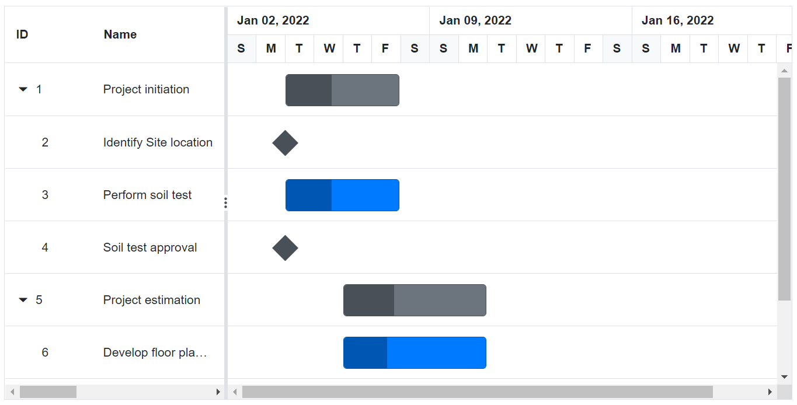
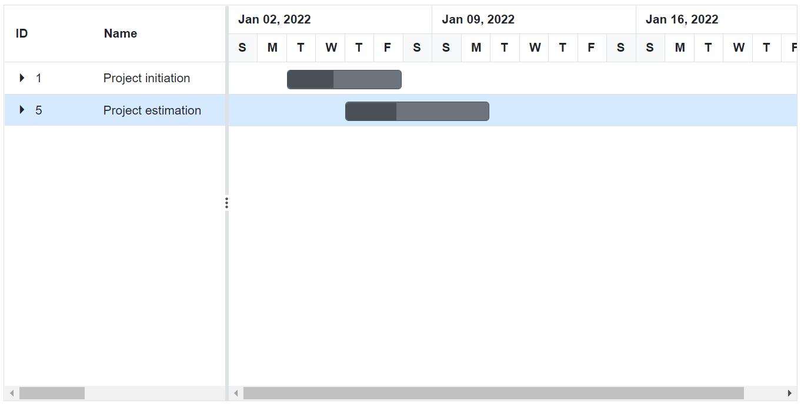

# Rows in Blazor Gantt Chart Component

Row represents task information from the data source, and it is possible to perform the following actions in Gantt Chart rows.

## Row height

It is possible to change the height of the row in Gantt Chart by setting row height in pixels to the [RowHeight](https://help.syncfusion.com/cr/blazor/Syncfusion.Blazor.Gantt.IGantt.html#Syncfusion_Blazor_Gantt_IGantt_RowHeight) property. The following code example explains how to change the row height in Gantt Chart at load time.

```cshtml
@using Syncfusion.Blazor.Gantt

<SfGantt DataSource="@TaskCollection" RowHeight=60 Height="450px" Width="900px">
    <GanttTaskFields Id="TaskId" Name="TaskName" StartDate="StartDate" EndDate="EndDate"
                     Duration="Duration" Progress="Progress" ParentID="ParentId">
    </GanttTaskFields>
</SfGantt>

@code{
    private List<TaskData> TaskCollection { get; set; }

    protected override void OnInitialized()
    {
        this.TaskCollection = GetTaskCollection();
    }

    public class TaskData
    {
        public int TaskId { get; set; }
        public string TaskName { get; set; }
        public DateTime StartDate { get; set; }
        public DateTime EndDate { get; set; }
        public string Duration { get; set; }
        public int Progress { get; set; }
        public int? ParentId { get; set; }
    }

    private static List<TaskData> GetTaskCollection()
    {
        List<TaskData> Tasks = new List<TaskData>()
        {
            new TaskData() { TaskId = 1, TaskName = "Project initiation", StartDate = new DateTime(2022, 01, 04), EndDate = new DateTime(2022, 01, 17), },
            new TaskData() { TaskId = 2, TaskName = "Identify Site location", StartDate = new DateTime(2022, 01, 04), Duration = "0", Progress = 30, ParentId = 1, },
            new TaskData() { TaskId = 3, TaskName = "Perform soil test", StartDate = new DateTime(2022, 01, 04), Duration = "4", Progress = 40, ParentId = 1, },
            new TaskData() { TaskId = 4, TaskName = "Soil test approval", StartDate = new DateTime(2022, 01, 04), Duration = "0", Progress = 30, ParentId = 1, },
            new TaskData() { TaskId = 5, TaskName = "Project estimation", StartDate = new DateTime(2022, 01, 04), EndDate = new DateTime(2022, 01, 17), },
            new TaskData() { TaskId = 6, TaskName = "Develop floor plan for estimation", StartDate = new DateTime(2022, 01, 06), Duration = "3", Progress = 30, ParentId = 5, },
            new TaskData() { TaskId = 7, TaskName = "List materials", StartDate = new DateTime(2022, 01, 06), Duration = "3", Progress = 40, ParentId = 5, },
            new TaskData() { TaskId = 8, TaskName = "Estimation approval", StartDate = new DateTime(2022, 01, 06), Duration = "0", Progress = 30, ParentId = 5, }
        };
        return Tasks;
    }
}
```



## Expand or collapse row

In Gantt Chart, parent tasks are expanded/collapsed by using expand/collapse icons, expand all/collapse all toolbar items, and public methods. By default, all tasks in Gantt Chart are rendered in expanded state, but you can change this status using the properties below.

### Collapse all tasks at Gantt Chart load

All tasks available in Gantt Chart are rendered in collapsed state by setting the [CollapseAllParentTasks](https://help.syncfusion.com/cr/blazor/Syncfusion.Blazor.Gantt.SfGantt-1.html#Syncfusion_Blazor_Gantt_SfGantt_1_CollapseAllParentTasks) property as `true`. The following code example shows how to use this property.

```cshtml
@using Syncfusion.Blazor.Gantt

<SfGantt DataSource="@TaskCollection" CollapseAllParentTasks="true" Height="450px" Width="900px">
    <GanttTaskFields Id="TaskId" Name="TaskName" StartDate="StartDate" EndDate="EndDate"
                     Duration="Duration" Progress="Progress" ParentID="ParentId">
    </GanttTaskFields>
</SfGantt>

@code{
    private List<TaskData> TaskCollection { get; set; }

    protected override void OnInitialized()
    {
        this.TaskCollection = GetTaskCollection();
    }

    public class TaskData
    {
        public int TaskId { get; set; }
        public string TaskName { get; set; }
        public DateTime StartDate { get; set; }
        public DateTime EndDate { get; set; }
        public string Duration { get; set; }
        public int Progress { get; set; }
        public int? ParentId { get; set; }
    }

    private static List<TaskData> GetTaskCollection()
    {
        List<TaskData> Tasks = new List<TaskData>()
        {
            new TaskData() { TaskId = 1, TaskName = "Project initiation", StartDate = new DateTime(2022, 01, 04), EndDate = new DateTime(2022, 01, 17), },
            new TaskData() { TaskId = 2, TaskName = "Identify Site location", StartDate = new DateTime(2022, 01, 04), Duration = "0", Progress = 30, ParentId = 1, },
            new TaskData() { TaskId = 3, TaskName = "Perform soil test", StartDate = new DateTime(2022, 01, 04), Duration = "4", Progress = 40, ParentId = 1, },
            new TaskData() { TaskId = 4, TaskName = "Soil test approval", StartDate = new DateTime(2022, 01, 04), Duration = "0", Progress = 30, ParentId = 1, },
            new TaskData() { TaskId = 5, TaskName = "Project estimation", StartDate = new DateTime(2022, 01, 04), EndDate = new DateTime(2022, 01, 17), },
            new TaskData() { TaskId = 6, TaskName = "Develop floor plan for estimation", StartDate = new DateTime(2022, 01, 06), Duration = "3", Progress = 30, ParentId = 5, },
            new TaskData() { TaskId = 7, TaskName = "List materials", StartDate = new DateTime(2022, 01, 06), Duration = "3", Progress = 40, ParentId = 5, },
            new TaskData() { TaskId = 8, TaskName = "Estimation approval", StartDate = new DateTime(2022, 01, 06), Duration = "0", Progress = 30, ParentId = 5, }
        };
        return Tasks;
    }
}
```



<!-- Define Expand/Collapse Status of Tasks

In Gantt Chart, you can render some tasks in collapsed state and some tasks in expanded state by defining expand status of the task in the data source. This value was mapped to Gantt Chart component by using `GanttTaskFields.ExpandState` property. The following code example shows how to use this property.

```cshtml
@using Syncfusion.Blazor.Gantt
<SfGantt DataSource="@TaskCollection" Height="450px" Width="900px">
    <GanttTaskFields Id="TaskId" Name="TaskName" StartDate="StartDate" EndDate="EndDate"
            Duration="Duration" Progress="Progress" Child="SubTasks" ExpandState="isExpand">
    </GanttTaskFields>
</SfGantt>

@code{
    public List<TaskData> TaskCollection { get; set; }
    protected override void OnInitialized()
    {
        this.TaskCollection = GetTaskCollection();
    }

    public class TaskData
    {
        public int TaskId { get; set; }
        public string TaskName { get; set; }
        public DateTime StartDate { get; set; }
        public DateTime EndDate { get; set; }
        public string Duration { get; set; }
        public int Progress { get; set; }
        public bool isExpand { get; set; }
        public List<TaskData> SubTasks { get; set; }
    }

    public static List <TaskData> GetTaskCollection() {
    List <TaskData> Tasks = new List <TaskData> () {
        new TaskData() {
            TaskId = 1,
            TaskName = "Project initiation",
            StartDate = new DateTime(2019, 04, 02),
            EndDate = new DateTime(2019, 04, 21),
            isExpand = true,
            SubTasks = (new List <TaskData> () {
                new TaskData() {
                    TaskId = 2,
                    TaskName = "Identify Site location",
                    StartDate = new DateTime(2019, 04, 02),
                    Duration = "3",
                    Progress = 50,
                },
                new TaskData() {
                    TaskId = 3,
                    TaskName = "Perform soil test",
                    StartDate = new DateTime(2019, 04, 02),
                    Duration = "3",
                    Progress = 50,
                },
                new TaskData() {
                    TaskId = 4,
                    TaskName = "Soil test approval",
                    StartDate = new DateTime(2019, 04, 02),
                    Duration = "3",
                    Progress = 50
                },
            })
        },
        new TaskData() {
            TaskId = 5,
            TaskName = "Project estimation",
            StartDate = new DateTime(2019, 04, 02),
            EndDate = new DateTime(2019, 04, 21),
            isExpand = false,
            SubTasks = (new List <TaskData> () {
                new TaskData() {
                    TaskId = 6,
                    TaskName = "Develop floor plan for estimation",
                    StartDate = new DateTime(2019, 04, 04),
                    Duration = "3",
                    Progress = 30,
                },
                new TaskData() {
                    TaskId = 7,
                    TaskName = "List materials",
                    StartDate = new DateTime(2019, 04, 04),
                    Duration = "3",
                    Progress = 40
                },
                new TaskData() {
                    TaskId = 8,
                    TaskName = "Estimation approval",
                    StartDate = new DateTime(2019, 04, 04),
                    Duration = "0",
                    Progress = 30,
                }
            })
        }
    };

    return Tasks;
}
}
```

 -->

### Customize expand and collapse action

You can use [GanttEvents](https://help.syncfusion.com/cr/blazor/Syncfusion.Blazor.Gantt.GanttEvents-1.html) to handle on expand action, `Expanding` and `Expanded` events will be triggered with current expanding row’s information. Similarly, on collapse action, `Collapsing` and `Collapsed` events will be triggered. Using these events and their arguments, you can customize the expand/collapse action. The following code example shows how to prevent the particular row from expand/collapse action using the `Expanding` and `Collapsing` events.

```cshtml
@using Syncfusion.Blazor.Gantt

<SfGantt DataSource="@TaskCollection" Height="450px" Width="900px">
    <GanttTaskFields Id="TaskId" Name="TaskName" StartDate="StartDate" EndDate="EndDate"
                     Duration="Duration" Progress="Progress" ParentID="ParentId">
    </GanttTaskFields>
    <GanttEvents Collapsing="Collapsing" Expanding="Expanding" TValue="TaskData"></GanttEvents>
</SfGantt>

@code{

    public void Collapsing(Syncfusion.Blazor.TreeGrid.RowCollapsingEventArgs<TaskData> args)
    {
        if (args.Data.TaskId == 1)
        {
            args.Cancel = true;
        }
    }
    public void Expanding(Syncfusion.Blazor.TreeGrid.RowExpandingEventArgs<TaskData> args)
    {
        if (args.Data.TaskId == 5)
        {
            args.Cancel = true;
        }
    }

    private List<TaskData> TaskCollection { get; set; }

    protected override void OnInitialized()
    {
        this.TaskCollection = GetTaskCollection();
    }

    public class TaskData
    {
        public int TaskId { get; set; }
        public string TaskName { get; set; }
        public DateTime StartDate { get; set; }
        public DateTime EndDate { get; set; }
        public string Duration { get; set; }
        public int Progress { get; set; }
        public int? ParentId { get; set; }
    }


    private static List<TaskData> GetTaskCollection()
    {
        List<TaskData> Tasks = new List<TaskData>()
        {
            new TaskData() { TaskId = 1, TaskName = "Project initiation", StartDate = new DateTime(2022, 01, 04), EndDate = new DateTime(2022, 01, 17), },
            new TaskData() { TaskId = 2, TaskName = "Identify Site location", StartDate = new DateTime(2022, 01, 04), Duration = "0", Progress = 30, ParentId = 1, },
            new TaskData() { TaskId = 3, TaskName = "Perform soil test", StartDate = new DateTime(2022, 01, 04), Duration = "4", Progress = 40, ParentId = 1, },
            new TaskData() { TaskId = 4, TaskName = "Soil test approval", StartDate = new DateTime(2022, 01, 04), Duration = "0", Progress = 30, ParentId = 1, },
            new TaskData() { TaskId = 5, TaskName = "Project estimation", StartDate = new DateTime(2022, 01, 04), EndDate = new DateTime(2022, 01, 17), },
            new TaskData() { TaskId = 6, TaskName = "Develop floor plan for estimation", StartDate = new DateTime(2022, 01, 06), Duration = "3", Progress = 30, ParentId = 5, },
            new TaskData() { TaskId = 7, TaskName = "List materials", StartDate = new DateTime(2022, 01, 06), Duration = "3", Progress = 40, ParentId = 5, },
            new TaskData() { TaskId = 8, TaskName = "Estimation approval", StartDate = new DateTime(2022, 01, 06), Duration = "0", Progress = 30, ParentId = 5, }
        };
        return Tasks;
    }
}
```

## Drag and drop

You can dynamically rearrange the rows in the Gantt Chart component by using the [AllowRowDragAndDrop](https://help.syncfusion.com/cr/blazor/Syncfusion.Blazor.Gantt.SfGantt-1.html#Syncfusion_Blazor_Gantt_SfGantt_1_AllowRowDragAndDrop) property. Using this property, row drag and drop can be enabled or disabled in Gantt. Using this feature, rows can be dropped above and below as a sibling or child to the existing rows.

```cshtml
@using Syncfusion.Blazor.Gantt
<SfGantt DataSource="@TaskCollection" Height="450px" Width="900px" TreeColumnIndex="1" AllowRowDragAndDrop="true">
    <GanttTaskFields Id="TaskId" Name="TaskName" StartDate="StartDate" EndDate="EndDate" Duration="Duration" Progress="Progress"
                     ParentID="ParentId">
    </GanttTaskFields>
</SfGantt>

@code{

    public void Collapsing(Syncfusion.Blazor.TreeGrid.RowCollapsingEventArgs<TaskData> args)
    {
        if (args.Data.TaskId == 1)
        {
            args.Cancel = true;
        }
    }
    public void Expanding(Syncfusion.Blazor.TreeGrid.RowExpandingEventArgs<TaskData> args)
    {
        if (args.Data.TaskId == 5)
        {
            args.Cancel = true;
        }
    }

    private List<TaskData> TaskCollection { get; set; }

    protected override void OnInitialized()
    {
        this.TaskCollection = GetTaskCollection();
    }

    public class TaskData
    {
        public int TaskId { get; set; }
        public string TaskName { get; set; }
        public DateTime StartDate { get; set; }
        public DateTime EndDate { get; set; }
        public string Duration { get; set; }
        public int Progress { get; set; }
        public int? ParentId { get; set; }
    }


    private static List<TaskData> GetTaskCollection()
    {
        List<TaskData> Tasks = new List<TaskData>()
        {
            new TaskData() { TaskId = 1, TaskName = "Project initiation", StartDate = new DateTime(2022, 01, 04), EndDate = new DateTime(2022, 01, 17), },
            new TaskData() { TaskId = 2, TaskName = "Identify Site location", StartDate = new DateTime(2022, 01, 04), Duration = "0", Progress = 30, ParentId = 1, },
            new TaskData() { TaskId = 3, TaskName = "Perform soil test", StartDate = new DateTime(2022, 01, 04), Duration = "4", Progress = 40, ParentId = 1, },
            new TaskData() { TaskId = 4, TaskName = "Soil test approval", StartDate = new DateTime(2022, 01, 04), Duration = "0", Progress = 30, ParentId = 1, },
            new TaskData() { TaskId = 5, TaskName = "Project estimation", StartDate = new DateTime(2022, 01, 04), EndDate = new DateTime(2022, 01, 17), },
            new TaskData() { TaskId = 6, TaskName = "Develop floor plan for estimation", StartDate = new DateTime(2022, 01, 06), Duration = "3", Progress = 30, ParentId = 5, },
            new TaskData() { TaskId = 7, TaskName = "List materials", StartDate = new DateTime(2022, 01, 06), Duration = "3", Progress = 40, ParentId = 5, },
            new TaskData() { TaskId = 8, TaskName = "Estimation approval", StartDate = new DateTime(2022, 01, 06), Duration = "0", Progress = 30, ParentId = 5, }
        };
        return Tasks;
    }
}
```

### Multiple row drag and drop

Gantt also supports dragging multiple rows at a time and dropping them on any rows above, below, or at child positions. In Gantt, you can enable the multiple drag and drop by setting the [GanttSelectionSettings.Type](https://help.syncfusion.com/cr/blazor/Syncfusion.Blazor.Gantt.GanttSelectionSettings.html) to `Multiple` and you should enable the [AllowRowDragAndDrop](https://help.syncfusion.com/cr/blazor/Syncfusion.Blazor.Gantt.SfGantt-1.html#Syncfusion_Blazor_Gantt_SfGantt_1_AllowRowDragAndDrop) property.

```cshtml
@using Syncfusion.Blazor.Gantt
<SfGantt DataSource="@TaskCollection" Height="450px" Width="900px" TreeColumnIndex="1" AllowRowDragAndDrop="true">
    <GanttTaskFields Id="TaskId" Name="TaskName" StartDate="StartDate" EndDate="EndDate" Duration="Duration" Progress="Progress"
                     ParentID="ParentId">
    </GanttTaskFields>
    <GanttSelectionSettings Type="Syncfusion.Blazor.Grids.SelectionType.Multiple"></GanttSelectionSettings>
</SfGantt>

@code{

    public void Collapsing(Syncfusion.Blazor.TreeGrid.RowCollapsingEventArgs<TaskData> args)
    {
        if (args.Data.TaskId == 1)
        {
            args.Cancel = true;
        }
    }
    public void Expanding(Syncfusion.Blazor.TreeGrid.RowExpandingEventArgs<TaskData> args)
    {
        if (args.Data.TaskId == 5)
        {
            args.Cancel = true;
        }
    }

    private List<TaskData> TaskCollection { get; set; }

    protected override void OnInitialized()
    {
        this.TaskCollection = GetTaskCollection();
    }

    public class TaskData
    {
        public int TaskId { get; set; }
        public string TaskName { get; set; }
        public DateTime StartDate { get; set; }
        public DateTime EndDate { get; set; }
        public string Duration { get; set; }
        public int Progress { get; set; }
        public int? ParentId { get; set; }
    }


    private static List<TaskData> GetTaskCollection()
    {
        List<TaskData> Tasks = new List<TaskData>()
        {
            new TaskData() { TaskId = 1, TaskName = "Project initiation", StartDate = new DateTime(2022, 01, 04), EndDate = new DateTime(2022, 01, 17), },
            new TaskData() { TaskId = 2, TaskName = "Identify Site location", StartDate = new DateTime(2022, 01, 04), Duration = "0", Progress = 30, ParentId = 1, },
            new TaskData() { TaskId = 3, TaskName = "Perform soil test", StartDate = new DateTime(2022, 01, 04), Duration = "4", Progress = 40, ParentId = 1, },
            new TaskData() { TaskId = 4, TaskName = "Soil test approval", StartDate = new DateTime(2022, 01, 04), Duration = "0", Progress = 30, ParentId = 1, },
            new TaskData() { TaskId = 5, TaskName = "Project estimation", StartDate = new DateTime(2022, 01, 04), EndDate = new DateTime(2022, 01, 17), },
            new TaskData() { TaskId = 6, TaskName = "Develop floor plan for estimation", StartDate = new DateTime(2022, 01, 06), Duration = "3", Progress = 30, ParentId = 5, },
            new TaskData() { TaskId = 7, TaskName = "List materials", StartDate = new DateTime(2022, 01, 06), Duration = "3", Progress = 40, ParentId = 5, },
            new TaskData() { TaskId = 8, TaskName = "Estimation approval", StartDate = new DateTime(2022, 01, 06), Duration = "0", Progress = 30, ParentId = 5, }
        };
        return Tasks;
    }
}
```

### Drag and drop events

Several events are available to customize the row drag and drop action. The following table explains about the available events and their details.

Event Name |Description
-----|-----
`OnRowDragStart`  |Triggers when drag action starts in Gantt.
`RowDropped`  |Triggers when a drag row was dropped on the target row.

<!-- Customize row drag and drop action

In Gantt, the `OnRowDragStart` and `RowDropped` events are triggered on row drag and drop action. Using this event, you can prevent dragging of particular record, validate the drop position, and cancel the drop action based on the target record and dragged record. The following topics explains about this.

 Prevent dragging of particular record

You can prevent drag action of the particular record by setting the `Cancel` property to `true`, which is available in the `OnRowDragStart` event argument based on our requirement. In the following sample, drag action was restricted for first parent record and its child records.

```cshtml
@using Syncfusion.Blazor.Gantt
<SfGantt DataSource="@TaskCollection" Height="450px" Width="900px" TreeColumnIndex="1" AllowRowDragAndDrop="true">
    <GanttTaskFields Id="TaskId" Name="TaskName" StartDate="StartDate" EndDate="EndDate" Duration="Duration" Progress="Progress"
            ParentID="ParentId">
    </GanttTaskFields>
    <GanttEvents OnRowDragStart="rowDrag" TValue="TaskData"></GanttEvents>
</SfGantt>

@code{
    public List<TaskData> TaskCollection { get; set; }
    protected override void OnInitialized()
    {
        this.TaskCollection = GetTaskCollection();
    }
    public void rowDrag(RowDragEventArgs<TaskData> args) {
        if(args.Data[0].TaskId == 4) {
            args.Cancel = true;
        }
    }
    public class TaskData
    {
        public int TaskId { get; set; }
        public string TaskName { get; set; }
        public DateTime StartDate { get; set; }
        public DateTime EndDate { get; set; }
        public string Duration { get; set; }
        public int Progress { get; set; }
        public int? ParentId { get; set; }
    }
    public static List <TaskData> GetTaskCollection() {
        List <TaskData> Tasks = new List <TaskData> () {
            new TaskData() {
                TaskId = 1,
                TaskName = "Project initiation",
                StartDate = new DateTime(2019, 03, 28),
                EndDate = new DateTime(2019, 07, 28),
                Duration="4"
            },
            new TaskData() {
                TaskId = 2,
                TaskName = "Identify Site location",
                StartDate = new DateTime(2019, 03, 29),
                Progress = 30,
                ParentId = 1,
                Duration="2",
            },
            new TaskData() {
                TaskId = 3,
                TaskName = "Perform soil test",
                StartDate = new DateTime(2019, 03, 29),
                ParentId = 1,
                Duration="4"
            },
            new TaskData() {
                TaskId = 4,
                TaskName = "Soil test approval",
                StartDate = new DateTime(2019, 03, 29),
                Duration = "4",
                Progress = 30,
                ParentId = 1
            },
            new TaskData() {
                TaskId = 5,
                TaskName = "Project estimation",
                StartDate = new DateTime(2019, 03, 29),
                EndDate = new DateTime(2019, 04, 2),
                Duration="4",
            },
            new TaskData() {
                TaskId = 6,
                TaskName = "Develop floor plan for estimation",
                StartDate = new DateTime(2019, 03, 29),
                Duration = "3",
                Progress = 30,
                ParentId = 5
            },
            new TaskData() {
                TaskId = 7,
                TaskName = "List materials",
                StartDate = new DateTime(2019, 04, 01),
                Duration = "3",
                Progress = 30,
                ParentId = 5
            },
            new TaskData() {
                TaskId = 8,
                TaskName = "Estimation approval",
                StartDate = new DateTime(2019, 04, 01),
                Duration = "2",
                ParentId = 5
            }
        };
        return Tasks;
    }
}
``` -->

### Perform row drag and drop action programmatically

Gantt provides option to perform row drag and drop action programmatically by using the `ReorderRowsAsync` method. This method can be used for any external actions like button click.
The following arguments are used to specify the positions to drag and drop a row:

* `FromIndexes`: Index value of source(dragging) row.
* `ToIndex`: Value of target index.
* `Position`: Drop positions such as above, below, or child.

The following code example shows how to drag and drop a row on button click action.

```cshtml
@using Syncfusion.Blazor.Gantt
<button @onclick="drag">Dynamic drag and drop</button>
<SfGantt @ref="Gantt" DataSource="@TaskCollection" Height="450px" Width="900px" TreeColumnIndex="1" AllowRowDragAndDrop="true">
    <GanttTaskFields Id="TaskId" Name="TaskName" StartDate="StartDate" EndDate="EndDate" Duration="Duration" Progress="Progress"
                     ParentID="ParentId">
    </GanttTaskFields>
</SfGantt>

@code{
    public SfGantt<TaskData> Gantt;
    private List<TaskData> TaskCollection { get; set; }
    protected override void OnInitialized()
    {
        this.TaskCollection = GetTaskCollection();
    }
    public void drag()
    {
        this.Gantt.ReorderRowAsync(2, 6, "Below");
    }
    public class TaskData
    {
        public int TaskId { get; set; }
        public string TaskName { get; set; }
        public DateTime StartDate { get; set; }
        public DateTime EndDate { get; set; }
        public string Duration { get; set; }
        public int Progress { get; set; }
        public int? ParentId { get; set; }
    }

    private static List<TaskData> GetTaskCollection()
    {
        List<TaskData> Tasks = new List<TaskData>()
        {
            new TaskData() { TaskId = 1, TaskName = "Project initiation", StartDate = new DateTime(2022, 01, 04), EndDate = new DateTime(2022, 01, 17), },
            new TaskData() { TaskId = 2, TaskName = "Identify Site location", StartDate = new DateTime(2022, 01, 04), Duration = "0", Progress = 30, ParentId = 1, },
            new TaskData() { TaskId = 3, TaskName = "Perform soil test", StartDate = new DateTime(2022, 01, 04), Duration = "4", Progress = 40, ParentId = 1, },
            new TaskData() { TaskId = 4, TaskName = "Soil test approval", StartDate = new DateTime(2022, 01, 04), Duration = "0", Progress = 30, ParentId = 1, },
            new TaskData() { TaskId = 5, TaskName = "Project estimation", StartDate = new DateTime(2022, 01, 04), EndDate = new DateTime(2022, 01, 17), },
            new TaskData() { TaskId = 6, TaskName = "Develop floor plan for estimation", StartDate = new DateTime(2022, 01, 06), Duration = "3", Progress = 30, ParentId = 5, },
            new TaskData() { TaskId = 7, TaskName = "List materials", StartDate = new DateTime(2022, 01, 06), Duration = "3", Progress = 40, ParentId = 5, },
            new TaskData() { TaskId = 8, TaskName = "Estimation approval", StartDate = new DateTime(2022, 01, 06), Duration = "0", Progress = 30, ParentId = 5, }
        };
        return Tasks;
    }
}
```

## Customize rows

You can use [GanttEvents](https://help.syncfusion.com/cr/blazor/Syncfusion.Blazor.Gantt.GanttEvents-1.html) to customize the appearance of a row on the grid side by using the `RowDataBound` event and on the chart side by using the `QueryChartRowInfo` event.

```cshtml
@using Syncfusion.Blazor.Gantt
@using Syncfusion.Blazor.Grids

<SfGantt DataSource="@TaskCollection" Height="450px" Width="900px" TreeColumnIndex="1">
    <GanttTaskFields Id="TaskId" Name="TaskName" StartDate="StartDate" EndDate="EndDate" Duration="Duration" Progress="Progress"
                     ParentID="ParentId">
    </GanttTaskFields>
    <GanttEvents RowDataBound="rowBound" QueryChartRowInfo="queryChart" TValue="TaskData"></GanttEvents>
</SfGantt>
<style>
    .rowcustom {
        background-color: orangered;
    }
</style>
@code{
    private List<TaskData> TaskCollection { get; set; }
    protected override void OnInitialized()
    {
        this.TaskCollection = GetTaskCollection();
    }
    public void rowBound(RowDataBoundEventArgs<TaskData> args)
    {
        if (args.Data.TaskId == 4)
        {
            args.Row.AddClass(new string[] { "rowcustom" });
        }
    }
    public void queryChart(QueryChartRowInfoEventArgs<TaskData> args)
    {
        if (args.Data.TaskId == 4)
        {
            args.Row.AddClass(new string[] { "rowcustom" });
        }
    }

    public class TaskData
    {
        public int TaskId { get; set; }
        public string TaskName { get; set; }
        public DateTime StartDate { get; set; }
        public DateTime EndDate { get; set; }
        public string Duration { get; set; }
        public int Progress { get; set; }
        public int? ParentId { get; set; }
    }

    private static List<TaskData> GetTaskCollection()
    {
        List<TaskData> Tasks = new List<TaskData>()
        {
            new TaskData() { TaskId = 1, TaskName = "Project initiation", StartDate = new DateTime(2022, 01, 04), EndDate = new DateTime(2022, 01, 17), },
            new TaskData() { TaskId = 2, TaskName = "Identify Site location", StartDate = new DateTime(2022, 01, 04), Duration = "0", Progress = 30, ParentId = 1, },
            new TaskData() { TaskId = 3, TaskName = "Perform soil test", StartDate = new DateTime(2022, 01, 04), Duration = "4", Progress = 40, ParentId = 1, },
            new TaskData() { TaskId = 4, TaskName = "Soil test approval", StartDate = new DateTime(2022, 01, 04), Duration = "0", Progress = 30, ParentId = 1, },
            new TaskData() { TaskId = 5, TaskName = "Project estimation", StartDate = new DateTime(2022, 01, 04), EndDate = new DateTime(2022, 01, 17), },
            new TaskData() { TaskId = 6, TaskName = "Develop floor plan for estimation", StartDate = new DateTime(2022, 01, 06), Duration = "3", Progress = 30, ParentId = 5, },
            new TaskData() { TaskId = 7, TaskName = "List materials", StartDate = new DateTime(2022, 01, 06), Duration = "3", Progress = 40, ParentId = 5, },
            new TaskData() { TaskId = 8, TaskName = "Estimation approval", StartDate = new DateTime(2022, 01, 06), Duration = "0", Progress = 30, ParentId = 5, }
        };
        return Tasks;
    }
}
```


## Styling alternate rows

 You can change the background colour of alternative rows in Gantt chart by overriding the class as shown below.

```css
.e-altrow, tr.e-chart-row:nth-child(odd)  {
    background-color: #f2f2f2;
}
```

```cshtml
@using Syncfusion.Blazor.Gantt

<SfGantt DataSource="@TaskCollection" Height="450px" Width="900px" TreeColumnIndex="1">
    <GanttTaskFields Id="TaskId" Name="TaskName" StartDate="StartDate" EndDate="EndDate" Duration="Duration" Progress="Progress"
                     ParentID="ParentId">
    </GanttTaskFields>
</SfGantt>
<style>
    .e-altrow, tr.e-chart-row:nth-child(odd) {
        background-color: #f2f2f2;
    }
</style>
@code{
    private List<TaskData> TaskCollection { get; set; }
    protected override void OnInitialized()
    {
        this.TaskCollection = GetTaskCollection();
    }

    public class TaskData
    {
        public int TaskId { get; set; }
        public string TaskName { get; set; }
        public DateTime StartDate { get; set; }
        public DateTime EndDate { get; set; }
        public string Duration { get; set; }
        public int Progress { get; set; }
        public int? ParentId { get; set; }
    }

    private static List<TaskData> GetTaskCollection()
    {
        List<TaskData> Tasks = new List<TaskData>()
        {
            new TaskData() { TaskId = 1, TaskName = "Project initiation", StartDate = new DateTime(2022, 01, 04), EndDate = new DateTime(2022, 01, 17), },
            new TaskData() { TaskId = 2, TaskName = "Identify Site location", StartDate = new DateTime(2022, 01, 04), Duration = "0", Progress = 30, ParentId = 1, },
            new TaskData() { TaskId = 3, TaskName = "Perform soil test", StartDate = new DateTime(2022, 01, 04), Duration = "4", Progress = 40, ParentId = 1, },
            new TaskData() { TaskId = 4, TaskName = "Soil test approval", StartDate = new DateTime(2022, 01, 04), Duration = "0", Progress = 30, ParentId = 1, },
            new TaskData() { TaskId = 5, TaskName = "Project estimation", StartDate = new DateTime(2022, 01, 04), EndDate = new DateTime(2022, 01, 17), },
            new TaskData() { TaskId = 6, TaskName = "Develop floor plan for estimation", StartDate = new DateTime(2022, 01, 06), Duration = "3", Progress = 30, ParentId = 5, },
            new TaskData() { TaskId = 7, TaskName = "List materials", StartDate = new DateTime(2022, 01, 06), Duration = "3", Progress = 40, ParentId = 5, },
            new TaskData() { TaskId = 8, TaskName = "Estimation approval", StartDate = new DateTime(2022, 01, 06), Duration = "0", Progress = 30, ParentId = 5, }
        };
        return Tasks;
    }
}
```


> You can refer to our [Blazor Gantt Chart](https://www.syncfusion.com/blazor-components/blazor-gantt-chart) feature tour page for its groundbreaking feature representations. You can also explore our [Blazor Gantt Chart example](https://blazor.syncfusion.com/demos/gantt-chart/default-functionalities?theme=bootstrap4) to know how to render and configure the Gantt.