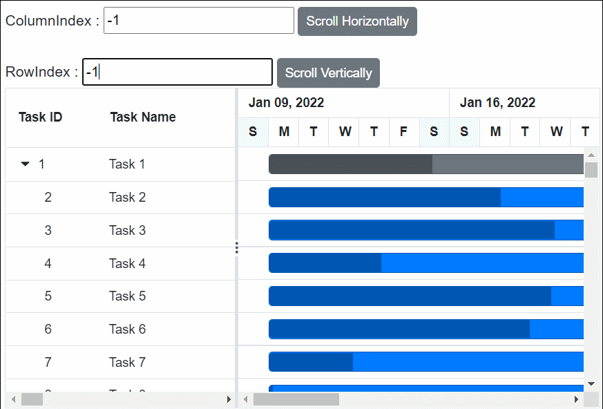
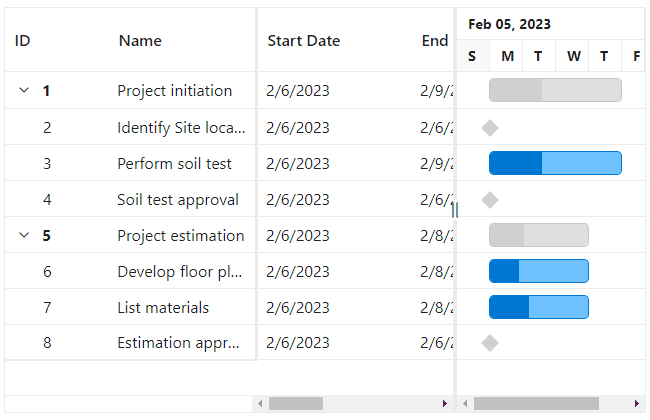

# Scrolling in Blazor Gantt Component

The scrollbar will be displayed in the Gantt when the content exceeds the element [Width](https://help.syncfusion.com/cr/blazor/Syncfusion.Blazor.Gantt.SfGantt-1.html#Syncfusion_Blazor_Gantt_SfGantt_1_Width) or [Height](https://help.syncfusion.com/cr/blazor/Syncfusion.Blazor.Gantt.SfGantt-1.html#Syncfusion_Blazor_Gantt_SfGantt_1_Height). The vertical and horizontal scrollbars will be displayed based on the following criteria:

The vertical scrollbar appears when the total height of rows present in the Gantt exceeds its element height. The horizontal scrollbar appears when the sum of the columns' width exceeds the Gantt element width. The [Height](https://help.syncfusion.com/cr/blazor/Syncfusion.Blazor.Gantt.SfGantt-1.html#Syncfusion_Blazor_Gantt_SfGantt_1_Height) and [Width](https://help.syncfusion.com/cr/blazor/Syncfusion.Blazor.Gantt.SfGantt-1.html#Syncfusion_Blazor_Gantt_SfGantt_1_Width) are used to set the Gantt height and width, respectively.

N> The default value for [Height](https://help.syncfusion.com/cr/blazor/Syncfusion.Blazor.Gantt.SfGantt-1.html#Syncfusion_Blazor_Gantt_SfGantt_1_Height) and [Width](https://help.syncfusion.com/cr/blazor/Syncfusion.Blazor.Gantt.SfGantt-1.html#Syncfusion_Blazor_Gantt_SfGantt_1_Width) is **auto**.


## Set width and height

To specify the [Height](https://help.syncfusion.com/cr/blazor/Syncfusion.Blazor.Gantt.SfGantt-1.html#Syncfusion_Blazor_Gantt_SfGantt_1_Height) and [Width](https://help.syncfusion.com/cr/blazor/Syncfusion.Blazor.Gantt.SfGantt-1.html#Syncfusion_Blazor_Gantt_SfGantt_1_Width) of the scroller in the pixel, set the pixel value to a number.

```cshtml
@using Syncfusion.Blazor.Gantt
<SfGantt @ref="Gantt" DataSource="@TaskCollection" Height="450px" Width="900px" Toolbar="@(new List<string>() { "Add","Edit" })">
    <GanttTaskFields Id="TaskId" Name="TaskName" StartDate="StartDate" EndDate="EndDate" Duration="Duration" Progress="Progress" ParentID="ParentId">
    </GanttTaskFields>
    <GanttColumns>
        <GanttColumn Field="TaskId" Width="100"></GanttColumn>
        <GanttColumn Field="TaskName" Width="250" AllowEditing="false"></GanttColumn>
        <GanttColumn Field="StartDate"></GanttColumn>
        <GanttColumn Field="Duration"></GanttColumn>
        <GanttColumn Field="Progress"></GanttColumn>
    </GanttColumns>
    <GanttEditSettings AllowEditing="true" AllowAdding="true"></GanttEditSettings>
</SfGantt>

@code{
    public SfGantt<TaskData> Gantt;
    private List<TaskData> TaskCollection { get; set; }
    protected override void OnInitialized()
    {
        this.TaskCollection = GetTaskCollection();
    }
    public class TaskData
    {
        public int TaskId { get; set; }
        public string TaskName { get; set; }
        public DateTime StartDate { get; set; }
        public DateTime EndDate { get; set; }
        public string Duration { get; set; }
        public int Progress { get; set; }
        public int? ParentId { get; set; }
    }

    public static List<TaskData> GetTaskCollection()
    {
        List<TaskData> Tasks = new List<TaskData>()
        {
            new TaskData() { TaskId = 1, TaskName = "Project initiation", StartDate = new DateTime(2022, 04, 05), EndDate = new DateTime(2022, 04, 21), },
            new TaskData() { TaskId = 2, TaskName = "Identify Site location", StartDate = new DateTime(2022, 04, 05), Duration = "0", Progress = 30, ParentId = 1 },
            new TaskData() { TaskId = 3, TaskName = "Perform soil test", StartDate = new DateTime(2022, 04, 05), Duration = "4", Progress = 40, ParentId = 1 },
            new TaskData() { TaskId = 4, TaskName = "Soil test approval", StartDate = new DateTime(2022, 04, 05), Duration = "0", Progress = 30, ParentId = 1 },
            new TaskData() { TaskId = 5, TaskName = "Project estimation", StartDate = new DateTime(2022, 04, 06), EndDate = new DateTime(2022, 04, 21), },
            new TaskData() { TaskId = 6, TaskName = "Develop floor plan for estimation", StartDate = new DateTime(2022, 04, 06), Duration = "3", Progress = 30, ParentId = 5 },
            new TaskData() { TaskId = 7, TaskName = "List materials", StartDate = new DateTime(2022, 04, 06), Duration = "3", Progress = 40, ParentId = 5 },
            new TaskData() { TaskId = 8, TaskName = "Estimation approval", StartDate = new DateTime(2022, 04, 06), Duration = "0", Progress = 30, ParentId = 5 }
        };
        return Tasks;
    }
}
```
## Responsive with the parent container

Specify the [Height](https://help.syncfusion.com/cr/blazor/Syncfusion.Blazor.Gantt.SfGantt-1.html#Syncfusion_Blazor_Gantt_SfGantt_1_Height) and [Width](https://help.syncfusion.com/cr/blazor/Syncfusion.Blazor.Gantt.SfGantt-1.html#Syncfusion_Blazor_Gantt_SfGantt_1_Width) as **100%** to make the Gantt element fill its parent container. Setting the `Height` to **100%** requires the Gantt parent element to have explicit height or you can use viewport height to set explicit height based on the browser layout.

```cshtml
@using Syncfusion.Blazor.Gantt
<div class="gantt">
    <SfGantt DataSource="@TaskCollection" Toolbar="@(new List<string>() { "Add" })" Height="100%" Width="100%">
        <GanttTaskFields Id="TaskId" Name="TaskName" StartDate="StartDate" EndDate="EndDate" Duration="Duration" Progress="Progress" ParentID="ParentId">
        </GanttTaskFields>
        <GanttEditSettings AllowAdding="true"></GanttEditSettings>
    </SfGantt>
</div>
<style>
    .gantt {
        height: 100vh;
        width: 100vw;
        border: 2px solid;
        padding: 20px;
        resize: both;
        overflow: auto;
    }
</style>
@code{
    private List<TaskData> TaskCollection { get; set; }
    protected override void OnInitialized()
    {
        this.TaskCollection = GetTaskCollection();
    }

    public class TaskData
    {
        public int TaskId { get; set; }
        public string TaskName { get; set; }
        public DateTime StartDate { get; set; }
        public DateTime EndDate { get; set; }
        public string Duration { get; set; }
        public int Progress { get; set; }
        public int? ParentId { get; set; }
    }

    public static List<TaskData> GetTaskCollection()
    {
        List<TaskData> Tasks = new List<TaskData>()
        {
            new TaskData() { TaskId = 1, TaskName = "Project initiation", StartDate = new DateTime(2022, 04, 05), EndDate = new DateTime(2022, 04, 21), },
            new TaskData() { TaskId = 2, TaskName = "Identify Site location", StartDate = new DateTime(2022, 04, 05), Duration = "0", Progress = 30, ParentId = 1 },
            new TaskData() { TaskId = 3, TaskName = "Perform soil test", StartDate = new DateTime(2022, 04, 05), Duration = "4", Progress = 40, ParentId = 1 },
            new TaskData() { TaskId = 4, TaskName = "Soil test approval", StartDate = new DateTime(2022, 04, 05), Duration = "0", Progress = 30, ParentId = 1 },
            new TaskData() { TaskId = 5, TaskName = "Project estimation", StartDate = new DateTime(2022, 04, 06), EndDate = new DateTime(2022, 04, 21), },
            new TaskData() { TaskId = 6, TaskName = "Develop floor plan for estimation", StartDate = new DateTime(2022, 04, 06), Duration = "3", Progress = 30, ParentId = 5 },
            new TaskData() { TaskId = 7, TaskName = "List materials", StartDate = new DateTime(2022, 04, 06), Duration = "3", Progress = 40, ParentId = 5 },
            new TaskData() { TaskId = 8, TaskName = "Estimation approval", StartDate = new DateTime(2022, 04, 06), Duration = "0", Progress = 30, ParentId = 5 }
        };
        return Tasks;
    }
}
```

## Auto scroll to taskbar

Taskbar that is not visible in the viewport can be auto scrolled to make it visible when selecting the row, by setting the [ScrollToTaskbarOnClick](https://help.syncfusion.com/cr/blazor/Syncfusion.Blazor.Gantt.SfGantt-1.html#Syncfusion_Blazor_Gantt_SfGantt_1_ScrollToTaskbarOnClick) property to true.

```cshtml
@using Syncfusion.Blazor.Gantt
<SfGantt DataSource="@TaskCollection" Height="450px" Width="700px" ScrollToTaskbarOnClick="true">
    <GanttTaskFields Id="TaskId" Name="TaskName" StartDate="StartDate" EndDate="EndDate" Duration="Duration" Progress="Progress" ParentID="ParentId">
    </GanttTaskFields>
</SfGantt>

@code {
    public List<TaskData> TaskCollection { get; set; }
    protected override void OnInitialized()
    {
        this.TaskCollection = GetTaskCollection();
    }

    public class TaskData
    {
        public int TaskId { get; set; }
        public string TaskName { get; set; }
        public DateTime StartDate { get; set; }
        public DateTime EndDate { get; set; }
        public string Duration { get; set; }
        public int Progress { get; set; }
        public int? ParentId { get; set; }
    }

    public static List<TaskData> GetTaskCollection()
    {
        List<TaskData> Tasks = new List<TaskData>() {
        new TaskData() { TaskId = 1, TaskName = "Project initiation", StartDate = new DateTime(2022, 04, 02), EndDate = new DateTime(2022, 04, 12)},
        new TaskData() { TaskId = 2, TaskName = "Identify Site location", StartDate = new DateTime(2022, 04, 02), Duration = "4", Progress = 30, ParentId = 1 },
        new TaskData() { TaskId = 3, TaskName = "Perform soil test", StartDate = new DateTime(2022, 04, 02), Duration = "4", Progress = 40, ParentId = 1 },
        new TaskData() { TaskId = 4, TaskName = "Soil test approval", StartDate = new DateTime(2022, 04, 02), Duration = "5", Progress = 30, ParentId = 1 },
        new TaskData() { TaskId = 5, TaskName = "Project estimation", StartDate = new DateTime(2022, 04, 12), EndDate = new DateTime(2022, 04, 21) },
        new TaskData() { TaskId = 6, TaskName = "Develop floor plan for estimation", StartDate = new DateTime(2022, 04, 12), Duration = "3", Progress = 30, ParentId = 5 },
        new TaskData() { TaskId = 7, TaskName = "List materials", StartDate = new DateTime(2022, 05, 13), Duration = "3", Progress = 40, ParentId = 5 },
        new TaskData() { TaskId = 8, TaskName = "Estimation approval", StartDate = new DateTime(2022, 05, 16), Duration = "0", Progress = 30, ParentId = 5 }
    };
        return Tasks;
    }
}
```


## Scroll the content by external button

This section shows you how to invoke a [ScrollIntoViewAsync](https://help.syncfusion.com/cr/blazor/Syncfusion.Blazor.Gantt.SfGantt-1.html#Syncfusion_Blazor_Gantt_SfGantt_1_ScrollIntoViewAsync_System_Int32_System_Int32_) method to scroll the Gantt chart content programmatically by passing column index or row index as parameter.

 ```cshtml
@using Syncfusion.Blazor.Gantt
@using Syncfusion.Blazor.Buttons

ColumnIndex : <input @bind-value = "@ColumnIndex" />
<SfButton @onclick="Scroll" Content="Scroll Horizontally"></SfButton>
<br><br>
RowIndex : <input @bind-value = "@RowIndex" />
<SfButton @onclick="Scroll" Content="Scroll Vertically"></SfButton>
<SfGantt @ref="Gantt" ID="Gantt" DataSource="@TaskCollection" 
    EnableVirtualization="true" EnableColumnVirtualization="true"  Height="350px" Width="650px">
    <GanttTaskFields Id="ProjectId" Name="ProjectName" StartDate="ProjectStartDate" EndDate="ProjectEndDate" Duration="ProjectDuration" Progress="ProjectProgress" Dependency="Predecessor" ParentID="ParentId">
    </GanttTaskFields>
     <GanttColumns>
        <GanttColumn Field="ProjectId" HeaderText="Task ID"></GanttColumn>
        <GanttColumn Field="ProjectName" HeaderText="Task Name"> </GanttColumn>
        <GanttColumn Field="ProjectStartDate" HeaderText="Start Date"></GanttColumn>
        <GanttColumn Field="ProjectEndDate" HeaderText="End Date"></GanttColumn>
        <GanttColumn Field="ProjectDuration" HeaderText="Duration"></GanttColumn>
        <GanttColumn Field="Field1" HeaderText="Rebounds"></GanttColumn>
        <GanttColumn Field="FIELD2" HeaderText="Year"></GanttColumn>
        <GanttColumn Field="FIELD3" HeaderText="Stint"></GanttColumn>
        <GanttColumn Field="FIELD4" HeaderText="TMID"> </GanttColumn>
        <GanttColumn Field="FIELD5" HeaderText="LGID"></GanttColumn>
        <GanttColumn Field="FIELD6" HeaderText="GP"></GanttColumn>
        <GanttColumn Field="Field7" HeaderText="GS"></GanttColumn>
        <GanttColumn Field="Field8" HeaderText="Minutes"></GanttColumn>
        <GanttColumn Field="Field9" HeaderText="Points"></GanttColumn>
        <GanttColumn Field="Field10" HeaderText="ORebounds"></GanttColumn>
        <GanttColumn Field="Field11" HeaderText="DRebounds"></GanttColumn>
    </GanttColumns>
</SfGantt>
@code {
    public SfGantt<TaskData> Gantt;
    public List<TaskData> TaskCollection { get; set; }

    public int ColumnIndex { get; set; } = -1;
    public int RowIndex { get; set; } = -1;
    protected override void OnInitialized()
    {
        this.TaskCollection = VirtualData.GetTreeVirtualData();
    }
    public async Task Scroll()
    {
        await Gantt.ScrollIntoViewAsync(ColumnIndex, RowIndex);
    }
    public class VirtualData
    {
        public static List<TaskData> GetTreeVirtualData()
        {
            string[] Names = new string[] { "VINET", "TOMSP", "HANAR", "VICTE", "SUPRD", "HANAR", "CHOPS", "RICSU", "WELLI", "HILAA", "ERNSH", "CENTC", "OTTIK", "QUEDE", "RATTC", "ERNSH", "FOLKO", "BLONP", "WARTH", "FRANK", "GROSR", "WHITC", "WARTH", "SPLIR", "RATTC", "QUICK", "VINET", "MAGAA", "TORTU", "MORGK", "BERGS", "LEHMS", "BERGS", "ROMEY", "ROMEY", "LILAS", "LEHMS", "QUICK", "QUICK", "RICAR", "REGGC", "BSBEV", "COMMI", "QUEDE", "TRADH", "TORTU", "RATTC", "VINET", "LILAS", "BLONP", "HUNGO", "RICAR", "MAGAA", "WANDK", "SUPRD", "GODOS", "TORTU", "OLDWO", "ROMEY", "LONEP", "ANATR", "HUNGO", "THEBI", "DUMON", "WANDK", "QUICK", "RATTC", "ISLAT", "RATTC", "LONEP", "ISLAT", "TORTU", "WARTH", "ISLAT", "PERIC", "KOENE", "SAVEA", "KOENE", "BOLID", "FOLKO", "FURIB", "SPLIR", "LILAS", "BONAP", "MEREP", "WARTH", "VICTE", "HUNGO", "PRINI", "FRANK", "OLDWO", "MEREP", "BONAP", "SIMOB", "FRANK", "LEHMS", "WHITC", "QUICK", "RATTC", "FAMIA" };
            List<TaskData> DataCollection = new List<TaskData>();
            Random random = new Random();
            var x = 0;
            for (var i = 1; i <= 100; i++)
            {
                var name = random.Next(0, 100);
                TaskData Parent = new TaskData()
                {
                    ProjectId = ++x,
                    ProjectName = "Task " + x,
                    ProjectStartDate = new DateTime(2022, 1, 9),
                    ProjectEndDate = new DateTime(2022, 1, 13),
                    ProjectDuration = "10",
                    ProjectProgress = random.Next(100),
                    ParentId = null,
                    Predecessor = null,
                };
                DataCollection.Add(Parent);
                for (var j = 1; j <= 50; j++)
                {
                    var childName = random.Next(0, 100);
                    DataCollection.Add(new TaskData()
                    {
                        ProjectId = ++x,
                        ProjectName = "Task " + x,
                        ProjectStartDate = new DateTime(2022, 1, 9),
                        ProjectEndDate = new DateTime(2022, 1, 13),
                        ProjectDuration = "10",
                        ProjectProgress = random.Next(100),
                        ParentId = Parent.ProjectId,
                        Predecessor = i + "FS",
                        Field1 = Names[name],
                        FIELD2 = 1967 + random.Next(0, 10),
                        FIELD3 = 395 + random.Next(100, 600),
                        FIELD4 = 87 + random.Next(50, 250),
                        FIELD5 = 410 + random.Next(100, 600),
                        FIELD6 = 67 + random.Next(50, 250),
                        Field7 = (int)Math.Floor(random.NextDouble() * 100),
                        Field8 = (int)Math.Floor(random.NextDouble() * 10),
                        Field9 = (int)Math.Floor(random.NextDouble() * 10),
                        Field10 = (int)Math.Floor(random.NextDouble() * 100),
                        Field11 = (int)Math.Floor(random.NextDouble() * 100),
                        Field12 = (int)Math.Floor(random.NextDouble() * 1000),
                    });
                }
            }
            return DataCollection;
        }
    }
    public class TaskData
    {
        public int ProjectId { get; set; }
        public string ProjectName { get; set; }
        public DateTime ProjectStartDate { get; set; }
        public DateTime ProjectEndDate { get; set; }
        public string ProjectDuration { get; set; }
        public int ProjectProgress { get; set; }
        public int? ParentId { get; set; }
        public string Predecessor { get; set; }
        public string Field1 { get; set; }
        public int FIELD2 { get; set; }
        public int FIELD3 { get; set; }
        public int FIELD4 { get; set; }
        public int FIELD5 { get; set; }
        public int FIELD6 { get; set; }
        public int Field7 { get; set; }
        public int Field8 { get; set; }
        public int Field9 { get; set; }
        public int Field10 { get; set; }
        public int Field11 { get; set; }
        public int Field12 { get; set; }
    }
}
```


* You can also programmatically scroll to the taskbar using  [ScrollToTaskbarAsync](https://help.syncfusion.com/cr/blazor/Syncfusion.Blazor.Gantt.SfGantt-1.html#Syncfusion_Blazor_Gantt_SfGantt_1_ScrollToTaskbarAsync_System_Int32_) method and scroll to the timeline using [ScrollToTimelineAsync](https://help.syncfusion.com/cr/blazor/Syncfusion.Blazor.Gantt.SfGantt-1.html#Syncfusion_Blazor_Gantt_SfGantt_1_ScrollToTimelineAsync_System_DateTime_).

## Frozen Columns

Frozen columns provide an option to make certain columns visible on the left side of the Gantt Chart while scrolling. 

In the demo, the value of [FrozenColumns](https://help.syncfusion.com/cr/blazor/Syncfusion.Blazor.Gantt.SfGantt-1.html#Syncfusion_Blazor_Gantt_SfGantt_1_FrozenColumns) is set to 2. Therefore, the left two columns remain fixed and do not move while the user scrolls horizontally.

```cshtml
@using Syncfusion.Blazor.Gantt
<SfGantt DataSource="@TaskCollection" Height="450px" Width="700px" FrozenColumns="2">
    <GanttTaskFields Id="TaskId" Name="TaskName" StartDate="StartDate" EndDate="EndDate" Duration="Duration" Progress="Progress" ParentID="ParentId">
    </GanttTaskFields>
    <GanttSplitterSettings Position ="70%"></GanttSplitterSettings>
</SfGantt>

@code {
    private List<TaskData> TaskCollection { get; set; }
    protected override void OnInitialized()
    {
        this.TaskCollection = GetTaskCollection();
    }

    public class TaskData
    {
        public int TaskId { get; set; }
        public string TaskName { get; set; }
        public DateTime StartDate { get; set; }
        public DateTime EndDate { get; set; }
        public string Duration { get; set; }
        public int Progress { get; set; }
        public int? ParentId { get; set; }
    }

    public static List<TaskData> GetTaskCollection()
    {
        List<TaskData> Tasks = new List<TaskData>() {
        new TaskData() { TaskId = 1, TaskName = "Project initiation", StartDate = new DateTime(2023, 02, 05), EndDate = new DateTime(2022, 02, 21) },
        new TaskData() { TaskId = 2, TaskName = "Identify Site location", StartDate = new DateTime(2023, 02, 05), Duration = "0", Progress = 30, ParentId = 1 },
        new TaskData() { TaskId = 3, TaskName = "Perform soil test", StartDate = new DateTime(2023, 02, 05), Duration = "4", Progress = 40, ParentId = 1 },
        new TaskData() { TaskId = 4, TaskName = "Soil test approval", StartDate = new DateTime(2023, 02, 05), Duration = "0", Progress = 30, ParentId = 1 },
        new TaskData() { TaskId = 5, TaskName = "Project estimation", StartDate = new DateTime(2023, 02, 06), EndDate = new DateTime(2023, 02, 21) },
        new TaskData() { TaskId = 6, TaskName = "Develop floor plan for estimation", StartDate = new DateTime(2023, 02, 06), Duration = "3", Progress = 30, ParentId = 5 },
        new TaskData() { TaskId = 7, TaskName = "List materials", StartDate = new DateTime(2023, 02, 06), Duration = "3", Progress = 40, ParentId = 5 },
        new TaskData() { TaskId = 8, TaskName = "Estimation approval", StartDate = new DateTime(2023, 02, 06), Duration = "0", Progress = 30, ParentId = 5 }
    };
        return Tasks;
    }
}
```


### Freeze particular column

To freeze a specific column in the Gantt Chart, you can use the [IsFrozen](https://help.syncfusion.com/cr/blazor/Syncfusion.Blazor.Gantt.GanttColumn.html#Syncfusion_Blazor_Gantt_GanttColumn_IsFrozen) property of the Gantt Column component.

In this demo, the columns with the field names `TaskID` and `TaskName` are frozen by setting the IsFrozen property of the corresponding Gantt Columns to true.

```cshtml
@using Syncfusion.Blazor.Gantt
<SfGantt DataSource="@TaskCollection" Height="450px" Width="700px" >
    <GanttTaskFields Id="TaskId" Name="TaskName" StartDate="StartDate" EndDate="EndDate" Duration="Duration" Progress="Progress" ParentID="ParentId">
    </GanttTaskFields>
    <GanttColumns>
        <GanttColumn Field="TaskId" IsFrozen=true></GanttColumn>
        <GanttColumn Field="TaskName" IsFrozen=true></GanttColumn>
        <GanttColumn Field="StartDate"></GanttColumn>
        <GanttColumn Field="EndDate"></GanttColumn>
        <GanttColumn Field="Duration"></GanttColumn>
        <GanttColumn Field="Progress"></GanttColumn>
    </GanttColumns>
    <GanttSplitterSettings Position="70%"></GanttSplitterSettings>
</SfGantt>

@code {
    private List<TaskData> TaskCollection { get; set; }
    protected override void OnInitialized()
    {
        this.TaskCollection = GetTaskCollection();
    }

    public class TaskData
    {
        public int TaskId { get; set; }
        public string TaskName { get; set; }
        public DateTime StartDate { get; set; }
        public DateTime EndDate { get; set; }
        public string Duration { get; set; }
        public int Progress { get; set; }
        public int? ParentId { get; set; }
    }

    public static List<TaskData> GetTaskCollection()
    {
        List<TaskData> Tasks = new List<TaskData>() {
        new TaskData() { TaskId = 1, TaskName = "Project initiation", StartDate = new DateTime(2023, 02, 05), EndDate = new DateTime(2022, 02, 21) },
        new TaskData() { TaskId = 2, TaskName = "Identify Site location", StartDate = new DateTime(2023, 02, 05), Duration = "0", Progress = 30, ParentId = 1 },
        new TaskData() { TaskId = 3, TaskName = "Perform soil test", StartDate = new DateTime(2023, 02, 05), Duration = "4", Progress = 40, ParentId = 1 },
        new TaskData() { TaskId = 4, TaskName = "Soil test approval", StartDate = new DateTime(2023, 02, 05), Duration = "0", Progress = 30, ParentId = 1 },
        new TaskData() { TaskId = 5, TaskName = "Project estimation", StartDate = new DateTime(2023, 02, 06), EndDate = new DateTime(2023, 02, 21) },
        new TaskData() { TaskId = 6, TaskName = "Develop floor plan for estimation", StartDate = new DateTime(2023, 02, 06), Duration = "3", Progress = 30, ParentId = 5 },
        new TaskData() { TaskId = 7, TaskName = "List materials", StartDate = new DateTime(2023, 02, 06), Duration = "3", Progress = 40, ParentId = 5 },
        new TaskData() { TaskId = 8, TaskName = "Estimation approval", StartDate = new DateTime(2023, 02, 06), Duration = "0", Progress = 30, ParentId = 5 }
    };
        return Tasks;
    }
}
```



### Freeze direction

You can freeze Gantt columns on the left or right side by using the [Freeze](https://help.syncfusion.com/cr/blazor/Syncfusion.Blazor.Gantt.GanttColumn.html#Syncfusion_Blazor_Gantt_GanttColumn_Freeze) property, while the remaining columns remain movable. The Gantt chart will automatically adjust the column positions based on the Freeze value. Additionally, the `IsFrozen` property should be set to true for the frozen columns.

There are two types of Freeze directions:

[FreezeDirection.Left](https://help.syncfusion.com/cr/blazor/Syncfusion.Blazor.Grids.FreezeDirection.html#Syncfusion_Blazor_Grids_FreezeDirection_Left): Allows you to freeze columns on the left side.
[FreezeDirection.Right](https://help.syncfusion.com/cr/blazor/Syncfusion.Blazor.Grids.FreezeDirection.html#Syncfusion_Blazor_Grids_FreezeDirection_Right): Allows you to freeze columns on the right side.

In this demo, the `TaskId` column is frozen on the left, while the `TaskName` column is frozen on the right side of the content table.

```cshtml
@using Syncfusion.Blazor.Gantt
<SfGantt DataSource="@TaskCollection" Height="450px" Width="700px" >
    <GanttTaskFields Id="TaskId" Name="TaskName" StartDate="StartDate" EndDate="EndDate" Duration="Duration" Progress="Progress" ParentID="ParentId">
    </GanttTaskFields>
    <GanttColumns>
        <GanttColumn Field="TaskId" IsFrozen=true Freeze="Syncfusion.Blazor.Grids.FreezeDirection.Left"></GanttColumn>
        <GanttColumn Field="TaskName" IsFrozen=true Freeze="Syncfusion.Blazor.Grids.FreezeDirection.Right"></GanttColumn>
        <GanttColumn Field="StartDate"></GanttColumn>
        <GanttColumn Field="EndDate"></GanttColumn>
        <GanttColumn Field="Duration"></GanttColumn>
        <GanttColumn Field="Progress"></GanttColumn>
    </GanttColumns>
    <GanttSplitterSettings Position="50%"></GanttSplitterSettings>
</SfGantt>

@code {
    private List<TaskData> TaskCollection { get; set; }
    protected override void OnInitialized()
    {
        this.TaskCollection = GetTaskCollection();
    }

    public class TaskData
    {
        public int TaskId { get; set; }
        public string TaskName { get; set; }
        public DateTime StartDate { get; set; }
        public DateTime EndDate { get; set; }
        public string Duration { get; set; }
        public int Progress { get; set; }
        public int? ParentId { get; set; }
    }

    public static List<TaskData> GetTaskCollection()
    {
        List<TaskData> Tasks = new List<TaskData>() {
        new TaskData() { TaskId = 1, TaskName = "Project initiation", StartDate = new DateTime(2023, 02, 05), EndDate = new DateTime(2022, 02, 21) },
        new TaskData() { TaskId = 2, TaskName = "Identify Site location", StartDate = new DateTime(2023, 02, 05), Duration = "0", Progress = 30, ParentId = 1 },
        new TaskData() { TaskId = 3, TaskName = "Perform soil test", StartDate = new DateTime(2023, 02, 05), Duration = "4", Progress = 40, ParentId = 1 },
        new TaskData() { TaskId = 4, TaskName = "Soil test approval", StartDate = new DateTime(2023, 02, 05), Duration = "0", Progress = 30, ParentId = 1 },
        new TaskData() { TaskId = 5, TaskName = "Project estimation", StartDate = new DateTime(2023, 02, 06), EndDate = new DateTime(2023, 02, 21) },
        new TaskData() { TaskId = 6, TaskName = "Develop floor plan for estimation", StartDate = new DateTime(2023, 02, 06), Duration = "3", Progress = 30, ParentId = 5 },
        new TaskData() { TaskId = 7, TaskName = "List materials", StartDate = new DateTime(2023, 02, 06), Duration = "3", Progress = 40, ParentId = 5 },
        new TaskData() { TaskId = 8, TaskName = "Estimation approval", StartDate = new DateTime(2023, 02, 06), Duration = "0", Progress = 30, ParentId = 5 }
    };
        return Tasks;
    }
}
```


### Add or remove frozen columns by dragging the column separator

You can add or remove frozen columns in the Gantt Chart by dragging and dropping the column separator. To enable this feature, set the [AllowFreezeLineMoving](https://help.syncfusion.com/cr/blazor/Syncfusion.Blazor.Gantt.SfGantt-1.html#Syncfusion_Blazor_Gantt_SfGantt_1_AllowFreezeLineMoving) property to true.

```cshtml
@using Syncfusion.Blazor.Gantt
<SfGantt DataSource="@TaskCollection" Height="450px" Width="700px" AllowFreezeLineMoving=true>
    <GanttTaskFields Id="TaskId" Name="TaskName" StartDate="StartDate" EndDate="EndDate" Duration="Duration" Progress="Progress" ParentID="ParentId">
    </GanttTaskFields>
    <GanttColumns>
        <GanttColumn Field="TaskId" IsFrozen=true Freeze="Syncfusion.Blazor.Grids.FreezeDirection.Left"></GanttColumn>
        <GanttColumn Field="TaskName" IsFrozen=true Freeze="Syncfusion.Blazor.Grids.FreezeDirection.Right"></GanttColumn>
        <GanttColumn Field="StartDate"></GanttColumn>
        <GanttColumn Field="EndDate"></GanttColumn>
        <GanttColumn Field="Duration"></GanttColumn>
        <GanttColumn Field="Progress"></GanttColumn>
    </GanttColumns>
    <GanttSplitterSettings Position="70%"></GanttSplitterSettings>
</SfGantt>

@code {
    private List<TaskData> TaskCollection { get; set; }
    protected override void OnInitialized()
    {
        this.TaskCollection = GetTaskCollection();
    }

    public class TaskData
    {
        public int TaskId { get; set; }
        public string TaskName { get; set; }
        public DateTime StartDate { get; set; }
        public DateTime EndDate { get; set; }
        public string Duration { get; set; }
        public int Progress { get; set; }
        public int? ParentId { get; set; }
    }

    public static List<TaskData> GetTaskCollection()
    {
        List<TaskData> Tasks = new List<TaskData>() {
        new TaskData() { TaskId = 1, TaskName = "Project initiation", StartDate = new DateTime(2023, 02, 05), EndDate = new DateTime(2022, 02, 21) },
        new TaskData() { TaskId = 2, TaskName = "Identify Site location", StartDate = new DateTime(2023, 02, 05), Duration = "0", Progress = 30, ParentId = 1 },
        new TaskData() { TaskId = 3, TaskName = "Perform soil test", StartDate = new DateTime(2023, 02, 05), Duration = "4", Progress = 40, ParentId = 1 },
        new TaskData() { TaskId = 4, TaskName = "Soil test approval", StartDate = new DateTime(2023, 02, 05), Duration = "0", Progress = 30, ParentId = 1 },
        new TaskData() { TaskId = 5, TaskName = "Project estimation", StartDate = new DateTime(2023, 02, 06), EndDate = new DateTime(2023, 02, 21) },
        new TaskData() { TaskId = 6, TaskName = "Develop floor plan for estimation", StartDate = new DateTime(2023, 02, 06), Duration = "3", Progress = 30, ParentId = 5 },
        new TaskData() { TaskId = 7, TaskName = "List materials", StartDate = new DateTime(2023, 02, 06), Duration = "3", Progress = 40, ParentId = 5 },
        new TaskData() { TaskId = 8, TaskName = "Estimation approval", StartDate = new DateTime(2023, 02, 06), Duration = "0", Progress = 30, ParentId = 5 }
    };
        return Tasks;
    }
}
```


> If no columns are specified as frozen, the frozen column separator will be displayed at the left and right ends of the Gantt Chart. You can dynamically change the frozen columns by dragging the column separator to the desired position.

### Change default frozen line color

You can change the color of the default frozen line in the Gantt Chart by customizing the CSS styles. The following demo provides an example of how to change the default frozen line color to blue. You can modify this code to change the color to a different one of your choice.

```cshtml
@using Syncfusion.Blazor.Gantt
<SfGantt DataSource="@TaskCollection" Height="450px" Width="700px" FrozenColumns="2" AllowFreezeLineMoving=true>
    <GanttTaskFields Id="TaskId" Name="TaskName" StartDate="StartDate" EndDate="EndDate" Duration="Duration" Progress="Progress" ParentID="ParentId">
    </GanttTaskFields>
    <GanttSplitterSettings Position="60%"></GanttSplitterSettings>
</SfGantt>
<style>
    .e-grid .e-frozenheader > .e-table,
    .e-grid .e-frozencontent > .e-table,
    .e-grid .e-frozencontent .e-virtualtable > .e-table,
    .e-grid .e-frozenheader .e-virtualtable > .e-table {
        border-right-color: blue;
    }

    .e-grid .e-frozenhdrcont .e-headercontent > .e-table,
    .e-grid .e-frozenhdrcont .e-frozenheader > .e-table,
    .e-grid .e-frozenhdrcont .e-movableheader > .e-table,
    .e-grid .e-frozenhdrcont .e-headercontent .e-virtualtable > .e-table {
        border-bottom-color: blue;
    }
</style>
@code {
    private List<TaskData> TaskCollection { get; set; }
    protected override void OnInitialized()
    {
        this.TaskCollection = GetTaskCollection();
    }

    public class TaskData
    {
        public int TaskId { get; set; }
        public string TaskName { get; set; }
        public DateTime StartDate { get; set; }
        public DateTime EndDate { get; set; }
        public string Duration { get; set; }
        public int Progress { get; set; }
        public int? ParentId { get; set; }
    }

    public static List<TaskData> GetTaskCollection()
    {
        List<TaskData> Tasks = new List<TaskData>() {
        new TaskData() { TaskId = 1, TaskName = "Project initiation", StartDate = new DateTime(2023, 02, 05), EndDate = new DateTime(2022, 02, 21) },
        new TaskData() { TaskId = 2, TaskName = "Identify Site location", StartDate = new DateTime(2023, 02, 05), Duration = "0", Progress = 30, ParentId = 1 },
        new TaskData() { TaskId = 3, TaskName = "Perform soil test", StartDate = new DateTime(2023, 02, 05), Duration = "4", Progress = 40, ParentId = 1 },
        new TaskData() { TaskId = 4, TaskName = "Soil test approval", StartDate = new DateTime(2023, 02, 05), Duration = "0", Progress = 30, ParentId = 1 },
        new TaskData() { TaskId = 5, TaskName = "Project estimation", StartDate = new DateTime(2023, 02, 06), EndDate = new DateTime(2023, 02, 21) },
        new TaskData() { TaskId = 6, TaskName = "Develop floor plan for estimation", StartDate = new DateTime(2023, 02, 06), Duration = "3", Progress = 30, ParentId = 5 },
        new TaskData() { TaskId = 7, TaskName = "List materials", StartDate = new DateTime(2023, 02, 06), Duration = "3", Progress = 40, ParentId = 5 },
        new TaskData() { TaskId = 8, TaskName = "Estimation approval", StartDate = new DateTime(2023, 02, 06), Duration = "0", Progress = 30, ParentId = 5 }
    };
        return Tasks;
    }
}
```


### Limitations

- The `Freeze` and `FrozenColumns` properties cannot be used together as they are incompatible.

- The `IsFrozen` property cannot be changed dynamically. Once the column is frozen, it remains frozen until the chart is reloaded.

- The Gantt Chart does not support Right-to-Left (RTL) mode when using frozen columns.