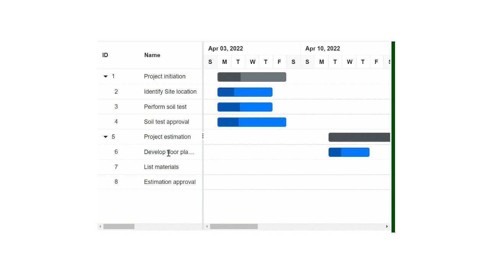

# Scrolling in Blazor Gantt Component

The scrollbar will be displayed in the Gantt when the content exceeds the element [Width](https://help.syncfusion.com/cr/blazor/Syncfusion.Blazor.Gantt.SfGantt-1.html#Syncfusion_Blazor_Gantt_SfGantt_1_Width) or [Height](https://help.syncfusion.com/cr/blazor/Syncfusion.Blazor.Gantt.SfGantt-1.html#Syncfusion_Blazor_Gantt_SfGantt_1_Height). The vertical and horizontal scrollbars will be displayed based on the following criteria:

The vertical scrollbar appears when the total height of rows present in the Gantt exceeds its element height. The horizontal scrollbar appears when the sum of the columns' width exceeds the Gantt element width. The [Height](https://help.syncfusion.com/cr/blazor/Syncfusion.Blazor.Gantt.SfGantt-1.html#Syncfusion_Blazor_Gantt_SfGantt_1_Height) and [Width](https://help.syncfusion.com/cr/blazor/Syncfusion.Blazor.Gantt.SfGantt-1.html#Syncfusion_Blazor_Gantt_SfGantt_1_Width) are used to set the Gantt height and width, respectively.

> The default value for [Height](https://help.syncfusion.com/cr/blazor/Syncfusion.Blazor.Gantt.SfGantt-1.html#Syncfusion_Blazor_Gantt_SfGantt_1_Height) and [Width](https://help.syncfusion.com/cr/blazor/Syncfusion.Blazor.Gantt.SfGantt-1.html#Syncfusion_Blazor_Gantt_SfGantt_1_Width) is **auto**.


## Set width and height

To specify the [Height](https://help.syncfusion.com/cr/blazor/Syncfusion.Blazor.Gantt.SfGantt-1.html#Syncfusion_Blazor_Gantt_SfGantt_1_Height) and [Width](https://help.syncfusion.com/cr/blazor/Syncfusion.Blazor.Gantt.SfGantt-1.html#Syncfusion_Blazor_Gantt_SfGantt_1_Width) of the scroller in the pixel, set the pixel value to a number.

```cshtml
@using Syncfusion.Blazor.Gantt
<SfGantt @ref="Gantt" DataSource="@TaskCollection" Height="450px" Width="900px" Toolbar="@(new List<string>() { "Add","Edit" })">
    <GanttTaskFields Id="TaskId" Name="TaskName" StartDate="StartDate" EndDate="EndDate" Duration="Duration" Progress="Progress" Child="SubTasks">
    </GanttTaskFields>
    <GanttColumns>
        <GanttColumn Field="TaskId" Width="100"></GanttColumn>
        <GanttColumn Field="TaskName" Width="250" AllowEditing="false"></GanttColumn>
        <GanttColumn Field="StartDate"></GanttColumn>
        <GanttColumn Field="Duration"></GanttColumn>
        <GanttColumn Field="Progress"></GanttColumn>
    </GanttColumns>
    <GanttEditSettings AllowEditing="true" AllowAdding="true"></GanttEditSettings>
</SfGantt>

@code{
    public SfGantt<TaskData> Gantt;
    public List<TaskData> TaskCollection { get; set; }
    protected override void OnInitialized()
    {
        this.TaskCollection = GetTaskCollection();
    }
    public class TaskData
    {
        public int TaskId { get; set; }
        public string TaskName { get; set; }
        public DateTime StartDate { get; set; }
        public DateTime EndDate { get; set; }
        public string Duration { get; set; }
        public int Progress { get; set; }
        public List<TaskData> SubTasks { get; set; }
    }

    public static List<TaskData> GetTaskCollection()
    {
        List<TaskData> Tasks = new List<TaskData>() {
            new TaskData() {TaskId = 1,TaskName = "Project initiation",StartDate = new DateTime(2019, 04, 02),EndDate = new DateTime(2019, 04, 21),SubTasks = (new List <TaskData> () {new TaskData() {TaskId = 2,TaskName = "Identify Site location",StartDate = new DateTime(2019, 04, 02),Duration = "0",Progress = 30,},new TaskData() {TaskId = 3,TaskName = "Perform soil test",StartDate = new DateTime(2019, 04, 02),Duration = "4",Progress = 40,},new TaskData() {TaskId = 4, TaskName = "Soil test approval",StartDate = new DateTime(2019, 04, 02),Duration = "0",Progress = 30,}})},
            new TaskData() {TaskId = 5,TaskName = "Project estimation",StartDate = new DateTime(2019, 04, 02),EndDate = new DateTime(2019, 04, 21),SubTasks = (new List <TaskData> () {new TaskData() {TaskId = 6,TaskName = "Develop floor plan for estimation",StartDate = new DateTime(2019, 04, 04),Duration = "3",Progress = 30,},new TaskData() {TaskId = 7,TaskName = "List materials",StartDate = new DateTime(2019, 04, 04),Duration = "3",Progress = 40,},new TaskData() {TaskId = 8,TaskName = "Estimation approval",StartDate = new DateTime(2019, 04, 04),Duration = "0",Progress = 30,}})}
        };
        return Tasks;
    }
}
```
## Responsive with the parent container

Specify the [Height](https://help.syncfusion.com/cr/blazor/Syncfusion.Blazor.Gantt.SfGantt-1.html#Syncfusion_Blazor_Gantt_SfGantt_1_Height) and [Width](https://help.syncfusion.com/cr/blazor/Syncfusion.Blazor.Gantt.SfGantt-1.html#Syncfusion_Blazor_Gantt_SfGantt_1_Width) as **100%** to make the Gantt element fill its parent container. Setting the [Height](https://help.syncfusion.com/cr/blazor/Syncfusion.Blazor.Gantt.SfGantt-1.html#Syncfusion_Blazor_Gantt_SfGantt_1_Height) to **100%** requires the Gantt parent element to have explicit height or you can use viewport height to set explicit height based on the browser layout.

```cshtml
@using Syncfusion.Blazor.Gantt
<div class="gantt">
    <SfGantt DataSource="@TaskCollection" Toolbar="@(new List<string>() { "Add" })" Height="100%" Width="100%">
        <GanttTaskFields Id="TaskId" Name="TaskName" StartDate="StartDate" EndDate="EndDate" Duration="Duration" Progress="Progress" Child="SubTasks">
        </GanttTaskFields>
        <GanttEditSettings AllowAdding="true"></GanttEditSettings>
    </SfGantt>
</div>
<style>
    .gantt {
        height: 100vh;
        width: 100vw;
        border: 2px solid;
        padding: 20px;
        resize: both;
        overflow: auto;
    }
</style>
@code{
    public List<TaskData> TaskCollection { get; set; }
    protected override void OnInitialized()
    {
        this.TaskCollection = GetTaskCollection();
    }

    public class TaskData
    {
        public int TaskId { get; set; }
        public string TaskName { get; set; }
        public DateTime StartDate { get; set; }
        public DateTime EndDate { get; set; }
        public string Duration { get; set; }
        public int Progress { get; set; }
        public List<TaskData> SubTasks { get; set; }
    }

    public static List<TaskData> GetTaskCollection()
    {
        List<TaskData> Tasks = new List<TaskData>()
    {
        new TaskData() {TaskId = 1,TaskName = "Project initiation",StartDate = new DateTime(2019, 04, 02),EndDate = new DateTime(2019, 04, 21),SubTasks = (new List <TaskData> () {new TaskData() {TaskId = 2,TaskName = "Identify Site location",StartDate = new DateTime(2019, 04, 02),Duration = "0",Progress = 30,},new TaskData() {TaskId = 3,TaskName = "Perform soil test",StartDate = new DateTime(2019, 04, 02),Duration = "4",Progress = 40,},new TaskData() {TaskId = 4,TaskName = "Soil test approval",StartDate = new DateTime(2019, 04, 02),Duration = "0",Progress = 30},})},
        new TaskData() {TaskId = 5,TaskName = "Project estimation",StartDate = new DateTime(2019, 04, 02),EndDate = new DateTime(2019, 04, 21),SubTasks = (new List <TaskData> () {new TaskData() {TaskId = 6,TaskName = "Develop floor plan for estimation",StartDate = new DateTime(2019, 04, 04),Duration = "3",Progress = 30,},new TaskData() {TaskId = 7,TaskName = "List materials",StartDate = new DateTime(2019, 04, 04),Duration = "3",Progress = 40},new TaskData() {TaskId = 8,TaskName = "Estimation approval",StartDate = new DateTime(2019, 04, 04),Duration = "0",Progress = 30,}})}
    };
        return Tasks;
    }
}
```

## Auto scroll to taskbar

Taskbar that is not visible in the viewport can be auto scrolled to make it visible when selecting the row, by enabling the [ScrollToTaskbarOnClick](https://help.syncfusion.com/cr/blazor/Syncfusion.Blazor.Gantt.SfGantt-1.html#Syncfusion_Blazor_Gantt_SfGantt_1_ScrollToTaskbarOnClick) property to true.

```cshtml
@using Syncfusion.Blazor.Gantt
<SfGantt DataSource="@TaskCollection" Height="450px" Width="700px" ScrollToTaskbarOnClick="true">
    <GanttTaskFields Id="TaskId" Name="TaskName" StartDate="StartDate" EndDate="EndDate" Duration="Duration" Progress="Progress" ParentID="ParentId">
    </GanttTaskFields>
</SfGantt>

@code {
    public List<TaskData> TaskCollection { get; set; }
    protected override void OnInitialized()
    {
        this.TaskCollection = GetTaskCollection();
    }

    public class TaskData
    {
        public int TaskId { get; set; }
        public string TaskName { get; set; }
        public DateTime StartDate { get; set; }
        public DateTime EndDate { get; set; }
        public string Duration { get; set; }
        public int Progress { get; set; }
        public int? ParentId { get; set; }
    }

    public static List<TaskData> GetTaskCollection()
    {
        List<TaskData> Tasks = new List<TaskData>() {
        new TaskData() { TaskId = 1, TaskName = "Project initiation", StartDate = new DateTime(2022, 04, 02), EndDate = new DateTime(2022, 04, 12)},
        new TaskData() { TaskId = 2, TaskName = "Identify Site location", StartDate = new DateTime(2022, 04, 02), Duration = "4", Progress = 30, ParentId = 1 },
        new TaskData() { TaskId = 3, TaskName = "Perform soil test", StartDate = new DateTime(2022, 04, 02), Duration = "4", Progress = 40, ParentId = 1 },
        new TaskData() { TaskId = 4, TaskName = "Soil test approval", StartDate = new DateTime(2022, 04, 02), Duration = "5", Progress = 30, ParentId = 1 },
        new TaskData() { TaskId = 5, TaskName = "Project estimation", StartDate = new DateTime(2022, 04, 12), EndDate = new DateTime(2022, 04, 21) },
        new TaskData() { TaskId = 6, TaskName = "Develop floor plan for estimation", StartDate = new DateTime(2022, 04, 12), Duration = "3", Progress = 30, ParentId = 5 },
        new TaskData() { TaskId = 7, TaskName = "List materials", StartDate = new DateTime(2022, 05, 13), Duration = "3", Progress = 40, ParentId = 5 },
        new TaskData() { TaskId = 8, TaskName = "Estimation approval", StartDate = new DateTime(2022, 05, 16), Duration = "0", Progress = 30, ParentId = 5 }
    };
        return Tasks;
    }
}
```


* You can also programmatically scroll to taskbar using  [ScrollToTaskbarAsync](https://help.syncfusion.com/cr/blazor/Syncfusion.Blazor.Gantt.SfGantt-1.html#Syncfusion_Blazor_Gantt_SfGantt_1_ScrollToTaskbarAsync_System_Int32_) method and scroll to timeline using [ScrollToTimelineAsync](https://help.syncfusion.com/cr/blazor/Syncfusion.Blazor.Gantt.SfGantt-1.html#Syncfusion_Blazor_Gantt_SfGantt_1_ScrollToTimelineAsync_System_DateTime_).
