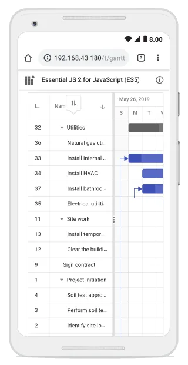

# Sorting in Blazor Gantt Chart Component

The Syncfusion&reg; Blazor Gantt Chart component provides sorting functionality to arrange task data in ascending or descending order based on column values.

To enable sorting, set the [AllowSorting](https://help.syncfusion.com/cr/blazor/Syncfusion.Blazor.Gantt.SfGantt-1.html#Syncfusion_Blazor_Gantt_SfGantt_1_AllowSorting) property to **true**. You can configure sorting option using the [GanttSortSettings](https://help.syncfusion.com/cr/blazor/Syncfusion.Blazor.Gantt.GanttSortSettings.html) property.

Sorting is applied by clicking a column header. For multi-column sorting, hold the **CTRL** key while selecting additional headers. To remove sorting from a specific column in a multi-sorted view, hold the **SHIFT** key and click the column header. 




@using Syncfusion.Blazor.Gantt

<SfGantt DataSource="@TaskCollection" Height="450px" Width="700px" AllowSorting="true">
    <GanttTaskFields Id="TaskId" Name="TaskName" StartDate="StartDate" EndDate="EndDate" Duration="Duration" Progress="Progress" ParentID="ParentId">
    </GanttTaskFields>
</SfGantt>

@code{
    public List<TaskData> TaskCollection { get; set; }

    protected override void OnInitialized()
    {
        this.TaskCollection = GetTaskCollection();
    }

    public class TaskData
    {
        public int TaskId { get; set; }
        public string TaskName { get; set; }
        public DateTime StartDate { get; set; }
        public DateTime? EndDate { get; set; }
        public string Duration { get; set; }
        public int Progress { get; set; }
        public int? ParentId { get; set; }
    }

    public static List<TaskData> GetTaskCollection()
    {
        List<TaskData> Tasks = new List<TaskData>()
        {
            new TaskData() { TaskId = 1, TaskName = "Project initiation", StartDate = new DateTime(2026, 04, 06), EndDate = new DateTime(2026, 04, 08), },
            new TaskData() { TaskId = 2, TaskName = "Identify Site location", StartDate = new DateTime(2026, 04, 06), Duration = "0", Progress = 30, ParentId = 1 },
            new TaskData() { TaskId = 3, TaskName = "Perform soil test", StartDate = new DateTime(2026, 04, 02), EndDate = new DateTime(2026, 04, 06), Progress = 40, ParentId = 1 },
            new TaskData() { TaskId = 4, TaskName = "Soil test approval", StartDate = new DateTime(2026, 04, 06), Duration = "0", Progress = 30, ParentId = 1 },
            new TaskData() { TaskId = 5, TaskName = "Project estimation", StartDate = new DateTime(2026, 04, 06), EndDate = new DateTime(2026, 04, 08), },
            new TaskData() { TaskId = 6, TaskName = "Develop floor plan for estimation", StartDate = new DateTime(2026, 04, 06), EndDate = new DateTime(2026, 04, 08), Progress = 30, ParentId = 5 },
            new TaskData() { TaskId = 7, TaskName = "List materials", StartDate = new DateTime(2026, 04, 06), EndDate = new DateTime(2026, 04, 08), Progress = 40, ParentId = 5 },
            new TaskData() { TaskId = 8, TaskName = "Estimation approval", StartDate = new DateTime(2026, 04, 06), Duration = "0", Progress = 30, ParentId = 5 }
        };
        return Tasks;
    }
}






> * The Gantt Chart columns are sorted in the ascending order. If you click the already sorted column, the sort direction toggles.
> * To disable sorting for a particular column, set the `GanttColumn.AllowSorting` property to **false**.

## Initial sorting

You can configure sorting during the initial render of the Syncfusion Blazor Gantt Chart by setting the [GanttSortSettings](https://help.syncfusion.com/cr/blazor/Syncfusion.Blazor.Gantt.GanttSortSettings.html) property. Within this configuration, define each column in the `GanttSortSettings.GanttSortDescriptors` collection using the `Field` and `Direction` properties to ensure the Gantt Chart loads with the desired sort order applied to the specified columns.

The following code example shows how to add sorted columns during Gantt initialization, with `Field` set to **TaskID** and `Direction` to **Descending**, and another with `Field` as **TaskName** and `Direction` as **Ascending**.




@using Syncfusion.Blazor.Gantt
@using Syncfusion.Blazor.Grids

<SfGantt DataSource="@TaskCollection" Height="450px" Width="700px" AllowSorting="true">
    <GanttTaskFields Id="TaskId" Name="TaskName" StartDate="StartDate" EndDate="EndDate" Duration="Duration" Progress="Progress" ParentID="ParentId">
    </GanttTaskFields>
    <GanttSortSettings>
        <GanttSortDescriptors>
            <GanttSortDescriptor Field="TaskId" Direction="SortDirection.Descending"></GanttSortDescriptor>
            <GanttSortDescriptor Field="TaskName" Direction="SortDirection.Ascending"></GanttSortDescriptor>
        </GanttSortDescriptors>
    </GanttSortSettings>
</SfGantt>

@code{
    public List<TaskData> TaskCollection { get; set; }
    protected override void OnInitialized()
    {
        this.TaskCollection = GetTaskCollection();
    }

    public class TaskData
    {
        public int TaskId { get; set; }
        public string TaskName { get; set; }
        public DateTime StartDate { get; set; }
        public DateTime? EndDate { get; set; }
        public string Duration { get; set; }
        public int Progress { get; set; }
        public int? ParentId { get; set; }
    }

    public static List<TaskData> GetTaskCollection()
    {
        List<TaskData> Tasks = new List<TaskData>()
        {
            new TaskData() { TaskId = 1, TaskName = "Project initiation", StartDate = new DateTime(2026, 04, 06), EndDate = new DateTime(2026, 04, 08), },
            new TaskData() { TaskId = 2, TaskName = "Identify Site location", StartDate = new DateTime(2026, 04, 06), Duration = "0", Progress = 30, ParentId = 1 },
            new TaskData() { TaskId = 3, TaskName = "Perform soil test", StartDate = new DateTime(2026, 04, 02), EndDate = new DateTime(2026, 04, 06), Progress = 40, ParentId = 1 },
            new TaskData() { TaskId = 4, TaskName = "Soil test approval", StartDate = new DateTime(2026, 04, 06), Duration = "0", Progress = 30, ParentId = 1 },
            new TaskData() { TaskId = 5, TaskName = "Project estimation", StartDate = new DateTime(2026, 04, 06), EndDate = new DateTime(2026, 04, 08), },
            new TaskData() { TaskId = 6, TaskName = "Develop floor plan for estimation", StartDate = new DateTime(2026, 04, 06), EndDate = new DateTime(2026, 04, 08), Progress = 30, ParentId = 5 },
            new TaskData() { TaskId = 7, TaskName = "List materials", StartDate = new DateTime(2026, 04, 06), EndDate = new DateTime(2026, 04, 08), Progress = 40, ParentId = 5 },
            new TaskData() { TaskId = 8, TaskName = "Estimation approval", StartDate = new DateTime(2026, 04, 06), Duration = "0", Progress = 30, ParentId = 5 }
        };
        return Tasks;
    }
}






## Sort columns externally

You can externally sort columns, clear all sorting in the Syncfusion&reg; Blazor Gantt Chart component using button clicks.

### Add sort columns

You can externally sort a column in the Gantt Chart component using the [SortByColumnAsync](https://help.syncfusion.com/cr/blazor/Syncfusion.Blazor.Gantt.SfGantt-1.html#Syncfusion_Blazor_Gantt_SfGantt_1_SortByColumnAsync_System_String_Syncfusion_Blazor_Grids_SortDirection_System_Nullable_System_Boolean__) method with parameters for column name, sort direction, and multi-sort configuration.




@using Syncfusion.Blazor.Gantt
@using Syncfusion.Blazor.Buttons

<SfButton CssClass="e-primary" OnClick="Sorting" style="margin-bottom: 16px;">
    Sort Taskname Column
</SfButton>
<SfGantt @ref="Gantt" DataSource="@TaskCollection" Height="450px" Width="700px" AllowSorting="true">
    <GanttTaskFields Id="TaskId" Name="TaskName" StartDate="StartDate" EndDate="EndDate" Duration="Duration" Progress="Progress" ParentID="ParentId">
    </GanttTaskFields>
</SfGantt>

@code{
    public SfGantt<TaskData> Gantt;
    public List<TaskData> TaskCollection { get; set; }

    public void Sorting()
    {
        this.Gantt.SortByColumnAsync("TaskName", Syncfusion.Blazor.Grids.SortDirection.Descending, false);
    }

    protected override void OnInitialized()
    {
        this.TaskCollection = GetTaskCollection();
    }

    public class TaskData
    {
        public int TaskId { get; set; }
        public string TaskName { get; set; }
        public DateTime StartDate { get; set; }
        public DateTime? EndDate { get; set; }
        public string Duration { get; set; }
        public int Progress { get; set; }
        public int? ParentId { get; set; }
    }

    public static List<TaskData> GetTaskCollection()
    {
        List<TaskData> Tasks = new List<TaskData>()
        {
            new TaskData() { TaskId = 1, TaskName = "Project initiation", StartDate = new DateTime(2026, 04, 06), EndDate = new DateTime(2026, 04, 08), },
            new TaskData() { TaskId = 2, TaskName = "Identify Site location", StartDate = new DateTime(2026, 04, 06), Duration = "0", Progress = 30, ParentId = 1 },
            new TaskData() { TaskId = 3, TaskName = "Perform soil test", StartDate = new DateTime(2026, 04, 02), EndDate = new DateTime(2026, 04, 06), Progress = 40, ParentId = 1 },
            new TaskData() { TaskId = 4, TaskName = "Soil test approval", StartDate = new DateTime(2026, 04, 06), Duration = "0", Progress = 30, ParentId = 1 },
            new TaskData() { TaskId = 5, TaskName = "Project estimation", StartDate = new DateTime(2026, 04, 06), EndDate = new DateTime(2026, 04, 08), },
            new TaskData() { TaskId = 6, TaskName = "Develop floor plan for estimation", StartDate = new DateTime(2026, 04, 06), EndDate = new DateTime(2026, 04, 08), Progress = 30, ParentId = 5 },
            new TaskData() { TaskId = 7, TaskName = "List materials", StartDate = new DateTime(2026, 04, 06), EndDate = new DateTime(2026, 04, 08), Progress = 40, ParentId = 5 },
            new TaskData() { TaskId = 8, TaskName = "Estimation approval", StartDate = new DateTime(2026, 04, 06), Duration = "0", Progress = 30, ParentId = 5 }
        };
        return Tasks;
    }
}






### Clear sorting

You can clear all sorted columns in the Gantt Chart component using the [ClearSortingAsync](https://help.syncfusion.com/cr/blazor/Syncfusion.Blazor.Gantt.SfGantt-1.html#Syncfusion_Blazor_Gantt_SfGantt_1_ClearSortingAsync) method to reset the Gantt chart to its unsorted state.




@using Syncfusion.Blazor.Gantt
@using Syncfusion.Blazor.Buttons

<SfButton CssClass="e-primary" OnClick="ClearSorting" style="margin-bottom: 16px;">
    Clear Sorting
</SfButton>
<SfGantt @ref="Gantt" DataSource="@TaskCollection" Height="450px" Width="700px" AllowSorting="true">
    <GanttTaskFields Id="TaskId" Name="TaskName" StartDate="StartDate" EndDate="EndDate" Duration="Duration" Progress="Progress" ParentID="ParentId">
    </GanttTaskFields>
    <GanttSortSettings>
        <GanttSortDescriptors>
            <GanttSortDescriptor Field="TaskId" Direction="Syncfusion.Blazor.Grids.SortDirection.Descending"></GanttSortDescriptor>
            <GanttSortDescriptor Field="TaskName" Direction="Syncfusion.Blazor.Grids.SortDirection.Ascending"></GanttSortDescriptor>
        </GanttSortDescriptors>
    </GanttSortSettings>
</SfGantt>

@code{
    public SfGantt<TaskData> Gantt;
    public void ClearSorting()
    {
        this.Gantt.ClearSortingAsync();
    }
    private List<TaskData> TaskCollection { get; set; }
    protected override void OnInitialized()
    {
        this.TaskCollection = GetTaskCollection();
    }

    public class TaskData
    {
        public int TaskId { get; set; }
        public string TaskName { get; set; }
        public DateTime StartDate { get; set; }
        public DateTime? EndDate { get; set; }
        public string Duration { get; set; }
        public int Progress { get; set; }
        public int? ParentId { get; set; }
    }

    public static List<TaskData> GetTaskCollection()
    {
        List<TaskData> Tasks = new List<TaskData>()
        {
            new TaskData() { TaskId = 1, TaskName = "Project initiation", StartDate = new DateTime(2026, 04, 06), EndDate = new DateTime(2026, 04, 08), },
            new TaskData() { TaskId = 2, TaskName = "Identify Site location", StartDate = new DateTime(2026, 04, 06), Duration = "0", Progress = 30, ParentId = 1 },
            new TaskData() { TaskId = 3, TaskName = "Perform soil test", StartDate = new DateTime(2026, 04, 02), EndDate = new DateTime(2026, 04, 06), Progress = 40, ParentId = 1 },
            new TaskData() { TaskId = 4, TaskName = "Soil test approval", StartDate = new DateTime(2026, 04, 06), Duration = "0", Progress = 30, ParentId = 1 },
            new TaskData() { TaskId = 5, TaskName = "Project estimation", StartDate = new DateTime(2026, 04, 06), EndDate = new DateTime(2026, 04, 08), },
            new TaskData() { TaskId = 6, TaskName = "Develop floor plan for estimation", StartDate = new DateTime(2026, 04, 06), EndDate = new DateTime(2026, 04, 08), Progress = 30, ParentId = 5 },
            new TaskData() { TaskId = 7, TaskName = "List materials", StartDate = new DateTime(2026, 04, 06), EndDate = new DateTime(2026, 04, 08), Progress = 40, ParentId = 5 },
            new TaskData() { TaskId = 8, TaskName = "Estimation approval", StartDate = new DateTime(2026, 04, 06), Duration = "0", Progress = 30, ParentId = 5 }
        };
        return Tasks;
    }
}






## Customize the sort action

You can customize sorting behavior using the [Sorting](https://help.syncfusion.com/cr/blazor/Syncfusion.Blazor.Grids.GridEvents-1.html#Syncfusion_Blazor_Grids_GridEvents_1_Sorting) and the [Sorted](https://help.syncfusion.com/cr/blazor/Syncfusion.Blazor.Grids.GridEvents-1.html#Syncfusion_Blazor_Grids_GridEvents_1_Sorted) events.

The following sample demonstrates how to cancel sorting on the **TaskID** column using the `Sorting` event.




@using Syncfusion.Blazor.Gantt
@using Syncfusion.Blazor.Grids

<label style="color: red; display: block; margin-bottom: 12px;text-align:center">
    @SortMessage
</label>
<SfGantt DataSource="@TaskCollection" Height="450px" Width="700px" AllowSorting="true">
    <GanttTaskFields Id="TaskId" Name="TaskName" StartDate="StartDate" EndDate="EndDate" Duration="Duration" Progress="Progress" ParentID="ParentId">
    </GanttTaskFields>
    <GanttEvents Sorting="SortingHandler" Sorted="SortedHandler" TValue="TaskData"></GanttEvents>
</SfGantt>

@code {
    private string SortMessage { get; set; }
    public List<TaskData> TaskCollection { get; set; }

    
    public void SortingHandler(SortingEventArgs args)
    {
        if (args.ColumnName == "TaskID")
        {
            args.Cancel = true;
            SortMessage = $"Sorting on '{args.ColumnName}' is disabled.";
        }
    }

    public void SortedHandler(SortedEventArgs args)
    {
        SortMessage = $"Sorted by '{args.ColumnName}' in '{args.Direction}' order.";
    }

   
    protected override void OnInitialized()
    {
        this.TaskCollection = GetTaskCollection();
    }

    public class TaskData
    {
        public int TaskId { get; set; }
        public string TaskName { get; set; }
        public DateTime StartDate { get; set; }
        public DateTime? EndDate { get; set; }
        public string Duration { get; set; }
        public int Progress { get; set; }
        public int? ParentId { get; set; }
    }

    public static List<TaskData> GetTaskCollection()
    {
        List<TaskData> Tasks = new List<TaskData>()
        {
            new TaskData() { TaskId = 1, TaskName = "Project initiation", StartDate = new DateTime(2026, 04, 06), EndDate = new DateTime(2026, 04, 08), },
            new TaskData() { TaskId = 2, TaskName = "Identify Site location", StartDate = new DateTime(2026, 04, 06), Duration = "0", Progress = 30, ParentId = 1 },
            new TaskData() { TaskId = 3, TaskName = "Perform soil test", StartDate = new DateTime(2026, 04, 02), EndDate = new DateTime(2026, 04, 06), Progress = 40, ParentId = 1 },
            new TaskData() { TaskId = 4, TaskName = "Soil test approval", StartDate = new DateTime(2026, 04, 06), Duration = "0", Progress = 30, ParentId = 1 },
            new TaskData() { TaskId = 5, TaskName = "Project estimation", StartDate = new DateTime(2026, 04, 06), EndDate = new DateTime(2026, 04, 08), },
            new TaskData() { TaskId = 6, TaskName = "Develop floor plan for estimation", StartDate = new DateTime(2026, 04, 06), EndDate = new DateTime(2026, 04, 08), Progress = 30, ParentId = 5 },
            new TaskData() { TaskId = 7, TaskName = "List materials", StartDate = new DateTime(2026, 04, 06), EndDate = new DateTime(2026, 04, 08), Progress = 40, ParentId = 5 },
            new TaskData() { TaskId = 8, TaskName = "Estimation approval", StartDate = new DateTime(2026, 04, 06), Duration = "0", Progress = 30, ParentId = 5 }
        };
        return Tasks;
    }
}






## Sorting custom columns

You can sort custom columns of different types, such as string or numeric, by adding them to the column collection. Initial sorting can be configured using [GanttSortSettings](https://help.syncfusion.com/cr/blazor/Syncfusion.Blazor.Gantt.GanttSortSettings.html), or the columns can be sorted dynamically through button clicks.

The following sample demonstrates sorting a custom column using an external button click:




@using Syncfusion.Blazor.Gantt
@using Syncfusion.Blazor.Buttons

<SfButton CssClass="e-primary" OnClick="Sorting" style="margin-bottom: 16px;">
    Sort Custom Column
</SfButton>
<SfGantt @ref="Gantt" DataSource="@TaskCollection" Height="450px" Width="700px" AllowSorting="true">
    <GanttTaskFields Id="TaskId" Name="TaskName" StartDate="StartDate" EndDate="EndDate" Duration="Duration" Progress="Progress" ParentID="ParentId"></GanttTaskFields>
    <GanttColumns>
        <GanttColumn Field="TaskId" Width="100"></GanttColumn>
        <GanttColumn Field="TaskName" Width="250"></GanttColumn>
        <GanttColumn Field="StartDate"></GanttColumn>
        <GanttColumn Field="Duration"></GanttColumn>
        <GanttColumn Field="Progress"></GanttColumn>
        <GanttColumn Field="CustomColumn"></GanttColumn>
    </GanttColumns>
</SfGantt>

@code{
    public SfGantt<TaskData> Gantt;
    private List<TaskData> TaskCollection { get; set; }

    public void Sorting()
    {
        this.Gantt.SortByColumnAsync("CustomColumn", Syncfusion.Blazor.Grids.SortDirection.Descending, false);
    }
    
    protected override void OnInitialized()
    {
        this.TaskCollection = GetTaskCollection();
    }

    public class TaskData
    {
        public int TaskId { get; set; }
        public string TaskName { get; set; }
        public DateTime StartDate { get; set; }
        public DateTime? EndDate { get; set; }
        public string Duration { get; set; }
        public int Progress { get; set; }
        public int? ParentId { get; set; }
        public int CustomColumn { get; set; }
    }

    public static List<TaskData> GetTaskCollection()
    {
        List<TaskData> Tasks = new List<TaskData>()
        {
            new TaskData() { TaskId = 1, TaskName = "Project initiation", StartDate = new DateTime(2026, 04, 06), EndDate = new DateTime(2026, 04, 09), CustomColumn = 2, },
            new TaskData() { TaskId = 2, TaskName = "Identify Site location", StartDate = new DateTime(2026, 04, 06), Duration = "0", Progress = 30, CustomColumn = 3, ParentId = 1 },
            new TaskData() { TaskId = 3, TaskName = "Perform soil test", StartDate = new DateTime(2026, 04, 06), EndDate = new DateTime(2026, 04, 09), Progress = 40, CustomColumn = 4, ParentId = 1 },
            new TaskData() { TaskId = 4, TaskName = "Soil test approval", StartDate = new DateTime(2026, 04, 06), Duration = "0", Progress = 30, CustomColumn = 1, ParentId = 1 },
            new TaskData() { TaskId = 5, TaskName = "Project estimation", StartDate = new DateTime(2026, 04, 07), EndDate = new DateTime(2026, 04, 09), CustomColumn = 7, },
            new TaskData() { TaskId = 6, TaskName = "Develop floor plan for estimation", StartDate = new DateTime(2026, 04, 07), EndDate = new DateTime(2026, 04, 09), Progress = 30, CustomColumn = 8, ParentId = 5 },
            new TaskData() { TaskId = 7, TaskName = "List materials", StartDate = new DateTime(2026, 04, 07), EndDate = new DateTime(2026, 04, 09), Progress = 40, CustomColumn = 5, ParentId = 5 },
            new TaskData() { TaskId = 8, TaskName = "Estimation approval", StartDate = new DateTime(2026, 04, 07), Duration = "0", Progress = 30, CustomColumn = 6, ParentId = 5 }
        };
        return Tasks;
    }
}






## Touch interaction

To perform a tap action on a column header in the Syncfusion&reg; Blazor Gantt component, the [Sorting](https://blazor.syncfusion.com/documentation/gantt-chart/sorting) operation is triggered for the selected column. A popup appears when multi-column sorting is enabled. To sort multiple columns, tap the popup and then tap the desired column headers. 

The following screenshot shows Gantt touch sorting,

