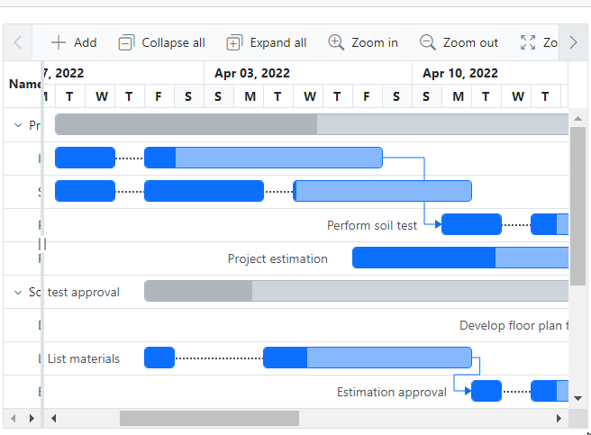

# Split task in Blazor Gantt Chart component

In [Blazor Gantt Chart](https://www.syncfusion.com/blazor-components/blazor-gantt-chart), the split task feature allows you to split a task or interrupt the work during planned or unforeseen circumstances. It makes the view dynamic and interactive, improving the visualization of the project taskbar. The split portions of a taskbar in the Gantt Chart are called **segments**. You can both split and merge multiple segments within a taskbar.

## Binding segments data source

To enable the split task feature using the [GanttSegmentFields](https://help.syncfusion.com/cr/blazor/Syncfusion.Blazor.Gantt.GanttSegmentFields-2.html) in the [SfGantt](https://help.syncfusion.com/cr/blazor/Syncfusion.Blazor.Gantt.SfGantt-1.html) chart. In your Gantt chart, the split task functionality relies on the segment [DataSource](https://help.syncfusion.com/cr/blazor/Syncfusion.Blazor.Gantt.GanttSegmentFields-2.html#Syncfusion_Blazor_Gantt_GanttSegmentFields_2_DataSource), specified in the `GanttSegmentFields` component. The organization of the data source collection is based on task ID. Each segment record within this collection, represented by the TSegments type, must include crucial information such as a unique ID, task ID, start date, end date, or duration values. These details are essential for accurately representing and managing segmented tasks within the Gantt chart. 

`PrimaryKey` - This field contains unique values used to identify each individual segments. 

`ForeignKey` - This field is used to map the task ID in the segments collection. It establishes a relationship between the task and its segments.

`StartDate` - This field is used to map the segment's start date in the segments collection. It defines when the segment begins.

`EndDate` - This field is used to map the segment's end date in the segments collection. It specifies when the segment ends. 

`Duration` - This field is used to specify the duration of the segment. It can be used instead of or in conjunction with the start and end dates.

In the code snippet below, the `GanttSegmentFields` component is used to bind the segments, and the segment's data source collection is mapped to the `segmentCollection` property. The `TSegments` class, represented by `SegmentModel`, contains properties such as `Id` mapped to [PrimaryKey](https://help.syncfusion.com/cr/blazor/Syncfusion.Blazor.Gantt.GanttSegmentFields-2.html#Syncfusion_Blazor_Gantt_GanttSegmentFields_2_PrimaryKey), `TaskId` mapped to [ForeignKey](https://help.syncfusion.com/cr/blazor/Syncfusion.Blazor.Gantt.GanttSegmentFields-2.html#Syncfusion_Blazor_Gantt_GanttSegmentFields_2_ForeignKey), `SegmentStartDate` mapped to [StartDate](https://help.syncfusion.com/cr/blazor/Syncfusion.Blazor.Gantt.GanttSegmentFields-2.html#Syncfusion_Blazor_Gantt_GanttSegmentFields_2_StartDate), `SegmentEndDate` mapped to [EndDate](https://help.syncfusion.com/cr/blazor/Syncfusion.Blazor.Gantt.GanttSegmentFields-2.html#Syncfusion_Blazor_Gantt_GanttSegmentFields_2_EndDate), and `SegmentDuration` mapped to [Duration](https://help.syncfusion.com/cr/blazor/Syncfusion.Blazor.Gantt.GanttSegmentFields-2.html#Syncfusion_Blazor_Gantt_GanttSegmentFields_2_Duration). 

```cshtml
@using Syncfusion.Blazor.Gantt
<SfGantt TValue="TaskData" DataSource="@taskCollection" Height="450px" Width="100%" TreeColumnIndex="1" Toolbar="@(new List<Object>() { "Add", "Cancel", "Update" , "Delete", "Edit", "CollapseAll", "ExpandAll", "ZoomIn", "ZoomOut", "ZoomToFit" })" RowHeight="37" ProjectStartDate="projectStart" ProjectEndDate="projectEnd">
    <GanttTaskFields Id="TaskId" Name="TaskName" StartDate="StartDate" EndDate="EndDate" Duration="Duration" Progress="Progress" ParentID="ParentId" Dependency="Predecessor">
    </GanttTaskFields>
    <GanttEditSettings AllowAdding="true" AllowDeleting="true" AllowEditing="true" AllowTaskbarEditing="true"></GanttEditSettings>
    <GanttSegmentFields PrimaryKey="Id" ForeignKey="TaskId" StartDate="SegmentStartDate" EndDate="SegmentEndDate" Duration="SegmentDuration" TValue="TaskData" TSegments="SegmentModel" DataSource="segmentCollection"></GanttSegmentFields>
    <GanttLabelSettings LeftLabel="TaskName" TValue="TaskData"></GanttLabelSettings>
    <GanttColumns>
        <GanttColumn Field="TaskId" Width="100" Visible="false"></GanttColumn>
        <GanttColumn Field="TaskName" Width="250" ClipMode="Syncfusion.Blazor.Grids.ClipMode.EllipsisWithTooltip"></GanttColumn>
        <GanttColumn Field="StartDate" HeaderText="Start Date"></GanttColumn>
        <GanttColumn Field="EndDate" HeaderText="End Date"></GanttColumn>
        <GanttColumn Field="Duration" HeaderText="Duration"></GanttColumn>
        <GanttColumn Field="Progress" HeaderText="Progress"></GanttColumn>
        <GanttColumn Field="Predecessor" HeaderText="Dependency"></GanttColumn>
    </GanttColumns>
</SfGantt>

@code {
    private DateTime projectStart = new DateTime(2022, 03, 23);
    private DateTime projectEnd = new DateTime(2022, 05, 10);
    private List<TaskData> taskCollection { get; set; }
    private List<SegmentModel> segmentCollection { get; set; }
    protected override void OnInitialized()
    {
        this.taskCollection = GetTaskCollection();
        this.segmentCollection = GetSegmentCollection();
    }
    public class SegmentModel
    {
        public int Id { get; set; }
        public int TaskId { get; set; }
        public DateTime SegmentStartDate { get; set; }
        public DateTime SegmentEndDate { get; set; }
        public string SegmentDuration { get; set; }
    }
    public class TaskData
    {
        public int TaskId { get; set; }
        public string TaskName { get; set; }
        public DateTime? StartDate { get; set; }
        public DateTime? EndDate { get; set; }
        public string Duration { get; set; }
        public int Progress { get; set; }
        public int? ParentId { get; set; }
        public string Predecessor { get; set; }
    }
    public static List<TaskData> GetTaskCollection()
    {
        List<TaskData> Tasks = new List<TaskData>() {
            new TaskData() { TaskId = 1, TaskName = "Project initiation", StartDate = new DateTime(2022, 03, 28), EndDate = new DateTime(2022, 07, 28), Duration="4" },
            new TaskData() { TaskId = 2, TaskName = "Identify site location", StartDate = new DateTime(2022, 03, 29), Progress = 30, ParentId = 1, Duration="8", },
            new TaskData() { TaskId = 3, TaskName = "Site analyze", StartDate = new DateTime(2022, 03, 29),  Progress = 50, ParentId = 1, Duration="8"},
            new TaskData() { TaskId = 4, TaskName = "Perform soil test", StartDate = new DateTime(2022, 03, 29), ParentId = 1, Duration="5", Predecessor="2FS", Progress=40, },
            new TaskData() { TaskId = 5, TaskName = "Soil test approval", StartDate = new DateTime(2022, 03, 29), Duration="4", Progress = 30 },
            new TaskData() { TaskId = 6, TaskName = "Project estimation", StartDate = new DateTime(2022, 04, 08), Duration="8", Progress=40, ParentId=1 },
            new TaskData() { TaskId = 7, TaskName = "Develop floor plan for estimation", StartDate = new DateTime(2022, 03, 29), Duration = "0", Progress = 30, ParentId = 5, Predecessor= "4FS" },
            new TaskData() { TaskId = 8, TaskName = "List materials", StartDate = new DateTime(2022, 04, 01), Duration = "6", Progress = 30, ParentId = 5 },
            new TaskData() { TaskId = 9, TaskName = "Estimation approval",Progress=30, StartDate = new DateTime(2022, 04, 01), Duration = "4", ParentId = 5, Predecessor="8FS" },
            new TaskData() { TaskId = 10, TaskName = "Building approval", StartDate = new DateTime(2022, 04, 12), Duration = "5", ParentId = 5 },
            new TaskData() { TaskId = 11, TaskName = "Construction initiation", StartDate = new DateTime(2022, 04, 01), Duration = "5", Progress=40 },
            new TaskData() { TaskId = 12, TaskName = "Ground floor initiation", StartDate = new DateTime(2022, 04, 05), Duration = "5", ParentId = 11, Progress=40},
            new TaskData() { TaskId = 13, TaskName = "First floor initiation", StartDate = new DateTime(2022, 04, 05), Duration = "7",ParentId = 11, Progress=40},
            new TaskData() { TaskId = 14, TaskName = "Electric work initiation", StartDate = new DateTime(2022, 04, 01), Duration = "5", ParentId = 11, Progress=40, },
            new TaskData() { TaskId = 15, TaskName = "Plumbing work", StartDate = new DateTime(2022, 04, 02), Duration = "5", ParentId = 11, Progress=40 },
       };
        return Tasks;
    }
    private List<SegmentModel> GetSegmentCollection()
    {
        List<SegmentModel> segments = new List<SegmentModel>();
        segments.Add(new SegmentModel() { Id = 1, TaskId = 2, SegmentStartDate = new DateTime(2022, 04, 01), SegmentDuration = "1" });
        segments.Add(new SegmentModel() { Id = 2, TaskId = 2, SegmentStartDate = new DateTime(2022, 03, 29), SegmentEndDate = new DateTime(2022, 03, 31) });
        segments.Add(new SegmentModel() { Id = 3, TaskId = 3, SegmentStartDate = new DateTime(2022, 04, 01), SegmentDuration = "2" });
        segments.Add(new SegmentModel() { Id = 4, TaskId = 3, SegmentStartDate = new DateTime(2022, 03, 29), SegmentEndDate = new DateTime(2022, 03, 31) });
        segments.Add(new SegmentModel() { Id = 5, TaskId = 3, SegmentStartDate = new DateTime(2022, 04, 04), SegmentDuration = "3" });
        segments.Add(new SegmentModel() { Id = 6, TaskId = 4, SegmentStartDate = new DateTime(2022, 04, 01), SegmentDuration = "1" });
        segments.Add(new SegmentModel() { Id = 7, TaskId = 4, SegmentStartDate = new DateTime(2022, 03, 29), SegmentEndDate = new DateTime(2022, 03, 31) });
        segments.Add(new SegmentModel() { Id = 8, TaskId = 8, SegmentStartDate = new DateTime(2022, 04, 01), SegmentEndDate = new DateTime(2022, 04, 03) });
        segments.Add(new SegmentModel() { Id = 9, TaskId = 8, SegmentStartDate = new DateTime(2022, 04, 05), SegmentDuration = "1" });
        segments.Add(new SegmentModel() { Id = 10, TaskId = 9, SegmentStartDate = new DateTime(2022, 03, 29), SegmentEndDate = new DateTime(2022, 03, 31) });
        segments.Add(new SegmentModel() { Id = 11, TaskId = 9, SegmentStartDate = new DateTime(2022, 04, 01), SegmentDuration = "1" });
        segments.Add(new SegmentModel() { Id = 12, TaskId = 12, SegmentStartDate = new DateTime(2022, 04, 05), SegmentDuration = "1" });
        segments.Add(new SegmentModel() { Id = 13, TaskId = 12, SegmentStartDate = new DateTime(2022, 04, 07), SegmentDuration = "1" });
        segments.Add(new SegmentModel() { Id = 14, TaskId = 14, SegmentStartDate = new DateTime(2022, 04, 01), SegmentEndDate = new DateTime(2022, 04, 02) });
        segments.Add(new SegmentModel() { Id = 15, TaskId = 14, SegmentStartDate = new DateTime(2022, 04, 04), SegmentDuration = "2" });
        return segments;
    }
}
```


## Splitting and merge tasks dynamically

`Split task` - Splitting a task in a Gantt chart involves dividing the taskbar into two segments at a specified point in the timeline. 

`Merge task` - Merging tasks in a Gantt chart combines two or more adjacent taskbars into a single taskbar.

The task splitting and merging actions can be performed in the following three ways in a Gantt chart. Additionally, tasks can also be merged by simply taskbar dragging the segments together in the ui.

### Context menu

The [EnableContextMenu](https://help.syncfusion.com/cr/blazor/Syncfusion.Blazor.Gantt.SfGantt-1.html#Syncfusion_Blazor_Gantt_SfGantt_1_EnableContextMenu) property is enabled, the context menu will include the `Split Task` and `Merge Task` items. To split a taskbar, first select the timeline cell, then hover over it and right-click to open the context menu. From the context menu, select the `Split Task` option and then proceed with the action by clicking. For merging taskbars, select the split taskbar, choose the particular segment, and open the context menu. From there, click on the `Merge Task` option, and you'll see two options (right and left) based on the segment. You can split the taskbar by opening the context menu within the taskbar itself. To merge taskbars, click on the taskbar and select the merge action either to the right or left. The image below illustrates the context menu for these actions.

```cshtml
@using Syncfusion.Blazor.Gantt
<SfGantt TValue="TaskData" EnableContextMenu="true" DataSource="@taskCollection" Height="450px" Width="100%" TreeColumnIndex="1" Toolbar="@(new List<Object>() { "Add", "Cancel", "Update" , "Delete", "Edit", "CollapseAll", "ExpandAll", "ZoomIn", "ZoomOut", "ZoomToFit" })" RowHeight="37" ProjectStartDate="projectStart" ProjectEndDate="projectEnd">
    <GanttTaskFields Id="TaskId" Name="TaskName" StartDate="StartDate" EndDate="EndDate" Duration="Duration" Progress="Progress" ParentID="ParentId" Dependency="Predecessor">
    </GanttTaskFields>
    <GanttEditSettings AllowAdding="true" AllowDeleting="true" AllowEditing="true" AllowTaskbarEditing="true"></GanttEditSettings>
    <GanttSegmentFields PrimaryKey="Id" ForeignKey="TaskId" StartDate="SegmentStartDate" EndDate="SegmentEndDate" Duration="SegmentDuration" TValue="TaskData" TSegments="SegmentModel" DataSource="segmentCollection"></GanttSegmentFields>
    <GanttLabelSettings LeftLabel="TaskName" TValue="TaskData"></GanttLabelSettings>
    <GanttColumns>
        <GanttColumn Field="TaskId" Width="100" Visible="false"></GanttColumn>
        <GanttColumn Field="TaskName" Width="250" ClipMode="Syncfusion.Blazor.Grids.ClipMode.EllipsisWithTooltip"></GanttColumn>
        <GanttColumn Field="StartDate" HeaderText="Start Date"></GanttColumn>
        <GanttColumn Field="EndDate" HeaderText="End Date"></GanttColumn>
        <GanttColumn Field="Duration" HeaderText="Duration"></GanttColumn>
        <GanttColumn Field="Progress" HeaderText="Progress"></GanttColumn>
        <GanttColumn Field="Predecessor" HeaderText="Dependency"></GanttColumn>
    </GanttColumns>
</SfGantt>

@code {
    private DateTime projectStart = new DateTime(2022, 03, 23);
    private DateTime projectEnd = new DateTime(2022, 05, 10);
    private List<TaskData> taskCollection { get; set; }
    private List<SegmentModel> segmentCollection { get; set; }
    protected override void OnInitialized()
    {
        this.taskCollection = GetTaskCollection();
        this.segmentCollection = GetSegmentCollection();
    }
    public class SegmentModel
    {
        public int Id { get; set; }
        public int TaskId { get; set; }
        public DateTime SegmentStartDate { get; set; }
        public DateTime SegmentEndDate { get; set; }
        public string SegmentDuration { get; set; }
    }
    public class TaskData
    {
        public int TaskId { get; set; }
        public string TaskName { get; set; }
        public DateTime? StartDate { get; set; }
        public DateTime? EndDate { get; set; }
        public string Duration { get; set; }
        public int Progress { get; set; }
        public int? ParentId { get; set; }
        public string Predecessor { get; set; }
    }
    public static List<TaskData> GetTaskCollection()
    {
        List<TaskData> Tasks = new List<TaskData>() {
            new TaskData() { TaskId = 1, TaskName = "Project initiation", StartDate = new DateTime(2022, 03, 28), EndDate = new DateTime(2022, 07, 28), Duration="4" },
            new TaskData() { TaskId = 2, TaskName = "Identify site location", StartDate = new DateTime(2022, 03, 29), Progress = 30, ParentId = 1, Duration="8", },
            new TaskData() { TaskId = 3, TaskName = "Site analyze", StartDate = new DateTime(2022, 03, 29),  Progress = 50, ParentId = 1, Duration="8"},
            new TaskData() { TaskId = 4, TaskName = "Perform soil test", StartDate = new DateTime(2022, 03, 29), ParentId = 1, Duration="5", Predecessor="2FS", Progress=40, },
            new TaskData() { TaskId = 5, TaskName = "Soil test approval", StartDate = new DateTime(2022, 03, 29), Duration="4", Progress = 30 },
            new TaskData() { TaskId = 6, TaskName = "Project estimation", StartDate = new DateTime(2022, 04, 08), Duration="8", Progress=40, ParentId=1 },
            new TaskData() { TaskId = 7, TaskName = "Develop floor plan for estimation", StartDate = new DateTime(2022, 03, 29), Duration = "0", Progress = 30, ParentId = 5, Predecessor= "4FS" },
            new TaskData() { TaskId = 8, TaskName = "List materials", StartDate = new DateTime(2022, 04, 01), Duration = "6", Progress = 30, ParentId = 5 },
            new TaskData() { TaskId = 9, TaskName = "Estimation approval",Progress=30, StartDate = new DateTime(2022, 04, 01), Duration = "4", ParentId = 5, Predecessor="8FS" },
            new TaskData() { TaskId = 10, TaskName = "Building approval", StartDate = new DateTime(2022, 04, 12), Duration = "5", ParentId = 5 },
            new TaskData() { TaskId = 11, TaskName = "Construction initiation", StartDate = new DateTime(2022, 04, 01), Duration = "5", Progress=40 },
            new TaskData() { TaskId = 12, TaskName = "Ground floor initiation", StartDate = new DateTime(2022, 04, 05), Duration = "5", ParentId = 11, Progress=40},
            new TaskData() { TaskId = 13, TaskName = "First floor initiation", StartDate = new DateTime(2022, 04, 05), Duration = "7",ParentId = 11, Progress=40},
            new TaskData() { TaskId = 14, TaskName = "Electric work initiation", StartDate = new DateTime(2022, 04, 01), Duration = "5", ParentId = 11, Progress=40, },
            new TaskData() { TaskId = 15, TaskName = "Plumbing work", StartDate = new DateTime(2022, 04, 02), Duration = "5", ParentId = 11, Progress=40 },
       };
        return Tasks;
    }
    private List<SegmentModel> GetSegmentCollection()
    {
        List<SegmentModel> segments = new List<SegmentModel>();
        segments.Add(new SegmentModel() { Id = 1, TaskId = 2, SegmentStartDate = new DateTime(2022, 04, 01), SegmentDuration = "1" });
        segments.Add(new SegmentModel() { Id = 2, TaskId = 2, SegmentStartDate = new DateTime(2022, 03, 29), SegmentEndDate = new DateTime(2022, 03, 31) });
        segments.Add(new SegmentModel() { Id = 3, TaskId = 3, SegmentStartDate = new DateTime(2022, 04, 01), SegmentDuration = "2" });
        segments.Add(new SegmentModel() { Id = 4, TaskId = 3, SegmentStartDate = new DateTime(2022, 03, 29), SegmentEndDate = new DateTime(2022, 03, 31) });
        segments.Add(new SegmentModel() { Id = 5, TaskId = 3, SegmentStartDate = new DateTime(2022, 04, 04), SegmentDuration = "3" });
        segments.Add(new SegmentModel() { Id = 6, TaskId = 4, SegmentStartDate = new DateTime(2022, 04, 01), SegmentDuration = "1" });
        segments.Add(new SegmentModel() { Id = 7, TaskId = 4, SegmentStartDate = new DateTime(2022, 03, 29), SegmentEndDate = new DateTime(2022, 03, 31) });
        segments.Add(new SegmentModel() { Id = 8, TaskId = 8, SegmentStartDate = new DateTime(2022, 04, 01), SegmentEndDate = new DateTime(2022, 04, 03) });
        segments.Add(new SegmentModel() { Id = 9, TaskId = 8, SegmentStartDate = new DateTime(2022, 04, 05), SegmentDuration = "1" });
        segments.Add(new SegmentModel() { Id = 10, TaskId = 9, SegmentStartDate = new DateTime(2022, 03, 29), SegmentEndDate = new DateTime(2022, 03, 31) });
        segments.Add(new SegmentModel() { Id = 11, TaskId = 9, SegmentStartDate = new DateTime(2022, 04, 01), SegmentDuration = "1" });
        segments.Add(new SegmentModel() { Id = 12, TaskId = 12, SegmentStartDate = new DateTime(2022, 04, 05), SegmentDuration = "1" });
        segments.Add(new SegmentModel() { Id = 13, TaskId = 12, SegmentStartDate = new DateTime(2022, 04, 07), SegmentDuration = "1" });
        segments.Add(new SegmentModel() { Id = 14, TaskId = 14, SegmentStartDate = new DateTime(2022, 04, 01), SegmentEndDate = new DateTime(2022, 04, 02) });
        segments.Add(new SegmentModel() { Id = 15, TaskId = 14, SegmentStartDate = new DateTime(2022, 04, 04), SegmentDuration = "2" });
        return segments;
    }
}
```


### Dialog box

To edit segments in a Gantt chart, you can either double-click a particular segment row to open the edit dialog box or select the segment row and click the edit option in the toolbar. Below is a sample containing the toolbar items. Next, navigate to the segments tab where you can edit the start date, end date, and duration values. The image below shows the editing dialog box.

```cshtml
@using Syncfusion.Blazor.Gantt
<SfGantt TValue="TaskData" EnableContextMenu="true" DataSource="@taskCollection" Height="450px" Width="100%" TreeColumnIndex="1" Toolbar="@(new List<Object>() { "Add", "Cancel", "Update" , "Delete", "Edit", "CollapseAll", "ExpandAll", "ZoomIn", "ZoomOut", "ZoomToFit" })" RowHeight="37" ProjectStartDate="projectStart" ProjectEndDate="projectEnd">
    <GanttTaskFields Id="TaskId" Name="TaskName" StartDate="StartDate" EndDate="EndDate" Duration="Duration" Progress="Progress" ParentID="ParentId" Dependency="Predecessor">
    </GanttTaskFields>
    <GanttEditSettings AllowAdding="true" AllowDeleting="true" AllowEditing="true" AllowTaskbarEditing="true"></GanttEditSettings>
    <GanttSegmentFields PrimaryKey="Id" ForeignKey="TaskId" StartDate="SegmentStartDate" EndDate="SegmentEndDate" Duration="SegmentDuration" TValue="TaskData" TSegments="SegmentModel" DataSource="segmentCollection"></GanttSegmentFields>
    <GanttLabelSettings LeftLabel="TaskName" TValue="TaskData"></GanttLabelSettings>
    <GanttColumns>
        <GanttColumn Field="TaskId" Width="100" Visible="false"></GanttColumn>
        <GanttColumn Field="TaskName" Width="250" ClipMode="Syncfusion.Blazor.Grids.ClipMode.EllipsisWithTooltip"></GanttColumn>
        <GanttColumn Field="StartDate" HeaderText="Start Date"></GanttColumn>
        <GanttColumn Field="EndDate" HeaderText="End Date"></GanttColumn>
        <GanttColumn Field="Duration" HeaderText="Duration"></GanttColumn>
        <GanttColumn Field="Progress" HeaderText="Progress"></GanttColumn>
        <GanttColumn Field="Predecessor" HeaderText="Dependency"></GanttColumn>
    </GanttColumns>
</SfGantt>

@code {
    private DateTime projectStart = new DateTime(2022, 03, 23);
    private DateTime projectEnd = new DateTime(2022, 05, 10);
    private List<TaskData> taskCollection { get; set; }
    private List<SegmentModel> segmentCollection { get; set; }
    protected override void OnInitialized()
    {
        this.taskCollection = GetTaskCollection();
        this.segmentCollection = GetSegmentCollection();
    }
    public class SegmentModel
    {
        public int Id { get; set; }
        public int TaskId { get; set; }
        public DateTime SegmentStartDate { get; set; }
        public DateTime SegmentEndDate { get; set; }
        public string SegmentDuration { get; set; }
    }
    public class TaskData
    {
        public int TaskId { get; set; }
        public string TaskName { get; set; }
        public DateTime? StartDate { get; set; }
        public DateTime? EndDate { get; set; }
        public string Duration { get; set; }
        public int Progress { get; set; }
        public int? ParentId { get; set; }
        public string Predecessor { get; set; }
    }
    public static List<TaskData> GetTaskCollection()
    {
        List<TaskData> Tasks = new List<TaskData>() {
            new TaskData() { TaskId = 1, TaskName = "Project initiation", StartDate = new DateTime(2022, 03, 28), EndDate = new DateTime(2022, 07, 28), Duration="4" },
            new TaskData() { TaskId = 2, TaskName = "Identify site location", StartDate = new DateTime(2022, 03, 29), Progress = 30, ParentId = 1, Duration="8", },
            new TaskData() { TaskId = 3, TaskName = "Site analyze", StartDate = new DateTime(2022, 03, 29),  Progress = 50, ParentId = 1, Duration="8"},
            new TaskData() { TaskId = 4, TaskName = "Perform soil test", StartDate = new DateTime(2022, 03, 29), ParentId = 1, Duration="5", Predecessor="2FS", Progress=40, },
            new TaskData() { TaskId = 5, TaskName = "Soil test approval", StartDate = new DateTime(2022, 03, 29), Duration="4", Progress = 30 },
            new TaskData() { TaskId = 6, TaskName = "Project estimation", StartDate = new DateTime(2022, 04, 08), Duration="8", Progress=40, ParentId=1 },
            new TaskData() { TaskId = 7, TaskName = "Develop floor plan for estimation", StartDate = new DateTime(2022, 03, 29), Duration = "0", Progress = 30, ParentId = 5, Predecessor= "4FS" },
            new TaskData() { TaskId = 8, TaskName = "List materials", StartDate = new DateTime(2022, 04, 01), Duration = "6", Progress = 30, ParentId = 5 },
            new TaskData() { TaskId = 9, TaskName = "Estimation approval",Progress=30, StartDate = new DateTime(2022, 04, 01), Duration = "4", ParentId = 5, Predecessor="8FS" },
            new TaskData() { TaskId = 10, TaskName = "Building approval", StartDate = new DateTime(2022, 04, 12), Duration = "5", ParentId = 5 },
            new TaskData() { TaskId = 11, TaskName = "Construction initiation", StartDate = new DateTime(2022, 04, 01), Duration = "5", Progress=40 },
            new TaskData() { TaskId = 12, TaskName = "Ground floor initiation", StartDate = new DateTime(2022, 04, 05), Duration = "5", ParentId = 11, Progress=40},
            new TaskData() { TaskId = 13, TaskName = "First floor initiation", StartDate = new DateTime(2022, 04, 05), Duration = "7",ParentId = 11, Progress=40},
            new TaskData() { TaskId = 14, TaskName = "Electric work initiation", StartDate = new DateTime(2022, 04, 01), Duration = "5", ParentId = 11, Progress=40, },
            new TaskData() { TaskId = 15, TaskName = "Plumbing work", StartDate = new DateTime(2022, 04, 02), Duration = "5", ParentId = 11, Progress=40 },
       };
        return Tasks;
    }
    private List<SegmentModel> GetSegmentCollection()
    {
        List<SegmentModel> segments = new List<SegmentModel>();
        segments.Add(new SegmentModel() { Id = 1, TaskId = 2, SegmentStartDate = new DateTime(2022, 04, 01), SegmentDuration = "1" });
        segments.Add(new SegmentModel() { Id = 2, TaskId = 2, SegmentStartDate = new DateTime(2022, 03, 29), SegmentEndDate = new DateTime(2022, 03, 31) });
        segments.Add(new SegmentModel() { Id = 3, TaskId = 3, SegmentStartDate = new DateTime(2022, 04, 01), SegmentDuration = "2" });
        segments.Add(new SegmentModel() { Id = 4, TaskId = 3, SegmentStartDate = new DateTime(2022, 03, 29), SegmentEndDate = new DateTime(2022, 03, 31) });
        segments.Add(new SegmentModel() { Id = 5, TaskId = 3, SegmentStartDate = new DateTime(2022, 04, 04), SegmentDuration = "3" });
        segments.Add(new SegmentModel() { Id = 6, TaskId = 4, SegmentStartDate = new DateTime(2022, 04, 01), SegmentDuration = "1" });
        segments.Add(new SegmentModel() { Id = 7, TaskId = 4, SegmentStartDate = new DateTime(2022, 03, 29), SegmentEndDate = new DateTime(2022, 03, 31) });
        segments.Add(new SegmentModel() { Id = 8, TaskId = 8, SegmentStartDate = new DateTime(2022, 04, 01), SegmentEndDate = new DateTime(2022, 04, 03) });
        segments.Add(new SegmentModel() { Id = 9, TaskId = 8, SegmentStartDate = new DateTime(2022, 04, 05), SegmentDuration = "1" });
        segments.Add(new SegmentModel() { Id = 10, TaskId = 9, SegmentStartDate = new DateTime(2022, 03, 29), SegmentEndDate = new DateTime(2022, 03, 31) });
        segments.Add(new SegmentModel() { Id = 11, TaskId = 9, SegmentStartDate = new DateTime(2022, 04, 01), SegmentDuration = "1" });
        segments.Add(new SegmentModel() { Id = 12, TaskId = 12, SegmentStartDate = new DateTime(2022, 04, 05), SegmentDuration = "1" });
        segments.Add(new SegmentModel() { Id = 13, TaskId = 12, SegmentStartDate = new DateTime(2022, 04, 07), SegmentDuration = "1" });
        segments.Add(new SegmentModel() { Id = 14, TaskId = 14, SegmentStartDate = new DateTime(2022, 04, 01), SegmentEndDate = new DateTime(2022, 04, 02) });
        segments.Add(new SegmentModel() { Id = 15, TaskId = 14, SegmentStartDate = new DateTime(2022, 04, 04), SegmentDuration = "2" });
        return segments;
    }
}
```

 
  
### Method 
You can split taskbar using the [SplitTaskAsync](https://help.syncfusion.com/cr/blazor/Syncfusion.Blazor.Gantt.SfGantt-1.html#Syncfusion_Blazor_Gantt_SfGantt_1_SplitTaskAsync_System_Int32_System_Collections_Generic_List_System_DateTime__) method and merge taskbar using the [MergeTaskAsync](https://help.syncfusion.com/cr/blazor/Syncfusion.Blazor.Gantt.SfGantt-1.html#Syncfusion_Blazor_Gantt_SfGantt_1_MergeTaskAsync_System_Int32_System_Collections_Generic_List_System_ValueTuple_System_Int32_System_Int32___) method. In the sample below, the `MergeTaskHandler` method is used to merge the taskbars for task 2, and the `SplitTaskHandler` method is used to perform the split action on a particular date in task 3. The gif image below shows the ui changes using method.

```cshtml
@using Syncfusion.Blazor.Gantt
@using Syncfusion.Blazor.Buttons

<SfButton IsPrimary OnClick="MergeTaskHandler">Merge Task</SfButton>
 <SfButton IsPrimary OnClick="SplitTaskHandler">Split Task</SfButton>

 <SfGantt @ref="ganttInstance" TValue="TaskData" DataSource="@taskCollection" Height="450px" Width="100%" TreeColumnIndex="1" Toolbar="@(new List<Object>() { "Add", "Cancel", "Update" , "Delete", "Edit", "CollapseAll", "ExpandAll", "ZoomIn", "ZoomOut", "ZoomToFit" })" EnableContextMenu="true" RowHeight="37" ProjectStartDate="projectStart" ProjectEndDate="projectEnd">
     <GanttTaskFields Id="TaskId" Name="TaskName" StartDate="StartDate" EndDate="EndDate" Duration="Duration" Progress="Progress" ParentID="ParentId" Dependency="Predecessor">
     </GanttTaskFields>
     <GanttEditSettings AllowAdding="true" AllowDeleting="true" AllowEditing="true" AllowTaskbarEditing="true"></GanttEditSettings>
     <GanttSegmentFields PrimaryKey="Id" ForeignKey="TaskId" StartDate="SegmentStartDate" EndDate="SegmentEndDate" Duration="SegmentDuration" TValue="TaskData" TSegments="SegmentModel" DataSource="segmentCollection"></GanttSegmentFields>
     <GanttLabelSettings LeftLabel="TaskName" TValue="TaskData"></GanttLabelSettings>
     <GanttColumns>
         <GanttColumn Field="TaskId" Width="100" Visible="false"></GanttColumn>
         <GanttColumn Field="TaskName" Width="250" ClipMode="Syncfusion.Blazor.Grids.ClipMode.EllipsisWithTooltip"></GanttColumn>
         <GanttColumn Field="StartDate" HeaderText="Start Date"></GanttColumn>
         <GanttColumn Field="EndDate" HeaderText="End Date"></GanttColumn>
         <GanttColumn Field="Duration" HeaderText="Duration"></GanttColumn>
         <GanttColumn Field="Progress" HeaderText="Progress"></GanttColumn>
         <GanttColumn Field="Predecessor" HeaderText="Dependency"></GanttColumn>
     </GanttColumns>
 </SfGantt>

 @code {
    private SfGantt<TaskData> ganttInstance { get; set; }
    private DateTime projectStart = new DateTime(2022, 03, 23);
    private DateTime projectEnd = new DateTime(2022, 05, 10);
    private List<TaskData> taskCollection { get; set; }
    private List<SegmentModel> segmentCollection { get; set; }
    protected override void OnInitialized()
    {
        this.taskCollection = GetTaskCollection();
        this.segmentCollection = GetSegmentCollection();
    }
    public class SegmentModel
    {
        public int Id { get; set; }
        public int TaskId { get; set; }
        public DateTime SegmentStartDate { get; set; }
        public DateTime SegmentEndDate { get; set; }
        public string SegmentDuration { get; set; }
    }
    public class TaskData
    {
        public int TaskId { get; set; }
        public string TaskName { get; set; }
        public DateTime? StartDate { get; set; }
        public DateTime? EndDate { get; set; }
        public string Duration { get; set; }
        public int Progress { get; set; }
        public int? ParentId { get; set; }
        public string Predecessor { get; set; }
    }
    public static List<TaskData> GetTaskCollection()
    {
        List<TaskData> Tasks = new List<TaskData>() {
            new TaskData() { TaskId = 1, TaskName = "Project initiation", StartDate = new DateTime(2022, 03, 28), EndDate = new DateTime(2022, 07, 28), Duration="4" },
            new TaskData() { TaskId = 2, TaskName = "Identify site location", StartDate = new DateTime(2022, 03, 29), Progress = 30, ParentId = 1, Duration="8", },
            new TaskData() { TaskId = 3, TaskName = "Site analyze", StartDate = new DateTime(2022, 03, 29),  Progress = 50, ParentId = 1, Duration="8"},
            new TaskData() { TaskId = 4, TaskName = "Perform soil test", StartDate = new DateTime(2022, 03, 29), ParentId = 1, Duration="5", Predecessor="2FS", Progress=40, },
            new TaskData() { TaskId = 5, TaskName = "Soil test approval", StartDate = new DateTime(2022, 03, 29), Duration="4", Progress = 30 },
            new TaskData() { TaskId = 6, TaskName = "Project estimation", StartDate = new DateTime(2022, 04, 08), Duration="8", Progress=40, ParentId=1 },
            new TaskData() { TaskId = 7, TaskName = "Develop floor plan for estimation", StartDate = new DateTime(2022, 03, 29), Duration = "0", Progress = 30, ParentId = 5, Predecessor= "4FS" },
            new TaskData() { TaskId = 8, TaskName = "List materials", StartDate = new DateTime(2022, 04, 01), Duration = "6", Progress = 30, ParentId = 5 },
            new TaskData() { TaskId = 9, TaskName = "Estimation approval",Progress=30, StartDate = new DateTime(2022, 04, 01), Duration = "4", ParentId = 5, Predecessor="8FS" },
            new TaskData() { TaskId = 10, TaskName = "Building approval", StartDate = new DateTime(2022, 04, 12), Duration = "5", ParentId = 5 },
            new TaskData() { TaskId = 11, TaskName = "Construction initiation", StartDate = new DateTime(2022, 04, 01), Duration = "5", Progress=40 },
            new TaskData() { TaskId = 12, TaskName = "Ground floor initiation", StartDate = new DateTime(2022, 04, 05), Duration = "5", ParentId = 11, Progress=40},
            new TaskData() { TaskId = 13, TaskName = "First floor initiation", StartDate = new DateTime(2022, 04, 05), Duration = "7",ParentId = 11, Progress=40},
            new TaskData() { TaskId = 14, TaskName = "Electric work initiation", StartDate = new DateTime(2022, 04, 01), Duration = "5", ParentId = 11, Progress=40, },
            new TaskData() { TaskId = 15, TaskName = "Plumbing work", StartDate = new DateTime(2022, 04, 02), Duration = "5", ParentId = 11, Progress=40 },
       };
        return Tasks;
    }
    private List<SegmentModel> GetSegmentCollection()
    {
        List<SegmentModel> segments = new List<SegmentModel>();
        segments.Add(new SegmentModel() { Id = 1, TaskId = 2, SegmentStartDate = new DateTime(2022, 04, 01), SegmentDuration = "1" });
        segments.Add(new SegmentModel() { Id = 2, TaskId = 2, SegmentStartDate = new DateTime(2022, 03, 29), SegmentEndDate = new DateTime(2022, 03, 31) });
        segments.Add(new SegmentModel() { Id = 3, TaskId = 3, SegmentStartDate = new DateTime(2022, 04, 01), SegmentDuration = "2" });
        segments.Add(new SegmentModel() { Id = 4, TaskId = 3, SegmentStartDate = new DateTime(2022, 03, 29), SegmentEndDate = new DateTime(2022, 03, 31) });
        segments.Add(new SegmentModel() { Id = 5, TaskId = 3, SegmentStartDate = new DateTime(2022, 04, 04), SegmentDuration = "3" });
        segments.Add(new SegmentModel() { Id = 6, TaskId = 4, SegmentStartDate = new DateTime(2022, 04, 01), SegmentDuration = "1" });
        segments.Add(new SegmentModel() { Id = 7, TaskId = 4, SegmentStartDate = new DateTime(2022, 03, 29), SegmentEndDate = new DateTime(2022, 03, 31) });
        segments.Add(new SegmentModel() { Id = 8, TaskId = 8, SegmentStartDate = new DateTime(2022, 04, 01), SegmentEndDate = new DateTime(2022, 04, 03) });
        segments.Add(new SegmentModel() { Id = 9, TaskId = 8, SegmentStartDate = new DateTime(2022, 04, 05), SegmentDuration = "1" });
        segments.Add(new SegmentModel() { Id = 10, TaskId = 9, SegmentStartDate = new DateTime(2022, 03, 29), SegmentEndDate = new DateTime(2022, 03, 31) });
        segments.Add(new SegmentModel() { Id = 11, TaskId = 9, SegmentStartDate = new DateTime(2022, 04, 01), SegmentDuration = "1" });
        segments.Add(new SegmentModel() { Id = 12, TaskId = 12, SegmentStartDate = new DateTime(2022, 04, 05), SegmentDuration = "1" });
        segments.Add(new SegmentModel() { Id = 13, TaskId = 12, SegmentStartDate = new DateTime(2022, 04, 07), SegmentDuration = "1" });
        segments.Add(new SegmentModel() { Id = 14, TaskId = 14, SegmentStartDate = new DateTime(2022, 04, 01), SegmentEndDate = new DateTime(2022, 04, 02) });
        segments.Add(new SegmentModel() { Id = 15, TaskId = 14, SegmentStartDate = new DateTime(2022, 04, 04), SegmentDuration = "2" });
        return segments;
    }
    private async Task MergeTaskHandler()
    {
        List<ValueTuple<int, int>> mergeIndexes = new List<ValueTuple<int, int>>();
        mergeIndexes.Add((0, 1));
        await ganttInstance.MergeTaskAsync(2, mergeIndexes);
    }
    private async Task SplitTaskHandler()
    {
        await ganttInstance.SplitTaskAsync(3, new List<DateTime> { new DateTime(2022, 04, 08) });
    }
}
```

 

## Segment event

The [SegmentChanging](https://help.syncfusion.com/cr/blazor/Syncfusion.Blazor.Gantt.GanttSegmentFields-2.html#Syncfusion_Blazor_Gantt_GanttSegmentFields_2_SegmentChanging) event is triggered when split and merge actions occur, or there are changes in the scheduling dates of tasks. In the Gantt sample below, the `SegmentEventHandler` method is bound to the segment event to customize behavior based on added, updated, or deleted segment records. When handling this event, a display message is customized if any added, updated, or deleted records are found in the event arguments. Additionally, changes to segments in task id 2 are restricted by setting the `Cancel` property to true in the `SegmentEventHandler` method. This prevents the merging of Task 2 using the context menu, as demonstrated in the gif image below showcasing the message content using the segment event.

```cshtml
@using Syncfusion.Blazor.Gantt
<span class="text-primary">@segmetEventMessage</span
<SfGantt TValue="TaskData" DataSource="@taskCollection" Height="450px" Width="800px" TreeColumnIndex="1" Toolbar="@(new List<Object>() { "Add", "Cancel", "Update" , "Delete", "Edit", "CollapseAll", "ExpandAll", "ZoomIn", "ZoomOut", "ZoomToFit" })" EnableContextMenu="true" RowHeight="37" ProjectStartDate="projectStart" ProjectEndDate="projectEnd">
    <GanttTaskFields Id="TaskId" Name="TaskName" StartDate="StartDate" EndDate="EndDate" Duration="Duration" Progress="Progress" ParentID="ParentId" Dependency="Predecessor">
    </GanttTaskFields>
    <GanttEditSettings AllowAdding="true" AllowDeleting="true" AllowEditing="true" AllowTaskbarEditing="true"></GanttEditSettings>
    <GanttSegmentFields PrimaryKey="Id" ForeignKey="TaskId" StartDate="SegmentStartDate" EndDate="SegmentEndDate" Duration="SegmentDuration" TValue="TaskData" TSegments="SegmentModel" DataSource="segmentCollection" SegmentChanging="SegmentEventHandler"></GanttSegmentFields>
    <GanttLabelSettings LeftLabel="TaskName" TValue="TaskData"></GanttLabelSettings>
    <GanttColumns>
        <GanttColumn Field="TaskId" Width="100" Visible="false"></GanttColumn>
        <GanttColumn Field="TaskName" Width="250" ClipMode="Syncfusion.Blazor.Grids.ClipMode.EllipsisWithTooltip"></GanttColumn>
        <GanttColumn Field="StartDate" HeaderText="Start Date"></GanttColumn>
        <GanttColumn Field="EndDate" HeaderText="End Date"></GanttColumn>
        <GanttColumn Field="Duration" HeaderText="Duration"></GanttColumn>
        <GanttColumn Field="Progress" HeaderText="Progress"></GanttColumn>
        <GanttColumn Field="Predecessor" HeaderText="Dependency"></GanttColumn>
    </GanttColumns>
</SfGantt>

@code {
    private DateTime projectStart = new DateTime(2022, 03, 23);
    private DateTime projectEnd = new DateTime(2022, 05, 10);
    private List<TaskData> taskCollection { get; set; }
    private List<SegmentModel> segmentCollection { get; set; }
    private string segmetEventMessage { get; set; }
    protected override void OnInitialized()
    {
        this.taskCollection = GetTaskCollection();
        this.segmentCollection = GetSegmentCollection();
    }
    public class SegmentModel
    {
        public int Id { get; set; }
        public int TaskId { get; set; }
        public DateTime SegmentStartDate { get; set; }
        public DateTime SegmentEndDate { get; set; }
        public string SegmentDuration { get; set; }
    }
    public class TaskData
    {
        public int TaskId { get; set; }
        public string TaskName { get; set; }
        public DateTime? StartDate { get; set; }
        public DateTime? EndDate { get; set; }
        public string Duration { get; set; }
        public int Progress { get; set; }
        public int? ParentId { get; set; }
        public string Predecessor { get; set; }
    }
    public static List<TaskData> GetTaskCollection()
    {
        List<TaskData> Tasks = new List<TaskData>() {
            new TaskData() { TaskId = 1, TaskName = "Project initiation", StartDate = new DateTime(2022, 03, 28), EndDate = new DateTime(2022, 07, 28), Duration="4" },
            new TaskData() { TaskId = 2, TaskName = "Identify site location", StartDate = new DateTime(2022, 03, 29), Progress = 30, ParentId = 1, Duration="8", },
            new TaskData() { TaskId = 3, TaskName = "Site analyze", StartDate = new DateTime(2022, 03, 29),  Progress = 50, ParentId = 1, Duration="8"},
            new TaskData() { TaskId = 4, TaskName = "Perform soil test", StartDate = new DateTime(2022, 03, 29), ParentId = 1, Duration="5", Predecessor="2FS", Progress=40, },
            new TaskData() { TaskId = 5, TaskName = "Soil test approval", StartDate = new DateTime(2022, 03, 29), Duration="4", Progress = 30 },
            new TaskData() { TaskId = 6, TaskName = "Project estimation", StartDate = new DateTime(2022, 04, 08), Duration="8", Progress=40, ParentId=1 },
            new TaskData() { TaskId = 7, TaskName = "Develop floor plan for estimation", StartDate = new DateTime(2022, 03, 29), Duration = "0", Progress = 30, ParentId = 5, Predecessor= "4FS" },
            new TaskData() { TaskId = 8, TaskName = "List materials", StartDate = new DateTime(2022, 04, 01), Duration = "6", Progress = 30, ParentId = 5 },
            new TaskData() { TaskId = 9, TaskName = "Estimation approval",Progress=30, StartDate = new DateTime(2022, 04, 01), Duration = "4", ParentId = 5, Predecessor="8FS" },
            new TaskData() { TaskId = 10, TaskName = "Building approval", StartDate = new DateTime(2022, 04, 12), Duration = "5", ParentId = 5 },
            new TaskData() { TaskId = 11, TaskName = "Construction initiation", StartDate = new DateTime(2022, 04, 01), Duration = "5", Progress=40 },
            new TaskData() { TaskId = 12, TaskName = "Ground floor initiation", StartDate = new DateTime(2022, 04, 05), Duration = "5", ParentId = 11, Progress=40},
            new TaskData() { TaskId = 13, TaskName = "First floor initiation", StartDate = new DateTime(2022, 04, 05), Duration = "7",ParentId = 11, Progress=40},
            new TaskData() { TaskId = 14, TaskName = "Electric work initiation", StartDate = new DateTime(2022, 04, 01), Duration = "5", ParentId = 11, Progress=40, },
            new TaskData() { TaskId = 15, TaskName = "Plumbing work", StartDate = new DateTime(2022, 04, 02), Duration = "5", ParentId = 11, Progress=40 },
       };
        return Tasks;
    }
    private List<SegmentModel> GetSegmentCollection()
    {
        List<SegmentModel> segments = new List<SegmentModel>();
        segments.Add(new SegmentModel() { Id = 1, TaskId = 2, SegmentStartDate = new DateTime(2022, 04, 01), SegmentDuration = "1" });
        segments.Add(new SegmentModel() { Id = 2, TaskId = 2, SegmentStartDate = new DateTime(2022, 03, 29), SegmentEndDate = new DateTime(2022, 03, 31) });
        segments.Add(new SegmentModel() { Id = 3, TaskId = 3, SegmentStartDate = new DateTime(2022, 04, 01), SegmentDuration = "2" });
        segments.Add(new SegmentModel() { Id = 4, TaskId = 3, SegmentStartDate = new DateTime(2022, 03, 29), SegmentEndDate = new DateTime(2022, 03, 31) });
        segments.Add(new SegmentModel() { Id = 5, TaskId = 3, SegmentStartDate = new DateTime(2022, 04, 04), SegmentDuration = "3" });
        segments.Add(new SegmentModel() { Id = 6, TaskId = 4, SegmentStartDate = new DateTime(2022, 04, 01), SegmentDuration = "1" });
        segments.Add(new SegmentModel() { Id = 7, TaskId = 4, SegmentStartDate = new DateTime(2022, 03, 29), SegmentEndDate = new DateTime(2022, 03, 31) });
        segments.Add(new SegmentModel() { Id = 8, TaskId = 8, SegmentStartDate = new DateTime(2022, 04, 01), SegmentEndDate = new DateTime(2022, 04, 03) });
        segments.Add(new SegmentModel() { Id = 9, TaskId = 8, SegmentStartDate = new DateTime(2022, 04, 05), SegmentDuration = "1" });
        segments.Add(new SegmentModel() { Id = 10, TaskId = 9, SegmentStartDate = new DateTime(2022, 03, 29), SegmentEndDate = new DateTime(2022, 03, 31) });
        segments.Add(new SegmentModel() { Id = 11, TaskId = 9, SegmentStartDate = new DateTime(2022, 04, 01), SegmentDuration = "1" });
        segments.Add(new SegmentModel() { Id = 12, TaskId = 12, SegmentStartDate = new DateTime(2022, 04, 05), SegmentDuration = "1" });
        segments.Add(new SegmentModel() { Id = 13, TaskId = 12, SegmentStartDate = new DateTime(2022, 04, 07), SegmentDuration = "1" });
        segments.Add(new SegmentModel() { Id = 14, TaskId = 14, SegmentStartDate = new DateTime(2022, 04, 01), SegmentEndDate = new DateTime(2022, 04, 02) });
        segments.Add(new SegmentModel() { Id = 15, TaskId = 14, SegmentStartDate = new DateTime(2022, 04, 04), SegmentDuration = "2" });
        return segments;
    }

    private async Task SegmentEventHandler(SegmentEventArgs<SegmentModel> args)
    {
        if (args.UpdatedSegments != null && args.UpdatedSegments.Any())
        {
            segmetEventMessage = "The segment details are updated!";
        }
        if (args.DeletedSegments != null && args.DeletedSegments.Any())
        {
            foreach(SegmentModel segment in args.DeletedSegments)
            {
                if (segment.TaskId == 2)
                {
                    segmetEventMessage = "The deleted segment action is canceled!";
                    args.Cancel = true;
                }
            }
        }
        if (args.AddedSegments != null && args.AddedSegments.Any())
        {
            segmetEventMessage = "New segment is added!";
        }
        await Task.CompletedTask;
    }
}
```



## Segment customization with template

To customize segment taskbars in a Gantt chart, you can use the [TaskbarTemplate](https://help.syncfusion.com/cr/blazor/Syncfusion.Blazor.Gantt.GanttTemplates-1.html#Syncfusion_Blazor_Gantt_GanttTemplates_1_TaskbarTemplate) component to customize the taskbars. For customizing the split taskbar, you can use the [GetRowTaskModel](https://help.syncfusion.com/cr/blazor/Syncfusion.Blazor.Gantt.SfGantt-1.html#Syncfusion_Blazor_Gantt_SfGantt_1_GetRowTaskModel__0_) method to get the taskbar segment details such as left position, width, progress width, and more. You can refer to the [Segments](https://help.syncfusion.com/cr/blazor/Syncfusion.Blazor.Gantt.IGanttTaskModel-1.html#Syncfusion_Blazor_Gantt_IGanttTaskModel_1_Segments) for more information. The code snippet below using the `GetTaskData` method to retrieve segment details using the template context in `GetRowTaskModel` method. The code sample below demonstrates how to change the split taskbar color in a Gantt chart using a template. The image below shows the ui changes using the template.

```cshtml
@using Syncfusion.Blazor.Gantt
<SfGantt @ref="gantt" TValue="TaskData" DataSource="@taskCollection" Height="450px" Width="100%" TreeColumnIndex="1" Toolbar="@(new List<Object>() { "Add", "Cancel", "Update" , "Delete", "Edit", "CollapseAll", "ExpandAll", "ZoomIn", "ZoomOut", "ZoomToFit" })" EnableContextMenu="true" RowHeight="37" ProjectStartDate="projectStart" ProjectEndDate="projectEnd">
    <GanttTaskFields Id="TaskId" Name="TaskName" StartDate="StartDate" EndDate="EndDate" Duration="Duration" Progress="Progress" ParentID="ParentId" Dependency="Predecessor">
    </GanttTaskFields>
    <GanttEditSettings AllowAdding="true" AllowDeleting="true" AllowEditing="true" AllowTaskbarEditing="true"></GanttEditSettings>
    <GanttSegmentFields PrimaryKey="Id" ForeignKey="TaskId" StartDate="SegmentStartDate" EndDate="SegmentEndDate" Duration="SegmentDuration" TValue="TaskData" TSegments="SegmentModel" DataSource="segmentCollection"></GanttSegmentFields>
    <GanttLabelSettings LeftLabel="TaskName" TValue="TaskData"></GanttLabelSettings>
    <GanttColumns>
        <GanttColumn Field="TaskId" Width="100" Visible="false"></GanttColumn>
        <GanttColumn Field="TaskName" Width="250" ClipMode="Syncfusion.Blazor.Grids.ClipMode.EllipsisWithTooltip"></GanttColumn>
        <GanttColumn Field="StartDate" HeaderText="Start Date"></GanttColumn>
        <GanttColumn Field="EndDate" HeaderText="End Date"></GanttColumn>
        <GanttColumn Field="Duration" HeaderText="Duration"></GanttColumn>
        <GanttColumn Field="Progress" HeaderText="Progress"></GanttColumn>
        <GanttColumn Field="Predecessor" HeaderText="Dependency"></GanttColumn>
    </GanttColumns>
    <GanttTemplates TValue="TaskData">
        <TaskbarTemplate>
            @{
                var task = (context as TaskData);
                if (task == null)
                {
                    return;
                }
                var taskModel = GetTaskData(task);
                List<GanttSegmentData> segments = taskModel.Segments;
                @if (segments != null && segments.Count() > 1)
                {
                    foreach (var segment in segments)
                    {
                        <div class="e-gantt-child-taskbar-inner-div e-gantt-child-taskbar e-segmented-taskbar" style=@("height:24px;position: absolute;left:" + segment.Left + "px; width:" + segment.Width + "px;") tabindex=-1 data-segment-index="@(segment.SegmentIndex)">
                            <div class="e-taskbar-left-resizer e-icon" style="margin-top: 5px; left:2px">
                            </div>
                            <div class="e-gantt-child-progressbar-inner-div e-gantt-child-progressbar" style="height:24px;width:@(segment.ProgressWidth + "px");border-radius: 0px;text-align: right;">
                            </div>
                            <div class="e-taskbar-right-resizer e-icon" style="margin-top: 5px;left:@((segment.Width) - 15)px">
                            </div>
                        </div>
                    }
                }
                else
                {
                    <div class="e-gantt-child-taskbar e-gantt-child-taskbar-inner-div" style="height:24px;" tabindex=-1>
                        <div class="e-gantt-child-progressbar-inner-div e-gantt-child-progressbar" style="height:24px;width:@(taskModel.ProgressWidth + "px");text-align: right;border-radius: 0px;">
                        </div>
                    </div>
                }
            }
        </TaskbarTemplate>
    </GanttTemplates>
</SfGantt>
<style>
    .e-segmented-taskbar.e-gantt-clone-taskbar {
        top: 0px !important;
    }

    .e-segmented-taskbar .e-gantt-child-progressbar {
        background-color: #0056B3 !important;
    }

    .e-segmented-taskbar {
        background-color: #8553F1 !important;
        border: 1px solid #3f51b5 !important;
    }
</style>
@code {
    private SfGantt<TaskData> gantt;
    private DateTime projectStart = new DateTime(2022, 03, 23);
    private DateTime projectEnd = new DateTime(2022, 05, 10);
    private List<TaskData> taskCollection { get; set; }
    private List<SegmentModel> segmentCollection { get; set; }
    protected override void OnInitialized()
    {
        this.taskCollection = GetTaskCollection();
        this.segmentCollection = GetSegmentCollection();
    }
    public class SegmentModel
    {
        public int Id { get; set; }
        public int TaskId { get; set; }
        public DateTime SegmentStartDate { get; set; }
        public DateTime SegmentEndDate { get; set; }
        public string SegmentDuration { get; set; }
    }
    public class TaskData
    {
        public int TaskId { get; set; }
        public string TaskName { get; set; }
        public DateTime? StartDate { get; set; }
        public DateTime? EndDate { get; set; }
        public string Duration { get; set; }
        public int Progress { get; set; }
        public int? ParentId { get; set; }
        public string Predecessor { get; set; }
    }
    public static List<TaskData> GetTaskCollection()
    {
        List<TaskData> Tasks = new List<TaskData>() {
            new TaskData() { TaskId = 1, TaskName = "Project initiation", StartDate = new DateTime(2022, 03, 28), EndDate = new DateTime(2022, 07, 28), Duration="4" },
            new TaskData() { TaskId = 2, TaskName = "Identify site location", StartDate = new DateTime(2022, 03, 29), Progress = 30, ParentId = 1, Duration="8", },
            new TaskData() { TaskId = 3, TaskName = "Site analyze", StartDate = new DateTime(2022, 03, 29),  Progress = 50, ParentId = 1, Duration="8"},
            new TaskData() { TaskId = 4, TaskName = "Perform soil test", StartDate = new DateTime(2022, 03, 29), ParentId = 1, Duration="5", Predecessor="2FS", Progress=40, },
            new TaskData() { TaskId = 5, TaskName = "Soil test approval", StartDate = new DateTime(2022, 03, 29), Duration="4", Progress = 30 },
            new TaskData() { TaskId = 6, TaskName = "Project estimation", StartDate = new DateTime(2022, 04, 08), Duration="8", Progress=40, ParentId=1 },
            new TaskData() { TaskId = 7, TaskName = "Develop floor plan for estimation", StartDate = new DateTime(2022, 03, 29), Duration = "0", Progress = 30, ParentId = 5, Predecessor= "4FS" },
            new TaskData() { TaskId = 8, TaskName = "List materials", StartDate = new DateTime(2022, 04, 01), Duration = "6", Progress = 30, ParentId = 5 },
            new TaskData() { TaskId = 9, TaskName = "Estimation approval",Progress=30, StartDate = new DateTime(2022, 04, 01), Duration = "4", ParentId = 5, Predecessor="8FS" },
            new TaskData() { TaskId = 10, TaskName = "Building approval", StartDate = new DateTime(2022, 04, 12), Duration = "5", ParentId = 5 },
            new TaskData() { TaskId = 11, TaskName = "Construction initiation", StartDate = new DateTime(2022, 04, 01), Duration = "5", Progress=40 },
            new TaskData() { TaskId = 12, TaskName = "Ground floor initiation", StartDate = new DateTime(2022, 04, 05), Duration = "5", ParentId = 11, Progress=40},
            new TaskData() { TaskId = 13, TaskName = "First floor initiation", StartDate = new DateTime(2022, 04, 05), Duration = "7",ParentId = 11, Progress=40},
            new TaskData() { TaskId = 14, TaskName = "Electric work initiation", StartDate = new DateTime(2022, 04, 01), Duration = "5", ParentId = 11, Progress=40, },
            new TaskData() { TaskId = 15, TaskName = "Plumbing work", StartDate = new DateTime(2022, 04, 02), Duration = "5", ParentId = 11, Progress=40 },
       };
        return Tasks;
    }
    private List<SegmentModel> GetSegmentCollection()
    {
        List<SegmentModel> segments = new List<SegmentModel>();
        segments.Add(new SegmentModel() { Id = 1, TaskId = 2, SegmentStartDate = new DateTime(2022, 04, 01), SegmentDuration = "1" });
        segments.Add(new SegmentModel() { Id = 2, TaskId = 2, SegmentStartDate = new DateTime(2022, 03, 29), SegmentEndDate = new DateTime(2022, 03, 31) });
        segments.Add(new SegmentModel() { Id = 3, TaskId = 3, SegmentStartDate = new DateTime(2022, 04, 01), SegmentDuration = "2" });
        segments.Add(new SegmentModel() { Id = 4, TaskId = 3, SegmentStartDate = new DateTime(2022, 03, 29), SegmentEndDate = new DateTime(2022, 03, 31) });
        segments.Add(new SegmentModel() { Id = 5, TaskId = 3, SegmentStartDate = new DateTime(2022, 04, 04), SegmentDuration = "3" });
        segments.Add(new SegmentModel() { Id = 6, TaskId = 4, SegmentStartDate = new DateTime(2022, 04, 01), SegmentDuration = "1" });
        segments.Add(new SegmentModel() { Id = 7, TaskId = 4, SegmentStartDate = new DateTime(2022, 03, 29), SegmentEndDate = new DateTime(2022, 03, 31) });
        segments.Add(new SegmentModel() { Id = 8, TaskId = 8, SegmentStartDate = new DateTime(2022, 04, 01), SegmentEndDate = new DateTime(2022, 04, 03) });
        segments.Add(new SegmentModel() { Id = 9, TaskId = 8, SegmentStartDate = new DateTime(2022, 04, 05), SegmentDuration = "1" });
        segments.Add(new SegmentModel() { Id = 10, TaskId = 9, SegmentStartDate = new DateTime(2022, 03, 29), SegmentEndDate = new DateTime(2022, 03, 31) });
        segments.Add(new SegmentModel() { Id = 11, TaskId = 9, SegmentStartDate = new DateTime(2022, 04, 01), SegmentDuration = "1" });
        segments.Add(new SegmentModel() { Id = 12, TaskId = 12, SegmentStartDate = new DateTime(2022, 04, 05), SegmentDuration = "1" });
        segments.Add(new SegmentModel() { Id = 13, TaskId = 12, SegmentStartDate = new DateTime(2022, 04, 07), SegmentDuration = "1" });
        segments.Add(new SegmentModel() { Id = 14, TaskId = 14, SegmentStartDate = new DateTime(2022, 04, 01), SegmentEndDate = new DateTime(2022, 04, 02) });
        segments.Add(new SegmentModel() { Id = 15, TaskId = 14, SegmentStartDate = new DateTime(2022, 04, 04), SegmentDuration = "2" });
        return segments;
    }
    private IGanttTaskModel<TaskData> GetTaskData(TaskData data)
    {
        return gantt.GetRowTaskModel(data);
    }
}
```


## Limitation

* Parent and milestone tasks cannot be split into segments.