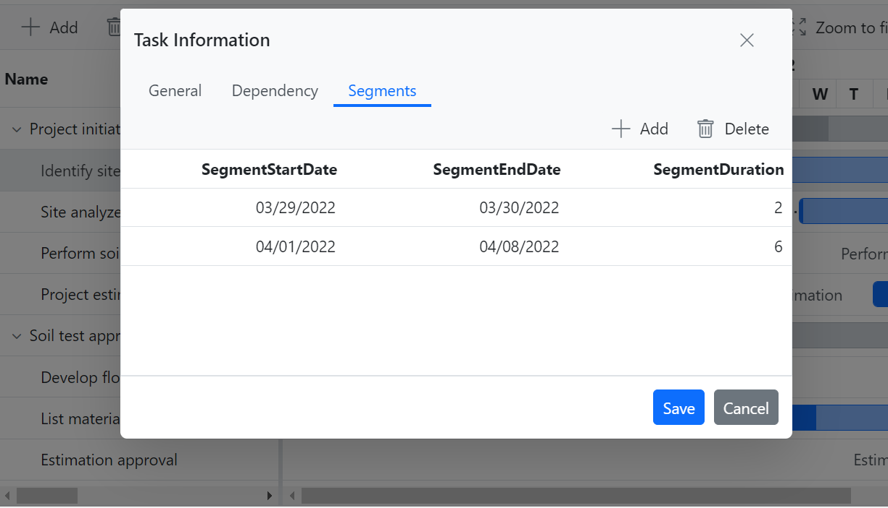
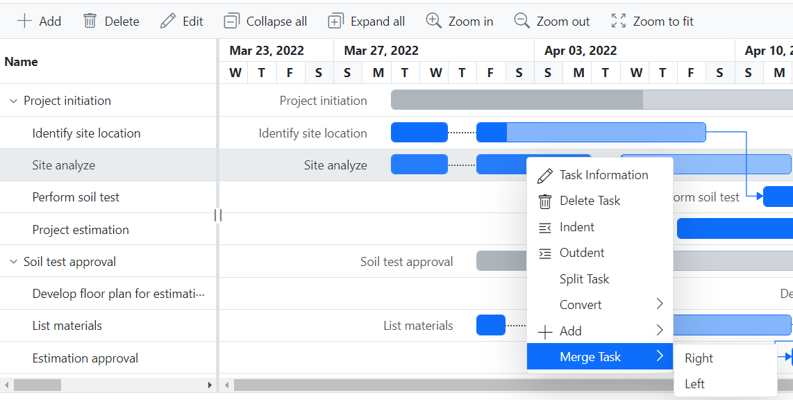
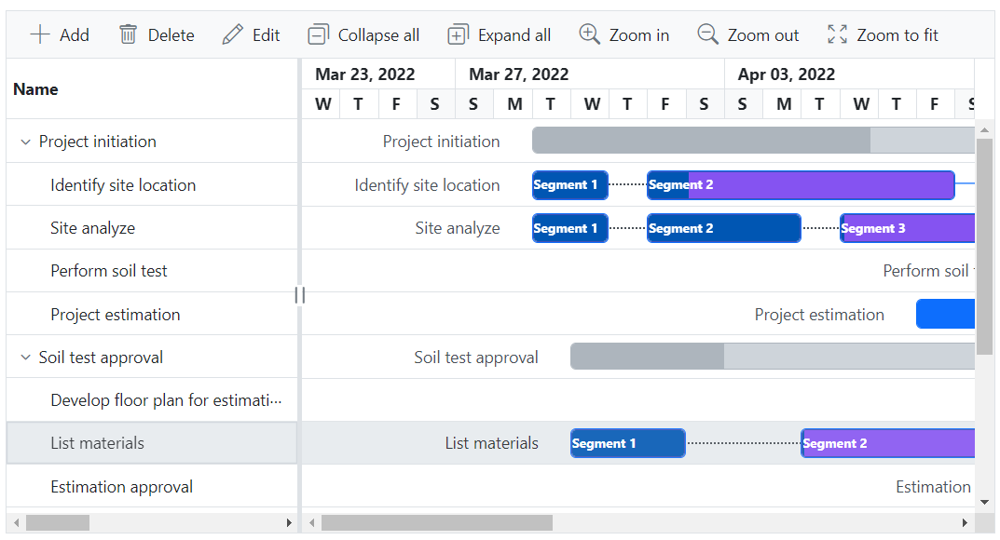

# Split task in Blazor Gantt Chart component

In [Blazor Gantt Chart](https://www.syncfusion.com/blazor-components/blazor-gantt-chart), the split task feature allows you to split a task or interrupt the work during planned or unforeseen circumstances. It makes the view dynamic and interactive, improving the visualization of the project taskbar. The split portions of a taskbar in the Gantt Chart are called **segments**. You can both split and merge multiple segments within a taskbar. This feature works in both project and resource views.

## Mapping segment fields

To enable the split task feature using the [GanttSegmentFields](https://help.syncfusion.com/cr/blazor/Syncfusion.Blazor.Gantt.GanttSegmentFields.html) in the [SfGantt](https://help.syncfusion.com/cr/blazor/Syncfusion.Blazor.Gantt.SfGantt-1.html) chart, you can utilize its properties such as [PrimaryKey](https://help.syncfusion.com/cr/blazor/Syncfusion.Blazor.Gantt.GanttSegmentFields.html#Syncfusion_Blazor_Gantt_GanttSegmentFields_PrimaryKey), [ForeignKey](https://help.syncfusion.com/cr/blazor/Syncfusion.Blazor.Gantt.GanttSegmentFields.html#Syncfusion_Blazor_Gantt_GanttSegmentFields_ForeignKey), [StartDate](https://help.syncfusion.com/cr/blazor/Syncfusion.Blazor.Gantt.GanttSegmentFields.html#Syncfusion_Blazor_Gantt_GanttSegmentFields_StartDate), [EndDate](https://help.syncfusion.com/cr/blazor/Syncfusion.Blazor.Gantt.GanttSegmentFields.html#Syncfusion_Blazor_Gantt_GanttSegmentFields_EndDate), [Duration](https://help.syncfusion.com/cr/blazor/Syncfusion.Blazor.Gantt.GanttSegmentFields.html#Syncfusion_Blazor_Gantt_GanttSegmentFields_Duration), [DataSource](https://help.syncfusion.com/cr/blazor/Syncfusion.Blazor.Gantt.GanttSegmentFields.html#Syncfusion_Blazor_Gantt_GanttSegmentFields_DataSource).

## Interaction modes for split and merge task

  `Dialog`: The Segments tab includes a mandatory start date. The inclusion of either duration or end date is optional, and this behavior is based on the mapping in the `GanttSegmentFields` component.

  `Context menu`: If the `GanttSegmentFields` component is mapped and the [EnableContextMenu](https://help.syncfusion.com/cr/blazor/Syncfusion.Blazor.Gantt.SfGantt-1.html#Syncfusion_Blazor_Gantt_SfGantt_1_EnableContextMenu) property is enabled, the context menu will include the `Split Task` and `Merge Task` items.
  You can split taskbar by first opening the context menu within the taskbar. To merge taskbars, click the taskbar and choose the merge action either to the right or left.

  `Method`: You can split taskbar using the [SplitTaskAsync](https://help.syncfusion.com/cr/blazor/Syncfusion.Blazor.Gantt.SfGantt-1.html#Syncfusion_Blazor_Gantt_SfGantt_1_SplitTaskAsync) method and merge taskbar using the [MergeTaskAsync](https://help.syncfusion.com/cr/blazor/Syncfusion.Blazor.Gantt.SfGantt-1.html#Syncfusion_Blazor_Gantt_SfGantt_1_MergeTaskAsync) method.


```cshtml
@using Syncfusion.Blazor.Gantt
<SfGantt TValue="TaskData" DataSource="@TaskCollection" Height="450px" Width="100%" TreeColumnIndex="1" Toolbar="@(new List<Object>() { "Add", "Cancel", "Update" , "Delete", "Edit", "CollapseAll", "ExpandAll", "ZoomIn", "ZoomOut", "ZoomToFit" })" EnableContextMenu="true" RowHeight="37" ProjectStartDate="ProjectStart" ProjectEndDate="ProjectEnd">
    <GanttTaskFields Id="TaskId" Name="TaskName" StartDate="StartDate" EndDate="EndDate" Duration="Duration" Progress="Progress" ParentID="ParentId" Dependency="Predecessor">
    </GanttTaskFields>
    <GanttEditSettings AllowAdding="true" AllowDeleting="true" AllowEditing="true" AllowTaskbarEditing="true"></GanttEditSettings>
    <GanttSegmentFields PrimaryKey="Id" ForeignKey="TaskId" StartDate="SegmentStartDate" EndDate="SegmentEndDate" Duration="SegmentDuration" TValue="TaskData" TSegments="SegmentModel" DataSource="SegmentCollection"></GanttSegmentFields>
    <GanttLabelSettings LeftLabel="TaskName" TValue="TaskData"></GanttLabelSettings>
    <GanttColumns>
        <GanttColumn Field="TaskId" Width="100" Visible="false"></GanttColumn>
        <GanttColumn Field="TaskName" Width="250" ClipMode="Syncfusion.Blazor.Grids.ClipMode.EllipsisWithTooltip"></GanttColumn>
        <GanttColumn Field="StartDate" HeaderText="Start Date"></GanttColumn>
        <GanttColumn Field="EndDate" HeaderText="End Date"></GanttColumn>
        <GanttColumn Field="Duration" HeaderText="Duration"></GanttColumn>
        <GanttColumn Field="Progress" HeaderText="Progress"></GanttColumn>
        <GanttColumn Field="Predecessor" HeaderText="Dependency"></GanttColumn>
    </GanttColumns>
</SfGantt>

@code {
    private DateTime ProjectStart = new DateTime(2022, 03, 23);
    private DateTime ProjectEnd = new DateTime(2022, 05, 10);
    private List<TaskData> TaskCollection { get; set; }
    private List<SegmentModel> SegmentCollection { get; set; }
    protected override void OnInitialized()
    {
        this.TaskCollection = GetTaskCollection();
        this.SegmentCollection = GetSegmentCollection();
    }
    public class SegmentModel
    {
        public int Id { get; set; }
        public int TaskId { get; set; }
        public DateTime SegmentStartDate { get; set; }
        public DateTime SegmentEndDate { get; set; }
        public string SegmentDuration { get; set; }
    }
    public class TaskData
    {
        public int TaskId { get; set; }
        public string TaskName { get; set; }
        public DateTime? StartDate { get; set; }
        public DateTime? EndDate { get; set; }
        public string Duration { get; set; }
        public int Progress { get; set; }
        public int? ParentId { get; set; }
        public string Predecessor { get; set; }
    }
    public static List<TaskData> GetTaskCollection()
    {
        List<TaskData> Tasks = new List<TaskData>() {
            new TaskData() { TaskId = 1, TaskName = "Project initiation", StartDate = new DateTime(2022, 03, 28), EndDate = new DateTime(2022, 07, 28), Duration="4" },
            new TaskData() { TaskId = 2, TaskName = "Identify site location", StartDate = new DateTime(2022, 03, 29), Progress = 30, ParentId = 1, Duration="8", },
            new TaskData() { TaskId = 3, TaskName = "Site analyze", StartDate = new DateTime(2022, 03, 29),  Progress = 50, ParentId = 1, Duration="8"},
            new TaskData() { TaskId = 4, TaskName = "Perform soil test", StartDate = new DateTime(2022, 03, 29), ParentId = 1, Duration="5", Predecessor="2FS", Progress=40, },
            new TaskData() { TaskId = 5, TaskName = "Soil test approval", StartDate = new DateTime(2022, 03, 29), Duration="4", Progress = 30 },
            new TaskData() { TaskId = 6, TaskName = "Project estimation", StartDate = new DateTime(2022, 04, 08), Duration="8", Progress=40, ParentId=1 },
            new TaskData() { TaskId = 7, TaskName = "Develop floor plan for estimation", StartDate = new DateTime(2022, 03, 29), Duration = "0", Progress = 30, ParentId = 5, Predecessor= "4FS" },
            new TaskData() { TaskId = 8, TaskName = "List materials", StartDate = new DateTime(2022, 04, 01), Duration = "6", Progress = 30, ParentId = 5 },
            new TaskData() { TaskId = 9, TaskName = "Estimation approval",Progress=30, StartDate = new DateTime(2022, 04, 01), Duration = "4", ParentId = 5, Predecessor="8FS" },
            new TaskData() { TaskId = 10, TaskName = "Building approval", StartDate = new DateTime(2022, 04, 12), Duration = "5", ParentId = 5 },
            new TaskData() { TaskId = 11, TaskName = "Construction initiation", StartDate = new DateTime(2022, 04, 01), Duration = "5", Progress=40 },
            new TaskData() { TaskId = 12, TaskName = "Ground floor initiation", StartDate = new DateTime(2022, 04, 05), Duration = "5", ParentId = 11, Progress=40},
            new TaskData() { TaskId = 13, TaskName = "First floor initiation", StartDate = new DateTime(2022, 04, 05), Duration = "7",ParentId = 11, Progress=40},
            new TaskData() { TaskId = 14, TaskName = "Electric work initiation", StartDate = new DateTime(2022, 04, 01), Duration = "5", ParentId = 11, Progress=40, },
            new TaskData() { TaskId = 15, TaskName = "Plumbing work", StartDate = new DateTime(2022, 04, 02), Duration = "5", ParentId = 11, Progress=40 },
       };
        return Tasks;
    }
    private List<SegmentModel> GetSegmentCollection()
    {
        List<SegmentModel> segments = new List<SegmentModel>();
        segments.Add(new SegmentModel() { Id = 1, TaskId = 2, SegmentStartDate = new DateTime(2022, 04, 01), SegmentDuration = "1" });
        segments.Add(new SegmentModel() { Id = 2, TaskId = 2, SegmentStartDate = new DateTime(2022, 03, 29), SegmentEndDate = new DateTime(2022, 03, 31) });
        segments.Add(new SegmentModel() { Id = 3, TaskId = 3, SegmentStartDate = new DateTime(2022, 04, 01), SegmentDuration = "2" });
        segments.Add(new SegmentModel() { Id = 4, TaskId = 3, SegmentStartDate = new DateTime(2022, 03, 29), SegmentEndDate = new DateTime(2022, 03, 31) });
        segments.Add(new SegmentModel() { Id = 5, TaskId = 3, SegmentStartDate = new DateTime(2022, 04, 04), SegmentDuration = "3" });
        segments.Add(new SegmentModel() { Id = 6, TaskId = 4, SegmentStartDate = new DateTime(2022, 04, 01), SegmentDuration = "1" });
        segments.Add(new SegmentModel() { Id = 7, TaskId = 4, SegmentStartDate = new DateTime(2022, 03, 29), SegmentEndDate = new DateTime(2022, 03, 31) });
        segments.Add(new SegmentModel() { Id = 8, TaskId = 8, SegmentStartDate = new DateTime(2022, 04, 01), SegmentEndDate = new DateTime(2022, 04, 03) });
        segments.Add(new SegmentModel() { Id = 9, TaskId = 8, SegmentStartDate = new DateTime(2022, 04, 05), SegmentDuration = "1" });
        segments.Add(new SegmentModel() { Id = 10, TaskId = 9, SegmentStartDate = new DateTime(2022, 03, 29), SegmentEndDate = new DateTime(2022, 03, 31) });
        segments.Add(new SegmentModel() { Id = 11, TaskId = 9, SegmentStartDate = new DateTime(2022, 04, 01), SegmentDuration = "1" });
        segments.Add(new SegmentModel() { Id = 12, TaskId = 12, SegmentStartDate = new DateTime(2022, 04, 05), SegmentDuration = "1" });
        segments.Add(new SegmentModel() { Id = 13, TaskId = 12, SegmentStartDate = new DateTime(2022, 04, 07), SegmentDuration = "1" });
        segments.Add(new SegmentModel() { Id = 14, TaskId = 14, SegmentStartDate = new DateTime(2022, 04, 01), SegmentEndDate = new DateTime(2022, 04, 02) });
        segments.Add(new SegmentModel() { Id = 15, TaskId = 14, SegmentStartDate = new DateTime(2022, 04, 04), SegmentDuration = "2" });
        return segments;
    }
}
```

## Segment event

The [SegmentChanging](https://help.syncfusion.com/cr/blazor/Syncfusion.Blazor.Gantt.GanttSegmentFields.html#Syncfusion_Blazor_Gantt_GanttSegmentFields_SegmentChanging) event is triggered when split and merge actions are performed, and there are changes in the scheduling of tasks.

> The `Cancel` property is only applicable for split and merge actions; it does not apply to changes in the scheduling of tasks.

```cshtml
@using Syncfusion.Blazor.Gantt
<SfGantt TValue="TaskData" DataSource="@TaskCollection" Height="450px" Width="100%" TreeColumnIndex="1" Toolbar="@(new List<Object>() { "Add", "Cancel", "Update" , "Delete", "Edit", "CollapseAll", "ExpandAll", "ZoomIn", "ZoomOut", "ZoomToFit" })" EnableContextMenu="true" RowHeight="37" ProjectStartDate="ProjectStart" ProjectEndDate="ProjectEnd">
    <GanttTaskFields Id="TaskId" Name="TaskName" StartDate="StartDate" EndDate="EndDate" Duration="Duration" Progress="Progress" ParentID="ParentId" Dependency="Predecessor">
    </GanttTaskFields>
    <GanttEditSettings AllowAdding="true" AllowDeleting="true" AllowEditing="true" AllowTaskbarEditing="true"></GanttEditSettings>
    <GanttSegmentFields PrimaryKey="Id" ForeignKey="TaskId" StartDate="SegmentStartDate" EndDate="SegmentEndDate" Duration="SegmentDuration" TValue="TaskData" TSegments="SegmentModel" DataSource="SegmentCollection" SegmentChanging="SegmentEventHandler"></GanttSegmentFields>
    <GanttLabelSettings LeftLabel="TaskName" TValue="TaskData"></GanttLabelSettings>
    <GanttColumns>
        <GanttColumn Field="TaskId" Width="100" Visible="false"></GanttColumn>
        <GanttColumn Field="TaskName" Width="250" ClipMode="Syncfusion.Blazor.Grids.ClipMode.EllipsisWithTooltip"></GanttColumn>
        <GanttColumn Field="StartDate" HeaderText="Start Date"></GanttColumn>
        <GanttColumn Field="EndDate" HeaderText="End Date"></GanttColumn>
        <GanttColumn Field="Duration" HeaderText="Duration"></GanttColumn>
        <GanttColumn Field="Progress" HeaderText="Progress"></GanttColumn>
        <GanttColumn Field="Predecessor" HeaderText="Dependency"></GanttColumn>
    </GanttColumns>
</SfGantt>

@code {
    private DateTime ProjectStart = new DateTime(2022, 03, 23);
    private DateTime ProjectEnd = new DateTime(2022, 05, 10);
    private List<TaskData> TaskCollection { get; set; }
    private List<SegmentModel> SegmentCollection { get; set; }
    protected override void OnInitialized()
    {
        this.TaskCollection = GetTaskCollection();
        this.SegmentCollection = GetSegmentCollection();
    }
    public class SegmentModel
    {
        public int Id { get; set; }
        public int TaskId { get; set; }
        public DateTime SegmentStartDate { get; set; }
        public DateTime SegmentEndDate { get; set; }
        public string SegmentDuration { get; set; }
    }
    public class TaskData
    {
        public int TaskId { get; set; }
        public string TaskName { get; set; }
        public DateTime? StartDate { get; set; }
        public DateTime? EndDate { get; set; }
        public string Duration { get; set; }
        public int Progress { get; set; }
        public int? ParentId { get; set; }
        public string Predecessor { get; set; }
    }
    public static List<TaskData> GetTaskCollection()
    {
        List<TaskData> Tasks = new List<TaskData>() {
            new TaskData() { TaskId = 1, TaskName = "Project initiation", StartDate = new DateTime(2022, 03, 28), EndDate = new DateTime(2022, 07, 28), Duration="4" },
            new TaskData() { TaskId = 2, TaskName = "Identify site location", StartDate = new DateTime(2022, 03, 29), Progress = 30, ParentId = 1, Duration="8", },
            new TaskData() { TaskId = 3, TaskName = "Site analyze", StartDate = new DateTime(2022, 03, 29),  Progress = 50, ParentId = 1, Duration="8"},
            new TaskData() { TaskId = 4, TaskName = "Perform soil test", StartDate = new DateTime(2022, 03, 29), ParentId = 1, Duration="5", Predecessor="2FS", Progress=40, },
            new TaskData() { TaskId = 5, TaskName = "Soil test approval", StartDate = new DateTime(2022, 03, 29), Duration="4", Progress = 30 },
            new TaskData() { TaskId = 6, TaskName = "Project estimation", StartDate = new DateTime(2022, 04, 08), Duration="8", Progress=40, ParentId=1 },
            new TaskData() { TaskId = 7, TaskName = "Develop floor plan for estimation", StartDate = new DateTime(2022, 03, 29), Duration = "0", Progress = 30, ParentId = 5, Predecessor= "4FS" },
            new TaskData() { TaskId = 8, TaskName = "List materials", StartDate = new DateTime(2022, 04, 01), Duration = "6", Progress = 30, ParentId = 5 },
            new TaskData() { TaskId = 9, TaskName = "Estimation approval",Progress=30, StartDate = new DateTime(2022, 04, 01), Duration = "4", ParentId = 5, Predecessor="8FS" },
            new TaskData() { TaskId = 10, TaskName = "Building approval", StartDate = new DateTime(2022, 04, 12), Duration = "5", ParentId = 5 },
            new TaskData() { TaskId = 11, TaskName = "Construction initiation", StartDate = new DateTime(2022, 04, 01), Duration = "5", Progress=40 },
            new TaskData() { TaskId = 12, TaskName = "Ground floor initiation", StartDate = new DateTime(2022, 04, 05), Duration = "5", ParentId = 11, Progress=40},
            new TaskData() { TaskId = 13, TaskName = "First floor initiation", StartDate = new DateTime(2022, 04, 05), Duration = "7",ParentId = 11, Progress=40},
            new TaskData() { TaskId = 14, TaskName = "Electric work initiation", StartDate = new DateTime(2022, 04, 01), Duration = "5", ParentId = 11, Progress=40, },
            new TaskData() { TaskId = 15, TaskName = "Plumbing work", StartDate = new DateTime(2022, 04, 02), Duration = "5", ParentId = 11, Progress=40 },
       };
        return Tasks;
    }
    private List<SegmentModel> GetSegmentCollection()
    {
        List<SegmentModel> segments = new List<SegmentModel>();
        segments.Add(new SegmentModel() { Id = 1, TaskId = 2, SegmentStartDate = new DateTime(2022, 04, 01), SegmentDuration = "1" });
        segments.Add(new SegmentModel() { Id = 2, TaskId = 2, SegmentStartDate = new DateTime(2022, 03, 29), SegmentEndDate = new DateTime(2022, 03, 31) });
        segments.Add(new SegmentModel() { Id = 3, TaskId = 3, SegmentStartDate = new DateTime(2022, 04, 01), SegmentDuration = "2" });
        segments.Add(new SegmentModel() { Id = 4, TaskId = 3, SegmentStartDate = new DateTime(2022, 03, 29), SegmentEndDate = new DateTime(2022, 03, 31) });
        segments.Add(new SegmentModel() { Id = 5, TaskId = 3, SegmentStartDate = new DateTime(2022, 04, 04), SegmentDuration = "3" });
        segments.Add(new SegmentModel() { Id = 6, TaskId = 4, SegmentStartDate = new DateTime(2022, 04, 01), SegmentDuration = "1" });
        segments.Add(new SegmentModel() { Id = 7, TaskId = 4, SegmentStartDate = new DateTime(2022, 03, 29), SegmentEndDate = new DateTime(2022, 03, 31) });
        segments.Add(new SegmentModel() { Id = 8, TaskId = 8, SegmentStartDate = new DateTime(2022, 04, 01), SegmentEndDate = new DateTime(2022, 04, 03) });
        segments.Add(new SegmentModel() { Id = 9, TaskId = 8, SegmentStartDate = new DateTime(2022, 04, 05), SegmentDuration = "1" });
        segments.Add(new SegmentModel() { Id = 10, TaskId = 9, SegmentStartDate = new DateTime(2022, 03, 29), SegmentEndDate = new DateTime(2022, 03, 31) });
        segments.Add(new SegmentModel() { Id = 11, TaskId = 9, SegmentStartDate = new DateTime(2022, 04, 01), SegmentDuration = "1" });
        segments.Add(new SegmentModel() { Id = 12, TaskId = 12, SegmentStartDate = new DateTime(2022, 04, 05), SegmentDuration = "1" });
        segments.Add(new SegmentModel() { Id = 13, TaskId = 12, SegmentStartDate = new DateTime(2022, 04, 07), SegmentDuration = "1" });
        segments.Add(new SegmentModel() { Id = 14, TaskId = 14, SegmentStartDate = new DateTime(2022, 04, 01), SegmentEndDate = new DateTime(2022, 04, 02) });
        segments.Add(new SegmentModel() { Id = 15, TaskId = 14, SegmentStartDate = new DateTime(2022, 04, 04), SegmentDuration = "2" });
        return segments;
    }

    private async Task SegmentEventHandler(SegmentEventArgs<SegmentModel> args)
    {
        if (args.UpdatedSegments != null && args.UpdatedSegments.Any())
        {
            // Here, you can customize your code.
        }
        if (args.DeletedSegments != null && args.DeletedSegments.Any())
        {
            // Here, you can customize your code.
        }
        if (args.AddedSegments != null && args.AddedSegments.Any())
        {
            // Here, you can customize your code.
        }
        await Task.CompletedTask;
    }
}
```

## Segment customization with template

To customize segment taskbars, you can use the [TaskbarTemplate](https://help.syncfusion.com/cr/blazor/Syncfusion.Blazor.Gantt.GanttTemplates-1.html#Syncfusion_Blazor_Gantt_GanttTemplates_1_TaskbarTemplate) component in the following code sample.

```cshtml
@using Syncfusion.Blazor.Gantt
<SfGantt @ref="gantt" TValue="TaskData" DataSource="@TaskCollection" Height="450px" Width="100%" TreeColumnIndex="1" Toolbar="@(new List<Object>() { "Add", "Cancel", "Update" , "Delete", "Edit", "CollapseAll", "ExpandAll", "ZoomIn", "ZoomOut", "ZoomToFit" })" EnableContextMenu="true" RowHeight="37" ProjectStartDate="ProjectStart" ProjectEndDate="ProjectEnd">
    <GanttTaskFields Id="TaskId" Name="TaskName" StartDate="StartDate" EndDate="EndDate" Duration="Duration" Progress="Progress" ParentID="ParentId" Dependency="Predecessor">
    </GanttTaskFields>
    <GanttEditSettings AllowAdding="true" AllowDeleting="true" AllowEditing="true" AllowTaskbarEditing="true"></GanttEditSettings>
    <GanttSegmentFields PrimaryKey="Id" ForeignKey="TaskId" StartDate="SegmentStartDate" EndDate="SegmentEndDate" Duration="SegmentDuration" TValue="TaskData" TSegments="SegmentModel" DataSource="SegmentCollection"></GanttSegmentFields>
    <GanttLabelSettings LeftLabel="TaskName" TValue="TaskData"></GanttLabelSettings>
    <GanttColumns>
        <GanttColumn Field="TaskId" Width="100" Visible="false"></GanttColumn>
        <GanttColumn Field="TaskName" Width="250" ClipMode="Syncfusion.Blazor.Grids.ClipMode.EllipsisWithTooltip"></GanttColumn>
        <GanttColumn Field="StartDate" HeaderText="Start Date"></GanttColumn>
        <GanttColumn Field="EndDate" HeaderText="End Date"></GanttColumn>
        <GanttColumn Field="Duration" HeaderText="Duration"></GanttColumn>
        <GanttColumn Field="Progress" HeaderText="Progress"></GanttColumn>
        <GanttColumn Field="Predecessor" HeaderText="Dependency"></GanttColumn>
    </GanttColumns>
    <GanttTemplates TValue="TaskData">
        <TaskbarTemplate>
            @{
                var task = (context as TaskData);
                if(task == null)
                {
                    return;
                }
                var taskModel = GetTaskData(task);
                List<GanttSegmentData> segments = taskModel.Segments;
                @if (segments != null && segments.Count() > 1)
                {
                    foreach (var segment in segments)
                    {
                        <div class="e-gantt-child-taskbar-inner-div e-gantt-child-taskbar e-segmented-taskbar" style=@("height:24px;position: absolute;left:" + segment.Left + "px; width:" + segment.Width + "px;") tabindex=-1 data-segment-index="@(segment.SegmentIndex)">
                            <div class="e-taskbar-left-resizer e-icon" style="margin-top: 5px; left:2px">
                            </div>
                            <div class="e-gantt-child-progressbar-inner-div e-gantt-child-progressbar" style="height:24px;width:@(segment.ProgressWidth + "px");border-radius: 0px;text-align: right;">
                            </div>
                            <div class="e-taskbar-right-resizer e-icon" style="margin-top: 5px;left:@((segment.Width) - 15)px">
                            </div>
                        </div>
                    }
                }
                else
                {
                    <div class="e-gantt-child-taskbar e-gantt-child-taskbar-inner-div" style="height:24px;" tabindex=-1>
                        <div class="e-taskbar-left-resizer e-icon" style="margin-top: 5px; left:2px">
                        </div>
                        <div class="e-gantt-child-progressbar-inner-div e-gantt-child-progressbar" style="height:24px;width:@(taskModel.ProgressWidth + "px");text-align: right;border-radius: 0px;">
                        </div>
                        <div class="e-taskbar-right-resizer e-icon" style="margin-top: 5px;left:@(taskModel.Left)px">
                        </div>
                    </div>
                }
            }
        </TaskbarTemplate>
    </GanttTemplates>
</SfGantt>
<style>
    .e-segmented-taskbar.e-gantt-clone-taskbar{
        top: 0px !important;
    }

    .e-segmented-taskbar .e-gantt-child-progressbar {
        background-color: #0056B3 !important;
    }

    .e-segmented-taskbar {
        background-color: #8553F1 !important;
        border: 1px solid #3f51b5 !important;
    }
</style>
@code {
    private SfGantt<TaskData> gantt;
    private DateTime ProjectStart = new DateTime(2022, 03, 23);
    private DateTime ProjectEnd = new DateTime(2022, 05, 10);
    private List<TaskData> TaskCollection { get; set; }
    private List<SegmentModel> SegmentCollection { get; set; }
    protected override void OnInitialized()
    {
        this.TaskCollection = GetTaskCollection();
        this.SegmentCollection = GetSegmentCollection();
    }
    public class SegmentModel
    {
        public int Id { get; set; }
        public int TaskId { get; set; }
        public DateTime SegmentStartDate { get; set; }
        public DateTime SegmentEndDate { get; set; }
        public string SegmentDuration { get; set; }
    }
    public class TaskData
    {
        public int TaskId { get; set; }
        public string TaskName { get; set; }
        public DateTime? StartDate { get; set; }
        public DateTime? EndDate { get; set; }
        public string Duration { get; set; }
        public int Progress { get; set; }
        public int? ParentId { get; set; }
        public string Predecessor { get; set; }
    }
    public static List<TaskData> GetTaskCollection()
    {
        List<TaskData> Tasks = new List<TaskData>() {
            new TaskData() { TaskId = 1, TaskName = "Project initiation", StartDate = new DateTime(2022, 03, 28), EndDate = new DateTime(2022, 07, 28), Duration="4" },
            new TaskData() { TaskId = 2, TaskName = "Identify site location", StartDate = new DateTime(2022, 03, 29), Progress = 30, ParentId = 1, Duration="8", },
            new TaskData() { TaskId = 3, TaskName = "Site analyze", StartDate = new DateTime(2022, 03, 29),  Progress = 50, ParentId = 1, Duration="8"},
            new TaskData() { TaskId = 4, TaskName = "Perform soil test", StartDate = new DateTime(2022, 03, 29), ParentId = 1, Duration="5", Predecessor="2FS", Progress=40, },
            new TaskData() { TaskId = 5, TaskName = "Soil test approval", StartDate = new DateTime(2022, 03, 29), Duration="4", Progress = 30 },
            new TaskData() { TaskId = 6, TaskName = "Project estimation", StartDate = new DateTime(2022, 04, 08), Duration="8", Progress=40, ParentId=1 },
            new TaskData() { TaskId = 7, TaskName = "Develop floor plan for estimation", StartDate = new DateTime(2022, 03, 29), Duration = "0", Progress = 30, ParentId = 5, Predecessor= "4FS" },
            new TaskData() { TaskId = 8, TaskName = "List materials", StartDate = new DateTime(2022, 04, 01), Duration = "6", Progress = 30, ParentId = 5 },
            new TaskData() { TaskId = 9, TaskName = "Estimation approval",Progress=30, StartDate = new DateTime(2022, 04, 01), Duration = "4", ParentId = 5, Predecessor="8FS" },
            new TaskData() { TaskId = 10, TaskName = "Building approval", StartDate = new DateTime(2022, 04, 12), Duration = "5", ParentId = 5 },
            new TaskData() { TaskId = 11, TaskName = "Construction initiation", StartDate = new DateTime(2022, 04, 01), Duration = "5", Progress=40 },
            new TaskData() { TaskId = 12, TaskName = "Ground floor initiation", StartDate = new DateTime(2022, 04, 05), Duration = "5", ParentId = 11, Progress=40},
            new TaskData() { TaskId = 13, TaskName = "First floor initiation", StartDate = new DateTime(2022, 04, 05), Duration = "7",ParentId = 11, Progress=40},
            new TaskData() { TaskId = 14, TaskName = "Electric work initiation", StartDate = new DateTime(2022, 04, 01), Duration = "5", ParentId = 11, Progress=40, },
            new TaskData() { TaskId = 15, TaskName = "Plumbing work", StartDate = new DateTime(2022, 04, 02), Duration = "5", ParentId = 11, Progress=40 },
       };
        return Tasks;
    }
    private List<SegmentModel> GetSegmentCollection()
    {
        List<SegmentModel> segments = new List<SegmentModel>();
        segments.Add(new SegmentModel() { Id = 1, TaskId = 2, SegmentStartDate = new DateTime(2022, 04, 01), SegmentDuration = "1" });
        segments.Add(new SegmentModel() { Id = 2, TaskId = 2, SegmentStartDate = new DateTime(2022, 03, 29), SegmentEndDate = new DateTime(2022, 03, 31) });
        segments.Add(new SegmentModel() { Id = 3, TaskId = 3, SegmentStartDate = new DateTime(2022, 04, 01), SegmentDuration = "2" });
        segments.Add(new SegmentModel() { Id = 4, TaskId = 3, SegmentStartDate = new DateTime(2022, 03, 29), SegmentEndDate = new DateTime(2022, 03, 31) });
        segments.Add(new SegmentModel() { Id = 5, TaskId = 3, SegmentStartDate = new DateTime(2022, 04, 04), SegmentDuration = "3" });
        segments.Add(new SegmentModel() { Id = 6, TaskId = 4, SegmentStartDate = new DateTime(2022, 04, 01), SegmentDuration = "1" });
        segments.Add(new SegmentModel() { Id = 7, TaskId = 4, SegmentStartDate = new DateTime(2022, 03, 29), SegmentEndDate = new DateTime(2022, 03, 31) });
        segments.Add(new SegmentModel() { Id = 8, TaskId = 8, SegmentStartDate = new DateTime(2022, 04, 01), SegmentEndDate = new DateTime(2022, 04, 03) });
        segments.Add(new SegmentModel() { Id = 9, TaskId = 8, SegmentStartDate = new DateTime(2022, 04, 05), SegmentDuration = "1" });
        segments.Add(new SegmentModel() { Id = 10, TaskId = 9, SegmentStartDate = new DateTime(2022, 03, 29), SegmentEndDate = new DateTime(2022, 03, 31) });
        segments.Add(new SegmentModel() { Id = 11, TaskId = 9, SegmentStartDate = new DateTime(2022, 04, 01), SegmentDuration = "1" });
        segments.Add(new SegmentModel() { Id = 12, TaskId = 12, SegmentStartDate = new DateTime(2022, 04, 05), SegmentDuration = "1" });
        segments.Add(new SegmentModel() { Id = 13, TaskId = 12, SegmentStartDate = new DateTime(2022, 04, 07), SegmentDuration = "1" });
        segments.Add(new SegmentModel() { Id = 14, TaskId = 14, SegmentStartDate = new DateTime(2022, 04, 01), SegmentEndDate = new DateTime(2022, 04, 02) });
        segments.Add(new SegmentModel() { Id = 15, TaskId = 14, SegmentStartDate = new DateTime(2022, 04, 04), SegmentDuration = "2" });
        return segments;
    }
    private IGanttTaskModel<TaskData> GetTaskData(TaskData data)
    {
        return gantt.GetRowTaskModel(data);
    }
}
```

#### Split task in Blazor Gantt Chart


#### Editing split task with edit dialog



#### Editing split task with context menu



#### Split task template in Blazor Gantt Chart



## Limitation

* Parent and milestone tasks cannot be split into segments.