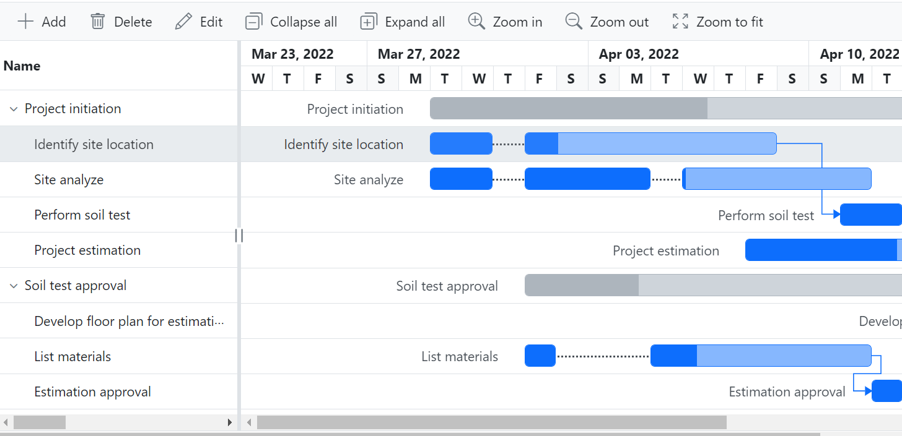
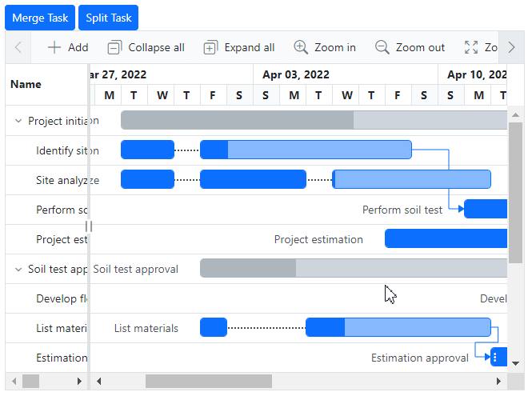

# Split task in Blazor Gantt Chart component

In [Blazor Gantt Chart](https://www.syncfusion.com/blazor-components/blazor-gantt-chart), the split task feature enables you to divide a task or pause work when necessary, whether it's planned or unexpected. This feature adds dynamism and interactivity to the view, enhancing the visualization of project tasks on the timeline. The divided parts of a task's bar in the Gantt Chart are referred to as **segments**. You have the flexibility to both split and merge multiple segments within a taskbar.

## Binding segments data source

In the Blazor Gantt chart, the [GanttSegmentFields](https://help.syncfusion.com/cr/blazor/Syncfusion.Blazor.Gantt.GanttSegmentFields-2.html) component plays a vital role in managing segmented tasks. The [DataSource](https://help.syncfusion.com/cr/blazor/Syncfusion.Blazor.Gantt.GanttSegmentFields-2.html#Syncfusion_Blazor_Gantt_GanttSegmentFields_2_DataSource) property of `GanttSegmentFields` determines the segment data source collection. It is essential that this collection be structured in such a way that the [ForeignKey](https://help.syncfusion.com/cr/blazor/Syncfusion.Blazor.Gantt.GanttSegmentFields-2.html#Syncfusion_Blazor_Gantt_GanttSegmentFields_2_ForeignKey) property of `GanttSegmentFields` and the [ID](https://help.syncfusion.com/cr/blazor/Syncfusion.Blazor.Gantt.GanttTaskFields.html#Syncfusion_Blazor_Gantt_GanttTaskFields_Id) property value of [GanttTaskFields](https://help.syncfusion.com/cr/blazor/Syncfusion.Blazor.Gantt.GanttTaskFields.html) act as a foreign key relationship between the task collection [DataSource](https://help.syncfusion.com/cr/blazor/Syncfusion.Blazor.Gantt.SfGantt-1.html#Syncfusion_Blazor_Gantt_SfGantt_1_DataSource) and the segment collection `DataSource`. Additionally, the start date, end date, and duration field mappings of the segment collection can be defined in `GanttSegmentFields`.

The below code snippet visualizes the task's segments in gantt chart.




@using Syncfusion.Blazor.Gantt
<SfGantt TValue="TaskData" DataSource="@taskCollection" Height="450px" Width="100%" TreeColumnIndex="1" RowHeight="37" ProjectStartDate="projectStart" ProjectEndDate="projectEnd">
    <GanttTaskFields Id="TaskID" Name="TaskName" StartDate="StartDate" EndDate="EndDate" Duration="Duration" Progress="Progress" ParentID="ParentID" Dependency="Predecessor">
    </GanttTaskFields>
    <GanttSegmentFields PrimaryKey="Id" ForeignKey="TaskID" StartDate="SegmentStartDate" EndDate="SegmentEndDate" Duration="SegmentDuration" TValue="TaskData" TSegments="SegmentModel" DataSource="segmentCollection"></GanttSegmentFields>
    <GanttLabelSettings LeftLabel="TaskName" TValue="TaskData"></GanttLabelSettings>
    <GanttColumns>
        <GanttColumn Field="TaskID" Width="100" Visible="false"></GanttColumn>
        <GanttColumn Field="TaskName" Width="250" ClipMode="Syncfusion.Blazor.Grids.ClipMode.EllipsisWithTooltip"></GanttColumn>
        <GanttColumn Field="StartDate" HeaderText="Start Date"></GanttColumn>
        <GanttColumn Field="EndDate" HeaderText="End Date"></GanttColumn>
        <GanttColumn Field="Duration" HeaderText="Duration"></GanttColumn>
        <GanttColumn Field="Progress" HeaderText="Progress"></GanttColumn>
        <GanttColumn Field="Predecessor" HeaderText="Dependency"></GanttColumn>
    </GanttColumns>
</SfGantt>

@code {
    private DateTime projectStart = new DateTime(2022, 03, 23);
    private DateTime projectEnd = new DateTime(2022, 05, 10);
    private List<TaskData> taskCollection { get; set; }
    private List<SegmentModel> segmentCollection { get; set; }
    protected override void OnInitialized()
    {
        this.taskCollection = GetTaskCollection();
        this.segmentCollection = GetSegmentCollection();
    }
    public class SegmentModel
    {
        public int Id { get; set; }
        public int TaskID { get; set; }
        public DateTime SegmentStartDate { get; set; }
        public DateTime SegmentEndDate { get; set; }
        public string SegmentDuration { get; set; }
    }
    public class TaskData
    {
        public int TaskID { get; set; }
        public string TaskName { get; set; }
        public DateTime? StartDate { get; set; }
        public DateTime? EndDate { get; set; }
        public string Duration { get; set; }
        public int Progress { get; set; }
        public int? ParentID { get; set; }
        public string Predecessor { get; set; }
    }
    public static List<TaskData> GetTaskCollection()
    {
        List<TaskData> Tasks = new List<TaskData>() {
            new TaskData() { TaskID = 1, TaskName = "Project initiation", StartDate = new DateTime(2022, 03, 29), EndDate = new DateTime(2022, 04, 19), Duration="4" },
            new TaskData() { TaskID = 2, TaskName = "Identify site location", StartDate = new DateTime(2022, 03, 29), Progress = 30, ParentID = 1, Duration="8", },
            new TaskData() { TaskID = 3, TaskName = "Site analyze", StartDate = new DateTime(2022, 03, 29),  Progress = 50, ParentID = 1, Duration="8"},
            new TaskData() { TaskID = 4, TaskName = "Perform soil test", StartDate = new DateTime(2022, 03, 29), ParentID = 1, Duration="5", Predecessor="2FS", Progress=40, },
            new TaskData() { TaskID = 5, TaskName = "Soil test approval", StartDate = new DateTime(2022, 03, 29), Duration="4", Progress = 30 },
            new TaskData() { TaskID = 6, TaskName = "Project estimation", StartDate = new DateTime(2022, 04, 08), Duration="8", Progress=40, ParentID=1 },
            new TaskData() { TaskID = 7, TaskName = "Develop floor plan for estimation", StartDate = new DateTime(2022, 03, 29), Duration = "0", Progress = 30, ParentID = 5, Predecessor= "4FS" },
            new TaskData() { TaskID = 8, TaskName = "List materials", StartDate = new DateTime(2022, 04, 01), Duration = "6", Progress = 30, ParentID = 5 },
            new TaskData() { TaskID = 9, TaskName = "Estimation approval",Progress=30, StartDate = new DateTime(2022, 04, 01), Duration = "4", ParentID = 5, Predecessor="8FS" },
            new TaskData() { TaskID = 10, TaskName = "Building approval", StartDate = new DateTime(2022, 04, 12), Duration = "5", ParentID = 5 },
            new TaskData() { TaskID = 11, TaskName = "Construction initiation", StartDate = new DateTime(2022, 04, 01), Duration = "5", Progress=40 },
            new TaskData() { TaskID = 12, TaskName = "Ground floor initiation", StartDate = new DateTime(2022, 04, 05), Duration = "5", ParentID = 11, Progress=40},
            new TaskData() { TaskID = 13, TaskName = "First floor initiation", StartDate = new DateTime(2022, 04, 05), Duration = "7",ParentID = 11, Progress=40},
            new TaskData() { TaskID = 14, TaskName = "Electric work initiation", StartDate = new DateTime(2022, 04, 01), Duration = "5", ParentID = 11, Progress=40, },
            new TaskData() { TaskID = 15, TaskName = "Plumbing work", StartDate = new DateTime(2022, 04, 02), Duration = "5", ParentID = 11, Progress=40 },
       };
        return Tasks;
    }
    private List<SegmentModel> GetSegmentCollection()
    {
        List<SegmentModel> segments = new List<SegmentModel>();
        segments.Add(new SegmentModel() { Id = 1, TaskID = 2, SegmentStartDate = new DateTime(2022, 04, 01), SegmentDuration = "1" });
        segments.Add(new SegmentModel() { Id = 2, TaskID = 2, SegmentStartDate = new DateTime(2022, 03, 29), SegmentEndDate = new DateTime(2022, 03, 31) });
        segments.Add(new SegmentModel() { Id = 3, TaskID = 3, SegmentStartDate = new DateTime(2022, 04, 01), SegmentDuration = "2" });
        segments.Add(new SegmentModel() { Id = 4, TaskID = 3, SegmentStartDate = new DateTime(2022, 03, 29), SegmentEndDate = new DateTime(2022, 03, 31) });
        segments.Add(new SegmentModel() { Id = 5, TaskID = 3, SegmentStartDate = new DateTime(2022, 04, 04), SegmentDuration = "3" });
        segments.Add(new SegmentModel() { Id = 6, TaskID = 4, SegmentStartDate = new DateTime(2022, 04, 01), SegmentDuration = "1" });
        segments.Add(new SegmentModel() { Id = 7, TaskID = 4, SegmentStartDate = new DateTime(2022, 03, 29), SegmentEndDate = new DateTime(2022, 03, 31) });
        segments.Add(new SegmentModel() { Id = 8, TaskID = 8, SegmentStartDate = new DateTime(2022, 04, 01), SegmentEndDate = new DateTime(2022, 04, 03) });
        segments.Add(new SegmentModel() { Id = 9, TaskID = 8, SegmentStartDate = new DateTime(2022, 04, 05), SegmentDuration = "1" });
        segments.Add(new SegmentModel() { Id = 10, TaskID = 9, SegmentStartDate = new DateTime(2022, 03, 29), SegmentEndDate = new DateTime(2022, 03, 31) });
        segments.Add(new SegmentModel() { Id = 11, TaskID = 9, SegmentStartDate = new DateTime(2022, 04, 01), SegmentDuration = "1" });
        segments.Add(new SegmentModel() { Id = 12, TaskID = 12, SegmentStartDate = new DateTime(2022, 04, 05), SegmentDuration = "1" });
        segments.Add(new SegmentModel() { Id = 13, TaskID = 12, SegmentStartDate = new DateTime(2022, 04, 07), SegmentDuration = "1" });
        segments.Add(new SegmentModel() { Id = 14, TaskID = 14, SegmentStartDate = new DateTime(2022, 04, 01), SegmentEndDate = new DateTime(2022, 04, 02) });
        segments.Add(new SegmentModel() { Id = 15, TaskID = 14, SegmentStartDate = new DateTime(2022, 04, 04), SegmentDuration = "2" });
        return segments;
    }
}






## Split and merge tasks dynamically

In the Gantt Chart, you can enable dynamic splitting or merging of segments by setting the [AllowTaskbarEditing](https://help.syncfusion.com/cr/blazor/Syncfusion.Blazor.Gantt.GanttEditSettings.html#Syncfusion_Blazor_Gantt_GanttEditSettings_AllowTaskbarEditing) and [AllowEditing](https://help.syncfusion.com/cr/blazor/Syncfusion.Blazor.Gantt.GanttEditSettings.html#Syncfusion_Blazor_Gantt_GanttEditSettings_AllowEditing) properties to true in the [GanttEditSettings](https://help.syncfusion.com/cr/blazor/Syncfusion.Blazor.Gantt.GanttEditSettings.html) component. Tasks or segments can be dynamically split into multiple segments, and also the existing segments can be merged together. Segments can be merged by simply dragging a segment of taskbar and dropping it over another segment of same task. Additionally, the split and merge actions can be performed in the Gantt Chart in the following three ways:

### Through context menu

To split and merge tasks using the context menu, set the [EnableContextMenu](https://help.syncfusion.com/cr/blazor/Syncfusion.Blazor.Gantt.SfGantt-1.html#Syncfusion_Blazor_Gantt_SfGantt_1_EnableContextMenu) property to true in the `SfGantt` component. By using the context menu items, such as **Split Task** and **Merge Task** the taskbar can be split and merged respectively.

When you right-click on a taskbar or segment element in the Gantt chart, the context menu will display the **Split Task** option. Clicking on it will divide the taskbar or segment at the timeline cell where the right-click occurred.
 
The segmented taskbars can be merged together using **Merge Task** context menu item. The sub context menu of **Merge Task**  item includes options for **Right** and **Left**. When the **Right** submenu item is selected, the current segment and the segment to the right of the selected segment gets merged. Similarly, when the **Left** submenu item is selected, the current segment and the segment to the left of the selected segment gets merged.




@using Syncfusion.Blazor.Gantt
<SfGantt TValue="TaskData" EnableContextMenu="true" DataSource="@taskCollection" Height="450px" Width="100%" TreeColumnIndex="1" Toolbar="@(new List<Object>() { "Add", "Cancel", "Update" , "Delete", "Edit", "CollapseAll", "ExpandAll", "ZoomIn", "ZoomOut", "ZoomToFit" })" RowHeight="37" ProjectStartDate="projectStart" ProjectEndDate="projectEnd">
    <GanttTaskFields Id="TaskID" Name="TaskName" StartDate="StartDate" EndDate="EndDate" Duration="Duration" Progress="Progress" ParentID="ParentID" Dependency="Predecessor">
    </GanttTaskFields>
    <GanttEditSettings AllowAdding="true" AllowDeleting="true" AllowEditing="true" AllowTaskbarEditing="true"></GanttEditSettings>
    <GanttSegmentFields PrimaryKey="Id" ForeignKey="TaskID" StartDate="SegmentStartDate" EndDate="SegmentEndDate" Duration="SegmentDuration" TValue="TaskData" TSegments="SegmentModel" DataSource="segmentCollection"></GanttSegmentFields>
    <GanttLabelSettings LeftLabel="TaskName" TValue="TaskData"></GanttLabelSettings>
    <GanttColumns>
        <GanttColumn Field="TaskID" Width="100" Visible="false"></GanttColumn>
        <GanttColumn Field="TaskName" Width="250" ClipMode="Syncfusion.Blazor.Grids.ClipMode.EllipsisWithTooltip"></GanttColumn>
        <GanttColumn Field="StartDate" HeaderText="Start Date"></GanttColumn>
        <GanttColumn Field="EndDate" HeaderText="End Date"></GanttColumn>
        <GanttColumn Field="Duration" HeaderText="Duration"></GanttColumn>
        <GanttColumn Field="Progress" HeaderText="Progress"></GanttColumn>
        <GanttColumn Field="Predecessor" HeaderText="Dependency"></GanttColumn>
    </GanttColumns>
</SfGantt>

@code {
    private DateTime projectStart = new DateTime(2022, 03, 23);
    private DateTime projectEnd = new DateTime(2022, 05, 10);
    private List<TaskData> taskCollection { get; set; }
    private List<SegmentModel> segmentCollection { get; set; }
    protected override void OnInitialized()
    {
        this.taskCollection = GetTaskCollection();
        this.segmentCollection = GetSegmentCollection();
    }
    public class SegmentModel
    {
        public int Id { get; set; }
        public int TaskID { get; set; }
        public DateTime SegmentStartDate { get; set; }
        public DateTime SegmentEndDate { get; set; }
        public string SegmentDuration { get; set; }
    }
    public class TaskData
    {
        public int TaskID { get; set; }
        public string TaskName { get; set; }
        public DateTime? StartDate { get; set; }
        public DateTime? EndDate { get; set; }
        public string Duration { get; set; }
        public int Progress { get; set; }
        public int? ParentID { get; set; }
        public string Predecessor { get; set; }
    }
    public static List<TaskData> GetTaskCollection()
    {
        List<TaskData> Tasks = new List<TaskData>() {
            new TaskData() { TaskID = 1, TaskName = "Project initiation", StartDate = new DateTime(2022, 03, 28), EndDate = new DateTime(2022, 04, 19), Duration="4" },
            new TaskData() { TaskID = 2, TaskName = "Identify site location", StartDate = new DateTime(2022, 03, 29), Progress = 30, ParentID = 1, Duration="8", },
            new TaskData() { TaskID = 3, TaskName = "Site analyze", StartDate = new DateTime(2022, 03, 29),  Progress = 50, ParentID = 1, Duration="8"},
            new TaskData() { TaskID = 4, TaskName = "Perform soil test", StartDate = new DateTime(2022, 03, 29), ParentID = 1, Duration="5", Predecessor="2FS", Progress=40, },
            new TaskData() { TaskID = 5, TaskName = "Soil test approval", StartDate = new DateTime(2022, 03, 29), Duration="4", Progress = 30 },
            new TaskData() { TaskID = 6, TaskName = "Project estimation", StartDate = new DateTime(2022, 04, 08), Duration="8", Progress=40, ParentID=1 },
            new TaskData() { TaskID = 7, TaskName = "Develop floor plan for estimation", StartDate = new DateTime(2022, 03, 29), Duration = "0", Progress = 30, ParentID = 5, Predecessor= "4FS" },
            new TaskData() { TaskID = 8, TaskName = "List materials", StartDate = new DateTime(2022, 04, 01), Duration = "6", Progress = 30, ParentID = 5 },
            new TaskData() { TaskID = 9, TaskName = "Estimation approval",Progress=30, StartDate = new DateTime(2022, 04, 01), Duration = "4", ParentID = 5, Predecessor="8FS" },
            new TaskData() { TaskID = 10, TaskName = "Building approval", StartDate = new DateTime(2022, 04, 12), Duration = "5", ParentID = 5 },
            new TaskData() { TaskID = 11, TaskName = "Construction initiation", StartDate = new DateTime(2022, 04, 01), Duration = "5", Progress=40 },
            new TaskData() { TaskID = 12, TaskName = "Ground floor initiation", StartDate = new DateTime(2022, 04, 05), Duration = "5", ParentID = 11, Progress=40},
            new TaskData() { TaskID = 13, TaskName = "First floor initiation", StartDate = new DateTime(2022, 04, 05), Duration = "7",ParentID = 11, Progress=40},
            new TaskData() { TaskID = 14, TaskName = "Electric work initiation", StartDate = new DateTime(2022, 04, 01), Duration = "5", ParentID = 11, Progress=40, },
            new TaskData() { TaskID = 15, TaskName = "Plumbing work", StartDate = new DateTime(2022, 04, 02), Duration = "5", ParentID = 11, Progress=40 },
       };
        return Tasks;
    }
    private List<SegmentModel> GetSegmentCollection()
    {
        List<SegmentModel> segments = new List<SegmentModel>();
        segments.Add(new SegmentModel() { Id = 1, TaskID = 2, SegmentStartDate = new DateTime(2022, 04, 01), SegmentDuration = "1" });
        segments.Add(new SegmentModel() { Id = 2, TaskID = 2, SegmentStartDate = new DateTime(2022, 03, 29), SegmentEndDate = new DateTime(2022, 03, 31) });
        segments.Add(new SegmentModel() { Id = 3, TaskID = 3, SegmentStartDate = new DateTime(2022, 04, 01), SegmentDuration = "2" });
        segments.Add(new SegmentModel() { Id = 4, TaskID = 3, SegmentStartDate = new DateTime(2022, 03, 29), SegmentEndDate = new DateTime(2022, 03, 31) });
        segments.Add(new SegmentModel() { Id = 5, TaskID = 3, SegmentStartDate = new DateTime(2022, 04, 04), SegmentDuration = "3" });
        segments.Add(new SegmentModel() { Id = 6, TaskID = 4, SegmentStartDate = new DateTime(2022, 04, 01), SegmentDuration = "1" });
        segments.Add(new SegmentModel() { Id = 7, TaskID = 4, SegmentStartDate = new DateTime(2022, 03, 29), SegmentEndDate = new DateTime(2022, 03, 31) });
        segments.Add(new SegmentModel() { Id = 8, TaskID = 8, SegmentStartDate = new DateTime(2022, 04, 01), SegmentEndDate = new DateTime(2022, 04, 03) });
        segments.Add(new SegmentModel() { Id = 9, TaskID = 8, SegmentStartDate = new DateTime(2022, 04, 05), SegmentDuration = "1" });
        segments.Add(new SegmentModel() { Id = 10, TaskID = 9, SegmentStartDate = new DateTime(2022, 03, 29), SegmentEndDate = new DateTime(2022, 03, 31) });
        segments.Add(new SegmentModel() { Id = 11, TaskID = 9, SegmentStartDate = new DateTime(2022, 04, 01), SegmentDuration = "1" });
        segments.Add(new SegmentModel() { Id = 12, TaskID = 12, SegmentStartDate = new DateTime(2022, 04, 05), SegmentDuration = "1" });
        segments.Add(new SegmentModel() { Id = 13, TaskID = 12, SegmentStartDate = new DateTime(2022, 04, 07), SegmentDuration = "1" });
        segments.Add(new SegmentModel() { Id = 14, TaskID = 14, SegmentStartDate = new DateTime(2022, 04, 01), SegmentEndDate = new DateTime(2022, 04, 02) });
        segments.Add(new SegmentModel() { Id = 15, TaskID = 14, SegmentStartDate = new DateTime(2022, 04, 04), SegmentDuration = "2" });
        return segments;
    }
}






### Through dialog box

In the segments tab of the [add/edit dialog](https://blazor.syncfusion.com/documentation/gantt-chart/editing-tasks#dialog-editing), taskbars can be split or merged by providing the segments details such as the start date, end date, and duration. However, it's important to note that the segment start date and end date cannot exceed the task's start date and end date.




@using Syncfusion.Blazor.Gantt
@using System.ComponentModel.DataAnnotations

<SfGantt TValue="TaskData" EnableContextMenu="true" DataSource="@taskCollection" Height="450px" Width="850px" TreeColumnIndex="1" Toolbar="@(new List<Object>() { "Add", "Cancel", "Update" , "Delete", "Edit", "CollapseAll", "ExpandAll", "ZoomIn", "ZoomOut", "ZoomToFit" })" RowHeight="37" ProjectStartDate="projectStart" ProjectEndDate="projectEnd">
    <GanttTaskFields Id="TaskID" Name="TaskName" StartDate="StartDate" EndDate="EndDate" Duration="Duration" Progress="Progress" ParentID="ParentID" Dependency="Predecessor">
    </GanttTaskFields>
    <GanttEditSettings AllowAdding="true" AllowDeleting="true" AllowEditing="true" AllowTaskbarEditing="true"></GanttEditSettings>
    <GanttSegmentFields PrimaryKey="Id" ForeignKey="TaskID" StartDate="SegmentStartDate" EndDate="SegmentEndDate" Duration="SegmentDuration" TValue="TaskData" TSegments="SegmentModel" DataSource="segmentCollection"></GanttSegmentFields>
    <GanttLabelSettings LeftLabel="TaskName" TValue="TaskData"></GanttLabelSettings>
    <GanttColumns>
        <GanttColumn Field="TaskID" Width="100" Visible="false"></GanttColumn>
        <GanttColumn Field="TaskName" Width="250" ClipMode="Syncfusion.Blazor.Grids.ClipMode.EllipsisWithTooltip"></GanttColumn>
        <GanttColumn Field="StartDate" HeaderText="Start Date"></GanttColumn>
        <GanttColumn Field="EndDate" HeaderText="End Date"></GanttColumn>
        <GanttColumn Field="Duration" HeaderText="Duration"></GanttColumn>
        <GanttColumn Field="Progress" HeaderText="Progress"></GanttColumn>
        <GanttColumn Field="Predecessor" HeaderText="Dependency"></GanttColumn>
    </GanttColumns>
</SfGantt>

@code {
    private DateTime projectStart = new DateTime(2022, 03, 23);
    private DateTime projectEnd = new DateTime(2022, 05, 10);
    private List<TaskData> taskCollection { get; set; }
    private List<SegmentModel> segmentCollection { get; set; }
    protected override void OnInitialized()
    {
        this.taskCollection = GetTaskCollection();
        this.segmentCollection = GetSegmentCollection();
    }
    public class SegmentModel
    {
        public int Id { get; set; }
        public int TaskID { get; set; }
        [Display(Name = "Start Date")]
        public DateTime SegmentStartDate { get; set; }
        [Display(Name = "End Date")]
        public DateTime SegmentEndDate { get; set; }
        [Display(Name = "Duration")]
        public string SegmentDuration { get; set; }
    }
    public class TaskData
    {
        public int TaskID { get; set; }
        public string TaskName { get; set; }
        public DateTime? StartDate { get; set; }
        public DateTime? EndDate { get; set; }
        public string Duration { get; set; }
        public int Progress { get; set; }
        public int? ParentID { get; set; }
        public string Predecessor { get; set; }
    }
    public static List<TaskData> GetTaskCollection()
    {
        List<TaskData> Tasks = new List<TaskData>() {
            new TaskData() { TaskID = 1, TaskName = "Project initiation", StartDate = new DateTime(2022, 03, 28), EndDate = new DateTime(2022, 04, 19), Duration="4" },
            new TaskData() { TaskID = 2, TaskName = "Identify site location", StartDate = new DateTime(2022, 03, 29), Progress = 30, ParentID = 1, Duration="8", },
            new TaskData() { TaskID = 3, TaskName = "Site analyze", StartDate = new DateTime(2022, 03, 29),  Progress = 50, ParentID = 1, Duration="8"},
            new TaskData() { TaskID = 4, TaskName = "Perform soil test", StartDate = new DateTime(2022, 03, 29), ParentID = 1, Duration="5", Predecessor="2FS", Progress=40, },
            new TaskData() { TaskID = 5, TaskName = "Soil test approval", StartDate = new DateTime(2022, 03, 29), Duration="4", Progress = 30 },
            new TaskData() { TaskID = 6, TaskName = "Project estimation", StartDate = new DateTime(2022, 04, 08), Duration="8", Progress=40, ParentID=1 },
            new TaskData() { TaskID = 7, TaskName = "Develop floor plan for estimation", StartDate = new DateTime(2022, 03, 29), Duration = "0", Progress = 30, ParentID = 5, Predecessor= "4FS" },
            new TaskData() { TaskID = 8, TaskName = "List materials", StartDate = new DateTime(2022, 04, 01), Duration = "6", Progress = 30, ParentID = 5 },
            new TaskData() { TaskID = 9, TaskName = "Estimation approval",Progress=30, StartDate = new DateTime(2022, 04, 01), Duration = "4", ParentID = 5, Predecessor="8FS" },
            new TaskData() { TaskID = 10, TaskName = "Building approval", StartDate = new DateTime(2022, 04, 12), Duration = "5", ParentID = 5 },
            new TaskData() { TaskID = 11, TaskName = "Construction initiation", StartDate = new DateTime(2022, 04, 01), Duration = "5", Progress=40 },
            new TaskData() { TaskID = 12, TaskName = "Ground floor initiation", StartDate = new DateTime(2022, 04, 05), Duration = "5", ParentID = 11, Progress=40},
            new TaskData() { TaskID = 13, TaskName = "First floor initiation", StartDate = new DateTime(2022, 04, 05), Duration = "7",ParentID = 11, Progress=40},
            new TaskData() { TaskID = 14, TaskName = "Electric work initiation", StartDate = new DateTime(2022, 04, 01), Duration = "5", ParentID = 11, Progress=40, },
            new TaskData() { TaskID = 15, TaskName = "Plumbing work", StartDate = new DateTime(2022, 04, 02), Duration = "5", ParentID = 11, Progress=40 },
       };
        return Tasks;
    }
    private List<SegmentModel> GetSegmentCollection()
    {
        List<SegmentModel> segments = new List<SegmentModel>();
        segments.Add(new SegmentModel() { Id = 1, TaskID = 2, SegmentStartDate = new DateTime(2022, 04, 01), SegmentDuration = "1" });
        segments.Add(new SegmentModel() { Id = 2, TaskID = 2, SegmentStartDate = new DateTime(2022, 03, 29), SegmentEndDate = new DateTime(2022, 03, 31) });
        segments.Add(new SegmentModel() { Id = 3, TaskID = 3, SegmentStartDate = new DateTime(2022, 04, 01), SegmentDuration = "2" });
        segments.Add(new SegmentModel() { Id = 4, TaskID = 3, SegmentStartDate = new DateTime(2022, 03, 29), SegmentEndDate = new DateTime(2022, 03, 31) });
        segments.Add(new SegmentModel() { Id = 5, TaskID = 3, SegmentStartDate = new DateTime(2022, 04, 04), SegmentDuration = "3" });
        segments.Add(new SegmentModel() { Id = 6, TaskID = 4, SegmentStartDate = new DateTime(2022, 04, 01), SegmentDuration = "1" });
        segments.Add(new SegmentModel() { Id = 7, TaskID = 4, SegmentStartDate = new DateTime(2022, 03, 29), SegmentEndDate = new DateTime(2022, 03, 31) });
        segments.Add(new SegmentModel() { Id = 8, TaskID = 8, SegmentStartDate = new DateTime(2022, 04, 01), SegmentEndDate = new DateTime(2022, 04, 03) });
        segments.Add(new SegmentModel() { Id = 9, TaskID = 8, SegmentStartDate = new DateTime(2022, 04, 05), SegmentDuration = "1" });
        segments.Add(new SegmentModel() { Id = 10, TaskID = 9, SegmentStartDate = new DateTime(2022, 03, 29), SegmentEndDate = new DateTime(2022, 03, 31) });
        segments.Add(new SegmentModel() { Id = 11, TaskID = 9, SegmentStartDate = new DateTime(2022, 04, 01), SegmentDuration = "1" });
        segments.Add(new SegmentModel() { Id = 12, TaskID = 12, SegmentStartDate = new DateTime(2022, 04, 05), SegmentDuration = "1" });
        segments.Add(new SegmentModel() { Id = 13, TaskID = 12, SegmentStartDate = new DateTime(2022, 04, 07), SegmentDuration = "1" });
        segments.Add(new SegmentModel() { Id = 14, TaskID = 14, SegmentStartDate = new DateTime(2022, 04, 01), SegmentEndDate = new DateTime(2022, 04, 02) });
        segments.Add(new SegmentModel() { Id = 15, TaskID = 14, SegmentStartDate = new DateTime(2022, 04, 04), SegmentDuration = "2" });
        return segments;
    }
}






### Through method 

You can split or merge taskbars externally by using the methods [SplitTaskAsync](https://help.syncfusion.com/cr/blazor/Syncfusion.Blazor.Gantt.SfGantt-1.html#Syncfusion_Blazor_Gantt_SfGantt_1_SplitTaskAsync_System_Int32_System_Collections_Generic_List_System_DateTime__) and [MergeTaskAsync](https://help.syncfusion.com/cr/blazor/Syncfusion.Blazor.Gantt.SfGantt-1.html#Syncfusion_Blazor_Gantt_SfGantt_1_MergeTaskAsync_System_Int32_System_Collections_Generic_List_System_ValueTuple_System_Int32_System_Int32___) respectively. These methods provide a way to manipulate taskbars programmatically, allowing for efficient splitting and merging operations.

In the following code snippet, upon external button click, segments of the 1st index record are merged into a single taskbar, and the taskbar in the 2nd index record is split into two segments.




@using Syncfusion.Blazor.Gantt
@using Syncfusion.Blazor.Buttons

<SfButton IsPrimary OnClick="MergeTaskHandler">Merge Task</SfButton>
 <SfButton IsPrimary OnClick="SplitTaskHandler">Split Task</SfButton>

 <SfGantt @ref="ganttInstance" TValue="TaskData" DataSource="@taskCollection" Height="450px" Width="100%" TreeColumnIndex="1" Toolbar="@(new List<Object>() { "Add", "Cancel", "Update" , "Delete", "Edit", "CollapseAll", "ExpandAll", "ZoomIn", "ZoomOut", "ZoomToFit" })" EnableContextMenu="true" RowHeight="37" ProjectStartDate="projectStart" ProjectEndDate="projectEnd">
     <GanttTaskFields Id="TaskID" Name="TaskName" StartDate="StartDate" EndDate="EndDate" Duration="Duration" Progress="Progress" ParentID="ParentID" Dependency="Predecessor">
     </GanttTaskFields>
     <GanttEditSettings AllowAdding="true" AllowDeleting="true" AllowEditing="true" AllowTaskbarEditing="true"></GanttEditSettings>
     <GanttSegmentFields PrimaryKey="Id" ForeignKey="TaskID" StartDate="SegmentStartDate" EndDate="SegmentEndDate" Duration="SegmentDuration" TValue="TaskData" TSegments="SegmentModel" DataSource="segmentCollection"></GanttSegmentFields>
     <GanttLabelSettings LeftLabel="TaskName" TValue="TaskData"></GanttLabelSettings>
     <GanttColumns>
         <GanttColumn Field="TaskID" Width="100" Visible="false"></GanttColumn>
         <GanttColumn Field="TaskName" Width="250" ClipMode="Syncfusion.Blazor.Grids.ClipMode.EllipsisWithTooltip"></GanttColumn>
         <GanttColumn Field="StartDate" HeaderText="Start Date"></GanttColumn>
         <GanttColumn Field="EndDate" HeaderText="End Date"></GanttColumn>
         <GanttColumn Field="Duration" HeaderText="Duration"></GanttColumn>
         <GanttColumn Field="Progress" HeaderText="Progress"></GanttColumn>
         <GanttColumn Field="Predecessor" HeaderText="Dependency"></GanttColumn>
     </GanttColumns>
 </SfGantt>

 @code {
    private SfGantt<TaskData> ganttInstance { get; set; }
    private DateTime projectStart = new DateTime(2022, 03, 23);
    private DateTime projectEnd = new DateTime(2022, 05, 10);
    private List<TaskData> taskCollection { get; set; }
    private List<SegmentModel> segmentCollection { get; set; }

    private async Task MergeTaskHandler()
    {
        List<ValueTuple<int, int>> mergeIndexes = new List<ValueTuple<int, int>>();
        mergeIndexes.Add((0, 1));
        await ganttInstance.MergeTaskAsync(2, mergeIndexes);
    }
    private async Task SplitTaskHandler()
    {
        await ganttInstance.SplitTaskAsync(3, new List<DateTime> { new DateTime(2022, 04, 08) });
    }

    protected override void OnInitialized()
    {
        this.taskCollection = GetTaskCollection();
        this.segmentCollection = GetSegmentCollection();
    }
    public class SegmentModel
    {
        public int Id { get; set; }
        public int TaskID { get; set; }
        public DateTime SegmentStartDate { get; set; }
        public DateTime SegmentEndDate { get; set; }
        public string SegmentDuration { get; set; }
    }
    public class TaskData
    {
        public int TaskID { get; set; }
        public string TaskName { get; set; }
        public DateTime? StartDate { get; set; }
        public DateTime? EndDate { get; set; }
        public string Duration { get; set; }
        public int Progress { get; set; }
        public int? ParentID { get; set; }
        public string Predecessor { get; set; }
    }
    public static List<TaskData> GetTaskCollection()
    {
        List<TaskData> Tasks = new List<TaskData>() {
            new TaskData() { TaskID = 1, TaskName = "Project initiation", StartDate = new DateTime(2022, 03, 28), EndDate = new DateTime(2022, 04, 19), Duration="4" },
            new TaskData() { TaskID = 2, TaskName = "Identify site location", StartDate = new DateTime(2022, 03, 29), Progress = 30, ParentID = 1, Duration="8", },
            new TaskData() { TaskID = 3, TaskName = "Site analyze", StartDate = new DateTime(2022, 03, 29),  Progress = 50, ParentID = 1, Duration="8"},
            new TaskData() { TaskID = 4, TaskName = "Perform soil test", StartDate = new DateTime(2022, 03, 29), ParentID = 1, Duration="5", Predecessor="2FS", Progress=40, },
            new TaskData() { TaskID = 5, TaskName = "Soil test approval", StartDate = new DateTime(2022, 03, 29), Duration="4", Progress = 30 },
            new TaskData() { TaskID = 6, TaskName = "Project estimation", StartDate = new DateTime(2022, 04, 08), Duration="8", Progress=40, ParentID=1 },
            new TaskData() { TaskID = 7, TaskName = "Develop floor plan for estimation", StartDate = new DateTime(2022, 03, 29), Duration = "0", Progress = 30, ParentID = 5, Predecessor= "4FS" },
            new TaskData() { TaskID = 8, TaskName = "List materials", StartDate = new DateTime(2022, 04, 01), Duration = "6", Progress = 30, ParentID = 5 },
            new TaskData() { TaskID = 9, TaskName = "Estimation approval",Progress=30, StartDate = new DateTime(2022, 04, 01), Duration = "4", ParentID = 5, Predecessor="8FS" },
            new TaskData() { TaskID = 10, TaskName = "Building approval", StartDate = new DateTime(2022, 04, 12), Duration = "5", ParentID = 5 },
            new TaskData() { TaskID = 11, TaskName = "Construction initiation", StartDate = new DateTime(2022, 04, 01), Duration = "5", Progress=40 },
            new TaskData() { TaskID = 12, TaskName = "Ground floor initiation", StartDate = new DateTime(2022, 04, 05), Duration = "5", ParentID = 11, Progress=40},
            new TaskData() { TaskID = 13, TaskName = "First floor initiation", StartDate = new DateTime(2022, 04, 05), Duration = "7",ParentID = 11, Progress=40},
            new TaskData() { TaskID = 14, TaskName = "Electric work initiation", StartDate = new DateTime(2022, 04, 01), Duration = "5", ParentID = 11, Progress=40, },
            new TaskData() { TaskID = 15, TaskName = "Plumbing work", StartDate = new DateTime(2022, 04, 02), Duration = "5", ParentID = 11, Progress=40 },
       };
        return Tasks;
    }
    private List<SegmentModel> GetSegmentCollection()
    {
        List<SegmentModel> segments = new List<SegmentModel>();
        segments.Add(new SegmentModel() { Id = 1, TaskID = 2, SegmentStartDate = new DateTime(2022, 04, 01), SegmentDuration = "1" });
        segments.Add(new SegmentModel() { Id = 2, TaskID = 2, SegmentStartDate = new DateTime(2022, 03, 29), SegmentEndDate = new DateTime(2022, 03, 31) });
        segments.Add(new SegmentModel() { Id = 3, TaskID = 3, SegmentStartDate = new DateTime(2022, 04, 01), SegmentDuration = "2" });
        segments.Add(new SegmentModel() { Id = 4, TaskID = 3, SegmentStartDate = new DateTime(2022, 03, 29), SegmentEndDate = new DateTime(2022, 03, 31) });
        segments.Add(new SegmentModel() { Id = 5, TaskID = 3, SegmentStartDate = new DateTime(2022, 04, 04), SegmentDuration = "3" });
        segments.Add(new SegmentModel() { Id = 6, TaskID = 4, SegmentStartDate = new DateTime(2022, 04, 01), SegmentDuration = "1" });
        segments.Add(new SegmentModel() { Id = 7, TaskID = 4, SegmentStartDate = new DateTime(2022, 03, 29), SegmentEndDate = new DateTime(2022, 03, 31) });
        segments.Add(new SegmentModel() { Id = 8, TaskID = 8, SegmentStartDate = new DateTime(2022, 04, 01), SegmentEndDate = new DateTime(2022, 04, 03) });
        segments.Add(new SegmentModel() { Id = 9, TaskID = 8, SegmentStartDate = new DateTime(2022, 04, 05), SegmentDuration = "1" });
        segments.Add(new SegmentModel() { Id = 10, TaskID = 9, SegmentStartDate = new DateTime(2022, 03, 29), SegmentEndDate = new DateTime(2022, 03, 31) });
        segments.Add(new SegmentModel() { Id = 11, TaskID = 9, SegmentStartDate = new DateTime(2022, 04, 01), SegmentDuration = "1" });
        segments.Add(new SegmentModel() { Id = 12, TaskID = 12, SegmentStartDate = new DateTime(2022, 04, 05), SegmentDuration = "1" });
        segments.Add(new SegmentModel() { Id = 13, TaskID = 12, SegmentStartDate = new DateTime(2022, 04, 07), SegmentDuration = "1" });
        segments.Add(new SegmentModel() { Id = 14, TaskID = 14, SegmentStartDate = new DateTime(2022, 04, 01), SegmentEndDate = new DateTime(2022, 04, 02) });
        segments.Add(new SegmentModel() { Id = 15, TaskID = 14, SegmentStartDate = new DateTime(2022, 04, 04), SegmentDuration = "2" });
        return segments;
    }
}






 

## Segment event

The [SegmentChanging](https://help.syncfusion.com/cr/blazor/Syncfusion.Blazor.Gantt.GanttSegmentFields-2.html#Syncfusion_Blazor_Gantt_GanttSegmentFields_2_SegmentChanging) event is triggered in the Blazor Gantt chart when split and merge actions occur, or when there are changes in the scheduling dates of tasks. Using this event, any custom actions can be performed or even the split or merge action can be canceled by setting the [Cancel](https://help.syncfusion.com/cr/blazor/Syncfusion.Blazor.Gantt.SegmentEventArgs-1.html#Syncfusion_Blazor_Gantt_SegmentEventArgs_1_Cancel) property of the even argument to `true`.

In the below code snippet, using the `SegmentChanging` event a customized message is displayed when doing split or merge actions. Moreover, segment deletion is prevented to the 1st index task.




@using Syncfusion.Blazor.Gantt
@segmetEventMessage() { "Add", "Cancel", "Update" , "Delete", "Edit", "CollapseAll", "ExpandAll", "ZoomIn", "ZoomOut", "ZoomToFit" })" EnableContextMenu="true" RowHeight="37" ProjectStartDate="projectStart" ProjectEndDate="projectEnd">
    <GanttTaskFields Id="TaskID" Name="TaskName" StartDate="StartDate" EndDate="EndDate" Duration="Duration" Progress="Progress" ParentID="ParentID" Dependency="Predecessor">
    </GanttTaskFields>
    <GanttEditSettings AllowAdding="true" AllowDeleting="true" AllowEditing="true" AllowTaskbarEditing="true"></GanttEditSettings>
    <GanttSegmentFields PrimaryKey="Id" ForeignKey="TaskID" StartDate="SegmentStartDate" EndDate="SegmentEndDate" Duration="SegmentDuration" TValue="TaskData" TSegments="SegmentModel" DataSource="segmentCollection" SegmentChanging="SegmentEventHandler"></GanttSegmentFields>
    <GanttLabelSettings LeftLabel="TaskName" TValue="TaskData"></GanttLabelSettings>
    <GanttColumns>
        <GanttColumn Field="TaskID" Width="100" Visible="false"></GanttColumn>
        <GanttColumn Field="TaskName" Width="250" ClipMode="Syncfusion.Blazor.Grids.ClipMode.EllipsisWithTooltip"></GanttColumn>
        <GanttColumn Field="StartDate" HeaderText="Start Date"></GanttColumn>
        <GanttColumn Field="EndDate" HeaderText="End Date"></GanttColumn>
        <GanttColumn Field="Duration" HeaderText="Duration"></GanttColumn>
        <GanttColumn Field="Progress" HeaderText="Progress"></GanttColumn>
        <GanttColumn Field="Predecessor" HeaderText="Dependency"></GanttColumn>
    </GanttColumns>
</SfGantt>

@code {
    private DateTime projectStart = new DateTime(2022, 03, 23);
    private DateTime projectEnd = new DateTime(2022, 05, 10);
    private List<TaskData> taskCollection { get; set; }
    private List<SegmentModel> segmentCollection { get; set; }
    private string segmetEventMessage { get; set; }

    private async Task SegmentEventHandler(SegmentEventArgs<SegmentModel> args)
    {
        if (args.UpdatedSegments != null && args.UpdatedSegments.Any())
        {
            segmetEventMessage = "The segment details are updated!";
        }
        if (args.DeletedSegments != null && args.DeletedSegments.Any())
        {
            foreach(SegmentModel segment in args.DeletedSegments)
            {
                if (segment.TaskID == 2)
                {
                    segmetEventMessage = "The deleted segment action is canceled!";
                    args.Cancel = true;
                }
            }
        }
        if (args.AddedSegments != null && args.AddedSegments.Any())
        {
            segmetEventMessage = "New segment is added!";
        }
        await Task.CompletedTask;
    }

    protected override void OnInitialized()
    {
        this.taskCollection = GetTaskCollection();
        this.segmentCollection = GetSegmentCollection();
    }
    public class SegmentModel
    {
        public int Id { get; set; }
        public int TaskID { get; set; }
        public DateTime SegmentStartDate { get; set; }
        public DateTime SegmentEndDate { get; set; }
        public string SegmentDuration { get; set; }
    }
    public class TaskData
    {
        public int TaskID { get; set; }
        public string TaskName { get; set; }
        public DateTime? StartDate { get; set; }
        public DateTime? EndDate { get; set; }
        public string Duration { get; set; }
        public int Progress { get; set; }
        public int? ParentID { get; set; }
        public string Predecessor { get; set; }
    }
    public static List<TaskData> GetTaskCollection()
    {
        List<TaskData> Tasks = new List<TaskData>() {
            new TaskData() { TaskID = 1, TaskName = "Project initiation", StartDate = new DateTime(2022, 03, 28), EndDate = new DateTime(2022, 04, 19), Duration="4" },
            new TaskData() { TaskID = 2, TaskName = "Identify site location", StartDate = new DateTime(2022, 03, 29), Progress = 30, ParentID = 1, Duration="8", },
            new TaskData() { TaskID = 3, TaskName = "Site analyze", StartDate = new DateTime(2022, 03, 29),  Progress = 50, ParentID = 1, Duration="8"},
            new TaskData() { TaskID = 4, TaskName = "Perform soil test", StartDate = new DateTime(2022, 03, 29), ParentID = 1, Duration="5", Predecessor="2FS", Progress=40, },
            new TaskData() { TaskID = 5, TaskName = "Soil test approval", StartDate = new DateTime(2022, 03, 29), Duration="4", Progress = 30 },
            new TaskData() { TaskID = 6, TaskName = "Project estimation", StartDate = new DateTime(2022, 04, 08), Duration="8", Progress=40, ParentID=1 },
            new TaskData() { TaskID = 7, TaskName = "Develop floor plan for estimation", StartDate = new DateTime(2022, 03, 29), Duration = "0", Progress = 30, ParentID = 5, Predecessor= "4FS" },
            new TaskData() { TaskID = 8, TaskName = "List materials", StartDate = new DateTime(2022, 04, 01), Duration = "6", Progress = 30, ParentID = 5 },
            new TaskData() { TaskID = 9, TaskName = "Estimation approval",Progress=30, StartDate = new DateTime(2022, 04, 01), Duration = "4", ParentID = 5, Predecessor="8FS" },
            new TaskData() { TaskID = 10, TaskName = "Building approval", StartDate = new DateTime(2022, 04, 12), Duration = "5", ParentID = 5 },
            new TaskData() { TaskID = 11, TaskName = "Construction initiation", StartDate = new DateTime(2022, 04, 01), Duration = "5", Progress=40 },
            new TaskData() { TaskID = 12, TaskName = "Ground floor initiation", StartDate = new DateTime(2022, 04, 05), Duration = "5", ParentID = 11, Progress=40},
            new TaskData() { TaskID = 13, TaskName = "First floor initiation", StartDate = new DateTime(2022, 04, 05), Duration = "7",ParentID = 11, Progress=40},
            new TaskData() { TaskID = 14, TaskName = "Electric work initiation", StartDate = new DateTime(2022, 04, 01), Duration = "5", ParentID = 11, Progress=40, },
            new TaskData() { TaskID = 15, TaskName = "Plumbing work", StartDate = new DateTime(2022, 04, 02), Duration = "5", ParentID = 11, Progress=40 },
    };
        return Tasks;
    }
    private List<SegmentModel> GetSegmentCollection()
    {
        List<SegmentModel> segments = new List<SegmentModel>();
        segments.Add(new SegmentModel() { Id = 1, TaskID = 2, SegmentStartDate = new DateTime(2022, 04, 01), SegmentDuration = "1" });
        segments.Add(new SegmentModel() { Id = 2, TaskID = 2, SegmentStartDate = new DateTime(2022, 03, 29), SegmentEndDate = new DateTime(2022, 03, 31) });
        segments.Add(new SegmentModel() { Id = 3, TaskID = 3, SegmentStartDate = new DateTime(2022, 04, 01), SegmentDuration = "2" });
        segments.Add(new SegmentModel() { Id = 4, TaskID = 3, SegmentStartDate = new DateTime(2022, 03, 29), SegmentEndDate = new DateTime(2022, 03, 31) });
        segments.Add(new SegmentModel() { Id = 5, TaskID = 3, SegmentStartDate = new DateTime(2022, 04, 04), SegmentDuration = "3" });
        segments.Add(new SegmentModel() { Id = 6, TaskID = 4, SegmentStartDate = new DateTime(2022, 04, 01), SegmentDuration = "1" });
        segments.Add(new SegmentModel() { Id = 7, TaskID = 4, SegmentStartDate = new DateTime(2022, 03, 29), SegmentEndDate = new DateTime(2022, 03, 31) });
        segments.Add(new SegmentModel() { Id = 8, TaskID = 8, SegmentStartDate = new DateTime(2022, 04, 01), SegmentEndDate = new DateTime(2022, 04, 03) });
        segments.Add(new SegmentModel() { Id = 9, TaskID = 8, SegmentStartDate = new DateTime(2022, 04, 05), SegmentDuration = "1" });
        segments.Add(new SegmentModel() { Id = 10, TaskID = 9, SegmentStartDate = new DateTime(2022, 03, 29), SegmentEndDate = new DateTime(2022, 03, 31) });
        segments.Add(new SegmentModel() { Id = 11, TaskID = 9, SegmentStartDate = new DateTime(2022, 04, 01), SegmentDuration = "1" });
        segments.Add(new SegmentModel() { Id = 12, TaskID = 12, SegmentStartDate = new DateTime(2022, 04, 05), SegmentDuration = "1" });
        segments.Add(new SegmentModel() { Id = 13, TaskID = 12, SegmentStartDate = new DateTime(2022, 04, 07), SegmentDuration = "1" });
        segments.Add(new SegmentModel() { Id = 14, TaskID = 14, SegmentStartDate = new DateTime(2022, 04, 01), SegmentEndDate = new DateTime(2022, 04, 02) });
        segments.Add(new SegmentModel() { Id = 15, TaskID = 14, SegmentStartDate = new DateTime(2022, 04, 04), SegmentDuration = "2" });
        return segments;
    }
}






## Segment customization with template

The segments appearance can be customized by using the [TaskbarTemplate](https://help.syncfusion.com/cr/blazor/Syncfusion.Blazor.Gantt.GanttTemplates-1.html#Syncfusion_Blazor_Gantt_GanttTemplates_1_TaskbarTemplate) property. By passing the template context to the `GetRowTaskModel`, the collection of [Segments](https://help.syncfusion.com/cr/blazor/Syncfusion.Blazor.Gantt.IGanttTaskModel-1.html#Syncfusion_Blazor_Gantt_IGanttTaskModel_1_Segments) are obtained which holds the details like left position, width, and progress width for each segment. The segments can be rendered at the required timeline position and dimensions within the template container using these details.

In the code snippet below, the segments are customized based on template context data, and the segment count text is added inside each segment. 




@using Syncfusion.Blazor.Gantt

<SfGantt @ref="gantt" TValue="TaskData" DataSource="@taskCollection" Height="450px" Width="100%" TreeColumnIndex="1" Toolbar="@(new List<Object>() { "Add", "Cancel", "Update" , "Delete", "Edit", "CollapseAll", "ExpandAll", "ZoomIn", "ZoomOut", "ZoomToFit" })" EnableContextMenu="true" RowHeight="37" ProjectStartDate="projectStart" ProjectEndDate="projectEnd">
    <GanttTaskFields Id="TaskID" Name="TaskName" StartDate="StartDate" EndDate="EndDate" Duration="Duration" Progress="Progress" ParentID="ParentID" Dependency="Predecessor">
    </GanttTaskFields>
    <GanttEditSettings AllowAdding="true" AllowDeleting="true" AllowEditing="true" AllowTaskbarEditing="true"></GanttEditSettings>
    <GanttSegmentFields PrimaryKey="Id" ForeignKey="TaskID" StartDate="SegmentStartDate" EndDate="SegmentEndDate" Duration="SegmentDuration" TValue="TaskData" TSegments="SegmentModel" DataSource="segmentCollection"></GanttSegmentFields>
    <GanttLabelSettings LeftLabel="TaskName" TValue="TaskData"></GanttLabelSettings>
    <GanttColumns>
        <GanttColumn Field="TaskID" Width="100" Visible="false"></GanttColumn>
        <GanttColumn Field="TaskName" Width="250" ClipMode="Syncfusion.Blazor.Grids.ClipMode.EllipsisWithTooltip"></GanttColumn>
        <GanttColumn Field="StartDate" HeaderText="Start Date"></GanttColumn>
        <GanttColumn Field="EndDate" HeaderText="End Date"></GanttColumn>
        <GanttColumn Field="Duration" HeaderText="Duration"></GanttColumn>
        <GanttColumn Field="Progress" HeaderText="Progress"></GanttColumn>
        <GanttColumn Field="Predecessor" HeaderText="Dependency"></GanttColumn>
    </GanttColumns>
    <GanttTemplates TValue="TaskData">
        <TaskbarTemplate>
            @{
                var task = (context as TaskData);
                if (task == null)
                {
                    return;
                }
                var taskModel = gantt.GetRowTaskModel(task);
                List<GanttSegmentData> segments = taskModel.Segments;
                @if (segments != null && segments.Count() > 1)
                {
                    foreach (var segment in segments)
                    {
                        string textContent = "Segment " + (segment.SegmentIndex + 1);
                        

                            

                            

                            

                                

                                    @textContent
                                

                            

                            

                            

                        

                    }
                }
                else
                {
                    

                        

                        

                    

                }
            }
        </TaskbarTemplate>
    </GanttTemplates>
</SfGantt>

@code {
    private SfGantt<TaskData> gantt;
    private DateTime projectStart = new DateTime(2022, 03, 23);
    private DateTime projectEnd = new DateTime(2022, 05, 10);
    private List<TaskData> taskCollection { get; set; }
    private List<SegmentModel> segmentCollection { get; set; }
    protected override void OnInitialized()
    {
        this.taskCollection = GetTaskCollection();
        this.segmentCollection = GetSegmentCollection();
    }
    public class SegmentModel
    {
        public int Id { get; set; }
        public int TaskID { get; set; }
        public DateTime SegmentStartDate { get; set; }
        public DateTime SegmentEndDate { get; set; }
        public string SegmentDuration { get; set; }
    }
    public class TaskData
    {
        public int TaskID { get; set; }
        public string TaskName { get; set; }
        public DateTime? StartDate { get; set; }
        public DateTime? EndDate { get; set; }
        public string Duration { get; set; }
        public int Progress { get; set; }
        public int? ParentID { get; set; }
        public string Predecessor { get; set; }
    }
    public static List<TaskData> GetTaskCollection()
    {
        List<TaskData> Tasks = new List<TaskData>() {
            new TaskData() { TaskID = 1, TaskName = "Project initiation", StartDate = new DateTime(2022, 03, 28), EndDate = new DateTime(2022, 04, 19), Duration="4" },
            new TaskData() { TaskID = 2, TaskName = "Identify site location", StartDate = new DateTime(2022, 03, 29), Progress = 30, ParentID = 1, Duration="8", },
            new TaskData() { TaskID = 3, TaskName = "Site analyze", StartDate = new DateTime(2022, 03, 29),  Progress = 50, ParentID = 1, Duration="8"},
            new TaskData() { TaskID = 4, TaskName = "Perform soil test", StartDate = new DateTime(2022, 03, 29), ParentID = 1, Duration="5", Predecessor="2FS", Progress=40, },
            new TaskData() { TaskID = 5, TaskName = "Soil test approval", StartDate = new DateTime(2022, 03, 29), Duration="4", Progress = 30 },
            new TaskData() { TaskID = 6, TaskName = "Project estimation", StartDate = new DateTime(2022, 04, 08), Duration="8", Progress=40, ParentID=1 },
            new TaskData() { TaskID = 7, TaskName = "Develop floor plan for estimation", StartDate = new DateTime(2022, 03, 29), Duration = "0", Progress = 30, ParentID = 5, Predecessor= "4FS" },
            new TaskData() { TaskID = 8, TaskName = "List materials", StartDate = new DateTime(2022, 04, 01), Duration = "6", Progress = 30, ParentID = 5 },
            new TaskData() { TaskID = 9, TaskName = "Estimation approval",Progress=30, StartDate = new DateTime(2022, 04, 01), Duration = "4", ParentID = 5, Predecessor="8FS" },
            new TaskData() { TaskID = 10, TaskName = "Building approval", StartDate = new DateTime(2022, 04, 12), Duration = "5", ParentID = 5 },
            new TaskData() { TaskID = 11, TaskName = "Construction initiation", StartDate = new DateTime(2022, 04, 01), Duration = "5", Progress=40 },
            new TaskData() { TaskID = 12, TaskName = "Ground floor initiation", StartDate = new DateTime(2022, 04, 05), Duration = "5", ParentID = 11, Progress=40},
            new TaskData() { TaskID = 13, TaskName = "First floor initiation", StartDate = new DateTime(2022, 04, 05), Duration = "7",ParentID = 11, Progress=40},
            new TaskData() { TaskID = 14, TaskName = "Electric work initiation", StartDate = new DateTime(2022, 04, 01), Duration = "5", ParentID = 11, Progress=40, },
            new TaskData() { TaskID = 15, TaskName = "Plumbing work", StartDate = new DateTime(2022, 04, 02), Duration = "5", ParentID = 11, Progress=40 },
       };
        return Tasks;
    }
    private List<SegmentModel> GetSegmentCollection()
    {
        List<SegmentModel> segments = new List<SegmentModel>();
        segments.Add(new SegmentModel() { Id = 1, TaskID = 2, SegmentStartDate = new DateTime(2022, 04, 01), SegmentDuration = "1" });
        segments.Add(new SegmentModel() { Id = 2, TaskID = 2, SegmentStartDate = new DateTime(2022, 03, 29), SegmentEndDate = new DateTime(2022, 03, 31) });
        segments.Add(new SegmentModel() { Id = 3, TaskID = 3, SegmentStartDate = new DateTime(2022, 04, 01), SegmentDuration = "2" });
        segments.Add(new SegmentModel() { Id = 4, TaskID = 3, SegmentStartDate = new DateTime(2022, 03, 29), SegmentEndDate = new DateTime(2022, 03, 31) });
        segments.Add(new SegmentModel() { Id = 5, TaskID = 3, SegmentStartDate = new DateTime(2022, 04, 04), SegmentDuration = "3" });
        segments.Add(new SegmentModel() { Id = 6, TaskID = 4, SegmentStartDate = new DateTime(2022, 04, 01), SegmentDuration = "1" });
        segments.Add(new SegmentModel() { Id = 7, TaskID = 4, SegmentStartDate = new DateTime(2022, 03, 29), SegmentEndDate = new DateTime(2022, 03, 31) });
        segments.Add(new SegmentModel() { Id = 8, TaskID = 8, SegmentStartDate = new DateTime(2022, 04, 01), SegmentEndDate = new DateTime(2022, 04, 03) });
        segments.Add(new SegmentModel() { Id = 9, TaskID = 8, SegmentStartDate = new DateTime(2022, 04, 05), SegmentDuration = "1" });
        segments.Add(new SegmentModel() { Id = 10, TaskID = 9, SegmentStartDate = new DateTime(2022, 03, 29), SegmentEndDate = new DateTime(2022, 03, 31) });
        segments.Add(new SegmentModel() { Id = 11, TaskID = 9, SegmentStartDate = new DateTime(2022, 04, 01), SegmentDuration = "1" });
        segments.Add(new SegmentModel() { Id = 12, TaskID = 12, SegmentStartDate = new DateTime(2022, 04, 05), SegmentDuration = "1" });
        segments.Add(new SegmentModel() { Id = 13, TaskID = 12, SegmentStartDate = new DateTime(2022, 04, 07), SegmentDuration = "1" });
        segments.Add(new SegmentModel() { Id = 14, TaskID = 14, SegmentStartDate = new DateTime(2022, 04, 01), SegmentEndDate = new DateTime(2022, 04, 02) });
        segments.Add(new SegmentModel() { Id = 15, TaskID = 14, SegmentStartDate = new DateTime(2022, 04, 04), SegmentDuration = "2" });
        return segments;
    }
}






## Limitation

* Parent and milestone tasks cannot be split into segments.