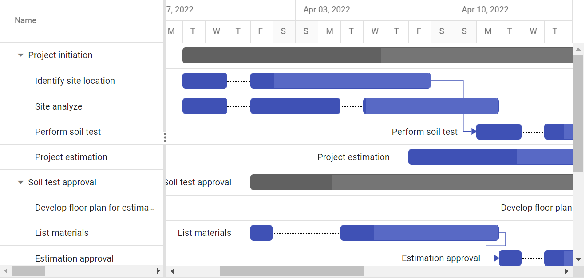

# Split Tasks in Blazor Gantt Chart Component

In [Blazor Gantt Chart](https://www.syncfusion.com/blazor-components/blazor-gantt-chart), The split taskbar feature empowers users to divide taskbars seamlessly whenever idle days occur in our project. This functionality not only facilitates a dynamic and interactive view but also enhances the visualization of the project taskbar. The split task support also working both .

## Split Tasks collection

The segment collection contains details about segments that are used in the project. Segments are a list of TSegments type that contain PrimaryKey, ForeignKey, StartDate, EndDate, Duration, DataSource of the segments, and this collection is mapped to the Gantt Chart component using the [GanttSegmentFields.DataSource](https://help.syncfusion.com/cr/blazor/Syncfusion.Blazor.Gantt.GanttSegmentFields-1.html#Syncfusion_Blazor_Gantt_GanttSegmentFields_1_DataSource) property. PrimaryKey, ForeignKey, StartDate, EndDate, Duration and DataSource field of the segments are mapped by using the `GanttSegmentFields.PrimaryKey`, `GanttSegmentFields.ForeignKey`, `GanttSegmentFields.StartDate`, `GanttSegmentFields.EndDate`, `GanttSegmentFields.Duration` and `GanttSegmentFields.DataSource` properties. The following code snippets show segment collection and how it is assigned to the Gantt Chart component.

The segment collection also supported for ExpandoObject, DynamicObject, and adaptors way to initialize the segments collection in Gantt Chart.

```cshtml
@using Syncfusion.Blazor.Gantt
<SfGantt TValue="TaskData" DataSource="@TaskCollection" Height="450px" Width="100%" TreeColumnIndex="1" Toolbar="@(new List<Object>() { "Add", "Cancel", "Update" , "Delete", "Edit", "CollapseAll", "ExpandAll", "ZoomIn", "ZoomOut", "ZoomToFit" })" EnableContextMenu="true" RowHeight="37" ProjectStartDate="ProjectStart" ProjectEndDate="ProjectEnd">
    <GanttTaskFields Id="TaskId" Name="TaskName" StartDate="StartDate" EndDate="EndDate" Duration="Duration" Progress="Progress" ParentID="ParentId" Dependency="Predecessor">
    </GanttTaskFields>
    <GanttEditSettings AllowAdding="true" AllowDeleting="true" AllowEditing="true" AllowTaskbarEditing="true"></GanttEditSettings>
    <GanttSegmentFields PrimaryKey="id" ForeignKey="TaskId" StartDate="StartDate" EndDate="EndDate" Duration="Duration" TValue="TaskData" TSegments="SegmentModel" DataSource="segmentCollection"></GanttSegmentFields>
    <GanttLabelSettings LeftLabel="TaskName" TValue="TaskData"></GanttLabelSettings>
    <GanttColumns>
        <GanttColumn Field="TaskId" Width="100"  Visible="false"></GanttColumn>
        <GanttColumn Field="TaskName" Width="250" ClipMode="Syncfusion.Blazor.Grids.ClipMode.EllipsisWithTooltip"></GanttColumn>
        <GanttColumn Field="StartDate" HeaderText="Start Date"></GanttColumn>
        <GanttColumn Field="EndDate" HeaderText="End Date"></GanttColumn>
        <GanttColumn Field="Duration" HeaderText="Duration"></GanttColumn>
        <GanttColumn Field="Progress" HeaderText="Progress"></GanttColumn>
        <GanttColumn Field="Predecessor" HeaderText="Dependency"></GanttColumn>
    </GanttColumns>
    <GanttSplitterSettings Position="28%"></GanttSplitterSettings>
</SfGantt>

@code{
    private DateTime ProjectStart = new DateTime(2022, 03, 23);
    private DateTime ProjectEnd = new DateTime(2022, 05, 10);
    private List<TaskData> TaskCollection { get; set; }
    private List<SegmentModel> segmentCollection { get; set; }
    protected override void OnInitialized()
    {
        this.TaskCollection = GetTaskCollection();
        this.segmentCollection = GetSegmentCollection();
    }
    public class SegmentModel
    {
        public int id { get; set; }
        public int TaskId { get; set; }
        public DateTime StartDate { get; set; }
        public DateTime EndDate { get; set; }
        public string Duration { get; set; }
    }
    public class TaskData
    {
        public int TaskId { get; set; }
        public string TaskName { get; set; }
        public DateTime? StartDate { get; set; }
        public DateTime? EndDate { get; set; }
        public string Duration { get; set; }
        public int Progress { get; set; }
        public int? ParentId { get; set; }
        public string Predecessor { get; set; }
    }
    public static List<TaskData> GetTaskCollection()
    {
        List<TaskData> Tasks = new List<TaskData>() {
            new TaskData() { TaskId = 1, TaskName = "Project initiation", StartDate = new DateTime(2022, 03, 28), EndDate = new DateTime(2022, 07, 28), Duration="4" },
            new TaskData() { TaskId = 2, TaskName = "Identify site location", StartDate = new DateTime(2022, 03, 29), Progress = 30, ParentId = 1, Duration="8", },
            new TaskData() { TaskId = 3, TaskName = "Site analyze", StartDate = new DateTime(2022, 03, 29),  Progress = 50, ParentId = 1, Duration="8"},
            new TaskData() { TaskId = 4, TaskName = "Perform soil test", StartDate = new DateTime(2022, 03, 29), ParentId = 1, Duration="5", Predecessor="2FS", Progress=40, },
            new TaskData() { TaskId = 5, TaskName = "Soil test approval", StartDate = new DateTime(2022, 03, 29), Duration="4", Progress = 30 },
            new TaskData() { TaskId = 6, TaskName = "Project estimation", StartDate = new DateTime(2022, 04, 08), Duration="8", Progress=40, ParentId=1 },
            new TaskData() { TaskId = 7, TaskName = "Develop floor plan for estimation", StartDate = new DateTime(2022, 03, 29), Duration = "0", Progress = 30, ParentId = 5, Predecessor= "4FS" },
            new TaskData() { TaskId = 8, TaskName = "List materials", StartDate = new DateTime(2022, 04, 01), Duration = "6", Progress = 30, ParentId = 5 },
            new TaskData() { TaskId = 9, TaskName = "Estimation approval",Progress=30, StartDate = new DateTime(2022, 04, 01), Duration = "4", ParentId = 5, Predecessor="8FS" },
            new TaskData() { TaskId = 10, TaskName = "Building approval", StartDate = new DateTime(2022, 04, 12), Duration = "5", ParentId = 5 },
            new TaskData() { TaskId = 11, TaskName = "Construction initiation", StartDate = new DateTime(2022, 04, 01), Duration = "5", Progress=40 },
            new TaskData() { TaskId = 12, TaskName = "Ground floor initiation", StartDate = new DateTime(2022, 04, 05), Duration = "5", ParentId = 11, Progress=40},
            new TaskData() { TaskId = 13, TaskName = "First floor initiation", StartDate = new DateTime(2022, 04, 05), Duration = "7",ParentId = 11, Progress=40},
            new TaskData() { TaskId = 14, TaskName = "Electric work initiation", StartDate = new DateTime(2022, 04, 01), Duration = "5", ParentId = 11, Progress=40, },
            new TaskData() { TaskId = 15, TaskName = "Plumbing work", StartDate = new DateTime(2022, 04, 02), Duration = "5", ParentId = 11, Progress=40 },
       };
        return Tasks;
    }
    private List<SegmentModel> GetSegmentCollection()
    {
        List<SegmentModel> segments = new List<SegmentModel>();
        segments.Add(new SegmentModel() { id = 1, TaskId = 2, StartDate = new DateTime(2022, 04, 01), Duration = "1" });
        segments.Add(new SegmentModel() { id = 2, TaskId = 2, StartDate = new DateTime(2022, 03, 29), EndDate = new DateTime(2022, 03, 31) });
        segments.Add(new SegmentModel() { id = 3, TaskId = 3, StartDate = new DateTime(2022, 04, 01), Duration = "2" });
        segments.Add(new SegmentModel() { id = 4, TaskId = 3, StartDate = new DateTime(2022, 03, 29), EndDate = new DateTime(2022, 03, 31) });
        segments.Add(new SegmentModel() { id = 5, TaskId = 3, StartDate = new DateTime(2022, 04, 04), Duration="3" });
        segments.Add(new SegmentModel() { id = 6, TaskId = 4, StartDate = new DateTime(2022, 04, 01), Duration = "1" });
        segments.Add(new SegmentModel() { id = 7, TaskId = 4, StartDate = new DateTime(2022, 03, 29), EndDate = new DateTime(2022, 03, 31) });
        segments.Add(new SegmentModel() { id = 8, TaskId = 8, StartDate = new DateTime(2022, 04, 01), EndDate = new DateTime(2022, 04, 03) });
        segments.Add(new SegmentModel() { id = 9, TaskId = 8, StartDate = new DateTime(2022, 04, 05), Duration = "1" });
        segments.Add(new SegmentModel() { id = 10, TaskId = 9, StartDate = new DateTime(2022, 03, 29), EndDate = new DateTime(2022, 03, 31) });
        segments.Add(new SegmentModel() { id = 11, TaskId = 9, StartDate = new DateTime(2022, 04, 01), Duration = "1" });
        segments.Add(new SegmentModel() { id = 12, TaskId = 12, StartDate = new DateTime(2022, 04, 05), Duration="1" });
        segments.Add(new SegmentModel() { id = 13, TaskId = 12, StartDate = new DateTime(2022, 04, 07), Duration = "1" });
        segments.Add(new SegmentModel() { id = 14, TaskId = 14, StartDate = new DateTime(2022, 04, 01), EndDate = new DateTime(2022, 04, 02) });
        segments.Add(new SegmentModel() { id = 15, TaskId = 14, StartDate = new DateTime(2022, 04, 04), Duration = "2" });
        return segments;
    }
}
```

## Split Tasks Event

The [GanttTaskFields.SegmentChanging](https://help.syncfusion.com/cr/blazor/Syncfusion.Blazor.Gantt.GanttSegmentFields.html#Syncfusion_Blazor_Gantt_GanttSegmentFields_SegmentChanging) event triggers when the segment is added, deleted and updated time in Gantt Chart.

> To cancel the Segments action in the Gantt Chart, you can achieve this by setting the Cancel argument of the SegmentChanging event to true. It's important to note that the Cancel property will only be accepted when the segmentation operation is initiated through the context menu for split and merge, via dialog box operations such as add, remove, and update, or when utilizing public methods like MergeTaskAsync and SplitTaskAsync. This ensures that the cancellation functionality is applicable in specific scenarios where segmentation actions are triggered by user interactions or explicit method calls in the Gantt Chart component.

```cshtml
@using Syncfusion.Blazor.Gantt
<SfGantt TValue="TaskData" DataSource="@TaskCollection" Height="450px" Width="100%" TreeColumnIndex="1" Toolbar="@(new List<Object>() { "Add", "Cancel", "Update" , "Delete", "Edit", "CollapseAll", "ExpandAll", "ZoomIn", "ZoomOut", "ZoomToFit" })" EnableContextMenu="true" RowHeight="37" ProjectStartDate="ProjectStart" ProjectEndDate="ProjectEnd">
    <GanttTaskFields Id="TaskId" Name="TaskName" StartDate="StartDate" EndDate="EndDate" Duration="Duration" Progress="Progress" ParentID="ParentId" Dependency="Predecessor">
    </GanttTaskFields>
    <GanttEditSettings AllowAdding="true" AllowDeleting="true" AllowEditing="true" AllowTaskbarEditing="true"></GanttEditSettings>
    <GanttSegmentFields PrimaryKey="id" ForeignKey="TaskId" StartDate="StartDate" EndDate="EndDate" Duration="Duration" TValue="TaskData" TSegments="SegmentModel" DataSource="segmentCollection" SegmentChanging="SegmentsHanlder"></GanttSegmentFields>
    <GanttLabelSettings LeftLabel="TaskName" TValue="TaskData"></GanttLabelSettings>
    <GanttColumns>
        <GanttColumn Field="TaskId" Width="100"  Visible="false"></GanttColumn>
        <GanttColumn Field="TaskName" Width="250" ClipMode="Syncfusion.Blazor.Grids.ClipMode.EllipsisWithTooltip"></GanttColumn>
        <GanttColumn Field="StartDate" HeaderText="Start Date"></GanttColumn>
        <GanttColumn Field="EndDate" HeaderText="End Date"></GanttColumn>
        <GanttColumn Field="Duration" HeaderText="Duration"></GanttColumn>
        <GanttColumn Field="Progress" HeaderText="Progress"></GanttColumn>
        <GanttColumn Field="Predecessor" HeaderText="Dependency"></GanttColumn>
    </GanttColumns>
    <GanttSplitterSettings Position="28%"></GanttSplitterSettings>
</SfGantt>

@code{
    private DateTime ProjectStart = new DateTime(2022, 03, 23);
    private DateTime ProjectEnd = new DateTime(2022, 05, 10);
    private List<TaskData> TaskCollection { get; set; }
    private List<SegmentModel> segmentCollection { get; set; }
    protected override void OnInitialized()
    {
        this.TaskCollection = GetTaskCollection();
        this.segmentCollection = GetSegmentCollection();
    }
    public class SegmentModel
    {
        public int id { get; set; }
        public int TaskId { get; set; }
        public DateTime StartDate { get; set; }
        public DateTime EndDate { get; set; }
        public string Duration { get; set; }
    }
    public class TaskData
    {
        public int TaskId { get; set; }
        public string TaskName { get; set; }
        public DateTime? StartDate { get; set; }
        public DateTime? EndDate { get; set; }
        public string Duration { get; set; }
        public int Progress { get; set; }
        public int? ParentId { get; set; }
        public string Predecessor { get; set; }
    }
    public static List<TaskData> GetTaskCollection()
    {
        List<TaskData> Tasks = new List<TaskData>() {
            new TaskData() { TaskId = 1, TaskName = "Project initiation", StartDate = new DateTime(2022, 03, 28), EndDate = new DateTime(2022, 07, 28), Duration="4" },
            new TaskData() { TaskId = 2, TaskName = "Identify site location", StartDate = new DateTime(2022, 03, 29), Progress = 30, ParentId = 1, Duration="8", },
            new TaskData() { TaskId = 3, TaskName = "Site analyze", StartDate = new DateTime(2022, 03, 29),  Progress = 50, ParentId = 1, Duration="8"},
            new TaskData() { TaskId = 4, TaskName = "Perform soil test", StartDate = new DateTime(2022, 03, 29), ParentId = 1, Duration="5", Predecessor="2FS", Progress=40, },
            new TaskData() { TaskId = 5, TaskName = "Soil test approval", StartDate = new DateTime(2022, 03, 29), Duration="4", Progress = 30 },
            new TaskData() { TaskId = 6, TaskName = "Project estimation", StartDate = new DateTime(2022, 04, 08), Duration="8", Progress=40, ParentId=1 },
            new TaskData() { TaskId = 7, TaskName = "Develop floor plan for estimation", StartDate = new DateTime(2022, 03, 29), Duration = "0", Progress = 30, ParentId = 5, Predecessor= "4FS" },
            new TaskData() { TaskId = 8, TaskName = "List materials", StartDate = new DateTime(2022, 04, 01), Duration = "6", Progress = 30, ParentId = 5 },
            new TaskData() { TaskId = 9, TaskName = "Estimation approval",Progress=30, StartDate = new DateTime(2022, 04, 01), Duration = "4", ParentId = 5, Predecessor="8FS" },
            new TaskData() { TaskId = 10, TaskName = "Building approval", StartDate = new DateTime(2022, 04, 12), Duration = "5", ParentId = 5 },
            new TaskData() { TaskId = 11, TaskName = "Construction initiation", StartDate = new DateTime(2022, 04, 01), Duration = "5", Progress=40 },
            new TaskData() { TaskId = 12, TaskName = "Ground floor initiation", StartDate = new DateTime(2022, 04, 05), Duration = "5", ParentId = 11, Progress=40},
            new TaskData() { TaskId = 13, TaskName = "First floor initiation", StartDate = new DateTime(2022, 04, 05), Duration = "7",ParentId = 11, Progress=40},
            new TaskData() { TaskId = 14, TaskName = "Electric work initiation", StartDate = new DateTime(2022, 04, 01), Duration = "5", ParentId = 11, Progress=40, },
            new TaskData() { TaskId = 15, TaskName = "Plumbing work", StartDate = new DateTime(2022, 04, 02), Duration = "5", ParentId = 11, Progress=40 },
       };
        return Tasks;
    }
    private List<SegmentModel> GetSegmentCollection()
    {
        List<SegmentModel> segments = new List<SegmentModel>();
        segments.Add(new SegmentModel() { id = 1, TaskId = 2, StartDate = new DateTime(2022, 04, 01), Duration = "1" });
        segments.Add(new SegmentModel() { id = 2, TaskId = 2, StartDate = new DateTime(2022, 03, 29), EndDate = new DateTime(2022, 03, 31) });
        segments.Add(new SegmentModel() { id = 3, TaskId = 3, StartDate = new DateTime(2022, 04, 01), Duration = "2" });
        segments.Add(new SegmentModel() { id = 4, TaskId = 3, StartDate = new DateTime(2022, 03, 29), EndDate = new DateTime(2022, 03, 31) });
        segments.Add(new SegmentModel() { id = 5, TaskId = 3, StartDate = new DateTime(2022, 04, 04), Duration="3" });
        segments.Add(new SegmentModel() { id = 6, TaskId = 4, StartDate = new DateTime(2022, 04, 01), Duration = "1" });
        segments.Add(new SegmentModel() { id = 7, TaskId = 4, StartDate = new DateTime(2022, 03, 29), EndDate = new DateTime(2022, 03, 31) });
        segments.Add(new SegmentModel() { id = 8, TaskId = 8, StartDate = new DateTime(2022, 04, 01), EndDate = new DateTime(2022, 04, 03) });
        segments.Add(new SegmentModel() { id = 9, TaskId = 8, StartDate = new DateTime(2022, 04, 05), Duration = "1" });
        segments.Add(new SegmentModel() { id = 10, TaskId = 9, StartDate = new DateTime(2022, 03, 29), EndDate = new DateTime(2022, 03, 31) });
        segments.Add(new SegmentModel() { id = 11, TaskId = 9, StartDate = new DateTime(2022, 04, 01), Duration = "1" });
        segments.Add(new SegmentModel() { id = 12, TaskId = 12, StartDate = new DateTime(2022, 04, 05), Duration="1" });
        segments.Add(new SegmentModel() { id = 13, TaskId = 12, StartDate = new DateTime(2022, 04, 07), Duration = "1" });
        segments.Add(new SegmentModel() { id = 14, TaskId = 14, StartDate = new DateTime(2022, 04, 01), EndDate = new DateTime(2022, 04, 02) });
        segments.Add(new SegmentModel() { id = 15, TaskId = 14, StartDate = new DateTime(2022, 04, 04), Duration = "2" });
        return segments;
    }
    private void SegmentsHanlder(SegmentEventArgs<SegmentModel> args)
    {
        if (args.UpdatedSegments != null)
        {
            // Here, you can customize your code.
        }
        if (args.DeletedSegments != null)
        {
           // Here, you can customize your code.
        }
        if (args.AddedSegments != null)
        {
            // Here, you can customize your code.
        }
    }
}
```

## Split Tasks public methods

The [MergeTaskAsync](https://help.syncfusion.com/cr/blazor/Syncfusion.Blazor.Gantt.SfGantt-1.html#Syncfusion_Blazor_Gantt_SfGantt_1_MergeTaskAsync) method used to merge the particular segments based on given task id and index values, the index values starts with 0.

The [SplitTaskAsync](https://help.syncfusion.com/cr/blazor/Syncfusion.Blazor.Gantt.SfGantt-1.html#Syncfusion_Blazor_Gantt_SfGantt_1_SplitTaskAsync) method used to split the particular taskbar based on given task id and dates.


```cshtml
@using Syncfusion.Blazor.Gantt
@using Syncfusion.Blazor.Buttons


<SfButton OnClick="MergeTaskHandler">Merge Task</SfButton>
<SfButton OnClick="SplitTaskHandler">Split Task</SfButton>
<SfGantt @ref="Gantt" TValue="TaskData" DataSource="@TaskCollection" Height="450px" Width="100%" TreeColumnIndex="1" Toolbar="@(new List<Object>() { "Add", "Cancel", "Update" , "Delete", "Edit", "CollapseAll", "ExpandAll", "ZoomIn", "ZoomOut", "ZoomToFit" })" EnableContextMenu="true" RowHeight="37" ProjectStartDate="ProjectStart" ProjectEndDate="ProjectEnd">
    <GanttTaskFields Id="TaskId" Name="TaskName" StartDate="StartDate" EndDate="EndDate" Duration="Duration" Progress="Progress" ParentID="ParentId" Dependency="Predecessor">
    </GanttTaskFields>
    <GanttEditSettings AllowAdding="true" AllowDeleting="true" AllowEditing="true" AllowTaskbarEditing="true"></GanttEditSettings>
    <GanttSegmentFields PrimaryKey="id" ForeignKey="TaskId" StartDate="StartDate" EndDate="EndDate" Duration="Duration" TValue="TaskData" TSegments="SegmentModel" DataSource="segmentCollection" SegmentChanging="SegmentsHanlder"></GanttSegmentFields>
    <GanttLabelSettings LeftLabel="TaskName" TValue="TaskData"></GanttLabelSettings>
    <GanttColumns>
        <GanttColumn Field="TaskId" Width="100" Visible="false"></GanttColumn>
        <GanttColumn Field="TaskName" Width="250" ClipMode="Syncfusion.Blazor.Grids.ClipMode.EllipsisWithTooltip"></GanttColumn>
        <GanttColumn Field="StartDate" HeaderText="Start Date"></GanttColumn>
        <GanttColumn Field="EndDate" HeaderText="End Date"></GanttColumn>
        <GanttColumn Field="Duration" HeaderText="Duration"></GanttColumn>
        <GanttColumn Field="Progress" HeaderText="Progress"></GanttColumn>
        <GanttColumn Field="Predecessor" HeaderText="Dependency"></GanttColumn>
    </GanttColumns>
    <GanttSplitterSettings Position="28%"></GanttSplitterSettings>
</SfGantt>

@code {
    public SfGantt<TaskData> Gantt;
    private DateTime ProjectStart = new DateTime(2022, 03, 23);
    private DateTime ProjectEnd = new DateTime(2022, 05, 10);
    private List<TaskData> TaskCollection { get; set; }
    private List<SegmentModel> segmentCollection { get; set; }
    protected override void OnInitialized()
    {
        this.TaskCollection = GetTaskCollection();
        this.segmentCollection = GetSegmentCollection();
    }
    public class SegmentModel
    {
        public int id { get; set; }
        public int TaskId { get; set; }
        public DateTime StartDate { get; set; }
        public DateTime EndDate { get; set; }
        public string Duration { get; set; }
    }
    public class TaskData
    {
        public int TaskId { get; set; }
        public string TaskName { get; set; }
        public DateTime? StartDate { get; set; }
        public DateTime? EndDate { get; set; }
        public string Duration { get; set; }
        public int Progress { get; set; }
        public int? ParentId { get; set; }
        public string Predecessor { get; set; }
    }
    public static List<TaskData> GetTaskCollection()
    {
        List<TaskData> Tasks = new List<TaskData>() {
            new TaskData() { TaskId = 1, TaskName = "Project initiation", StartDate = new DateTime(2022, 03, 28), EndDate = new DateTime(2022, 07, 28), Duration="4" },
            new TaskData() { TaskId = 2, TaskName = "Identify site location", StartDate = new DateTime(2022, 03, 29), Progress = 30, ParentId = 1, Duration="8", },
            new TaskData() { TaskId = 3, TaskName = "Site analyze", StartDate = new DateTime(2022, 03, 29),  Progress = 50, ParentId = 1, Duration="8"},
            new TaskData() { TaskId = 4, TaskName = "Perform soil test", StartDate = new DateTime(2022, 03, 29), ParentId = 1, Duration="5", Predecessor="2FS", Progress=40, },
            new TaskData() { TaskId = 5, TaskName = "Soil test approval", StartDate = new DateTime(2022, 03, 29), Duration="4", Progress = 30 },
            new TaskData() { TaskId = 6, TaskName = "Project estimation", StartDate = new DateTime(2022, 04, 08), Duration="8", Progress=40, ParentId=1 },
            new TaskData() { TaskId = 7, TaskName = "Develop floor plan for estimation", StartDate = new DateTime(2022, 03, 29), Duration = "0", Progress = 30, ParentId = 5, Predecessor= "4FS" },
            new TaskData() { TaskId = 8, TaskName = "List materials", StartDate = new DateTime(2022, 04, 01), Duration = "6", Progress = 30, ParentId = 5 },
            new TaskData() { TaskId = 9, TaskName = "Estimation approval",Progress=30, StartDate = new DateTime(2022, 04, 01), Duration = "4", ParentId = 5, Predecessor="8FS" },
            new TaskData() { TaskId = 10, TaskName = "Building approval", StartDate = new DateTime(2022, 04, 12), Duration = "5", ParentId = 5 },
            new TaskData() { TaskId = 11, TaskName = "Construction initiation", StartDate = new DateTime(2022, 04, 01), Duration = "5", Progress=40 },
            new TaskData() { TaskId = 12, TaskName = "Ground floor initiation", StartDate = new DateTime(2022, 04, 05), Duration = "5", ParentId = 11, Progress=40},
            new TaskData() { TaskId = 13, TaskName = "First floor initiation", StartDate = new DateTime(2022, 04, 05), Duration = "7",ParentId = 11, Progress=40},
            new TaskData() { TaskId = 14, TaskName = "Electric work initiation", StartDate = new DateTime(2022, 04, 01), Duration = "5", ParentId = 11, Progress=40, },
            new TaskData() { TaskId = 15, TaskName = "Plumbing work", StartDate = new DateTime(2022, 04, 02), Duration = "5", ParentId = 11, Progress=40 },
       };
        return Tasks;
    }
    private List<SegmentModel> GetSegmentCollection()
    {
        List<SegmentModel> segments = new List<SegmentModel>();
        segments.Add(new SegmentModel() { id = 1, TaskId = 2, StartDate = new DateTime(2022, 04, 01), Duration = "1" });
        segments.Add(new SegmentModel() { id = 2, TaskId = 2, StartDate = new DateTime(2022, 03, 29), EndDate = new DateTime(2022, 03, 31) });
        segments.Add(new SegmentModel() { id = 3, TaskId = 3, StartDate = new DateTime(2022, 04, 01), Duration = "2" });
        segments.Add(new SegmentModel() { id = 4, TaskId = 3, StartDate = new DateTime(2022, 03, 29), EndDate = new DateTime(2022, 03, 31) });
        segments.Add(new SegmentModel() { id = 5, TaskId = 3, StartDate = new DateTime(2022, 04, 04), Duration = "3" });
        segments.Add(new SegmentModel() { id = 6, TaskId = 4, StartDate = new DateTime(2022, 04, 01), Duration = "1" });
        segments.Add(new SegmentModel() { id = 7, TaskId = 4, StartDate = new DateTime(2022, 03, 29), EndDate = new DateTime(2022, 03, 31) });
        segments.Add(new SegmentModel() { id = 8, TaskId = 8, StartDate = new DateTime(2022, 04, 01), EndDate = new DateTime(2022, 04, 03) });
        segments.Add(new SegmentModel() { id = 9, TaskId = 8, StartDate = new DateTime(2022, 04, 05), Duration = "1" });
        segments.Add(new SegmentModel() { id = 10, TaskId = 9, StartDate = new DateTime(2022, 03, 29), EndDate = new DateTime(2022, 03, 31) });
        segments.Add(new SegmentModel() { id = 11, TaskId = 9, StartDate = new DateTime(2022, 04, 01), Duration = "1" });
        segments.Add(new SegmentModel() { id = 12, TaskId = 12, StartDate = new DateTime(2022, 04, 05), Duration = "1" });
        segments.Add(new SegmentModel() { id = 13, TaskId = 12, StartDate = new DateTime(2022, 04, 07), Duration = "1" });
        segments.Add(new SegmentModel() { id = 14, TaskId = 14, StartDate = new DateTime(2022, 04, 01), EndDate = new DateTime(2022, 04, 02) });
        segments.Add(new SegmentModel() { id = 15, TaskId = 14, StartDate = new DateTime(2022, 04, 04), Duration = "2" });
        return segments;
    }
    private void SegmentsHanlder(SegmentEventArgs<SegmentModel> args)
    {
        if (args.UpdatedSegments != null)
        {
            // Here, you can customize your code.
        }
        if (args.DeletedSegments != null)
        {
            // Here, you can customize your code.
        }
        if (args.AddedSegments != null)
        {
            // Here, you can customize your code.
        }
    }

    private async void MergeTaskHandler()
    {
        List<ValueTuple<int, int>> indexes = new List<ValueTuple<int, int>>();
        indexes.Add((0, 1));
        await Gantt.MergeTaskAsync(3, indexes);
    }

    private async void SplitTaskHandler()
    {
        await Gantt.SplitTaskAsync("3", new List<DateTime>() { new DateTime(2022, 04, 07), new DateTime(2022, 04, 11) });
    }
}
```


