# Style and Appearance in Blazor Gantt Chart Component

Customize the appearance of the Blazor Gantt Chart by overriding default CSS styles. The Gantt Chart provides a comprehensive set of CSS classes for targeting specific sections, allowing a tailored design that matches application branding. [Theme Studio](https://blazor.syncfusion.com/documentation/appearance/theme-studio) can create custom themes for all JavaScript controls.

## Customizing Gantt Chart root element

The `.e-gantt` class is the root container for the entire Blazor Gantt Chart. Customize this element to control global appearance including font family, background color, and overall spacing:

```css
.e-gantt *:not(.e-icons):not(.e-check):not(.e-frame) {
    font-family: cursive !important;
}
```

Properties such as `font-family`, `background-color`, and spacing-related styles can be adjusted to align with the Gantt design.

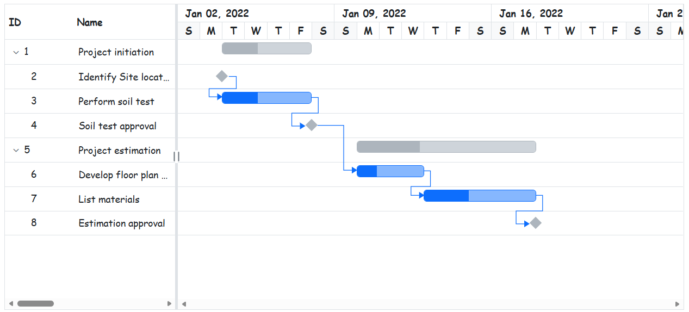

This customization applies a cursive font to the Gantt Chart content. Additional styling can be applied to rows, alternate rows, selected rows, and hover states. Avoid using `!important` for hover styles in production environments. Instead, increase selector specificity to maintain consistent styling control.

## Styling the grid section

### Customizing grid headers in Gantt Chart

The grid header in the Blazor Gantt Chart contains column headers and table structures. Customize the header appearance and styling using the following CSS classes:

```css
.e-gridheader {
   color: #1976d2 !important;
}
.e-headercelldiv {
    font-size: 36px;
}
.e-headercell {
    background: #e3f2fd !important;
}
.e-columnheader{
    color: #1976d2 !important;
}
```

Properties such as `background-color`, `border`, `font-weight`, and `padding` can be adjusted to align with the Gantt design.

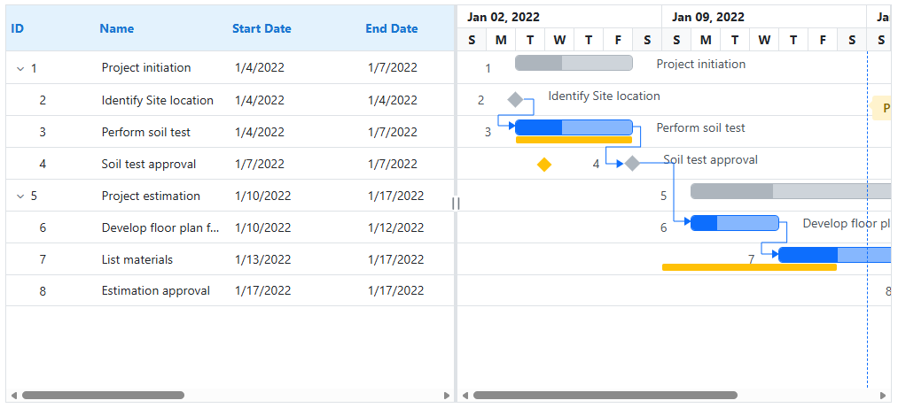

### Customizing grid content and rows

Style the grid content area that displays task data in a tabular format. Use these CSS classes to modify rows, cells, and alternate row appearance:

```css
.e-gridcontent {
    background-color: #f5f5f5;
}
.e-table {
    border: 1px solid #ccc;
}
.e-row {
    background-color: #ffffff;
    color: #333;
}
.e-altrow {
    background-color: #e8f4fd;
}
.e-rowcell {
    border-color: #ddd;
    padding: 8px;
}
```

Properties such as `background-color`, `border`, `font-weight`, and `padding` can be adjusted to align with the Gantt design.

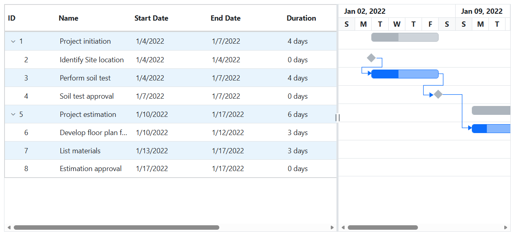

## Styling the chart section

### Customizing chart content and background

The chart content displays taskbars and the timeline visualization. Apply CSS to modify the chart area appearance and styling:

```css
.e-gantt-chart {
    background-color: #fafafa;
    border: 1px solid #ddd;
}
.e-chart-row {
    background-color: #ffffff;
}
.e-chart-row:hover {
    background-color: #fff3cd;
}
```

Properties such as `background-color`, `border`, and `height` can be adjusted to align with the Gantt design.

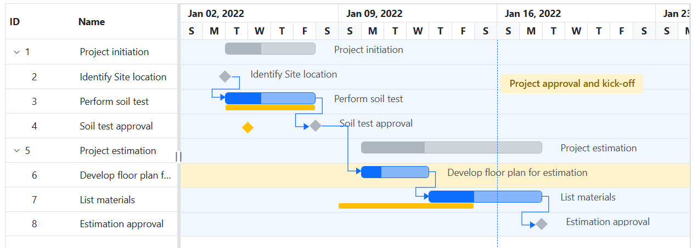

### Customizing timeline headers and date display

The timeline displays date information and task scheduling. Style the timeline header and date cells using these CSS classes:

```css
.e-timeline-header-container {
    background: #e3f2fd !important;
}

.e-header-cell-label {
    color: #0d47a1 !important;
    font-weight: bold;
}
.e-weekend-header-cell{
    background: #fce4ec !important;
}
```

Properties such as `background-color`, `border`, `font-weight`, and `padding` can be adjusted to align with the Gantt design.

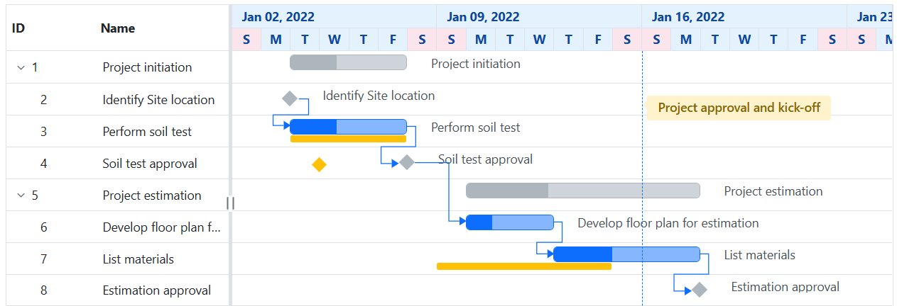

### Customizing taskbars and progress indicators

The taskbar represents tasks visually on the timeline. Customize parent taskbars, child taskbars, milestones, and unscheduled tasks using these CSS classes:

```css
.e-taskbar-main-container {
    border: 1px solid #e0e0e0;
}

.e-gantt-parent-taskbar-inner-div {
    background-color: #1976d2 !important;
}

.e-gantt-parent-progressbar-inner-div {
    background-color: #0d47a1 !important;
}

.e-gantt-child-taskbar-inner-div {
    background-color: #7b1fa2 !important;
}

.e-gantt-child-progressbar-inner-div {
    background-color: #4a148c !important;
}

.e-gantt-milestone {
    background-color: #ff9800 !important;
}

.e-gantt-unscheduled-taskbar {
    background-color: #f44336 !important;
    opacity: 0.7;
}

.e-gantt-manualparenttaskbar {
    border: 2px dashed #1976d2 !important;
}

.e-gantt-child-manualtaskbar {
    border: 2px dashed #7b1fa2 !important;
}

.e-gantt-unscheduled-manualtask {
    background-color: #f44336 !important;
    border: 2px dashed #f44336 !important;
    opacity: 0.7;
}
```

Properties such as `background-color`, `border`, `height`, and `border-radius` can be adjusted to align with the Gantt design.

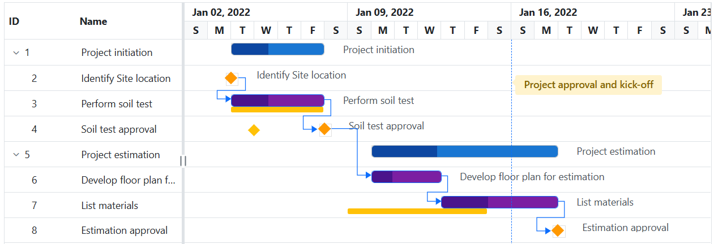

### Customizing baseline bars and milestones

The baseline in the Blazor Gantt Chart represents planned task schedules for comparison with actual progress. Customize baseline bars and milestones using these CSS classes:

```css
.e-baseline-bar {
    background-color: #fdb9c9 !important;
}

.e-baseline-gantt-milestone-container {
    background-color: #fdb9c9 !important;
}
```

Properties such as `background-color` and `height` can be adjusted to align with the Gantt design.

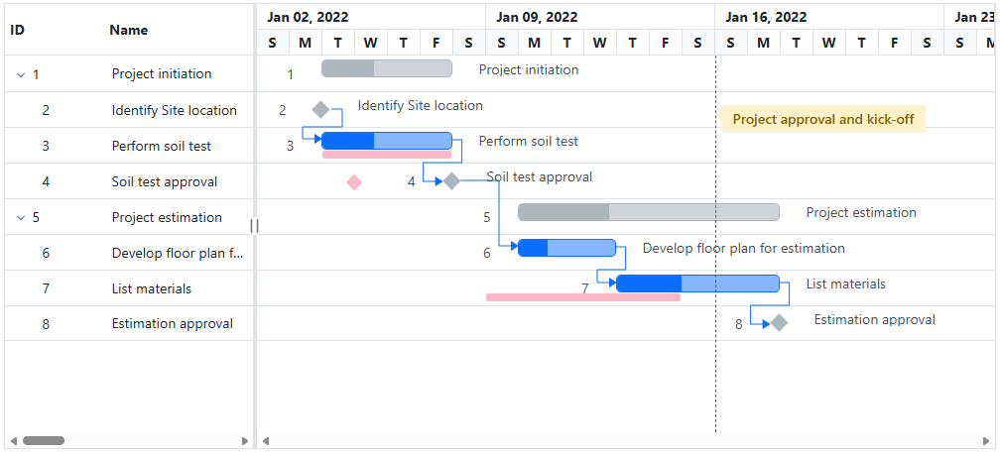

### Customizing connector lines for task dependencies

The connector lines in the Blazor Gantt Chart show dependencies between tasks. Apply CSS to modify the connector line appearance and styling:

```css
.e-connector-line {
    stroke: #ab6060fc !important;
    stroke-width: 2px;
}   
.e-connector-line-arrow {
    fill: #ab6060fc !important;
}
```

Properties such as `stroke`, `stroke-width`, and `fill` can be adjusted to align with the Gantt design.

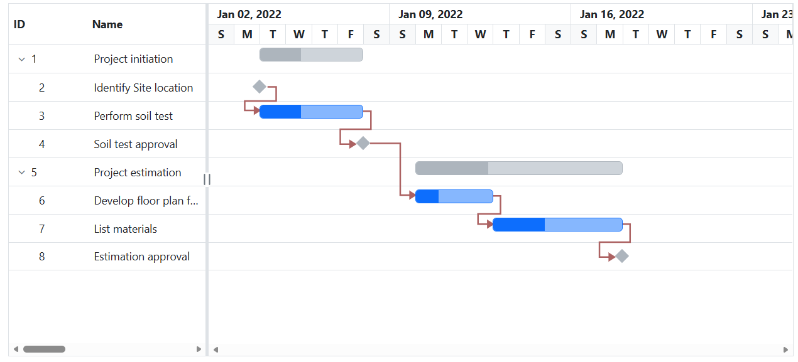

### Customizing splitter and resize handlers

The splitter divides the grid and chart sections, while resize handlers allow users to adjust the splitter position. Style these elements using the following CSS classes:

```css
.e-gantt .e-split-bar {
    background-color: #add8e6 !important;
    border: 1px solid #87ceeb;
}
.e-gantt .e-resize-handler {
    background-color: red !important;
    border-radius: 50%;
    width: 20px;
    height: 20px;
    border: 1px solid #0d47a1;
}
.e-gantt .e-arrow-left, .e-gantt .e-arrow-right {
    color: green !important;
    font-size: 12px;
}
.e-gantt .e-resize-handler:hover {
    background-color: #f0f0f0 !important;
}
```

Properties such as `background-color`, `border`, `width`, `height`, and `border-radius` can be adjusted to align with the Gantt design.

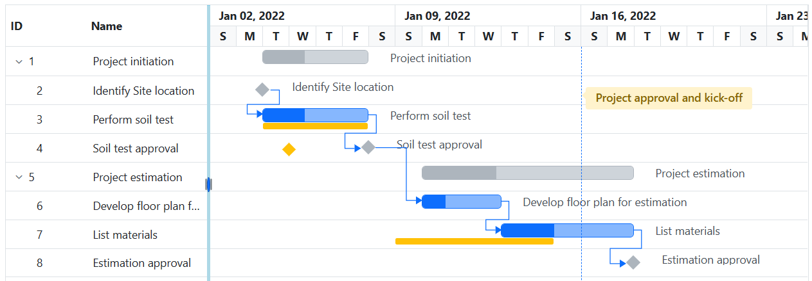

This customization applies a light blue background to the split bar and styles the resize handler with a circular appearance. Additional styling can be applied to arrow icons and hover states. Avoid using `!important` for hover styles in production environments. Instead, increase selector specificity to maintain consistent styling control.

### Customizing task labels and text display

The labels in the Blazor Gantt Chart display task information on the taskbars. Apply CSS to modify the label appearance and styling:

```css
.e-label {
    color: #0d47a1 !important;
    font-size: 12px;
}

.e-right-label-container {
    background-color: rgba(255, 255, 255, 0.9);
    padding: 2px 4px;
    border-radius: 3px;
}

.e-left-label-container {
    background-color: rgba(255, 255, 255, 0.9);
    padding: 2px 4px;
    border-radius: 3px;
}
```

Properties such as `color`, `font-weight`, `font-size`, `background-color`, and `padding` can be adjusted to align with the Gantt design.

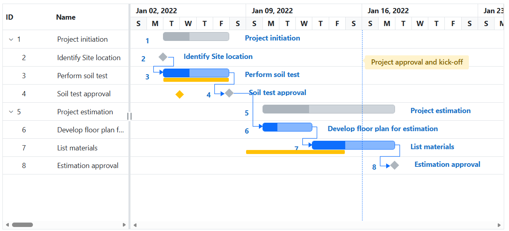

### Customizing event markers and timeline indicators

The event markers in the Blazor Gantt Chart highlight important dates or milestones on the timeline. Apply CSS to modify the event marker appearance and styling:

```css
.e-event-markers {
    border-left-color: #7b1fa2 !important;
}

.e-event-markers .e-span-label {
    background-color: #f3e5f5 !important;
    color: #4a148c !important;
}
```

Properties such as `border-left-color`, `background-color`, `color`, and `font-weight` can be adjusted to align with the Gantt design.

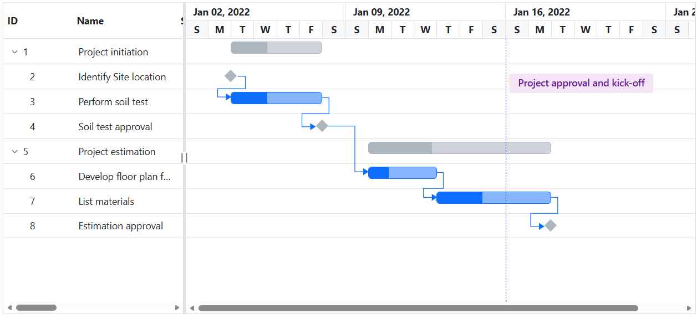

### Customizing tooltip content and appearance

The tooltip in the Blazor Gantt Chart displays detailed information when hovering over tasks or elements. Apply CSS to modify the tooltip appearance and styling. Note: Use `.e-tooltip-wrap` for most tooltip styling and `.e-gantt-tooltip` for additional customization:

```css
.e-tooltip-wrap {
    background: #a9e0f4 !important;
}

.e-gantt-tooltip {
    background-color: #8fa5cf !important;
    color: #333 !important;
    border: 1px solid #87ceeb;
    border-radius: 4px;
    padding: 8px;
}
```

Properties such as `background-color`, `color`, `border`, `border-radius`, and `padding` can be adjusted to align with the Gantt design.

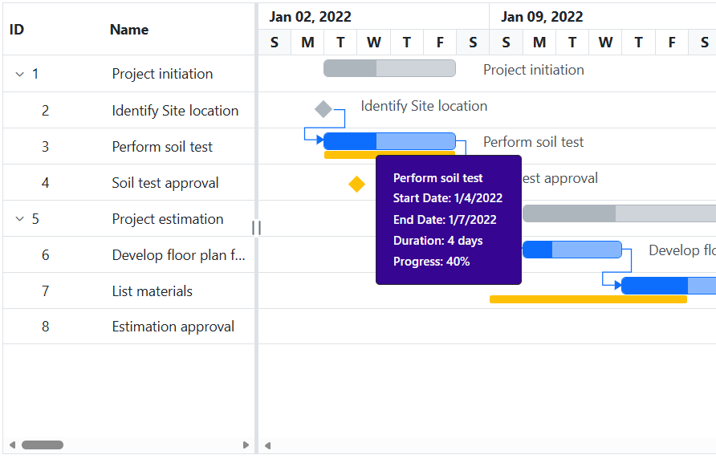
 
## Complete code example with CSS customization

Below is a complete example demonstrating how to customize multiple aspects of the Gantt Chart using CSS classes:




@using Syncfusion.Blazor.Gantt

<SfGantt DataSource="@TaskCollection" Height="450px" Width="1000px" RenderBaseline="true">
    <GanttTaskFields Id="TaskID" Name="TaskName" StartDate="StartDate" EndDate="EndDate" Duration="Duration" Progress="Progress" Dependency="Predecessor" ParentID="ParentID" BaselineStartDate="BaselineStartDate"
                     BaselineEndDate="BaselineEndDate">
    </GanttTaskFields>
    <GanttLabelSettings RightLabel="TaskName" TValue="TaskData"></GanttLabelSettings>
    <GanttEventMarkers>
        <GanttEventMarker Day="@Event" Label="Project approval and kick-off"></GanttEventMarker>
    </GanttEventMarkers>
</SfGantt>
<style>
     .e-split-bar, .e-headercell {
        background: #add8e6 !important; /* Set splitter and header cell background color */
    }

    .e-timeline-header-container, .e-weekend-header-cell {
        background: #add8e6 !important; /* Set timeline header and weekend cell background color */
    }

    .e-gantt-parent-taskbar-inner-div {
        background-color: #7ab748 !important; /* Set parent taskbar color */
    }

    .e-gantt-parent-progressbar-inner-div {
        background-color: #4b732a !important; /* Set parent progress bar color */
    }

    .e-gantt-milestone {
        background-color: #ad7a66 !important; /* Set milestone color */
    }

    .e-gantt-child-taskbar-inner-div {
        background-color: #6d619b !important; /* Set child taskbar color */
    }

    .e-gantt-child-progressbar-inner-div {
        background-color: #4e466e !important; /* Set child progress bar color */
    }

    .e-tooltip-wrap {
        background: #a9e0f4 !important; /* Set tooltip background color */
    }

    .e-event-markers {
        border-left-color: #05088f !important; /* Set event marker color */
    }

    .e-event-markers .e-span-label {
        background-color: #f3e5f5 !important; /* Set event marker label background color */
        color: #6a1b9a !important; /* Set event marker label text color */
    }

    .e-baseline-gantt-milestone-container{
        background-color: #fdb9c9 !important; /* Set baseline milestone color */
    }

    .e-baseline-bar {
        background-color: #fdb9c9 !important; /* Set baseline bar color */
    }

    .e-label {
        color: #1e74ca !important; /* Set label text color */
    }

    .e-connector-line {
        stroke: #ab6060fc !important; /* Set line color */
    }

    .e-connector-line-arrow {
        fill: #ab6060fc !important; /* Set arrow color */
    }
</style>
@code {
    private List<TaskData> TaskCollection { get; set; }
    public DateTime Event = new DateTime(2022, 01, 16);

    protected override void OnInitialized()
    {
        this.TaskCollection = GetTaskCollection();
    }

    public class TaskData
    {
        public int TaskID { get; set; }
        public string TaskName { get; set; }
        public DateTime StartDate { get; set; }
        public DateTime? EndDate { get; set; }
        public string Duration { get; set; }
        public int Progress { get; set; }
        public DateTime? BaselineStartDate { get; set; }
        public DateTime? BaselineEndDate { get; set; }
        public string Predecessor { get; set; }
        public int? ParentID { get; set; }
    }

    private static List<TaskData> GetTaskCollection()
    {
        List<TaskData> Tasks = new List<TaskData>()
        {
            new TaskData() { TaskID = 1, TaskName = "Project initiation", StartDate = new DateTime(2022, 01, 04), EndDate = new DateTime(2022, 01, 07), },
            new TaskData() { TaskID = 2, TaskName = "Identify Site location", StartDate = new DateTime(2022, 01, 04), Duration = "0", Progress = 30, ParentID = 1, },
            new TaskData() { TaskID = 3, TaskName = "Perform soil test", StartDate = new DateTime(2022, 01, 04), BaselineStartDate = new DateTime(2022, 01, 04), BaselineEndDate = new DateTime(2022, 01, 07), Duration = "4", Progress = 40, ParentID = 1, Predecessor="2", },
            new TaskData() { TaskID = 4, TaskName = "Soil test approval", StartDate = new DateTime(2022, 01, 04), Duration = "0", BaselineStartDate = new DateTime(2022, 01, 05, 08, 00, 00), BaselineEndDate = new DateTime(2022, 01, 05, 08, 00, 00), Progress = 30, ParentID = 1, Predecessor="3", },
            new TaskData() { TaskID = 5, TaskName = "Project estimation", StartDate = new DateTime(2022, 01, 04), EndDate = new DateTime(2022, 01, 17), },
            new TaskData() { TaskID = 6, TaskName = "Develop floor plan for estimation", StartDate = new DateTime(2022, 01, 06), Duration = "3", Progress = 30, ParentID = 5, Predecessor="4", },
            new TaskData() { TaskID = 7, TaskName = "List materials", StartDate = new DateTime(2022, 01, 06), BaselineStartDate = new DateTime(2022, 01, 09), BaselineEndDate = new DateTime(2022, 01, 14), Duration = "3", Progress = 40, ParentID = 5, Predecessor="6", },
            new TaskData() { TaskID = 8, TaskName = "Estimation approval", StartDate = new DateTime(2022, 01, 06), Duration = "0", Progress = 30, ParentID = 5, Predecessor="7", }
        };
        return Tasks;
    }
}






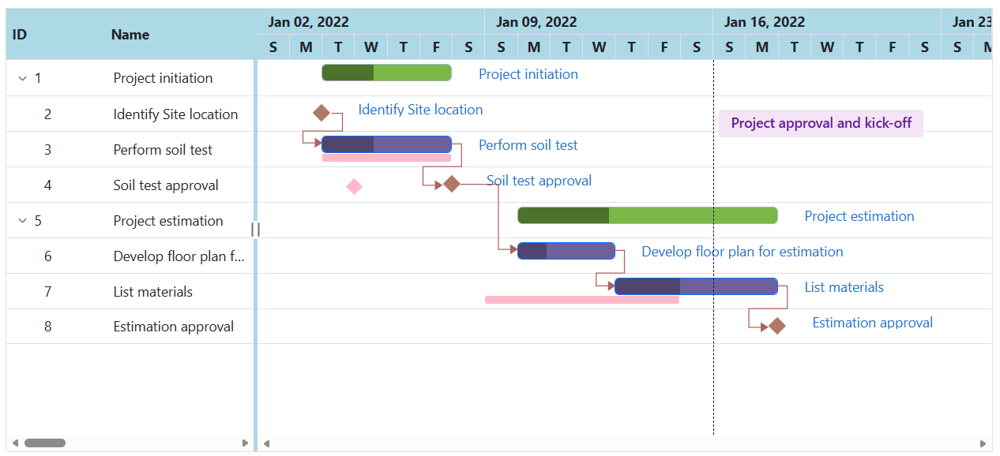

## Configuring grid lines in the Gantt Chart

Grid lines on the Tree Grid and chart sections can be shown or hidden using the [GridLines](https://help.syncfusion.com/cr/blazor/Syncfusion.Blazor.Gantt.SfGantt-1.html#Syncfusion_Blazor_Gantt_SfGantt_1_GridLines) property. This property controls the visibility of grid lines throughout the component. The available grid line options are:

 - **Horizontal**: Displays only horizontal grid lines.
 - **Vertical**: Displays only vertical grid lines.
 - **Both**: Displays both horizontal and vertical grid lines.
 - **None**: Hides all grid lines from the component.

N> By default, the `GridLines` property is set to **Horizontal** type.




@using Syncfusion.Blazor.Gantt
@using Syncfusion.Blazor.DropDowns

<div style="margin-bottom: 20px;">
    <label style="font-weight:20px">Select Grid Line Type:</label>
    <SfDropDownList TValue="Syncfusion.Blazor.Gantt.GridLine" TItem="GridLineOption" DataSource="@GridLineOptions" Placeholder="Select Grid Line Type" Value="@SelectedGridLine" Width="250px">
        <DropDownListFieldSettings Text="Text" Value="Value" />
        <DropDownListEvents TValue="Syncfusion.Blazor.Gantt.GridLine" TItem="GridLineOption" ValueChange="OnGridLineChange" />                 
    </SfDropDownList>
</div>
<SfGantt DataSource="@TaskCollection" Height="450px" Width="800px" GridLines="@SelectedGridLine">
    <GanttTaskFields Id="TaskID" Name="TaskName" StartDate="StartDate" EndDate="EndDate" Duration="Duration" Progress="Progress" ParentID="ParentID">
    </GanttTaskFields>
</SfGantt>

@code {
    private List<TaskData> TaskCollection { get; set; }
    private Syncfusion.Blazor.Gantt.GridLine SelectedGridLine { get; set; } = Syncfusion.Blazor.Gantt.GridLine.Both;

    public class GridLineOption
    {
        public string Text { get; set; }
        public Syncfusion.Blazor.Gantt.GridLine Value { get; set; }
    }

    private List<GridLineOption> GridLineOptions = new List<GridLineOption>
    {
        new GridLineOption { Text = "Horizontal", Value = Syncfusion.Blazor.Gantt.GridLine.Horizontal },
        new GridLineOption { Text = "Vertical", Value = Syncfusion.Blazor.Gantt.GridLine.Vertical },
        new GridLineOption { Text = "Both", Value = Syncfusion.Blazor.Gantt.GridLine.Both },
        new GridLineOption { Text = "None", Value = Syncfusion.Blazor.Gantt.GridLine.None }
    };

    private void OnGridLineChange(ChangeEventArgs<Syncfusion.Blazor.Gantt.GridLine, GridLineOption> args)
    {
        SelectedGridLine = args.Value;
    }

    protected override void OnInitialized()
    {
        this.TaskCollection = GetTaskCollection();
    }

    public class TaskData
    {
        public int TaskID { get; set; }
        public string TaskName { get; set; }
        public DateTime StartDate { get; set; }
        public DateTime EndDate { get; set; }
        public string Duration { get; set; }
        public int Progress { get; set; }
        public int? ParentID { get; set; }
    }

    private static List<TaskData> GetTaskCollection()
    {
        return new List<TaskData>
        {
            new TaskData { TaskID = 1, TaskName = "Project initiation", StartDate = new DateTime(2022, 01, 04), EndDate = new DateTime(2022, 01, 07) },
            new TaskData { TaskID = 2, TaskName = "Identify Site location", StartDate = new DateTime(2022, 01, 04), Duration = "0", Progress = 30, ParentID = 1 },
            new TaskData { TaskID = 3, TaskName = "Perform soil test", StartDate = new DateTime(2022, 01, 04), Duration = "4", Progress = 40, ParentID = 1 },
            new TaskData { TaskID = 4, TaskName = "Soil test approval", StartDate = new DateTime(2022, 01, 04), Duration = "0", Progress = 30, ParentID = 1 },
            new TaskData { TaskID = 5, TaskName = "Project estimation", StartDate = new DateTime(2022, 01, 04), EndDate = new DateTime(2022, 01, 10) },
            new TaskData { TaskID = 6, TaskName = "Develop floor plan for estimation", StartDate = new DateTime(2022, 01, 06), Duration = "3", Progress = 30, ParentID = 5 },
            new TaskData { TaskID = 7, TaskName = "List materials", StartDate = new DateTime(2022, 01, 06), Duration = "3", Progress = 40, ParentID = 5 },
            new TaskData { TaskID = 8, TaskName = "Estimation approval", StartDate = new DateTime(2022, 01, 06), Duration = "0", Progress = 30, ParentID = 5 }
        };
    }
}






## See also

* [Customizing the Blazor Gantt Chart’s Taskbar](https://www.syncfusion.com/blogs/post/customizing-the-blazor-gantt-charts-taskbar-an-overview.aspx)

> Refer to the [Blazor Gantt Chart](https://www.syncfusion.com/blazor-components/blazor-gantt-chart) feature tour page for feature details. The [Blazor Gantt Chart example](https://blazor.syncfusion.com/demos/gantt-chart/default-functionalities?theme=bootstrap5) demonstrates how to render and configure the Gantt.
