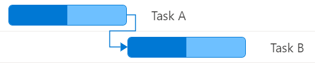
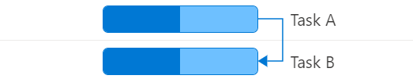
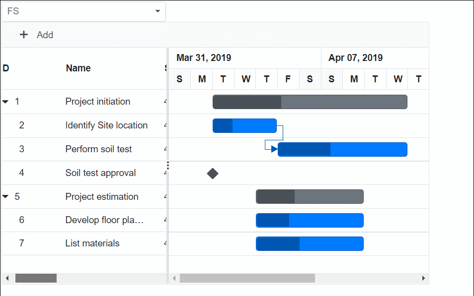
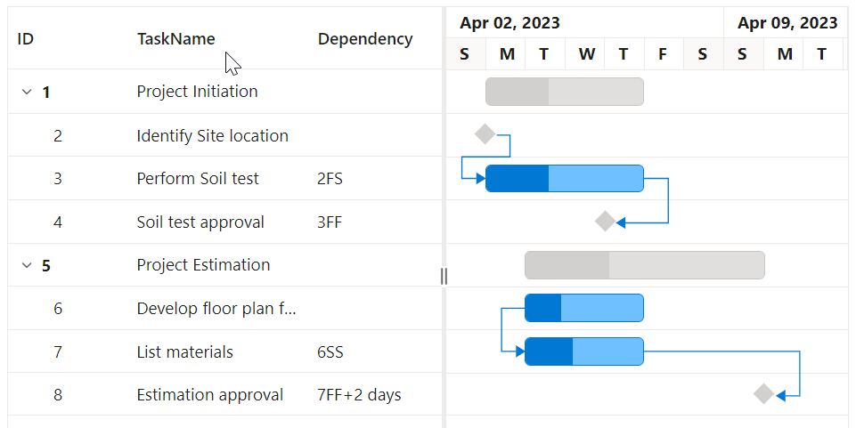
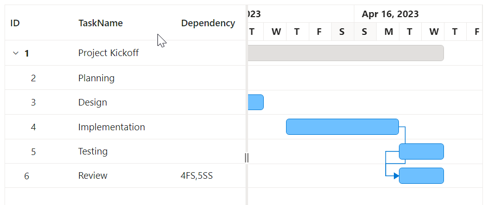
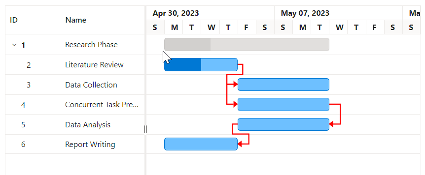

# Task Dependencies in Blazor Gantt Chart Component

Task Dependencies are a crucial feature in project management that define relationships between tasks, ensuring they are executed in a logical sequence. In the [Blazor Gantt Chart](https://www.syncfusion.com/blazor-components/blazor-gantt-chart) component, task dependencies provide a powerful way to visualize and manage the interconnections between various project activities.

## Understanding task dependencies

Task dependencies establish the order in which tasks should be completed, creating a structured workflow within your project. By implementing dependencies, you can:

1. Ensure tasks are executed in the correct sequence
2. Automatically adjust schedules when related tasks change
3. Identify critical paths and potential bottlenecks
4. Improve overall project planning and resource allocation

## Types of task relationships

The Blazor Gantt Chart supports four types of task relationships, each serving a specific purpose in project scheduling:

1. **Finish-to-start (FS)**: The most common type, where a task can only begin after its predecessor is completed.
   
   Example: In software development, coding (Task B) can only start after the design phase (Task A) is finished.
   

2. **Start-to-start (SS)**: Tasks begin simultaneously or with a specified lag.
   
   Example: In event planning, venue decoration (Task B) can start as soon as venue setup (Task A) begins.
   

3. **Finish-to-finish (FF)**: Tasks must finish together or with a specified lag.
   
   Example: In publishing, proof reading (Task B) must finish when or shortly after content writing (Task A) is completed.
   

4. **Start-to-finish (SF)**: A task can't finish until its predecessor starts.
   
   Example: In shift work, the night shift (Task B) can't end until the day shift (Task A) begins.
   

## Implementing task dependencies

To implement task dependencies in your Blazor Gantt Chart, follow these steps:

1. **Define the dependency field**: In your data source, create a field to hold dependency information.

2. **Map the dependency field**: Use the [Dependency](https://help.syncfusion.com/cr/blazor/Syncfusion.Blazor.Gantt.GanttTaskFields.html#Syncfusion_Blazor_Gantt_GanttTaskFields_Dependency) property of [GanttTaskFields](https://help.syncfusion.com/cr/blazor/Syncfusion.Blazor.Gantt.GanttTaskFields.html) to map your dependency field.

3. **Specify dependencies**: For each task, specify its dependencies by indicating the **Predecessor's Task ID** followed by the **Dependency Type** (e.g., Finish-to-Start, Start-to-Start).

4. **Predecessor configuration**: The [DependencyTypes](https://help.syncfusion.com/cr/blazor/Syncfusion.Blazor.Gantt.SfGantt-1.html#Syncfusion_Blazor_Gantt_SfGantt_1_DependencyTypes) property manages task dependencies, using [DependencyType](https://help.syncfusion.com/cr/blazor/Syncfusion.Blazor.Gantt.DependencyType.html) enums to define relationships. You can configure the order of predecessor types such as FS, SS, FF, and SF.

The following code snippets demonstrate how to define and configure task dependencies in the Gantt Chart component.


```cshtml
@using Syncfusion.Blazor.Gantt
@using Syncfusion.Blazor.DropDowns

<SfDropDownList TItem="Types" TValue="string" PopupHeight="230px" Width="250px" @bind-Value="@DropDownValue" DataSource="@PTypes">
    <DropDownListEvents TItem="Types" TValue="string" ValueChange="OnChange" />
    <DropDownListFieldSettings Text="Text" Value="ID" />
</SfDropDownList>
<SfGantt DataSource="@TaskCollection" Height="450px" Width="650px" DependencyTypes="@types" Toolbar="@(new List<string>() { "Add", "Edit", "Delete", "Update", "Cancel" })">
    <GanttTaskFields Id="TaskId"
                     Name="TaskName"
                     StartDate="StartDate"
                     EndDate="EndDate"
                     Duration="Duration"
                     Progress="Progress"
                     Dependency="Predecessor"
                     ParentID="ParentId">
    </GanttTaskFields>
</SfGantt>
@code {
    public List<TaskData> TaskCollection { get; set; }
    public List<DependencyType> types = new List<DependencyType>() { DependencyType.FS, DependencyType.SS, DependencyType.SF, DependencyType.FF };
    public class Types
    {
        public string ID { get; set; }
        public string Text { get; set; }
    }
    private List<Types> PTypes = new List<Types>()
    {
        new Types(){ ID= "Type1", Text= "FS" },
        new Types(){ ID= "Type2", Text= "FS, SS" },
        new Types(){ ID= "Type3", Text= "FS, SS, SF" },
        new Types(){ ID= "Type4", Text= "FS, SS, SF, FF" }
     };
    public string DropDownValue = "Type4";
    public void OnChange(Syncfusion.Blazor.DropDowns.ChangeEventArgs<string, Types> args)
    {
        if (args.ItemData.ID == "Type1")
        {
            types = new List<DependencyType>() { DependencyType.FS };
        }
        else if (args.ItemData.ID == "Type2")
        {
            types = new List<DependencyType>() { DependencyType.FS, DependencyType.SS };
        }
        else if (args.ItemData.ID == "Type3")
        {
            types = new List<DependencyType>() { DependencyType.FS, DependencyType.SS, DependencyType.SF };
        }
        if (args.ItemData.ID == "Type4")
        {
            types = new List<DependencyType>() { DependencyType.FS, DependencyType.SS, DependencyType.SF, DependencyType.FF };
        }
    }
    protected override void OnInitialized()
    {
        TaskCollection = new List<TaskData>
        {
            new TaskData { TaskId = 1, TaskName = "Project Initiation", StartDate = new DateTime(2023, 04, 02), EndDate = new DateTime(2023, 04, 21) },
            new TaskData { TaskId = 2, TaskName = "Identify Site location", StartDate = new DateTime(2023, 04, 02), Duration = "0", Progress = 30, ParentId = 1 },
            new TaskData { TaskId = 3, TaskName = "Perform Soil test", StartDate = new DateTime(2023, 04, 02), Duration = "4", Progress = 40, Predecessor = "2FS", ParentId = 1 },
            new TaskData { TaskId = 4, TaskName = "Soil test approval", StartDate = new DateTime(2023, 04, 02), Duration = "0", Progress = 30, Predecessor = "3FF", ParentId = 1 },
            new TaskData { TaskId = 5, TaskName = "Project Estimation", StartDate = new DateTime(2023, 04, 02), EndDate = new DateTime(2023, 04, 21) },
            new TaskData { TaskId = 6, TaskName = "Develop floor plan for estimation", StartDate = new DateTime(2023, 04, 04), Duration = "3", Progress = 30, ParentId = 5 },
            new TaskData { TaskId = 7, TaskName = "List materials", StartDate = new DateTime(2023, 04, 04), Duration = "3", Progress = 40, Predecessor = "6SS", ParentId = 5 },
            new TaskData { TaskId = 8, TaskName = "Estimation approval", StartDate = new DateTime(2023, 04, 04), Duration = "0", Progress = 30, Predecessor = "7SF", ParentId = 5 }
        };
    }
    public class TaskData
    {
        public int TaskId { get; set; }
        public string TaskName { get; set; }
        public DateTime StartDate { get; set; }
        public DateTime? EndDate { get; set; }
        public string Duration { get; set; }
        public int Progress { get; set; }
        public string Predecessor { get; set; }
        public int? ParentId { get; set; }
    }
}
```
The example initially sets the `DependencyTypes` property with all task dependency types: Finish-to-Start (FS), Start-to-Start (SS), Start-to-Finish (SF), and Finish-to-Finish (FF). A dropdown allows you to dynamically change which types are active. As you select different options, the Gantt Chart immediately updates the dependencies based on the current `DependencyTypes` configuration.



## Relationship between task levels

In a Gantt Chart, tasks can have hierarchical relationships which define how parent tasks, child tasks, and cross-level dependencies interact with each other. Understanding these relationships helps in organizing tasks within a project effectively and ensures that dependencies are managed efficiently. Below are details on different task level relationships with real-time examples:

### Parent-parent relationships

Parent-parent relationships occur when dependencies are defined between two parent tasks. These relationships affect the overall project structure and timeline.

**Example:** In a software development project, the "Back end Development" phase (parent task) cannot start until the "Requirements Gathering" phase (another parent task) is completed.

### Child-child relationships

Child-child relationships are dependencies between tasks at the same hierarchical level, usually under the same parent task or different parent tasks.

**Example:** In the "UI Development" phase, the "implement user authentication" task (child task) must be completed before the "create dashboard" task (another child task) can begin.

### Parent-child or child-parent relationships

These relationships define dependencies between tasks at different hierarchical levels.

**Example:** The "Project Review" task (parent task) cannot start until all "Module Testing" tasks (child tasks) are completed.

## Predecessor offset with duration unit

Offsets in task dependencies allow for more precise scheduling by introducing lag (delay) or lead (overlap) time between tasks. The Gantt Chart supports specifying these offsets using day units.

### Positive offset (lag)

A positive offset introduces a delay between the end of the predecessor and the start of the successor.

**Format:**     
    **Predecessor's Task ID**, **Dependency Type**, then add the duration of lag with **+**.

**Example:**    
    **2FS+3d** means the task starts 3 days after Task 2 finishes.

### Negative offset (lead)

A negative offset allows a task to start before its predecessor completes, creating an overlap.

**Format:**                            
    **Predecessor's Task ID**, **Dependency Type**, then add the duration of lead with **-**. 

**Example:**                       
    **3SS-1d** means the task starts 1 day before Task 3 starts.

## Understanding dependency string structure

The dependency string in the Gantt Chart follows a specific structure to define relationships between tasks. Let's break down an example:

**2FS+3d**

- **2**: This is the TaskId of the predecessor task. It corresponds to the [Id](https://help.syncfusion.com/cr/blazor/Syncfusion.Blazor.Gantt.GanttTaskFields.html#Syncfusion_Blazor_Gantt_GanttTaskFields_Id) field mapped in the `GanttTaskFields`.
- **FS**: This represents the dependency type (Finish-to-Start in this case).
- **+3d**: This is the offset, indicating a 3-day lag after the predecessor finishes.

Here's a detailed explanation of each component:

1. **TaskId**: 
   - This is the unique identifier of the predecessor task.
   - It must match the `Id` field specified in your `GanttTaskFields` mapping.

2. **Dependency type**:
   - **FS**: Finish-to-Start (default if not specified)
   - **SS**: Start-to-Start
   - **FF**: Finish-to-Finish
   - **SF**: Start-to-Finish

3. **Offset (Optional)**:
   - **+Nd**: Positive offset (lag) of N days
   - **-Nd**: Negative offset (lead) of N days

### Examples of dependency strings:

1. **3FS**: Task starts when Task 3 finishes (Finish-to-Start, no offset)
2. **4SS+1d**: Task starts 1 day after Task 4 starts (Start-to-Start with 1-day lag)
3. **5FF-2d**: Task finishes 2 days before Task 5 finishes (Finish-to-Finish with 2-day lead)
4. **6SF**: Task finishes when Task 6 starts (Start-to-Finish, no offset)

## Implementing complex dependencies

The Gantt Chart component allows you to configure complex task dependencies to handle intricate project workflows. The following code snippets demonstrate how to define and set up such dependencies.


```cshtml
@using Syncfusion.Blazor.Gantt

<SfGantt DataSource="@TaskCollection" Height="450px" Width="900px">
    <GanttTaskFields
        Id="TaskId"
        Name="TaskName"
        StartDate="StartDate"
        EndDate="EndDate"
        Duration="Duration"
        Progress="Progress"
        Dependency="Predecessor"
        ParentID="ParentId">
    </GanttTaskFields>
</SfGantt>

@code {
    public List<TaskData> TaskCollection { get; set; }

    protected override void OnInitialized()
    {
        TaskCollection = new List<TaskData>
        {
            new TaskData { TaskId = 1, TaskName = "Project Initiation", StartDate = new DateTime(2023, 04, 02), EndDate = new DateTime(2023, 04, 21) },
            new TaskData { TaskId = 2, TaskName = "Identify Site location", StartDate = new DateTime(2023, 04, 02), Duration = "0", Progress = 30, ParentId = 1 },
            new TaskData { TaskId = 3, TaskName = "Perform Soil test", StartDate = new DateTime(2023, 04, 02), Duration = "4", Progress = 40, Predecessor = "2FS", ParentId = 1 },
            new TaskData { TaskId = 4, TaskName = "Soil test approval", StartDate = new DateTime(2023, 04, 02), Duration = "0", Progress = 30, Predecessor = "3FF", ParentId = 1 },
            new TaskData { TaskId = 5, TaskName = "Project Estimation", StartDate = new DateTime(2023, 04, 02), EndDate = new DateTime(2023, 04, 21) },
            new TaskData { TaskId = 6, TaskName = "Develop floor plan for estimation", StartDate = new DateTime(2023, 04, 04), Duration = "3", Progress = 30, ParentId = 5 },
            new TaskData { TaskId = 7, TaskName = "List materials", StartDate = new DateTime(2023, 04, 04), Duration = "3", Progress = 40, Predecessor = "6SS", ParentId = 5 },
            new TaskData { TaskId = 8, TaskName = "Estimation approval", StartDate = new DateTime(2023, 04, 04), Duration = "0", Progress = 30, Predecessor = "7FF+2d", ParentId = 5 }
        };
    }

    public class TaskData
    {
        public int TaskId { get; set; }
        public string TaskName { get; set; }
        public DateTime StartDate { get; set; }
        public DateTime? EndDate { get; set; }
        public string Duration { get; set; }
        public int Progress { get; set; }
        public string Predecessor { get; set; }
        public int? ParentId { get; set; }
    }
}
```


In this example:
- Tasks 2, 3, and 4 are child tasks of Task 1 (Project Initiation).
- Tasks 6, 7, and 8 are child tasks of Task 5 (Project Estimation).
- Task 3 has a Finish-to-Start dependency on Task 2.
- Task 4 has a Finish-to-Finish dependency on Task 3.
- Task 7 has a Start-to-Start dependency on Task 6.
- Task 8 has a Finish-to-Finish dependency on Task 7 with a 2-day lag.

## Managing multiple dependencies

Tasks can have multiple dependencies, allowing for complex project structures. Specify multiple dependencies by separating them with commas.

The following code snippets demonstrate how to define and configure multiple dependencies:

```cshtml
@using Syncfusion.Blazor.Gantt

<SfGantt DataSource="@TaskCollection" Height="450px" Width="700px">
    <GanttTaskFields Id="TaskId"
                     Name="TaskName"
                     StartDate="StartDate"
                     EndDate="EndDate"
                     Duration="Duration"
                     Progress="Progress"
                     Dependency="Predecessor"
                     ParentID="ParentId">
    </GanttTaskFields>
</SfGantt>

@code {
    public List<TaskData> TaskCollection { get; set; }

    protected override void OnInitialized()
    {
        TaskCollection = new List<TaskData>
        {
            new TaskData { TaskId = 1, TaskName = "Project Kickoff", StartDate = new DateTime(2023, 04, 02), Duration = "2", Progress = 20 },
            new TaskData { TaskId = 2, TaskName = "Planning", StartDate = new DateTime(2023, 04, 04), Duration = "3", Progress = 40, ParentId = 1 },
            new TaskData { TaskId = 3, TaskName = "Design", StartDate = new DateTime(2023, 04, 09), Duration = "2", ParentId = 1 },
            new TaskData { TaskId = 4, TaskName = "Implementation", StartDate = new DateTime(2023, 04, 13), Duration = "3", ParentId = 1 },
            new TaskData { TaskId = 5, TaskName = "Testing", StartDate = new DateTime(2023, 04, 18), Duration = "2", ParentId = 1 },
            new TaskData { TaskId = 6, TaskName = "Review", StartDate = new DateTime(2023, 04, 20), Duration = "2", Predecessor = "4FS,5SS" }
        };
    }

    public class TaskData
    {
        public int TaskId { get; set; }
        public string TaskName { get; set; }
        public DateTime StartDate { get; set; }
        public DateTime EndDate { get; set; }
        public string Duration { get; set; }
        public int Progress { get; set; }
        public string Predecessor { get; set; }
        public int? ParentId { get; set; }
    }
}
```


In this example, the "Review" task starts after the "Implementation" task finishes (Finish-to-Start relationship) and starts simultaneously with the "Testing" task (Start-to-Start relationship).

## Visualizing dependencies

The Gantt Chart automatically renders dependency lines between related tasks. These lines visually represent the relationships and update dynamically as you modify task schedules.

## Customizing dependency appearance

The Gantt Chart includes styling options that enable you to customize the appearance of dependency lines. The [ConnectorLineBackground](https://help.syncfusion.com/cr/blazor/Syncfusion.Blazor.Gantt.SfGantt-1.html#Syncfusion_Blazor_Gantt_SfGantt_1_ConnectorLineBackground) property allows you to set the color of the connector lines using CSS color values, such as "#ff00ff". Additionally, the [ConnectorLineWidth](https://help.syncfusion.com/cr/blazor/Syncfusion.Blazor.Gantt.SfGantt-1.html#Syncfusion_Blazor_Gantt_SfGantt_1_ConnectorLineWidth) property lets you adjust the thickness of these lines in pixels, defaulting to 1 pixel. These properties are designed to enhance the visual clarity and appeal of task dependencies within the chart.

Here is a code snippet that shows how to modify the color of dependency lines:

```cshtml
@using Syncfusion.Blazor.Gantt
<SfGantt DataSource="@TaskCollection" ConnectorLineBackground="#ff0000" ConnectorLineWidth="2" Height="450px" Width="750px">
    <GanttTaskFields Id="TaskId"
                     Name="TaskName"
                     StartDate="StartDate"
                     EndDate="EndDate"
                     Duration="Duration"
                     Progress="Progress"
                     Dependency="Predecessor"
                     ParentID="ParentId">
    </GanttTaskFields>
</SfGantt>
@code {
    public List<TaskData> TaskCollection { get; set; }

    protected override void OnInitialized()
    {
        TaskCollection = new List<TaskData>
        {
            new TaskData { TaskId = 1, TaskName = "Research Phase", StartDate = new DateTime(2023, 05, 01) },
            new TaskData { TaskId = 2, TaskName = "Literature Review", StartDate = new DateTime(2023, 05, 01), Duration = "4", Progress = 50, ParentId = 1 },
            new TaskData { TaskId = 3, TaskName = "Data Collection", StartDate = new DateTime(2023, 05, 05), Duration = "3", Progress = 0, Predecessor = "2FS", ParentId = 1 },
            new TaskData { TaskId = 4, TaskName = "Concurrent Task Preparation", StartDate = new DateTime(2023, 05, 11), Duration = "3", Progress = 0, Predecessor = "3SS" },
            new TaskData { TaskId = 5, TaskName = "Data Analysis", StartDate = new DateTime(2023, 05, 14), Duration = "3", Progress = 0, Predecessor = "4FF" },
            new TaskData { TaskId = 6, TaskName = "Report Writing", StartDate = new DateTime(2023, 05, 18), Duration = "4", Progress = 0, Predecessor = "5SF" }
        };
    }

    public class TaskData
    {
        public int TaskId { get; set; }
        public string TaskName { get; set; }
        public DateTime StartDate { get; set; }
        public DateTime EndDate { get; set; }
        public string Duration { get; set; }
        public int Progress { get; set; }
        public string Predecessor { get; set; }
        public int? ParentId { get; set; }
    }
}
```

Additionally, you can modify the colors of the dependency lines and arrows using CSS for better visualization:

```html
<style>
    .e-gantt .e-connector-line {
        stroke: #ff0000 !important; /* Set line color to red */
        stroke-width: 2 !important;/* Make line thicker */
    }
    .e-gantt .e-connector-line-arrow {
        fill: #ff0000 !important;/* Set arrow color to red */
    }
</style>
```


This customization makes the dependency lines and arrows red and thicker for better visibility in the Gantt Chart.

## Handling circular dependencies

Circular dependencies, where tasks depend on each other in a loop (e.g., Task A depends on B, B depends on C, and C depends on A), can cause logical errors. The Gantt Chart detects and prevents these, providing a warning message. To resolve, review task dependencies to identify and break the loop where necessary.

## Best practices

1. **Use Descriptive Task Names**: Assign clear and descriptive names to tasks to facilitate understanding and managing dependencies effectively.
2. **Opt for Simplicity**: Maintain simple dependency structures to enhance clarity and reduce potential confusion in large projects.
3. **Regular Updates**: Continuously review and update dependencies as the project evolves to ensure they remain accurate and aligned with current project stages.
4. **Critical Path Management**: Use dependencies to manage the critical path effectively, preventing project delays.
5. **Document Complex Dependencies**: For intricate relationships, maintain documentation explaining the reasoning behind complex dependencies.

## Troubleshooting

If you encounter issues with task dependencies, consider the following solutions:

1. **Verify Data Integrity**: Ensure your data source correctly defines all task IDs and dependency strings.
2. **Check Circular Dependencies**: Look for and resolve any circular relationships in your task structure.
3. **Validate Date Consistency**: Confirm that task dates align logically with their dependencies.
4. **Inspect Dependency Rendering**: Use browser developer tools to check if dependency lines are being rendered correctly.

## Conclusion

Task Dependencies in the Blazor Gantt Chart component provide a powerful tool for visualizing and managing project workflows. By effectively utilizing this feature, you can create more accurate project timelines, identify potential bottlenecks, and ensure smoother project execution.

## See also

For more advanced topics related to task dependencies and project management in the Blazor Gantt Chart, refer to the following resources:

1. [Predecessor Validation](https://blazor.syncfusion.com/documentation/gantt-chart/predecessor-validation): Learn how to validate and manage task dependencies to ensure project integrity.

2. [Critical Path](https://blazor.syncfusion.com/documentation/gantt-chart/criticalpath): Understand how to identify and visualize the critical path in your project, which is crucial for project timeline management.

3. [Baseline](https://blazor.syncfusion.com/documentation/gantt-chart/baseline): Explore how to set and compare task progress against a baseline schedule.

4. [Resource Allocation](https://blazor.syncfusion.com/documentation/gantt-chart/resources): Discover how to manage resources in conjunction with task dependencies for optimal project planning.

5. [Timeline](https://blazor.syncfusion.com/documentation/gantt-chart/time-line): Understand how to customize the timeline view to better visualize your project schedule and dependencies.

For more detailed information and advanced usage scenarios, refer to the [Syncfusion<sup style="font-size:70%">&reg;</sup> Blazor Gantt Chart documentation](https://blazor.syncfusion.com/documentation/gantt-chart/getting-started).
