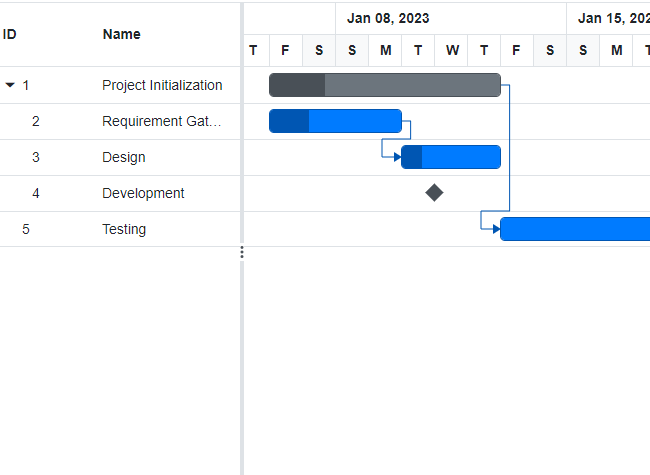
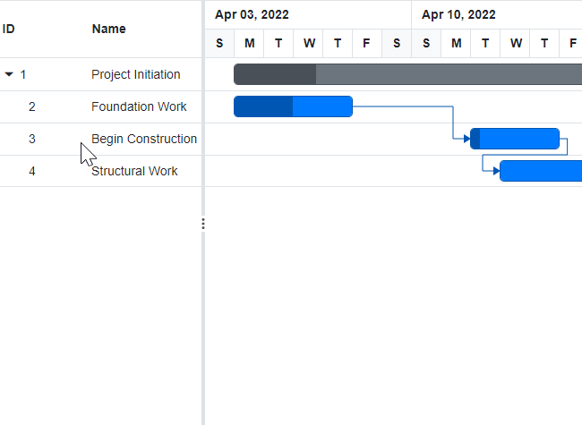

# Task Dependencies in Blazor Gantt Chart Component

Task dependency or task relationship can be established between two tasks in Gantt Chart. This dependency affects the project schedule. If you change the predecessor of a task, it will affect the successor task, which will affect the next task, and so on. Relationship can be established between parent-parent tasks, child-child tasks, parent-child and child-parent task.

## Task relationship types

Task relationships are categorized into four types based on the start and finish dates of the task.

### Start to start (SS)

You cannot start a task until the dependent task also starts.


### Start to finish (SF)

You cannot finish a task until the dependent task is started.


### Finish to start (FS)

You cannot start a task until the dependent task is completed.


### Finish to finish (FF)

You cannot finish a task until the dependent task is completed.


## Define task relationship

Task relationship is defined in the data source as a string value, and this value is mapped to the Gantt Chart component by using the [GanttTaskFields.Dependency](https://help.syncfusion.com/cr/blazor/Syncfusion.Blazor.Gantt.GanttTaskFields.html#Syncfusion_Blazor_Gantt_GanttTaskFields_Dependency) property. The following code example demonstrates how to enable the predecessor in the Gantt Chart component.

```cshtml
@using Syncfusion.Blazor.Gantt
<SfGantt DataSource="@TaskCollection" Height="450px" Width="700px">
    <GanttTaskFields Id="TaskId" Name="TaskName" StartDate="StartDate" EndDate="EndDate" Duration="Duration" Progress="Progress" ParentID="ParentId" Dependency="Predecessor">
    </GanttTaskFields>
</SfGantt>

@code{
    private List<TaskData> TaskCollection { get; set; }
    protected override void OnInitialized()
    {
        this.TaskCollection = GetTaskCollection();
    }

    public class TaskData
    {
        public int TaskId { get; set; }
        public string TaskName { get; set; }
        public DateTime StartDate { get; set; }
        public DateTime? EndDate { get; set; }
        public string Duration { get; set; }
        public int Progress { get; set; }
        public string Predecessor { get; set; }
        public int? ParentId { get; set; }
    }

    public static List<TaskData> GetTaskCollection()
    {
        List<TaskData> Tasks = new List<TaskData>()
        {
            new TaskData() { TaskId = 1, TaskName = "Project initiation", StartDate = new DateTime(2019, 04, 05), EndDate = new DateTime(2019, 04, 21), },
            new TaskData() { TaskId = 2, TaskName = "Identify Site location", StartDate = new DateTime(2019, 04, 05), Duration = "0", Progress = 30, ParentId = 1 },
            new TaskData() { TaskId = 3, TaskName = "Perform soil test", StartDate = new DateTime(2019, 04, 05), Duration = "4", Progress = 40, Predecessor = "2", ParentId = 1 },
            new TaskData() { TaskId = 4, TaskName = "Soil test approval", StartDate = new DateTime(2019, 04, 05), Duration = "0", Progress = 30, Predecessor = "3", ParentId = 1 },
            new TaskData() { TaskId = 5, TaskName = "Project estimation", StartDate = new DateTime(2019, 04, 06), EndDate = new DateTime(2019, 04, 21), Predecessor = "1FS", },
            new TaskData() { TaskId = 6, TaskName = "Develop floor plan for estimation", StartDate = new DateTime(2019, 04, 06), Duration = "3", Progress = 30, Predecessor = "4" , ParentId = 5 },
            new TaskData() { TaskId = 7, TaskName = "List materials", StartDate = new DateTime(2019, 04, 06), Duration = "3", Progress = 40, Predecessor = "6" , ParentId = 5 },
            new TaskData() { TaskId = 8, TaskName = "Estimation approval", StartDate = new DateTime(2019, 04, 06), Duration = "0", Progress = 30, Predecessor = "7" , ParentId = 5 },
        };
        return Tasks;
    }
}
```

The following screenshot displays the output of the above code.



## Predecessor offset with duration units

In the Gantt Chart component, the predecessor offset can be defined with the following duration units:

* Day
* Hour
* Minute

You can define an offset with various offset duration units for predecessors by using the following code example.

```cshtml
@using Syncfusion.Blazor.Gantt
<SfGantt DataSource="@TaskCollection" Height="450px" Width="900px">
    <GanttTaskFields Id="TaskId" Name="TaskName" StartDate="StartDate" EndDate="EndDate" Duration="Duration" Progress="Progress" Dependency="Predecessor" ParentID="ParentId">
    </GanttTaskFields>
</SfGantt>
@code{
    private List<TaskData> TaskCollection { get; set; }
    protected override void OnInitialized()
    {
        this.TaskCollection = GetTaskCollection();
    }

    public class TaskData
    {
        public int TaskId { get; set; }
        public string TaskName { get; set; }
        public DateTime StartDate { get; set; }
        public DateTime? EndDate { get; set; }
        public string Duration { get; set; }
        public int Progress { get; set; }
        public string Predecessor { get; set; }
        public int? ParentId { get; set; }
    }

    public static List<TaskData> GetTaskCollection()
    {
        List<TaskData> Tasks = new List<TaskData>()
        {
            new TaskData() { TaskId = 1, TaskName = "Project initiation", StartDate = new DateTime(2022, 04, 05), EndDate = new DateTime(2022, 04, 21), },
            new TaskData() { TaskId = 2, TaskName = "Identify Site location", StartDate = new DateTime(2022, 04, 05), Duration = "0", Progress = 30, ParentId = 1 },
            new TaskData() { TaskId = 3, TaskName = "Perform soil test", StartDate = new DateTime(2022, 04, 05), Duration = "4", Progress = 40, Predecessor = "2FS+2d", ParentId = 1 },
            new TaskData() { TaskId = 4, TaskName = "Soil test approval", StartDate = new DateTime(2022, 04, 05), Duration = "0", Progress = 30, Predecessor = "3FF+960m", ParentId = 1 },
            new TaskData() { TaskId = 5, TaskName = "Project estimation", StartDate = new DateTime(2022, 04, 06), EndDate = new DateTime(2022, 04, 21), },
            new TaskData() { TaskId = 6, TaskName = "Develop floor plan for estimation", StartDate = new DateTime(2022, 04, 06), Duration = "3", Progress = 30, ParentId = 5 },
            new TaskData() { TaskId = 7, TaskName = "List materials", StartDate = new DateTime(2022, 04, 06), Duration = "3", Progress = 40, Predecessor = "6SS+16h", ParentId = 5 }
        };
        return Tasks;
    }
}
```

The following screen shot depicts the duration unit support in the predecessor offset.



## Predecessor configuration

The required predecessor types can be configured, in the Gantt component by using the [DependencyTypes](https://help.syncfusion.com/cr/blazor/Syncfusion.Blazor.Gantt.SfGantt-1.html#Syncfusion_Blazor_Gantt_SfGantt_1_DependencyTypes) property.

You can define the predecessor types in any order. The default order will be FS, SS, FF, and SF. The types can be configured, as per the requirement by using an enum type namely `DependencyType`, and the type mentioned in the first index of the `DependencyTypes` property will be the default type.

```cshtml
@using Syncfusion.Blazor.Gantt
@using Syncfusion.Blazor.DropDowns

<SfDropDownList TItem="Types" TValue="string" PopupHeight="230px" Width="250px" @bind-Value="@DropDownValue" DataSource="@PTypes">
    <DropDownListEvents TItem="Types" TValue="string" ValueChange="OnChange"/>
    <DropDownListFieldSettings Text="Text" Value="ID"/>
</SfDropDownList>
<SfGantt DataSource="@TaskCollection" Height="450px" Width="950px" DependencyTypes="@types" Toolbar="@(new List<string>() { "Add", "Edit", "Delete", "Update", "Cancel" })" >
    <GanttTaskFields Id="TaskId" Name="TaskName" StartDate="StartDate" EndDate="EndDate" Duration="Duration" Progress="Progress" Dependency="Predecessor" ParentID="ParentId">
    </GanttTaskFields>
    <GanttEditSettings AllowAdding="true" AllowEditing="true" AllowDeleting="true" AllowTaskbarEditing="true">
    </GanttEditSettings>
</SfGantt>
@code{
    public List<TaskData> TaskCollection { get; set; }
    public List<DependencyType> types = new List<DependencyType>() { DependencyType.FS };
    public class Types
    {
        public string ID { get; set; }
        public string Text { get; set; }
    }
    private List<Types> PTypes = new List<Types>() 
    {
        new Types(){ ID= "Type1", Text= "FS" },
        new Types(){ ID= "Type2", Text= "FS, SS" },
        new Types(){ ID= "Type3", Text= "FS, SS, SF" },
        new Types(){ ID= "Type4", Text= "FS, SS, SF, FF" }
     };
    public string DropDownValue = "Type1";
    public string ChangeValue { get; set; } = "FS";
    public void OnChange(Syncfusion.Blazor.DropDowns.ChangeEventArgs<string, Types> args)
    {
        this.ChangeValue = args.ItemData.Text;
        if (args.ItemData.ID == "Type1")
        {
            types = new List<DependencyType>() { DependencyType.FS };
        } 
        else if (args.ItemData.ID == "Type2")
        {
            types = new List<DependencyType>() { DependencyType.FS, DependencyType.SS };
        }  
        else if (args.ItemData.ID == "Type3")
        {
            types = new List<DependencyType>() { DependencyType.FS, DependencyType.SS, DependencyType.SF };
        }  
        if (args.ItemData.ID == "Type4")
        {
            types = new List<DependencyType>() { DependencyType.FS, DependencyType.SS, DependencyType.SF, DependencyType.FF };
        } 
    }
    protected override void OnInitialized()
    {
        this.TaskCollection = GetTaskCollection();
    }
    public class TaskData
    {
        public int TaskId { get; set; }
        public string TaskName { get; set; }
        public DateTime StartDate { get; set; }
        public DateTime? EndDate { get; set; }
        public string Duration { get; set; }
        public int Progress { get; set; }
        public string Predecessor { get; set; }
        public int? ParentId { get; set; }
    }

    public static List <TaskData> GetTaskCollection() {
    List <TaskData> Tasks = new List <TaskData> () {
        new TaskData() {TaskId = 1, TaskName = "Project initiation", StartDate = new DateTime(2019, 04, 02), EndDate = new DateTime(2019, 04, 21)},
        new TaskData() { TaskId = 2, TaskName = "Identify Site location", StartDate = new DateTime(2019, 04, 02), Duration = "3", Progress = 30, ParentId = 1 },
        new TaskData() { TaskId = 3, TaskName = "Perform soil test", StartDate = new DateTime(2019, 04, 02), Duration = "4", Progress = 40, Predecessor = "2FS", ParentId = 1 },
        new TaskData() { TaskId = 4, TaskName = "Soil test approval", StartDate = new DateTime(2019, 04, 02), Duration = "0", Progress = 30, Predecessor = "3FF", ParentId = 1 },
        new TaskData() { TaskId = 5, TaskName = "Project estimation", StartDate = new DateTime(2019, 04, 02), EndDate = new DateTime(2019, 04, 21)},
        new TaskData() { TaskId = 6, TaskName = "Develop floor plan for estimation", StartDate = new DateTime(2019, 04, 04), Duration = "3", Progress = 30, ParentId = 5 },
        new TaskData() { TaskId = 7, TaskName = "List materials", StartDate = new DateTime(2019, 04, 04), Duration = "3", Progress = 40, Predecessor = "6SS", ParentId = 5 }
    };

    return Tasks;
}
}
```

The following screen shot depicts the predecessor configuration support.


N> Based on the types configured, respective connector points appear on hovering the taskbar. Also, the dropdown-data of the type column in the dependency tab of add or edit dialog populates based on the type configured.

## Limitations

* Currently, there is no support for establishing relationship for manual parent tasks.

N> You can refer to our [Blazor Gantt Chart](https://www.syncfusion.com/blazor-components/blazor-gantt-chart) feature tour page for its groundbreaking feature representations. You can also explore our [Blazor Gantt Chart example](https://blazor.syncfusion.com/demos/gantt-chart/default-functionalities?theme=bootstrap5) to know how to render and configure the Gantt.