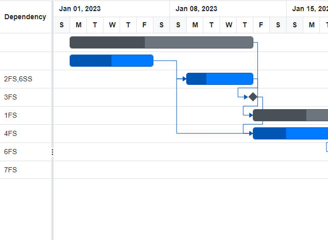

# Task Dependencies in Blazor Gantt Chart Component

Task Dependencies in the Blazor Gantt Chart enable you to define and manage relationships between tasks. This feature allows specifying the order and conditions under which tasks must be executed within a project timeline. Task dependencies ensure that tasks follow a logical sequence and respect pre-established constraints. This feature is crucial for effective project management, as it helps to visualize dependencies and manage workflows efficiently. By establishing task dependencies, project managers can create a clear plan and schedule, preventing bottlenecks and ensuring all tasks are completed in a coordinated manner. This leads to improved project accuracy and delivery timelines, thereby enhancing overall project management effectiveness. By utilizing these relationships, you can effectively manage task sequences and ensure that project timelines are adhered to, ultimately leading to successful project outcomes.

## Task relationship types

Task relationship types in the Gantt Chart define how tasks are interconnected, influencing the order of their execution based on their start and finish dates. These relationship types are crucial for accurately mapping out project timelines and ensuring tasks are executed in a coordinated manner. By categorizing relationships into four distinct types.

### Start to start (SS)

The **Start to Start (SS)** task relationship type in the Gantt Chart specifies that a task cannot commence until its predecessor task has also started. This type of dependency is particularly useful in scenarios where tasks are initiated concurrently, yet are dependent on the initiation of a preceding task. For example, in construction planning, both site excavation and equipment setup can begin simultaneously only after securing permits. 


### Start to finish (SF)

The **Start to Finish (SF)** task relationship type in the Gantt Chart dictates a task cannot be completed until its predecessor task has started. This type of dependency is particularly useful in scenarios where the initiation of a new task is essential for the completion of a preceding task. For instance, in logistics and supply chain management, an outgoing delivery process might be dependent on the start of the inventory replenishment before concluding.


### Finish to start (FS)

The **Finish to Start (FS)** task relationship type in the Blazor Gantt Chart is the most common and intuitive form of dependency used in project management. This relationship dictates that a task cannot begin until its predecessor has been completed. It closely mirrors real-world scenarios where the start of one activity is contingent upon the closure of another. For example, in a software development project, coding cannot commence before the design phase is finalized. Utilizing the Finish to Start relationship ensures a structured workflow by preventing premature task initiation, thereby minimizing the risk of project delays and resource conflicts.


### Finish to finish (FF)

The **Finish to Finish (FF)** task relationship type in the Gantt Chart specifies that a task cannot be completed until its predecessor task is also completed. This type of dependency is particularly useful in scenarios where simultaneous completion of tasks is required to ensure project coherence and success. For instance, in event planning, the setup of the venue might need to finish concurrently with the preparation of the audio-visual equipment to ensure a seamless event launch.


## Relationship Between Task Levels in Gantt Chart

In a Gantt Chart, tasks can have hierarchical relationships which define how parent tasks, child tasks, and cross-level dependencies interact with each other. Understanding these relationships helps in organizing tasks within a project effectively and ensures that dependencies are managed efficiently. Below are details on different task level relationships with real-time examples:
In a Gantt Chart, tasks can have hierarchical relationships which define how parent tasks, child tasks, and cross-level dependencies interact with each other. Understanding these relationships helps in organizing tasks within a project effectively and ensures that dependencies are managed efficiently. Below are details on different task-level relationships with real-time examples:

#### Parent-Parent Relationships

Parent-parent relationships occur when dependencies are defined between two parent tasks. Parent tasks represent a higher level of grouping within the project structure, encompassing a set of subtasks that contribute to a larger project phase or deliverable. Dependencies between parent tasks indicate that an entire group of subtasks under one parent is dependent on another group of subtasks from a different parent task.

**Example:** In a construction project, the "Structural Work" phase cannot commence until the "Foundation Work" phase is complete. Here, the "Structural Work" and "Foundation Work" are both parent tasks, and a Finish-to-Start (FS) relationship might be applied.

#### Child-Child Relationships

Child-child relationships dictate dependencies between two tasks under the same or different parent tasks. Establishing these relationships is crucial for controlling the sequence of related tasks within the same project phase.

**Example:** During the software development process, "Code Review" cannot start until "Coding" is finished, even though both lie under the parent task "Software Development." This could be a Finish-to-Start (FS) dependency.

#### Parent-Child or Child-Parent Relationships

Parent-child or child-parent relationships define the dependencies between parent tasks and their subtasks as well as between a subtask of one parent and a different parent task. Dependencies between these levels ensure that subtask execution is synchronized with the larger task structure, maintaining overall project coherence.

**Example:** In an event management project, the "Venue Setup" (parent task) must be completed before "Decoration" (child task) can begin, highlighting a Start-to-Finish (SF) relationship where the child task's initiation relies on the parent's completion. Conversely, a child-parent relationship might involve a situation where the completion of "Guest List Finalization" (child task) can directly impact the "Event Layout Design" (parent task). This relationship could be modeled as a Finish-to-Start (FS) dependency.

## Define task relationship

In the Gantt Chart component, a task dependency string is defined by pairing the [GanttTaskFields.Id](https://help.syncfusion.com/cr/blazor/Syncfusion.Blazor.Gantt.GanttTaskFields.html#Syncfusion_Blazor_Gantt_GanttTaskFields_Id) with a specific dependency type, then assigning this value through the [GanttTaskFields.Dependency](https://help.syncfusion.com/cr/blazor/Syncfusion.Blazor.Gantt.GanttTaskFields.html#Syncfusion_Blazor_Gantt_GanttTaskFields_Dependency) property.

For instance, in the code snippet below, task dependencies are established as follows:

* The task labeled "Design" (identified by TaskId 3) is dependent on the completion of the "Requirement Gathering" task (TaskId 2). Since no specific dependency type is mentioned, the default **Finish-to-Start (FS)** relationship is applied. This means "Design" will begin only after "Requirement Gathering" has been completed.

* The task titled "Testing" (TaskId 5) has an explicit **Finish-to-Start** dependency with "Project Initialization" (TaskId 1), specified by adding "1FS" to its `Predecessor` attribute. This indicates that the "Testing" task can only commence once the "Project Initialization" is complete, highlighting the order and flow of tasks within the project timeline.

```cshtml
@using Syncfusion.Blazor.Gantt
<SfGantt DataSource="@TaskCollection" Height="450px" Width="700px">
    <GanttTaskFields Id="TaskId" Name="TaskName" StartDate="StartDate" EndDate="EndDate" Duration="Duration" Progress="Progress" ParentID="ParentId" Dependency="Predecessor">
    </GanttTaskFields>
</SfGantt>

@code{
    private List<TaskData> TaskCollection { get; set; }
    protected override void OnInitialized()
    {
        this.TaskCollection = GetTaskCollection();
    }

    public class TaskData
    {
        public int TaskId { get; set; }
        public string TaskName { get; set; }
        public DateTime StartDate { get; set; }
        public DateTime? EndDate { get; set; }
        public string Duration { get; set; }
        public int Progress { get; set; }
        public string Predecessor { get; set; }
        public int? ParentId { get; set; }
    }

    public static List<TaskData> GetTaskCollection()
    {
        List<TaskData> Tasks = new List<TaskData>()
        {
            new TaskData() { TaskId = 1, TaskName = "Project Initialization", StartDate = new DateTime(2023, 01, 01), Duration = "4", Progress = 50 },
            new TaskData() { TaskId = 2, TaskName = "Requirement Gathering", StartDate = new DateTime(2023, 01, 06), Duration = "2", Progress = 30, ParentId = 1},
            new TaskData() { TaskId = 3, TaskName = "Design", StartDate = new DateTime(2023, 01, 10), Duration = "3", Progress = 20, Predecessor = "2", ParentId = 1 },
            new TaskData() { TaskId = 4, TaskName = "Development", StartDate = new DateTime(2023, 01, 11), Duration = "0", Progress = 0 , ParentId = 1},
            new TaskData() { TaskId = 5, TaskName = "Testing", StartDate = new DateTime(2023, 01, 25), Duration = "3", Progress = 0, Predecessor = "1FS" }
        };
        return Tasks;
    }   
}
```


N>  When specifying a predecessor by using only the `Id` without mentioning a dependency type, the default dependency type of **Finish-to-Start (FS)** is automatically applied.

## Multiple Predecessors in a Task

In the Gantt Chart component, assigning multiple predecessors to a single task enables the creation of complex dependency structures, where a task progression is contingent upon the completion or initiation of multiple other tasks.

To specify multiple predecessors for a task, they can be defined as a comma-separated string. Each predecessor is identified using the `Id` and its corresponding dependency type (e.g., "2FS", "6SS"). This approach facilitates detailed and synchronized scheduling, accommodating intricate project dependencies.

In the following code snippet, a sample demonstrates task relationships where the task "Catering Coordination" (EventId 3) has multiple predecessors. For this setup in an event management context, "Venue Selection" (EventId 2) must be completed before "Catering Coordination" (EventId 3) can begin, following a **Finish-to-Start (FS)** relationship. Additionally, the initiation of "Invitation Design" (EventId 6) aligns with the start of "Catering Coordination" using a **Start-to-Start (SS)** relationship, signifying the synchronization required for detailed event planning.

```cshtml
@using Syncfusion.Blazor.Gantt
<SfGantt DataSource="@EventsCollection" Height="450px" Width="700px">
    <GanttTaskFields Id="EventId" Name="EventName" StartDate="StartDate" EndDate="EndDate" Duration="Duration" Progress="Progress" ParentID="ParentId" Dependency="Predecessor">
    </GanttTaskFields>
</SfGantt>

@code{
    private List<EventData> EventsCollection { get; set; }
    protected override void OnInitialized()
    {
        this.EventsCollection = GetEventsCollection();
    }

    public class EventData
    {
        public int EventId { get; set; }
        public string EventName { get; set; }
        public DateTime StartDate { get; set; }
        public DateTime? EndDate { get; set; }
        public string Duration { get; set; }
        public int Progress { get; set; }
        public string Predecessor { get; set; }
        public int? ParentId { get; set; }
    }

    public static List<EventData> GetEventsCollection()
    {
        List<EventData> Events = new List<EventData>()
        {
            new EventData() { EventId = 1, EventName = "Event Planning", StartDate = new DateTime(2023, 01, 01), EndDate = new DateTime(2023, 01, 15), },
            new EventData() { EventId = 2, EventName = "Venue Selection", StartDate = new DateTime(2023, 01, 01), Duration = "5", Progress = 50, ParentId = 1 },
            new EventData() { EventId = 3, EventName = "Catering Coordination", StartDate = new DateTime(2023, 01, 06), Duration = "4", Progress = 30, Predecessor = "2FS,6SS", ParentId = 1 },
            new EventData() { EventId = 4, EventName = "Catering Approval", StartDate = new DateTime(2023, 01, 10), Duration = "0", Progress = 30, Predecessor = "3", ParentId = 1  },
            new EventData() { EventId = 5, EventName = "Decoration Planning", StartDate = new DateTime(2023, 01, 12), EndDate = new DateTime(2023, 01, 25), Predecessor = "1FS", },
            new EventData() { EventId = 6, EventName = "Invitation Design", StartDate = new DateTime(2023, 01, 06), Duration = "3", Progress = 40, Predecessor = "4", ParentId = 5 },
            new EventData() { EventId = 7, EventName = "Guest List Finalization", StartDate = new DateTime(2023, 01, 06), Duration = "3", Progress = 40, Predecessor = "6", ParentId = 5 },
            new EventData() { EventId = 8, EventName = "Final Approval", StartDate = new DateTime(2023, 01, 06), Duration = "0", Progress = 30, Predecessor = "7", ParentId = 5 },
        };
        return Events;
    }
}
```


## Predecessor offset with duration units

In the Gantt Chart component, it is possible to define a lag or lead time that determines the offset before a successor task begins after its predecessor task concludes. This offset can be specified using the Day duration unit.

The Gantt Chart component supports specifying positive and negative offsets in days to manage task dependencies effectively:

* A **positive offset** introduces a lag, meaning the successor task starts after a set period following the completion of the predecessor task (e.g., "FS+2d" for a two-day delay).
* A **negative offset** provides lead time, allowing the successor task to begin before the predecessor task concludes (e.g., "FS-2d" for an early start).

In the code snippet below, task relationships are defined with both positive and negative offsets to demonstrate precise control over construction scheduling. The "Begin Construction" task (WorkId 3) starts two days after the completion of "Foundation Work" (WorkId 2) using a **Finish-to-Start** with a +2-day lag, and the "Structural Work" task (WorkId 4) begins two days before the "Begin Construction" task ends, using a negative offset.

```cshtml
@using Syncfusion.Blazor.Gantt

<SfGantt DataSource="@ConstructionTasks" Height="450px" Width="900px">
    <GanttTaskFields Id="WorkId" Name="Description" StartDate="StartDate" EndDate="EndDate" Duration="Duration" Progress="Progress" Dependency="Predecessor" ParentID="ParentId">
    </GanttTaskFields>
</SfGantt>

@code{
    private List<ConstructionTask> ConstructionTasks { get; set; }
    protected override void OnInitialized()
    {
        this.ConstructionTasks = GetConstructionTasks();
    }

    public class ConstructionTask
    {
        public int WorkId { get; set; }
        public string Description { get; set; }
        public DateTime StartDate { get; set; }
        public DateTime? EndDate { get; set; }
        public string Duration { get; set; }
        public int Progress { get; set; }
        public string Predecessor { get; set; }
        public int? ParentId { get; set; }
    }

    public static List<ConstructionTask> GetConstructionTasks()
    {
        List<ConstructionTask> Tasks = new List<ConstructionTask>()
        {
            new ConstructionTask() { WorkId = 1, Description = "Project Initiation", StartDate = new DateTime(2022, 04, 01), EndDate = new DateTime(2022, 04, 21)},
            new ConstructionTask() { WorkId = 2, Description = "Foundation Work", StartDate = new DateTime(2022, 04, 04), Duration = "4", Progress = 50, ParentId = 1 },
            new ConstructionTask() { WorkId = 3, Description = "Begin Construction", StartDate = new DateTime(2022, 04, 07), Duration = "3", Progress = 10, Predecessor = "2FS+2d", ParentId = 1 },
            new ConstructionTask() { WorkId = 4, Description = "Structural Work", StartDate = new DateTime(2022, 04, 12), Duration = "3", Progress = 0, Predecessor = "3FS-2d", ParentId = 1 }
        };
        return Tasks;
    }
}
```


## Predecessor configuration

The Gantt Chart component leverages a flexible system for managing task dependencies through the [DependencyTypes](https://help.syncfusion.com/cr/blazor/Syncfusion.Blazor.Gantt.SfGantt-1.html#Syncfusion_Blazor_Gantt_SfGantt_1_DependencyTypes) property. This property utilizes a list of [DependencyType](https://help.syncfusion.com/cr/blazor/Syncfusion.Blazor.Gantt.DependencyType.html) enum instances to define the relationships between tasks, allowing precise control over project workflows, and the type mentioned in the first index of the `DependencyTypes` property will be the default type. You can define how tasks are interrelated regarding their start and finish conditions. This functionality is pivotal for enforcing the workflow sequence and ensuring tasks adhere to project constraints. The predecessor types include Finish-to-Start (FS), Start-to-Start (SS), Finish-to-Finish (FF), and Start-to-Finish (SF), offering versatility in modeling task relationships.

## Key Features of Predecessor Configuration:

1. **Customizable Dependencies**: Define various dependency types to suit project requirements.

2. **Dynamic Configuration**: Adjust dependencies in real-time for flexibility with project changes.

3. **Simplified Visualization**: Immediate visual feedback when changing dependencies, aiding in effective planning.

4. **Streamlined Task Management**: Set default dependency types to ease the creation and management of tasks.

You can implement customized predecessor configurations using several methods within the Gantt component. Here is a code snippet to demonstrate how to configure and modify dependencies:


```cshtml
@using Syncfusion.Blazor.Gantt
@using Syncfusion.Blazor.DropDowns

<SfDropDownList TItem="Types" TValue="string" PopupHeight="230px" Width="250px" @bind-Value="@DropDownValue" DataSource="@PTypes">
    <DropDownListEvents TItem="Types" TValue="string" ValueChange="OnChange"/>
    <DropDownListFieldSettings Text="Text" Value="ID"/>
</SfDropDownList>
<SfGantt DataSource="@TaskCollection" Height="450px" Width="950px" DependencyTypes="@types" Toolbar="@(new List<string>() { "Add", "Edit", "Delete", "Update", "Cancel" })" >
    <GanttTaskFields Id="TaskId" Name="TaskName" StartDate="StartDate" EndDate="EndDate" Duration="Duration" Progress="Progress" Dependency="Predecessor" ParentID="ParentId">
    </GanttTaskFields>
    <GanttEditSettings AllowAdding="true" AllowEditing="true" AllowDeleting="true" AllowTaskbarEditing="true">
    </GanttEditSettings>
</SfGantt>
@code{
    public List<TaskData> TaskCollection { get; set; }
    public List<DependencyType> types = new List<DependencyType>() { DependencyType.FS };
    public class Types
    {
        public string ID { get; set; }
        public string Text { get; set; }
    }
    private List<Types> PTypes = new List<Types>()
    {
        new Types(){ ID= "Type1", Text= "FS" },
        new Types(){ ID= "Type2", Text= "FS, SS" },
        new Types(){ ID= "Type3", Text= "FS, SS, SF" },
        new Types(){ ID= "Type4", Text= "FS, SS, SF, FF" }
     };
    public string DropDownValue = "Type1";
    public string ChangeValue { get; set; } = "FS";
    public void OnChange(Syncfusion.Blazor.DropDowns.ChangeEventArgs<string, Types> args)
    {
        this.ChangeValue = args.ItemData.Text;
        if (args.ItemData.ID == "Type1")
        {
            types = new List<DependencyType>() { DependencyType.FS };
        }
        else if (args.ItemData.ID == "Type2")
        {
            types = new List<DependencyType>() { DependencyType.FS, DependencyType.SS };
        }
        else if (args.ItemData.ID == "Type3")
        {
            types = new List<DependencyType>() { DependencyType.FS, DependencyType.SS, DependencyType.SF };
        }
        if (args.ItemData.ID == "Type4")
        {
            types = new List<DependencyType>() { DependencyType.FS, DependencyType.SS, DependencyType.SF, DependencyType.FF };
        }
    }
    protected override void OnInitialized()
    {
        this.TaskCollection = GetTaskCollection();
    }
    public class TaskData
    {
        public int TaskId { get; set; }
        public string TaskName { get; set; }
        public DateTime StartDate { get; set; }
        public DateTime? EndDate { get; set; }
        public string Duration { get; set; }
        public int Progress { get; set; }
        public string Predecessor { get; set; }
        public int? ParentId { get; set; }
    }

    public static List <TaskData> GetTaskCollection() {
    List <TaskData> Tasks = new List <TaskData> () {
        new TaskData() {TaskId = 1, TaskName = "Project initiation", StartDate = new DateTime(2019, 04, 02), EndDate = new DateTime(2019, 04, 21)},
        new TaskData() { TaskId = 2, TaskName = "Identify Site location", StartDate = new DateTime(2019, 04, 02), Duration = "3", Progress = 30, ParentId = 1 },
        new TaskData() { TaskId = 3, TaskName = "Perform soil test", StartDate = new DateTime(2019, 04, 02), Duration = "4", Progress = 40, Predecessor = "2FS", ParentId = 1 },
        new TaskData() { TaskId = 4, TaskName = "Soil test approval", StartDate = new DateTime(2019, 04, 02), Duration = "0", Progress = 30, Predecessor = "3FF", ParentId = 1 },
        new TaskData() { TaskId = 5, TaskName = "Project estimation", StartDate = new DateTime(2019, 04, 02), EndDate = new DateTime(2019, 04, 21)},
        new TaskData() { TaskId = 6, TaskName = "Develop floor plan for estimation", StartDate = new DateTime(2019, 04, 04), Duration = "3", Progress = 30, ParentId = 5 },
        new TaskData() { TaskId = 7, TaskName = "List materials", StartDate = new DateTime(2019, 04, 04), Duration = "3", Progress = 40, Predecessor = "6SS", ParentId = 5 }
    };

    return Tasks;
}
}
```


N> Based on the types configured, respective connector points appear on hovering the taskbar. Also, the dropdown-data of the type column in the dependency tab of add or edit dialog populates based on the type configured.

## Customizing the Predecessor

To customize the appearance of predecessor elements such as connector lines and arrows in the Gantt Chart component, you can override the default CSS styles. Below is a brief description of the classes used for such customization and an example of how to apply it.

- **e-line**: This class is applied to connector lines. You can change the line color by overriding this CSS class.
- **e-connector-line-right-arrow**: This class is applied to the right arrow of the connector line.
- **e-connector-line-left-arrow**: This class is applied to the left arrow of the connector line.

To modify the Gantt Chart appearance, you need to override these default CSS classes.

```cshtml
<style>
.e-line { 
    border-color: #ab6060fc !important; 
}
.e-connector-line-right-arrow { 
    border-left-color: #ab6060fc !important; 
}
</style>
```

Use these CSS classes in your styles to customize the appearance of the Gantt Chart's predecessor elements to match your project's design requirements.


## Limitations

* Currently, there is no support for establishing relationship for manual parent tasks.
* Currently, the predecessor offset only supports the Day unit. There is no support for Hour and Minute duration units.
* Currently, there is no support for drawing dependency lines continuity across all pages while virtualization is enabled after filtering or sorting Gantt chart.

## Troubleshooting Tips

When working with task dependencies in the Gantt Chart component, you may encounter some common issues. Below are a few tips to help troubleshoot these problems:

1. **Mapping Dependencies in Task Fields**: Ensure that the `Dependency` property in `GanttTaskFields` is properly set to the field containing task dependencies in your data source. Verify that the field names match and that dependency strings are correctly formatted to accurately represent task relationships (e.g., "2FS", "3SS").

2. **Incorrect Dependency Type Application**: Ensure that the correct dependency type is specified for each task. If no type is mentioned, the default Finish-to-Start (FS) is applied. Verify that Id in the Predecessor field match the intended dependencies.

3. **Incorrect Task Hierarchy Setup**: Parent and child task relationships must be set up correctly to maintain project coherence. Verify that parent tasks encompass all relevant subtasks and that dependencies do not bypass hierarchy rules.

4. **Offset Mismatches**: Check that offsets (lag or lead time) are appropriately set. Only Day units are supported currently, so be sure to align expectations with this limitation.

5. **Dependency Line Visibility**: If dependency lines are not displaying correctly, confirm that all relevant tasks are visible and not omitted by filters. Note that dependency line continuity across pages is not supported during Gantt chart virtualization.

6. **Custom Styling Issues**: If custom styles are not applying as expected, review the [Styles and Appearances](https://blazor.syncfusion.com/documentation/gantt-chart/style-and-appearance) documentation to ensure proper setup.

## See also

* [Predecessor Validation](https://blazor.syncfusion.com/documentation/gantt-chart/predecessor-validation) for more information on configuring dependencies.

* For custom styling options, refer to the [Styles and Appearances](https://blazor.syncfusion.com/documentation/gantt-chart/style-and-appearance) page to effectively customize task dependencies.


N> You can refer to our [Blazor Gantt Chart](https://www.syncfusion.com/blazor-components/blazor-gantt-chart) feature tour page for its groundbreaking feature representations. You can also explore our [Blazor Gantt Chart example](https://blazor.syncfusion.com/demos/gantt-chart/default-functionalities?theme=bootstrap5) to know how to render and configure the Gantt.
