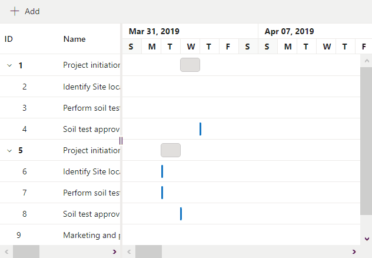

# Taskbar editing in Blazor Gantt Chart Component

Modify the task details through user interaction, such as resizing and dragging the taskbar, by enabling the [GanttEditSettings.AllowTaskbarEditing](https://help.syncfusion.com/cr/blazor/Syncfusion.Blazor.Gantt.GanttEditSettings.html#Syncfusion_Blazor_Gantt_GanttEditSettings_AllowTaskbarEditing) property. When you begin taskbar editing by clicking on a taskbar, a virtual taskbar appears over it. This virtual taskbar serves as a reference, helping you remember the original position of the task on the timeline before making any changes. With the virtual taskbar as a reference, you can make adjustments to the task, such as changing the duration by resizing the taskbar and dragging the taskbar to the desired position on the timeline to adjust the task's start and end dates.

```cshtml
@using Syncfusion.Blazor.Gantt
<SfGantt DataSource="@TaskCollection" Height="450px" Width="900px">
    <GanttTaskFields Id="TaskId" Name="TaskName" StartDate="StartDate" EndDate="EndDate" Duration="Duration" Progress="Progress" ParentID="ParentId">
    </GanttTaskFields>
    <GanttEditSettings AllowEditing="true" AllowTaskbarEditing="true"></GanttEditSettings>
</SfGantt>

@code{
    private List<TaskData> TaskCollection { get; set; }
    protected override void OnInitialized()
    {
        this.TaskCollection = GetTaskCollection();
    }

    public class TaskData
    {
        public int TaskId { get; set; }
        public string TaskName { get; set; }
        public DateTime StartDate { get; set; }
        public DateTime? EndDate { get; set; }
        public string Duration { get; set; }
        public int Progress { get; set; }
        public int? ParentId { get; set; }
    }

    public static List<TaskData> GetTaskCollection()
    {
        List<TaskData> Tasks = new List<TaskData>() {
            new TaskData() { TaskId = 1, TaskName = "Project initiation", StartDate = new DateTime(2022, 04, 02), EndDate = new DateTime(2022, 04, 21), },
            new TaskData() { TaskId = 2, TaskName = "Identify Site location", StartDate = new DateTime(2022, 04, 02), Duration = "0", Progress = 30, ParentId = 1 },
            new TaskData() { TaskId = 3, TaskName = "Perform soil test", StartDate = new DateTime(2022, 04, 02), Duration = "4", Progress = 40, ParentId = 1 },
            new TaskData() { TaskId = 4, TaskName = "Soil test approval", StartDate = new DateTime(2022, 04, 02), Duration = "0", Progress = 30, ParentId = 1 },
            new TaskData() { TaskId = 5, TaskName = "Project estimation", StartDate = new DateTime(2022, 04, 02), EndDate = new DateTime(2022, 04, 21), },
            new TaskData() { TaskId = 6, TaskName = "Develop floor plan for estimation", StartDate = new DateTime(2022, 04, 04), Duration = "3", Progress = 30, ParentId = 5 },
            new TaskData() { TaskId = 7, TaskName = "List materials", StartDate = new DateTime(2022, 04, 04), Duration = "3", Progress = 40, ParentId = 5 },
            new TaskData() { TaskId = 8, TaskName = "Estimation approval", StartDate = new DateTime(2022, 04, 04), Duration = "0", Progress = 30, ParentId = 5 }
        };
        return Tasks;
    }
}
```

## Creating taskbar on draw action

A taskbar can be drawn in an empty row by drag and drop interaction. This can be achieved by enabling the [GanttEditSettings.AllowSchedulingOnDrag](https://help.syncfusion.com/cr/blazor/Syncfusion.Blazor.Gantt.GanttEditSettings.html#Syncfusion_Blazor_Gantt_GanttEditSettings_AllowSchedulingOnDrag) and [GanttEditSettings.AllowTaskbarEditing](https://help.syncfusion.com/cr/blazor/Syncfusion.Blazor.Gantt.GanttEditSettings.html#Syncfusion_Blazor_Gantt_GanttEditSettings_AllowTaskbarEditing) property.
A taskbar can be drawn only when [AllowUnscheduledTasks](https://help.syncfusion.com/cr/blazor/Syncfusion.Blazor.Gantt.SfGantt-1.html#Syncfusion_Blazor_Gantt_SfGantt_1_AllowUnscheduledTasks) property is set to true and when a task has no start and end date.

```cshtml
@using Syncfusion.Blazor.Gantt
<SfGantt DataSource="@TaskCollection" Height="100%" Width="100%" AllowUnscheduledTasks="true">
    <GanttTaskFields Id="TaskId" Name="TaskName" StartDate="StartDate" EndDate="EndDate" Duration="Duration" Progress="Progress" ParentID="ParentId">
    </GanttTaskFields>
    <GanttEditSettings AllowTaskbarEditing="true" AllowSchedulingOnDrag="true"></GanttEditSettings>
</SfGantt>

@code {
    public SfGantt<TaskData> Gantt;
    public List<TaskData> TaskCollection { get; set; }
    protected override void OnInitialized()
    {
        this.TaskCollection = GetTaskCollection();
    }
    public class TaskData
    {
        public int TaskId { get; set; }
        public string TaskName { get; set; }
        public DateTime? StartDate { get; set; }
        public DateTime? EndDate { get; set; }
        public string Duration { get; set; }
        public int Progress { get; set; }
        public int? ParentId { get; set; }
    }
    public static List<TaskData> GetTaskCollection()
    {
        List<TaskData> Tasks = new List<TaskData>() {
            new TaskData() { TaskId = 1, TaskName = "Project initiation", StartDate = new DateTime(2019, 04, 02) },
            new TaskData() { TaskId = 2, TaskName = "Identify Site location", Progress = 30, ParentId = 1 },
            new TaskData() { TaskId = 3, TaskName = "Perform soil test", Progress = 40, ParentId = 1 },
            new TaskData() { TaskId = 4, TaskName = "Soil test approval", EndDate =new DateTime(2019, 04, 03), Progress = 30, ParentId = 1 },
            new TaskData() { TaskId = 5, TaskName = "Project initiation", StartDate = new DateTime(2019, 04, 04) },
            new TaskData() { TaskId = 6, TaskName = "Identify Site location", StartDate = new DateTime(2019, 04, 02), Progress = 30, ParentId = 5 },
            new TaskData() { TaskId = 7, TaskName = "Perform soil test", StartDate = new DateTime(2019, 04, 02), Progress = 40, ParentId = 5 },
            new TaskData() { TaskId = 8, TaskName = "Soil test approval", EndDate = new DateTime(2019, 04, 02), Progress = 30, ParentId = 5 },
            new TaskData() { TaskId=9, TaskName="Marketing and presales", StartDate=new DateTime(2019,06,26), EndDate=new DateTime(2019,07,01) },
            new TaskData() { TaskId = 10, TaskName = "Important improvement", StartDate = new DateTime(2019, 06, 14), EndDate = new DateTime(2019, 06, 19) }
        };
        return Tasks;
    }
}
```


## Prevent editing for specific tasks

On the taskbar edit action, the [TaskbarEditing](https://help.syncfusion.com/cr/blazor/Syncfusion.Blazor.Gantt.GanttEvents-1.html#Syncfusion_Blazor_Gantt_GanttEvents_1_TaskbarEditing) event will be triggered. You can prevent the taskbar from editing using the `TaskbarEditing` event. This can be done by setting the [Cancel](https://help.syncfusion.com/cr/blazor/Syncfusion.Blazor.Gantt.TaskbarEditingEventArgs-1.html#Syncfusion_Blazor_Gantt_TaskbarEditingEventArgs_1_Cancel) property of the taskbarEditing event argument to true.

For more information, refer to the following:
```cshtml
@using Syncfusion.Blazor.Gantt

<SfGantt DataSource="@TaskCollection" Height="350px" Width="700px">
    <GanttTaskFields Id="TaskId" Name="TaskName" StartDate="StartDate" EndDate="EndDate" Duration="Duration" Progress="Progress" ParentID="ParentId" Dependency="Predecessor">
    </GanttTaskFields>
    <GanttEditSettings AllowTaskbarEditing="true"></GanttEditSettings>
    <GanttEvents TaskbarEditing="TaskbarBeginEditHandler" TValue="TaskData"></GanttEvents>
</SfGantt>

@code{
    private void TaskbarBeginEditHandler(TaskbarEditingEventArgs<TaskData> args)
    {
        if(args.Data.TaskId == 3)
            args.Cancel = true;
    }

    private List<TaskData> TaskCollection { get; set; }
    protected override void OnInitialized()
    {
        this.TaskCollection = GetTaskCollection();
    }

    public class TaskData
    {
        public int TaskId { get; set; }
        public string TaskName { get; set; }
        public DateTime StartDate { get; set; }
        public DateTime EndDate { get; set; }
        public string Duration { get; set; }
        public int Progress { get; set; }
        public string Predecessor { get; set; }
        public int? ParentId { get; set; }
    }

    public static List<TaskData> GetTaskCollection()
    {
        List<TaskData> Tasks = new List<TaskData>()
        {
            new TaskData() { TaskId = 1, TaskName = "Project initiation", StartDate = new DateTime(2019, 04, 05), EndDate = new DateTime(2019, 04, 21), },
            new TaskData() { TaskId = 2, TaskName = "Identify Site location", StartDate = new DateTime(2019, 04, 05), Duration = "0", Progress = 30, ParentId = 1 },
            new TaskData() { TaskId = 3, TaskName = "Perform soil test", StartDate = new DateTime(2019, 04, 05), Duration = "4", Progress = 40, Predecessor = "2", ParentId = 1 },
            new TaskData() { TaskId = 4, TaskName = "Soil test approval", StartDate = new DateTime(2019, 04, 05), Duration = "0", Progress = 30, Predecessor = "3", ParentId = 1 },
            new TaskData() { TaskId = 5, TaskName = "Project estimation", StartDate = new DateTime(2019, 04, 06), EndDate = new DateTime(2019, 04, 21), Predecessor = "1FS", },
            new TaskData() { TaskId = 6, TaskName = "Develop floor plan for estimation", StartDate = new DateTime(2019, 04, 06), Duration = "3", Progress = 30, Predecessor = "4" , ParentId = 5 },
            new TaskData() { TaskId = 7, TaskName = "List materials", StartDate = new DateTime(2019, 04, 06), Duration = "3", Progress = 40, Predecessor = "6" , ParentId = 5 },
            new TaskData() { TaskId = 8, TaskName = "Estimation approval", StartDate = new DateTime(2019, 04, 06), Duration = "0", Progress = 30, Predecessor = "7" , ParentId = 5 },
        };
        return Tasks;
    }
}
```