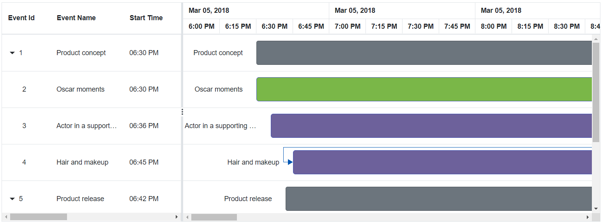
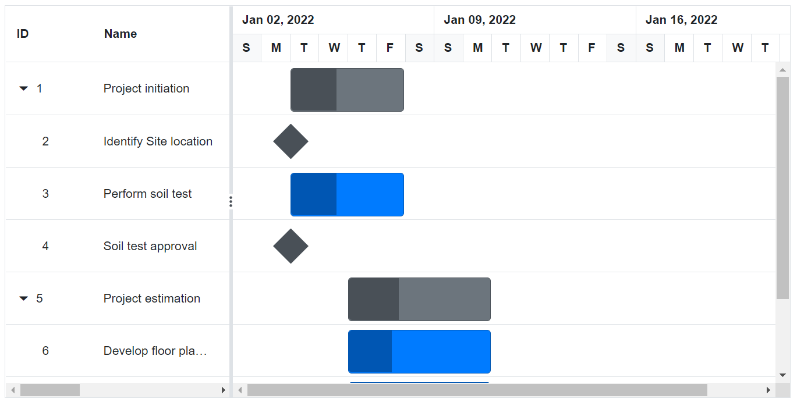
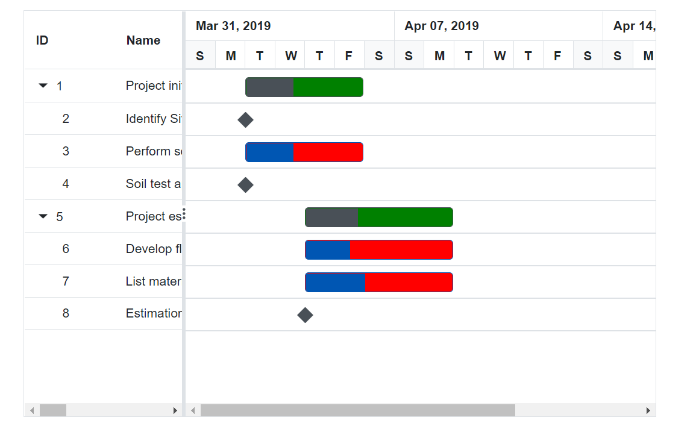
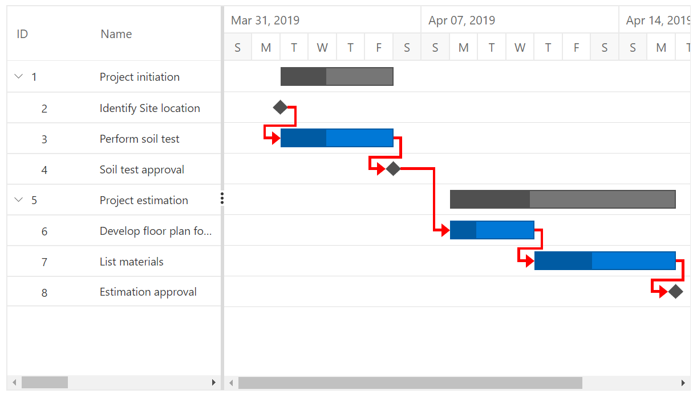
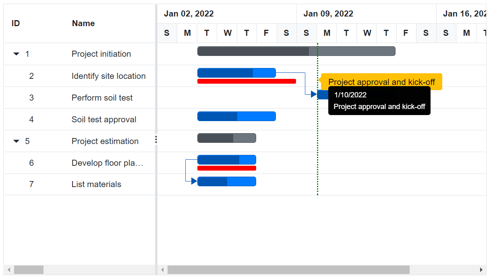
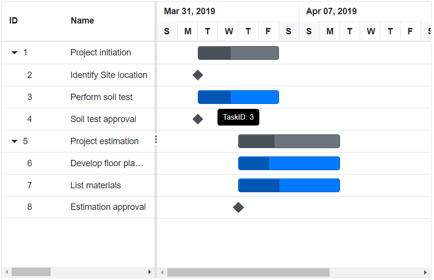
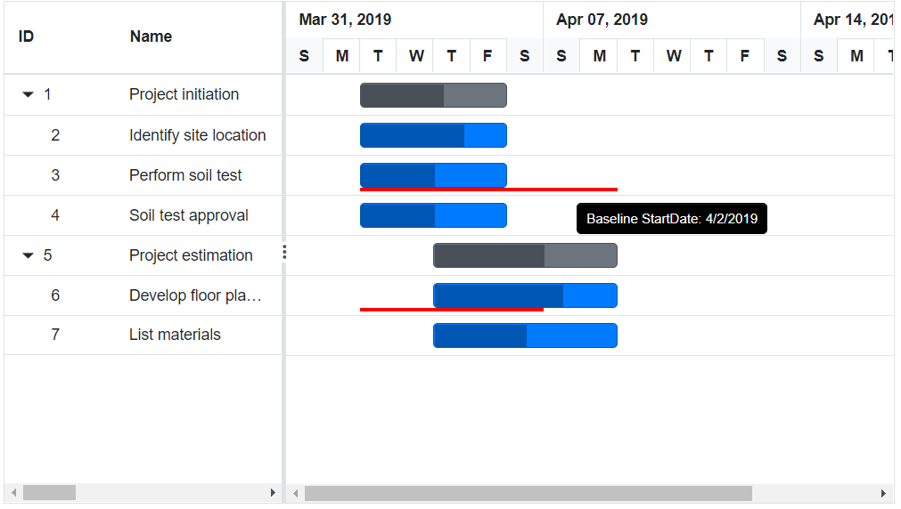
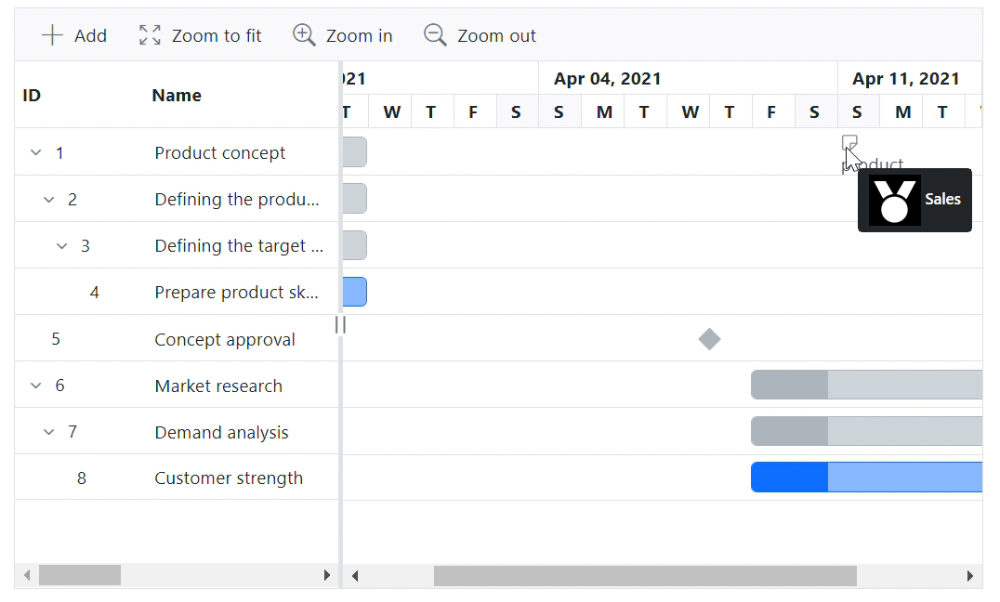

# Taskbar in Blazor Gantt Chart Component

## Taskbar template

You can design your taskbars to view the tasks in Gantt Chart Chart by using `GanttTemplates.TaskbarTemplate` property. It is also possible to customize the parent taskbars and milestones with custom templates by using `GanttTemplates.ParentTaskbarTemplate` and `GanttTemplates.MilestoneTemplate` properties.

```cshtml
@using Syncfusion.Blazor.Gantt
<SfGantt RowHeight="75" TaskbarHeight="50"
         ProjectStartDate="@ProjectStart" ProjectEndDate="@ProjectEnd" DurationUnit="DurationUnit.Minute"
         DateFormat="hh:mm tt" DataSource="@TaskCollection" Height="450px" Width="800px">
    <GanttTaskFields Id="TaskId" Name="TaskName" StartDate="StartDate" EndDate="EndDate" Duration="Duration" Dependency="Predecessor" ParentID="ParentId"></GanttTaskFields>
    <GanttColumns>
        <GanttColumn Field="TaskId" HeaderText="Event Id"></GanttColumn>
        <GanttColumn Field="TaskName" HeaderText="Event Name" Width="150"></GanttColumn>
        <GanttColumn Field="StartDate" HeaderText="Start Time"></GanttColumn>
        <GanttColumn Field="EndDate" HeaderText="End Time"></GanttColumn>
        <GanttColumn Field="Winner" HeaderText="Winner"></GanttColumn>
        <GanttColumn Field="Movie" HeaderText="Movie"></GanttColumn>
        <GanttColumn Field="Performance" HeaderText=" Performance" Width="200"></GanttColumn>
    </GanttColumns>
    <GanttLabelSettings LeftLabel="TaskName" TValue="TaskbarTemplateData.TaskbarData">
    </GanttLabelSettings>
    <GanttSplitterSettings Position="30%"> </GanttSplitterSettings>
    <GanttTemplates TValue="TaskbarTemplateData.TaskbarData">
        <TaskbarTemplate>
            @if ((context as TaskbarTemplateData.TaskbarData).TaskName == "Oscar moments")
            {
                <div class="e-gantt-child-taskbar e-custom-moments" style="height:50px;border-radius:5px;">
                    @if (Convert.ToDouble((context as TaskbarTemplateData.TaskbarData).Duration) < 4)
                    {
                        
                    }
                </div>
            }
            else if ((context as TaskbarTemplateData.TaskbarData).TaskName == "Oscar performance")
            {
                <div class="e-gantt-child-taskbar e-custom-performance" style="height:50px;border-radius:5px;">
                    @if (Convert.ToDouble((context as TaskbarTemplateData.TaskbarData).Duration) <= 5)
                    {
                        
                    }
                </div>
            }
            else
            {
                <div class="e-gantt-parent-taskbar e-custom-parent" style="height:50px;border-radius:5px;text-overflow:ellipsis;">
                    @if (Convert.ToDouble((context as TaskbarTemplateData.TaskbarData).Duration) < 4)
                    {
                        
                    }
                    else
                    {
                        @if (!string.IsNullOrEmpty(((context as TaskbarTemplateData.TaskbarData).Winner)) && !string.IsNullOrEmpty(((context as TaskbarTemplateData.TaskbarData).Movie)))
                        {
                            
                            <span class="e-task-label" style="position:absolute; top:13px;font-size:14px;">@((context as TaskbarTemplateData.TaskbarData).Winner)</span>
                            <span class="e-task-label" style="position:absolute;top:33px;font-size:10px;text-overflow:ellipsis;">@((context as TaskbarTemplateData.TaskbarData).Movie)</span>
                        }
                        else if (!string.IsNullOrEmpty(((context as TaskbarTemplateData.TaskbarData).Movie)))
                        {
                            
                            <span class="e-task-label" style="position:absolute; top:18px;font-size:12px;text-overflow:ellipsis;">@((context as TaskbarTemplateData.TaskbarData).Movie)</span>
                        }
                        else
                        {
                            <span class="e-task-label"></span>
                        }
                    }
                </div>
            }
        </TaskbarTemplate>
        <MilestoneTemplate>
            <div style="margin-top:0px;">
                <div style="position:absolute;left: 9px;top:-25px">
                    
                    <div class="e-gantt-milestone" style="width:41px;height:41px;transform: rotate(45deg);left: 8px;background-color: #7ab748 !important;border-color: #0d6efd !important"></div>
                </div>
            </div>
        </MilestoneTemplate>
    </GanttTemplates>
    <GanttTimelineSettings TimelineUnitSize="75">
        <GanttTopTierSettings Unit="TimelineViewMode.Hour" Format="MMM dd, yyyy"></GanttTopTierSettings>
        <GanttBottomTierSettings Unit="TimelineViewMode.Minutes" Count="15" Format="h:mm tt"></GanttBottomTierSettings>
    </GanttTimelineSettings>
    <GanttDayWorkingTimeCollection>
        <GanttDayWorkingTime From="0" To="24"></GanttDayWorkingTime>
    </GanttDayWorkingTimeCollection>
</SfGantt>

@code{
    public DateTime ProjectStart = new DateTime(2022, 3, 7, 18, 0, 0);
    public DateTime ProjectEnd = new DateTime(2022, 3, 11, 18, 0, 0);
    public List<TaskbarTemplateData.TaskbarData> TaskCollection { get; set; }
    protected override void OnInitialized()
    {
        this.TaskCollection = TaskbarTemplateData.TaskTemplateData();
    }
    public class TaskbarTemplateData
    {
        public class TaskData
        {
            public int TaskId { get; set; }
            public string TaskName { get; set; }
            public DateTime StartDate { get; set; }
            public DateTime EndDate { get; set; }
            public string Duration { get; set; }
            public int Progress { get; set; }
            public string Predecessor { get; set; }
            public int? ParentId { get; set; }
        }
        public class TaskProperties
        {
            public string TaskName { get; set; }
            public double Duration { get; set; }
        }
        public class TaskbarData : TaskData
        {
            public string Performance { get; set; }
            public string Winner { get; set; }
            public string Movie { get; set; }
        }
        public static List<TaskbarData> TaskTemplateData()
        {
            List<TaskbarData> TaskDataCollection = new List<TaskbarData>()
            {
                new TaskbarData(){ TaskId = 1, TaskName = "Oscar Moments", StartDate = new DateTime(2022, 03, 07, 18, 0, 0), EndDate = new DateTime(2022, 03, 08, 18, 15, 0), Winner = "", Performance = "90th Academy awards kicks-off and Jimmy Kimmel hosts the show" },
                new TaskbarData(){ TaskId = 2, TaskName = "Actor in Supporting Role", StartDate = new DateTime(2022, 03, 07, 18, 30, 0), EndDate = new DateTime(2022, 03, 07, 19, 20, 0), Winner = "Sam Rockwell", Movie = "Three Billboards Outside Ebbing, Missouri", ParentId = 1, },
                new TaskbarData(){ TaskId = 3, TaskName = "Hair and Makeup", StartDate = new DateTime(2022, 03, 07, 18, 36, 0), EndDate = new DateTime(2022, 03, 07, 19, 42, 0), Movie = "Darkest Hour", ParentId = 1, },
                new TaskbarData() { TaskId = 4, TaskName = "Costume Design", StartDate = new DateTime(2022, 03, 07, 18, 36, 0), EndDate = new DateTime(2022, 03, 07, 19, 50, 0), Winner = "Mark Bridges", Movie = "Phantom Thread", ParentId = 1, }
            };
            return TaskDataCollection;
        }
    }
}
<style>
    .e-custom-parent {
        background-color: #6d619b;
        border: 1px solid #3f51b5;
    }
    .e-custom-performance {
        background-color: #ad7a66;
        border: 1px solid #3f51b5;
    }

    .e-custom-moments {
        background-color: #7ab748;
        border: 1px solid #3f51b5;
    }

    .moments, .face-mask, .oscar {
        position: relative;
        top: 9px;
        bottom: 2px;
        left: 5px;
        padding-right: 4px;
    }

    .oscar {
        content: url('data:image/svg+xml;base64,PD94bWwgdmVyc2lvbj0iMS4wIiBlbmNvZGluZz0idXRmLTgiPz4KPCEtLSBHZW5lcmF0b3I6IEFkb2JlIElsbHVzdHJhdG9yIDIyLjEuMCwgU1ZHIEV4cG9ydCBQbHVnLUluIC4gU1ZHIFZlcnNpb246IDYuMDAgQnVpbGQgMCkgIC0tPgo8c3ZnIHZlcnNpb249IjEuMSIgaWQ9IkxheWVyXzEiIHhtbG5zPSJodHRwOi8vd3d3LnczLm9yZy8yMDAwL3N2ZyIgeG1sbnM6eGxpbms9Imh0dHA6Ly93d3cudzMub3JnLzE5OTkveGxpbmsiIHg9IjBweCIgeT0iMHB4IgoJIHZpZXdCb3g9IjAgMCAzMiAzMiIgc3R5bGU9ImVuYWJsZS1iYWNrZ3JvdW5kOm5ldyAwIDAgMzIgMzI7IiB4bWw6c3BhY2U9InByZXNlcnZlIj4KPHN0eWxlIHR5cGU9InRleHQvY3NzIj4KCS5zdDB7ZmlsbDojRkZGRkZGO3N0cm9rZTojMDAwMDAwO3N0cm9rZS1taXRlcmxpbWl0OjEwO30KCS5zdDF7c3Ryb2tlOiMwMDAwMDA7c3Ryb2tlLW1pdGVybGltaXQ6MTA7fQoJLnN0MntmaWxsOiNGRkZGRkY7fQoJLnN0M3tmaWxsOm5vbmU7c3Ryb2tlOiMwMDAwMDA7c3Ryb2tlLW1pdGVybGltaXQ6MTA7fQoJLnN0NHtmaWxsOm5vbmU7c3Ryb2tlOiMwMDAwMDA7c3Ryb2tlLWxpbmVjYXA6cm91bmQ7c3Ryb2tlLWxpbmVqb2luOnJvdW5kO3N0cm9rZS1taXRlcmxpbWl0OjEwO30KCS5zdDV7ZmlsbDpub25lO3N0cm9rZTojMDAwMDAwO3N0cm9rZS1saW5lam9pbjpyb3VuZDtzdHJva2UtbWl0ZXJsaW1pdDoxMDt9Cgkuc3Q2e2ZpbGw6bm9uZTtzdHJva2U6IzAwMDAwMDtzdHJva2Utd2lkdGg6MjtzdHJva2UtbWl0ZXJsaW1pdDoxMDt9Cgkuc3Q3e3N0cm9rZTojRkZGRkZGO3N0cm9rZS1taXRlcmxpbWl0OjEwO30KCS5zdDh7ZmlsbDojRkZGRkZGO3N0cm9rZTojMDAwMDAwO3N0cm9rZS1saW5lam9pbjpyb3VuZDtzdHJva2UtbWl0ZXJsaW1pdDoxMDt9Cgkuc3Q5e3N0cm9rZTojMDAwMDAwO3N0cm9rZS1saW5lam9pbjpyb3VuZDtzdHJva2UtbWl0ZXJsaW1pdDoxMDt9Cgkuc3QxMHtmaWxsOm5vbmU7c3Ryb2tlOiMwMDAwMDA7c3Ryb2tlLXdpZHRoOjI7c3Ryb2tlLWxpbmVjYXA6cm91bmQ7c3Ryb2tlLWxpbmVqb2luOnJvdW5kO3N0cm9rZS1taXRlcmxpbWl0OjEwO30KCS5zdDExe2ZpbGw6bm9uZTtzdHJva2U6IzAwMDAwMDtzdHJva2Utd2lkdGg6MjtzdHJva2UtbGluZWNhcDpyb3VuZDtzdHJva2UtbWl0ZXJsaW1pdDoxMDt9Cgkuc3QxMntmaWxsOm5vbmU7c3Ryb2tlOiMwMDAwMDA7c3Ryb2tlLXdpZHRoOjM7c3Ryb2tlLWxpbmVjYXA6cm91bmQ7c3Ryb2tlLWxpbmVqb2luOnJvdW5kO3N0cm9rZS1taXRlcmxpbWl0OjEwO30KCS5zdDEze2ZpbGw6bm9uZTtzdHJva2U6I0RERERERDtzdHJva2UtbWl0ZXJsaW1pdDoxMDt9CgljaXJjbGUscGF0aHtmaWxsOiNGRkY7fQo8L3N0eWxlPgo8Zz4KCTxjaXJjbGUgY3g9IjE1LjciIGN5PSIyMS45IiByPSI4LjEiLz4KCTxwYXRoIGQ9Ik0yMywxNS40TDI5LDRoLTcuNGwtNC43LDguMkMxOS4zLDEyLjUsMjEuNCwxMy42LDIzLDE1LjR6Ii8+Cgk8cGF0aCBkPSJNMTQuOSwxMi4yTDEwLjIsNEgzbDUuNywxMS4xQzEwLjMsMTMuNSwxMi41LDEyLjQsMTQuOSwxMi4yeiIvPgo8L2c+Cjwvc3ZnPgo=');
    }

    .face-mask {
        content: url('data:image/svg+xml;base64,PD94bWwgdmVyc2lvbj0iMS4wIiBlbmNvZGluZz0idXRmLTgiPz4KPCEtLSBHZW5lcmF0b3I6IEFkb2JlIElsbHVzdHJhdG9yIDIyLjEuMCwgU1ZHIEV4cG9ydCBQbHVnLUluIC4gU1ZHIFZlcnNpb246IDYuMDAgQnVpbGQgMCkgIC0tPgo8c3ZnIHZlcnNpb249IjEuMSIgaWQ9IkxheWVyXzEiIHhtbG5zPSJodHRwOi8vd3d3LnczLm9yZy8yMDAwL3N2ZyIgeG1sbnM6eGxpbms9Imh0dHA6Ly93d3cudzMub3JnLzE5OTkveGxpbmsiIHg9IjBweCIgeT0iMHB4IgoJIHZpZXdCb3g9IjAgMCAzMiAzMiIgc3R5bGU9ImVuYWJsZS1iYWNrZ3JvdW5kOm5ldyAwIDAgMzIgMzI7IiB4bWw6c3BhY2U9InByZXNlcnZlIj4KPHN0eWxlPgoJcGF0aHtmaWxsOiNGRkY7fQo8L3N0eWxlPgo8Zz4KCTxwYXRoIGQ9Ik0yNy40LDE0LjlsLTYuNS0yLjhjLTAuNy0wLjMtMS40LTAuMy0yLjEsMGMtMC41LDAuMy0wLjksMC42LTEuMiwxLjFjLTAuMS0xLTAuMy0xLjktMC44LTIuOGwtMi40LTQuOQoJCWMtMC42LTEuMy0yLjItMS44LTMuNS0xLjJsLTYuNCwzQzMuOSw3LjYsMy40LDguMiwzLjEsOC45Yy0wLjIsMC43LTAuMiwxLjMsMC4xLDJsMi40LDQuOWMxLjMsMi43LDQuMSw0LjQsNy4xLDQuNAoJCWMwLjYsMCwxLjEtMC4xLDEuNy0wLjJoMC4xbDAuMS0wLjFjMC4xLTAuMSwwLjItMC4yLDAuMy0wLjNjLTAuOCwzLDAuNCw2LjMsMyw4LjNMMTgsMjhoMC4xYzAuNCwwLDAuOSwwLDEuMywwCgkJYzMuMSwwLDYtMS44LDcuMi00LjdsMi4xLTVDMjkuNCwxNywyOC43LDE1LjUsMjcuNCwxNC45eiBNMTEuNSw4LjFjMC43LTAuMywxLjMtMC4zLDEuNSwwYzAuMiwwLjMtMC4zLDAuOS0xLDEuMnMtMS4zLDAuMy0xLjUsMAoJCVMxMC44LDguNSwxMS41LDguMXogTTYuMywxMS4zYy0wLjItMC4zLDAuMy0wLjgsMC45LTEuMmMwLjctMC4zLDEuMy0wLjMsMS41LDBjMC4yLDAuMy0wLjIsMC45LTAuOSwxLjIKCQlDNy4xLDExLjcsNi41LDExLjYsNi4zLDExLjN6IE04LjIsMTQuOWMwLDAsNC4xLDAuOCw2LjQtM0MxNC42LDExLjksMTQuNiwxOS41LDguMiwxNC45eiBNMjcuOSwxNy45bC0yLjEsNQoJCWMtMS4yLDIuOC00LjMsNC41LTcuNCw0Yy0yLjUtMi0zLjQtNS4zLTIuMi04LjFsMi4xLTVjMC4yLTAuNCwwLjUtMC43LDAuOS0wLjhjMC40LTAuMiwwLjktMC4yLDEuMywwbDYuNSwyLjgKCQlDMjcuOCwxNi4yLDI4LjIsMTcuMSwyNy45LDE3Ljl6Ii8+Cgk8cGF0aCBkPSJNMjQuOCwxNy44Yy0wLjctMC4zLTEuNC0wLjMtMS41LDAuMWMtMC4xLDAuMywwLjMsMC44LDEsMS4xczEuNCwwLjMsMS41LTAuMUMyNS45LDE4LjUsMjUuNSwxOC4xLDI0LjgsMTcuOHoiLz4KCTxwYXRoIGQ9Ik0xOS45LDE3LjJjMC43LDAuMywxLjQsMC4zLDEuNS0wLjFjMC4xLTAuMy0wLjMtMC44LTEtMS4xYy0wLjctMC4zLTEuNC0wLjMtMS41LDAuMUMxOC44LDE2LjQsMTkuMywxNi45LDE5LjksMTcuMnoiLz4KCTxwYXRoIGQ9Ik0xNy41LDE5LjhjMC43LDcuOCw2LjUsMi44LDYuNSwyLjhDMTkuNiwyMy41LDE3LjUsMTkuOCwxNy41LDE5Ljh6Ii8+CjwvZz4KPC9zdmc+Cg==');
    }

    .moments {
        content: url('data:image/svg+xml;base64,PD94bWwgdmVyc2lvbj0iMS4wIiBlbmNvZGluZz0idXRmLTgiPz4KPCEtLSBHZW5lcmF0b3I6IEFkb2JlIElsbHVzdHJhdG9yIDIyLjEuMCwgU1ZHIEV4cG9ydCBQbHVnLUluIC4gU1ZHIFZlcnNpb246IDYuMDAgQnVpbGQgMCkgIC0tPgo8c3ZnIHZlcnNpb249IjEuMSIgaWQ9IkxheWVyXzEiIHhtbG5zPSJodHRwOi8vd3d3LnczLm9yZy8yMDAwL3N2ZyIgeG1sbnM6eGxpbms9Imh0dHA6Ly93d3cudzMub3JnLzE5OTkveGxpbmsiIHg9IjBweCIgeT0iMHB4IgoJIHZpZXdCb3g9IjAgMCAzMiAzMiIgc3R5bGU9ImVuYWJsZS1iYWNrZ3JvdW5kOm5ldyAwIDAgMzIgMzI7IiB4bWw6c3BhY2U9InByZXNlcnZlIj4KPHN0eWxlIHR5cGU9InRleHQvY3NzIj4KCS5zdDB7ZmlsbDojRkZGRkZGO3N0cm9rZTojMDAwMDAwO3N0cm9rZS1taXRlcmxpbWl0OjEwO30KCS5zdDF7c3Ryb2tlOiMwMDAwMDA7c3Ryb2tlLW1pdGVybGltaXQ6MTA7fQoJLnN0MntmaWxsOiNGRkZGRkY7fQoJLnN0M3tmaWxsOm5vbmU7c3Ryb2tlOiMwMDAwMDA7c3Ryb2tlLW1pdGVybGltaXQ6MTA7fQoJLnN0NHtmaWxsOm5vbmU7c3Ryb2tlOiMwMDAwMDA7c3Ryb2tlLWxpbmVjYXA6cm91bmQ7c3Ryb2tlLWxpbmVqb2luOnJvdW5kO3N0cm9rZS1taXRlcmxpbWl0OjEwO30KCS5zdDV7ZmlsbDpub25lO3N0cm9rZTojMDAwMDAwO3N0cm9rZS1saW5lam9pbjpyb3VuZDtzdHJva2UtbWl0ZXJsaW1pdDoxMDt9Cgkuc3Q2e2ZpbGw6bm9uZTtzdHJva2U6IzAwMDAwMDtzdHJva2Utd2lkdGg6MjtzdHJva2UtbWl0ZXJsaW1pdDoxMDt9Cgkuc3Q3e3N0cm9rZTojRkZGRkZGO3N0cm9rZS1taXRlcmxpbWl0OjEwO30KCS5zdDh7ZmlsbDojRkZGRkZGO3N0cm9rZTojMDAwMDAwO3N0cm9rZS1saW5lam9pbjpyb3VuZDtzdHJva2UtbWl0ZXJsaW1pdDoxMDt9Cgkuc3Q5e3N0cm9rZTojMDAwMDAwO3N0cm9rZS1saW5lam9pbjpyb3VuZDtzdHJva2UtbWl0ZXJsaW1pdDoxMDt9Cgkuc3QxMHtmaWxsOm5vbmU7c3Ryb2tlOiMwMDAwMDA7c3Ryb2tlLXdpZHRoOjI7c3Ryb2tlLWxpbmVjYXA6cm91bmQ7c3Ryb2tlLWxpbmVqb2luOnJvdW5kO3N0cm9rZS1taXRlcmxpbWl0OjEwO30KCS5zdDExe2ZpbGw6bm9uZTtzdHJva2U6IzAwMDAwMDtzdHJva2Utd2lkdGg6MjtzdHJva2UtbGluZWNhcDpyb3VuZDtzdHJva2UtbWl0ZXJsaW1pdDoxMDt9Cgkuc3QxMntmaWxsOm5vbmU7c3Ryb2tlOiMwMDAwMDA7c3Ryb2tlLXdpZHRoOjM7c3Ryb2tlLWxpbmVjYXA6cm91bmQ7c3Ryb2tlLWxpbmVqb2luOnJvdW5kO3N0cm9rZS1taXRlcmxpbWl0OjEwO30KCS5zdDEze2ZpbGw6bm9uZTtzdHJva2U6I0RERERERDtzdHJva2UtbWl0ZXJsaW1pdDoxMDt9CglwYXRoLGVsbGlwc2V7ZmlsbDojRkZGO30KPC9zdHlsZT4KPGc+Cgk8cGF0aCBkPSJNMzAuMSw2LjNjMC44LTAuNSwxLjEtMS41LDAuNy0yLjRzLTEuNS0xLjItMi4zLTAuN3MtMS4xLDEuNS0wLjcsMi40QzI4LjIsNi40LDI5LjMsNi43LDMwLjEsNi4zeiIvPgoJPHBhdGggZD0iTTMwLjMsNi45Yy0wLjcsMC40LTEuNiwwLjMtMi4zLTAuMkwyOC4yLDljLTAuMiwwLTAuNSwwLjEtMC43LDAuM2wtNS41LDQuM2wtNC4zLTIuOGMtMC4yLTAuMy0wLjUtMC42LTAuOS0wLjhMMTQsOWwtMyw2CgkJTDgsOWwtMi45LDEuMWMtMC4yLDAuMS0wLjQsMC4yLTAuNSwwLjNjLTAuMiwwLjEtMC40LDAuMy0wLjUsMC41bC0zLjYsNi40Yy0wLjIsMC4zLTAuMiwwLjctMC4yLDFsMS43LDguNEMyLjIsMjcuNSwyLjksMjgsMy42LDI4CgkJYzAuMSwwLDAuMiwwLDAuMywwYzAuMiwwLDAuMy0wLjEsMC41LTAuMkw0LDMwaDE0bC0xLjgtMTAuOWwxLjItNC45bDQsMi42YzAuMiwwLjIsMC41LDAuMiwwLjgsMC4yYzAuMywwLDAuNy0wLjEsMC45LTAuM2w1LjUtNC40CgkJYzAsMC4zLTAuMSwwLjYtMC4yLDAuOGMtMC4zLDAuNy0wLjYsMC42LTEuMiwwLjVjLTAuMSwwLTAuMSwwLTAuMiwwbDAsMC4zYzAuMSwwLDAuMiwwLDAuMiwwYzAuMywwLjEsMC43LDAuMSwxLDAKCQljMC4yLTAuMSwwLjQtMC4zLDAuNS0wLjdjMC4xLTAuMywwLjItMC43LDAuMi0xLjFjMC4xLDAsMC4zLTAuMSwwLjMtMC4zbDAsMGwwLjItMC4yYzAuNi0wLjUsMC43LTEuNCwwLjMtMmwwLjctMi44CgkJQzMwLjQsNi45LDMwLjMsNi45LDMwLjMsNi45eiBNNC44LDI1bC0xLjQtNi43bDEuNS0yLjdMNS44LDE5TDQuOCwyNXoiLz4KCTxlbGxpcHNlIGN4PSIxMSIgY3k9IjUiIHJ4PSIzLjUiIHJ5PSI0Ii8+CjwvZz4KPC9zdmc+Cg==');
    }
</style>
```




## Taskbar customization

### Taskbar height

Height of child taskbars and parent taskbars can be customized by using [TaskbarHeight](https://help.syncfusion.com/cr/blazor/Syncfusion.Blazor.Gantt.SfGantt-1.html#Syncfusion_Blazor_Gantt_SfGantt_1_TaskbarHeight) property. The following code example shows how to use the property.

```cshtml
@using Syncfusion.Blazor.Gantt

<SfGantt DataSource="@TaskCollection" Height="450px" Width="900px" RowHeight=60 TaskbarHeight=50>
    <GanttTaskFields Id="TaskId" Name="TaskName" StartDate="StartDate" EndDate="EndDate"
                     Duration="Duration" Progress="Progress" ParentID="ParentId">
    </GanttTaskFields>
</SfGantt>

@code{
    private List<TaskData> TaskCollection { get; set; }
    protected override void OnInitialized()
    {
        this.TaskCollection = GetTaskCollection();
    }
    public class TaskData
    {
        public int TaskId { get; set; }
        public string TaskName { get; set; }
        public DateTime StartDate { get; set; }
        public DateTime EndDate { get; set; }
        public string Duration { get; set; }
        public int Progress { get; set; }
        public int? ParentId { get; set; }
    }

    private static List<TaskData> GetTaskCollection()
    {
        List<TaskData> Tasks = new List<TaskData>()
        {
            new TaskData() { TaskId = 1, TaskName = "Project initiation", StartDate = new DateTime(2022, 01, 04), EndDate = new DateTime(2022, 01, 17), },
            new TaskData() { TaskId = 2, TaskName = "Identify Site location", StartDate = new DateTime(2022, 01, 04), Duration = "0", Progress = 30, ParentId = 1, },
            new TaskData() { TaskId = 3, TaskName = "Perform soil test", StartDate = new DateTime(2022, 01, 04), Duration = "4", Progress = 40, ParentId = 1, },
            new TaskData() { TaskId = 4, TaskName = "Soil test approval", StartDate = new DateTime(2022, 01, 04), Duration = "0", Progress = 30, ParentId = 1, },
            new TaskData() { TaskId = 5, TaskName = "Project estimation", StartDate = new DateTime(2022, 01, 04), EndDate = new DateTime(2022, 01, 17), },
            new TaskData() { TaskId = 6, TaskName = "Develop floor plan for estimation", StartDate = new DateTime(2022, 01, 06), Duration = "3", Progress = 30, ParentId = 5, },
            new TaskData() { TaskId = 7, TaskName = "List materials", StartDate = new DateTime(2022, 01, 06), Duration = "3", Progress = 40, ParentId = 5, },
            new TaskData() { TaskId = 8, TaskName = "Estimation approval", StartDate = new DateTime(2022, 01, 06), Duration = "0", Progress = 30, ParentId = 5, }
        };
        return Tasks;
    }
}
```



N> The `TaskbarHeight` property accepts only pixel value.

### Taskbar background

In the Gantt Chart component, the appearance can be customized based on the Hierarchy using the `GetHierarchicalData` method with the custom styles. So, the method `GetHierarchicalData` helps the user to do the customization and access the internal properties of Gantt. The following code example shows how to customize Gantt Chart Rows using Gantt properties as `level` and `hasChildRecords` from `GetHierarchicalData` method in [QueryChartRowInfo](https://help.syncfusion.com/cr/blazor/Syncfusion.Blazor.Gantt.GanttEvents-1.html#Syncfusion_Blazor_Gantt_GanttEvents_1_QueryChartRowInfo) event of Gantt.

```cshtml
@using Syncfusion.Blazor.Gantt
<SfGantt @ref="Gantt" DataSource="@TaskCollection" Height="450px" Width="700px">
    <GanttTaskFields Id="TaskId" Name="TaskName" StartDate="StartDate" EndDate="EndDate" Duration="Duration" Progress="Progress" ParentID="ParentId">
    </GanttTaskFields>
    <GanttEvents TValue="TaskData" QueryChartRowInfo="GanttChartRowInfo"></GanttEvents>
</SfGantt>

@code{
    SfGantt<TaskData> Gantt;
    private List<TaskData> TaskCollection { get; set; }
    protected override void OnInitialized()
    {
        this.TaskCollection = GetTaskCollection();
    }
    private void GanttChartRowInfo(QueryChartRowInfoEventArgs<TaskData> args)
    {
        dynamic data = Gantt.GetHierarchicalData(args.Data.TaskId);
        if (data.level == 0 && data.hasChildRecords == true)
        {
            args.Row.AddClass(new string[] { "customize-parent" });
        }
        else
        {
            args.Row.AddClass(new string[] { "customize-child" });
        }
    }
    public class TaskData
    {
        public int TaskId { get; set; }
        public string TaskName { get; set; }
        public DateTime StartDate { get; set; }
        public DateTime EndDate { get; set; }
        public string Duration { get; set; }
        public int Progress { get; set; }
        public int? ParentId { get; set; }
    }

    private static List<TaskData> GetTaskCollection()
    {
        List<TaskData> Tasks = new List<TaskData>()
{
            new TaskData() { TaskId = 1, TaskName = "Project initiation", StartDate = new DateTime(2022, 01, 04), EndDate = new DateTime(2022, 01, 17), },
            new TaskData() { TaskId = 2, TaskName = "Identify Site location", StartDate = new DateTime(2022, 01, 04), Duration = "0", Progress = 30, ParentId = 1, },
            new TaskData() { TaskId = 3, TaskName = "Perform soil test", StartDate = new DateTime(2022, 01, 04), Duration = "4", Progress = 40, ParentId = 1, },
            new TaskData() { TaskId = 4, TaskName = "Soil test approval", StartDate = new DateTime(2022, 01, 04), Duration = "0", Progress = 30, ParentId = 1, },
            new TaskData() { TaskId = 5, TaskName = "Project estimation", StartDate = new DateTime(2022, 01, 04), EndDate = new DateTime(2022, 01, 17), },
            new TaskData() { TaskId = 6, TaskName = "Develop floor plan for estimation", StartDate = new DateTime(2022, 01, 06), Duration = "3", Progress = 30, ParentId = 5, },
            new TaskData() { TaskId = 7, TaskName = "List materials", StartDate = new DateTime(2022, 01, 06), Duration = "3", Progress = 40, ParentId = 5, },
            new TaskData() { TaskId = 8, TaskName = "Estimation approval", StartDate = new DateTime(2022, 01, 06), Duration = "0", Progress = 30, ParentId = 5, }
        };
        return Tasks;
    }
}

<style>
    .customize-parent .e-gantt-parent-taskbar {
        background-color: green !important;
    }

    .customize-child .e-gantt-child-taskbar {
        background-color: red !important;
    }
</style>
```




## Connector lines

The width and background color of connector lines in Gantt Chart can be customized using the [ConnectorLineWidth](https://help.syncfusion.com/cr/blazor/Syncfusion.Blazor.Gantt.SfGantt-1.html#Syncfusion_Blazor_Gantt_SfGantt_1_ConnectorLineWidth) and [ConnectorLineBackground](https://help.syncfusion.com/cr/blazor/Syncfusion.Blazor.Gantt.SfGantt-1.html#Syncfusion_Blazor_Gantt_SfGantt_1_ConnectorLineBackground) properties. The following code example shows how to use these properties.

```cshtml
@using Syncfusion.Blazor.Gantt

<SfGantt DataSource="@TaskCollection" Height="450px" Width="800px" ConnectorLineWidth="3" ConnectorLineBackground="red">
    <GanttTaskFields Id="TaskId" Name="TaskName" StartDate="StartDate" EndDate="EndDate" Duration="Duration" Progress="Progress" ParentID="ParentId" Dependency="Predecessor">
    </GanttTaskFields>
</SfGantt>

@code{
    private List<TaskData> TaskCollection { get; set; }

    protected override void OnInitialized()
    {
        this.TaskCollection = GetTaskCollection();
    }

    public class TaskData
    {
        public int TaskId { get; set; }
        public string TaskName { get; set; }
        public DateTime StartDate { get; set; }
        public DateTime EndDate { get; set; }
        public string Duration { get; set; }
        public int Progress { get; set; }
        public string Predecessor { get; set; }
        public int? ParentId { get; set; }
    }

    private static List<TaskData> GetTaskCollection()
    {
        List<TaskData> Tasks = new List<TaskData>()
        {
            new TaskData() { TaskId = 1, TaskName = "Project initiation", StartDate = new DateTime(2022, 01, 04), EndDate = new DateTime(2022, 01, 17), },
            new TaskData() { TaskId = 2, TaskName = "Identify Site location", StartDate = new DateTime(2022, 01, 04), Duration = "0", Progress = 30, ParentId = 1, },
            new TaskData() { TaskId = 3, TaskName = "Perform soil test", StartDate = new DateTime(2022, 01, 04), Duration = "4", Progress = 40, ParentId = 1, Predecessor="2", },
            new TaskData() { TaskId = 4, TaskName = "Soil test approval", StartDate = new DateTime(2022, 01, 04), Duration = "0", Progress = 30, ParentId = 1, Predecessor="3", },
            new TaskData() { TaskId = 5, TaskName = "Project estimation", StartDate = new DateTime(2022, 01, 04), EndDate = new DateTime(2022, 01, 17), },
            new TaskData() { TaskId = 6, TaskName = "Develop floor plan for estimation", StartDate = new DateTime(2022, 01, 06), Duration = "3", Progress = 30, ParentId = 5, Predecessor="4", },
            new TaskData() { TaskId = 7, TaskName = "List materials", StartDate = new DateTime(2022, 01, 06), Duration = "3", Progress = 40, ParentId = 5, Predecessor="6", },
            new TaskData() { TaskId = 8, TaskName = "Estimation approval", StartDate = new DateTime(2022, 01, 06), Duration = "0", Progress = 30, ParentId = 5, Predecessor="7", }
        };
        return Tasks;
    }
}
```



## Tooltip

In the Gantt Chart component, you can enable or disable the mouse hover tooltip for the following UI elements using the [GanttTooltipSettings.ShowTooltip](https://help.syncfusion.com/cr/blazor/Syncfusion.Blazor.Gantt.GanttTooltipSettings-1.html#Syncfusion_Blazor_Gantt_GanttTooltipSettings_1_ShowTooltip) property:

* Taskbar
* Connector line
* Baseline
* Event marker

```cshtml
@using Syncfusion.Blazor.Gantt
<SfGantt DataSource="@TaskCollection" RenderBaseline="true" BaselineColor="Red" Height="450px" Width="800px">
    <GanttTaskFields Id="TaskId" Name="TaskName" StartDate="StartDate" EndDate="EndDate" Duration="Duration" Progress="Progress" Dependency="Predecessor" ParentID="ParentId"
                     BaselineStartDate="BaselineStartDate" BaselineEndDate="BaselineEndDate">
    </GanttTaskFields>
    <GanttEventMarkers>
        <GanttEventMarker Day="@Event" Label="Project approval and kick-off"
                          CssClass="e-custom-event-marker"></GanttEventMarker>
    </GanttEventMarkers>
</SfGantt>

@code{
        public DateTime Event = new DateTime(2022, 01, 10);
        private List<TaskData> TaskCollection { get; set; }
        protected override void OnInitialized()
        {
            this.TaskCollection = GetTaskCollection();
        }

        public class TaskData
        {
            public int TaskId { get; set; }
            public string TaskName { get; set; }
            public DateTime StartDate { get; set; }
            public DateTime EndDate { get; set; }
            public string Duration { get; set; }
            public int Progress { get; set; }
            public int? ParentId { get; set; }
            public DateTime? BaselineStartDate { get; set; }
            public DateTime? BaselineEndDate { get; set; }
            public string Predecessor { get; set; }
        }

        private static List<TaskData> GetTaskCollection()
        {
            List<TaskData> Tasks = new List<TaskData>() {
                new TaskData() { TaskId = 1, TaskName = "Project initiation", StartDate = new DateTime(2022, 01, 04), EndDate = new DateTime(2022, 01, 23), },
                new TaskData() { TaskId = 2, TaskName = "Identify site location", StartDate = new DateTime(2022, 01, 04), Duration = "4", BaselineStartDate = new DateTime(2022, 01, 04), BaselineEndDate = new DateTime(2022, 01, 11), Progress = 70, ParentId = 1, },
                new TaskData() { TaskId = 3, TaskName = "Perform soil test", StartDate = new DateTime(2022, 01, 04), Duration = "4", Predecessor = "2FS", Progress = 50, ParentId = 1, },
                new TaskData() { TaskId = 4, TaskName = "Soil test approval", StartDate = new DateTime(2022, 01, 04), Duration = "4", Progress = 50, ParentId = 1, },
                new TaskData() { TaskId = 5, TaskName = "Project estimation", StartDate = new DateTime(2022, 01, 04), EndDate = new DateTime(2022, 01, 23), },
                new TaskData() { TaskId = 6, TaskName = "Develop floor plan for estimation", StartDate = new DateTime(2022, 01, 06), Duration = "3", Progress = 70, BaselineStartDate = new DateTime(2022, 01, 04), BaselineEndDate = new DateTime(2022, 01, 07), ParentId = 5, },
                new TaskData() { TaskId = 7, TaskName = "List materials", StartDate = new DateTime(2022, 01, 04), Duration = "3", Predecessor = "6SS", Progress = 50, ParentId = 5, }
        };
        return Tasks;
    }
}
<style>
    .e-gantt .e-gantt-chart .e-custom-event-marker {
        width: 1px;
        border-left: 2px green dotted;
    }
</style>
```



N> The default value of the `GanttTooltipSettings.ShowTooltip` property is true.

## Tooltip template

### Taskbar tooltip

The default tooltip in the Gantt Chart component can be customized using the [GanttTooltipSettings.TaskbarTemplate](https://help.syncfusion.com/cr/blazor/Syncfusion.Blazor.Gantt.GanttTooltipSettings-1.html#Syncfusion_Blazor_Gantt_GanttTooltipSettings_1_TaskbarTemplate) property. You can map the template script element’s ID value or template string directly to this property.

```cshtml
@using Syncfusion.Blazor.Gantt
<SfGantt DataSource="@TaskCollection" Height="450px" Width="700px">
    <GanttTaskFields Id="TaskId" Name="TaskName" StartDate="StartDate" EndDate="EndDate"
                     Duration="Duration" Progress="Progress" ParentID="ParentId">
    </GanttTaskFields>
    <GanttTooltipSettings ShowTooltip="true" TValue="TaskData">
        <TaskbarTemplate>
            @{
                <div>TaskID: @context.TaskId</div>
            }
        </TaskbarTemplate>
    </GanttTooltipSettings>
</SfGantt>

@code{
    private List<TaskData> TaskCollection { get; set; }
    protected override void OnInitialized()
    {
        this.TaskCollection = GetTaskCollection();
    }

    public class TaskData
    {
        public int TaskId { get; set; }
        public string TaskName { get; set; }
        public DateTime StartDate { get; set; }
        public DateTime EndDate { get; set; }
        public string Duration { get; set; }
        public int Progress { get; set; }
        public int? ParentId { get; set; }
    }

    private static List<TaskData> GetTaskCollection()
    {
        List<TaskData> Tasks = new List<TaskData>()
        {
            new TaskData() { TaskId = 1, TaskName = "Project initiation", StartDate = new DateTime(2022, 01, 04), EndDate = new DateTime(2022, 01, 17), },
            new TaskData() { TaskId = 2, TaskName = "Identify Site location", StartDate = new DateTime(2022, 01, 04), Duration = "0", Progress = 30, ParentId = 1, },
            new TaskData() { TaskId = 3, TaskName = "Perform soil test", StartDate = new DateTime(2022, 01, 04), Duration = "4", Progress = 40, ParentId = 1, },
            new TaskData() { TaskId = 4, TaskName = "Soil test approval", StartDate = new DateTime(2022, 01, 04), Duration = "0", Progress = 30, ParentId = 1, },
            new TaskData() { TaskId = 5, TaskName = "Project estimation", StartDate = new DateTime(2022, 01, 04), EndDate = new DateTime(2022, 01, 17), },
            new TaskData() { TaskId = 6, TaskName = "Develop floor plan for estimation", StartDate = new DateTime(2022, 01, 06), Duration = "3", Progress = 30, ParentId = 5, },
            new TaskData() { TaskId = 7, TaskName = "List materials", StartDate = new DateTime(2022, 01, 06), Duration = "3", Progress = 40, ParentId = 5, },
            new TaskData() { TaskId = 8, TaskName = "Estimation approval", StartDate = new DateTime(2022, 01, 06), Duration = "0", Progress = 30, ParentId = 5, }
        };
        return Tasks;
    }
}
```

The below screenshot shows the output of above code example.



### Baseline tooltip

A baseline tooltip can be customized using the [GanttTooltipSettings.BaselineTemplate](https://help.syncfusion.com/cr/blazor/Syncfusion.Blazor.Gantt.GanttTooltipSettings-1.html#Syncfusion_Blazor_Gantt_GanttTooltipSettings_1_BaselineTemplate) property. The following code example shows how to customize the baseline tooltip in Gantt Chart.

```cshtml
@using Syncfusion.Blazor.Gantt
<SfGantt DataSource="@TaskCollection" RenderBaseline="true"
         BaselineColor="Red" Height="450px" Width="800px">
    <GanttTaskFields Id="TaskId" Name="TaskName" StartDate="StartDate" EndDate="EndDate"
                     Duration="Duration" Progress="Progress" BaselineStartDate="BaselineStartDate" BaselineEndDate="BaselineEndDate" ParentID="ParentId">
    </GanttTaskFields>
    <GanttTooltipSettings ShowTooltip="true" TValue="TaskData">
        <BaselineTemplate>
            @{
                <div>Baseline StartDate: @context.BaselineStartDate.ToShortDateString()</div>
            }
        </BaselineTemplate>
    </GanttTooltipSettings>
</SfGantt>

@code{
    private List<TaskData> TaskCollection { get; set; }
    protected override void OnInitialized()
    {
        this.TaskCollection = GetTaskCollection();
    }

    public class TaskData
    {
        public int TaskId { get; set; }
        public string TaskName { get; set; }
        public DateTime StartDate { get; set; }
        public DateTime EndDate { get; set; }
        public string Duration { get; set; }
        public int Progress { get; set; }
        public int? ParentId { get; set; }
        public DateTime BaselineStartDate { get; set; }
        public DateTime BaselineEndDate { get; set; }
        public string Predecessor { get; set; }
    }

    public static List<TaskData> GetTaskCollection()
    {
        List<TaskData> Tasks = new List<TaskData>() {
            new TaskData() { TaskId = 1, TaskName = "Project initiation", StartDate = new DateTime(2022, 01, 04), EndDate = new DateTime(2022, 01, 23), },
            new TaskData() { TaskId = 2, TaskName = "Identify site location", StartDate = new DateTime(2022, 01, 04), Duration = "4", BaselineStartDate = new DateTime(2022, 01, 04), BaselineEndDate = new DateTime(2022, 01, 11), Progress = 70, ParentId = 1, },
            new TaskData() { TaskId = 3, TaskName = "Perform soil test", StartDate = new DateTime(2022, 01, 04), Duration = "4", Predecessor = "2FS", Progress = 50, ParentId = 1, },
            new TaskData() { TaskId = 4, TaskName = "Soil test approval", StartDate = new DateTime(2022, 01, 04), Duration = "4", Progress = 50, ParentId = 1, },
            new TaskData() { TaskId = 5, TaskName = "Project estimation", StartDate = new DateTime(2022, 01, 04), EndDate = new DateTime(2022, 01, 23), },
            new TaskData() { TaskId = 6, TaskName = "Develop floor plan for estimation", StartDate = new DateTime(2022, 01, 06), Duration = "3", Progress = 70, BaselineStartDate = new DateTime(2022, 01, 04), BaselineEndDate = new DateTime(2022, 01, 07), ParentId = 5, },
            new TaskData() { TaskId = 7, TaskName = "List materials", StartDate = new DateTime(2022, 01, 06), Duration = "3", Predecessor = "6SS", Progress = 50, ParentId = 5, }
        };
        return Tasks;
    }
}
```

The following screenshot shows the template for baseline in Gantt Chart.



### Manual taskbar tooltip

A manual taskbar tooltip can be customized using the [GanttTooltipSettings.ManualTaskbarTemplate](https://help.syncfusion.com/cr/blazor/Syncfusion.Blazor.Gantt.GanttTooltipSettings-1.html#Syncfusion_Blazor_Gantt_GanttTooltipSettings_1_ManualTaskbarTemplate) property. The following code example shows how to customize the manual taskbar tooltip in Gantt Chart.

```cshtml
@using Syncfusion.Blazor.Gantt

<SfGantt DataSource="@TaskCollection" Height="450px" TaskMode="ScheduleMode.Manual" ValidateManualTasksOnLinking="true" Width="900px" TreeColumnIndex="1" Toolbar="@(new List<string>() { "Add", "Edit", "Update", "Delete", "Cancel", "ExpandAll", "CollapseAll" })">
    <GanttTaskFields Id="TaskId" Name="TaskName" StartDate="StartDate" EndDate="EndDate" Duration="Duration" Progress="Progress"
                     ParentID="ParentId" Dependency="Predecessor">
    </GanttTaskFields>
    <GanttEditSettings AllowEditing="true" AllowAdding="true" AllowDeleting="true" AllowTaskbarEditing="true"></GanttEditSettings>
    <GanttTooltipSettings ShowTooltip="true" TValue="TaskData">
        <ManualTaskbarTemplate>
            @{
                <div> StartDate: @context.StartDate.ToShortDateString()</div>
                <div> EndDate: @context.EndDate.ToShortDateString()</div>
            }
        </ManualTaskbarTemplate>
    </GanttTooltipSettings>
</SfGantt>

@code{
    private List<TaskData> TaskCollection { get; set; }
    protected override void OnInitialized()
    {
        this.TaskCollection = GetTaskCollection();
    }

    public class TaskData
    {
        public int TaskId { get; set; }
        public string TaskName { get; set; }
        public DateTime StartDate { get; set; }
        public DateTime EndDate { get; set; }
        public string Duration { get; set; }
        public int Progress { get; set; }
        public int? ParentId { get; set; }
        public string Predecessor { get; set; }
    }

    private static List<TaskData> GetTaskCollection()
    {
        List<TaskData> Tasks = new List<TaskData>()
        {
            new TaskData() { TaskId = 1, TaskName = "Project initiation", StartDate = new DateTime(2022, 01, 04), EndDate = new DateTime(2022, 01, 4), Duration="4" },
            new TaskData() { TaskId = 2, TaskName = "Identify Site location", StartDate = new DateTime(2022, 01, 05), Duration = "2", Progress = 30, ParentId = 1, },
            new TaskData() { TaskId = 3, TaskName = "Perform soil test", StartDate = new DateTime(2022, 01, 05), Duration = "4", ParentId = 1, },
            new TaskData() { TaskId = 4, TaskName = "Soil test approval", StartDate = new DateTime(2022, 01, 05), Duration = "4",Progress = 30, ParentId = 1, },
            new TaskData() { TaskId = 5, TaskName = "Project estimation", StartDate = new DateTime(2022, 01, 05), EndDate = new DateTime(2022, 01, 07), Duration="4" },
            new TaskData() { TaskId = 6, TaskName = "Develop floor plan for estimation", StartDate = new DateTime(2022, 01, 05), Duration = "3", Progress = 30, ParentId = 5, },
            new TaskData() { TaskId = 7, TaskName = "List materials", StartDate = new DateTime(2022, 01, 06), Duration = "3", Progress = 30, ParentId = 5, },
            new TaskData() { TaskId = 8, TaskName = "Estimation approval", StartDate = new DateTime(2022, 01, 06), Duration = "2", ParentId = 5, }
        };
        return Tasks;
    }
}
```


### Indicator tooltip

Customizing the indicator tooltip in a Gantt Chart using [GanttTooltipSettings.IndicatorTemplate](https://help.syncfusion.com/cr/blazor/Syncfusion.Blazor.Gantt.GanttTooltipSettings-1.html#Syncfusion_Blazor_Gantt_GanttTooltipSettings_1_IndicatorTemplate) allows you to display additional information and elements in a more visually appealing and informative way. By combining data bindings and CSS styles, you can create custom templates that suit your specific needs and use cases. The following code example shows how to customize the indicator tooltip in Gantt Chart.

```cshtml
@using Syncfusion.Blazor.Gantt

<SfGantt @ref="Gantt" DataSource="@TaskCollection" Height="450px" Width="1000px">
    <GanttTaskFields Id="TaskId" Name="TaskName" StartDate="StartDate" EndDate="EndDate" Duration="Duration"
                     Progress="Progress" ParentID="ParentId" Indicators="Indicators">
    </GanttTaskFields>
    <GanttTooltipSettings ShowTooltip="true" TValue="TaskData">
       <IndicatorTemplate> 
            @{  
                var indicator = context as GanttIndicator; 
                <div>
                    
                    @indicator.Tooltip 
                </div> 
            } 
        </IndicatorTemplate> 
    </GanttTooltipSettings>
</SfGantt>
@code {
    public SfGantt<TaskData> Gantt;
    public List<TaskData> TaskCollection { get; set; }
    private DateTime ProjectStartDate = new DateTime(2021, 04, 02);
    private DateTime ProjectEndDate = new DateTime(2022, 01, 01);
    protected override void OnInitialized()
    {
        this.TaskCollection = EditingData();
    }
    public class TaskData
    {
        public int TaskId { get; set; }
        public string TaskName { get; set; }
        public DateTime? StartDate { get; set; }
        public DateTime? EndDate { get; set; }
        public string Duration { get; set; }
        public int Progress { get; set; }
        public string Predecessor { get; set; }
        public string Notes { get; set; }
        public int? ParentId { get; set; }
        public List<GanttIndicator>? Indicators { get; set; }
    }
    public static List<TaskData> EditingData()
    {
        List<TaskData> Tasks = new List<TaskData>() {
        new TaskData() { TaskId = 1, TaskName = "Product concept", StartDate = new DateTime(2021, 04, 03), EndDate = new DateTime(2021, 04, 08), 
        Duration = "5 days", 
        Indicators = ( new List<GanttIndicator>(){ new GanttIndicator() { Name="product", IconClass="e-btn-icon e-notes-info e-icons e-icon-left e-gantt e-notes-info::before", Date=new DateTime(2021, 04, 11), Tooltip="Sales"}})},
        new TaskData() { TaskId = 2, TaskName = "Defining the product usage", StartDate = new DateTime(2021, 04, 01), EndDate = new DateTime(2021, 04, 08), Duration = "3", Progress = 30, ParentId = 1 },
        new TaskData() { TaskId = 3, TaskName = "Defining the target audience", StartDate = new DateTime(2021, 04, 02), EndDate = new DateTime(2021, 04, 04), Duration = "3", Progress = 40, ParentId = 2 },
        new TaskData() { TaskId = 4, TaskName = "Prepare product sketch and notes", StartDate = new DateTime(2021, 03, 28), EndDate = new DateTime(2021, 04, 08), Duration = "2", Progress = 30, ParentId = 3, Predecessor="2" },
        new TaskData() { TaskId = 5, TaskName = "Concept approval", StartDate = new DateTime(2021, 04, 08), EndDate = new DateTime(2021, 04, 08), Duration="0",Predecessor="3,4",
        Indicators = (new List<GanttIndicator>(){ new GanttIndicator() { Name="Approval", IconClass="e-btn-icon e-notes-info e-icons e-icon-left e-gantt e-notes-info::before", Date=new DateTime(2021, 04, 13), Tooltip="Product"}})},
        new TaskData() { TaskId = 6, TaskName = "Market research", StartDate = new DateTime(2021, 04, 09), EndDate = new DateTime(2021, 04, 18), Predecessor="2", Duration = "4", Progress = 30 },
        new TaskData() { TaskId = 7, TaskName = "Demand analysis", StartDate = new DateTime(2021, 04, 09), EndDate = new DateTime(2021, 04, 12), Duration = "4", Progress = 40, ParentId = 6 },
        new TaskData() { TaskId = 8, TaskName = "Customer strength", StartDate = new DateTime(2021, 04, 09), EndDate = new DateTime(2021, 04, 12), Duration = "4", Progress = 30, ParentId = 7, Predecessor="5" },
    };
        return Tasks;
    }
}
<style>
    .indicator {
        content: url('data:image/svg+xml;base64,PD94bWwgdmVyc2lvbj0iMS4wIiBlbmNvZGluZz0idXRmLTgiPz4KPCEtLSBHZW5lcmF0b3I6IEFkb2JlIElsbHVzdHJhdG9yIDIyLjEuMCwgU1ZHIEV4cG9ydCBQbHVnLUluIC4gU1ZHIFZlcnNpb246IDYuMDAgQnVpbGQgMCkgIC0tPgo8c3ZnIHZlcnNpb249IjEuMSIgaWQ9IkxheWVyXzEiIHhtbG5zPSJodHRwOi8vd3d3LnczLm9yZy8yMDAwL3N2ZyIgeG1sbnM6eGxpbms9Imh0dHA6Ly93d3cudzMub3JnLzE5OTkveGxpbmsiIHg9IjBweCIgeT0iMHB4IgoJIHZpZXdCb3g9IjAgMCAzMiAzMiIgc3R5bGU9ImVuYWJsZS1iYWNrZ3JvdW5kOm5ldyAwIDAgMzIgMzI7IiB4bWw6c3BhY2U9InByZXNlcnZlIj4KPHN0eWxlIHR5cGU9InRleHQvY3NzIj4KCS5zdDB7ZmlsbDojRkZGRkZGO3N0cm9rZTojMDAwMDAwO3N0cm9rZS1taXRlcmxpbWl0OjEwO30KCS5zdDF7c3Ryb2tlOiMwMDAwMDA7c3Ryb2tlLW1pdGVybGltaXQ6MTA7fQoJLnN0MntmaWxsOiNGRkZGRkY7fQoJLnN0M3tmaWxsOm5vbmU7c3Ryb2tlOiMwMDAwMDA7c3Ryb2tlLW1pdGVybGltaXQ6MTA7fQoJLnN0NHtmaWxsOm5vbmU7c3Ryb2tlOiMwMDAwMDA7c3Ryb2tlLWxpbmVjYXA6cm91bmQ7c3Ryb2tlLWxpbmVqb2luOnJvdW5kO3N0cm9rZS1taXRlcmxpbWl0OjEwO30KCS5zdDV7ZmlsbDpub25lO3N0cm9rZTojMDAwMDAwO3N0cm9rZS1saW5lam9pbjpyb3VuZDtzdHJva2UtbWl0ZXJsaW1pdDoxMDt9Cgkuc3Q2e2ZpbGw6bm9uZTtzdHJva2U6IzAwMDAwMDtzdHJva2Utd2lkdGg6MjtzdHJva2UtbWl0ZXJsaW1pdDoxMDt9Cgkuc3Q3e3N0cm9rZTojRkZGRkZGO3N0cm9rZS1taXRlcmxpbWl0OjEwO30KCS5zdDh7ZmlsbDojRkZGRkZGO3N0cm9rZTojMDAwMDAwO3N0cm9rZS1saW5lam9pbjpyb3VuZDtzdHJva2UtbWl0ZXJsaW1pdDoxMDt9Cgkuc3Q5e3N0cm9rZTojMDAwMDAwO3N0cm9rZS1saW5lam9pbjpyb3VuZDtzdHJva2UtbWl0ZXJsaW1pdDoxMDt9Cgkuc3QxMHtmaWxsOm5vbmU7c3Ryb2tlOiMwMDAwMDA7c3Ryb2tlLXdpZHRoOjI7c3Ryb2tlLWxpbmVjYXA6cm91bmQ7c3Ryb2tlLWxpbmVqb2luOnJvdW5kO3N0cm9rZS1taXRlcmxpbWl0OjEwO30KCS5zdDExe2ZpbGw6bm9uZTtzdHJva2U6IzAwMDAwMDtzdHJva2Utd2lkdGg6MjtzdHJva2UtbGluZWNhcDpyb3VuZDtzdHJva2UtbWl0ZXJsaW1pdDoxMDt9Cgkuc3QxMntmaWxsOm5vbmU7c3Ryb2tlOiMwMDAwMDA7c3Ryb2tlLXdpZHRoOjM7c3Ryb2tlLWxpbmVjYXA6cm91bmQ7c3Ryb2tlLWxpbmVqb2luOnJvdW5kO3N0cm9rZS1taXRlcmxpbWl0OjEwO30KCS5zdDEze2ZpbGw6bm9uZTtzdHJva2U6I0RERERERDtzdHJva2UtbWl0ZXJsaW1pdDoxMDt9CgljaXJjbGUscGF0aHtmaWxsOiNGRkY7fQo8L3N0eWxlPgo8Zz4KCTxjaXJjbGUgY3g9IjE1LjciIGN5PSIyMS45IiByPSI4LjEiLz4KCTxwYXRoIGQ9Ik0yMywxNS40TDI5LDRoLTcuNGwtNC43LDguMkMxOS4zLDEyLjUsMjEuNCwxMy42LDIzLDE1LjR6Ii8+Cgk8cGF0aCBkPSJNMTQuOSwxMi4yTDEwLjIsNEgzbDUuNywxMS4xQzEwLjMsMTMuNSwxMi41LDEyLjQsMTQuOSwxMi4yeiIvPgo8L2c+Cjwvc3ZnPgo=');
    }
</style>
```




## See also

* [Customizing the Blazor Gantt Chart’s Taskbar](https://www.syncfusion.com/blogs/post/customizing-the-blazor-gantt-charts-taskbar-an-overview.aspx)