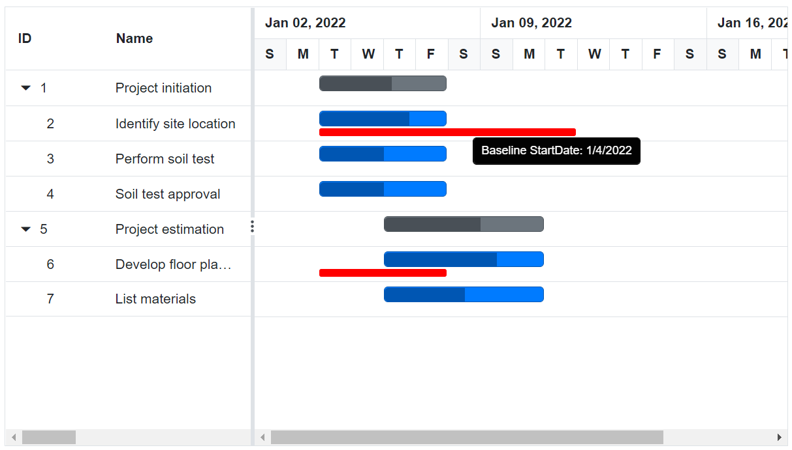

# Tooltip in Blazor Gantt Chart Component

The [Blazor Gantt Chart](https://www.syncfusion.com/blazor-components/blazor-gantt-chart) component has a support to display a tooltip for various UI elements like taskbar, timeline cells, and grid cells

## Enable tooltip

In the Gantt Chart component, you can enable or disable the mouse hover tooltip for the following UI elements using the [GanttTooltipSettings.ShowTooltip](https://help.syncfusion.com/cr/blazor/Syncfusion.Blazor.Gantt.GanttTooltipSettings-1.html#Syncfusion_Blazor_Gantt_GanttTooltipSettings_1_ShowTooltip) property:

* Taskbar
* Connector line
* Baseline
* Event marker

```cshtml
@using Syncfusion.Blazor.Gantt
<SfGantt DataSource="@TaskCollection" RenderBaseline="true" BaselineColor="Red" Height="450px" Width="800px">
    <GanttTaskFields Id="TaskId" Name="TaskName" StartDate="StartDate" EndDate="EndDate" Duration="Duration" Progress="Progress" Dependency="Predecessor" ParentID="ParentId"
                     BaselineStartDate="BaselineStartDate" BaselineEndDate="BaselineEndDate">
    </GanttTaskFields>
    <GanttEventMarkers>
        <GanttEventMarker Day="@Event" Label="Project approval and kick-off"
                          CssClass="e-custom-event-marker"></GanttEventMarker>
    </GanttEventMarkers>
</SfGantt>

@code{
        public DateTime Event = new DateTime(2022, 01, 10);
        private List<TaskData> TaskCollection { get; set; }
        protected override void OnInitialized()
        {
            this.TaskCollection = GetTaskCollection();
        }

        public class TaskData
        {
            public int TaskId { get; set; }
            public string TaskName { get; set; }
            public DateTime StartDate { get; set; }
            public DateTime? EndDate { get; set; }
            public string Duration { get; set; }
            public int Progress { get; set; }
            public int? ParentId { get; set; }
            public DateTime? BaselineStartDate { get; set; }
            public DateTime? BaselineEndDate { get; set; }
            public string Predecessor { get; set; }
        }

        private static List<TaskData> GetTaskCollection()
        {
            List<TaskData> Tasks = new List<TaskData>() {
                new TaskData() { TaskId = 1, TaskName = "Project initiation", StartDate = new DateTime(2022, 01, 04), EndDate = new DateTime(2022, 01, 23), },
                new TaskData() { TaskId = 2, TaskName = "Identify site location", StartDate = new DateTime(2022, 01, 04), Duration = "4", BaselineStartDate = new DateTime(2022, 01, 04), BaselineEndDate = new DateTime(2022, 01, 11), Progress = 70, ParentId = 1, },
                new TaskData() { TaskId = 3, TaskName = "Perform soil test", StartDate = new DateTime(2022, 01, 04), Duration = "4", Predecessor = "2FS", Progress = 50, ParentId = 1, },
                new TaskData() { TaskId = 4, TaskName = "Soil test approval", StartDate = new DateTime(2022, 01, 04), Duration = "4", Progress = 50, ParentId = 1, },
                new TaskData() { TaskId = 5, TaskName = "Project estimation", StartDate = new DateTime(2022, 01, 04), EndDate = new DateTime(2022, 01, 23), },
                new TaskData() { TaskId = 6, TaskName = "Develop floor plan for estimation", StartDate = new DateTime(2022, 01, 06), Duration = "3", Progress = 70, BaselineStartDate = new DateTime(2022, 01, 04), BaselineEndDate = new DateTime(2022, 01, 07), ParentId = 5, },
                new TaskData() { TaskId = 7, TaskName = "List materials", StartDate = new DateTime(2022, 01, 04), Duration = "3", Predecessor = "6SS", Progress = 50, ParentId = 5, }
        };
        return Tasks;
    }
}
<style>
    .e-gantt .e-gantt-chart .e-custom-event-marker {
        width: 1px;
        border-left: 2px green dotted;
    }
</style>
```


N> The default value of the `GanttTooltipSettings.ShowTooltip` property is true.

## Timeline cells tooltip

In the Gantt Chart component, you can enable or disable the mouse hover tooltip of timeline cells using the [GanttTimelineSettings.ShowTooltip](https://help.syncfusion.com/cr/blazor/Syncfusion.Blazor.Gantt.GanttTimelineSettings.html#Syncfusion_Blazor_Gantt_GanttTimelineSettings_ShowTooltip) property. The default value of this property is true. The following code example shows how to enable the timeline cells tooltip in Gantt Chart.

```cshtml
@using Syncfusion.Blazor.Gantt
<SfGantt DataSource="@TaskCollection" Height="450px" Width="700px">
    <GanttTaskFields Id="TaskId" Name="TaskName" StartDate="StartDate" EndDate="EndDate" Dependency="Predecessor"
                     Duration="Duration" Progress="Progress" ParentID="ParentId" BaselineStartDate="BaselineStartDate" BaselineEndDate="BaselineEndDate">
    </GanttTaskFields>
    <GanttTimelineSettings ShowTooltip="true"></GanttTimelineSettings>
</SfGantt>

@code{
    private List<TaskData> TaskCollection { get; set; }
    protected override void OnInitialized()
    {
        this.TaskCollection = GetTaskCollection();
    }

    public class TaskData
    {
        public int TaskId { get; set; }
        public string TaskName { get; set; }
        public DateTime StartDate { get; set; }
        public DateTime? EndDate { get; set; }
        public DateTime? BaselineStartDate { get; set; }
        public DateTime? BaselineEndDate { get; set; }
        public string Duration { get; set; }
        public int Progress { get; set; }
        public int? ParentId { get; set; }
        public string Predecessor { get; set; }
    }

    private static List<TaskData> GetTaskCollection()
    {
        List<TaskData> Tasks = new List<TaskData>() 
        {
            new TaskData() { TaskId = 1, TaskName = "Project initiation", StartDate = new DateTime(2022, 01, 04), EndDate = new DateTime(2022, 01, 23), },
            new TaskData() { TaskId = 2, TaskName = "Identify site location", StartDate = new DateTime(2022, 01, 04), Duration = "4", BaselineStartDate = new DateTime(2022, 01, 04), BaselineEndDate = new DateTime(2022, 01, 11), Progress = 70, ParentId = 1, },
            new TaskData() { TaskId = 3, TaskName = "Perform soil test", StartDate = new DateTime(2022, 01, 04), Duration = "4", Predecessor = "2FS", Progress = 50, ParentId = 1, },
            new TaskData() { TaskId = 4, TaskName = "Soil test approval", StartDate = new DateTime(2022, 01, 04), Duration = "4", Progress = 50, ParentId = 1, },
            new TaskData() { TaskId = 5, TaskName = "Project estimation", StartDate = new DateTime(2022, 01, 04), EndDate = new DateTime(2022, 01, 23), },
            new TaskData() { TaskId = 6, TaskName = "Develop floor plan for estimation", StartDate = new DateTime(2022, 01, 06), Duration = "3", Progress = 70, BaselineStartDate = new DateTime(2022, 01, 04), BaselineEndDate = new DateTime(2022, 01, 07), ParentId = 5, },
            new TaskData() { TaskId = 7, TaskName = "List materials", StartDate = new DateTime(2022, 01, 04), Duration = "3", Predecessor = "6SS", Progress = 50, ParentId = 5, }
        };
        return Tasks;
    }
}
```


## Cell tooltip

You can enable or disable the Grid cell tooltip using the [GanttColumn.ClipMode](https://help.syncfusion.com/cr/blazor/Syncfusion.Blazor.Gantt.GanttColumn.html#Syncfusion_Blazor_Gantt_GanttColumn_ClipMode) property.

```cshtml
@using Syncfusion.Blazor.Gantt
@using Syncfusion.Blazor.Grids
<SfGantt DataSource="@TaskCollection" Height="450px" Width="700px">
    <GanttTaskFields Id="TaskId" Name="TaskName" StartDate="StartDate" EndDate="EndDate"
                     Duration="Duration" Progress="Progress" ParentID="ParentId">
    </GanttTaskFields>
    <GanttColumns>
        <GanttColumn Field="TaskId"></GanttColumn>
        <GanttColumn Field="TaskName" Width="100" ClipMode="ClipMode.EllipsisWithTooltip"></GanttColumn>
        <GanttColumn Field="StartDate"></GanttColumn>
        <GanttColumn Field="Duration" ClipMode="ClipMode.Clip"></GanttColumn>
        <GanttColumn Field="Progress"></GanttColumn>
    </GanttColumns>
</SfGantt>

@code{
    private List<TaskData> TaskCollection { get; set; }
    protected override void OnInitialized()
    {
        this.TaskCollection = GetTaskCollection();
    }

    public class TaskData
    {
        public int TaskId { get; set; }
        public string TaskName { get; set; }
        public DateTime StartDate { get; set; }
        public DateTime? EndDate { get; set; }
        public string Duration { get; set; }
        public int Progress { get; set; }
        public int? ParentId { get; set; }
    }

    private static List<TaskData> GetTaskCollection()
    {
        List<TaskData> Tasks = new List<TaskData>()
    {
            new TaskData() { TaskId = 1, TaskName = "Project initiation", StartDate = new DateTime(2022, 01, 04), EndDate = new DateTime(2022, 01, 17), },
            new TaskData() { TaskId = 2, TaskName = "Identify Site location", StartDate = new DateTime(2022, 01, 04), Duration = "0", Progress = 30, ParentId = 1, },
            new TaskData() { TaskId = 3, TaskName = "Perform soil test", StartDate = new DateTime(2022, 01, 04), Duration = "4", Progress = 40, ParentId = 1, },
            new TaskData() { TaskId = 4, TaskName = "Soil test approval", StartDate = new DateTime(2022, 01, 04), Duration = "0", Progress = 30, ParentId = 1, },
            new TaskData() { TaskId = 5, TaskName = "Project estimation", StartDate = new DateTime(2022, 01, 04), EndDate = new DateTime(2022, 01, 17), },
            new TaskData() { TaskId = 6, TaskName = "Develop floor plan for estimation", StartDate = new DateTime(2022, 01, 06), Duration = "3", Progress = 30, ParentId = 5, },
            new TaskData() { TaskId = 7, TaskName = "List materials", StartDate = new DateTime(2022, 01, 06), Duration = "3", Progress = 40, ParentId = 5, },
            new TaskData() { TaskId = 8, TaskName = "Estimation approval", StartDate = new DateTime(2022, 01, 06), Duration = "0", Progress = 30, ParentId = 5, }
        };
        return Tasks;
    }
}
```


### Clip mode

The clip mode provides options to display its overflow cell content and it can be defined by the `GanttColumn.ClipMode` property.

The following are three types of `ClipMode`:

* `Clip`: Truncates the cell content when it overflows its area.
* `Ellipsis`: Displays ellipsis when content of the cell overflows its area.
* `EllipsisWithTooltip`: Displays ellipsis when content of the cell overflows its area; it displays the tooltip content when hover over ellipsis.

N> By default, all the column's `ClipMode` property is defined as `EllipsisWithTooltip`.

## Editing tooltip

It is possible to enable or disable the tooltip while performing editing actions on the taskbar like left resizing, right resizing, dragging, and progress resizing by using the [GanttTooltipSettings.ShowTooltipOnEditing](https://help.syncfusion.com/cr/blazor/Syncfusion.Blazor.Gantt.GanttTooltipSettings-1.html#Syncfusion_Blazor_Gantt_GanttTooltipSettings_1_ShowTooltipOnEditing) property. By default, this property is set to 'true.'

```cshtml
@using Syncfusion.Blazor.Gantt
<SfGantt DataSource="@TaskCollection" Height="450px" Width="900px" TreeColumnIndex="1"
    Toolbar="@(new List<string>() { "Add", "Cancel", "CollapseAll", "Delete", "Edit", "ExpandAll", "Search", "Update" , "Indent" , "Outdent"})">
    <GanttTaskFields Id="TaskId" Name="TaskName" StartDate="StartDate" EndDate="EndDate"
        Duration="Duration" Progress="Progress" Dependency="Predecessor" ParentID="ParentId" Notes="Notes">
    </GanttTaskFields>
    <GanttEditSettings AllowTaskbarEditing="true" AllowEditing="true" AllowAdding="true" AllowDeleting="true">
    </GanttEditSettings>
    <GanttTooltipSettings ShowTooltipOnEditing="true" TValue="TaskData"></GanttTooltipSettings>
</SfGantt>
@code {
    private List<TaskData> TaskCollection { get; set; }
    protected override void OnInitialized()
    {
        this.TaskCollection = this.TaskCollection = GetTaskCollection();
    }
    public class TaskData
    {
        public int TaskId { get; set; }
        public string TaskName { get; set; }
        public DateTime StartDate { get; set; }
        public DateTime? EndDate { get; set; }
        public string Duration { get; set; }
        public int Progress { get; set; }
        public string Predecessor { get; set; }
        public int? ParentId { get; set; }
    }

    public static List<TaskData> GetTaskCollection()
    {
        List<TaskData> Tasks = new List<TaskData>() {
            new TaskData() {TaskId = 1, TaskName = "Project initiation", StartDate = new DateTime(2019, 04, 02), EndDate = new DateTime(2019, 04, 21)},
            new TaskData() { TaskId = 2, TaskName = "Identify Site location", StartDate = new DateTime(2019, 04, 02), Duration = "3", Progress = 30, ParentId = 1 },
            new TaskData() { TaskId = 3, TaskName = "Perform soil test", StartDate = new DateTime(2019, 04, 02), Duration = "4", Progress = 40, Predecessor = "2FS", ParentId = 1 },
            new TaskData() { TaskId = 4, TaskName = "Soil test approval", StartDate = new DateTime(2019, 04, 02), Duration = "0", Progress = 30, Predecessor = "3FF", ParentId = 1 },
            new TaskData() { TaskId = 5, TaskName = "Project estimation", StartDate = new DateTime(2019, 04, 02), EndDate = new DateTime(2019, 04, 21)},
            new TaskData() { TaskId = 6, TaskName = "Develop floor plan for estimation", StartDate = new DateTime(2019, 04, 04), Duration = "3", Progress = 30, ParentId = 5 },
            new TaskData() { TaskId = 7, TaskName = "List materials", StartDate = new DateTime(2019, 04, 04), Duration = "3", Progress = 40, Predecessor = "6SS", ParentId = 5 }
        };
        return Tasks;
    }
}
```


## Tooltip template

### Taskbar tooltip

The default tooltip in the Gantt Chart component can be customized using the [GanttTooltipSettings.TaskbarTemplate](https://help.syncfusion.com/cr/blazor/Syncfusion.Blazor.Gantt.GanttTooltipSettings-1.html#Syncfusion_Blazor_Gantt_GanttTooltipSettings_1_TaskbarTemplate) property. You can map the template script element’s ID value or template string directly to this property.

```cshtml
@using Syncfusion.Blazor.Gantt
<SfGantt DataSource="@TaskCollection" Height="450px" Width="700px">
    <GanttTaskFields Id="TaskId" Name="TaskName" StartDate="StartDate" EndDate="EndDate"
                     Duration="Duration" Progress="Progress" ParentID="ParentId">
    </GanttTaskFields>
    <GanttTooltipSettings ShowTooltip="true" TValue="TaskData">
        <TaskbarTemplate>
            @{
                <div>TaskID: @context.TaskId</div>
            }
        </TaskbarTemplate>
    </GanttTooltipSettings>
</SfGantt>

@code{
    private List<TaskData> TaskCollection { get; set; }
    protected override void OnInitialized()
    {
        this.TaskCollection = GetTaskCollection();
    }

    public class TaskData
    {
        public int TaskId { get; set; }
        public string TaskName { get; set; }
        public DateTime StartDate { get; set; }
        public DateTime? EndDate { get; set; }
        public string Duration { get; set; }
        public int Progress { get; set; }
        public int? ParentId { get; set; }
    }

    private static List<TaskData> GetTaskCollection()
    {
        List<TaskData> Tasks = new List<TaskData>()
        {
            new TaskData() { TaskId = 1, TaskName = "Project initiation", StartDate = new DateTime(2022, 01, 04), EndDate = new DateTime(2022, 01, 17), },
            new TaskData() { TaskId = 2, TaskName = "Identify Site location", StartDate = new DateTime(2022, 01, 04), Duration = "0", Progress = 30, ParentId = 1, },
            new TaskData() { TaskId = 3, TaskName = "Perform soil test", StartDate = new DateTime(2022, 01, 04), Duration = "4", Progress = 40, ParentId = 1, },
            new TaskData() { TaskId = 4, TaskName = "Soil test approval", StartDate = new DateTime(2022, 01, 04), Duration = "0", Progress = 30, ParentId = 1, },
            new TaskData() { TaskId = 5, TaskName = "Project estimation", StartDate = new DateTime(2022, 01, 04), EndDate = new DateTime(2022, 01, 17), },
            new TaskData() { TaskId = 6, TaskName = "Develop floor plan for estimation", StartDate = new DateTime(2022, 01, 06), Duration = "3", Progress = 30, ParentId = 5, },
            new TaskData() { TaskId = 7, TaskName = "List materials", StartDate = new DateTime(2022, 01, 06), Duration = "3", Progress = 40, ParentId = 5, },
            new TaskData() { TaskId = 8, TaskName = "Estimation approval", StartDate = new DateTime(2022, 01, 06), Duration = "0", Progress = 30, ParentId = 5, }
        };
        return Tasks;
    }
}
```

The below screenshot shows the output of above code example.


### Taskbar editing tooltip

The taskbar editing tooltip can be customized using the [GanttTooltipSettings.EditingTemplate](https://help.syncfusion.com/cr/blazor/Syncfusion.Blazor.Gantt.GanttTooltipSettings-1.html#Syncfusion_Blazor_Gantt_GanttTooltipSettings_1_EditingTemplate) property. The following code example shows how to customize the taskbar editing tooltip in a Gantt Chart:

```cshtml
@using Syncfusion.Blazor.Gantt
<SfGantt DataSource="@TaskCollection" Height="450px" Width="700px">
    <GanttTaskFields Id="TaskId" Name="TaskName" StartDate="StartDate" EndDate="EndDate" Duration="Duration"    Progress="Progress" ParentID="ParentId"></GanttTaskFields>
    <GanttEditSettings AllowTaskbarEditing="true" AllowEditing="true" AllowAdding="true"
        AllowDeleting="true"  ShowDeleteConfirmDialog="true">
    </GanttEditSettings>
    <GanttTooltipSettings ShowTooltip="true" TValue="TaskData">
        <EditingTemplate>
            <table>
                @{
                    var template = (context as TaskData);
                    if (TaskbarEditAction == "LeftResizing")
                    {
                        <tr> <td style="padding:3px">@(template.StartDate.ToString("MMM dd, yyyy"))</td> </tr>
                        <tr> <td style="padding:6px">@(template.Duration) days</td> </tr>
                    } 
                    else if (TaskbarEditAction == "RightResizing")
                    {
                        <tr> <td style="padding:3px">@(template.EndDate.ToString("MMM dd, yyyy"))</td> </tr>
                        <tr> <td style="padding:6px">@(template.Duration) days</td> </tr>
                    }
                    else if (TaskbarEditAction == "ChildDrag" || TaskbarEditAction == "ParentDrag" || TaskbarEditAction == "MilestoneDrag")
                    {
                        <tr> <td style="padding:3px">@(template.StartDate.ToString("MMM dd, yyyy"))</td> </tr>
                        <tr> <td style="padding:3px">@(template.EndDate.ToString("MMM dd, yyyy"))</td> </tr>
                    }
                    else if (TaskbarEditAction == "ProgressResizing")
                    {
                        <tr> <td style="padding:3px">@(template.Progress) %</td> </tr>
                    }
                }
            </table>
            </EditingTemplate>
        </GanttTooltipSettings>
        <GanttEvents TaskbarEditing="TaskbarEditingHandler" TValue="TaskData"></GanttEvents>
</SfGantt>
@code {
    private List<TaskData> TaskCollection { get; set; }
    private string TaskbarEditAction { get; set; }
    private void TaskbarEditingHandler(TaskbarEditingEventArgs<TaskData> args)
    {
        TaskbarEditAction = args.Action;
    }
    protected override void OnInitialized()
    {
        this.TaskCollection = GetTaskCollection();
    }
    public class TaskData
    {
        public int TaskId { get; set; }
        public string TaskName { get; set; }
        public DateTime StartDate { get; set; }
        public DateTime? EndDate { get; set; }
        public string Duration { get; set; }
        public int Progress { get; set; }
        public int? ParentId { get; set; }
    }

    public static List<TaskData> GetTaskCollection()
    {
        List<TaskData> Tasks = new List<TaskData>() {
            new TaskData() {TaskId = 1, TaskName = "Project initiation", StartDate = new DateTime(2019, 04, 02), EndDate = new DateTime(2019, 04, 21)},
            new TaskData() { TaskId = 2, TaskName = "Identify Site location", StartDate = new DateTime(2019, 04, 02), Duration = "3", Progress = 30, ParentId = 1 },
            new TaskData() { TaskId = 3, TaskName = "Perform soil test", StartDate = new DateTime(2019, 04, 02), Duration = "4", Progress = 40, ParentId = 1 },
            new TaskData() { TaskId = 4, TaskName = "Soil test approval", StartDate = new DateTime(2019, 04, 02), Duration = "0", Progress = 30, ParentId = 1 },
            new TaskData() { TaskId = 5, TaskName = "Project estimation", StartDate = new DateTime(2019, 04, 02), EndDate = new DateTime(2019, 04, 21)},
            new TaskData() { TaskId = 6, TaskName = "Develop floor plan for estimation", StartDate = new DateTime(2019, 04, 04), Duration = "3", Progress = 30, ParentId = 5 },
            new TaskData() { TaskId = 7, TaskName = "List materials", StartDate = new DateTime(2019, 04, 04), Duration = "3", Progress = 40, ParentId = 5 }
        };
        return Tasks;
    }
}

```


### Baseline tooltip

A baseline tooltip can be customized using the [GanttTooltipSettings.BaselineTemplate](https://help.syncfusion.com/cr/blazor/Syncfusion.Blazor.Gantt.GanttTooltipSettings-1.html#Syncfusion_Blazor_Gantt_GanttTooltipSettings_1_BaselineTemplate) property. The following code example shows how to customize the baseline tooltip in Gantt Chart.

```cshtml
@using Syncfusion.Blazor.Gantt
<SfGantt DataSource="@TaskCollection" RenderBaseline="true"
         BaselineColor="Red" Height="450px" Width="800px">
    <GanttTaskFields Id="TaskId" Name="TaskName" StartDate="StartDate" EndDate="EndDate"
                     Duration="Duration" Progress="Progress" BaselineStartDate="BaselineStartDate" BaselineEndDate="BaselineEndDate" ParentID="ParentId">
    </GanttTaskFields>
    <GanttTooltipSettings ShowTooltip="true" TValue="TaskData">
        <BaselineTemplate>
            @{
                <div>Baseline StartDate: @context.BaselineStartDate?.ToShortDateString()</div>
            }
        </BaselineTemplate>
    </GanttTooltipSettings>
</SfGantt>

@code{
    private List<TaskData> TaskCollection { get; set; }
    protected override void OnInitialized()
    {
        this.TaskCollection = GetTaskCollection();
    }

    public class TaskData
    {
        public int TaskId { get; set; }
        public string TaskName { get; set; }
        public DateTime StartDate { get; set; }
        public DateTime? EndDate { get; set; }
        public string Duration { get; set; }
        public int Progress { get; set; }
        public int? ParentId { get; set; }
        public DateTime? BaselineStartDate { get; set; }
        public DateTime? BaselineEndDate { get; set; }
        public string Predecessor { get; set; }
    }

    public static List<TaskData> GetTaskCollection()
    {
        List<TaskData> Tasks = new List<TaskData>() {
            new TaskData() { TaskId = 1, TaskName = "Project initiation", StartDate = new DateTime(2022, 01, 04), EndDate = new DateTime(2022, 01, 23), },
            new TaskData() { TaskId = 2, TaskName = "Identify site location", StartDate = new DateTime(2022, 01, 04), Duration = "4", BaselineStartDate = new DateTime(2022, 01, 04), BaselineEndDate = new DateTime(2022, 01, 11), Progress = 70, ParentId = 1, },
            new TaskData() { TaskId = 3, TaskName = "Perform soil test", StartDate = new DateTime(2022, 01, 04), Duration = "4", Predecessor = "2FS", Progress = 50, ParentId = 1, },
            new TaskData() { TaskId = 4, TaskName = "Soil test approval", StartDate = new DateTime(2022, 01, 04), Duration = "4", Progress = 50, ParentId = 1, },
            new TaskData() { TaskId = 5, TaskName = "Project estimation", StartDate = new DateTime(2022, 01, 04), EndDate = new DateTime(2022, 01, 23), },
            new TaskData() { TaskId = 6, TaskName = "Develop floor plan for estimation", StartDate = new DateTime(2022, 01, 06), Duration = "3", Progress = 70, BaselineStartDate = new DateTime(2022, 01, 04), BaselineEndDate = new DateTime(2022, 01, 07), ParentId = 5, },
            new TaskData() { TaskId = 7, TaskName = "List materials", StartDate = new DateTime(2022, 01, 06), Duration = "3", Predecessor = "6SS", Progress = 50, ParentId = 5, }
        };
        return Tasks;
    }
}
```

The following screenshot shows the template for baseline in Gantt Chart.



### Manual taskbar tooltip

A manual taskbar tooltip can be customized using the [GanttTooltipSettings.ManualTaskbarTemplate](https://help.syncfusion.com/cr/blazor/Syncfusion.Blazor.Gantt.GanttTooltipSettings-1.html#Syncfusion_Blazor_Gantt_GanttTooltipSettings_1_ManualTaskbarTemplate) property. The following code example shows how to customize the manual taskbar tooltip in Gantt Chart.

```cshtml
@using Syncfusion.Blazor.Gantt

<SfGantt DataSource="@TaskCollection" Height="450px" TaskMode="ScheduleMode.Manual" ValidateManualTasksOnLinking="true" Width="900px" TreeColumnIndex="1" Toolbar="@(new List<string>() { "Add", "Edit", "Update", "Delete", "Cancel", "ExpandAll", "CollapseAll" })">
    <GanttTaskFields Id="TaskId" Name="TaskName" StartDate="StartDate" EndDate="EndDate" Duration="Duration" Progress="Progress"
                     ParentID="ParentId" Dependency="Predecessor">
    </GanttTaskFields>
    <GanttEditSettings AllowEditing="true" AllowAdding="true" AllowDeleting="true" AllowTaskbarEditing="true"></GanttEditSettings>
    <GanttTooltipSettings ShowTooltip="true" TValue="TaskData">
        <ManualTaskbarTemplate>
            @{
                <div> StartDate: @context.StartDate.ToShortDateString()</div>
                <div> EndDate: @context.EndDate.ToShortDateString()</div>
            }
        </ManualTaskbarTemplate>
    </GanttTooltipSettings>
</SfGantt>

@code{
    private List<TaskData> TaskCollection { get; set; }
    protected override void OnInitialized()
    {
        this.TaskCollection = GetTaskCollection();
    }

    public class TaskData
    {
        public int TaskId { get; set; }
        public string TaskName { get; set; }
        public DateTime StartDate { get; set; }
        public DateTime? EndDate { get; set; }
        public string Duration { get; set; }
        public int Progress { get; set; }
        public int? ParentId { get; set; }
    }

    private static List<TaskData> GetTaskCollection()
    {
        List<TaskData> Tasks = new List<TaskData>()
        {
            new TaskData() { TaskId = 1, TaskName = "Project initiation", StartDate = new DateTime(2022, 01, 04), EndDate = new DateTime(2022, 01, 4), Duration="4" },
            new TaskData() { TaskId = 2, TaskName = "Identify Site location", StartDate = new DateTime(2022, 01, 05), Duration = "2", Progress = 30, ParentId = 1, },
            new TaskData() { TaskId = 3, TaskName = "Perform soil test", StartDate = new DateTime(2022, 01, 05), Duration = "4", ParentId = 1, },
            new TaskData() { TaskId = 4, TaskName = "Soil test approval", StartDate = new DateTime(2022, 01, 05), Duration = "4",Progress = 30, ParentId = 1, },
            new TaskData() { TaskId = 5, TaskName = "Project estimation", StartDate = new DateTime(2022, 01, 05), EndDate = new DateTime(2022, 01, 07), Duration="4" },
            new TaskData() { TaskId = 6, TaskName = "Develop floor plan for estimation", StartDate = new DateTime(2022, 01, 05), Duration = "3", Progress = 30, ParentId = 5, },
            new TaskData() { TaskId = 7, TaskName = "List materials", StartDate = new DateTime(2022, 01, 06), Duration = "3", Progress = 30, ParentId = 5, },
            new TaskData() { TaskId = 8, TaskName = "Estimation approval", StartDate = new DateTime(2022, 01, 06), Duration = "2", ParentId = 5, }
        };
        return Tasks;
    }
}
```


### Indicator tooltip

Customizing the indicator tooltip in a Gantt Chart using [GanttTooltipSettings.IndicatorTemplate](https://help.syncfusion.com/cr/blazor/Syncfusion.Blazor.Gantt.GanttTooltipSettings-1.html#Syncfusion_Blazor_Gantt_GanttTooltipSettings_1_IndicatorTemplate) allows you to display additional information and elements in a more visually appealing and informative way. By combining data bindings and CSS styles, you can create custom templates that suit your specific needs and use cases. The following code example shows how to customize the indicator tooltip in Gantt Chart.

```cshtml
@using Syncfusion.Blazor.Gantt

<SfGantt @ref="Gantt" DataSource="@TaskCollection" Height="450px" Width="1000px">
    <GanttTaskFields Id="TaskId" Name="TaskName" StartDate="StartDate" EndDate="EndDate" Duration="Duration"
                     Progress="Progress" ParentID="ParentId" Indicators="Indicators" >
    </GanttTaskFields>
    <GanttTooltipSettings ShowTooltip="true" TValue="TaskData">
       <IndicatorTemplate> 
            @{  
                var indicator = context as GanttIndicator; 
                <div>
                    
                    @indicator.Tooltip 
                </div> 
            } 
        </IndicatorTemplate> 
    </GanttTooltipSettings>
</SfGantt>
@code {
    public SfGantt<TaskData> Gantt;
    public List<TaskData> TaskCollection { get; set; }
    private DateTime ProjectStartDate = new DateTime(2021, 04, 02);
    private DateTime ProjectEndDate = new DateTime(2022, 01, 01);
    protected override void OnInitialized()
    {
        this.TaskCollection = EditingData();
    }
    public class TaskData
    {
        public int TaskId { get; set; }
        public string TaskName { get; set; }
        public DateTime? StartDate { get; set; }
        public DateTime? EndDate { get; set; }
        public string Duration { get; set; }
        public int Progress { get; set; }
        public string Predecessor { get; set; }
        public string Notes { get; set; }
        public int? ParentId { get; set; }
        public List<GanttIndicator>? Indicators { get; set; }
    }
    public static List<TaskData> EditingData()
    {
        List<TaskData> Tasks = new List<TaskData>() {
        new TaskData() { TaskId = 1, TaskName = "Product concept", StartDate = new DateTime(2021, 04, 03), EndDate = new DateTime(2021, 04, 08), 
        Duration = "5 days", 
        Indicators = ( new List<GanttIndicator>(){ new GanttIndicator() { Name="product", IconClass="e-btn-icon e-notes-info e-icons e-icon-left e-gantt e-notes-info::before", Date=new DateTime(2021, 04, 11), Tooltip="Sales"}})},
        new TaskData() { TaskId = 2, TaskName = "Defining the product usage", StartDate = new DateTime(2021, 04, 01), EndDate = new DateTime(2021, 04, 08), Duration = "3", Progress = 30, ParentId = 1 },
        new TaskData() { TaskId = 3, TaskName = "Defining the target audience", StartDate = new DateTime(2021, 04, 02), EndDate = new DateTime(2021, 04, 04), Duration = "3", Progress = 40, ParentId = 2 },
        new TaskData() { TaskId = 4, TaskName = "Prepare product sketch and notes", StartDate = new DateTime(2021, 03, 28), EndDate = new DateTime(2021, 04, 08), Duration = "2", Progress = 30, ParentId = 3, Predecessor="2" },
        new TaskData() { TaskId = 5, TaskName = "Concept approval", StartDate = new DateTime(2021, 04, 08), EndDate = new DateTime(2021, 04, 08), Duration="0",Predecessor="3,4",
        Indicators = (new List<GanttIndicator>(){ new GanttIndicator() { Name="Approval", IconClass="e-btn-icon e-notes-info e-icons e-icon-left e-gantt e-notes-info::before", Date=new DateTime(2021, 04, 13), Tooltip="Product"}})},
        new TaskData() { TaskId = 6, TaskName = "Market research", StartDate = new DateTime(2021, 04, 09), EndDate = new DateTime(2021, 04, 18), Predecessor="2", Duration = "4", Progress = 30 },
        new TaskData() { TaskId = 7, TaskName = "Demand analysis", StartDate = new DateTime(2021, 04, 09), EndDate = new DateTime(2021, 04, 12), Duration = "4", Progress = 40, ParentId = 6 },
        new TaskData() { TaskId = 8, TaskName = "Customer strength", StartDate = new DateTime(2021, 04, 09), EndDate = new DateTime(2021, 04, 12), Duration = "4", Progress = 30, ParentId = 7, Predecessor="5" },
    };
        return Tasks;
    }
}
<style>
    .indicator {
        content: url('data:image/svg+xml;base64,PD94bWwgdmVyc2lvbj0iMS4wIiBlbmNvZGluZz0idXRmLTgiPz4KPCEtLSBHZW5lcmF0b3I6IEFkb2JlIElsbHVzdHJhdG9yIDIyLjEuMCwgU1ZHIEV4cG9ydCBQbHVnLUluIC4gU1ZHIFZlcnNpb246IDYuMDAgQnVpbGQgMCkgIC0tPgo8c3ZnIHZlcnNpb249IjEuMSIgaWQ9IkxheWVyXzEiIHhtbG5zPSJodHRwOi8vd3d3LnczLm9yZy8yMDAwL3N2ZyIgeG1sbnM6eGxpbms9Imh0dHA6Ly93d3cudzMub3JnLzE5OTkveGxpbmsiIHg9IjBweCIgeT0iMHB4IgoJIHZpZXdCb3g9IjAgMCAzMiAzMiIgc3R5bGU9ImVuYWJsZS1iYWNrZ3JvdW5kOm5ldyAwIDAgMzIgMzI7IiB4bWw6c3BhY2U9InByZXNlcnZlIj4KPHN0eWxlIHR5cGU9InRleHQvY3NzIj4KCS5zdDB7ZmlsbDojRkZGRkZGO3N0cm9rZTojMDAwMDAwO3N0cm9rZS1taXRlcmxpbWl0OjEwO30KCS5zdDF7c3Ryb2tlOiMwMDAwMDA7c3Ryb2tlLW1pdGVybGltaXQ6MTA7fQoJLnN0MntmaWxsOiNGRkZGRkY7fQoJLnN0M3tmaWxsOm5vbmU7c3Ryb2tlOiMwMDAwMDA7c3Ryb2tlLW1pdGVybGltaXQ6MTA7fQoJLnN0NHtmaWxsOm5vbmU7c3Ryb2tlOiMwMDAwMDA7c3Ryb2tlLWxpbmVjYXA6cm91bmQ7c3Ryb2tlLWxpbmVqb2luOnJvdW5kO3N0cm9rZS1taXRlcmxpbWl0OjEwO30KCS5zdDV7ZmlsbDpub25lO3N0cm9rZTojMDAwMDAwO3N0cm9rZS1saW5lam9pbjpyb3VuZDtzdHJva2UtbWl0ZXJsaW1pdDoxMDt9Cgkuc3Q2e2ZpbGw6bm9uZTtzdHJva2U6IzAwMDAwMDtzdHJva2Utd2lkdGg6MjtzdHJva2UtbWl0ZXJsaW1pdDoxMDt9Cgkuc3Q3e3N0cm9rZTojRkZGRkZGO3N0cm9rZS1taXRlcmxpbWl0OjEwO30KCS5zdDh7ZmlsbDojRkZGRkZGO3N0cm9rZTojMDAwMDAwO3N0cm9rZS1saW5lam9pbjpyb3VuZDtzdHJva2UtbWl0ZXJsaW1pdDoxMDt9Cgkuc3Q5e3N0cm9rZTojMDAwMDAwO3N0cm9rZS1saW5lam9pbjpyb3VuZDtzdHJva2UtbWl0ZXJsaW1pdDoxMDt9Cgkuc3QxMHtmaWxsOm5vbmU7c3Ryb2tlOiMwMDAwMDA7c3Ryb2tlLXdpZHRoOjI7c3Ryb2tlLWxpbmVjYXA6cm91bmQ7c3Ryb2tlLWxpbmVqb2luOnJvdW5kO3N0cm9rZS1taXRlcmxpbWl0OjEwO30KCS5zdDExe2ZpbGw6bm9uZTtzdHJva2U6IzAwMDAwMDtzdHJva2Utd2lkdGg6MjtzdHJva2UtbGluZWNhcDpyb3VuZDtzdHJva2UtbWl0ZXJsaW1pdDoxMDt9Cgkuc3QxMntmaWxsOm5vbmU7c3Ryb2tlOiMwMDAwMDA7c3Ryb2tlLXdpZHRoOjM7c3Ryb2tlLWxpbmVjYXA6cm91bmQ7c3Ryb2tlLWxpbmVqb2luOnJvdW5kO3N0cm9rZS1taXRlcmxpbWl0OjEwO30KCS5zdDEze2ZpbGw6bm9uZTtzdHJva2U6I0RERERERDtzdHJva2UtbWl0ZXJsaW1pdDoxMDt9CgljaXJjbGUscGF0aHtmaWxsOiNGRkY7fQo8L3N0eWxlPgo8Zz4KCTxjaXJjbGUgY3g9IjE1LjciIGN5PSIyMS45IiByPSI4LjEiLz4KCTxwYXRoIGQ9Ik0yMywxNS40TDI5LDRoLTcuNGwtNC43LDguMkMxOS4zLDEyLjUsMjEuNCwxMy42LDIzLDE1LjR6Ii8+Cgk8cGF0aCBkPSJNMTQuOSwxMi4yTDEwLjIsNEgzbDUuNywxMS4xQzEwLjMsMTMuNSwxMi41LDEyLjQsMTQuOSwxMi4yeiIvPgo8L2c+Cjwvc3ZnPgo=');
    }
</style>
```


### Timeline cell tooltip

Customizing the timeline cell tooltip in a Gantt Chart using [GanttTooltipSettings.TimelineCellTemplate](https://help.syncfusion.com/cr/blazor/Syncfusion.Blazor.Gantt.GanttTooltipSettings-1.html#Syncfusion_Blazor_Gantt_GanttTooltipSettings_1_TimelineCellTemplate) allows you to display additional information and elements in a more visually appealing and informative way. By combining data bindings and CSS styles, you can create custom templates that suit your specific needs and use cases. The following code example shows how to customize the timeline cell tooltip in Gantt Chart.

```cshtml
@using Syncfusion.Blazor.Gantt

<SfGantt @ref="Gantt" DataSource="@TaskCollection" Height="450px" Width="1000px">
    <GanttTaskFields Id="TaskId" Name="TaskName" StartDate="StartDate" EndDate="EndDate" Duration="Duration"
                     Progress="Progress" ParentID="ParentId">
    </GanttTaskFields>
    <GanttTimelineSettings ShowTooltip="true"></GanttTimelineSettings>
    <GanttTooltipSettings TValue="TaskData">
       <TimelineCellTemplate> 
            @{ 
                var timelineCell = context as string; 
                <div>
                    <i class="app-icon-calendar"></i>
                    @timelineCell 
                </div>
         } 
        </TimelineCellTemplate>
    </GanttTooltipSettings>
</SfGantt>
@code {
    public SfGantt<TaskData> Gantt;
    public List<TaskData> TaskCollection { get; set; }
    private DateTime ProjectStartDate = new DateTime(2021, 04, 02);
    private DateTime ProjectEndDate = new DateTime(2022, 01, 01);
    protected override void OnInitialized()
    {
        this.TaskCollection = EditingData();
    }
    public class TaskData
    {
        public int TaskId { get; set; }
        public string TaskName { get; set; }
        public DateTime? StartDate { get; set; }
        public DateTime? EndDate { get; set; }
        public string Duration { get; set; }
        public int Progress { get; set; }
        public string Predecessor { get; set; }
        public string Notes { get; set; }
        public int? ParentId { get; set; }
    }
    public static List<TaskData> EditingData()
    {
        List<TaskData> Tasks = new List<TaskData>() {
        new TaskData() { TaskId = 1, TaskName = "Product concept", StartDate = new DateTime(2021, 04, 03), EndDate = new DateTime(2021, 04, 08), Duration = "5 days" },
        new TaskData() { TaskId = 2, TaskName = "Defining the product usage", StartDate = new DateTime(2021, 04, 01), EndDate = new DateTime(2021, 04, 08), Duration = "3", Progress = 30, ParentId = 1 },
        new TaskData() { TaskId = 3, TaskName = "Defining the target audience", StartDate = new DateTime(2021, 04, 02), EndDate = new DateTime(2021, 04, 04), Duration = "3", Progress = 40, ParentId = 2 },
        new TaskData() { TaskId = 4, TaskName = "Prepare product sketch and notes", StartDate = new DateTime(2021, 03, 28), EndDate = new DateTime(2021, 04, 08), Duration = "2", Progress = 30, ParentId = 3, Predecessor="2" },
        new TaskData() { TaskId = 5, TaskName = "Concept approval", StartDate = new DateTime(2021, 04, 08), EndDate = new DateTime(2021, 04, 08), Duration="0",Predecessor="3,4" },
        new TaskData() { TaskId = 6, TaskName = "Market research", StartDate = new DateTime(2021, 04, 09), EndDate = new DateTime(2021, 04, 18), Predecessor="2", Duration = "4", Progress = 30 },
        new TaskData() { TaskId = 7, TaskName = "Demand analysis", StartDate = new DateTime(2021, 04, 09), EndDate = new DateTime(2021, 04, 12), Duration = "4", Progress = 40, ParentId = 6 },
        new TaskData() { TaskId = 8, TaskName = "Customer strength", StartDate = new DateTime(2021, 04, 09), EndDate = new DateTime(2021, 04, 12), Duration = "4", Progress = 30, ParentId = 7, Predecessor="5" },
    };
        return Tasks;
    }
}
<style>
    @@font-face {
        font-family: 'Gantt control icon';
        src: url(data:application/x-font-ttf;charset=utf-8;base64,AAEAAAAKAIAAAwAgT1MvMj1tSfYAAAEoAAAAVmNtYXDnGOdnAAABmAAAAD5nbHlmQgFVZwAAAegAAAz0aGVhZB3yGpMAAADQAAAANmhoZWEIVAQHAAAArAAAACRobXR4GAAAAAAAAYAAAAAYbG9jYQswB+QAAAHYAAAADm1heHABFwGZAAABCAAAACBuYW1lkE9o0gAADtwAAAKpcG9zdNrxyk8AABGIAAAAWwABAAAEAAAAAFwEAAAAAAAD9wABAAAAAAAAAAAAAAAAAAAABgABAAAAAQAAbOytH18PPPUACwQAAAAAAN1uas8AAAAA3W5qzwAAAAAD9wP4AAAACAACAAAAAAAAAAEAAAAGAY0ABwAAAAAAAgAAAAoACgAAAP8AAAAAAAAAAQQAAZAABQAAAokCzAAAAI8CiQLMAAAB6wAyAQgAAAIABQMAAAAAAAAAAAAAAAAAAAAAAAAAAAAAUGZFZABA5wDnBAQAAAAAXAQAAAAAAAABAAAAAAAABAAAAAQAAAAEAAAABAAAAAQAAAAEAAAAAAAAAgAAAAMAAAAUAAMAAQAAABQABAAqAAAABAAEAAEAAOcE//8AAOcA//8AAAABAAQAAAABAAIAAwAEAAUAAAAAAAAA3AKYA9oFTAZ6AAAABAAAAAADowPOAAMAFwBRALsAACUzNSM3EQ8HIS8HETcVHwc/BzUzFR8HPwc1Mx8HFSE1PwgVIw8PER8PIT8PES8PIzUvBw8HFSM1LwcPBgJUqKj8AQIEBQcHBAj9sAgIBwcFBAECfgECBAUGCAcJCAgHBwUEAQL8AQIEBQYIBwkICAcHBQQBAlQICAcHBQQBAv1gAQIEBQcHBAhYVA0MDAwLCgoJCAcHBQQDAgEBAgMEBQcHCAkKCgsMDAwNAkwNDAwMCwoKCQgHBwUEAwIBAQIDBAUHBwgJCgoLDAwMDVQBAgQFBwcICAkHCAYFBAEC/AECBAUHBwgICQcIBgUEAtqoqP6GCAgHBwUEAQIBAgQFBwcECAF+/CoICAcHBQQCAQECBAUHBwQILioICAcHBQQCAQECBAUHBwQILgECBAUHBwQIgn4ICAcHBQQBAn4qAQIDBAUHBwgJCgoLDAwMDf20DQwMDAsKCgkIBwcFBAMCAQECAwQFBwcICQoKCwwMDA0CTA0MDAwLCgoJCAcHBQQDAgEqCAgHBwUEAgEBAgQFBwcECC4qCAgHBwUEAgEBAgQFBwcIAAAFAAAAAAP3A6QARACqAOoBSwGMAAABBx0BHxUVHwc/BzUvECsBDwUFFR8HPwc1Pw8hHw8VHwc/BzUvDyEPDgEPDy8PPw8fDjcHHQEfFB0BDxMVHwc/EC8QDwYFFR8PPw8vDw8OAycBAgQEBgcEDwkKCQgIBwYGBgQEAwIBAQECBAUGCAcJCAgHBwUEAQIBAgQFBggICgsMDQ4PDxERBgYHBgYFBQQD/N4BAgQFBwcICAkHCAYFBAECAQIDBAUHBwgJCgoLDAwMDQFQDQwNCwsLCQkICAYFBAMCAQECBAUHBwgICQcIBgUEAQIBAwUHCQsMDQ8IERITExUV/qUVFRQUEhEQDw4MCwgHBgMB9wECAwQFBggICQkLCwsNDA0NDAwMCwoKCQgHBwUEAwIBAQIDBAUHBwgJCgoLDAwMDQ0MDQsLCwkJCAgGBQQDAoABAgQFBgcDDwoJCQgIBwcGBQUDAwICAgIDAwUFBgcHCAgJCQoSBwYFBAIBAwUFBwcICAgREQ8PDg0MCwoJBwcFAwIBAQIDBQcHCQoLDA0ODw8REQgHBwcGBQUD/i4BAwYHCAsMDg8QERIUFBUVFhQUFBIREQ4ODAsICAUDAQEDBQgICwwODhEREhQUFBYVFRQUEhEQDw4MCwgHBgMBhwQECQcIBgYEAgQEBQUGBwcICAkJCgoKCgtUCAgHBwUEAgEBAgQFBwcECFgSEREREA8PDg0MCwoJCAYFAQIDBAQFBrRUCAgHBwUEAgEBAgQFBwcECFgNDAwMCwoKCQgHBwUEAwIBAQIDBAUHBwgJCgoLDAwMDVQICAcHBQQCAQECBAUHBwQIWBUVFBQSEREODgYMCQgGBQIBAwUHCQsMDg4RERIUFBUB4w0MDAwLCgoJCAcHBQQDAgEBAgMEBQcHCAkKCgsMDAwNDQwMDAsKCgkIBwcFBAMCAQECAwQFBwcICQoKCwwMDKAEBAkIBwYGBAIEBAUFBgcHCAgJCQoKCgoLCwoKCgoJCQgIBwcGBQUEBgQGBggICAgIBwYFAwIBAQYGCAkKCwwNDg8PEBERERISEREREA8PDg0MCwoJCAYFAgEBAwQEBga0CwoVFBQSEREODgwLCQcFAwEBAwUHCQsMDg4RERIUFBUVFRUUFBIREQ4ODAsJBwUDAQEDBQcJCwwODhEREhQUFQAAAAADAAAAAAPNA84AJgCmASYAAAEVHwczPwY1LwM1LwcPBgEPHisBLx4/HjsBHx0FHx8/Hy8fDx4B1gECBAWBBwgICAgIBwYEAwICAwR1AQIEBQcHCAgICAcHBQQCAaMBAQIEBAUGBwcJCQoKCwwNDQ4ODw8QEBEREhISEhMUExMUExISEhIRERAQDw8ODg0NDAsKCgkJBwcGBQQEAgEBAQECBAQFBgcHCQkKCgsMDQ0ODg8PEBARERISEhITFBMTFBMSEhISEREQEA8PDg4NDQwLCgoJCQcHBgUEBAIB/LkBAQMEBgYHCAoKCwwNDg4PEBESEhIUFBQVFhYWFxcXGBgXFxcWFhYVFBQUEhISERAPDg4NDAsKCggHBgYEAwEBAQEDBAYGBwgKCgsMDQ4ODxAREhISFBQUFRYWFhcXFxgYFxcXFhYWFRQUFBISEhEQDw4ODQwLCgoIBwYGBAMBAvz8CAgHB4EEAwICAwQGBwgICAgIB3TrCAgHBwUEAgEBAgQFBwcI/vwTFBMSEhISEREQEA8PDg4NDQwLCgoJCQcHBgUEBAICAgIEBAUGBwcJCQoKCwwNDQ4ODw8QEBEREhISEhMUExMUExISEhIRERAQDw8ODg0NDAsKCgkJBwcGBQQEAgICAgQEBQYHBwkJCgoLDA0NDg4PDxAQERESEhISExQTGBcXFxYWFhUUFBQSEhIREA8ODg0MCwoKCAcGBgQDAQEBAQMEBgYHCAoKCwwNDQ8PEBESEhIUFBQVFhYWFxcXGBgXFxcWFhYVFBQUEhISERAPDw0NDAsKCggHBgYEAwEBAQEDBAYGBwgKCgsMDQ0PDxAREhISFBQUFRYWFhcXFwAAAAYAAAAAA84D+AAiAHQAlQDVAPoBPgAAARUfByE/By8HIQ8GNxUfBjsBPwY1PwM7AR8FHQEfBz8HNS8PIw8OExUPBy8HPwcfBgcfDz8PLw8PDiUzHwcRDwchLwcRPwcHER8PIT8PES8PIQ8OAQQBAgQFBwcECAGoCAgHBwUEAgEBAgQFBwcECP5YCAgHBwUEAlMBAgQFBwcICAgIBwcFBAECAQMBAosFBAQDAwIBAQIEBQcHCAgICAcHBQQBAgEBAgQEBQYHBwgJCQoLCwuJCwsKCQkHBwYGBAQDAwIB0gECBAUHBwgICAgHBwUEAgEBAgQFBwcICAgIBwcFBAKnAQIDBAUHBwgJCgoLDAwMDQ0MDAwLCgoJCAcHBQQDAgEBAgMEBQcHCAkKCgsMDAwNDQwMDAsKCgkIBwcFBAMCAc0EBAgHBwUEAQIBAgQFBwcECP1cCAgHBwUEAQIBAgQFBwcECHoBAgMEBQcHCAkKCgsMDAwNAqANDAwMCwoKCQgHBwUEAwIBAQIDBAUHBwgJCgoLDAwMDf1gDQwMDAsKCgkIBwcFBAMCAQQEBAgHBwUEAQIBAgQFBwcICAgIBwcFBAECAQIEBQcHCNEtCQgHBgUEAwMEBQYHBAgyGAgCAQICAwQFBgg2CAgHBwUEAgEBAgQFBwcECDoMDAsLCgkJCAcGBgUDAwEBAQEDBAQGBwcICQoLCwwMARIEBAgHBwUEAgEBAgQFBwcICAgIBwcFBAIBAQIEBQcHCAgNDAwMCwoKCQgHBwUEAwIBAQIDBAUHBwgJCgoLDAwMDQ0MDAwLCgoJCAcHBQQDAgEBAgMEBQcHCAkKCgsMDAybAQIEBQcHBAj9CAgIBwcFBAECAQIEBQcHBAgC+AgIBwcFBAECKv0MDQwMDAsKCgkIBwcFBAMCAQECAwQFBwcICQoKCwwMDA0C9A0MDAwLCgoJCAcHBQQDAgEBAgMEBQcHCAkKCgsMDAwAAAAABwAAAAADzgPOAAkAEwA6AEQATgBYAP4AABMfAzcvBB8BNyc9ATcnByUVDwMVHwYzPwc1LwcPBgUXPwMnDwI3Fz8DJw8CNxc/AycPAjcXNzMfHw8fLw4HFxUfDj8fLx8HRgcICQpKCAcHBmQBAVQCAlQBAaN1BAMCAgMEBgcICAgICAeBBQQBAgECBAUHBwgICAgHBwUEAv5vUAYGCAhKCgkITUEMDQ4ONhEQEHwoERASERgWFRWZCBMTExMTExISEhEREBAPDw4ODQ0LDAoKCQkHBwYFBAQCAQEBAQIEBAUGBwcJCQoKCwwNDQ4ODw8QEBEREhISExIUEx0cGxsQEBAOEhIREBYSCkEWJxUSExQWFRQVFhYWFhcXGBcXFxYWFhUUFBMTEhIQEQ8ODg0MCwoKCAcGBgQDAQEBAQMEBgYHCAoKCwwNDg4PERASEhMTFBQVFhYWFxcXGBcBehYVFBUoEBESEW4XFggSExMSCBaRl3QHCAgICAcHBwQDAgIDBIEHBwQIrAkHCAYFBAIBAQIEBQYIBysZEhEREScUFRWJNQ4ODA1ADhAQYUoICAcGUAcJCStUAgEBAgQEBQYHBwkJCgoLDA0NDg4PDxAQERESEhITEhQTExQTEhISEhEREBAPDw4ODQ0MCwoKCQkHBwYFBAQCAQEBAwUIBQYHBwoLDA0UEg02GAElEA0MCwwICAcGBQQDAQEBAQMEBgYHCAoKCwwNDg4PEBESEhMTFBQVFhYWFxcXGBgXFxcWFhYVFBQTExISEBEPDg4NDAsKCggHBgYEAwEBAQAAAAAAEgDeAAEAAAAAAAAAAQAAAAEAAAAAAAEAEgABAAEAAAAAAAIABwATAAEAAAAAAAMAEgAaAAEAAAAAAAQAEgAsAAEAAAAAAAUACwA+AAEAAAAAAAYAEgBJAAEAAAAAAAoALABbAAEAAAAAAAsAEgCHAAMAAQQJAAAAAgCZAAMAAQQJAAEAJACbAAMAAQQJAAIADgC/AAMAAQQJAAMAJADNAAMAAQQJAAQAJADxAAMAAQQJAAUAFgEVAAMAAQQJAAYAJAErAAMAAQQJAAoAWAFPAAMAAQQJAAsAJAGnIEdhbnR0IGNvbnRyb2wgaWNvblJlZ3VsYXJHYW50dCBjb250cm9sIGljb25HYW50dCBjb250cm9sIGljb25WZXJzaW9uIDEuMEdhbnR0IGNvbnRyb2wgaWNvbkZvbnQgZ2VuZXJhdGVkIHVzaW5nIFN5bmNmdXNpb24gTWV0cm8gU3R1ZGlvd3d3LnN5bmNmdXNpb24uY29tACAARwBhAG4AdAB0ACAAYwBvAG4AdAByAG8AbAAgAGkAYwBvAG4AUgBlAGcAdQBsAGEAcgBHAGEAbgB0AHQAIABjAG8AbgB0AHIAbwBsACAAaQBjAG8AbgBHAGEAbgB0AHQAIABjAG8AbgB0AHIAbwBsACAAaQBjAG8AbgBWAGUAcgBzAGkAbwBuACAAMQAuADAARwBhAG4AdAB0ACAAYwBvAG4AdAByAG8AbAAgAGkAYwBvAG4ARgBvAG4AdAAgAGcAZQBuAGUAcgBhAHQAZQBkACAAdQBzAGkAbgBnACAAUwB5AG4AYwBmAHUAcwBpAG8AbgAgAE0AZQB0AHIAbwAgAFMAdAB1AGQAaQBvAHcAdwB3AC4AcwB5AG4AYwBmAHUAcwBpAG8AbgAuAGMAbwBtAAAAAAIAAAAAAAAACgAAAAAAAAAAAAAAAAAAAAAAAAAAAAAABgECAQMBBAEFAQYBBwAIY2FsZW5kYXIIcmVzb3VyY2UEdGltZQlqb2JfdGl0bGUIcHJvZ3Jlc3MAAAA=) format('truetype');
        font-weight: normal;
        font-style: normal;
    }

    i {
        font-family: 'Gantt control icon' !important;
        speak: none;
        vertical-align: sub;
        font-size: 18px;
        font-style: normal;
        font-weight: normal;
        font-variant: normal;
        text-transform: none;
        line-height: 1;
        -webkit-font-smoothing: antialiased;
        -moz-osx-font-smoothing: grayscale;
    }

    .app-icon-calendar:before {
        content: "\e700";
        width: 40px;
        height: 40px;
    }
</style>
```


