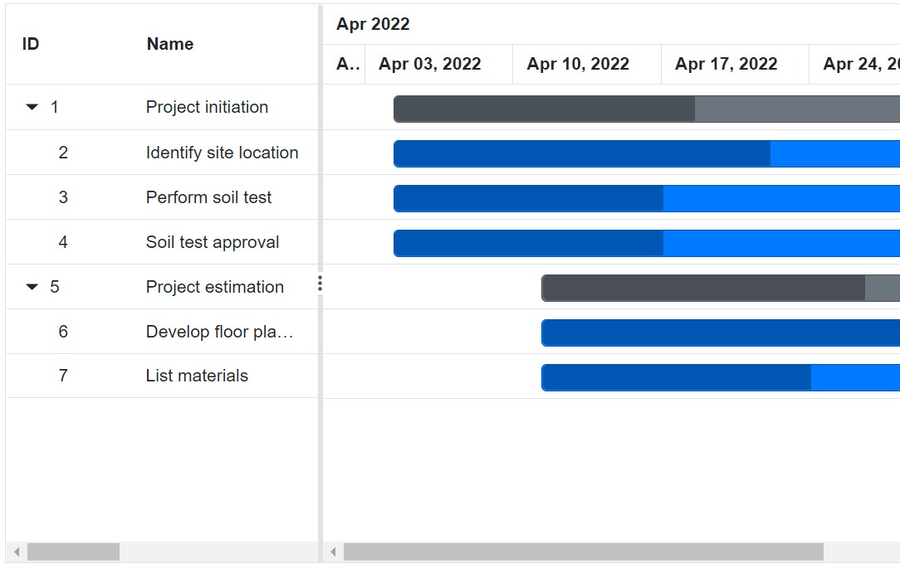

# Time Line in Blazor Gantt Chart Component

In the [Blazor Gantt Chart](https://www.syncfusion.com/blazor-components/blazor-gantt-chart) component, timeline is used to represent the project duration as individual cells with defined unit and formats.

## Timeline view modes

Gantt Chart contains the following in-built timeline view modes:

* Hour
* Week
* Month
* Year

Timescale mode in Gantt Chart can be defined by using [GanttTimelineSettings.TimelineViewMode](https://help.syncfusion.com/cr/blazor/Syncfusion.Blazor.Gantt.GanttTimelineSettings.html#Syncfusion_Blazor_Gantt_GanttTimelineSettings_TimelineViewMode) property and also you can define timescale mode of top tier and bottom tier by using `GanttTopTierSettings.Unit` and `GanttBottomTierSettings.Unit` properties.

Following table explains how top tier and bottom tier unit changes as per `GanttTimelineSettings.TimelineViewMode` property.

Timeline ViewMode | Top tier Unit | Bottom tier Unit
-----|-----|-----
Year | Year | Month
Month | Month | Week
Week | Week | Day
Day | Day | Hour
Hour | Hour | Minute

### Week timeline mode

In the `Week` timeline mode, top tier of the schedule header displays the weeks, where as bottom tier of the header displays the days. Refer the following code example.




@using Syncfusion.Blazor.Gantt
<SfGantt DataSource="@TaskCollection" Height="450px" Width="900px">
    <GanttTaskFields Id="TaskID" Name="TaskName" StartDate="StartDate" EndDate="EndDate"
              Duration="Duration" Progress="Progress" ParentID="ParentID">
    </GanttTaskFields>
    <GanttTimelineSettings TimelineViewMode="TimelineViewMode.Week"></GanttTimelineSettings>
</SfGantt>

@code{
    private List<TaskData> TaskCollection { get; set; }
    protected override void OnInitialized()
    {
        this.TaskCollection = GetTaskCollection();
    }

    public class TaskData
    {
        public int TaskID { get; set; }
        public string TaskName { get; set; }
        public DateTime StartDate { get; set; }
        public DateTime? EndDate { get; set; }
        public string Duration { get; set; }
        public int Progress { get; set; }
        public int? ParentID { get; set; }
    }

    public static List<TaskData> GetTaskCollection()
    {
        List<TaskData> Tasks = new List<TaskData>()
        {
            new TaskData() { TaskID = 1, TaskName = "Project initiation", StartDate = new DateTime(2022, 04, 05), EndDate = new DateTime(2022, 04, 11), },
            new TaskData() { TaskID = 2, TaskName = "Identify site location", StartDate = new DateTime(2022, 04, 05), Duration = "5", Progress = 70, ParentID = 1 },
            new TaskData() { TaskID = 3, TaskName = "Perform soil test", StartDate = new DateTime(2022, 04, 05), Duration = "5", Progress = 50, ParentID = 1 },
            new TaskData() { TaskID = 4, TaskName = "Soil test approval", StartDate = new DateTime(2022, 04, 05), Duration = "5", Progress = 50, ParentID = 1 },
            new TaskData() { TaskID = 5, TaskName = "Project estimation", StartDate = new DateTime(2022, 04, 06), EndDate = new DateTime(2022, 04, 12), },
            new TaskData() { TaskID = 6, TaskName = "Develop floor plan for estimation", StartDate = new DateTime(2022, 04, 06), Duration = "5", Progress = 70, ParentID = 5 },
            new TaskData() { TaskID = 7, TaskName = "List materials", StartDate = new DateTime(2022, 04, 06), Duration = "5", Progress = 50, ParentID = 5 },
        };
        return Tasks;
    }
}






### Month timeline mode

In the `Month` timeline mode, top tier of the schedule header displays the months, whereas bottom tier of the schedule header displays its corresponding weeks. Refer the following code example.




@using Syncfusion.Blazor.Gantt
<SfGantt DataSource="@TaskCollection" Height="450px" Width="900px">
    <GanttTaskFields Id="TaskID" Name="TaskName" StartDate="StartDate" EndDate="EndDate"
               Duration="Duration" Progress="Progress" ParentID="ParentID">
    </GanttTaskFields>
    <GanttTimelineSettings TimelineUnitSize=120 TimelineViewMode="TimelineViewMode.Month"></GanttTimelineSettings>
</SfGantt>

@code{
    private List<TaskData> TaskCollection { get; set; }
    protected override void OnInitialized()
    {
        this.TaskCollection = GetTaskCollection();
    }

    public class TaskData
    {
        public int TaskID { get; set; }
        public string TaskName { get; set; }
        public DateTime StartDate { get; set; }
        public DateTime? EndDate { get; set; }
        public string Duration { get; set; }
        public int Progress { get; set; }
        public int? ParentID { get; set; }
    }

    public static List<TaskData> GetTaskCollection()
    {
        List<TaskData> Tasks = new List<TaskData>()
        {
            new TaskData() { TaskID = 1, TaskName = "Project initiation", StartDate = new DateTime(2022, 04, 05), EndDate = new DateTime(2022, 05, 02), },
            new TaskData() { TaskID = 2, TaskName = "Identify site location", StartDate = new DateTime(2022, 04, 05), Duration = "20", Progress = 70, ParentID = 1 },
            new TaskData() { TaskID = 3, TaskName = "Perform soil test", StartDate = new DateTime(2022, 04, 05), Duration = "20", Progress = 50, ParentID = 1 },
            new TaskData() { TaskID = 4, TaskName = "Soil test approval", StartDate = new DateTime(2022, 04, 05), Duration = "20", Progress = 50, ParentID = 1 },
            new TaskData() { TaskID = 5, TaskName = "Project estimation", StartDate = new DateTime(2022, 04, 06), EndDate = new DateTime(2022, 05, 03), },
            new TaskData() { TaskID = 6, TaskName = "Develop floor plan for estimation", StartDate = new DateTime(2022, 04, 06), Duration = "20", Progress = 70, ParentID = 5 },
            new TaskData() { TaskID = 7, TaskName = "List materials", StartDate = new DateTime(2022, 04, 06), Duration = "20", Progress = 50, ParentID = 5 },
        };
        return Tasks;
    }
}






### Year timeline mode

In the `Year` timeline mode, top tier of the schedule header displays the years, where as bottom tier of the schedule header displays its corresponding months. Refer the following code example.




@using Syncfusion.Blazor.Gantt
<SfGantt DataSource="@TaskCollection" Height="450px" Width="900px">
    <GanttTaskFields Id="TaskID" Name="TaskName" StartDate="StartDate" EndDate="EndDate"
                Duration="Duration" Progress="Progress" ParentID="ParentID">
    </GanttTaskFields>
    <GanttTimelineSettings TimelineUnitSize=75 TimelineViewMode="TimelineViewMode.Year">
    </GanttTimelineSettings>
</SfGantt>

@code{
    private List<TaskData> TaskCollection { get; set; }
    protected override void OnInitialized()
    {
        this.TaskCollection = GetTaskCollection();
    }

    public class TaskData
    {
        public int TaskID { get; set; }
        public string TaskName { get; set; }
        public DateTime StartDate { get; set; }
        public DateTime? EndDate { get; set; }
        public string Duration { get; set; }
        public int Progress { get; set; }
        public int? ParentID { get; set; }
    }

    public static List<TaskData> GetTaskCollection()
    {
        List<TaskData> Tasks = new List<TaskData>()
        {
            new TaskData() { TaskID = 1, TaskName = "Project initiation", StartDate = new DateTime(2022, 04, 05), EndDate = new DateTime(2022, 04, 13), },
            new TaskData() { TaskID = 2, TaskName = "Identify site location", StartDate = new DateTime(2022, 04, 05), Duration = "50", Progress = 70, ParentID = 1 },
            new TaskData() { TaskID = 3, TaskName = "Perform soil test", StartDate = new DateTime(2022, 04, 05), Duration = "50", Progress = 50, ParentID = 1 },
            new TaskData() { TaskID = 4, TaskName = "Soil test approval", StartDate = new DateTime(2022, 04, 05), Duration = "50", Progress = 50, ParentID = 1 },
            new TaskData() { TaskID = 5, TaskName = "Project estimation", StartDate = new DateTime(2022, 05, 06), EndDate = new DateTime(2022, 09, 14), },
            new TaskData() { TaskID = 6, TaskName = "Develop floor plan for estimation", StartDate = new DateTime(2022, 05, 06), Duration = "50", Progress = 70, ParentID = 5 },
            new TaskData() { TaskID = 7, TaskName = "List materials", StartDate = new DateTime(2022, 05, 06), Duration = "50", Progress = 50, ParentID = 5 },
        };
        return Tasks;
    }
}






### Day timeline mode

In the `Day` timeline mode, top tier of the schedule header displays the days, where as the bottom tier of the schedule header displays its corresponding hours. Refer the following code example.




@using Syncfusion.Blazor.Gantt
<SfGantt DataSource="@TaskCollection" DurationUnit="DurationUnit.Hour" Height="450px" Width="900px">
    <GanttTaskFields Id="TaskID" Name="TaskName" StartDate="StartDate" EndDate="EndDate"
              Duration="Duration" Progress="Progress" ParentID="ParentID">
    </GanttTaskFields>
    <GanttTimelineSettings TimelineViewMode="TimelineViewMode.Day"></GanttTimelineSettings>
</SfGantt>

@code{
    private List<TaskData> TaskCollection { get; set; }
    protected override void OnInitialized()
    {
        this.TaskCollection = GetTaskCollection();
    }

    public class TaskData
    {
        public int TaskID { get; set; }
        public string TaskName { get; set; }
        public DateTime StartDate { get; set; }
        public DateTime? EndDate { get; set; }
        public string Duration { get; set; }
        public int Progress { get; set; }
        public int? ParentID { get; set; }
    }

    public static List<TaskData> GetTaskCollection()
    {
        List<TaskData> Tasks = new List<TaskData>()
        {
            new TaskData() { TaskID = 1, TaskName = "Project initiation", StartDate = new DateTime(2022, 04, 05), EndDate = new DateTime(2022, 04, 05), },
            new TaskData() { TaskID = 2, TaskName = "Identify site location", StartDate = new DateTime(2022, 04, 05, 09, 0, 0), Duration = "5", Progress = 70, ParentID = 1 },
            new TaskData() { TaskID = 3, TaskName = "Perform soil test", StartDate = new DateTime(2022, 04, 05, 09, 0, 0), Duration = "5", Progress = 50, ParentID = 1 },
            new TaskData() { TaskID = 4, TaskName = "Soil test approval", StartDate = new DateTime(2022, 04, 05, 09, 0, 0), Duration = "5", Progress = 50, ParentID = 1 },
            new TaskData() { TaskID = 5, TaskName = "Project estimation", StartDate = new DateTime(2022, 04, 06), EndDate = new DateTime(2022, 04, 06), },
            new TaskData() { TaskID = 6, TaskName = "Develop floor plan for estimation", StartDate = new DateTime(2022, 04, 06, 11, 0, 0), Duration = "5", Progress = 70, ParentID = 5 },
            new TaskData() { TaskID = 7, TaskName = "List materials", StartDate = new DateTime(2022, 04, 06, 11, 0, 0), Duration = "5", Progress = 50, ParentID = 5 },
        };
        return Tasks;
    }   
}






### Hour timeline mode

An `Hour` timeline mode tracks the tasks in minutes scale. In this mode, the top tier of the schedule header displays hour scale and the bottom tier of the header displays its corresponding minutes.




@using Syncfusion.Blazor.Gantt
<SfGantt DataSource="@TaskCollection" DurationUnit="DurationUnit.Minute" Height="450px" Width="900px">
    <GanttTaskFields Id="TaskID" Name="TaskName" StartDate="StartDate" EndDate="EndDate"
               Duration="Duration" Progress="Progress" ParentID="ParentID">
    </GanttTaskFields>
    <GanttTimelineSettings TimelineViewMode="TimelineViewMode.Hour"></GanttTimelineSettings>
</SfGantt>

@code{
    private List<TaskData> TaskCollection { get; set; }
    protected override void OnInitialized()
    {
        this.TaskCollection = GetTaskCollection();
    }

    public class TaskData
    {
        public int TaskID { get; set; }
        public string TaskName { get; set; }
        public DateTime StartDate { get; set; }
        public DateTime? EndDate { get; set; }
        public string Duration { get; set; }
        public int Progress { get; set; }
        public int? ParentID { get; set; }
    }

    public static List<TaskData> GetTaskCollection()
    {
        List<TaskData> Tasks = new List<TaskData>()
        {
            new TaskData() { TaskID = 1, TaskName = "Project initiation", StartDate = new DateTime(2022, 04, 05), EndDate = new DateTime(2022, 04, 05), },
            new TaskData() { TaskID = 2, TaskName = "Identify site location", StartDate = new DateTime(2022, 04, 05, 8, 4, 0), Duration = "5", Progress = 70, ParentID = 1 },
            new TaskData() { TaskID = 3, TaskName = "Perform soil test", StartDate = new DateTime(2022, 04, 05, 8, 4, 0), Duration = "5", Progress = 50, ParentID = 1 },
            new TaskData() { TaskID = 4, TaskName = "Soil test approval", StartDate = new DateTime(2022, 04, 05, 8, 4, 0), Duration = "5", Progress = 50, ParentID = 1 },
            new TaskData() { TaskID = 5, TaskName = "Project estimation", StartDate = new DateTime(2022, 04, 06), EndDate = new DateTime(2022, 04, 06), },
            new TaskData() { TaskID = 6, TaskName = "Develop floor plan for estimation", StartDate = new DateTime(2022, 04, 06, 8, 10, 0), Duration = "5", Progress = 70, ParentID = 5 },
            new TaskData() { TaskID = 7, TaskName = "List materials", StartDate = new DateTime(2022, 04, 06, 8, 10, 0), Duration = "5", Progress = 50, ParentID = 5 },
        };
        return Tasks;
    }
}






## Week start day customization

In the Gantt Chart component, you can customize the week start day using the `GanttTimelineSettings.WeekStartDay` property. By default,the `GanttTimelineSettings.WeekStartDay` is set to 0, which specifies the Sunday as a start day of the week. But, you can customize the week start day by using the following code example.




@using Syncfusion.Blazor.Gantt
<SfGantt DataSource="@TaskCollection" Height="450px" Width="1000px">
    <GanttTaskFields Id="TaskID" Name="TaskName" StartDate="StartDate" EndDate="EndDate"
              Duration="Duration" Progress="Progress" ParentID="ParentID">
    </GanttTaskFields>
    <GanttTimelineSettings WeekStartDay=3></GanttTimelineSettings>
</SfGantt>

@code{
    private List<TaskData> TaskCollection { get; set; }
    protected override void OnInitialized()
    {
        this.TaskCollection = GetTaskCollection();
    }

    public class TaskData
    {
        public int TaskID { get; set; }
        public string TaskName { get; set; }
        public DateTime StartDate { get; set; }
        public DateTime? EndDate { get; set; }
        public string Duration { get; set; }
        public int Progress { get; set; }
        public int? ParentID { get; set; }
    }

    public static List<TaskData> GetTaskCollection()
    {
        List<TaskData> Tasks = new List<TaskData>()
        {
            new TaskData() { TaskID = 1, TaskName = "Project initiation", StartDate = new DateTime(2022, 04, 05), EndDate = new DateTime(2022, 04, 08), },
            new TaskData() { TaskID = 2, TaskName = "Identify Site location", StartDate = new DateTime(2022, 04, 05), Duration = "0", Progress = 30, ParentID = 1 },
            new TaskData() { TaskID = 3, TaskName = "Perform soil test", StartDate = new DateTime(2022, 04, 05), Duration = "4", Progress = 40, ParentID = 1 },
            new TaskData() { TaskID = 4, TaskName = "Soil test approval", StartDate = new DateTime(2022, 04, 05), Duration = "0", Progress = 30, ParentID = 1 },
            new TaskData() { TaskID = 5, TaskName = "Project estimation", StartDate = new DateTime(2022, 04, 06), EndDate = new DateTime(2022, 04, 08), },
            new TaskData() { TaskID = 6, TaskName = "Develop floor plan for estimation", StartDate = new DateTime(2022, 04, 06), Duration = "3", Progress = 30, ParentID = 5 },
            new TaskData() { TaskID = 7, TaskName = "List materials", StartDate = new DateTime(2022, 04, 06), Duration = "3", Progress = 40, ParentID = 5 },
            new TaskData() { TaskID = 8, TaskName = "Estimation approval", StartDate = new DateTime(2022, 04, 06), Duration = "0", Progress = 30, ParentID = 5 }
        };
        return Tasks;
    }
}






## Customize automatic timescale update action

In the Gantt Chart component, the schedule timeline will be automatically updated when the tasks date values are updated beyond the project start date and end date ranges. This can be enabled or disabled using the `GanttTimelineSettings.UpdateTimescaleView` property.




@using Syncfusion.Blazor.Gantt
<SfGantt DataSource="@TaskCollection" Height="450px" Width="700px">
    <GanttTaskFields Id="TaskID" Name="TaskName" StartDate="StartDate" EndDate="EndDate"
             Duration="Duration" Progress="Progress" ParentID="ParentID">
    </GanttTaskFields>
    <GanttEditSettings AllowEditing="true" AllowTaskbarEditing="true"></GanttEditSettings>
    <GanttTimelineSettings UpdateTimescaleView="false"></GanttTimelineSettings>
</SfGantt>

@code{
    private List<TaskData> TaskCollection { get; set; }
    protected override void OnInitialized()
    {
        this.TaskCollection = GetTaskCollection();
    }

    public class TaskData
    {
        public int TaskID { get; set; }
        public string TaskName { get; set; }
        public DateTime StartDate { get; set; }
        public DateTime? EndDate { get; set; }
        public string Duration { get; set; }
        public int Progress { get; set; }
        public int? ParentID { get; set; }
    }

    public static List<TaskData> GetTaskCollection()
    {
        List<TaskData> Tasks = new List<TaskData>()
        {
            new TaskData() { TaskID = 1, TaskName = "Project initiation", StartDate = new DateTime(2022, 04, 05), EndDate = new DateTime(2022, 04, 08), },
            new TaskData() { TaskID = 2, TaskName = "Identify Site location", StartDate = new DateTime(2022, 04, 05), Duration = "0", Progress = 30, ParentID = 1 },
            new TaskData() { TaskID = 3, TaskName = "Perform soil test", StartDate = new DateTime(2022, 04, 05), Duration = "4", Progress = 40, ParentID = 1 },
            new TaskData() { TaskID = 4, TaskName = "Soil test approval", StartDate = new DateTime(2022, 04, 05), Duration = "0", Progress = 30, ParentID = 1 },
            new TaskData() { TaskID = 5, TaskName = "Project estimation", StartDate = new DateTime(2022, 04, 06), EndDate = new DateTime(2022, 04, 08), },
            new TaskData() { TaskID = 6, TaskName = "Develop floor plan for estimation", StartDate = new DateTime(2022, 04, 06), Duration = "3", Progress = 30, ParentID = 5 },
            new TaskData() { TaskID = 7, TaskName = "List materials", StartDate = new DateTime(2022, 04, 06), Duration = "3", Progress = 40, ParentID = 5 },
            new TaskData() { TaskID = 8, TaskName = "Estimation approval", StartDate = new DateTime(2022, 04, 06), Duration = "0", Progress = 30, ParentID = 5 }
        };
        return Tasks;
    }
}






## Timeline cells tooltip

In the Gantt Chart component, you can enable or disable the mouse hover tooltip of timeline cells using the [GanttTimelineSettings.ShowTooltip](https://help.syncfusion.com/cr/blazor/Syncfusion.Blazor.Gantt.GanttTimelineSettings.html#Syncfusion_Blazor_Gantt_GanttTimelineSettings_ShowTooltip) property. The default value of this property is true. The following code example shows how to enable the timeline cells tooltip in Gantt Chart.




@using Syncfusion.Blazor.Gantt
<SfGantt DataSource="@TaskCollection" Height="450px" Width="700px">
    <GanttTaskFields Id="TaskID" Name="TaskName" StartDate="StartDate" EndDate="EndDate"
                     Duration="Duration" Progress="Progress" ParentID="ParentID">
    </GanttTaskFields>
    <GanttTimelineSettings ShowTooltip="true"></GanttTimelineSettings>
</SfGantt>

@code{
    private List<TaskData> TaskCollection { get; set; }
    protected override void OnInitialized()
    {
        this.TaskCollection = GetTaskCollection();
    }

    public class TaskData
    {
        public int TaskID { get; set; }
        public string TaskName { get; set; }
        public DateTime StartDate { get; set; }
        public DateTime EndDate { get; set; }
        public string Duration { get; set; }
        public int Progress { get; set; }
        public int? ParentID { get; set; }
    }

    private static List<TaskData> GetTaskCollection()
    {
        List<TaskData> Tasks = new List<TaskData>() 
        {
            new TaskData() { TaskID = 1, TaskName = "Project initiation", StartDate = new DateTime(2022, 01, 04), EndDate = new DateTime(2022, 01, 07), },
            new TaskData() { TaskID = 2, TaskName = "Identify site location", StartDate = new DateTime(2022, 01, 04), Duration = "4", Progress = 70, ParentID = 1, },
            new TaskData() { TaskID = 3, TaskName = "Perform soil test", StartDate = new DateTime(2022, 01, 04), Duration = "4", Progress = 50, ParentID = 1, },
            new TaskData() { TaskID = 4, TaskName = "Soil test approval", StartDate = new DateTime(2022, 01, 04), Duration = "4", Progress = 50, ParentID = 1, },
            new TaskData() { TaskID = 5, TaskName = "Project estimation", StartDate = new DateTime(2022, 01, 04), EndDate = new DateTime(2022, 01, 10), },
            new TaskData() { TaskID = 6, TaskName = "Develop floor plan for estimation", StartDate = new DateTime(2022, 01, 06), Duration = "3", Progress = 70, ParentID = 5, },
            new TaskData() { TaskID = 7, TaskName = "List materials", StartDate = new DateTime(2022, 01, 04), Duration = "3", Progress = 50, ParentID = 5, }
        };
        return Tasks;
    }
}






### Template

Customizing the timeline cell tooltip in a Gantt Chart using [GanttTooltipSettings.TimelineCellTemplate](https://help.syncfusion.com/cr/blazor/Syncfusion.Blazor.Gantt.GanttTooltipSettings-1.html#Syncfusion_Blazor_Gantt_GanttTooltipSettings_1_TimelineCellTemplate) allows you to display additional information and elements in a more visually appealing and informative way. By combining data bindings and CSS styles, you can create custom templates that suit your specific needs and use cases. The following code example shows how to customize the timeline cell tooltip in Gantt Chart.




@using Syncfusion.Blazor.Gantt

<SfGantt @ref="Gantt" DataSource="@TaskCollection" Height="450px" Width="1000px">
    <GanttTaskFields Id="TaskID" Name="TaskName" StartDate="StartDate" EndDate="EndDate" Duration="Duration"
                     Progress="Progress" ParentID="ParentID">
    </GanttTaskFields>
    <GanttTimelineSettings ShowTooltip="true"></GanttTimelineSettings>
    <GanttTooltipSettings TValue="TaskData">
       <TimelineCellTemplate> 
            @{ 
                var timelineCell = context as string; 
                

                    <i class="app-icon-calendar"></i>
                    @timelineCell 
                

         } 
        </TimelineCellTemplate>
    </GanttTooltipSettings>
</SfGantt>
@code {
    public SfGantt<TaskData> Gantt;
    public List<TaskData> TaskCollection { get; set; }
    private DateTime ProjectStartDate = new DateTime(2021, 04, 02);
    private DateTime ProjectEndDate = new DateTime(2022, 01, 01);
    protected override void OnInitialized()
    {
        this.TaskCollection = EditingData();
    }
    public class TaskData
    {
        public int TaskID { get; set; }
        public string TaskName { get; set; }
        public DateTime? StartDate { get; set; }
        public DateTime? EndDate { get; set; }
        public string Duration { get; set; }
        public int Progress { get; set; }
        public string Predecessor { get; set; }
        public string Notes { get; set; }
        public int? ParentID { get; set; }
    }
    public static List<TaskData> EditingData()
    {
        List<TaskData> Tasks = new List<TaskData>() {
        new TaskData() { TaskID = 1, TaskName = "Product concept", StartDate = new DateTime(2021, 04, 29), EndDate = new DateTime(2021, 04, 08), Duration = "5 days" },
        new TaskData() { TaskID = 2, TaskName = "Defining the product usage", StartDate = new DateTime(2021, 04, 01), EndDate = new DateTime(2021, 04, 08), Duration = "3", Progress = 30, ParentID = 1 },
        new TaskData() { TaskID = 3, TaskName = "Defining the target audience", StartDate = new DateTime(2021, 04, 02), EndDate = new DateTime(2021, 04, 04), Duration = "3", Progress = 40, ParentID = 2 },
        new TaskData() { TaskID = 4, TaskName = "Prepare product sketch and notes", StartDate = new DateTime(2021, 03, 28), EndDate = new DateTime(2021, 04, 08), Duration = "2", Progress = 30, ParentID = 3, Predecessor="2" },
        new TaskData() { TaskID = 5, TaskName = "Concept approval", StartDate = new DateTime(2021, 04, 08), EndDate = new DateTime(2021, 04, 08), Duration="0",Predecessor="3,4" },
        new TaskData() { TaskID = 6, TaskName = "Market research", StartDate = new DateTime(2021, 04, 09), EndDate = new DateTime(2021, 04, 14), Predecessor="2", Duration = "4", Progress = 30 },
        new TaskData() { TaskID = 7, TaskName = "Demand analysis", StartDate = new DateTime(2021, 04, 09), EndDate = new DateTime(2021, 04, 12), Duration = "4", Progress = 40, ParentID = 6 },
        new TaskData() { TaskID = 8, TaskName = "Customer strength", StartDate = new DateTime(2021, 04, 09), EndDate = new DateTime(2021, 04, 12), Duration = "4", Progress = 30, ParentID = 7, Predecessor="5" },
    };
        return Tasks;
    }
}




