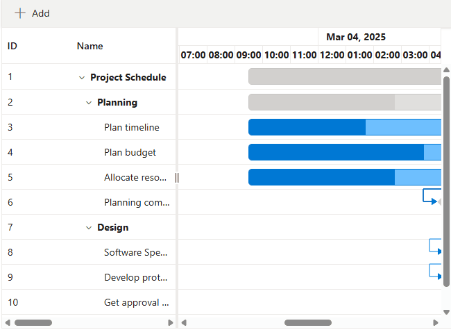

# Timezone support in Blazor Gantt Chart

The [Blazor Gantt Chart](https://www.syncfusion.com/blazor-components/blazor-gantt-chart) component schedules and displays dates and times based on the system timezone. To configure the Gantt Chart to use a specific timezone, assign the desired value to the [Timezone](https://help.syncfusion.com/cr/blazor/Syncfusion.Blazor.Gantt.SfGantt-1.html#Syncfusion_Blazor_Gantt_SfGantt_1_Timezone) property. This ensures that all task dates and times are interpreted and rendered according to the specified timezone.

## Timezone conversion behavior in the Gantt chart

The Gantt chart component provides a `Timezone` property that accepts a string value defining the desired time zone (such as "UTC" or "America/New_York"). When this property is set, all relevant dates including those used in tasks, event markers, baseline dates, and indicators are converted and displayed according to the specified timezone.

When a `DateTime` value is defined as `new DateTime(2019, 2, 4, 8, 0, 0)` and the `Timezone` property is set to `"America/New_York"`, the time is automatically converted from the local system timezone to the target timezone. For instance, `2019-02-04 08:00:00` (local time) will be displayed as `2019-02-03 09:30 PM` if the system is set to a timezone such as `"Asia/Kolkata"` (UTC+05:30) and the desired output is `"America/New_York"` (UTC-05:00 at that date due to standard time).

## Setting the Timezone
The `Timezone` property can be set directly when defining the Gantt Chart component. For consistent handling, standard IANA time zone names (such as `UTC`, `America/New_York`, `Europe/London`) are supported.

```cshtml
@using Syncfusion.Blazor.Gantt
@using Syncfusion.Blazor.DropDowns
@using Syncfusion.Blazor.Navigations
<SfGantt DataSource="@TaskCollection" Toolbar="@toolbarItems" DateFormat="d MMM yyyy hh:mm tt" IncludeWeekend="true" DurationUnit="DurationUnit.Hour" Height="475px" Width="650px" Timezone="@TimeZone"
         TreeColumnIndex="1">
    <GanttTaskFields Id="TaskId" Name="TaskName" StartDate="StartDate" EndDate="EndDate" Duration="Duration" Progress="Progress"
                     Dependency="Predecessor" ParentID="ParentId"></GanttTaskFields>
    <GanttDayWorkingTimeCollection>
        <GanttDayWorkingTime From="0" To="23"></GanttDayWorkingTime>
    </GanttDayWorkingTimeCollection>
    <GanttTimelineSettings TimelineUnitSize="40">
        <GanttTopTierSettings Unit="TimelineViewMode.Day" Format="MMM dd, yyyy"></GanttTopTierSettings>
        <GanttBottomTierSettings Unit="TimelineViewMode.Hour" Count="1" Format="hh:mm"></GanttBottomTierSettings>
    </GanttTimelineSettings>
</SfGantt>
@code {
    public List<TaskData>? TaskCollection { get; set; }
    private List<Object>? toolbarItems;
    public string TimeZone { get; set; } = "America/New_York";
    public string SelectedTimeZone { get; set; } = "America/New_York";
    public class TimeZoneFields
    {
        public string? Id { get; set; }
        public string? Text { get; set; }
    }
    private static List<TimeZoneFields> TimeZoneValues = new List<TimeZoneFields>()
    {
        new TimeZoneFields { Id = "Etc/UTC", Text = "(UTC) Coordinated Universal Time" },
        new TimeZoneFields { Id = "America/New_York", Text = "(UTC-05:00) Eastern Time (US & Canada)" },
        new TimeZoneFields { Id = "America/Chicago", Text = "(UTC-06:00) Central Time (US & Canada)" },
        new TimeZoneFields { Id = "America/Denver", Text = "(UTC-07:00) Mountain Time (US & Canada)" },
        new TimeZoneFields { Id = "Europe/London", Text = "(UTC+00:00) Dublin, Edinburgh, Lisbon, London" },
        new TimeZoneFields { Id = "Europe/Berlin", Text = "(UTC+01:00) Amsterdam, Berlin, Rome, Vienna, Stockholm" },
        new TimeZoneFields { Id = "Asia/Kolkata", Text = "(UTC+05:30) Chennai, Kolkata, Mumbai, New Delhi" },
        new TimeZoneFields { Id = "Asia/Tokyo", Text = "(UTC+09:00) Osaka, Sapporo, Tokyo" }
    };
    protected override void OnInitialized()
    {
        TaskCollection = GetTaskCollection().ToList();
        toolbarItems = new List<object>()
        {
            new ItemModel
            {
                Id = "TimeZoneDropDown",
                Align = ItemAlign.Left,
                Template = (RenderFragment)(builder =>
                {
                    builder.OpenComponent<SfDropDownList<string, TimeZoneFields>>(0);
                    builder.AddAttribute(1, "Width", "350px");
                    builder.AddAttribute(2, "DataSource", TimeZoneValues);
                    builder.AddAttribute(3, "Placeholder", "Select a Timezone");
                    builder.AddAttribute(4, "Value", SelectedTimeZone);
                    builder.AddAttribute(5, "ValueChanged", EventCallback.Factory.Create<string>(this, v => SelectedTimeZone = v));
                    builder.AddAttribute(6, "Text", "Text");
                    builder.AddAttribute(7, "ValueField", "Id");
                    builder.AddAttribute(8, "TItem", typeof(TimeZoneFields));
                    builder.AddAttribute(9, "ChildContent", (RenderFragment)(childBuilder =>
                    {
                        childBuilder.OpenComponent<DropDownListFieldSettings>(0);
                        childBuilder.AddAttribute(1, "Text", "Text");
                        childBuilder.AddAttribute(2, "Value", "Id");
                        childBuilder.CloseComponent();
                        childBuilder.OpenComponent<DropDownListEvents<string, TimeZoneFields>>(3);
                        childBuilder.AddAttribute(4, "ValueChange", EventCallback.Factory.Create<ChangeEventArgs<string, TimeZoneFields>>(this, OnTimeZoneChanged));
                        childBuilder.CloseComponent();
                    }));
                    builder.CloseComponent();
                })
            },
        };
    }
    public async Task OnTimeZoneChanged(Syncfusion.Blazor.DropDowns.ChangeEventArgs<string, TimeZoneFields> args)
    {
        if (!string.IsNullOrEmpty(args.Value))
        {
            SelectedTimeZone = args.Value;
            TimeZone = args.Value;
        }
        await Task.CompletedTask;
    }
    public class TaskData
    {
        public int TaskId { get; set; }
        public string? TaskName { get; set; }
        public DateTime? StartDate { get; set; }
        public DateTime? EndDate { get; set; }
        public string? Duration { get; set; }
        public int Progress { get; set; }
        public string? Predecessor { get; set; }
        public int? ParentId { get; set; }
    }
    public static List<TaskData> GetTaskCollection()
    {
        List<TaskData> Tasks = new List<TaskData>()
        {
            new TaskData { TaskId = 1, TaskName = "Project Schedule", StartDate = new DateTime(2025, 3, 4, 8, 0, 0), EndDate = new DateTime(2025, 4, 10, 0, 0, 0), Progress = 0 },
            new TaskData { TaskId = 2, TaskName = "Planning", StartDate = new DateTime(2025, 3, 4, 8, 0, 0), EndDate = new DateTime(2025, 3, 10, 0, 0, 0), ParentId = 1, Progress = 0 },
            new TaskData { TaskId = 3, TaskName = "Plan timeline", StartDate = new DateTime(2025, 3, 4, 8, 0, 0), EndDate = new DateTime(2025, 3, 10, 0, 0, 0), Duration = "6", Progress = 60, ParentId = 2 },
            new TaskData { TaskId = 4, TaskName = "Plan budget", StartDate = new DateTime(2025, 3, 4, 8, 0, 0), EndDate = new DateTime(2025, 3, 10, 0, 0, 0), Duration = "6", Progress = 90, ParentId = 2 },
            new TaskData { TaskId = 5, TaskName = "Allocate resources", StartDate = new DateTime(2025, 3, 4, 8, 0, 0), EndDate = new DateTime(2025, 3, 10, 0, 0, 0), Duration = "6", Progress = 75, ParentId = 2 },
            new TaskData { TaskId = 6, TaskName = "Planning complete", StartDate = new DateTime(2025, 3, 6, 8, 0, 0), EndDate = new DateTime(2025, 3, 10, 0, 0, 0), Duration = "0", Predecessor = "3FS,4FS,5FS", ParentId = 2, Progress = 0 },
            new TaskData { TaskId = 7, TaskName = "Design", StartDate = new DateTime(2025, 3, 13, 8, 0, 0), EndDate = new DateTime(2025, 3, 17, 8, 0, 0), ParentId = 1, Progress = 0 },
            new TaskData { TaskId = 8, TaskName = "Software Specification", StartDate = new DateTime(2025, 3, 13, 8, 0, 0), EndDate = new DateTime(2025, 3, 15, 0, 0, 0), Duration = "3", Progress = 60, Predecessor = "6FS", ParentId = 7 },
            new TaskData { TaskId = 9, TaskName = "Develop prototype", StartDate = new DateTime(2025, 3, 13, 8, 0, 0), EndDate = new DateTime(2025, 3, 15, 0, 0, 0), Duration = "3", Progress = 100, Predecessor = "6FS", ParentId = 7 },
            new TaskData { TaskId = 10, TaskName = "Get approval from customer", StartDate = new DateTime(2025, 3, 16, 8, 0, 0), EndDate = new DateTime(2025, 3, 17, 8, 0, 0), Duration = "2", Progress = 100, Predecessor = "9FS", ParentId = 7 },
            new TaskData { TaskId = 11, TaskName = "Design complete", StartDate = new DateTime(2025, 3, 17, 8, 0, 0), EndDate = new DateTime(2025, 3, 17, 8, 0, 0), Duration = "0", Predecessor = "10FS", ParentId = 7, Progress = 0 }
        };
        return Tasks;
    }
}
```


### CRUD Operations with Timezone

All crud operations in the Gantt chart are performed according to the configured `Timezone` property. When adding a record, the start date is determined based on the minimum start date in the current data set and applied as per the specified timezone. Similarly, editing and exporting records use the date and time values as displayed in the defined timezone, ensuring consistency in user interaction, data storage, and output.

```cshtml
@using Syncfusion.Blazor.Gantt

<SfGantt DataSource="@TaskCollection" Timezone="America/New_York" Toolbar="@(new List<string>() { "Add", "Edit", "Delete" })" DateFormat="d MMM yyyy hh:mm tt" IncludeWeekend="true" DurationUnit="DurationUnit.Hour" Height="475px" Width="650px"
         TreeColumnIndex="1">
    <GanttTaskFields Id="TaskId" Name="TaskName" StartDate="StartDate" EndDate="EndDate" Duration="Duration" Progress="Progress"
                     Dependency="Predecessor" ParentID="ParentId"></GanttTaskFields>
    <GanttDayWorkingTimeCollection>
        <GanttDayWorkingTime From="0" To="23"></GanttDayWorkingTime>
    </GanttDayWorkingTimeCollection>
    <GanttEditSettings AllowAdding="true" AllowDeleting="true" AllowEditing="true" AllowTaskbarEditing="true"></GanttEditSettings>
    <GanttTimelineSettings TimelineUnitSize="40">
        <GanttTopTierSettings Unit="TimelineViewMode.Day" Format="MMM dd, yyyy"></GanttTopTierSettings>
        <GanttBottomTierSettings Unit="TimelineViewMode.Hour" Count="1" Format="hh:mm"></GanttBottomTierSettings>
    </GanttTimelineSettings>
</SfGantt>
@code {
    public List<TaskData>? TaskCollection { get; set; }
    
    protected override void OnInitialized()
    {
        TaskCollection = GetTaskCollection().ToList();
    }
    public class TaskData
    {
        public int TaskId { get; set; }
        public string? TaskName { get; set; }
        public DateTime? StartDate { get; set; }
        public DateTime? EndDate { get; set; }
        public string? Duration { get; set; }
        public int Progress { get; set; }
        public string? Predecessor { get; set; }
        public int? ParentId { get; set; }
    }
    public static List<TaskData> GetTaskCollection()
    {
        List<TaskData> Tasks = new List<TaskData>()
        {
            new TaskData { TaskId = 1, TaskName = "Project Schedule", StartDate = new DateTime(2025, 3, 4, 8, 0, 0), EndDate = new DateTime(2025, 4, 10, 0, 0, 0), Progress = 0 },
            new TaskData { TaskId = 2, TaskName = "Planning", StartDate = new DateTime(2025, 3, 4, 8, 0, 0), EndDate = new DateTime(2025, 3, 10, 0, 0, 0), ParentId = 1, Progress = 0 },
            new TaskData { TaskId = 3, TaskName = "Plan timeline", StartDate = new DateTime(2025, 3, 4, 8, 0, 0), EndDate = new DateTime(2025, 3, 10, 0, 0, 0), Duration = "6", Progress = 60, ParentId = 2 },
            new TaskData { TaskId = 4, TaskName = "Plan budget", StartDate = new DateTime(2025, 3, 4, 8, 0, 0), EndDate = new DateTime(2025, 3, 10, 0, 0, 0), Duration = "6", Progress = 90, ParentId = 2 },
            new TaskData { TaskId = 5, TaskName = "Allocate resources", StartDate = new DateTime(2025, 3, 4, 8, 0, 0), EndDate = new DateTime(2025, 3, 10, 0, 0, 0), Duration = "6", Progress = 75, ParentId = 2 },
            new TaskData { TaskId = 6, TaskName = "Planning complete", StartDate = new DateTime(2025, 3, 6, 8, 0, 0), EndDate = new DateTime(2025, 3, 10, 0, 0, 0), Duration = "0", Predecessor = "3FS,4FS,5FS", ParentId = 2, Progress = 0 },
            new TaskData { TaskId = 7, TaskName = "Design", StartDate = new DateTime(2025, 3, 13, 8, 0, 0), EndDate = new DateTime(2025, 3, 17, 8, 0, 0), ParentId = 1, Progress = 0 },
            new TaskData { TaskId = 8, TaskName = "Software Specification", StartDate = new DateTime(2025, 3, 13, 8, 0, 0), EndDate = new DateTime(2025, 3, 15, 0, 0, 0), Duration = "3", Progress = 60, Predecessor = "6FS", ParentId = 7 },
            new TaskData { TaskId = 9, TaskName = "Develop prototype", StartDate = new DateTime(2025, 3, 13, 8, 0, 0), EndDate = new DateTime(2025, 3, 15, 0, 0, 0), Duration = "3", Progress = 100, Predecessor = "6FS", ParentId = 7 },
            new TaskData { TaskId = 10, TaskName = "Get approval from customer", StartDate = new DateTime(2025, 3, 16, 8, 0, 0), EndDate = new DateTime(2025, 3, 17, 8, 0, 0), Duration = "2", Progress = 100, Predecessor = "9FS", ParentId = 7 },
            new TaskData { TaskId = 11, TaskName = "Design complete", StartDate = new DateTime(2025, 3, 17, 8, 0, 0), EndDate = new DateTime(2025, 3, 17, 8, 0, 0), Duration = "0", Predecessor = "10FS", ParentId = 7, Progress = 0 }
        };
        return Tasks;
    }
}
```
